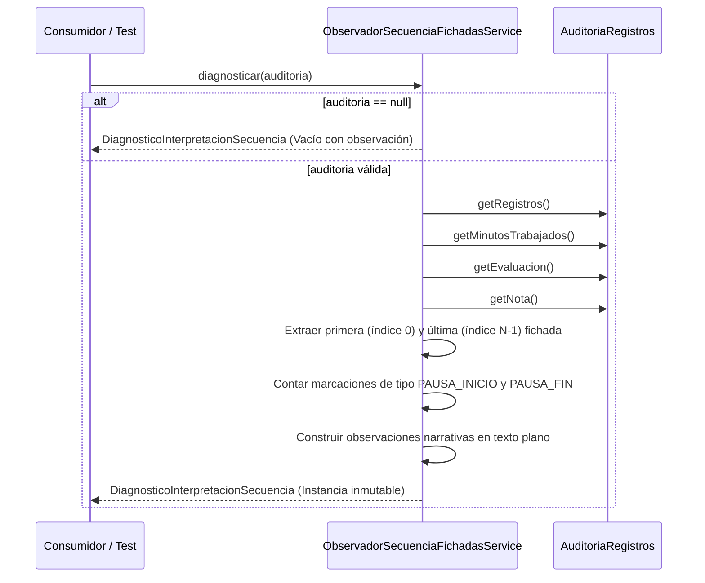

# 08 – Motor de Observación de Secuencias de Fichadas (Diagnóstico Pasivo)

> **Módulo:** Biometric-BH / Diagnóstico Pasivo de Fichadas  
> **Ubicación:** `Software Design Document/08_Motor_Observacion_Secuencias.md`  
> **Estado:** Implementado (Fase 1)  
> **Fecha:** 2026-08-03  

---

## 1. Objetivo

Proporcionar un servicio de observación pasivo y desacoplado que inspeccione una jornada de trabajo y exponga de forma resumida, estructurada y descriptiva la manera exacta en que el motor de `AuditoriaRegistros` ha interpretado la secuencia de fichadas.

Resuelve la necesidad de contar con visibilidad diagnóstica sobre el comportamiento real del motor actual en producción sin alterar ningún cálculo de negocio, sin modificar la base de datos y sin acoplar la solución a la interfaz gráfica ni a la liquidación.

---

## 2. Motivación

En la operación real del sistema de control de asistencia, los empleados generan secuencias de fichadas complejas (por ejemplo: re-fichados por duda, pausas sin cierre, dobles entradas/salidas o marcaciones en días pasados).

Antes de implementar reglas de corrección o alertas en la interfaz gráfica (Fase 2), era imprescindible contar con una herramienta pasiva de observación de Fase 1. Esta herramienta permite describir objetivamente cómo `AuditoriaRegistros` procesa hoy dichas marcaciones y sirve como base documental mediante una batería exhaustiva de pruebas unitarias.

---

## 3. Arquitectura

El motor se estructuró como un **servicio stateless de solo lectura**, desacoplado de la persistencia JPA y de los controladores UI de OpenXava.

```mermaid
graph TD
    subgraph Dominio Existente (Sin Modificaciones)
        AR["AuditoriaRegistros (Dominio)"]
        CR["ColeccionRegistros (Entidad Fichada)"]
        TM["TipoMovimiento (Enum)"]
        EJ["EvaluacionJornada (Enum)"]
    end

    subgraph Servicio Pasivo (Fase 1)
        OSF["ObservadorSecuenciaFichadasService (Servicio)"]
        DIS["DiagnosticoInterpretacionSecuencia (DTO Inmutable)"]
    end

    subgraph Suite de Pruebas Unitarias
        TEST["ObservadorSecuenciaFichadasServiceTest (JUnit 5)"]
    end

    AR --> OSF
    CR --> OSF
    TM --> OSF
    EJ --> OSF
    OSF --> DIS
    TEST --> OSF
    TEST --> AR
```

### Principios Arquitectónicos Aplicados:
- **Aislamiento Total:** El servicio no invoca métodos mutadores ni transaccionales.
- **DTO Desacoplado:** El resultado no exporta objetos de dominio JPA ni listas completas de entidades; únicamente métricas escalares y textos descriptivos.
- **Sin Reinterpretación:** Reutiliza directamente los valores ya calculados en `AuditoriaRegistros` (`minutosTrabajados`, `evaluacion`, `nota`).

---

## 4. Flujo Funcional

El proceso de diagnóstico descriptivo sigue estos pasos:



1. **Recepción:** El servicio recibe la instancia de `AuditoriaRegistros`.
2. **Inspección de Extremos:** Identifica la hora del primer registro (`registros.get(0)`) y del último (`registros.get(N-1)`), que son los límites utilizados por el motor actual.
3. **Detección de Intermedias:** Contabiliza el número de fichadas intermedias (`N - 2`), señalando que no alteran el cálculo de horas en el modelo continuo actual.
4. **Conteo de Pausas:** Identifica registros de pausa (`PAUSA_INICIO` / `PAUSA_FIN`) y explicita en el diagnóstico que son informativos y no restan tiempo del total.
5. **Captura del Resultado:** Toma los minutos trabajados y la evaluación asignada por `AuditoriaRegistros`.
6. **Emisión:** Devuelve el DTO `DiagnosticoInterpretacionSecuencia`.

---

## 5. Reglas de Negocio Observadas

El servicio documenta el comportamiento de las siguientes reglas vigentes del motor:

1. **Regla de Extremos Cronológicos:** El tiempo de trabajo se calcula como la diferencia entre la primera fichada (índice 0) y la última fichada (índice N-1) ordenadas por fecha/hora.
2. **Neutralidad de Fichadas Intermedias:** Las fichadas comprendidas entre la primera y la última no modifican el resultado de `minutosTrabajados`.
3. **Pausas Informativas:** Las marcaciones de pausa quedan registradas pero no se restan de la duración total de la jornada.
4. **Evaluaciones de Fichadas Faltantes:** Si solo existe marcación de entrada en un día pasado, `AuditoriaRegistros` evalúa la jornada como `SIN_SALIDA`. Si solo existe salida, la evalúa como `SIN_ENTRADA`.

---

## 6. Componentes Involucrados

| Componente | Paquete / Archivo | Estado | Descripción |
|------------|-------------------|--------|-------------|
| `DiagnosticoInterpretacionSecuencia` | `com.sta.biometric.auxiliares` | **Nuevo** | DTO inmutable con las métricas y descripciones observadas. |
| `ObservadorSecuenciaFichadasService` | `com.sta.biometric.servicios` | **Nuevo** | Servicio estático de inspección pasiva. |
| `ObservadorSecuenciaFichadasServiceTest` | `src/test/java/com/sta/biometric/servicios` | **Nuevo** | Suite de 12 pruebas unitarias en JUnit 5. |
| `AuditoriaRegistros` | `com.sta.biometric.modelo` | *Sin cambios* | Entidad de dominio consultada (fuente de verdad). |
| `ColeccionRegistros` | `com.sta.biometric.modelo` | *Sin cambios* | Entidad de fichada consultada. |

---

## 7. Configuración

Este módulo de observación pasiva **no requiere ni agrega nuevas propiedades** en `biometricConfiguracion.properties`.

---

## 8. Casos de Uso y Cobertura de Pruebas Unitarias

La suite de pruebas `ObservadorSecuenciaFichadasServiceTest` verifica el diagnóstico descriptivo en los siguientes 12 escenarios reales de producción:

1. **Secuencia estándar (`ENTRADA -> SALIDA`):** 2 fichadas, 0 pausas, intervalo exacto.
2. **Re-fichado por duda (`ENTRADA -> SALIDA -> ENTRADA`):** 3 fichadas, 1 intermedia sin efecto en el total de horas.
3. **Pausa sin Salida (`ENTRADA -> PAUSA_INICIO -> PAUSA_FIN`):** 3 fichadas, 2 pausas detectadas.
4. **Entrada sin Salida (`ENTRADA`):** Evaluada como `SIN_SALIDA` o `EN_CURSO`.
5. **Salida sin Entrada (`SALIDA`):** Evaluada como `SIN_ENTRADA`.
6. **Doble Entrada consecutiva (`ENTRADA -> ENTRADA -> SALIDA`):** 3 fichadas, extrema desde la primera hasta la salida.
7. **Doble Salida consecutiva (`ENTRADA -> SALIDA -> SALIDA`):** 3 fichadas, extrema desde la entrada hasta la última salida.
8. **Cantidad impar de fichadas (`ENTRADA -> PAUSA_INICIO -> SALIDA`):** 3 fichadas, 1 pausa detectada.
9. **Importaciones con duplicados:** 3 fichadas procesadas, evaluadas según sus extremos.
10. **Jornada con pausas intercaladas (`ENTRADA -> PAUSA_INICIO -> PAUSA_FIN -> SALIDA`):** 4 fichadas, 2 pausas.
11. **Jornada Nocturna (`22:00 -> 06:00` día N+1):** Soporte de cruce de medianoche.
12. **Auditoría nula:** Retorno seguro de DTO con diagnóstico vacante sin lanzar `NullPointerException`.

---

## 9. Compatibilidad

- **AuditoriaRegistros:** Compatibilidad 100%. No modifica campos ni hooks JPA.
- **Liquidación de Haberes:** Compatibilidad 100%. Inalterada.
- **Banco de Horas:** Compatibilidad 100%. Inalterado.
- **Presentismo:** Compatibilidad 100%. Inalterado.
- **Interfaz OpenXava:** Compatibilidad 100%. Sin pantallas, vistas ni controladores nuevos o modificados.
- **Base de Datos PostgreSQL:** Compatibilidad 100%. Sin cambios de esquema.

---

## 10. Riesgos y Limitaciones

### Situaciones Contempladas:
- Inspección segura de jornadas con cualquier combinación de fichadas (de 0 a N marcaciones).
- Manejo defensivo contra entidades de auditoría nulas o sin registros.

### Situaciones No Contempladas (por diseño en Fase 1):
- El servicio **no altera ni corrige** el orden o tipo de los registros.
- El servicio **no emite alertas visuales ni detiene** procesos de guardado o liquidación.

---

## 11. Posibles Evoluciones (Fase 2 Futura)

En etapas posteriores, cuando se decida presentar o aprovechar este diagnóstico:
1. **Visualización en UI:** Consumo del DTO `DiagnosticoInterpretacionSecuencia` desde diálogos modales o acciones de consulta en OpenXava.
2. **Evaluación de Inconsistencias (Fase 2):** Incorporar un motor de reglas sobre los datos observados si el negocio decide clasificar formalmente ciertos escenarios como inconsistencias operativas.
