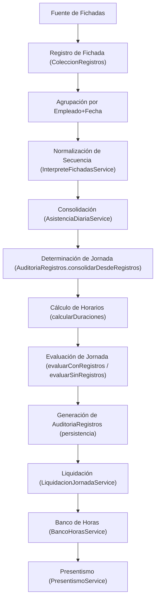
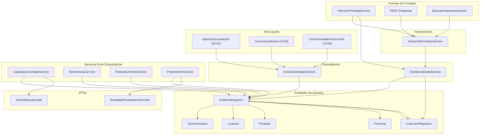
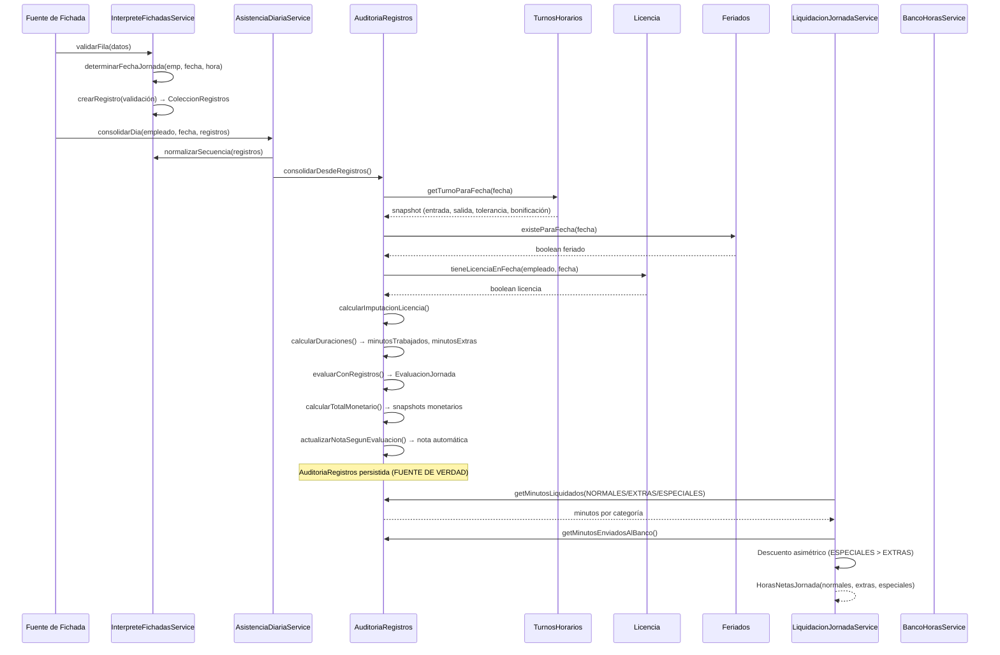

# Auditoría Técnica – Motor de Análisis de Fichadas V1

> **Proyecto:** Biometric-BH (OpenXava / Java 17)  
> **Fecha:** 2026-08-02  
> **Alcance:** Análisis del código existente — sin propuestas de cambio.  
> **Versión:** 1.0

---

## Índice

1. [Flujo Completo del Procesamiento](#1-flujo-completo-del-procesamiento)
2. [Clases Involucradas](#2-clases-involucradas)
3. [Algoritmo Actual de Análisis de Fichadas](#3-algoritmo-actual-de-análisis-de-fichadas)
4. [Estados de la Jornada (EvaluacionJornada)](#4-estados-de-la-jornada-evaluacionjornada)
5. [Análisis de la Secuencia de Fichadas](#5-análisis-de-la-secuencia-de-fichadas)
6. [Manejo de Pausas](#6-manejo-de-pausas)
7. [Construcción de AuditoriaRegistros](#7-construcción-de-auditoriaregistros)
8. [Casos Especiales Contemplados](#8-casos-especiales-contemplados)
9. [Diagrama de Dependencias](#9-diagrama-de-dependencias)
10. [Pseudocódigos Exactos de Algoritmos Críticos](#10-pseudocódigos-exactos-de-algoritmos-críticos)
11. [Conclusión Técnica](#11-conclusión-técnica)

---

## 1. Flujo Completo del Procesamiento

El siguiente diagrama describe el flujo completo desde la recepción de una fichada hasta la evaluación final del presentismo:



### Paso a paso detallado:

| # | Paso | Clase Principal | Método Clave |
|---|------|----------------|--------------|
| 1 | **Registro de fichada** | [HikvisionFichadaService](file:///c:/Users/mem19/Documents/STARH/biometric-bh/src/main/java/com/sta/biometric/servicios/HikvisionFichadaService.java) / [EjecutarImportacionAction](file:///c:/Users/mem19/Documents/STARH/biometric-bh/src/main/java/com/sta/biometric/acciones/EjecutarImportacionAction.java) / REST API | `registrarFichada()` / `execute()` |
| 2 | **Agrupación por empleado+fecha** | [InterpreteFichadasService](file:///c:/Users/mem19/Documents/STARH/biometric-bh/src/main/java/com/sta/biometric/servicios/InterpreteFichadasService.java) | `determinarFechaJornada()` |
| 3 | **Normalización de secuencia** | [InterpreteFichadasService](file:///c:/Users/mem19/Documents/STARH/biometric-bh/src/main/java/com/sta/biometric/servicios/InterpreteFichadasService.java) | `normalizarSecuencia()` |
| 4 | **Consolidación diaria** | [AsistenciaDiariaService](file:///c:/Users/mem19/Documents/STARH/biometric-bh/src/main/java/com/sta/biometric/servicios/AsistenciaDiariaService.java) | `consolidarDia()` |
| 5 | **Determinación de jornada** | [AuditoriaRegistros](file:///c:/Users/mem19/Documents/STARH/biometric-bh/src/main/java/com/sta/biometric/modelo/AuditoriaRegistros.java) | `consolidarDesdeRegistros()` |
| 6 | **Cálculo de horarios** | [AuditoriaRegistros](file:///c:/Users/mem19/Documents/STARH/biometric-bh/src/main/java/com/sta/biometric/modelo/AuditoriaRegistros.java) | `calcularDuraciones()` |
| 7 | **Evaluación de jornada** | [AuditoriaRegistros](file:///c:/Users/mem19/Documents/STARH/biometric-bh/src/main/java/com/sta/biometric/modelo/AuditoriaRegistros.java) | `evaluarConRegistros()` / `evaluarSinRegistros()` |
| 8 | **Generación de AuditoriaRegistros** | [GestionJornadasService](file:///c:/Users/mem19/Documents/STARH/biometric-bh/src/main/java/com/sta/biometric/servicios/GestionJornadasService.java) | `abrirOActualizarJornada()` + `cerrarJornada()` |
| 9 | **Liquidación** | [LiquidacionJornadaService](file:///c:/Users/mem19/Documents/STARH/biometric-bh/src/main/java/com/sta/biometric/servicios/LiquidacionJornadaService.java) | `generarLiquidacion()` / `calcularHorasNetasJornada()` |
| 10 | **Banco de Horas** | [BancoHorasService](file:///c:/Users/mem19/Documents/STARH/biometric-bh/src/main/java/com/sta/biometric/servicios/BancoHorasService.java) | `enviarAlBanco()` / `calcularDiferenciaDisponible()` |
| 11 | **Presentismo** | [PresentismoService](file:///c:/Users/mem19/Documents/STARH/biometric-bh/src/main/java/com/sta/biometric/servicios/PresentismoService.java) | `evaluarPresentismo()` |

---

## 2. Clases Involucradas

### 2.1 Entidades de Dominio

#### [ColeccionRegistros](file:///c:/Users/mem19/Documents/STARH/biometric-bh/src/main/java/com/sta/biometric/modelo/ColeccionRegistros.java)
- **Responsabilidad:** Registro individual de una fichada (entrada, salida, pausa, ubicación, manual).
- **Quién la crea:** `InterpreteFichadasService.crearRegistro()`, `HikvisionFichadaService.registrarFichada()`, REST endpoints.
- **Quién consume:** `AuditoriaRegistros` (relación `@OneToMany`). Su evaluación individual se calcula en `@PrePersist/@PreUpdate` mediante `calcularEvaluacion()`.
- **Campos clave:** `fecha`, `hora`, `tipoMovimiento` (enum), `evaluacion` (String calculado), `coordenada`, `observacion`.

#### [AuditoriaRegistros](file:///c:/Users/mem19/Documents/STARH/biometric-bh/src/main/java/com/sta/biometric/modelo/AuditoriaRegistros.java) (2115 líneas)
- **Responsabilidad:** Registro consolidado de asistencia de un empleado para un día específico. **Fuente de verdad de la jornada.**
- **Quién la crea:** `GestionJornadasService.abrirOActualizarJornada()`, `AsistenciaDiariaService.consolidarDia()`.
- **Quién consume:** `LiquidacionJornadaService`, `BancoHorasService`, `PresentismoService`, `RedondeoHorasService`, acciones OpenXava, Exportador Excel.
- **Campos persistidos (fuente de verdad):**
  - `empleado`, `fecha` — identidad lógica
  - `nombreTurno`, `horaEsperadaEntrada`, `horaEsperadaSalida`, `minutosEsperados`, `toleranciaMinutos` — **snapshot** del turno
  - `minutosTrabajados`, `minutosExtras` — resultado del cálculo de fichadas
  - `evaluacion` — enum `EvaluacionJornada`
  - `feriado`, `licencia`, `esJornadaNocturna` — banderas de estado
  - `minutosImputadosLicencia`, `licenciaParcial` — imputación por licencia con goce
  - `ajusteMinutosNormales/Extras/Especiales` — ajustes manuales del supervisor
  - `ajusteRedondeoNormales/Extras/Especiales`, `redondeoAutoAplicado` — ajustes de redondeo automático
  - `minutosEnviadosAlBanco`, `enBanco`, `descontarPresentismo` — banco de horas
  - `valorHoraSnapshot`, `valorHoraTurnoSnapshot`, `porcentajeBonificacionSnapshot` — snapshots monetarios
  - `montoTeoricoTurno/Extras/Especiales` — montos calculados
- **Campos calculados (transient):** `getHorasTrabajadasTurno()`, `getHorasExtras()`, `getHorasEspeciales()`, `getFilasCalculo()`, `getEstadoJornada()`, `getHorario()`, `getDiaSemana()`, `getTurnoPlanificado()`.

#### [LiquidacionJornadas](file:///c:/Users/mem19/Documents/STARH/biometric-bh/src/main/java/com/sta/biometric/modelo/LiquidacionJornadas.java)
- **Responsabilidad:** Liquidación monetaria de un período (mes) para un empleado.
- **Quién la crea:** `LiquidacionJornadaService.generarLiquidacion()`.
- **Quién consume:** Acciones de liquidación, Exportador Excel.

#### [BancoHoras](file:///c:/Users/mem19/Documents/STARH/biometric-bh/src/main/java/com/sta/biometric/modelo/BancoHoras.java) / [MovimientoBancoHoras](file:///c:/Users/mem19/Documents/STARH/biometric-bh/src/main/java/com/sta/biometric/modelo/MovimientoBancoHoras.java)
- **Responsabilidad:** Cabecera y movimientos del banco de horas por empleado.
- **Quién la crea:** `BancoHorasService.obtenerOCrearBanco()` / `enviarAlBanco()`.
- **Quién consume:** `LiquidacionJornadaService`, acciones de envío/reversión.

#### [TurnosHorarios](file:///c:/Users/mem19/Documents/STARH/biometric-bh/src/main/java/com/sta/biometric/auxiliares/TurnosHorarios.java)
- **Responsabilidad:** Esquema de horarios semanales de un turno (7 días × entrada/salida/activo).
- **Quién la crea:** Manualmente desde UI.
- **Quién consume:** `AuditoriaRegistros.inicializarTurnoYCondiciones()`, `ColeccionRegistros.calcularEvaluacion()`, `GestionJornadasService`, jobs Quartz.
- **API de negocio:** `esLaboral(DayOfWeek)`, `getEntradaParaDia()`, `getSalidaParaDia()`, `esNocturnoParaDia()`, `getHorasParaDia()`.

#### [Licencia](file:///c:/Users/mem19/Documents/STARH/biometric-bh/src/main/java/com/sta/biometric/auxiliares/Licencia.java)
- **Responsabilidad:** Licencia laboral del empleado (vacaciones, enfermedad, etc).
- **Quién la crea:** UI OpenXava.
- **Quién consume:** `AuditoriaRegistros.consolidarDesdeRegistros()` vía métodos estáticos `tieneLicenciaEnFecha()` / `getLicenciaEnFecha()`.
- **Campos relevantes para auditoría:** `justificado`, `conGoce`, `esParcial`, `horaInicio`, `horaFin`, `tipo` (enum `TipoLicenciaAR`).

#### [Feriados](file:///c:/Users/mem19/Documents/STARH/biometric-bh/src/main/java/com/sta/biometric/auxiliares/Feriados.java)
- **Responsabilidad:** Registro de feriados nacionales.
- **Quién consume:** `AuditoriaRegistros.consolidarDesdeRegistros()` vía `existeParaFecha()` / `esFeriadoPuente()`.
- **Campo clave:** `tipo` (String: "inamovible", "trasladable", "puente").

### 2.2 Servicios

| Servicio | Responsabilidad | Invocado por | Resultado |
|----------|----------------|--------------|-----------|
| [InterpreteFichadasService](file:///c:/Users/mem19/Documents/STARH/biometric-bh/src/main/java/com/sta/biometric/servicios/InterpreteFichadasService.java) | Parseo, deducción de tipo, normalización de secuencia, validación de filas, determinación de fecha jornada | `HikvisionFichadaService`, `EjecutarImportacionAction`, `AsistenciaDiariaService` | Registros validados y normalizados |
| [AsistenciaDiariaService](file:///c:/Users/mem19/Documents/STARH/biometric-bh/src/main/java/com/sta/biometric/servicios/AsistenciaDiariaService.java) | Consolidar registros diarios en `AuditoriaRegistros`, evitar duplicados | `HikvisionFichadaService`, importación | `AuditoriaRegistros` gestionada |
| [GestionJornadasService](file:///c:/Users/mem19/Documents/STARH/biometric-bh/src/main/java/com/sta/biometric/servicios/GestionJornadasService.java) | Apertura/cierre/reprocesamiento de jornadas; singleton | Jobs Quartz, acciones OpenXava, reevaluación | `AuditoriaRegistros` persistida |
| [HikvisionFichadaService](file:///c:/Users/mem19/Documents/STARH/biometric-bh/src/main/java/com/sta/biometric/servicios/HikvisionFichadaService.java) | Procesar fichadas de dispositivos Hikvision (deduplicación por serial, asignación alternada ENTRADA/SALIDA) | REST endpoint `HikvisionEventEndpoint` | String con resultado |
| [LiquidacionJornadaService](file:///c:/Users/mem19/Documents/STARH/biometric-bh/src/main/java/com/sta/biometric/servicios/LiquidacionJornadaService.java) | Generar/recalcular/cerrar liquidaciones; **Única autoridad** para calcular horas netas con política del Banco | Acciones de liquidación | `LiquidacionJornadas`, `HorasNetasJornada` |
| [BancoHorasService](file:///c:/Users/mem19/Documents/STARH/biometric-bh/src/main/java/com/sta/biometric/servicios/BancoHorasService.java) | Gestión del banco de horas (envío, reversión, reconciliación) | Acciones de envío/reversión | `MovimientoBancoHoras` |
| [RedondeoHorasService](file:///c:/Users/mem19/Documents/STARH/biometric-bh/src/main/java/com/sta/biometric/servicios/RedondeoHorasService.java) | Redondeo automático masivo e individual de horas; max ajuste ±30 min | Acciones de redondeo | Registros con ajustes de redondeo |
| [PresentismoService](file:///c:/Users/mem19/Documents/STARH/biometric-bh/src/main/java/com/sta/biometric/servicios/PresentismoService.java) | Evaluación paramétrica del presentismo — **solo interpreta, nunca recalcula** | Acciones de liquidación, informes | `ResultadoPresentismoPeriodo` |
| [ConfiguracionesPreferencias](file:///c:/Users/mem19/Documents/STARH/biometric-bh/src/main/java/com/sta/biometric/servicios/ConfiguracionesPreferencias.java) | Lectura de properties configurables del sistema | Todos los servicios | Valores tipados |

### 2.3 Enums

| Enum | Responsabilidad |
|------|----------------|
| [TipoMovimiento](file:///c:/Users/mem19/Documents/STARH/biometric-bh/src/main/java/com/sta/biometric/enums/TipoMovimiento.java) | `ENTRADA`, `SALIDA`, `PAUSA_INICIO`, `PAUSA_FIN`, `UBICACION`, `MANUAL` |
| [EvaluacionJornada](file:///c:/Users/mem19/Documents/STARH/biometric-bh/src/main/java/com/sta/biometric/enums/EvaluacionJornada.java) | 17 estados posibles de una jornada |
| [TipoHoraCalculo](file:///c:/Users/mem19/Documents/STARH/biometric-bh/src/main/java/com/sta/biometric/enums/TipoHoraCalculo.java) | `NORMALES`, `EXTRAS`, `ESPECIALES` |
| [TipoRedondeo](file:///c:/Users/mem19/Documents/STARH/biometric-bh/src/main/java/com/sta/biometric/enums/TipoRedondeo.java) | `A_FAVOR_EMPLEADO`, `A_FAVOR_EMPRESA`, `MATEMATICO` |
| [TipoMovimientoBancoHoras](file:///c:/Users/mem19/Documents/STARH/biometric-bh/src/main/java/com/sta/biometric/enums/TipoMovimientoBancoHoras.java) | `INGRESO`, `DESCUENTO` |
| [EstadoLiquidacion](file:///c:/Users/mem19/Documents/STARH/biometric-bh/src/main/java/com/sta/biometric/enums/EstadoLiquidacion.java) | `ABIERTO`, `RECALCULADO`, `CERRADO` |
| [TipoLicenciaAR](file:///c:/Users/mem19/Documents/STARH/biometric-bh/src/main/java/com/sta/biometric/enums/TipoLicenciaAR.java) | Tipos de licencia según legislación argentina |
| [Turnos](file:///c:/Users/mem19/Documents/STARH/biometric-bh/src/main/java/com/sta/biometric/enums/Turnos.java) | `MANANA`, `TARDE`, `NOCHE`, `ESPECIAL` (u otros) |

### 2.4 DTOs

| DTO | Responsabilidad |
|-----|----------------|
| [HorasNetasJornada](file:///c:/Users/mem19/Documents/STARH/biometric-bh/src/main/java/com/sta/biometric/auxiliares/HorasNetasJornada.java) | DTO inmutable con minutos netos a liquidar por categoría (post Banco de Horas) |
| [ResultadoPresentismoPeriodo](file:///c:/Users/mem19/Documents/STARH/biometric-bh/src/main/java/com/sta/biometric/auxiliares/ResultadoPresentismoPeriodo.java) | Resultado de evaluación de presentismo del período |
| [DetalleIncidenciaPresentismo](file:///c:/Users/mem19/Documents/STARH/biometric-bh/src/main/java/com/sta/biometric/auxiliares/DetalleIncidenciaPresentismo.java) | Detalle de cada incidencia detectada |
| [FilaCalculo](file:///c:/Users/mem19/Documents/STARH/biometric-bh/src/main/java/com/sta/biometric/modelo/FilaCalculo.java) | Fila para tabla de cálculos en la vista (Normales/Extras/Especiales) |

### 2.5 Jobs Quartz

| Job | Horario | Responsabilidad |
|-----|---------|----------------|
| [AperturaJornadaJob](file:///c:/Users/mem19/Documents/STARH/biometric-bh/src/main/java/com/sta/biometric/qartzJobs/AperturaJornadaJob.java) | 00:01 AM | Crea/actualiza `AuditoriaRegistros` para todos los empleados activos del día. Omite empleados con jornada nocturna en curso del día anterior. |
| [CierreJornadaJob](file:///c:/Users/mem19/Documents/STARH/biometric-bh/src/main/java/com/sta/biometric/qartzJobs/CierreJornadaJob.java) | 23:59 PM | Consolida todas las jornadas del día (`consolidarDesdeRegistros()`). Pospone jornadas nocturnas en curso. |
| [CierreJornadaNocturnaJob](file:///c:/Users/mem19/Documents/STARH/biometric-bh/src/main/java/com/sta/biometric/qartzJobs/CierreJornadaNocturnaJob.java) | 12:00 PM | Cierra jornadas nocturnas del día anterior. Pospone si la hora de salida esperada aún no llegó. |

### 2.6 Utilidades

| Clase | Responsabilidad |
|-------|----------------|
| [TiempoUtils](file:///c:/Users/mem19/Documents/STARH/biometric-bh/src/main/java/com/sta/biometric/formateadores/TiempoUtils.java) | Formateo HH:MM, cálculo de minutos entre LocalTime/LocalDateTime, soporte cruce medianoche |
| [PresentismoProperties](file:///c:/Users/mem19/Documents/STARH/biometric-bh/src/main/java/com/sta/biometric/auxiliares/PresentismoProperties.java) | Constantes de claves de configuración del módulo de presentismo |

---

## 3. Algoritmo Actual de Análisis de Fichadas

### 3.1 Primera Entrada y Última Salida

Implementado en [AuditoriaRegistros.calcularDuraciones()](file:///c:/Users/mem19/Documents/STARH/biometric-bh/src/main/java/com/sta/biometric/modelo/AuditoriaRegistros.java#L467-L545):

1. **Ordena** los registros por `fecha ASC, hora ASC` (Comparator dual para soportar turnos nocturnos).
2. **Toma** `registros.get(0).getHora()` como hora de inicio (primera fichada cronológica, **sin filtrar por tipo**).
3. **Toma** `registros.get(registros.size()-1).getHora()` como hora de fin (última fichada cronológica, **sin filtrar por tipo**).
4. **Calcula** `minutosTrabajados = TiempoUtils.calcularMinutosLocalTime(inicio, fin)` — soporta cruce de medianoche.

> [!IMPORTANT]
> **Hallazgo crítico:** El algoritmo toma la primera y última fichada independientemente de su `TipoMovimiento`. Es decir, si la primera fichada es una `PAUSA_INICIO` o la última es una `PAUSA_FIN`, estas se usan como inicio/fin de jornada. No filtra por `ENTRADA`/`SALIDA`.

### 3.2 Horas Trabajadas

```
minutosTrabajados = TiempoUtils.calcularMinutosLocalTime(primeraHora, ultimaHora)
```

El cálculo es simplemente la diferencia entre primera y última fichada. **No descuenta pausas** del total (ver sección 6).

### 3.3 Tolerancia Automática

Después del cálculo de `minutosTrabajados`, se aplica [tolerancia automática bidireccional](file:///c:/Users/mem19/Documents/STARH/biometric-bh/src/main/java/com/sta/biometric/modelo/AuditoriaRegistros.java#L480-L541):

```
diferenciaReal = minutosTrabajados - minutosEsperados
```

- **Configurable** vía `tolerancia.automatica.habilitada` (default: true) y `tolerancia.automatica.modo` (default: "BIDIRECCIONAL").
- Modos: `BIDIRECCIONAL` (±tolerancia), `SOLO_EXCESOS` (+), `SOLO_FALTANTES` (-).
- Si `|diferenciaReal| <= toleranciaMinutos` → `minutosTrabajados = minutosEsperados` (ajusta a jornada exacta).
- No se aplica en jornadas especiales (`esJornadaEspecial()` = `FERIADO_TRABAJADO`).
- Opcionalmente registra nota: `[Tolerancia automática: +3 min → ajustado a jornada completa]`.

### 3.4 Horas Extras

```java
minutosExtras = Math.max(0, minutosTrabajados - minutosEsperados);
```

Calculado **después** de la tolerancia automática. Si la tolerancia ajustó `minutosTrabajados = minutosEsperados`, entonces `minutosExtras = 0`.

### 3.5 Horas Especiales

Determinadas por `esJornadaEspecial()` que retorna `true` solo si `evaluacion == FERIADO_TRABAJADO`.

En jornada especial: todo `minutosTrabajados` va a la categoría ESPECIALES; NORMALES y EXTRAS base = 0.

### 3.6 Horas Liquidadas (Cálculo Centralizado)

Implementado en [calcularMinutosLiquidados(TipoHoraCalculo)](file:///c:/Users/mem19/Documents/STARH/biometric-bh/src/main/java/com/sta/biometric/modelo/AuditoriaRegistros.java#L1218-L1268):

```
Horas Liquidadas = Base + Ajuste Manual + Ajuste Redondeo
```

Para **NORMALES** (jornada normal):
- Si `minutosTrabajados >= (minutosEsperados - toleranciaMinutos)` → base = minutosEsperados (jornada completa)
- Si no → base = `min(minutosTrabajados, minutosEsperados)`
- Con licencia parcial: base = `min(minutosImputadosLicencia + minutosTrabajados, minutosEsperados)`
- Con licencia total con goce: base = `minutosImputadosLicencia`

Para **EXTRAS** (jornada normal):
- base = `minutosExtras`

Para **ESPECIALES** (solo feriado trabajado):
- base = `minutosTrabajados`

### 3.7 Redondeos

Implementados en [RedondeoHorasService](file:///c:/Users/mem19/Documents/STARH/biometric-bh/src/main/java/com/sta/biometric/servicios/RedondeoHorasService.java):

- Se calculan sobre el **total del período** (no por jornada individual).
- Máximo ajuste: ±30 minutos.
- El ajuste se distribuye al **último registro** con horas del tipo correspondiente.
- Se guardan en campos separados (`ajusteRedondeoXXX`), independientes de ajustes manuales.

### 3.8 Ajustes Manuales

Campos `ajusteMinutosNormales/Extras/Especiales` en `AuditoriaRegistros`. Permiten redistribuir horas entre categorías sin alterar fichadas originales. Validación: la suma de los 3 ajustes debe ser 0 (conservación).

### 3.9 Observaciones

Las notas se generan automáticamente en [actualizarNotaSegunEvaluacion()](file:///c:/Users/mem19/Documents/STARH/biometric-bh/src/main/java/com/sta/biometric/modelo/AuditoriaRegistros.java#L815-L894) con un método dedicado por cada estado de evaluación. Las notas del Banco de Horas (líneas con 🏦 o ↩️) se preservan entre reconsolidaciones.

---

## 4. Estados de la Jornada (EvaluacionJornada)

| Estado | Dónde se genera | Condiciones | Impacto posterior |
|--------|----------------|-------------|-------------------|
| `PENDIENTE` | `evaluarSinRegistros()` / `inicializarAsistencia()` | Día laboral sin fichadas, jornada aún no debería haber terminado | No genera penalización. Presentismo no lo cuenta. |
| `EN_CURSO` | `evaluarConRegistros()` | Fecha = hoy, tiene ENTRADA pero no SALIDA | Presentismo lo evalúa para llegada tarde. |
| `COMPLETA` | `evaluarConRegistros()` | `minutosTrabajados >= (minutosEsperados - toleranciaMinutos)` | Base: normales = esperados. Extras si excede. |
| `INCOMPLETA` | `evaluarConRegistros()` | Tiene fichadas pero `minutosTrabajados < (minutosEsperados - toleranciaMinutos)` | Penaliza presentismo. Normales = lo trabajado. |
| `AUSENTE` | `evaluarSinRegistros()` | Día laboral sin fichadas, jornada debería haber terminado | Penaliza presentismo (si injustificada). Disponible para Banco negativo. |
| `SIN_ENTRADA` | `evaluarConRegistros()` | Solo tiene SALIDA pero no ENTRADA, día pasado | Requiere corrección manual. |
| `SIN_SALIDA` | `evaluarConRegistros()` | Solo tiene ENTRADA pero no SALIDA, día pasado (no nocturna) | Requiere corrección manual. |
| `LICENCIA` | `evaluarSinRegistros()` / `evaluarConRegistros()` | Licencia activa con goce + justificada | Imputa horas sin fichaje. No penaliza presentismo. |
| `LICENCIA_SIN_GOCE` | `evaluarSinRegistros()` / `evaluarConRegistros()` | Licencia justificada pero sin goce de sueldo | No imputa horas. Puede penalizar presentismo. |
| `LICENCIA_NO_JUSTIFICADA` | `evaluarSinRegistros()` / `evaluarConRegistros()` | Licencia no justificada | Penaliza presentismo. |
| `LICENCIA_PARCIAL` | `evaluarConRegistros()` | `licenciaParcial = true` (hay fichajes + licencia parcial) | Combina horas fichadas + horas imputadas. |
| `FERIADO` | `evaluarSinRegistros()` | Feriado sin fichadas (y no es puente obligatorio) | No penaliza. Justificado automáticamente. |
| `FERIADO_TRABAJADO` | `evaluarConRegistros()` | Feriado con fichadas | Todo va a ESPECIALES (100% bonificación). Disponible para Banco. |
| `DIA_NO_LABORAL` | `evaluarSinRegistros()` | Turno no tiene ese día como laboral | Sin impacto. |
| `DIA_NO_LABORAL_TRABAJADO` | `evaluarConRegistros()` | No es laboral según turno pero hay fichadas | Va a ESPECIALES (si aplica la lógica). Nota indica bonificación. |
| `SIN_TURNO_ASIGNADO` | `inicializarAsistencia()` (implícito) | Empleado sin turno para la fecha | Sin cálculo. |
| `SIN_DATOS` | (valor de referencia) | No hay datos de asistencia | Sin cálculo. |

### Lógica de `jornadaDeberiaHaberTerminado()`

- **Turno normal:** Día pasado → sí. Hoy y hora > salida + 30min → sí.
- **Turno nocturno:** Si estamos en el día de inicio → no. Si pasaron 2+ días → sí. Si estamos en el día siguiente y hora > salida + 30min → sí.

---

## 5. Análisis de la Secuencia de Fichadas

### 5.1 Normalización de Secuencia

Implementada en [InterpreteFichadasService.normalizarSecuencia()](file:///c:/Users/mem19/Documents/STARH/biometric-bh/src/main/java/com/sta/biometric/servicios/InterpreteFichadasService.java#L270-L330):

#### Reglas aplicadas:

1. **PAUSA_INICIO / PAUSA_FIN:** Se preservan intactos, nunca se modifican.
2. **ENTRADA después de PAUSA_INICIO:** Se reclasifica como `PAUSA_FIN`.
3. **SALIDA seguida de ENTRADA/PAUSA_FIN:** Si la diferencia < 4 horas → SALIDA se convierte en `PAUSA_INICIO`. Si ≥ 4 horas → se mantiene como SALIDA (cambio de turno).
4. **SALIDA seguida de ENTRADA con diferencia larga (≥ 4h):** La ENTRADA se mantiene (inicio del siguiente turno).

### 5.2 Asignación Alternada (Hikvision)

En [HikvisionFichadaService](file:///c:/Users/mem19/Documents/STARH/biometric-bh/src/main/java/com/sta/biometric/servicios/HikvisionFichadaService.java#L134-L149), cuando el dispositivo no envía tipo:

```
esEntrada = true (comienza como ENTRADA)
Para cada registro:
  - Si es PAUSA_INICIO → siguiente será ENTRADA (reingreso)
  - Si es PAUSA_FIN → siguiente será SALIDA
  - Si es genérico → alternar: ENTRADA ↔ SALIDA
```

### 5.3 Comportamiento actual por secuencia específica:

| Secuencia | Resultado actual |
|-----------|-----------------|
| `Entrada → Salida` | Normal. minutosTrabajados = diferencia entre ambas. |
| `Entrada → Salida → Entrada → Salida` | Si diferencia Salida→Entrada < 4h: Salida se convierte en PAUSA_INICIO. Horas = primera a última. Si ≥ 4h: Cambio de turno, pero horas = primera a última igualmente. |
| `Entrada → Pausa → Fin Pausa → Salida` | Pausas preservadas. Horas = Entrada a Salida (pausas **NO** se descuentan). |
| `Entrada → Entrada` | Ambas se mantienen como ENTRADA. Horas = diferencia entre primera y segunda ENTRADA. |
| `Entrada → Entrada → Entrada → Salida` | Primera fichada a última. Tipos intermedios no se reclasifican si no hay SALIDA previa. |
| `Salida → Salida` | Primera se mantiene SALIDA. Horas = diferencia entre ambas. |
| `Entrada → Pausa → Entrada` | La segunda ENTRADA se reclasifica como PAUSA_FIN (por regla: ENTRADA después de PAUSA_INICIO). |
| `Pausa → Fin Pausa` | Horas = diferencia entre ambas (incluso sin ENTRADA/SALIDA). |
| `Entrada → Salida → Salida` | Segunda SALIDA: como no tiene siguiente ENTRADA, se mantiene SALIDA. Horas = primera a última. |
| `Pausa → Fin Pausa → Entrada → Salida` | Horas = primera fichada (Pausa) a última (Salida). |
| Sin fichadas | `evaluarSinRegistros()` determina FERIADO/LICENCIA/AUSENTE/DIA_NO_LABORAL/PENDIENTE. |

> [!WARNING]
> **Implicación:** Independientemente de la secuencia, el sistema siempre calcula `minutosTrabajados` como la diferencia entre la **primera fichada cronológica** y la **última fichada cronológica**, sin importar sus tipos. No existe tratamiento diferenciado para dobles entradas, dobles salidas ni fichadas intermedias a nivel de cálculo de tiempo.

---

## 6. Manejo de Pausas

### 6.1 Dónde se almacenan

En [ColeccionRegistros](file:///c:/Users/mem19/Documents/STARH/biometric-bh/src/main/java/com/sta/biometric/modelo/ColeccionRegistros.java) con `tipoMovimiento = PAUSA_INICIO` o `PAUSA_FIN`.

### 6.2 Cómo se registran

- **Desde dispositivo Hikvision:** Solo si la fichada lleva tipo explícito de pausa desde la app móvil o el reloj.
- **Desde importación de archivo:** Si la columna tipo contiene: "PAUSA INICIO", "INICIO PAUSA", "BREAK START", "PAUSA_INICIO", "PI" (o equivalentes para fin de pausa).
- **Por normalización automática:** `InterpreteFichadasService.normalizarSecuencia()` puede convertir una SALIDA en PAUSA_INICIO si la diferencia con la siguiente fichada es < 4 horas. Puede convertir una ENTRADA en PAUSA_FIN si el registro anterior es PAUSA_INICIO.

### 6.3 Cómo participan en la auditoría

- **Evaluación individual:** `ColeccionRegistros.calcularEvaluacion()` les asigna evaluación "INICIO PAUSA" o "FIN PAUSA".
- **Cálculo de horas trabajadas:** En `AuditoriaRegistros.calcularDuraciones()`, las pausas **NO se descuentan** del total de minutos trabajados. El cálculo es estrictamente `primeraFichada → últimaFichada`.

### 6.4 ¿Modifican horas trabajadas?

**No.** Las pausas actualmente son **puramente informativas** a nivel de cálculo de tiempo. El comentario en el Javadoc de `calcularDuraciones()` dice "Descuenta pausas si están registradas", pero el código implementado **no las descuenta**. Solo usa `registros.get(0).getHora()` y `registros.get(registros.size()-1).getHora()`.

### 6.5 Validaciones existentes

- La normalización verifica si la diferencia entre SALIDA y siguiente ENTRADA es < 4 horas para reclasificar como pausa.
- `PresentismoService` tiene un feature toggle `evaluar.pausas` (default: `false`), preparado para futuro. Actualmente busca "Exceso de pausa" en la nota de la auditoría, pero `AuditoriaRegistros` nunca genera esa nota.

---

## 7. Construcción de AuditoriaRegistros

### 7.1 Quién crea el registro

- **Job de apertura** (`AperturaJornadaJob`): Crea registros vacíos para todos los empleados activos a las 00:01 vía `GestionJornadasService.abrirOActualizarJornada()`.
- **AsistenciaDiariaService:** Crea `AuditoriaRegistros` al recibir la primera fichada del día si no existe.
- **Importación masiva:** Vía `EjecutarImportacionAction` que agrupa fichadas y llama a `AsistenciaDiariaService.consolidarDia()`.

### 7.2 Cuándo se consolida

- Al agregar fichadas: `AsistenciaDiariaService.consolidarDia()` → `AuditoriaRegistros.consolidarDesdeRegistros()`.
- Al cerrar jornada: `CierreJornadaJob` → `GestionJornadasService.cerrarJornada()` → `consolidarDesdeRegistros()`.
- Al reevaluar: `EjecutarReevaluacionAction` → `GestionJornadasService.reprocesarPeriodo()`.
- Al guardar/eliminar licencia: `LicenciaSaveAction` / `LicenciaRemoveAction` → recalculan las jornadas afectadas.

### 7.3 Campos calculados vs. provenientes de otras entidades

| Campo | Tipo | Fuente |
|-------|------|--------|
| `horaEsperadaEntrada/Salida` | Snapshot | `TurnosHorarios` vía `empleado.getTurnoParaFecha()` |
| `minutosEsperados` | Snapshot | Calculado desde entrada/salida del turno |
| `toleranciaMinutos` | Snapshot | `TurnosHorarios.getTolerancia()` |
| `nombreTurno` | Snapshot | `TurnosHorarios.getTurnoNombre()` |
| `porcentajeBonificacionSnapshot` | Snapshot | `TurnosHorarios.getPorcentajeBonificacion()` |
| `valorHoraSnapshot` | Snapshot | `Personal.getValorHora()` |
| `valorHoraTurnoSnapshot` | Snapshot | `Personal.getValorHoraTurno(turno)` |
| `feriado` | Calculado | `Feriados.existeParaFecha()` |
| `licencia` | Calculado | `Licencia.tieneLicenciaEnFecha()` |
| `esJornadaNocturna` | Calculado | `TurnosHorarios.esNocturnoParaDia()` |
| `minutosTrabajados` | Calculado | `calcularDuraciones()` |
| `minutosExtras` | Calculado | `max(0, minutosTrabajados - minutosEsperados)` |
| `evaluacion` | Calculado | `evaluarConRegistros()` / `evaluarSinRegistros()` |
| `minutosImputadosLicencia` | Calculado | `calcularImputacionLicencia()` |
| `montoTeoricoTurno/Extras/Especiales` | Calculado | `calcularTotalMonetario()` usando horas × valor hora |

### 7.4 Atributos fuente de verdad

Los campos persistidos en `AuditoriaRegistros` constituyen la **fuente de verdad** de la jornada:
- `minutosTrabajados`, `minutosExtras` — tiempo calculado
- `evaluacion` — estado final de la jornada
- `ajusteMinutosXXX`, `ajusteRedondeoXXX` — correcciones
- `minutosEnviadosAlBanco` — movimiento al banco
- Los snapshots garantizan inmutabilidad histórica

---

## 8. Casos Especiales Contemplados

### 8.1 Fichadas duplicadas

| Caso | Implementación | Ubicación |
|------|---------------|-----------|
| Duplicado por serial (Hikvision) | Si `serialNo <= ultimoSerialNo` del dispositivo → `DUPLICADO_SERIAL_IGNORADO` | [HikvisionFichadaService L66-69](file:///c:/Users/mem19/Documents/STARH/biometric-bh/src/main/java/com/sta/biometric/servicios/HikvisionFichadaService.java#L66-L69) |
| Duplicado por hora (Hikvision) | Si diferencia entre hora existente y nueva ≤ `toleranciaSegundos` del dispositivo (default 1800s = 30min) → `DUPLICADO_IGNORADO` | [HikvisionFichadaService L114-119](file:///c:/Users/mem19/Documents/STARH/biometric-bh/src/main/java/com/sta/biometric/servicios/HikvisionFichadaService.java#L114-L119) |
| Duplicado en consolidación | Si misma hora (±5 min) y mismo `TipoMovimiento` → no se agrega | [AsistenciaDiariaService L71-84](file:///c:/Users/mem19/Documents/STARH/biometric-bh/src/main/java/com/sta/biometric/servicios/AsistenciaDiariaService.java#L71-L84) |

### 8.2 Doble entrada / Doble salida / Múltiples entradas/salidas

**No existe tratamiento especial.** El sistema solo usa primera y última fichada cronológica para calcular tiempo. Múltiples entradas o salidas intermedias no afectan el cálculo de `minutosTrabajados`. La normalización de secuencia puede reclasificar SALIDA→PAUSA_INICIO o ENTRADA→PAUSA_FIN, pero el cálculo de tiempo final no cambia.

### 8.3 Pausas abiertas

**No tratadas explícitamente.** Si hay PAUSA_INICIO sin PAUSA_FIN correspondiente, la pausa queda registrada pero no afecta el cálculo de horas (ya que las pausas no se descuentan).

### 8.4 Jornadas abiertas / cerradas

| Caso | Implementación |
|------|---------------|
| Jornada abierta (solo ENTRADA) | Se evalúa como `EN_CURSO` si es hoy, `SIN_SALIDA` si es día pasado (no nocturna) |
| Jornada cerrada | Se evalúa como `COMPLETA` o `INCOMPLETA` según diferencia con esperado |

### 8.5 Registros manuales

`TipoMovimiento.MANUAL` existe como tipo de movimiento. Su evaluación individual es "REGISTRO MANUAL". Participa en el cálculo de la jornada como cualquier otra fichada (primera/última cronológica).

### 8.6 Licencias completas y parciales

| Caso | Implementación | Ubicación |
|------|---------------|-----------|
| Licencia completa con goce | Se imputan `minutosEsperados` como `minutosImputadosLicencia`. Evaluación = `LICENCIA`. | [calcularImputacionLicencia()](file:///c:/Users/mem19/Documents/STARH/biometric-bh/src/main/java/com/sta/biometric/modelo/AuditoriaRegistros.java#L677-L721) |
| Licencia completa sin goce | Se justifica pero no imputa horas. Evaluación = `LICENCIA_SIN_GOCE`. | Misma ubicación |
| Licencia no justificada | Evaluación = `LICENCIA_NO_JUSTIFICADA`. No imputa. | Misma ubicación |
| Licencia parcial con goce | Se imputa solo el rango horario de la licencia. Evaluación = `LICENCIA_PARCIAL`. Normales = `min(imputados + trabajados, esperados)`. | [calcularMinutosLiquidados L1232-1236](file:///c:/Users/mem19/Documents/STARH/biometric-bh/src/main/java/com/sta/biometric/modelo/AuditoriaRegistros.java#L1232-L1236) |
| Contexto de licencia | `aplicarContextoLicencia()` permite considerar licencia en memoria (antes de persistir). Usado por `LicenciaSaveAction`. | [AuditoriaRegistros L299-323](file:///c:/Users/mem19/Documents/STARH/biometric-bh/src/main/java/com/sta/biometric/modelo/AuditoriaRegistros.java#L299-L323) |

### 8.7 Feriados

| Caso | Implementación |
|------|---------------|
| Feriado sin fichadas | Evaluación = `FERIADO`. Justificado. |
| Feriado trabajado | Evaluación = `FERIADO_TRABAJADO`. Todo va a ESPECIALES. |
| Feriado PUENTE + turno ESPECIAL | Si `debeTrabajarFeriadoPuente()` → se trata como día laboral normal. |

### 8.8 Ajustes manuales

Implementados vía [AjustarHorasPorTipoAction](file:///c:/Users/mem19/Documents/STARH/biometric-bh/src/main/java/com/sta/biometric/acciones/AjustarHorasPorTipoAction.java) / [AplicarAjusteHorasPorTipoAction](file:///c:/Users/mem19/Documents/STARH/biometric-bh/src/main/java/com/sta/biometric/acciones/AplicarAjusteHorasPorTipoAction.java). Invariante: suma de ajustes = 0 (redistribución, no creación/destrucción de horas).

### 8.9 Redondeos

Implementados en [RedondeoHorasService](file:///c:/Users/mem19/Documents/STARH/biometric-bh/src/main/java/com/sta/biometric/servicios/RedondeoHorasService.java). Aplicación masiva a nivel de liquidación. Reversibles sin afectar ajustes manuales.

### 8.10 Banco de Horas

| Caso | Implementación |
|------|---------------|
| Envío de extras al banco | `BancoHorasService.enviarAlBanco()` con validación estricta de signo y cantidad | 
| Envío de deuda al banco | Mismo método, minutos negativos (AUSENTE o INCOMPLETA) |
| Reversión | `revertirYEliminarMovimiento()` — elimina físicamente el movimiento |
| Excepción feriado | `aplicaExcepcionBancoFeriado()` — toda la jornada trabajada es computable |
| Impacto en liquidación | `LiquidacionJornadaService.calcularHorasNetasJornada()` resta del banco prioritariamente de ESPECIALES, luego de EXTRAS |
| Impacto en presentismo | Flag `descontarPresentismo` por jornada. Si false → jornada exenta. |

### 8.11 Turnos nocturnos

| Caso | Implementación |
|------|---------------|
| Detección | `TurnosHorarios.esNocturnoParaDia()` — si `salida.isBefore(entrada)` |
| Fecha jornada | `InterpreteFichadasService.determinarFechaJornada()` — si fichada < 14:00 y turno de ayer es nocturno → asignar a ayer |
| Apertura | `AperturaJornadaJob` omite empleados con nocturna EN_CURSO |
| Cierre | `CierreJornadaJob` pospone nocturnas EN_CURSO. `CierreJornadaNocturnaJob` (12:00 PM) las cierra |
| Cálculo de minutos | `TiempoUtils.calcularMinutosLocalTime()` soporta cruce de medianoche sumando 24h |

---

## 9. Diagrama de Dependencias



### Cadena de invocación principal:

```
Fichada (Hikvision/Import/REST)
  ↓
InterpreteFichadasService.validarFila() / determinarFechaJornada()
  ↓
InterpreteFichadasService.crearRegistro() → ColeccionRegistros
  ↓
AsistenciaDiariaService.consolidarDia()
  ↓ (invoca normalizarSecuencia + evita duplicados)
AuditoriaRegistros.consolidarDesdeRegistros()
  ├─ inicializarTurnoYCondiciones() → TurnosHorarios (snapshot)
  ├─ Feriados.existeParaFecha()
  ├─ Licencia.tieneLicenciaEnFecha()
  ├─ calcularImputacionLicencia()
  ├─ calcularDuraciones() → minutosTrabajados, minutosExtras
  ├─ evaluarConRegistros() / evaluarSinRegistros() → evaluacion
  ├─ calcularTotalMonetario() → montos snapshot
  └─ actualizarNotaSegunEvaluacion() → nota automática
  ↓
AuditoriaRegistros (persistida) — FUENTE DE VERDAD
  ↓
LiquidacionJornadaService.calcularHorasNetasJornada()
  ├─ getMinutosLiquidados(NORMALES/EXTRAS/ESPECIALES) — desde AuditoriaRegistros
  ├─ Resta minutosEnviadosAlBanco (prioridad: ESPECIALES > EXTRAS)
  └─ → HorasNetasJornada (DTO inmutable)
  ↓
PresentismoService.evaluarPresentismo()
  ├─ Recorre jornadas, interpreta evaluación ya calculada
  ├─ Aplica umbrales configurables
  └─ → ResultadoPresentismoPeriodo
```

---

## 10. Pseudocódigos Exactos de Algoritmos Críticos

### 10.1 consolidarDesdeRegistros() – Pseudocódigo Exacto

**Ubicación:** [AuditoriaRegistros.java L347-398](file:///c:/Users/mem19/Documents/STARH/biometric-bh/src/main/java/com/sta/biometric/modelo/AuditoriaRegistros.java#L347-L398)

```
FUNCIÓN consolidarDesdeRegistros()
    SI empleado == null O fecha == null → RETORNAR (sin acción)
    
    // ── ETAPA 1: Snapshot del turno ──
    inicializarTurnoYCondiciones()
        // Busca turno = empleado.getTurnoParaFecha(fecha)
        // Si turno != null:
        //   horaEsperadaEntrada ← turno.getEntradaParaDia(diaSemana)
        //   horaEsperadaSalida  ← turno.getSalidaParaDia(diaSemana)
        //   minutosEsperados    ← calcularMinutosLocalTime(entrada, salida)
        //   nombreTurno         ← turno.getTurnoNombre()
        //   toleranciaMinutos   ← turno.getTolerancia() ?? 0
        //   porcentajeBonificacionSnapshot ← turno.getPorcentajeBonificacion() ?? 0
        //   valorHoraTurnoSnapshot         ← empleado.getValorHoraTurno(turno)
        //   esJornadaNocturna              ← turno.esNocturnoParaDia(diaSemana)
        // Si turno == null:
        //   Todos los campos ← valores por defecto (null/0/false)
    
    // ── ETAPA 2: Condiciones especiales ──
    feriado  ← Feriados.existeParaFecha(fecha)
    
    SI contextoLicencia != null Y verificarLicenciaContexto():
        licencia ← !contextoEsEliminacion   // true si no es eliminación
    SI NO:
        licencia ← Licencia.tieneLicenciaEnFecha(empleado, fecha)
    
    calcularImputacionLicencia()
        // Reset: minutosImputadosLicencia=0, licenciaParcial=false
        // SI !licencia → RETORNAR
        // SI config("licencia.imputar.horas.goce") == false → RETORNAR
        // Obtener licenciaDetalle (del contexto o de BD)
        // SI licenciaDetalle.isConGoce():
        //     SI licenciaDetalle.isParcial():
        //         minutosImputadosLicencia ← licenciaDetalle.getMinutosLicencia(minutosEsperados)
        //         licenciaParcial ← true
        //     SI NO (total):
        //         minutosImputadosLicencia ← minutosEsperados
        //     justificado ← true
        // SI NO (sin goce):
        //     justificado ← licenciaDetalle.isJustificado()
    
    // ── ETAPA 3: Cálculo de tiempos ──
    SI registros == null O registros.isEmpty():
        evaluarSinRegistros()           // → Ver sección 10.3
    SI NO:
        calcularDuraciones()            // → Ver sección 10.2
        evaluarConRegistros()           // → Ver sección 10.3
    
    // ── ETAPA 4: Snapshot monetario ──
    SI empleado != null:
        valorHoraSnapshot ← empleado.getValorHora()
        valorHoraTurno    ← valorHoraTurnoSnapshot ?? empleado.getValorHora()
        montoTeoricoTurno       ← calcularTotalMonetario(getHorasTrabajadasTurno(), valorHoraTurno)
        montoTeoricoExtras      ← calcularTotalMonetario(getHorasExtras(), empleado.getValorHoraExtra())
        montoTeoricoEspeciales  ← calcularTotalMonetario(getHorasEspeciales(), empleado.getValorHoraEspecial())
    
    // ── ETAPA 5: Nota automática ──
    actualizarNotaSegunEvaluacion()     // → Ver sección 10.5
    
    // ── ETAPA 6: Nota de tolerancia ──
    SI notaToleranciaAutomatica != null Y != "":
        nota ← nota + notaToleranciaAutomatica
        notaToleranciaAutomatica ← null
FIN FUNCIÓN
```

---

### 10.2 calcularDuraciones() – Pseudocódigo Exacto

**Ubicación:** [AuditoriaRegistros.java L467-545](file:///c:/Users/mem19/Documents/STARH/biometric-bh/src/main/java/com/sta/biometric/modelo/AuditoriaRegistros.java#L467-L545)

```
FUNCIÓN calcularDuraciones()
    // PASO 1: Ordenar registros por FECHA ASC, luego HORA ASC
    //   → Usa Comparator con nullsFirst para ambos campos
    //   → Garantiza que en turnos nocturnos la salida del día+1
    //     quede DESPUÉS de la entrada del día anterior
    registros.sort(por fecha ASC, luego por hora ASC)
    
    // PASO 2: Tomar primera y última fichada (SIN FILTRAR por tipo)
    inicio ← registros[0].getHora()        // Primera fichada cronológica
    fin    ← registros[size-1].getHora()    // Última fichada cronológica
    
    // PASO 3: Calcular diferencia
    //   calcularMinutosLocalTime() soporta cruce de medianoche:
    //   Si Duration.between(inicio, fin) es negativa → suma 24h
    minutosTrabajados ← TiempoUtils.calcularMinutosLocalTime(inicio, fin)
    
    // ══════════════════════════════════════════════════════
    // PASO 4: TOLERANCIA AUTOMÁTICA
    // ══════════════════════════════════════════════════════
    diferenciaReal ← minutosTrabajados - minutosEsperados
    
    toleranciaHabilitada ← config("tolerancia.automatica.habilitada", default=true)
    
    SI toleranciaHabilitada Y toleranciaMinutos > 0 Y !esJornadaEspecial():
        modo ← config("tolerancia.automatica.modo", default="BIDIRECCIONAL")
        aplicarTolerancia ← false
        
        SEGÚN modo:
            "BIDIRECCIONAL":
                aplicarTolerancia ← |diferenciaReal| <= toleranciaMinutos
            "SOLO_EXCESOS":
                aplicarTolerancia ← diferenciaReal > 0 Y diferenciaReal <= toleranciaMinutos
            "SOLO_FALTANTES":
                aplicarTolerancia ← diferenciaReal < 0 Y |diferenciaReal| <= toleranciaMinutos
        
        SI aplicarTolerancia:
            minutosTrabajados ← minutosEsperados    // ← AJUSTA A JORNADA EXACTA
            
            SI config("tolerancia.automatica.registrar.nota", default=true):
                notaToleranciaAutomatica ← "[Tolerancia automática: ±N min → ajustado]"
    
    // PASO 5: Calcular extras (post-tolerancia)
    minutosExtras ← max(0, minutosTrabajados - minutosEsperados)
FIN FUNCIÓN
```

> [!IMPORTANT]
> **Observación crítica:** El PASO 2 toma `registros[0]` y `registros[size-1]` **sin filtrar por TipoMovimiento**. Si la primera fichada es `PAUSA_INICIO`, `UBICACION` o `MANUAL`, se usa como inicio de jornada. El Javadoc dice "Descuenta pausas si están registradas" (L453), pero el código **no implementa ningún descuento de pausas**.

---

### 10.3 Árboles de Decisión de Evaluación

#### 10.3.1 evaluarConRegistros()

**Ubicación:** [AuditoriaRegistros.java L737-804](file:///c:/Users/mem19/Documents/STARH/biometric-bh/src/main/java/com/sta/biometric/modelo/AuditoriaRegistros.java#L737-L804)

El orden de las condiciones determina la **prioridad**. El primer `if` que se cumple define la evaluación final:

```
FUNCIÓN evaluarConRegistros()
    turno ← empleado.getTurnoParaFecha(fecha)
    esLaboral ← turno != null Y turno.esLaboral(diaSemana)
    
    tieneEntrada ← registros.stream().anyMatch(r → r.tipo == ENTRADA)
    tieneSalida  ← registros.stream().anyMatch(r → r.tipo == SALIDA)
    esHoy        ← fecha == LocalDate.now()
    esJornadaPasada ← fecha < LocalDate.now()
    
    // ═══ PRIORIDAD 1: LICENCIA (máxima prioridad con fichadas) ═══
    SI licencia:
        SI licenciaParcial:
            evaluacion ← LICENCIA_PARCIAL
        SI NO:
            licenciaDetalle ← obtenerLicencia(contexto o BD)
            SI licenciaDetalle != null:
                SI !licenciaDetalle.justificado  → LICENCIA_NO_JUSTIFICADA
                SI !licenciaDetalle.conGoce       → LICENCIA_SIN_GOCE
                SI NO                             → LICENCIA
            SI NO:
                evaluacion ← LICENCIA
    
    // ═══ PRIORIDAD 2: FERIADO ═══
    SI NO SI feriado:
        SI debeTrabajarFeriadoPuente():
            // Turno ESPECIAL con trabajaFeriadosPuente=true
            SI minutosTrabajados >= (minutosEsperados - toleranciaMinutos):
                evaluacion ← COMPLETA
            SI NO:
                evaluacion ← INCOMPLETA
        SI NO:
            evaluacion ← FERIADO_TRABAJADO    // → Todo va a ESPECIALES
    
    // ═══ PRIORIDAD 3: DÍA NO LABORAL ═══
    SI NO SI !esLaboral:
        evaluacion ← DIA_NO_LABORAL_TRABAJADO
    
    // ═══ PRIORIDAD 4: FICHADAS FALTANTES ═══
    SI NO SI !tieneEntrada Y tieneSalida Y esJornadaPasada:
        evaluacion ← SIN_ENTRADA
    
    SI NO SI tieneEntrada Y !tieneSalida Y esJornadaPasada Y !esJornadaNocturna:
        evaluacion ← SIN_SALIDA
    
    SI NO SI tieneEntrada Y !tieneSalida Y esHoy:
        evaluacion ← EN_CURSO
    
    // ═══ PRIORIDAD 5: COMPLETITUD ═══
    SI NO SI minutosTrabajados >= (minutosEsperados - toleranciaMinutos):
        evaluacion ← COMPLETA
    
    SI NO:
        evaluacion ← INCOMPLETA
FIN FUNCIÓN
```

#### 10.3.2 evaluarSinRegistros()

**Ubicación:** [AuditoriaRegistros.java L562-607](file:///c:/Users/mem19/Documents/STARH/biometric-bh/src/main/java/com/sta/biometric/modelo/AuditoriaRegistros.java#L562-L607)

```
FUNCIÓN evaluarSinRegistros()
    turno ← empleado.getTurnoParaFecha(fecha)
    esLaboral ← turno != null Y turno.esLaboral(diaSemana)
    
    // ═══ PRIORIDAD 1: LICENCIA ═══
    SI licencia:
        licenciaDetalle ← obtenerLicencia(contexto o BD)
        SI licenciaDetalle != null:
            SI !licenciaDetalle.justificado  → LICENCIA_NO_JUSTIFICADA
            SI !licenciaDetalle.conGoce       → LICENCIA_SIN_GOCE
            SI NO                             → LICENCIA
        SI NO:
            evaluacion ← LICENCIA
    
    // ═══ PRIORIDAD 2: FERIADO ═══
    SI NO SI feriado:
        SI debeTrabajarFeriadoPuente():
            SI jornadaDeberiaHaberTerminado() → AUSENTE
            SI NO                              → PENDIENTE
        SI NO:
            evaluacion ← FERIADO
    
    // ═══ PRIORIDAD 3: DÍA NO LABORAL ═══
    SI NO SI !esLaboral:
        evaluacion ← DIA_NO_LABORAL
    
    // ═══ PRIORIDAD 4: LABORAL SIN FICHADAS ═══
    SI NO:
        SI jornadaDeberiaHaberTerminado() → AUSENTE
        SI NO                              → PENDIENTE
FIN FUNCIÓN
```

#### 10.3.3 jornadaDeberiaHaberTerminado()

**Ubicación:** [AuditoriaRegistros.java L622-662](file:///c:/Users/mem19/Documents/STARH/biometric-bh/src/main/java/com/sta/biometric/modelo/AuditoriaRegistros.java#L622-L662)

```
FUNCIÓN jornadaDeberiaHaberTerminado() → boolean
    hoy   ← LocalDate.now()
    ahora ← LocalTime.now()
    
    SI fecha > hoy → RETORNAR false    // Día futuro
    
    // ── TURNO NOCTURNO ──
    SI esJornadaNocturna:
        diaSiguiente ← fecha + 1 día
        SI hoy < diaSiguiente → false           // Aún en el día de inicio
        SI hoy > diaSiguiente → true            // Pasaron 2+ días
        // hoy == diaSiguiente:
        limite ← horaEsperadaSalida + 30min ?? 10:00
        RETORNAR ahora > limite
    
    // ── TURNO NORMAL ──
    SI fecha < hoy → true                       // Día pasado
    // fecha == hoy:
    limite ← horaEsperadaSalida + 30min ?? 23:00
    RETORNAR ahora > limite
FIN FUNCIÓN
```

---

### 10.4 calcularMinutosLiquidados(TipoHoraCalculo) – Pseudocódigo Exacto

**Ubicación:** [AuditoriaRegistros.java L1218-1268](file:///c:/Users/mem19/Documents/STARH/biometric-bh/src/main/java/com/sta/biometric/modelo/AuditoriaRegistros.java#L1218-L1268)

```
FUNCIÓN calcularMinutosLiquidados(tipo) → int
    base ← 0
    ajusteManual ← 0
    ajusteRedondeo ← 0
    
    SEGÚN tipo:
    
        CASO NORMALES:
            ajusteManual   ← ajusteMinutosNormales
            ajusteRedondeo ← ajusteRedondeoNormales
            
            SI esJornadaEspecial():        // evaluacion == FERIADO_TRABAJADO
                base ← 0                  // En especial, normales base = 0
            
            SI NO SI licenciaParcial Y minutosImputadosLicencia > 0:
                totalCombinado ← minutosImputadosLicencia + minutosTrabajados
                base ← min(totalCombinado, minutosEsperados)
                // → Ejemplo: licencia parcial 120 min + trabajados 240 min
                //   si esperados = 480 → base = min(360, 480) = 360
            
            SI NO SI minutosImputadosLicencia > 0:  // Licencia total con goce
                base ← minutosImputadosLicencia     // = minutosEsperados del turno
            
            SI NO:  // Lógica normal de fichajes
                SI minutosTrabajados >= (minutosEsperados - toleranciaMinutos):
                    base ← minutosEsperados          // Jornada completa → paga turno completo
                SI NO:
                    base ← min(minutosTrabajados, minutosEsperados)  // Jornada incompleta
        
        CASO EXTRAS:
            ajusteManual   ← ajusteMinutosExtras
            ajusteRedondeo ← ajusteRedondeoExtras
            base ← SI esJornadaEspecial() ENTONCES 0 SI NO minutosExtras
        
        CASO ESPECIALES:
            ajusteManual   ← ajusteMinutosEspeciales
            ajusteRedondeo ← ajusteRedondeoEspeciales
            base ← SI esJornadaEspecial() ENTONCES minutosTrabajados SI NO 0
    
    RETORNAR base + ajusteManual + ajusteRedondeo
FIN FUNCIÓN
```

> [!IMPORTANT]
> **Invariante de conservación:** La suma `ajusteMinutosNormales + ajusteMinutosExtras + ajusteMinutosEspeciales` debe ser exactamente 0. Esto se valida con `esAjusteBalanceado()`. El propósito de los ajustes manuales es **redistribuir** minutos entre categorías, nunca crear ni destruir tiempo.

---

### 10.5 Notas Automáticas por Estado

**Ubicación:** [AuditoriaRegistros.java L815-1174](file:///c:/Users/mem19/Documents/STARH/biometric-bh/src/main/java/com/sta/biometric/modelo/AuditoriaRegistros.java#L815-L1174)

Antes de generar la nota, el sistema **preserva** todas las líneas que contengan `🏦` o `↩️` (notas del Banco de Horas). Después de generar la nueva nota, las restaura al final.

| Estado | Emoji | Contenido generado | Datos incluidos |
|--------|-------|-------------------|-----------------|
| `LICENCIA` | 📋 | `Licencia {tipo} ({estado}) \| Se imputan HH:MM hs - {observación}` | Tipo (ej: "Vacaciones"), Estado (Con goce / Justificada-Sin goce / No justificada), minutosImputadosLicencia formateado, observación de la licencia |
| `FERIADO` | 🎉 | `{motivo} - Día no laboral.` | Motivo del feriado de la BD |
| `FERIADO_TRABAJADO` | 🌟 | `Feriado trabajado ({motivo}). Horas especiales: HH:MM. Se aplica bonificación.` | Motivo, minutosTrabajados formateado |
| `DIA_NO_LABORAL` | 🏖️ | `{día} no es día laboral según el turno. No se requiere asistencia.` | Nombre del día en español |
| `DIA_NO_LABORAL_TRABAJADO` | 🌟 | `Trabajo en día no laboral ({día}). Horas especiales: HH:MM. Se aplica bonificación.` | Nombre del día, minutosTrabajados formateado |
| `PENDIENTE` | ⏳ | `Pendiente de ingreso. Turno programado: HH:MM a HH:MM. ({turno})` | Horario esperado, nombre del turno |
| `EN_CURSO` | 🔄 | `Jornada en curso. Ingreso: HH:MM. {evaluación llegada}. Salida esperada: HH:MM.` | Hora real de la primera ENTRADA (filtrada por tipo), evaluación: "✓ Llegada en horario" o "⚠️ Llegada tarde: +N min" o "✓ Llegada anticipada: N min antes". Hora salida esperada. |
| `COMPLETA` | ✅ | `Jornada completa. Trabajó HH:MM de HH:MM esperadas. {extras}. Horario: HH:MM - HH:MM.` | minutosTrabajados, minutosEsperados, minutosExtras si > 0 con "⏰ Horas extras: +HH:MM". Horario real filtrado por ENTRADA min / SALIDA max. |
| `INCOMPLETA` | ⚠️ | `Jornada incompleta. Trabajó HH:MM de HH:MM esperadas. Faltan: HH:MM. Horario: HH:MM - HH:MM. {causa}` | Igual que COMPLETA + minutos faltantes + detección de causa (llegada tarde, salida anticipada con minutos). |
| `AUSENTE` | ❌ | `Ausente. Turno asignado era {turno}: HH:MM a HH:MM. {justificación}` | Nombre del turno, horario esperado, "(Justificado)" o "Sin justificación registrada." |
| `SIN_ENTRADA` | ⚠️ | `FICHADA FALTANTE: No se registró entrada. Salida registrada: HH:MM. Entrada esperada: HH:MM. Requiere corrección manual.` | Hora de la última SALIDA, hora de entrada esperada |
| `SIN_SALIDA` | ⚠️ | `FICHADA FALTANTE: No se registró salida. Entrada registrada: HH:MM. Salida esperada: HH:MM. Requiere corrección manual.` | Hora de la primera ENTRADA, hora de salida esperada |
| `SIN_TURNO_ASIGNADO` | – | `El empleado no tiene un turno asignado para esta fecha.` | – |
| `SIN_DATOS` | – | `No hay datos de asistencia registrados para procesar.` | – |

> [!NOTE]
> **Diferencia clave entre notas de EN_CURSO / COMPLETA / INCOMPLETA y el cálculo de horas:**
> Las notas de estos estados usan `registros.stream().filter(r -> r.getTipoMovimiento() == ENTRADA).min()` y `filter(SALIDA).max()` para mostrar el horario legible. Pero el **cálculo real** de `minutosTrabajados` usa `registros.get(0).getHora()` y `registros.get(size-1).getHora()` **sin filtrar por tipo**. Los horarios mostrados en la nota pueden diferir de los usados en el cálculo si la primera/última fichada no es ENTRADA/SALIDA.

---

### 10.6 calcularHorasNetasJornada() – Descuento Asimétrico del Banco

**Ubicación:** [LiquidacionJornadaService.java L214-241](file:///c:/Users/mem19/Documents/STARH/biometric-bh/src/main/java/com/sta/biometric/servicios/LiquidacionJornadaService.java#L214-L241)

```
FUNCIÓN calcularHorasNetasJornada(registro) → HorasNetasJornada
    SI registro == null → RETORNAR (0, 0, 0)
    
    minNormales   ← registro.getMinutosLiquidados(NORMALES)
    minExtras     ← registro.getMinutosLiquidados(EXTRAS)
    minEspeciales ← registro.getMinutosLiquidados(ESPECIALES)
    
    enviadosBanco ← registro.getMinutosEnviadosAlBanco()
    
    SI enviadosBanco > 0:   // Envío de horas al banco (crédito)
        aRestar ← enviadosBanco
        
        // ── PASO 1: Restar de ESPECIALES primero ──
        SI minEspeciales > 0:
            restarEsp ← min(minEspeciales, aRestar)
            minEspeciales -= restarEsp
            aRestar -= restarEsp
        
        // ── PASO 2: Si aún sobra, restar de EXTRAS ──
        SI aRestar > 0 Y minExtras > 0:
            restarExt ← min(minExtras, aRestar)
            minExtras -= restarExt
            aRestar -= restarExt
        
        // NOTA: NO resta de NORMALES. Si aRestar > 0 aún,
        // el excedente no aplicado se pierde silenciosamente.
    
    // NOTA: SI enviadosBanco < 0 (consumo de banco por déficit),
    // NO se incrementan horas. El consumo NO aparece como horas extra
    // a pagar (invariante del negocio).
    
    RETORNAR HorasNetasJornada(minNormales, minExtras, minEspeciales)
FIN FUNCIÓN
```

> [!WARNING]
> **Caso no tratado explícitamente:** Si `enviadosBanco > (minEspeciales + minExtras)`, el excedente se pierde porque no se resta de NORMALES. En la práctica, `enviadosBanco` nunca debería superar las extras+especiales disponibles gracias a las validaciones previas en `BancoHorasService.enviarAlBanco()`.

---

### 10.7 Evaluación Individual de Fichadas (ColeccionRegistros)

**Ubicación:** [ColeccionRegistros.java L186-252](file:///c:/Users/mem19/Documents/STARH/biometric-bh/src/main/java/com/sta/biometric/modelo/ColeccionRegistros.java#L186-L252)

Se ejecuta automáticamente vía `@PrePersist` / `@PreUpdate` → `calcularEvaluacion()`:

```
FUNCIÓN calcularEvaluacion() → String
    SI asistenciaDiaria == null → "ERROR DE REGISTRO - SIN ASISTENCIA DIARIA"
    SI fecha == null O tipoMovimiento == null → "ERROR DE REGISTRO - SIN DATOS"
    SI empleado == null → "ERROR DE REGISTRO - SIN EMPLEADO"
    
    turno ← empleado.getTurnoParaFecha(fecha)
    SI turno == null → "SIN TURNO ASIGNADO"
    SI !turno.esLaboral(diaSemana) → "DIA NO LABORAL"
    
    entradaEsperada ← turno.getEntradaParaDia(dia)
    salidaEsperada  ← turno.getSalidaParaDia(dia)
    tolerancia      ← asistenciaDiaria.getToleranciaMinutos()  // ← Del snapshot!
    
    SEGÚN tipoMovimiento:
        ENTRADA:
            SI entradaEsperada == null → "SIN HORARIO DE ENTRADA"
            SI hora < (entradaEsperada - tolerancia) → "ENTRADA ANTICIPADA"
            SI hora > (entradaEsperada + tolerancia) → "ENTRADA TARDE"
            SINO → "ENTRADA EN HORARIO"
        
        SALIDA:
            SI salidaEsperada == null → "SIN HORARIO DE SALIDA"
            SI hora < (salidaEsperada - tolerancia) → "SALIDA ANTICIPADA"
            SI hora > (salidaEsperada + tolerancia) → "SALIDA TARDIA"
            SINO → "SALIDA EN HORARIO"
        
        PAUSA_INICIO → "INICIO PAUSA"
        PAUSA_FIN    → "FIN PAUSA"
        UBICACION    → "UBICACION"
        MANUAL       → "REGISTRO MANUAL"
        default      → "REGISTRO NO VALIDADO - TIPO DE MOVIMIENTO INCORRECTO"
FIN FUNCIÓN
```

> [!NOTE]
> La evaluación individual usa la **tolerancia del snapshot** (`asistenciaDiaria.getToleranciaMinutos()`), no la del turno actual. Esto preserva la coherencia histórica.

---

### 10.8 Determinación de Fecha de Jornada (Turnos Nocturnos)

**Ubicación:** [InterpreteFichadasService.java L396-420](file:///c:/Users/mem19/Documents/STARH/biometric-bh/src/main/java/com/sta/biometric/servicios/InterpreteFichadasService.java#L396-L420)

```
FUNCIÓN determinarFechaJornada(empleado, fechaFichada, horaFichada) → LocalDate
    SI empleado/fechaFichada/horaFichada == null → fechaFichada
    
    // Revisar turno de AYER
    fechaAyer  ← fechaFichada - 1 día
    turnoAyer  ← empleado.getTurnoParaFecha(fechaAyer)
    
    SI turnoAyer != null
       Y turnoAyer.esLaboral(fechaAyer.diaSemana)
       Y turnoAyer.esNocturnoParaDia(fechaAyer.diaSemana):
        
        // El turno de ayer es nocturno. ¿La fichada de hoy pertenece a ayer?
        SI horaFichada < 14:00:     // Corte fijo: antes de las 14:00
            RETORNAR fechaAyer      // → Asignar a la jornada de ayer
    
    RETORNAR fechaFichada           // → Fichada pertenece al día calendario
FIN FUNCIÓN
```

> [!WARNING]
> **Corte fijo a las 14:00:** Toda fichada antes de las 14:00, si el turno de ayer era nocturno, se asigna a la jornada de ayer. Esto incluye fichadas que podrían pertenecer a un turno diurno de hoy (ej: entrada a las 08:00 si el empleado cambió a turno mañana).

---

### 10.9 normalizarSecuencia() – Reglas Detalladas

**Ubicación:** [InterpreteFichadasService.java L270-330](file:///c:/Users/mem19/Documents/STARH/biometric-bh/src/main/java/com/sta/biometric/servicios/InterpreteFichadasService.java#L270-L330)

```
FUNCIÓN normalizarSecuencia(registros) → List<ColeccionRegistros>
    SI registros == null O registros.size < 2 → RETORNAR registros (sin cambios)
    
    // Ordenar por fecha ASC, hora ASC
    registros.sort(fecha ASC, hora ASC)
    
    PARA cada registro[i] en registros:
        tipo ← registro[i].tipoMovimiento
        
        // REGLA 0: NUNCA tocar pausas explícitas
        SI tipo == PAUSA_INICIO O tipo == PAUSA_FIN → CONTINUAR (skip)
        
        // REGLA 1: ENTRADA después de PAUSA_INICIO → PAUSA_FIN
        SI tipo == ENTRADA Y i > 0:
            anterior ← registros[i-1]
            SI anterior.tipo == PAUSA_INICIO:
                registro[i].tipo ← PAUSA_FIN    // Reclasificar
            SI anterior.tipo == SALIDA:
                // No hacer nada: es cambio de turno (SALIDA anterior
                // ya fue evaluada y decidida en iteración previa)
        
        // REGLA 2: SALIDA antes de ENTRADA/PAUSA_FIN → ¿pausa o cierre?
        SI tipo == SALIDA Y i < total - 1:
            siguiente ← registros[i+1]
            SI siguiente.tipo == ENTRADA O siguiente.tipo == PAUSA_FIN:
                SI esPausaYNoCambioTurno(registro[i], siguiente):
                    // Diferencia < 4 horas → Es una pausa
                    registro[i].tipo ← PAUSA_INICIO
                // SI NO: diferencia >= 4 horas → mantener como SALIDA (cierre real)
    
    RETORNAR registros
FIN FUNCIÓN

FUNCIÓN esPausaYNoCambioTurno(salida, siguiente) → boolean
    fechaHoraSalida    ← LocalDateTime(salida.fecha, salida.hora)
    fechaHoraSiguiente ← LocalDateTime(siguiente.fecha, siguiente.hora)
    horas ← |Duration.between(salida, siguiente).toHours()|
    RETORNAR horas < 4
    // Ante excepción → RETORNAR false (conservador: mantener como SALIDA)
FIN FUNCIÓN
```

---

### 10.10 Cálculo Monetario

**Ubicación:** [AuditoriaRegistros.java L1737-1752](file:///c:/Users/mem19/Documents/STARH/biometric-bh/src/main/java/com/sta/biometric/modelo/AuditoriaRegistros.java#L1737-L1752)

```
FUNCIÓN calcularTotalMonetario(horasEnFormatoHHMM: String, valorPorHora: BigDecimal) → BigDecimal
    SI horasEnFormatoHHMM == null O valorPorHora == null → 0.00
    
    partes[] ← horasEnFormatoHHMM.split(":")    // ← Parsea el String "HH:MM"
    horas   ← parseInt(partes[0])
    minutos ← parseInt(partes[1])
    
    horasDecimal ← horas + (minutos / 60)       // Redondeo HALF_UP, 2 decimales
    
    RETORNAR valorPorHora × horasDecimal         // Redondeo HALF_UP, 2 decimales
FIN FUNCIÓN
```

#### Cálculos de valor hora derivados:

| Categoría | Valor hora | Fórmula | Default LCT |
|-----------|-----------|---------|-------------|
| **Normal** | `valorHoraTurnoSnapshot` (con bonificación del turno) o `valorHoraSnapshot` (base) | `valorHora × (1 + bonificaciónTurno/100)` | – |
| **Extra** | Calculado dinámicamente | `valorHoraSnapshot × (1 + porcentajeHoraExtra/100)` | +50% |
| **Especial** | Calculado dinámicamente | `valorHoraSnapshot × (1 + porcentajeHoraEspecial/100)` | +100% |

> [!NOTE]
> Los porcentajes de hora extra (50%) y hora especial (100%) se toman de `Personal.getPorcentajeHoraExtra()` / `getPorcentajeHoraEspecial()`. Si son null, se aplican los defaults de la Ley de Contrato de Trabajo Argentina.

---

### 10.11 DIA_NO_LABORAL_TRABAJADO vs FERIADO_TRABAJADO

Ambos estados generan la nota "🌟 ... Se aplica bonificación" y usan la misma lógica visual en `getEstadoJornada()` → "🌟 Especial".

**Sin embargo**, la diferencia algorítmica es fundamental:

| Aspecto | FERIADO_TRABAJADO | DIA_NO_LABORAL_TRABAJADO |
|---------|-------------------|--------------------------|
| `esJornadaEspecial()` | **true** | **false** |
| Base NORMALES | 0 | Se calcula normalmente (min(trabajados, esperados)) |
| Base EXTRAS | 0 | Se calcula normalmente (max(0, trabajados - esperados)) |
| Base ESPECIALES | **minutosTrabajados** (todo el tiempo) | **0** |
| Bonificación aplicada | 100% (hora especial) | Se tratan como horas normales+extras estándar |

> [!IMPORTANT]
> **Hallazgo:** `DIA_NO_LABORAL_TRABAJADO` no genera horas especiales con bonificación del 100%. A pesar de que la nota dice "Se aplica bonificación", el código de `esJornadaEspecial()` solo retorna `true` para `FERIADO_TRABAJADO`. Las horas del día no laboral trabajado se distribuyen en NORMALES y EXTRAS con sus porcentajes habituales.

---

### 10.12 Cadena Completa de Invocación – Desde Fichada Hasta Liquidación



---

## 11. Conclusión Técnica

### 11.1 Fortalezas del Diseño Actual

1. **Separación de capas clara:** `AuditoriaRegistros` (dominio) → `LiquidacionJornadaService` (aplicación) → UI/Excel (presentación). La regla del Banco de Horas se aplica en una sola clase (`LiquidacionJornadaService.calcularHorasNetasJornada()`), evitando duplicación.

2. **Inmutabilidad histórica mediante snapshots:** Los valores del turno, hora, tolerancia y bonificación se persisten como "foto" al momento del registro. Cambios futuros en la configuración no afectan jornadas pasadas.

3. **Resiliencia en Jobs Quartz:** Cada empleado/jornada se procesa en su propia transacción con manejo de errores individual. Un fallo aislado no interrumpe el lote completo.

4. **Soporte de turnos nocturnos:** Implementado en múltiples capas — determinación de fecha operativa, cálculo de minutos con cruce de medianoche, apertura/cierre diferenciados, 3 jobs coordinados.

5. **Configuración paramétrica:** Tolerancia automática, modo de redondeo, umbrales de presentismo, tipos de movimiento e imputación de licencias son configurables vía properties sin modificar código.

6. **Ajustes manuales y redondeos separados:** Los campos de ajuste manual son independientes de los de redondeo automático, permitiendo reversiones sin efectos colaterales.

7. **Normalización inteligente de secuencias:** La reclasificación contextual (SALIDA → PAUSA_INICIO cuando la diferencia es < 4h) permite interpretar fichadas de relojes simples que no distinguen tipos.

### 11.2 Limitaciones Detectadas en el Código Existente

1. **Las pausas no descuentan tiempo trabajado:** El Javadoc de `calcularDuraciones()` dice "Descuenta pausas si están registradas", pero la implementación actual no lo hace. El cálculo es estrictamente `primeraFichada - últimaFichada`.

2. **Cálculo basado en primera/última fichada sin filtrar tipo:** `calcularDuraciones()` toma `registros.get(0)` y `registros.get(size-1)` sin filtrar por `TipoMovimiento.ENTRADA` / `SALIDA`. Si la primera fichada es una PAUSA o UBICACION, se usa como inicio de jornada.

3. **No hay tratamiento de múltiples segmentos de trabajo:** El sistema no contempla jornadas partidas (ej: 8:00-12:00, 14:00-18:00 como dos segmentos separados). Solo calcula un tramo continuo primera→última.

4. **Dobles entradas/salidas no generan alertas:** Si hay dos ENTRADA consecutivas sin SALIDA intermedia, el sistema no lo señala ni lo corrige. Solo la normalización de secuencia actúa, pero limitadamente.

5. **La normalización es in-place y no reversible:** `normalizarSecuencia()` modifica los tipos de movimiento de los registros originales. No hay forma de revertir a los tipos originales.

6. **Evaluación de presentismo parcialmente basada en parsing de notas:** `PresentismoService` detecta "Llegada tarde" y "Salida anticipada" buscando esas cadenas en la nota textual, en lugar de consultar datos estructurados.

7. **Módulo de pausas preparado pero no activo:** `PresentismoService` tiene `evaluar.pausas` (default false) y busca "Exceso de pausa" en notas, pero `AuditoriaRegistros` nunca genera esa nota. La funcionalidad está estructuralmente preparada pero no implementada.

8. **Cálculo monetario mediante parseo de strings HH:MM:** `calcularTotalMonetario()` recibe un String "HH:MM" que luego parsea con `split(":")` para calcular montos. Sería más robusto operar directamente con minutos (int).

### 11.3 Puntos de Extensión Naturales

1. **Descuento de pausas:** La infraestructura existe (tipos PAUSA_INICIO/PAUSA_FIN, normalización). Falta implementar la resta en `calcularDuraciones()`.

2. **Segmentación de jornada:** Se podría extender `calcularDuraciones()` para agrupar fichadas en segmentos ENTRADA→SALIDA y sumar cada segmento, en lugar del cálculo primera→última.

3. **Alertas de fichadas inconsistentes:** El enum `EvaluacionJornada` ya tiene `SIN_ENTRADA` y `SIN_SALIDA`. Se podrían agregar más estados para dobles entradas u otras inconsistencias.

4. **Presentismo basado en datos estructurados:** Los minutos de demora podrían calcularse desde campos numéricos de `AuditoriaRegistros` en lugar de parsear notas textuales.

5. **Exceso de pausas:** El flag `evaluar.pausas` y la estructura `PAUSA_EXCEDIDA` en el enum de incidencias ya existen. Solo falta que `AuditoriaRegistros` calcule y exponga la duración total de pausas.
