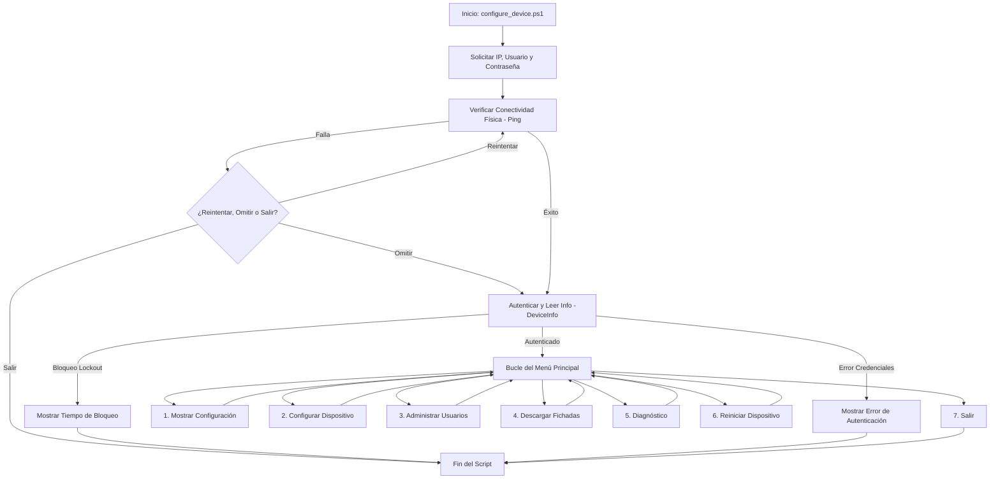

2# Guía Técnica Oficial de configure_device.ps1
## Única Fuente de Verdad Funcional y Operativa del Asistente de Configuración

---

## 1. Introducción

El script `configure_device.ps1` es una utilidad interactiva de administración, diagnóstico y configuración local desarrollada en PowerShell para los terminales de control de acceso y asistencia biométrica **Hikvision DS-K1A8503MF**. 

### Objetivos
* **Automatización de la Puesta en Marcha**: Simplificar el aprovisionamiento de dispositivos en red, configurando de manera interactiva la dirección del servidor de eventos (Tomcat/STARH) en tiempo real.
* **Gestión de Personal sin Intermediarios**: Proveer un canal directo para listar, buscar, crear, modificar y eliminar usuarios (con tarjetas, huellas o claves asociadas) sin depender de softwares como *iVMS-4200*, *HikCentral* o *BioTime*.
* **Descarga Segura de Fichadas**: Proveer un mecanismo robusto para descargar y formatear el historial de eventos directamente desde la base de datos interna de la terminal, exportándolo a un formato CSV específico y compatible con el sistema de RRHH de STARH.
* **Herramienta de Diagnóstico en Campo**: Facilitar a los técnicos de instalación un menú rápido para verificar el estado de salud del hardware, la diferencia horaria con respecto al servidor y la comunicación de red.

### Alcance
El script se ejecuta en entornos Windows a través de la consola de PowerShell y se comunica mediante protocolo HTTP utilizando llamadas **ISAPI (Intelligent Security API)** encapsuladas con la herramienta de línea de comandos `curl.exe`.

### Casos de Uso
1. **Instalación Inicial**: Configuración del canal real-time push (Slot 2) en el dispositivo apuntando a una PC de desarrollo local o al servidor de producción.
2. **Importación Masiva de Personal**: Carga masiva de usuarios en el biométrico a partir de plantillas CSV o planillas Excel generadas por sistemas de RRHH.
3. **Mantenimiento y Auditoría Horaria**: Validación de desvíos en la fecha/hora interna de la terminal y sincronización NTP con servidores UTC-3 (Argentina).
4. **Respaldo de Configuración**: Generación de respaldos JSON legibles que contienen la red, puertos, hora y suscripción de eventos del reloj.
5. **Descarga Mensual de Asistencia**: Extracción de fichadas para auditorías de nómina o importaciones manuales en sistemas de liquidación.

### Limitaciones
* No implementa la lectura o enrolamiento directo de plantillas biométricas (huellas/rostros) a través de la terminal de comandos de PowerShell; dicha operación se delega al hardware físico de la terminal.
* Depende de la presencia de `curl.exe` y la disponibilidad de conectividad TCP/IP directa (puerto HTTP 80/administración) hacia el terminal.

---

## 2. Arquitectura General

El script sigue un diseño secuencial interactivo basado en menús de consola. A nivel arquitectónico, delega el transporte y serialización de datos directamente al sistema operativo y a `curl.exe` mediante peticiones HTTP estructuradas en formatos XML y JSON.

### Flujo Principal de Ejecución



### Organización del Código y Responsabilidades

El archivo `configure_device.ps1` se divide en cinco bloques lógicos bien definidos:
1. **Configuración Global y UI**: Declaración de colores de consola, inicialización de variables de entorno y definición del directorio base `$script:scriptDir`.
2. **Validadores y Utilidades**: Funciones para comprobar formatos de dirección IP, puertos de red y hostnames mediante expresiones regulares.
3. **Manejo de Transacciones ISAPI XML**: Funciones encargadas de interactuar con la configuración del dispositivo (NTP, Hora, Slots de Notificaciones HTTP Host) utilizando payloads de tipo XML.
4. **Manejo de Transacciones ISAPI JSON (Gestión Humana y Eventos)**: Funciones para buscar, crear, eliminar usuarios y descargar eventos a través de payloads JSON limpios codificados estrictamente en UTF-8 sin BOM.
5. **Bucle de Consola y Orquestación**: Menús principales e interactivos que solicitan datos al usuario y presentan los reportes en pantalla.

---

## 3. Requisitos de Entorno

Para garantizar la correcta ejecución del asistente interactivo, la estación de trabajo del técnico debe cumplir con los siguientes requisitos:

* **Sistema Operativo**: Windows 10, Windows 11, o Windows Server 2016 (o superior).
* **Entorno de Ejecución**: PowerShell v5.1 en adelante (compatible con PowerShell 7.x).
* **Políticas de Ejecución**: La política de ejecución de PowerShell debe permitir la ejecución de scripts locales. Puede habilitarse mediante la consola de administrador:
  ```powershell
  Set-ExecutionPolicy -ExecutionPolicy RemoteSigned -Scope LocalMachine
  ```
* **Herramienta Curl**: Se requiere `curl.exe` con soporte para cifrado Digest (`--digest`). Windows 10 (compilación 1803 y posterior) incluye `curl` de forma nativa en `C:\Windows\System32\curl.exe`.
* **Automatización Excel (Opcional)**: Para realizar la importación masiva de usuarios utilizando archivos `.xlsx` o `.xls`, el equipo debe poseer una instalación local de **Microsoft Excel**, ya que el script utiliza el motor de automatización COM (`New-Object -ComObject Excel.Application`) para realizar la conversión a CSV en segundo plano. Si no se cuenta con Excel, el archivo de importación debe guardarse previamente en formato CSV delimitado por comas o punto y coma.

---

## 4. Compatibilidad de Hardware y Firmware

El asistente interactivo ha sido validado bajo un entorno de producción controlado:

| Parámetro | Detalle Validado |
| --- | --- |
| **Dispositivo Core** | Hikvision DS-K1A8503MF (Línea de Asistencia de Valor) |
| **Firmware Homologado** | `V1.4.0 build 230403` (o superior compatible con ISAPI JSON v2.0) |
| **Método de Autenticación** | HTTP Digest Authentication (Requerido por protocolo Hikvision) |
| **Formato de Comunicación** | XML para endpoints de sistema, JSON para endpoints de Access Control |

### Limitaciones de Compatibilidad Solucionadas
* **Incompatibilidad de Parámetros Complejos**: Los firmwares simplificados del modelo `DS-K1A8503MF` rechazan payloads JSON de usuario que contengan campos avanzados como fechas de vigencia estrictas, sectores o géneros. El script soluciona esto de manera transparente implementando un **mecanismo autocurativo de 3 niveles** (detallado en la Sección 6).
* **Restricción de Borrado Detallado**: Ciertas versiones de firmware devuelven error al intentar borrar credenciales de forma aislada a través del endpoint `UserInfoDetail/Delete`. El script implementa un **fallback automático** al endpoint básico `UserInfo/SetUp` con el flag `deleteUser = $true` si la primera operación es rechazada.

---

## 5. Flujo de Ejecución Detallado

A continuación, se detalla el ciclo de vida del script desde el inicio hasta el menú interactivo:

```text
[Inicio del Script]
       │
       ▼
1. Solicitud de IP del Reloj ◄─────────────────────────┐ (Bucle de validación IP)
       │                                               │
       ▼                                               │
2. Solicitud de Credenciales (admin / contrasena)      │
       │                                               │
       ▼                                               │
3. Prueba de Conectividad Física (Ping)                │
       ├── Éxito ──► Continúa                          │
       └── Falla ──► Consultar Acción ─────────► [Reintentar]
                          ├── [Omitir] ──► Continúa
                          └── [Salir]  ──► [Fin]
       │
       ▼
4. Autenticación ISAPI (DeviceInfo)
       ├── Error 401 ──► [Fin] (Credenciales incorrectas)
       ├── userCheck ──► [Fin] (Usuario bloqueado/lockout)
       └── Éxito     ──► Cargar Modelo, Serie, Firmware
       │
       ▼
5. Despliegue del Menú Principal (Interactive Loop)
```

---

## 6. Funcionalidades Implementadas

El script encapsula la complejidad de las tramas ISAPI a través de interfaces visuales limpias:

### 6.1. Mostrar Configuración del Reloj
Realiza llamadas secuenciales a los endpoints de Red, Puertos, Tiempo e HTTP Hosts para consolidar en una sola pantalla el estado actual del dispositivo.

### 6.2. Configuración para Desarrollo Local (Tomcat)
Detecta la IP local de la PC del técnico (priorizando interfaces activas de Ethernet o Wi-Fi) y asocia el canal de notificaciones (Slot 2) de la terminal hacia el endpoint del listener de desarrollo en Tomcat (ej: `HTTP://[IP_PC]:8088/biometric/api/hikvision/event/TMT01`) utilizando formato XML.

### 6.3. Configuración para Producción (Cloud)
Debido a las limitaciones del firmware del dispositivo (que no soporta HTTPS, dominios ni puertos menores a 1024), **no es posible conectar el reloj directamente a la nube**. 

En su lugar, el script configura el canal de notificaciones en el **Slot 2** apuntando a un **Proxy Local de Relevo (Nginx)** instalado en la red local (ej. `HTTP://[IP_PC_PROXY]:8088/biometric/api/hikvision/event/TMT01` en formato XML), el cual se encarga de recibir la trama HTTP plano en puerto `8088` y retransmitirla mediante HTTPS y cifrado SSL al servidor en la nube (`https://sta-gestion.com:443`).

### 6.4. Configuración Personalizada
Permite al técnico configurar de forma manual cada parámetro de red de notificaciones del Slot 2: direccionamiento (IP o Hostname), dirección IP o dominio, puerto TCP, protocolo (HTTP/HTTPS) y formato (XML/JSON).

### 6.5. Sincronización Horaria y NTP
Lee la fecha y hora interna de la terminal. Si el usuario lo acepta, la sincroniza con la hora actual de la PC del técnico y establece la zona horaria en **`CST+03:00:00`** (notación de Hikvision para representar la zona horaria de Argentina UTC-3) configurando el servidor `pool.ntp.org` en puerto `123` para actualizaciones diarias automáticas (intervalo de 1440 minutos).

### 6.6. Copia de Seguridad (Exportar Configuración)
Genera una estructura de datos JSON consolidada con toda la configuración crítica del terminal y la exporta al archivo local `config_respaldo_[SERIAL].json` en el directorio de ejecución.

### 6.7. Diagnóstico Integral de Campo
Ejecuta de manera secuencial 5 pruebas de integridad: conectividad ICMP, autenticación HTTP Digest, estado de CPU y memoria interna, desvío horario relativo con el reloj de la PC (alerta si la diferencia supera los 60 segundos), y estado de conexión y destino del canal de notificaciones en el Slot 2.

### 6.8. Reinicio Remoto
Envía una petición controlada para reiniciar la placa lógica del biométrico. Advierte al técnico en consola que la terminal se desconectará por un lapso de 1 a 2 minutos.

### 6.9. Administración de Usuarios (Submenú)

#### A. Listar y Buscar
Presenta un listado tabular con los ID de empleado, nombres, cantidad de tarjetas asignadas, huellas grabadas, rostros enrolados y tipo de cuenta de todos los usuarios de la terminal.

#### B. Creación y Modificación con Autocuración
Crea o actualiza credenciales interactuando con `/ISAPI/AccessControl/UserInfo/SetUp?format=json`. Ante un error de tipo `badParameters` (parámetros no soportados por el firmware de la terminal), el script aplica de forma automática reintentos recursivos degradando los campos de la trama en 3 niveles de compatibilidad:
* **Nivel 1 (Completo)**: Envía ID, nombre completo, género, sector (grupo de pertenencia), vigencia permanente (`Valid`) y PIN de teclado.
* **Nivel 2 (Básico + Validez + PIN)**: Omite campos de género y sector (causa común de fallos en firmwares económicos).
* **Nivel 3 (Mínimo)**: Envía únicamente ID, nombre completo, tipo de usuario (`normal`) y PIN, garantizando compatibilidad absoluta con cualquier terminal Hikvision.

#### C. Eliminación Segura y Fallback
Para evitar registros corruptos, el script intenta primero el **borrado detallado** a través de `/ISAPI/AccessControl/UserInfoDetail/Delete?format=json` (el cual elimina de manera limpia huellas, tarjetas y datos personales). Si el firmware de la terminal rechaza la operación, el script ejecuta automáticamente un **fallback al borrado básico** enviando un comando PUT al endpoint de configuración `/ISAPI/AccessControl/UserInfo/SetUp?format=json` configurando la propiedad `deleteUser = $true`.

#### D. Importación Masiva desde CSV/Excel
Permite importar lotes de personal leyendo un archivo `.csv` o planilla Excel (`.xlsx` o `.xls`). 
* **Conversión Transparente**: Si es un archivo de Excel, abre un proceso COM invisible de Excel, guarda la hoja de cálculo activa como CSV temporal, y cierra el proceso de forma segura.
* **Autodetector de Delimitadores**: Analiza la primera línea del archivo para identificar dinámicamente si el delimitador de columnas es una coma (`,`), punto y coma (`;`) o tabulador (`\t`).
* **Mapeo Inteligente de Cabeceras**: Busca y asocia dinámicamente los nombres de columna del archivo utilizando expresiones regulares de aproximación para las columnas esenciales: `ID/Legajo/DNI`, `Nombre`, `Apellido`, `Sector/Grupo`, `Género/Sexo`, y `PIN/Password`.
* **Procesamiento por Lotes**: Limpia los espacios, valida la composición numérica de los IDs de empleado, construye los nombres completos y ejecuta la llamada de alta autocurativa de 3 niveles para cada registro del lote de manera progresiva.

#### E. Descarga y Exportación de Fichadas (Etapa 5)
Permite descargar todo el historial de accesos de la terminal sin filtros de fecha en la consulta del biométrico para evitar errores de traducción UTC.
* **Paginación Interactiva**: Consulta el endpoint `/ISAPI/AccessControl/AcsEvent?format=json` iterando la posición de lectura de 50 en 50 registros mientras la respuesta de la terminal indique `"responseStatusStrg": "MORE"`.
* **Resolución de Nombres en Fichadas**: Cruza la base de datos de usuarios de la terminal en tiempo real para resolver el ID de empleado (`employeeNo`) a su correspondiente nombre. Si el nombre no está configurado o el ID no se encuentra en el listado de personal de la terminal, se asigna el valor `"DESCONOCIDO"` (evitando columnas vacías o dobles comas en el reporte).
* **Lógica de Dirección Alternante (Entrada/Salida)**: Debido a que la terminal DS-K1A8503MF devuelve el estado de asistencia (`attendanceStatus`) como `"undefined"` en sus eventos crudos, el script ordena cronológicamente los registros de cada empleado por día. Luego, de manera alternante, asigna `"Entrada"` a las fichadas impares de la jornada y `"Salida"` a las fichadas pares.
* **Inmunidad a Desfases Horarios**: Extrae los primeros 19 caracteres de la marca horaria (`yyyy-MM-ddTHH:mm:ss`), descartando el offset de zona horaria para conservar el tiempo exacto que registró la pantalla del terminal al momento de fichar.
* **Formato de Exportación del Sistema de Asistencia**: Genera un archivo CSV con codificación **Windows-1252 (ANSI)** (legible nativamente por Microsoft Excel y editores de texto locales sin corrupción de letras con acento como `ó`). 
* **Nombre de Archivo Dinámico**: Propone como nombre sugerido por defecto el mes y año consultado (ej: `FICHADAS JUNIO 2026.csv` o `FICHADAS COMPLETO 2026.csv`) en el directorio del script. Admite confirmación interactiva `[S/N]` para evitar la generación de archivos con nombres erróneos al presionar la tecla `S`.

---

## 7. Estructura de Configuración del Dispositivo

El script modifica y parametriza los siguientes bloques en el biométrico a través de la API ISAPI:

### 7.1. Event Host Listener (Notificaciones HTTP Host)
* **Endpoint**: `POST /ISAPI/Event/notification/httpHosts`
* **XML de Configuración**:
  ```xml
  <HttpHostNotification version="2.0" xmlns="http://www.isapi.org/ver20/XMLSchema">
    <id>2</id>
    <url>[URL_API_EVENTOS]</url>
    <protocolType>[HTTP_O_HTTPS]</protocolType>
    <parameterFormatType>[XML_O_JSON]</parameterFormatType>
    <addressingFormatType>[ipaddress_O_hostname]</addressingFormatType>
    <ipAddress>[IP_SERVIDOR]</ipAddress> <!-- O <hostName>[DOMINIO]</hostName> -->
    <portNo>[PUERTO_TCP]</portNo>
    <httpAuthenticationMethod>none</httpAuthenticationMethod>
    <SubscribeEvent>
      <eventMode>all</eventMode>
    </SubscribeEvent>
  </HttpHostNotification>
  ```
* **Ubicación en el Script**: Función `Set-HttpHostConfig`.

### 7.2. Ajustes Horarios y NTP
* **Endpoint**: `PUT /ISAPI/System/time`
* **XML de Configuración**:
  ```xml
  <Time version="2.0" xmlns="http://www.isapi.org/ver20/XMLSchema">
    <timeMode>NTP</timeMode>
    <localTime>[HORA_PC_FORMATEADA_YYYY-MM-DDTHH:MM:SS]</localTime>
    <timeZone>CST+03:00:00</timeZone>
    <NTPServer>
      <addressingFormatType>hostname</addressingFormatType>
      <hostName>pool.ntp.org</hostName>
      <portNo>123</portNo>
      <synchronizingInterval>1440</synchronizingInterval>
    </NTPServer>
  </Time>
  ```
* **Ubicación en el Script**: Función `Sync-DeviceTime`.

### 7.3. Alta y Edición de Usuario (Nivel 1 Completo)
* **Endpoint**: `PUT /ISAPI/AccessControl/UserInfo/SetUp?format=json`
* **Payload JSON**:
  ```json
  {
    "UserInfo": {
      "employeeNo": "[ID_EMPLEADO]",
      "name": "[NOMBRE_COMPLETO]",
      "userType": "normal",
      "gender": "[male_O_female_O_unknown]",
      "belongGroup": "[SECTOR_O_GRUPO]",
      "password": "[PIN_OPCIONAL]",
      "Valid": {
        "enable": false,
        "beginTime": "2000-01-01T00:00:00",
        "endTime": "2037-12-31T23:59:59"
      }
    }
  }
  ```
* **Ubicación en el Script**: Función `Set-DeviceUser`.

---

## 8. Inventario de Funciones en PowerShell

A continuación se detalla el listado completo de funciones integradas en `configure_device.ps1`:

### 8.1. `Show-Header`
* **Propósito**: Imprime el encabezado visual del asistente en color Cyan.
* **Llamadas ISAPI**: Ninguna.

### 8.2. `Test-IPAddress`
* **Parámetros**: `$ip` (string).
* **Retorno**: Boolean.
* **Propósito**: Valida que el formato de entrada de la IP sea correcto mediante parseo de red de .NET.

### 8.3. `Test-Port`
* **Parámetros**: `$port` (string/int).
* **Retorno**: Boolean.
* **Propósito**: Comprueba que el puerto esté en el rango TCP válido (1 - 65535).

### 8.4. `Test-Hostname`
* **Parámetros**: `$hostName` (string).
* **Retorno**: Boolean.
* **Propósito**: Ejecuta una validación de expresión regular para verificar dominios/hosts compatibles.

### 8.5. `Get-CurrentHttpHosts`
* **Propósito**: Consulta y despliega la configuración del Slot 2.
* **Llamadas ISAPI**: `GET /ISAPI/Event/notification/httpHosts` (Digest Auth).

### 8.6. `Sync-DeviceTime`
* **Propósito**: Lee la hora y ofrece sincronizarla con la PC local y NTP (`pool.ntp.org` en zona `CST+03:00:00`).
* **Llamadas ISAPI**: `GET /ISAPI/System/time`, `PUT /ISAPI/System/time`.

### 8.7. `Set-HttpHostConfig`
* **Parámetros**: `$ipOrHost`, `$port`, `$protocol`, `$url`, `$format`, `$isIpAddress`.
* **Propósito**: Configura el Slot 2, valida la persistencia de los datos en la terminal y ejecuta el test de comunicación de red.
* **Llamadas ISAPI**: 
  - `GET /ISAPI/Event/notification/httpHosts` (Lectura)
  - `POST /ISAPI/Event/notification/httpHosts` (Escritura)
  - `POST /ISAPI/Event/notification/httpHosts/2/test` (Conectividad)

### 8.8. `Search-DeviceUsers`
* **Parámetros**: `$searchQuery` (string, opcional).
* **Retorno**: Array de objetos de usuario.
* **Propósito**: Busca usuarios por ID o por nombre utilizando un payload JSON libre de BOM.
* **Llamadas ISAPI**: `POST /ISAPI/AccessControl/UserInfo/Search?format=json`.

### 8.9. `Set-DeviceUser`
* **Parámetros**: `$employeeNo`, `$name`, `$gender`, `$belongGroup`, `$passwordVal`.
* **Retorno**: Boolean.
* **Propósito**: Crea o actualiza un usuario en la terminal implementando la lógica autocurativa degradante de 3 niveles de compatibilidad.
* **Llamadas ISAPI**: `PUT /ISAPI/AccessControl/UserInfo/SetUp?format=json`.

### 8.10. `Delete-DeviceUser`
* **Parámetros**: `$employeeNo` (string).
* **Retorno**: Boolean.
* **Propósito**: Elimina un usuario por ID. Intenta el borrado completo de credenciales y cae en fallback de borrado básico si este falla.
* **Llamadas ISAPI**:
  - `PUT /ISAPI/AccessControl/UserInfoDetail/Delete?format=json` (Completo)
  - `PUT /ISAPI/AccessControl/UserInfo/SetUp?format=json` (Fallback Básico)

### 8.11. `Get-DeviceEvents`
* **Retorno**: Array de eventos en formato JSON.
* **Propósito**: Descarga de forma paginada y progresiva de 50 en 50 la base de datos de fichadas usando el identificador de consulta `"searchID": "1"`.
* **Llamadas ISAPI**: `POST /ISAPI/AccessControl/AcsEvent?format=json`.

### 8.12. `Invoke-DownloadEvents`
* **Propósito**: Ejecuta el flujo interactivo de fichadas: solicita mes (0-12), descarga eventos, resuelve nombres de personal (asigna `"DESCONOCIDO"` ante nombres vacíos para prevenir dobles comas), calcula la dirección de flujo (Entrada/Salida alternantes) y exporta el CSV en Windows-1252 ANSI con confirmación interactiva de ruta `[S/N]`.
* **Llamadas ISAPI**: Llama internamente a `Get-DeviceEvents` y `Search-DeviceUsers`.

### 8.13. `Show-UsersMenu`
* **Propósito**: Despliega el menú interactivo para la gestión de usuarios (Lista, Búsqueda, Alta, Baja, Importación Masiva).
* **Llamadas ISAPI**: Invoca funciones internas de usuario.

### 8.14. `Convert-ExcelToCsv`
* **Parámetros**: `$excelPath`, `$csvPath`.
* **Retorno**: Boolean.
* **Propósito**: Abre un subproceso de Microsoft Excel vía COM, realiza la conversión del archivo de cálculo a CSV nativo y cierra el proceso de forma segura.

### 8.15. `Get-CsvDelimiter`
* **Parámetros**: `$filePath` (string).
* **Retorno**: Carácter delimitador (`;`, `\t` o `,`).
* **Propósito**: Examina la primera línea del archivo de importación para identificar el formato de delimitación de columnas.

### 8.16. `Find-CsvHeader`
* **Parámetros**: `$headers` (array), `$matchPatterns` (array).
* **Retorno**: Nombre real de la columna (string o null).
* **Propósito**: Compara de forma tolerante y flexible las columnas del archivo importado con patrones conocidos de RRHH.

### 8.17. `Import-DeviceUsersBatch`
* **Parámetros**: `$filePath` (string).
* **Propósito**: Carga masiva de usuarios en la terminal a partir de un archivo. Resuelve la conversión desde Excel, el mapeo de columnas y ejecuta Set-DeviceUser en bucle controlado con estadísticas.

### 8.18. `Get-DeviceNetworkConfig`
* **Retorno**: Hashtable con direccionamiento, IP, máscara, gateway y servidores DNS.
* **Llamadas ISAPI**: `GET /ISAPI/System/Network/interfaces/1/ipAddress`.

### 8.19. `Get-DevicePorts`
* **Retorno**: Hashtable con puertos HTTP, HTTPS, SDK y RTSP.
* **Llamadas ISAPI**: `GET /ISAPI/System/Network/UPnP/ports`.

### 8.20. `Show-DeviceConfig`
* **Propósito**: Imprime en consola un desglose estético del estado físico e interno de la máquina.

### 8.21. `Export-DeviceConfig`
* **Propósito**: Compila los parámetros y los escribe en un archivo JSON en disco como respaldo.

### 8.22. `Get-DeviceStatus`
* **Retorno**: Hashtable con uso de CPU, memoria, uptime y fecha del hardware.
* **Llamadas ISAPI**: `GET /ISAPI/System/status`.

### 8.23. `Invoke-DeviceReboot`
* **Propósito**: Envía la señal de reinicio a la CPU del terminal.
* **Llamadas ISAPI**: `PUT /ISAPI/System/reboot`.

### 8.24. `Show-DiagnosticsMenu`
* **Propósito**: Orquesta la ejecución de diagnósticos mostrando los resultados en pantalla utilizando colores (OK = Green, WARNING = Yellow, ERROR = Red).

---

## 9. Flujo e Inventario de Endpoints ISAPI

El asistente interactivo utiliza únicamente los siguientes endpoints de la interfaz ISAPI de Hikvision:

| Método | Endpoint | Tipo de Payload | Finalidad | Función Asociada |
| --- | --- | --- | --- | --- |
| **GET** | `/ISAPI/System/deviceInfo` | XML | Obtener modelo, número de serie y versión de firmware. | Flujo de inicio / `Show-DiagnosticsMenu` |
| **GET** | `/ISAPI/System/status` | XML | Consultar recursos de hardware (CPU, memoria) y tiempo de actividad. | `Get-DeviceStatus` / `Show-DiagnosticsMenu` |
| **GET** | `/ISAPI/System/time` | XML | Obtener la fecha, hora y configuración de NTP del reloj. | `Sync-DeviceTime` / `Show-DeviceConfig` |
| **PUT** | `/ISAPI/System/time` | XML | Configurar la hora y asociar el servidor NTP. | `Sync-DeviceTime` |
| **GET** | `/ISAPI/Event/notification/httpHosts` | XML | Leer los servidores HTTP de escucha configurados en el dispositivo. | `Get-CurrentHttpHosts` / `Set-HttpHostConfig` |
| **POST**| `/ISAPI/Event/notification/httpHosts` | XML | Guardar la configuración de servidor de eventos (Slot 2). | `Set-HttpHostConfig` |
| **POST**| `/ISAPI/Event/notification/httpHosts/2/test` | XML | Ejecutar la prueba de conexión física desde el reloj hacia el servidor. | `Set-HttpHostConfig` |
| **GET** | `/ISAPI/System/Network/interfaces/1/ipAddress` | XML | Leer direccionamiento de red (IP, máscara, gateway, DNS). | `Get-DeviceNetworkConfig` |
| **GET** | `/ISAPI/System/Network/UPnP/ports` | XML | Leer los puertos TCP mapeados en el terminal. | `Get-DevicePorts` |
| **PUT** | `/ISAPI/System/reboot` | XML | Reiniciar el dispositivo biométrico de forma remota. | `Invoke-DeviceReboot` |
| **POST**| `/ISAPI/AccessControl/UserInfo/Search?format=json` | JSON | Buscar o listar usuarios registrados en el terminal. | `Search-DeviceUsers` |
| **PUT** | `/ISAPI/AccessControl/UserInfo/SetUp?format=json` | JSON | Crear/modificar usuarios o aplicar el borrado básico (deleteUser). | `Set-DeviceUser` / `Delete-DeviceUser` |
| **PUT** | `/ISAPI/AccessControl/UserInfoDetail/Delete?format=json` | JSON | Borrado completo de usuarios (datos personales + biométricos). | `Delete-DeviceUser` |
| **POST**| `/ISAPI/AccessControl/AcsEvent?format=json` | JSON | Consultar el registro histórico de fichajes y marcas horarias. | `Get-DeviceEvents` |

> [!IMPORTANT]
> Todos los endpoints JSON (`format=json`) son estrictamente sensibles a la presencia del carácter BOM (Byte Order Mark). El script previene esto guardando los archivos temporales utilizando la clase de codificación `System.Text.UTF8Encoding($false)`.

---

## 10. Archivos Utilizados y Generados

El entorno de ejecución del script interactúa con los siguientes archivos:

* **`configure_device.ps1`**: El script principal de automatización.
* **`plantilla_importacion.csv`**: Archivo de muestra autogenerado en el directorio del script para servir como plantilla técnica de carga de personal.
* **`config_respaldo_[SERIAL].json`**: Archivo generado al exportar la configuración. Almacena las propiedades físicas, de red y de escucha de eventos en formato JSON legible.
* **`FICHADAS [MES] [AÑO].csv`** o **`FICHADAS COMPLETO [AÑO].csv`**: Archivos de salida autogenerados por el proceso de descarga de eventos. Utilizan codificación Windows-1252 y un formato estructurado de 6 columnas sin espacios superfluos.
* **Archivos Temporales (`$env:TEMP`)**: El script genera archivos temporales para almacenar los JSON y XML de solicitud antes de ser inyectados en `curl.exe`, así como archivos temporales para volcar las respuestas JSON/XML devueltas por el dispositivo. Todos estos archivos se eliminan del sistema antes de finalizar cada función mediante bloques `try/finally` y comprobaciones de existencia de ruta (`Test-Path`).

---

## 11. Manejo de Errores y Excepciones

El script cuenta con políticas estrictas de control de errores para garantizar la resiliencia en operaciones críticas:

### 11.1. Autenticación Fallida y Bloqueo Temporal (Lockout)
* **Error**: Al ingresar credenciales erróneas de forma consecutiva, el servidor ISAPI bloquea la dirección IP de origen y devuelve una respuesta con la etiqueta `<userCheck>`.
* **Manejo**: El script parsea este nodo, extrae los segundos restantes de penalización (`unlockTime`), notifica al técnico de forma clara en color rojo y finaliza la ejecución de forma segura para evitar bloqueos prolongados.

### 11.2. Fallos en el Envío de Tratas JSON/XML (Código de Curl)
* **Error**: Fallas físicas de cableado, IPs erróneas o caídas del canal durante la transmisión.
* **Manejo**: Se evalúa la variable `$LASTEXITCODE` inmediatamente después de invocar a `curl.exe`. Si es diferente de `0`, se captura el error del proceso de Curl y se detiene el bucle de envío impidiendo un ciclo infinito de reintentos.

### 11.3. Fallos de Esquema y Autocuración
* **Error**: El terminal biométrico devuelve `badParameters` (Código de estado HTTP 200 con JSON indicando error de parámetros) al intentar crear un usuario con campos no soportados.
* **Manejo**: La función `Set-DeviceUser` evalúa el valor `subStatusCode`. Si es `"badParameters"`, degrada de manera progresiva el nivel de la trama (omitiendo campos problemáticos como género, sector o rango de vigencia) y realiza hasta 2 reintentos transparentes.

### 11.4. Tratamiento del Bloque `ResponseStatus`
* **Error**: Algunas respuestas de error en terminales Hikvision devuelven la información de estado envuelta en un nodo principal `ResponseStatus`, mientras que en fallos severos la terminal devuelve los campos `statusCode`, `statusString` y `subStatusCode` directamente en la raíz del JSON.
* **Manejo**: El script evalúa de forma dinámica ambos escenarios antes de determinar si la operación fue exitosa:
  ```powershell
  if ($res.ResponseStatus) {
      $statusCode = $res.ResponseStatus.statusCode
      $statusString = $res.ResponseStatus.statusString
  } else {
      $statusCode = $res.statusCode
      $statusString = $res.statusString
  }
  ```

---

## 12. Logging de Consola y Visualización

El asistente interactivo utiliza un sistema de **Logging Visual** en tiempo real codificado mediante colores para facilitar la lectura del técnico en campo:

* **Cyan (`$titleColor`)**: Encabezados de sección, menús y divisiones estructurales.
* **Gray (`$infoColor`)**: Mensajes de progreso, descargas de registros en lotes y listados tabulares de datos.
* **Green (`$successColor`)**: Confirmaciones exitosas (`[OK]`, importación completada, autenticación exitosa).
* **Yellow (`$warnColor`)**: Advertencias de sistema (`[WARNING]`, desviaciones horarias de sincronización, reintentos de compatibilidad en degradación de tramas).
* **Red (`$errorColor`)**: Errores críticos de red, respuestas de error del reloj (`[ERROR Reloj]`), excepciones no controladas de PowerShell y fallos en archivos.

---

## 13. Parámetros de Ejecución

El script está diseñado para ejecutarse de forma interactiva en la consola de PowerShell.

### Comando Estándar
Para iniciar el asistente interactivo:
```powershell
.\configure_device.ps1
```

### Entrada Enmascarada
Para garantizar la confidencialidad en entornos empresariales, el campo de contraseña se captura utilizando el cmdlet `Read-Host -AsSecureString` (mostrando caracteres de asterisco `*` en pantalla). El script realiza la conversión segura en memoria a texto plano para el envío mediante `curl.exe` y descarta la variable inmediatamente para evitar exposición.

---

## 14. Guía de Uso del Asistente

A continuación, se describen los pasos para operar los escenarios más comunes en el ciclo de vida de un terminal biométrico:

### 14.1. Instalación de un Dispositivo Nuevo
1. Conecte el terminal biométrico a la red eléctrica y al switch de datos.
2. Inicie el script interactivo ejecutando `.\configure_device.ps1`.
3. Ingrese la dirección IP asignada a la terminal (ej: `192.168.1.37`).
4. Ingrese el usuario (`admin`) y la contraseña del terminal.
5. El script realizará la comprobación de ping y la validación de credenciales.
6. En el menú principal, ingrese a la opción **`[2] Configurar dispositivo`**.
7. Ingrese a la opción **`[4] Sincronizar Hora y Configurar NTP`** para ajustar el huso horario y actualizar la hora.
8. Regrese al submenú de configuración y elija la opción **`[1] Desarrollo Local`** (si está en su PC de desarrollo) o **`[2] Produccion Cloud`** para apuntar al servidor correspondiente.
9. Confirme los cambios y visualice el mensaje `[VERIFICACION EXITOSA]`.
10. Compruebe que la prueba de conexión integrada finalice con `[TEST EXITOSO]`.

### 14.2. Reconfiguración por Cambio de IP de la Terminal
1. Ejecute el script.
2. Introduzca la nueva IP de la terminal en el Paso 1.
3. El script se conectará al nuevo direccionamiento IP y le permitirá gestionar el dispositivo a través de los menús normales.
4. *Nota*: Si la IP de la PC de desarrollo cambió, acceda a **`[2] Configurar dispositivo`** -> **`[1] Configurar para DESARROLLO LOCAL`** para re-asociar el Slot 2 con la nueva IP de su máquina.

### 14.3. Cambio del Servidor de Eventos (Tomcat o Cloud)
1. Ejecute el script y autentíquese.
2. Ingrese a la opción **`[2] Configurar dispositivo`**.
3. Seleccione **`[3] Configuracion PERSONALIZADA`**.
4. Ingrese la nueva dirección IP o nombre de host del nuevo servidor.
5. Especifique el puerto TCP, protocolo y formato de tramas (se recomienda XML).
6. Confirme la grabación y verifique que la prueba de conectividad retorne exitosa.

### 14.4. Cambio de Credenciales del Dispositivo
1. Si ha cambiado la contraseña de administración del terminal a través del portal web o iVMS, simplemente inicie el script de forma normal.
2. El script le solicitará la nueva contraseña en el Paso 1. Al ingresarla, establecerá la nueva firma Digest para todas las transacciones futuras.

### 14.5. Reemplazo Físico de un Dispositivo
1. Coloque el nuevo reloj biométrico en la red y asígnele la dirección IP del dispositivo viejo.
2. Ejecute el script e inicie sesión.
3. Vaya a la opción **`[2] Configurar dispositivo`** -> **`[1]`** o **`[2]`** para aprovisionar el canal de eventos (Slot 2) en el nuevo terminal.
4. Vaya a la opción **`[3] Administrar usuarios`** -> **`[5] Importar usuarios`**.
5. Seleccione la plantilla CSV o planilla Excel que contiene al personal autorizador.
6. Confirme la importación masiva para restablecer la base de datos de usuarios autorizados en el nuevo terminal de forma inmediata.

### 14.6. Diagnóstico y Selftest en Producción
1. Inicie el script y vaya a la opción **`[5] Diagnostico`**.
2. Revise que la conectividad física de red esté en estado `OK`.
3. Valide que el estado del procesador y memoria interna se lean correctamente.
4. Compruebe que el desvío horario sea menor a 60 segundos. Si reporta `WARNING`, ejecute la sincronización de tiempo.
5. Verifique que el canal de notificaciones (Slot 2) apunte al servidor correcto y esté en estado `OK`.

---

## 15. Buenas Prácticas de Operación

### 15.1. Para Técnicos Instaladores
* **Aprovisionamiento DNS**: Siempre configure un servidor DNS válido (ej: `8.8.8.8`) en la sección de red del biométrico antes de apuntar el canal de eventos a un dominio cloud (`sta-gestion.com`). Si la terminal no puede resolver la dirección, la prueba de conexión del host fallará.
* **Sincronización Previa**: Antes de realizar cualquier enrolamiento biométrico o importación de personal, sincronice la hora del reloj. Los logs de asistencia se indexan con la estampa horaria interna del terminal; un desvío puede invalidar las marcas históricas.

### 15.2. Para Administradores de RRHH
* **Maestro de Datos Único**: Considere el sistema web (OpenXava) o el archivo de importación oficial como el maestro de datos único. Evite crear o modificar usuarios de forma manual directamente en el reloj si utiliza la importación masiva, para prevenir inconsistencias en los IDs de legajo.
* **Control de ID de Empleado**: Los IDs de empleado deben ser puramente numéricos. No asigne letras ni caracteres especiales a la columna de legajos en sus archivos de importación.

### 15.3. Para Desarrolladores
* **Preservación de Codificación sin BOM**: Al modificar el script o agregar nuevos payloads JSON a endpoints ISAPI, asegure que las tramas se escriban en disco temporal utilizando la clase de codificación `System.Text.UTF8Encoding($false)`. Los caracteres BOM en la cabecera del payload JSON causarán un fallo inmediato de tipo `badParameters` por parte del parser del firmware del reloj.
* **Utilización de ANSI para Reportes**: Para cualquier exportación orientada a usuarios finales en Excel (como la descarga de fichadas), mantenga la codificación **Windows-1252 (ANSI)** al guardar el CSV para evitar la corrupción de letras con acento.

---

## 16. Riesgos de Operación y Mitigación

### 16.1. Bloqueo de Cuenta por Intentos Fallidos (Lockout)
* **Riesgo**: Ingresar una contraseña incorrecta más de 5 veces consecutivas bloquea temporalmente al usuario `admin` en la terminal por seguridad, devolviendo un error ISAPI persistente.
* **Mitigación**: Si esto ocurre, desconecte la alimentación eléctrica de la terminal biométrica por 10 segundos y vuelva a encenderla. El reinicio de hardware limpia la tabla de bloqueos temporales en memoria, permitiendo el ingreso inmediato.

### 16.2. Pérdida del Canal de Fichadas Real-Time
* **Riesgo**: Si el servidor Tomcat local o el servidor cloud cambian de IP/puerto y no se actualiza el Slot 2 en la terminal, los eventos dejarán de transmitirse en tiempo real.
* **Mitigación**: La terminal acumula internamente los eventos en su base de datos local no volátil. Ejecute la opción **`[4] Descargar fichadas`** para extraer la base de datos de manera retroactiva y guardarla en formato CSV para su procesamiento manual, y reconfigure el Slot 2 a la nueva dirección del servidor.

### 16.3. Restricciones de Red e Incompatibilidad Directa con la Nube (SSL, DNS y Puerto)
* **Problema**: El reloj biométrico rechazará cualquier intento de configurarse directamente contra la URL cloud `https://sta-gestion.com:443`.
* **Detalle Técnico de las Restricciones de Firmware (DS-K1A8503MF)**:
  * **Protocolo HTTPS No Soportado**: El firmware del reloj solo admite `HTTP` plano y `EHome` (ISUP). Carece de las librerías necesarias para realizar negociaciones SSL/TLS.
  * **Direccionamiento Estricto por IP**: No soporta nombres de dominio (`hostname`) en su event-pusher, exigiendo direcciones IP numéricas.
  * **Rango de Puertos Restringido**: El validador XML del firmware exige que el puerto de destino se encuentre obligatoriamente en el rango `[1024 - 65535]`. Puertos bajos como el `80` o `443` lanzan un error inmediato de tipo `Invalid Content` al intentar guardar la configuración.
* **Mitigación Mandatoria (Uso de Proxy local Nginx)**: Es obligatorio configurar un proxy inverso ligero (Nginx para Windows) en la red local (generalmente en una PC encendida durante el horario comercial, como la de administración). El reloj transmite las fichadas por HTTP plano en puerto `8088` a la IP local de esta PC, y el proxy se encarga de traducirlas a HTTPS en puerto `443` y reenviarlas a `sta-gestion.com`. Si la PC del proxy se apaga fuera del horario de oficina, las fichadas se acumularán de forma segura en la memoria interna del reloj y se enviarán automáticamente en lote ni bien se encienda la PC por la mañana.

---

## 17. Limitaciones Técnicas del Script
* El script interactivo no provee funciones para registrar o modificar las huellas dactilares o patrones faciales del personal a través de código. La gestión física de la biometría debe realizarse de manera directa en el lector físico de la terminal.
* El script está diseñado para interactuar con un único dispositivo por ejecución. En redes con múltiples relojes biométricos, el asistente debe ejecutarse de forma independiente para cada IP física.

---

## 18. Futuras Líneas de Evolución
* **Automatización Multi-Reloj**: Desarrollar un modo no interactivo (mediante parámetros por línea de comandos) para permitir la ejecución del script desde tareas programadas de Windows, permitiendo actualizar configuraciones o descargar fichadas en redes con múltiples biométricos de manera simultánea.
* **Soporte de Conexión HTTPS Local**: Incorporar la capacidad de ignorar errores de certificados SSL no firmados en entornos locales al utilizar HTTPS en servidores Tomcat locales de prueba.

---

## 19. Mantenimiento y Extensibilidad del Código

Para cualquier desarrollador o agente de IA que deba modificar o añadir nuevas funciones al script `configure_device.ps1`, se establecen las siguientes reglas de oro:
1. **Preservación del Stack**: La comunicación con la terminal debe realizarse utilizando llamadas nativas a `curl.exe` con autenticación Digest. No intente reemplazar `curl.exe` por `Invoke-RestMethod` de PowerShell, ya que este último no maneja de forma nativa ni correcta la negociación de autenticación Digest de Hikvision bajo ciertos esquemas de red.
2. **Uso de Archivos Temporales Limpios**: Cada consulta al reloj debe volcar su entrada y salida en archivos temporales únicos, los cuales deben ser destruidos explícitamente en el bloque `finally` o al cierre de la función para no dejar residuos de contraseñas o datos de personal en el disco de la PC.
3. **Mantenimiento del Menú Interactividad**: Al añadir opciones a los menús principales o submenús, asegure que las entradas de selección se validen contra expresiones regulares y cuenten con la opción de retroceso a la pantalla anterior.

---

## 20. Apéndice Técnico

### Glosario de Términos
* **ISAPI**: *Intelligent Security API*. Protocolo propietario basado en estándares HTTP/REST desarrollado por Hikvision para la integración de sus cámaras y terminales de control de accesos.
* **HTTP Digest Authentication**: Método de autenticación web que aplica una función hash (MD5) a la contraseña del usuario junto con un número aleatorio provisto por el servidor antes de transmitir la firma por la red, garantizando que las credenciales nunca viajen en texto plano.
* **BOM**: *Byte Order Mark*. Carácter unicode que indica el orden de los bytes y la codificación de un archivo de texto. Causa errores severos si se inyecta en el parser de tramas JSON de los terminales de valor de Hikvision.
* **Real-Time Push / HTTP Host**: Mecanismo mediante el cual la terminal biométrica actúa como cliente HTTP y realiza una petición POST hacia un servidor externo cada vez que se produce una marca horaria o evento físico, transmitiendo los datos al instante.

### Referencias Documentales del Proyecto
1. [`Software Design Document/ISAPI-Access-Control.md`](file:///c:/Users/mem19/Documents/STARH/biometric-redondeo-op128-base-op128-corregida-en-server--1/Software%20Design%20Document/ISAPI-Access-Control.md): Especificación completa de la API ISAPI para control de accesos.
2. [`Software Design Document/Integración Hikvision DS-K1A8503MF.md`](file:///c:/Users/mem19/Documents/STARH/biometric-redondeo-op128-base-op128-corregida-en-server--1/Software%20Design%20Document/Integraci%C3%B3n%20Hikvision%20DS-K1A8503MF.md): Reporte de validación de campo e integración de hardware de la terminal biométrica DS-K1A8503MF.
3. [`Software Design Document/isapi.md`](file:///c:/Users/mem19/Documents/STARH/biometric-redondeo-op128-base-op128-corregida-en-server--1/Software%20Design%20Document/isapi.md): Catálogo general de llamadas de red de Hikvision.
