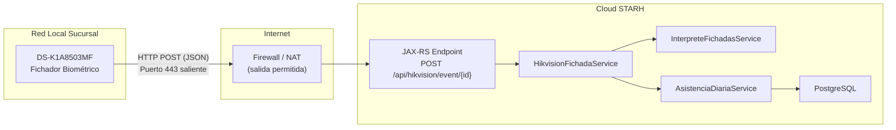
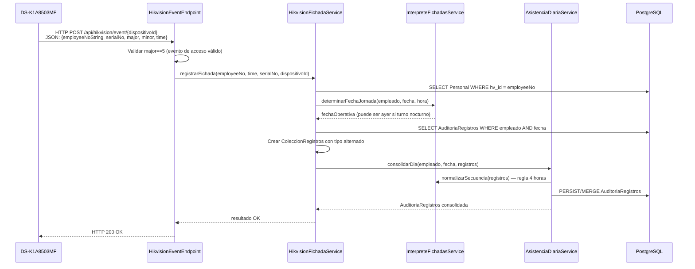
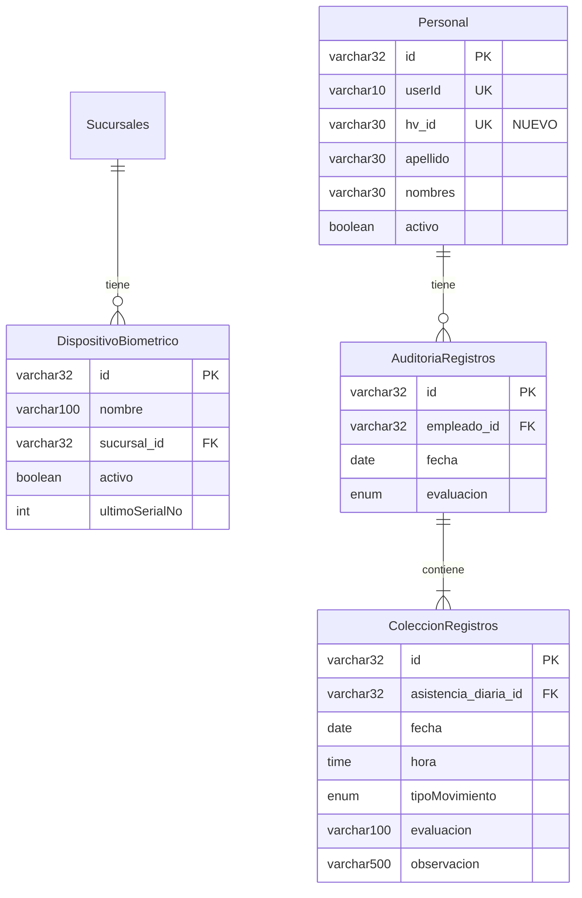
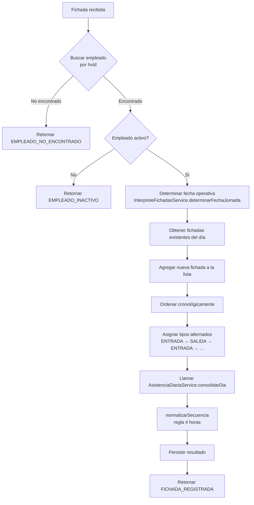

# Integración Hikvision DS-K1A8503MF ↔ STARH — Software Design Document

> **Versión:** 1.0  
> **Fecha de creación:** 2026-06-23  
> **Autor:** Sistema STARH — Arquitectura  
> **Estado:** En desarrollo — Etapa 1  

---

## Tabla de Contenidos

1. [Resumen Ejecutivo](#1-resumen-ejecutivo)
2. [Arquitectura General](#2-arquitectura-general)
3. [Decisiones de Arquitectura](#3-decisiones-de-arquitectura)
4. [Modelo de Datos](#4-modelo-de-datos)

## Resumen de Etapas

| Etapa | Descripción | Estado | Archivos Impactados |
|---|---|---|---|
| **1** | Configuración del Dispositivo Biométrico | ☑ Completada | Ninguno (configuración ISAPI) |
| **2** | Sincronización de Usuarios (hvId + DispositivoBiometrico) | ☑ Completada | `Personal.java`, `DispositivoBiometrico.java` (NEW), Scripts SQL |
| **3** | Recepción de Fichadas en Tiempo Real | ☑ Completada | `HikvisionEventEndpoint.java` (NEW) |
| **4** | Procesamiento e Inferencia de Movimientos | ☑ Completada | `HikvisionFichadaService.java` (NEW) |
| **5** | Despliegue Piloto | ☒ En curso | Configuración servidor + dispositivo |
| **6** | Despliegue Productivo General | ☐ Pendiente | Despliegue progresivo por sucursal |

5. [Etapa 1 — Configuración del Dispositivo Biométrico](#5-etapa-1--configuración-del-dispositivo-biométrico)
6. [Etapa 2 — Sincronización de Usuarios STARH → Hikvision](#6-etapa-2--sincronización-de-usuarios-starh--hikvision)
7. [Etapa 3 — Recepción de Fichadas en Tiempo Real](#7-etapa-3--recepción-de-fichadas-en-tiempo-real)
8. [Etapa 4 — Procesamiento e Inferencia de Movimientos](#8-etapa-4--procesamiento-e-inferencia-de-movimientos)
9. [Etapa 5 — Despliegue Piloto](#9-etapa-5--despliegue-piloto)
10. [Etapa 6 — Despliegue Productivo General](#10-etapa-6--despliegue-productivo-general)
11. [Registro de Incidencias](#11-registro-de-incidencias)
12. [Historial de Cambios](#12-historial-de-cambios)

---

## 1. Resumen Ejecutivo

### Objetivo

Integrar el reloj biométrico **Hikvision DS-K1A8503MF** directamente con la aplicación de RRHH **STARH** (OpenXava 7.7.2, Java 17, JPA/Hibernate, PostgreSQL), sin software intermediario (sin HikCentral, iVMS ni BioTime).

### Alcance

El alcance se limita exclusivamente al **flujo de fichadas desde el dispositivo biométrico hacia STARH**:

- Recepción de eventos de fichada en tiempo real (HTTP Host Push).
- Identificación del empleado por su ID de dispositivo (`hvId`).
- Inferencia automática del tipo de movimiento (ENTRADA/SALIDA/PAUSA).
- Consolidación con los servicios existentes de asistencia.
- Sin gestión de huellas dactilares.

### Stack Tecnológico

| Componente | Tecnología | Versión |
|---|---|---|
| Framework UI | OpenXava | 7.7.3 |
| Lenguaje | Java | 17 |
| ORM | JPA / Hibernate | javax.persistence.* |
| Base de Datos | PostgreSQL | 42.7.4 (driver) |
| REST API | Jersey (JAX-RS) | 2.35 |
| Autenticación API | JWT (JJWT) | 0.9.1 |
| Tareas programadas | Quartz | 2.3.2 |
| Build | Maven | WAR packaging |
| Servidor | Apache Tomcat | (local y cloud) |

### Dispositivo Validado

| Propiedad | Valor |
|---|---|
| Modelo | DS-K1A8503MF |
| Firmware | V1.4.0 build 230403 |
| IP de pruebas | 192.168.1.37 |
| Autenticación | HTTP Digest Authentication |
| Usuario | admin |
| Capacidades verificadas | ISAPI, UserInfo, AcsEvent, HTTP Host, JSON |

---

## 2. Arquitectura General

### Diagrama de Flujo Principal



### Diagrama de Secuencia — Fichada en Tiempo Real



### URLs del Sistema

| Entorno | URL Base | Endpoint Hikvision |
|---|---|---|
| Local (desarrollo) | `http://localhost:8080/biometric/api/` | `http://localhost:8080/biometric/api/hikvision/event/{dispositivoId}` |
| Producción (cloud) | `https://sta-gestion.com/biometric/api/` | `https://sta-gestion.com/biometric/api/hikvision/event/{dispositivoId}` *(Requiere Proxy local Nginx)* |

---

## 3. Decisiones de Arquitectura

### DA-001: Comunicación HTTP Host Push con Proxy Intermedio

- **Decisión:** El dispositivo iniciará conexiones HTTP POST salientes hacia un Proxy Local de Relevo (Nginx para Windows) ubicado en la LAN, el cual recibirá las tramas HTTP plano en puerto `8088` y las retransmitirá cifradas vía HTTPS/443 al servidor STARH en la nube.
- **Justificación:** STARH se encuentra en la nube y el dispositivo en red local detrás de NAT. La comunicación directa desde el reloj a la nube es inviable debido a tres limitaciones de firmware insalvables del biométrico DS-K1A8503MF: no soporta cifrado HTTPS, no resuelve nombres de dominio (solo admite IP numérica) y prohíbe puertos menores a 1024 (ej: 80/443). El proxy local traduce el protocolo y puerto para conectar ambos extremos.
- **Alternativas descartadas:** Polling periódico desde la nube (requeriría Port Forwarding o VPN en el router local hacia el biométrico, inviable por seguridad), conexión directa HTTPS desde el reloj (imposible por hardware).
- **Referencia:** `Integración Hikvision DS-K1A8503MF.md` §Integración Push (Tiempo Real); `isapi.md` §15.3.5.

### DA-002: Inferencia de Tipo de Fichada por STARH

- **Decisión:** El tipo de movimiento (ENTRADA/SALIDA/PAUSA) será inferido por STARH, no por el dispositivo.
- **Justificación:** En las pruebas, el campo `attendanceStatus` del dispositivo retorna `"undefined"`. Configurar el attendance mode requeriría obligar a los empleados a pulsar botones F1/F2 para indicar entrada/salida, lo cual es propenso a errores. STARH ya dispone de lógica de inferencia probada en `InterpreteFichadasService.normalizarSecuencia()` con la regla de las 4 horas.
- **Referencia:** `Integración Hikvision DS-K1A8503MF.md` §attendanceStatus.

### DA-003: Campo `hvId` en Personal (No sincronización automática)

- **Decisión:** La unificación entre el empleado en STARH y su registro en el dispositivo se realiza mediante un campo dedicado `hvId` en la entidad `Personal`. La asignación del ID es manual.
- **Justificación:** El operador registra al empleado directamente en el dispositivo (con un `employeeNo`) y luego ingresa ese mismo número en STARH como `hvId`. Esto evita la complejidad de sincronización automática de usuarios desde la nube hacia un dispositivo en red local.

### DA-004: Gestión de Esquema de BD Manual (No hbm2ddl)

- **Decisión:** Todos los cambios de esquema se ejecutan mediante scripts SQL manuales con rollback. La propiedad `javax.persistence.schema-generation.database.action` permanece en `"none"` en producción.
- **Justificación:** La base de datos es compartida entre el entorno local y productivo. La generación automática de esquema por Hibernate es un riesgo inaceptable en producción.
- **Referencia:** `persistence.xml` línea 24: `value="none"`.

### DA-005: Endpoint sin Autenticación JWT

- **Decisión:** El endpoint `/api/hikvision/event/{dispositivoId}` no requerirá autenticación JWT.
- **Justificación:** El dispositivo Hikvision no puede enviar headers `Authorization: Bearer <token>`. La seguridad se basa en: (a) validación del `dispositivoId` contra la tabla `DispositivoBiometrico`, (b) validación del `employeeNoString` contra `Personal.hvId`, (c) HTTPS en producción para cifrar el tráfico. Opcionalmente se puede agregar un token estático como query parameter en futuras iteraciones.

---

## 4. Modelo de Datos

### Diagrama Entidad-Relación



### Entidades Impactadas

| Entidad | Tipo de Cambio | Descripción |
|---|---|---|
| `Personal` | MODIFY | Agregar campo `hvId` (VARCHAR 30, UNIQUE, nullable) |
| `DispositivoBiometrico` | NEW | Nueva tabla para registrar fichadores físicos |
| `AuditoriaRegistros` | SIN CAMBIOS | Se reutiliza tal cual |
| `ColeccionRegistros` | SIN CAMBIOS | Se reutiliza tal cual |
| `Sucursales` | SIN CAMBIOS | Se referencia desde DispositivoBiometrico |

---

## 5. Etapa 1 — Configuración del Dispositivo Biométrico

### 5.1 Análisis Funcional

**Objetivo:** Configurar completamente el dispositivo Hikvision DS-K1A8503MF para operar en modo HTTP Host Push y validar la comunicación bidireccional con STARH.

**Prerequisitos:**

- Dispositivo DS-K1A8503MF encendido y accesible en la red local (IP: 192.168.1.37).
- Navegador web o herramienta de API (Postman/cURL) con acceso a la red local.
- Credenciales del dispositivo: usuario `admin`, contraseña configurada.
- Servidor STARH accesible desde la red local (para pruebas: `localhost:8080`; para producción: `sta-gestion.com`).

### 5.2 Configuración de Red del Dispositivo

El dispositivo debe tener:

- IP estática asignada (192.168.1.37 en pruebas).
- Gateway configurado para acceso a Internet.
- DNS configurado para resolver `sta-gestion.com` (en producción).
- Puerto 443 de salida habilitado en el firewall local.

### 5.3 Configuración de Fecha y Hora

**Crítico:** La hora del dispositivo debe estar sincronizada con el servidor STARH para que las fichadas tengan timestamps correctos.

Verificar mediante:

```
GET /ISAPI/System/time
```

Si la hora es incorrecta, corregir con:

```
PUT /ISAPI/System/time
Content-Type: application/xml

<Time>
  <timeMode>NTP</timeMode>
  <NTPServer>
    <ipAddress>pool.ntp.org</ipAddress>
  </NTPServer>
  <timeZone>CST-3:00:00</timeZone>
</Time>
```

> [!IMPORTANT]
> El timezone del dispositivo debe coincidir con Argentina (UTC-3). El formato de hora devuelto por el dispositivo incluye offset ISO 8601 (ej: `2026-06-19T04:36:29+08:00`). El servicio de STARH debe parsear correctamente este offset.

### 5.4 Configuración de HTTP Host Push (Listening Mode)

#### Paso 1: Consultar capacidades

```
GET /ISAPI/Event/notification/httpHosts/capabilities
Authorization: Digest admin:***
```

**Respuesta esperada** (según pruebas documentadas en `Integración Hikvision DS-K1A8503MF.md`):

- `protocolType`: HTTP, EHome
- `parameterFormatType`: XML, JSON, querystring
- `hostNumber`: 2 (dos slots configurables)

#### Paso 2: Consultar configuración actual

```
GET /ISAPI/Event/notification/httpHosts
Authorization: Digest admin:***
```

**Resultado documentado:** 2 slots configurables, actualmente vacíos.

#### Paso 3: Configurar el servidor de escucha

**Para entorno local (desarrollo):**

```
PUT /ISAPI/Event/notification/httpHosts
Authorization: Digest admin:***
Content-Type: application/xml

<HttpHostNotificationList version="2.0" xmlns="http://www.isapi.org/ver20/XMLSchema">
  <HttpHostNotification>
    <id>1</id>
    <url>/biometric/api/hikvision/event/DEV001</url>
    <protocolType>HTTP</protocolType>
    <parameterFormatType>JSON</parameterFormatType>
    <addressingFormatType>ipaddress</addressingFormatType>
    <ipAddress>192.168.1.XXX</ipAddress>
    <portNo>8080</portNo>
    <httpAuthenticationMethod>none</httpAuthenticationMethod>
  </HttpHostNotification>
</HttpHostNotificationList>
```

> [!NOTE]
> Reemplazar `192.168.1.XXX` con la IP local de la máquina de desarrollo donde corre Tomcat.
> `DEV001` es un identificador provisional del dispositivo que se reemplazará por el UUID de `DispositivoBiometrico` una vez creada la tabla.

**Para entorno productivo (cloud - a través de Proxy Local):**

> [!WARNING]
> **Limitación del Firmware (Incompatibilidad Directa)**: Aunque teóricamente la API ISAPI soporta directivas como `HTTPS` y `hostname`, en el modelo de hardware `DS-K1A8503MF` escribir parámetros HTTPS, dominios o el puerto `443` devuelve un error de validación `Invalid Content`. El reloj exige de forma estricta: protocolo `HTTP`, direccionamiento tipo `ipaddress` y un puerto en el rango `[1024 - 65535]`.
>
> Por ende, la configuración real debe apuntar a la IP local del **Proxy de Relevo (Nginx)** en la sucursal (ej: `192.168.1.36` en puerto `8088`). El payload XML a enviar a la terminal es el siguiente:

```xml
<HttpHostNotificationList version="2.0" xmlns="http://www.isapi.org/ver20/XMLSchema">
  <HttpHostNotification version="2.0" xmlns="http://www.isapi.org/ver20/XMLSchema">
    <id>1</id>
    <url></url>
    <protocolType>EHome</protocolType>
    <parameterFormatType>XML</parameterFormatType>
    <addressingFormatType>ipaddress</addressingFormatType>
    <ipAddress>0.0.0.0</ipAddress>
    <portNo>15300</portNo>
    <httpAuthenticationMethod>none</httpAuthenticationMethod>
  </HttpHostNotification>
  <HttpHostNotification version="2.0" xmlns="http://www.isapi.org/ver20/XMLSchema">
    <id>2</id>
    <url>/biometric/api/hikvision/event/{dispositivoId}</url>
    <protocolType>HTTP</protocolType>
    <parameterFormatType>XML</parameterFormatType>
    <addressingFormatType>ipaddress</addressingFormatType>
    <ipAddress>192.168.1.36</ipAddress> <!-- IP local de la PC con Nginx Proxy -->
    <portNo>8088</portNo> <!-- Puerto del Proxy local -->
    <userName></userName>
    <httpAuthenticationMethod>none</httpAuthenticationMethod>
    <SubscribeEvent>
      <eventMode>all</eventMode>
    </SubscribeEvent>
  </HttpHostNotification>
</HttpHostNotificationList>
```

> [!IMPORTANT]
> * **Sanitización Obligatoria**: El Slot 1 (EHome) no debe dejarse con campos vacíos al reescribir el XML completo, ya que el validador del firmware rechazará la petición completa con error `Invalid Content` si detecta campos vacíos. Debe configurarse con valores por defecto válidos (ej. Puerto `15300` y protocolo `EHome`).
> * **Limitación del campo `url`:** Según `XML_HttpHostNotificationCap`, el campo `urlLen` tiene un máximo de 128 caracteres en Slot 2. La ruta relativa (ej. `/biometric/api/hikvision/event/TMT01`) cumple perfectamente este límite.

#### Paso 4: Probar la conexión

```
POST /ISAPI/Event/notification/httpHosts/1/test
Authorization: Digest admin:***
```

**Resultado esperado:** El dispositivo intentará un HTTP POST a la URL configurada. Si STARH responde `200 OK`, la prueba es exitosa.

**Respuesta si falla:**

```xml
<HttpHostTestResult version="2.0" xmlns="http://www.isapi.org/ver20/XMLSchema">
  <errorDescription>Connection refused</errorDescription>
</HttpHostTestResult>
```

### 5.5 Estructura del Evento Recibido

Cuando el dispositivo envía una fichada a la URL configurada, el cuerpo del POST contiene un JSON con la siguiente estructura (verificada en pruebas reales):

```json
{
  "ipAddress": "192.168.1.37",
  "portNo": 80,
  "protocol": "HTTP",
  "macAddress": "aa:bb:cc:dd:ee:ff",
  "channelID": 1,
  "dateTime": "2026-06-19T08:00:00-03:00",
  "activePostCount": 1,
  "eventType": "AccessControllerEvent",
  "eventState": "active",
  "eventDescription": "Access Controller Event",
  "AccessControllerEvent": {
    "deviceName": "DS-K1A8503MF",
    "majorEventType": 5,
    "subEventType": 75,
    "serialNo": 101,
    "employeeNoString": "100",
    "name": "Marcelo",
    "cardReaderNo": 0,
    "doorNo": 1,
    "currentVerifyMode": "faceOrFp",
    "attendanceStatus": "undefined",
    "label": "",
    "statusValue": 0,
    "mask": "unknown",
    "purePwdVerifyEnable": false,
    "time": "2026-06-19T08:00:00-03:00"
  }
}
```

#### Códigos de Evento Relevantes

| `majorEventType` | Significado | Acción STARH |
|---|---|---|
| 5 | Evento de acceso (fichada válida) | **Procesar** |
| 1 | Alarma de dispositivo | Ignorar |
| 2 | Excepción | Ignorar |
| 3 | Operación | Ignorar |

| `subEventType` (cuando major=5) | Significado |
|---|---|
| 1 | Acceso por tarjeta |
| 38 (0x26) | Acceso por huella dactilar |
| 75 (0x4B) | Acceso por reconocimiento facial |

> [!NOTE]
> STARH procesará cualquier evento con `majorEventType == 5` independientemente del `subEventType`, ya que cualquier método de verificación válido representa una fichada legítima.

### 5.6 Checklist de Validación — Etapa 1

| # | Verificación | Estado | Observaciones |
|---|---|---|---|
| 1 | Dispositivo accesible en red local | ☐ | `ping 192.168.1.37` |
| 2 | Credenciales admin válidas | ☐ | `GET /ISAPI/System/deviceInfo` responde |
| 3 | Hora sincronizada (±1 minuto vs servidor) | ☐ | `GET /ISAPI/System/time` |
| 4 | Capacidades HTTP Host verificadas | ☐ | 2 slots, JSON soportado |
| 5 | HTTP Host configurado (slot 1) | ☐ | URL apuntando a servidor |
| 6 | Test de conexión exitoso | ☐ | `POST .../httpHosts/1/test` |
| 7 | Evento recibido en servidor (log) | ☐ | Fichada de prueba visible |
| 8 | JSON del evento parseado correctamente | ☐ | `employeeNoString`, `serialNo`, `time` |

### 5.7 Procedimiento de Restauración — Etapa 1

Para revertir la configuración del dispositivo al estado anterior:

```
DELETE /ISAPI/Event/notification/httpHosts
Authorization: Digest admin:***
```

Esto eliminará todos los servidores de escucha configurados, dejando los 2 slots vacíos (estado original documentado).

---

## 6. Etapa 2 — Sincronización de Usuarios STARH → Hikvision

### 6.1 Análisis Funcional

**Objetivo:** Agregar el campo `hvId` a la entidad `Personal` y crear la entidad `DispositivoBiometrico` para permitir la asociación entre empleados de STARH y los usuarios registrados en el dispositivo biométrico.

**Flujo de sincronización:** Manual. El operador:
1. Registra al empleado en el dispositivo físico asignándole un `employeeNo` (ej: `100`).
2. En STARH, abre la ficha del empleado y carga el mismo número en el campo `hvId`.

No se implementa sincronización automática por API porque el dispositivo está en red local inaccesible desde la nube.

### 6.2 Cambios en Base de Datos

#### 6.2.1 Modificación: Tabla `Personal` — Agregar columna `hv_id`

**Descripción funcional:** Agregar un campo que almacena el identificador del empleado en el dispositivo Hikvision. Permite buscar al empleado cuando llega una fichada con `employeeNoString`.

**Justificación técnica:** El campo debe ser `VARCHAR(30)` para acomodar los formatos de `employeeNo` que maneja Hikvision (numérico hasta 30 caracteres). Debe ser `UNIQUE` para garantizar unicidad en la búsqueda. Debe ser `NULLABLE` porque los empleados existentes no tienen este dato.

**Tablas afectadas:** `Personal`

**Columnas agregadas:** `hv_id VARCHAR(30) NULLABLE UNIQUE`

**Índices creados:** `idx_personal_hvid` sobre columna `hv_id`

**Constraints agregados:** `uq_personal_hvid` (UNIQUE constraint)

**Impacto esperado:** Ninguno sobre datos existentes. Todos los registros actuales tendrán `hv_id = NULL`. PostgreSQL permite múltiples valores `NULL` en columnas `UNIQUE`.

**Riesgos identificados:**
- Riesgo bajo: Si existe algún trigger o restricción custom sobre la tabla `Personal`, el ALTER podría fallar. Mitigación: verificar con `\d Personal` en DBeaver antes de ejecutar.

**Script UP (creación):**

```sql
-- ================================================================
-- ETAPA 2 — UP: Agregar campo hv_id a tabla Personal
-- Fecha: 2026-06-23
-- Autor: Arquitectura STARH
-- ================================================================

-- 1. Agregar columna hv_id (nullable para no afectar registros existentes)
ALTER TABLE "Personal" ADD COLUMN hv_id VARCHAR(30);

-- 2. Crear restricción de unicidad
--    PostgreSQL permite múltiples NULL en columnas UNIQUE
ALTER TABLE "Personal" ADD CONSTRAINT uq_personal_hvid UNIQUE (hv_id);

-- 3. Crear índice para optimizar búsquedas por hv_id
--    Crítico para el rendimiento de la recepción en tiempo real
CREATE INDEX idx_personal_hvid ON "Personal" (hv_id);
```

**Script DOWN (reversión):**

```sql
-- ================================================================
-- ETAPA 2 — DOWN: Revertir campo hv_id de tabla Personal
-- Fecha: 2026-06-23
-- Autor: Arquitectura STARH
-- ================================================================

-- 1. Eliminar índice
DROP INDEX IF EXISTS idx_personal_hvid;

-- 2. Eliminar restricción de unicidad
ALTER TABLE "Personal" DROP CONSTRAINT IF EXISTS uq_personal_hvid;

-- 3. Eliminar columna
ALTER TABLE "Personal" DROP COLUMN IF EXISTS hv_id;
```

**Procedimiento de validación posterior:**

```sql
-- Verificar que la columna existe y es nullable
SELECT column_name, data_type, character_maximum_length, is_nullable
FROM information_schema.columns
WHERE table_name = 'Personal' AND column_name = 'hv_id';
-- Esperado: hv_id | character varying | 30 | YES

-- Verificar que el índice existe
SELECT indexname FROM pg_indexes WHERE tablename = 'Personal' AND indexname = 'idx_personal_hvid';
-- Esperado: idx_personal_hvid

-- Verificar que la constraint existe
SELECT conname FROM pg_constraint WHERE conname = 'uq_personal_hvid';
-- Esperado: uq_personal_hvid

-- Verificar que no se afectaron registros existentes
SELECT COUNT(*) FROM "Personal" WHERE hv_id IS NOT NULL;
-- Esperado: 0
```

---

#### 6.2.2 Creación: Tabla `DispositivoBiometrico`

**Descripción funcional:** Registrar los dispositivos biométricos físicos instalados en cada sucursal/sector. Permite identificar qué dispositivo envió cada fichada y controlar la deduplicación de eventos.

**Justificación técnica:** Un dispositivo por sucursal/sector. El campo `ultimoSerialNo` permite detectar eventos duplicados (cada evento del DS-K1A8503MF tiene un `serialNo` secuencial único). Se usa `VARCHAR(32)` para la clave primaria para ser compatible con la clase `Identifiable` de OpenXava (genera UUIDs de 32 caracteres sin guiones).

**Tablas afectadas:** Nueva tabla `DispositivoBiometrico`

**Columnas creadas:**

| Columna | Tipo | Nullable | Default | Descripción |
|---|---|---|---|---|
| `id` | VARCHAR(32) | NOT NULL | — | PK (UUID OpenXava) |
| `nombre` | VARCHAR(100) | NOT NULL | — | Nombre descriptivo |
| `sucursal_id` | VARCHAR(32) | YES | NULL | FK a Sucursales |
| `activo` | BOOLEAN | YES | TRUE | Dispositivo habilitado |
| `ultimo_serial_no` | INTEGER | YES | 0 | Último serialNo procesado |

**Índices creados:** `idx_dispositivo_sucursal` sobre columna `sucursal_id`

**Constraints agregados:**
- `pk_dispositivobiometrico` (PRIMARY KEY)
- `fk_dispositivo_sucursal` (FOREIGN KEY → Sucursales)

**Datos iniciales requeridos:** Ninguno. El primer dispositivo se registrará manualmente desde la UI de OpenXava o directamente en la BD.

**Impacto esperado:** Ninguno sobre tablas existentes. Es una tabla completamente nueva e independiente.

**Riesgos identificados:**
- Riesgo bajo: La tabla `Sucursales` debe existir previamente. Verificado: la entidad `Sucursales` ya existe en el proyecto.

**Script UP (creación):**

```sql
-- ================================================================
-- ETAPA 2 — UP: Crear tabla DispositivoBiometrico
-- Fecha: 2026-06-23
-- Autor: Arquitectura STARH
-- ================================================================

CREATE TABLE "DispositivoBiometrico" (
    id VARCHAR(32) NOT NULL,
    nombre VARCHAR(100) NOT NULL,
    sucursal_id VARCHAR(32),
    activo BOOLEAN DEFAULT TRUE,
    ultimo_serial_no INTEGER DEFAULT 0,
    CONSTRAINT pk_dispositivobiometrico PRIMARY KEY (id),
    CONSTRAINT fk_dispositivo_sucursal FOREIGN KEY (sucursal_id)
        REFERENCES "Sucursales"(id) ON DELETE SET NULL
);

-- Índice para optimizar consultas por sucursal
CREATE INDEX idx_dispositivo_sucursal ON "DispositivoBiometrico" (sucursal_id);
```

**Script DOWN (reversión):**

```sql
-- ================================================================
-- ETAPA 2 — DOWN: Eliminar tabla DispositivoBiometrico
-- Fecha: 2026-06-23
-- Autor: Arquitectura STARH
-- ================================================================

DROP TABLE IF EXISTS "DispositivoBiometrico";
```

**Procedimiento de validación posterior:**

```sql
-- Verificar que la tabla existe
SELECT table_name FROM information_schema.tables
WHERE table_name = 'DispositivoBiometrico';
-- Esperado: DispositivoBiometrico

-- Verificar columnas
SELECT column_name, data_type, character_maximum_length, is_nullable
FROM information_schema.columns
WHERE table_name = 'DispositivoBiometrico'
ORDER BY ordinal_position;

-- Verificar FK
SELECT conname, confrelid::regclass
FROM pg_constraint
WHERE conname = 'fk_dispositivo_sucursal';
-- Esperado: fk_dispositivo_sucursal | Sucursales
```

---

### 6.3 Cambios en Código Java

#### 6.3.1 Modificación: `Personal.java`

**Archivo:** `src/main/java/com/sta/biometric/modelo/Personal.java`

**Cambios requeridos:**

1. **Nuevo campo `hvId`** (después de `deviceId`, línea ~312):

```java
/**
 * Identificador del empleado en el fichador biométrico Hikvision.
 *
 * <p>
 * Corresponde al campo {@code employeeNo} del dispositivo.
 * Se utiliza para identificar al empleado cuando llega una
 * fichada en tiempo real vía HTTP Host Push.
 * </p>
 *
 * @see DispositivoBiometrico
 */
@Column(length = 30, name = "hv_id", unique = true)
@DisplaySize(15)
private String hvId;
```

2. **Actualizar la vista principal** — Agregar `hvId` al grupo `credenciales`:

Línea 124 actual:
```java
"contrasena; deviceId;" +
```

Cambiar a:
```java
"contrasena; deviceId;" +
"hvId;" +
```

3. **Actualizar la vista `Crear`** — Agregar `hvId` al grupo `credenciales`:

Línea 182 actual:
```java
"contrasena; deviceId;" +
```

Cambiar a:
```java
"contrasena; deviceId;" +
"hvId;" +
```

4. **Actualizar la anotación `@Table`** — Agregar el índice `idx_personal_hvid`:

Líneas 207-211 actuales:
```java
@Table(name = "Personal", indexes = {
        @Index(name = "idx_personal_dni", columnList = "dni_id"),
        @Index(name = "idx_personal_usuario", columnList = "usuario"),
        @Index(name = "idx_personal_apellido", columnList = "apellido")
})
```

Cambiar a:
```java
@Table(name = "Personal", indexes = {
        @Index(name = "idx_personal_dni", columnList = "dni_id"),
        @Index(name = "idx_personal_usuario", columnList = "usuario"),
        @Index(name = "idx_personal_apellido", columnList = "apellido"),
        @Index(name = "idx_personal_hvid", columnList = "hv_id")
})
```

#### 6.3.2 Creación: `DispositivoBiometrico.java`

**Archivo:** `src/main/java/com/sta/biometric/modelo/DispositivoBiometrico.java`

```java
package com.sta.biometric.modelo;

import javax.persistence.*;

import org.openxava.annotations.*;
import org.openxava.model.*;

import com.sta.biometric.auxiliares.*;

import lombok.*;

/**
 * Entidad que representa un dispositivo biométrico Hikvision
 * instalado en una sucursal o sector.
 *
 * <p>
 * Cada dispositivo tiene un {@code ultimoSerialNo} que se utiliza
 * para deduplicación de eventos recibidos vía HTTP Host Push.
 * </p>
 *
 * @author Sistema STARH
 * @version 1.0
 * @see Personal
 * @see Sucursales
 */
@Entity
@Table(name = "DispositivoBiometrico", indexes = {
    @Index(name = "idx_dispositivo_sucursal", columnList = "sucursal_id")
})
@Getter
@Setter
@View(members = "nombre; sucursal; activo; ultimoSerialNo")
@Tab(properties = "nombre, sucursal.nombre, activo, ultimoSerialNo",
     defaultOrder = "${nombre} asc")
public class DispositivoBiometrico extends Identifiable {

    /**
     * Nombre descriptivo del dispositivo.
     * Ejemplo: "Fichador Entrada Principal", "Fichador Planta Baja"
     */
    @Required
    @Column(length = 100)
    @DisplaySize(40)
    private String nombre;

    /**
     * Sucursal o sector donde está instalado el dispositivo.
     */
    @ManyToOne(fetch = FetchType.LAZY)
    @DescriptionsList
    private Sucursales sucursal;

    /**
     * Indica si el dispositivo está activo y puede recibir fichadas.
     */
    @Column(columnDefinition = "BOOLEAN DEFAULT TRUE")
    private boolean activo = true;

    /**
     * Último número de serie (serialNo) procesado desde este dispositivo.
     * Se utiliza para deduplicación de eventos.
     */
    @ReadOnly
    @Column(name = "ultimo_serial_no")
    private int ultimoSerialNo = 0;
}
```

### 6.4 Checklist de Validación — Etapa 2

| # | Verificación | Estado | Observaciones |
|---|---|---|---|
| 1 | Script UP de `Personal` ejecutado sin errores | ☐ | |
| 2 | Script UP de `DispositivoBiometrico` ejecutado sin errores | ☐ | |
| 3 | Validación SQL de columnas y constraints OK | ☐ | |
| 4 | `mvn clean compile` exitoso | ☐ | |
| 5 | Campo `hvId` visible en UI Personal (pestaña Información Laboral) | ☐ | |
| 6 | Módulo `DispositivoBiometrico` visible en menú OpenXava | ☐ | |
| 7 | Crear dispositivo de prueba asociado a sucursal existente | ☐ | |
| 8 | Asignar `hvId = "100"` a empleado de prueba | ☐ | |
| 9 | Verificar unicidad: intentar asignar `hvId = "100"` a otro empleado (debe fallar) | ☐ | |
| 10 | Script DOWN probado y ejecutado correctamente | ☐ | |

---

## 7. Etapa 3 — Recepción de Fichadas en Tiempo Real

### 7.1 Análisis Funcional

**Objetivo:** Crear el endpoint REST JAX-RS que recibe las fichadas enviadas por el dispositivo vía HTTP Host Push y las persiste como registros crudos para procesamiento posterior.

### 7.2 Diseño Técnico

#### Endpoint

| Propiedad | Valor |
|---|---|
| Método HTTP | POST |
| Ruta | `/api/hikvision/event/{dispositivoId}` |
| Content-Type | `application/json` |
| Autenticación | Ninguna (ver DA-005) |
| Respuesta exitosa | `200 OK` con body `{"status": "ok"}` |

#### Ruta completa en los entornos

- **Local:** `http://localhost:8080/biometric/api/hikvision/event/{dispositivoId}`
- **Producción:** `https://sta-gestion.com/biometric/api/hikvision/event/{dispositivoId}`

> [!NOTE]
> El `url-pattern` de Jersey en `web.xml` ya está configurado como `/api/*` (línea 21), por lo que un endpoint con `@Path("/hikvision")` será accesible automáticamente bajo `/api/hikvision/...`. No se requieren cambios en `web.xml`.

### 7.3 Código: `HikvisionEventEndpoint.java`

**Archivo:** `src/main/java/com/sta/biometric/rest/HikvisionEventEndpoint.java`

```java
package com.sta.biometric.rest;

import java.util.logging.*;

import javax.ws.rs.*;
import javax.ws.rs.core.*;

import org.openxava.jpa.*;

import com.sta.biometric.modelo.*;
import com.sta.biometric.servicios.*;

/**
 * Endpoint REST JAX-RS para recibir eventos de fichada enviados
 * por dispositivos Hikvision DS-K1A8503MF en modo HTTP Host Push.
 *
 * <p>
 * El dispositivo envía un HTTP POST con el evento en formato JSON
 * cada vez que un empleado se identifica (huella, rostro o tarjeta).
 * </p>
 *
 * <p>
 * Ruta: POST /api/hikvision/event/{dispositivoId}
 * </p>
 *
 * @author Sistema STARH
 * @version 1.0
 * @see HikvisionFichadaService
 */
@Path("/hikvision")
public class HikvisionEventEndpoint {

    private static final Logger LOG = Logger.getLogger(
            HikvisionEventEndpoint.class.getName());

    /**
     * Recibe un evento de fichada desde el dispositivo Hikvision.
     *
     * @param dispositivoId ID del dispositivo (UUID de DispositivoBiometrico)
     * @param body          JSON crudo del evento enviado por el dispositivo
     * @return 200 OK si fue procesado, 400/500 si hubo error
     */
    @POST
    @Path("/event/{dispositivoId}")
    @Consumes(MediaType.APPLICATION_JSON)
    @Produces(MediaType.APPLICATION_JSON)
    public Response recibirEvento(
            @PathParam("dispositivoId") String dispositivoId,
            String body) {

        try {
            XPersistence.getManager(); // Inicializar contexto JPA

            LOG.info("[Hikvision] Evento recibido de dispositivo: "
                    + dispositivoId);

            // Parsear el JSON manualmente para tolerar variantes
            // de estructura que envía Hikvision
            String employeeNo = extraerCampoJson(body,
                    "employeeNoString");
            String serialNoStr = extraerCampoJson(body, "serialNo");
            String majorStr = extraerCampoJson(body,
                    "majorEventType");
            String timeStr = extraerCampoJson(body, "time");

            // Fallback: buscar en nivel raíz si no está dentro
            // de AccessControllerEvent
            if (employeeNo == null) {
                employeeNo = extraerCampoJson(body, "employeeNo");
            }
            if (majorStr == null) {
                majorStr = extraerCampoJson(body, "major");
            }

            // Validaciones básicas
            if (employeeNo == null || employeeNo.isEmpty()) {
                LOG.warning("[Hikvision] Evento sin employeeNo. "
                        + "Ignorado.");
                return Response.ok("{\"status\":\"ignored\","
                        + "\"reason\":\"no employeeNo\"}")
                        .build();
            }

            int major = majorStr != null
                    ? Integer.parseInt(majorStr.trim()) : -1;

            // Solo procesar eventos de acceso válido (major == 5)
            if (major != 5) {
                LOG.info("[Hikvision] Evento con major=" + major
                        + " ignorado (no es fichada).");
                return Response.ok("{\"status\":\"ignored\","
                        + "\"reason\":\"major != 5\"}")
                        .build();
            }

            int serialNo = serialNoStr != null
                    ? Integer.parseInt(serialNoStr.trim()) : 0;

            // Delegar al servicio de procesamiento
            String resultado = HikvisionFichadaService
                    .registrarFichada(
                            employeeNo.trim(),
                            timeStr != null ? timeStr.trim() : null,
                            serialNo,
                            dispositivoId);

            XPersistence.commit();

            LOG.info("[Hikvision] Fichada procesada: empleado="
                    + employeeNo + " serial=" + serialNo
                    + " resultado=" + resultado);

            return Response.ok("{\"status\":\"ok\","
                    + "\"resultado\":\"" + resultado + "\"}")
                    .build();

        } catch (Exception e) {
            LOG.log(Level.SEVERE,
                    "[Hikvision] Error procesando evento", e);
            try {
                XPersistence.rollback();
            } catch (Exception rx) {
                LOG.log(Level.WARNING,
                        "[Hikvision] Error en rollback", rx);
            }
            return Response.ok("{\"status\":\"error\","
                    + "\"message\":\"" + e.getMessage() + "\"}")
                    .build();
            // Retornamos 200 incluso en error para que el
            // dispositivo no reintente indefinidamente
        } finally {
            XPersistence.reset();
        }
    }

    /**
     * Extrae un valor de un campo JSON de forma simple
     * sin dependencias externas de parseo (Jackson no está
     * disponible en este proyecto por restricciones de heap).
     *
     * Busca el patrón "campo": valor o "campo":"valor"
     */
    private String extraerCampoJson(String json, String campo) {
        if (json == null || campo == null) return null;

        String patron = "\"" + campo + "\"";
        int idx = json.indexOf(patron);
        if (idx < 0) return null;

        // Avanzar hasta después de los dos puntos
        int colonIdx = json.indexOf(':', idx + patron.length());
        if (colonIdx < 0) return null;

        // Saltar espacios en blanco
        int start = colonIdx + 1;
        while (start < json.length()
                && Character.isWhitespace(json.charAt(start))) {
            start++;
        }

        if (start >= json.length()) return null;

        char first = json.charAt(start);

        if (first == '"') {
            // Valor string: buscar cierre de comillas
            int end = json.indexOf('"', start + 1);
            if (end < 0) return null;
            return json.substring(start + 1, end);
        } else {
            // Valor numérico o booleano: leer hasta separador
            int end = start;
            while (end < json.length()
                    && json.charAt(end) != ','
                    && json.charAt(end) != '}'
                    && json.charAt(end) != ']'
                    && !Character.isWhitespace(json.charAt(end))) {
                end++;
            }
            return json.substring(start, end);
        }
    }
}
```

> [!IMPORTANT]
> **Parseo manual de JSON:** El proyecto no incluye Jackson Databind (fue removido por restricciones de heap de 128MB — ver `pom.xml` línea 163-167). Se implementa un parser ligero para extraer los campos necesarios sin agregar dependencias.

### 7.4 Checklist de Validación — Etapa 3

| # | Verificación | Estado | Observaciones |
|---|---|---|---|
| 1 | `mvn clean compile` exitoso con nuevo endpoint | ☐ | |
| 2 | Endpoint accesible: `POST /api/hikvision/event/TEST` | ☐ | |
| 3 | Evento con `major != 5` retorna `{"status":"ignored"}` | ☐ | |
| 4 | Evento sin `employeeNoString` retorna `{"status":"ignored"}` | ☐ | |
| 5 | Evento válido delega a `HikvisionFichadaService` | ☐ | |
| 6 | Respuesta siempre es HTTP 200 (incluso en errores) | ☐ | |

### 7.5 Prueba con cURL (Entorno Local)

```bash
curl -X POST http://localhost:8080/biometric/api/hikvision/event/DEV001 \
     -H "Content-Type: application/json" \
     -d '{
       "eventType": "AccessControllerEvent",
       "AccessControllerEvent": {
         "majorEventType": 5,
         "subEventType": 75,
         "serialNo": 101,
         "employeeNoString": "100",
         "time": "2026-06-23T08:00:00-03:00",
         "attendanceStatus": "undefined"
       }
     }'
```

**Respuesta esperada:**

```json
{"status":"ok","resultado":"FICHADA_REGISTRADA"}
```

---

## 8. Etapa 4 — Procesamiento e Inferencia de Movimientos

### 8.1 Análisis Funcional

**Objetivo:** Implementar `HikvisionFichadaService` que procesa cada fichada recibida, infiere el tipo de movimiento y consolida la jornada del empleado reutilizando los servicios existentes.

### 8.2 Flujo de Procesamiento



### 8.3 Código: `HikvisionFichadaService.java`

**Archivo:** `src/main/java/com/sta/biometric/servicios/HikvisionFichadaService.java`

```java
package com.sta.biometric.servicios;

import java.time.*;
import java.time.format.*;
import java.util.*;
import java.util.logging.*;
import java.util.stream.*;

import javax.persistence.*;

import org.openxava.jpa.*;

import com.sta.biometric.enums.*;
import com.sta.biometric.modelo.*;

/**
 * Servicio para procesar fichadas recibidas en tiempo real
 * desde dispositivos Hikvision DS-K1A8503MF vía HTTP Host Push.
 *
 * <p>
 * Reutiliza los servicios existentes:
 * <ul>
 *   <li>{@link InterpreteFichadasService#determinarFechaJornada}
 *       — resolución de turnos nocturnos</li>
 *   <li>{@link InterpreteFichadasService#normalizarSecuencia}
 *       — regla de 4 horas para pausas</li>
 *   <li>{@link AsistenciaDiariaService#consolidarDia}
 *       — persistencia y consolidación</li>
 * </ul>
 *
 * @author Sistema STARH
 * @version 1.0
 */
public class HikvisionFichadaService {

    private static final Logger LOG = Logger.getLogger(
            HikvisionFichadaService.class.getName());

    /**
     * Registra una fichada recibida desde un dispositivo Hikvision.
     *
     * @param employeeNo    ID del empleado en el dispositivo (hvId)
     * @param timeStr       Timestamp ISO 8601 del evento
     * @param serialNo      Número de serie del evento (para deduplicación)
     * @param dispositivoId ID del dispositivo en STARH
     * @return Resultado del procesamiento
     */
    public static String registrarFichada(
            String employeeNo,
            String timeStr,
            int serialNo,
            String dispositivoId) {

        EntityManager em = XPersistence.getManager();

        // 1. Buscar empleado por hvId
        Personal empleado = buscarPorHvId(em, employeeNo);
        if (empleado == null) {
            LOG.warning("[HV] Empleado no encontrado: hvId="
                    + employeeNo);
            return "EMPLEADO_NO_ENCONTRADO";
        }

        if (!empleado.isActivo()) {
            LOG.warning("[HV] Empleado inactivo: "
                    + empleado.getNombreCompleto());
            return "EMPLEADO_INACTIVO";
        }

        // 2. Parsear timestamp
        LocalDateTime fechaHora = parsearTimestamp(timeStr);
        if (fechaHora == null) {
            LOG.warning("[HV] Timestamp inválido: " + timeStr);
            return "TIMESTAMP_INVALIDO";
        }

        LocalDate fechaCalendario = fechaHora.toLocalDate();
        LocalTime horaFichada = fechaHora.toLocalTime();

        // 3. Determinar fecha operativa de la jornada
        //    (resuelve turnos nocturnos)
        LocalDate fechaOperativa =
                InterpreteFichadasService.determinarFechaJornada(
                        empleado, fechaCalendario, horaFichada);

        // 4. Obtener fichadas existentes del día
        AuditoriaRegistros auditoriaExistente =
                buscarAuditoriaDiaria(em, empleado, fechaOperativa);

        List<ColeccionRegistros> registrosDelDia =
                new ArrayList<>();
        if (auditoriaExistente != null
                && auditoriaExistente.getRegistros() != null) {
            registrosDelDia.addAll(
                    auditoriaExistente.getRegistros());
        }

        // 5. Verificar duplicado por hora (tolerancia 50 min)
        for (ColeccionRegistros existente : registrosDelDia) {
            if (existente.getHora() != null
                    && Math.abs(existente.getHora().toSecondOfDay()
                    - horaFichada.toSecondOfDay()) <= 3000) {
                LOG.info("[HV] Fichada duplicada ignorada: "
                        + empleado.getNombreCompleto()
                        + " hora=" + horaFichada);
                return "DUPLICADO_IGNORADO";
            }
        }

        // 6. Crear nuevo registro
        ColeccionRegistros nuevoRegistro =
                new ColeccionRegistros();
        nuevoRegistro.setFecha(fechaOperativa);
        nuevoRegistro.setHora(horaFichada);
        nuevoRegistro.setObservacion(
                "Fichada Hikvision (serial: " + serialNo + ")");

        registrosDelDia.add(nuevoRegistro);

        // 7. Ordenar cronológicamente
        registrosDelDia.sort(Comparator
                .comparing(ColeccionRegistros::getHora,
                        Comparator.nullsLast(
                                Comparator.naturalOrder())));

        // 8. Asignar tipos alternados (ENTRADA/SALIDA)
        boolean esEntrada = true;
        for (ColeccionRegistros reg : registrosDelDia) {
            if (reg.getTipoMovimiento() == null
                    || reg.getTipoMovimiento()
                    == TipoMovimiento.ENTRADA
                    || reg.getTipoMovimiento()
                    == TipoMovimiento.SALIDA) {
                reg.setTipoMovimiento(esEntrada
                        ? TipoMovimiento.ENTRADA
                        : TipoMovimiento.SALIDA);
                esEntrada = !esEntrada;
            }
            // Preservar PAUSA_INICIO, PAUSA_FIN, MANUAL, etc.
        }

        // 9. Consolidar la jornada (incluye normalizarSecuencia)
        //    Solo enviamos los registros nuevos que no están
        //    ya en la auditoría
        List<ColeccionRegistros> soloNuevos = new ArrayList<>();
        soloNuevos.add(nuevoRegistro);

        AsistenciaDiariaService.consolidarDia(
                empleado, fechaOperativa, registrosDelDia);

        LOG.info("[HV] Fichada registrada: "
                + empleado.getNombreCompleto()
                + " fecha=" + fechaOperativa
                + " hora=" + horaFichada
                + " tipo=" + nuevoRegistro.getTipoMovimiento());

        return "FICHADA_REGISTRADA";
    }

    /**
     * Busca un empleado por su hvId (ID del fichador Hikvision).
     */
    private static Personal buscarPorHvId(
            EntityManager em, String hvId) {
        try {
            return em.createQuery(
                    "SELECT p FROM Personal p "
                    + "WHERE p.hvId = :hvId",
                    Personal.class)
                    .setParameter("hvId", hvId)
                    .getSingleResult();
        } catch (NoResultException e) {
            return null;
        }
    }

    /**
     * Busca la auditoría de un día para un empleado.
     */
    private static AuditoriaRegistros buscarAuditoriaDiaria(
            EntityManager em, Personal empleado,
            LocalDate fecha) {
        try {
            return em.createQuery(
                    "SELECT a FROM AuditoriaRegistros a "
                    + "WHERE a.empleado = :emp "
                    + "AND a.fecha = :fecha",
                    AuditoriaRegistros.class)
                    .setParameter("emp", empleado)
                    .setParameter("fecha", fecha)
                    .getSingleResult();
        } catch (NoResultException e) {
            return null;
        }
    }

    /**
     * Parsea un timestamp ISO 8601 con offset de zona horaria.
     * Ejemplo: "2026-06-19T08:00:00-03:00"
     * o: "2026-06-19T04:36:29+08:00"
     */
    private static LocalDateTime parsearTimestamp(String timeStr) {
        if (timeStr == null || timeStr.isEmpty()) return null;
        try {
            // Obtenemos la fecha y hora tal como la registró el reloj del dispositivo,
            // ignorando desplazamientos por zona horaria mal configurada en el aparato.
            // La hora que muestra la pantalla del dispositivo es la que el empleado experimenta al fichar.
            return OffsetDateTime.parse(timeStr, DateTimeFormatter.ISO_OFFSET_DATE_TIME).toLocalDateTime();
        } catch (DateTimeParseException e) {
            // Fallback: intentar como LocalDateTime
            try {
                return LocalDateTime.parse(timeStr,
                        DateTimeFormatter.ISO_LOCAL_DATE_TIME);
            } catch (DateTimeParseException e2) {
                return null;
            }
        }
    }
}
```

### 8.4 Checklist de Validación — Etapa 4

| # | Verificación | Estado | Observaciones |
|---|---|---|---|
| 1 | `mvn clean compile` exitoso | ☐ | |
| 2 | Fichada de prueba: empleado con hvId="100" registra ENTRADA a las 08:00 | ☐ | |
| 3 | Segunda fichada del mismo empleado a las 17:00 registra SALIDA | ☐ | |
| 4 | Fichada duplicada (misma hora ±50 min) es ignorada | ☐ | |
| 5 | Empleado sin hvId retorna EMPLEADO_NO_ENCONTRADO | ☐ | |
| 6 | Empleado inactivo retorna EMPLEADO_INACTIVO | ☐ | |
| 7 | Turno nocturno: fichada a las 02:00 se asigna al día anterior | ☐ | |
| 8 | Tres fichadas: 08:00=ENTRADA, 12:30=PAUSA_INICIO, 13:30=PAUSA_FIN (regla 4h) | ☐ | |
| 9 | Jornada consolidada visible en UI AuditoriaRegistros | ☐ | |
| 10 | Evaluación de jornada (COMPLETA/INCOMPLETA) calculada correctamente | ☐ | |

---

## 9. Etapa 5 — Despliegue Piloto

### 9.1 Objetivo

Validar la integración completa en una sucursal seleccionada con un grupo controlado de empleados durante un período de 2 semanas.

### 9.2 Prerequisitos

- Etapas 1-4 completadas y validadas.
- Dispositivo Hikvision configurado y apuntando a `https://sta-gestion.com/biometric/api/hikvision/event/{dispositivoId}`.
- Empleados piloto con `hvId` asignado en STARH y registrados en el dispositivo.
- Certificado SSL válido en `sta-gestion.com`.

### 9.3 Procedimiento de Despliegue

1. **Backup completo de BD:**

```bash
pg_dump -h <host> -U <user> -d biometric -F c -f backup_pre_piloto_$(date +%Y%m%d).dump
```

2. **Ejecutar scripts SQL UP** (Etapa 2) en producción.
3. **Desplegar WAR** con las nuevas clases Java (Etapas 3-4).
4. **Verificar endpoint** con cURL desde la red local de la sucursal.
5. **Configurar HTTP Host Push** en el dispositivo con la URL de producción.
6. **Ejecutar test de conexión** desde el dispositivo.
7. **Registrar empleados piloto** (asignar `hvId`).
8. **Monitorear logs** durante las primeras 24 horas.

### 9.4 Criterios de Aceptación

| Criterio | Umbral |
|---|---|
| Fichadas recibidas sin pérdida | 100% de las fichadas de prueba recibidas |
| Tipo de movimiento correcto | >95% de inferencias correctas |
| Tiempo de respuesta del endpoint | <500ms (p99) |
| Errores en log del servidor | 0 errores críticos |
| Jornadas consolidadas correctamente | 100% de los días piloto |

### 9.5 Procedimiento de Rollback — Despliegue Piloto

1. **Revertir WAR** al artefacto anterior sin las clases Hikvision.
2. **Ejecutar scripts SQL DOWN** (Etapa 2):
   - `DROP TABLE IF EXISTS "DispositivoBiometrico";`
   - `DROP INDEX IF EXISTS idx_personal_hvid;`
   - `ALTER TABLE "Personal" DROP CONSTRAINT IF EXISTS uq_personal_hvid;`
   - `ALTER TABLE "Personal" DROP COLUMN IF EXISTS hv_id;`
3. **Eliminar configuración HTTP Host** del dispositivo (`DELETE /ISAPI/Event/notification/httpHosts`).
4. **Restaurar backup** de BD si fuera necesario.

---

## 10. Etapa 6 — Despliegue Productivo General

### 10.1 Objetivo

Implementación progresiva sobre el resto de las sucursales una vez validado el piloto.

### 10.2 Procedimiento por Sucursal

1. Instalar y configurar dispositivo Hikvision en la sucursal.
2. Crear registro de `DispositivoBiometrico` en STARH asociado a la sucursal.
3. Configurar HTTP Host Push en el dispositivo con la URL de producción usando el ID del dispositivo creado.
4. Registrar empleados de la sucursal en el dispositivo.
5. Asignar `hvId` a cada empleado en STARH.
6. Ejecutar test de conexión.
7. Monitorear durante 48 horas.

### 10.3 Configuración de Producción

| Aspecto | Configuración |
|---|---|
| URL pública | `https://sta-gestion.com/biometric/api/hikvision/event/{id}` |
| Certificado SSL | Válido para `sta-gestion.com` (emitido por CA reconocida) |
| Puerto | 443 (HTTPS) |
| Protocolo dispositivo | HTTPS |
| Formato de datos | JSON |
| Firewall sucursal | Puerto 443 saliente permitido |

### 10.4 Variables de Entorno y Configuración del Servidor

| Variable | Ubicación | Valor |
|---|---|---|
| JNDI DataSource | `context.xml` (Tomcat) | `jdbc/biometricDS` |
| JPA Schema Action | `persistence.xml` | `none` |
| Jersey Provider | `web.xml` | `com.sta.biometric.rest` |
| Timezone JVM | `setenv.sh` | `America/Argentina/Buenos_Aires` |

### 10.5 Monitoreo Post-Despliegue

- Verificar logs de Tomcat (`catalina.out`) para mensajes con prefijo `[Hikvision]` y `[HV]`.
- Verificar en la tabla `AuditoriaRegistros` que se generen registros diarios para los empleados con `hvId`.
- Verificar en la tabla `ColeccionRegistros` que las fichadas tengan observación `"Fichada Hikvision (serial: NNN)"`.

---

## 11. Registro de Incidencias

| Fecha | Incidencia | Resolución | Estado |
|---|---|---|---|
| 2026-06-19 | Campo `attendanceStatus` retorna `"undefined"` | Se infiere tipo de fichada por lógica STARH (DA-002) | ✅ Resuelto |
| 2026-06-19 | Servidor STARH no accesible desde red local del dispositivo | Usar HTTP Host Push (DA-001) en lugar de polling | ✅ Resuelto |
| — | — | — | — |

---

## 12. Historial de Cambios

| Versión | Fecha | Autor | Descripción |
|---|---|---|---|
| 1.0 | 2026-06-23 | Arquitectura STARH | Creación del documento. Etapas 1-6 definidas con diseño completo. |
