**Guía de referencia**:

1. ***Modelo***
1. [***Vista***](C:\Users\Soporte\Documents\openxava\openxava-doc\web\docs\view_es.html)
1. [***Datos tabulares***](C:\Users\Soporte\Documents\openxava\openxava-doc\web\docs\tab_es.html)
1. [***Mapeo objeto/relacional***](C:\Users\Soporte\Documents\openxava\openxava-doc\web\docs\mapping_es.html)
1. [***Controladores***](C:\Users\Soporte\Documents\openxava\openxava-doc\web\docs\controllers_es.html)
1. [***Aplicación***](C:\Users\Soporte\Documents\openxava\openxava-doc\web\docs\application_es.html)
1. [***Personalización***](C:\Users\Soporte\Documents\openxava\openxava-doc\web\docs\customizing_es.html)

1. ***Modelo***

La capa del modelo en una aplicación orientada a objetos es la que contiene la lógica de negocio, esto es la estructura de los datos con los que se trabaja y todos los cálculos, validaciones y procesos asociados a esos datos.\
OpenXava es un marco orientado al modelo, en donde el modelo es lo más importante, y todo lo demás (p. ej. la interfaz gráfica) depende de él.\
La forma de definir el modelo en OpenXava es mediante simples clases Java** (aunque también existe una [versión XML](C:\Users\Soporte\Documents\openxava\openxava-doc\web\docs\model-xml_es.html)) y un poquito de Java. OpenXava provee una aplicación completamente funcional a partir de la definición del modelo.

**Componente de negocio**

La unidad básica para crear aplicaciones OpenXava es el componente de negocio. Un componente de negocio se define usando una clase Java llamada *Entity.* Esta clase es una entidad EJB3 convencional, o con otras palabras, un [POJO](http://es.wikipedia.org/wiki/Plain_Old_Java_Object) con anotaciones que sigue el estándar [Java Persistence API](http://es.wikipedia.org/wiki/Java_Persistence_API) (JPA).\
JPA es el estándar de Java para la persistencia, es decir, para objetos que guardan su estado en una base de datos. Si sabes desarrollar usando POJOs con JPA, ya sabes como desarrollar aplicaciones OpenXava.\
Usando una simple clase Java podemos definir un Componente de Negocio con:

- **Modelo**: Estrutura de datos, validaciones, calculos, etc.
- [**Vista**](C:\Users\Soporte\Documents\openxava\openxava-doc\web\docs\view_es.html): Cómo se puede mostrar el modelo al usuario.
- [**Datos tabulares**](C:\Users\Soporte\Documents\openxava\openxava-doc\web\docs\tab_es.html): Cómo se muestra los datos de este componentes en modo lista (en formato tabular).
- [**Mapeo objeto/relacional**](C:\Users\Soporte\Documents\openxava\openxava-doc\web\docs\mapping_es.html): Cómo grabar y leer el estado de los objetos desde la base de datos.

  Este capítulo explica cómo definir la parte del modelo, es decir, todo sobre la estructura, las validaciones, los cálculos, etc.

  **Entidad**

  Para definir la parte del modelo hemos de crear una clase Java o [Groovy](C:\Users\Soporte\Documents\openxava\openxava-doc\web\docs\groovy_es.html) (desde v4m6) con anotaciones. Además de sus propias anotaciones, OpenXava sporta anotaciones de [JPA](http://java.sun.com/javaee/technologies/persistence.jsp), [Hibernate Validator](http://validator.hibernate.org/) e [Hibernate Annotations](http://annotations.hibernate.org/). Esta clase Java es una entidad, es decir, una clase persistente que representa concepto de negocio.\
  En este capítulo JPA se usa para indicar que es una anotación estándar de Java Persistent API, HV para indicar que es una anotación de Hibernate Validator, HA para indicar que es una anotación de Hibernate Annotations y OX para indicar que es una anotación de OpenXava.\
  Ésta es la sintáxis para una entidad:

  @[**Entity**](http://www.google.com/search?sitesearch=java.sun.com&q=allinurl%3Aj2se%2F1+5+0%2Fdocs%2Fapi+Entity) *// 1*

  @EntityValidator *// 2*

  @RemoveValidator *// 3*

  **public** **class** NombreEntidad { *// 4*

  ` `*// Propiedades // 5*

  ` `*// Referencias // 6*

  ` `*// Colecciones // 7*

  ` `*// Métodos // 8*

  ` `*// Buscadores // 9*

  ` `*// Métodos de retrollamada // 10*

  }

1. **@Entity** ([JPA](http://java.sun.com/javaee/5/docs/api/javax/persistence/Entity.html), uno, obligado): Indica que esta clase es una entidad JPA, con otras palabras, sus instancias serán objetos persistentes.
1. [**@EntityValidator**](C:\Users\Soporte\Documents\openxava\openxava-doc\web\docs\model_es.html#Modelo-Validador%20de%20entidad) ([OX](http://www.openxava.org/OpenXavaDoc/apidocs/org/openxava/annotations/EntityValidator.html), varios, opcional): Ejecuta una validación a nivel de modelo. Este validador puede recibir el valor de varias propiedades del modelo. Para validar una sola propiedad es preferible poner el validador a nivel de propiedad.
1. [**@RemoveValidator**](C:\Users\Soporte\Documents\openxava\openxava-doc\web\docs\model_es.html#Modelo-Validador%20al%20borrar) ([OX](http://www.openxava.org/OpenXavaDoc/apidocs/org/openxava/annotations/RemoveValidator.html), varios, opcional): Se ejecuta antes de borrar, y tiene la posibilidad de vetar el borrado del objeto.
1. **Declaración de la clase**: Como en un clase de Java convencional. Podemos usar *extends* e *implements*.
1. [**Propiedades**](C:\Users\Soporte\Documents\openxava\openxava-doc\web\docs\model_es.html#Modelo-Propiedades): Propiedades de Java convencionales. Representan el estado principal del objeto.
1. [**Referencias**](C:\Users\Soporte\Documents\openxava\openxava-doc\web\docs\model_es.html#Modelo-Referencias): Referencias a otras entidades o clases incrustables.
1. [**Colecciones**](C:\Users\Soporte\Documents\openxava\openxava-doc\web\docs\model_es.html#Modelo-Colecciones): Colecciones de referencias a otras entidades o clases incrustables.
1. [**Métodos**](C:\Users\Soporte\Documents\openxava\openxava-doc\web\docs\model_es.html#Modelo-M%C3%A9todos): Métodos Java con lógica de negocio.
1. [**Buscadores**](C:\Users\Soporte\Documents\openxava\openxava-doc\web\docs\model_es.html#Modelo-Buscadores): Los buscadores son métodos estáticos que hacen búsquedas usando las prestaciones de consulta de JPA.
1. [**Métodos de retrollamada**](C:\Users\Soporte\Documents\openxava\openxava-doc\web\docs\model_es.html#Modelo-Metodos+de+retrollamada+de+JPA): Los métodos JPA de retrollamada (*callbacks*) para insertar lógica al crear, modificar, cargar, borrar, etc

   **Clases incrustables (Embeddable)**

   Tal y como indica la especificación JPA:\
   *"Una entidad puede usar otras clases finamente granuladas para representar su estado. Instancias de estas clases, no como en el caso de las entidades, no tiene identidad persistente. En vez de eso, existen solo como objetos incrustados de una entidad a la que pertenecen. Estos objetos incrustados son propiedad exclusiva de sus entidades dueñas, y no se comparten entre entidades persistentes."*\
   La sintaxis para una clase incrustada es:

   @Embeddable *// 1*

   **public** **class** NombreIncrustada { *// 2*

   ` `*// Propiedades // 3*

   ` `*// Referencias // 4*

   ` `*// Metodos // 5*

   }

 

1. **@Embeddable** ([JPA](http://java.sun.com/javaee/5/docs/api/javax/persistence/Embeddable.html), una, requerido): Indica que esta clase es una clase incrustada de JPA, en otras palabras, sus instancias serán parte de objetos persistente.
1. **Declaración de la clase**: Como una clase Java convencional. Podemos uar *extends* y *implements*.
1. [**Propiedades**](C:\Users\Soporte\Documents\openxava\openxava-doc\web\docs\model_es.html#Modelo-Propiedades): Propiedades Java convencionales.
1. [**Referencias**](C:\Users\Soporte\Documents\openxava\openxava-doc\web\docs\model_es.html#Modelo-Referencias): Referencias a entidades o clases incrustables.
1. [**Métodos**](C:\Users\Soporte\Documents\openxava\openxava-doc\web\docs\model_es.html#Modelo-M%C3%A9todos): Métodos Java con lógica de negocio.

   **Propiedades**

   Una propiedad representa parte del estado de un objeto que se puede consultar y en algunos casos cambiar. El objeto no tiene la obligación de guardar físicamente la información de la propiedad, solo de devolverla cuando se le pregunte.\
   La sintaxis para definir una propiedad es:

   @Stereotype                                                                *//  1*

   @Column(length=) @Column(precision=) @Max @Length(max=) @Digits(integer=)  *//  2*

   @Digits(integer=) @Digits(fraction=)                                       *//  3*

   @Required @Min @Range(min=) @Length(min=)                                  *//  4*

   @Id                                                                        *//  5*

   @Hidden                                                                    *//  6*

   @SearchKey                                                                 *//  7*

   @Version                                                                   *//  8*

   @Formula                                                                   *//  9  Nuevo en v3.1.4*

   @Calculation                                                               *// 10  Nuevo en v5.7*

   @DefaultValueCalculator                                                    *// 11*

   @PropertyValidator                                                         *// 12*

   **private** tipo nombrePropiedad;                                              *// 13*

   **public** tipo getNombrePropiedad() { ... }                                   *// 13*

   **public** **void** setNombrePropiedad(tipo nuevoValor) { ... }                    *// 13*

1. [**@Stereotype**](C:\Users\Soporte\Documents\openxava\openxava-doc\web\docs\model_es.html#Model-Properties-Stereotype) ([OX](http://www.openxava.org/OpenXavaDoc/apidocs/org/openxava/annotations/Stereotype.html), opcional): Permite especificar un comportamiento especial para cierta propiedades.
1. **@Column(length=)** ([JPA](http://java.sun.com/javaee/5/docs/api/javax/persistence/Column.html)), **@Max** ([BV](http://docs.jboss.org/hibernate/beanvalidation/spec/1.1/api/javax/validation/constraints/Max.html)), **@Length(max=)** ([HV](http://docs.jboss.org/hibernate/validator/5.1/api/org/hibernate/validator/constraints/Length.html)), **@Digits(integer=)** ([BV](http://docs.jboss.org/hibernate/beanvalidation/spec/1.1/api/javax/validation/constraints/Digits.html)): opcional, normalmente solo se usa una): Longitud en caracteres de la propiedad, excepto para *@Max* que es el valor máximo. Especialmente útil a la hora de generar interfaces gráficas. Si no especificamos longitud asume un valor por defecto asociado al tipo o estereotipo que se obtiene de *default-size.xml* o *longitud-defecto.xml*. *@Max* y *@Digits* son de Bean Validation *(nuevo en v4.1)* o de Hibernate Validator *(hasta v5.2.x)*.
1. **@Column(scale=)** ([JPA](http://java.sun.com/javaee/5/docs/api/javax/persistence/Column.html)), **@Digits(fraction=)** ([BV](http://docs.jboss.org/hibernate/beanvalidation/spec/1.1/api/javax/validation/constraints/Digits.html)): Escala (tamaño de la parte decimal) de la propiedad. Sólo aplica a propiedades numéricas. Si no se usa *@Column* o *@Digits* se asume un valor por defecto, si se usa *@Column* sin *length*, sin *precision* y sin *scale* se asume un valor por defecto para *scale*, si se usa *@Column* con *length* o *precision* y sin *scale* se asume 0 (*nuevo en v7.0.6* antes se asumía un valor por defecto), si se usa *@Digits* sin *fraction* se asume 0. El valor por defecto asociado al tipo o estereotipo que se obtiene de *default-size.xml* o *longitud-defecto.xml*. *@Digits* es de Bean Validation *(nuevo en v4.1)* o de Hibernate Validator (hasta v5.2.x).
1. **@Required** ([OX](http://www.openxava.org/OpenXavaDoc/apidocs/org/openxava/annotations/Required.html)), **@Min** ([BV](http://docs.jboss.org/hibernate/beanvalidation/spec/1.1/api/javax/validation/constraints/Min.html)), **@Range(min=)** ([HV](http://docs.jboss.org/hibernate/validator/5.1/api/org/hibernate/validator/constraints/Range.html)), **@Length(min=)** ([HV](http://docs.jboss.org/hibernate/validator/5.1/api/org/hibernate/validator/constraints/Length.html)) (opcional, normalmente solo se usa una): Indica si esa propiedad es requerida. En el caso de *@Min*, *@Range* y *@Length* tenemos que poner un valor mayor que cero para *min* para que se asuma la propiedad como requerida. Por defecto es true para las propiedades clave ocultas *(nuevo en v2.1.3)* y false en todos los demás casos. Al grabar OpenXava comprobará si las propiedades requeridas están presentes, si no lo están no se producirá la grabación y se devolverá una lista de errores de validación. La lógica para determinar si una propiedad está presente o no se puede configurar creando un archivo *validators.xml* o *validadores.xml* en nuestro proyecto. Podemos ver la sintaxis en [*openxava/src/main/resources/xava/default-validators.xml*](https://github.com/openxava/openxava/blob/master/openxava/src/main/resources/xava/default-validators.xml). *@Required* y *@Min* son restricciones de [Bean Validation](C:\Users\Soporte\Documents\openxava\openxava-doc\web\docs\model_es.html#Modelo-Bean%20Validation) desde v5.3 y eran restricciones de [Hibernate Validator](C:\Users\Soporte\Documents\openxava\openxava-doc\web\docs\model_es.html#Modelo-Hibernate%20Validator%20%28nuevo%20en%20v3.0.1%29) hasta v5.2.x*.*
1. **@Id** ([JPA](http://java.sun.com/javaee/5/docs/api/javax/persistence/Id.html), opcional): Para indicar si una propiedad forma parte de la clave. Al menos una propiedad (o referencia) ha de ser clave. La combinación de propiedades (y referencias) clave se debe mapear a un conjunto de campos en la base de datos que no tengan valores repetidos, típicamente con la clave primaria.
1. **@Hidden** ([OX](http://www.openxava.org/OpenXavaDoc/apidocs/org/openxava/annotations/Hidden.html), opcional): Una propiedad oculta es aquella que tiene sentido para el desarrollador pero no para el usuario. Las propiedades ocultas se excluyen cuando se generan interfaces gráficas automáticas, sin embargo a nivel de código generado están presentes y son totalmente funcionales, incluso si se les hace alusión explicita podrían aparecer en una interfaz gráfica.
1. **@SearchKey** ([OX](http://www.openxava.org/OpenXavaDoc/apidocs/org/openxava/annotations/SearchKey.html), optional): Las propiedades clave de búsqueda se usan por los usuarios para buscar los objetos. Son editables en la interfaz de usuario de las referencias permitiendo al usuario teclear su valor para buscar. OpenXava usa las propiedades clave (*@Id*) para buscar por defecto, y si la propiedades clave (*@Id*) están ocultas usa la primera propiedad en la vista. Con *@SearchKey* podemos elegir las propiedades para buscar explicitamente.
1. [**@Version**](C:\Users\Soporte\Documents\openxava\openxava-doc\web\docs\model_es.html#Modelo-Propiedades-Concurrencia+y+propiedad+version) ([JPA](http://java.sun.com/javaee/5/docs/api/javax/persistence/Version.html), opcional): Una propiedad versión se usa para el control de concurrencia optimista. Si queremos control de concurrencia solo necesitamos tener una propiedad marcada como *@Version* en nuestra entidad. Solo podemos especificar una propiedad de versión por entidad. Los siguientes tipos son soportados para propiedades versión: *int, Integer, short, Short, long, Long, Timestamp*. Las propiedades de versión también se consideran ocultas.
1. [**@Formula**](C:\Users\Soporte\Documents\openxava\openxava-doc\web\docs\model_es.html#Modelo-Propiedades-Formula%20%28nuevo%20en%20v3.1.4%29) ([HA](http://docs.jboss.org/hibernate/stable/annotations/api/org/hibernate/annotations/Formula.html), opcional): *(Nuevo en v3.1.4)* Para calcular el valor de la propiedad usando la base de datos. Tiene que ser un fragmento válido de SQL.
1. [**@Calculation**](C:\Users\Soporte\Documents\openxava\openxava-doc\web\docs\model_es.html#Modelo-Propiedades-C%C3%A1lculo%20%28nuevo%20en%20v5.7%29) ([OX](http://www.openxava.org/OpenXavaDoc/apidocs/org/openxava/annotations/Calculation.html), uno, opcional): *(Nuevo en v5.7)* Expresión aritmética para calcular el valor de la propiedad. El cálculo se hace en la interfaz de usuario cuando alguno de los operandos cambia.
1. [**@DefaultValueCalculator**](C:\Users\Soporte\Documents\openxava\openxava-doc\web\docs\model_es.html#Modelo-Propiedades-Calculador%20valor%20por%20defecto) ([OX](http://www.openxava.org/OpenXavaDoc/apidocs/org/openxava/annotations/DefaultValueCalculator.html), uno, optional): Para implementar la lógica para calcular el valor inicial de la propiedad. Una propiedad con *@DefaultValueCalculator* sí tiene *setter* y es persistente.
1. [**@PropertyValidator**](C:\Users\Soporte\Documents\openxava\openxava-doc\web\docs\model_es.html#Modelo-Propiedades-Validador%20de%20propiedad) ([OX](http://www.openxava.org/OpenXavaDoc/apidocs/org/openxava/annotations/PropertyValidator.html), varios, opcional): Indica la lógica de validación a ejecutar sobre el valor a asignar a esta propiedad antes de crear o modificar.
1. **Declaración de la propiedad**: Una declaración de propiedad Java normal y corriente con *getters* y *setters*. Podemos crear una propiedad calculada usando solo un *getter* sin campo ni *setter*. Cualquier tipo legal para JPA está permitido, solo hemos de proveer un *Hibernate Type* para grabar en la base de datos y un editor OpenXava para dibujar como HTML.

   **Estereotipo**

   Un estereotipo ([*@Stereotype*](http://www.openxava.org/OpenXavaDoc/apidocs/org/openxava/annotations/Stereotype.html)) es la forma de determinar un comportamiento especifico dentro de un tipo. Por ejemplo, un nombre, un comentario, una descripción, etc. todos corresponden al tipo Java java.lang.String pero si queremos que los validadores, logitud por defecto, editores visuales, etc. sean diferente en cada caso y necesitamos afinar más; lo podemos hacer asignando un esterotipo a cada uno de estos casos. Es decir, podemos tener los estereotipos NOMBRE, TEXTO\_GRANDE o DESCRIPCION y asignarlos a nuestras propiedades.

   A partir de v6.6 puedes usar anotaciones Java específicas en lugar de estereotipos (es decir puedes usar *@File* en lugar de *@Stereotype("ARCHIVO")*), así el compilador asegura que el código está bien escrito y además se pueden usar atributos específicos para cada anotación.

   El OpenXava viene configurado con los siguientes estereotipos y a partir de v6.6 con su anotación correspondiente:

- [*@Money*](https://openxava.org/OpenXavaDoc/apidocs/org/openxava/annotations/Money.html) *(nuevo en v6.6),* DINERO, MONEY
- FOTO, PHOTO, IMAGEN, IMAGE (a partir de v6.6 puedes usar *@File* como alternativa que es más flexible y con mayor rendimiento)
- [*@TextArea*](https://openxava.org/OpenXavaDoc/apidocs/org/openxava/annotations/TextArea.html) *(nuevo en v6.6),* TEXTO\_GRANDE, MEMO, TEXT\_AREA
- [*@Label*](https://openxava.org/OpenXavaDoc/apidocs/org/openxava/annotations/Label.html) *(nuevo en v6.6),* ETIQUETA, LABEL
- ETIQUETA\_NEGRITA, BOLD\_LABEL
- [*@StringTime*](https://openxava.org/OpenXavaDoc/apidocs/org/openxava/annotations/StringTime.html) *(nuevo en v6.6),* HORA, TIME (a partir de v7.3 puedes usar propiedades tipo *LocalTime* en lugar de *String*, cuenta con un editor más sofisticado y mapea a un dato tipo HORA en la base de datos)
- [*@DateTime*](https://openxava.org/OpenXavaDoc/apidocs/org/openxava/annotations/DateTime.html) *(nuevo en v6.6),* FECHAHORA, DATETIME (a partir de v7.4 puedes usar propiedades con tipo *LocalDateTime* en lugar de *Date* con *@DateTime/@Stereotype("FECHAHORA")*)
- GALERIA\_IMAGENES, IMAGES\_GALLERY ([instrucciones](C:\Users\Soporte\Documents\openxava\openxava-doc\web\docs\model_es.html#Modelo-Propiedades-Estereotipo%20GALERIA_IMAGENES)) (a partir de v6.6 puedes usar *@File*s como alternativa)
- [*@ZerosFilled*](https://openxava.org/OpenXavaDoc/apidocs/org/openxava/annotations/ZerosFilled.html) *(nuevo en v7.1),* RELLENADO\_CON\_CEROS, ZEROS\_FILLED
- [*@HtmlText*](https://openxava.org/OpenXavaDoc/apidocs/org/openxava/annotations/HtmlText.html) *(nuevo en v6.6),* TEXTO\_HTML, HTML\_TEXT (texto con formato editable)
- [*@HtmlText(simple=true)*](https://openxava.org/OpenXavaDoc/apidocs/org/openxava/annotations/HtmlText.html) *(nuevo en v6.6),* TEXTO\_HTML\_SIMPLE, SIMPLE\_HTML\_TEXT (*nuevo en v5.6*, como TEXT\_HTML pero con una interfaz simplificada)
- ETIQUETA\_IMAGEN, IMAGE\_LABEL (imagen que depende del contenido de la propiedad)
- *@Email* (de *javax.validation.constraints*) *(nuevo en v6.6)*, EMAIL
- [*@Telephone*](https://openxava.org/OpenXavaDoc/apidocs/org/openxava/annotations/Telephone.html) *(nuevo en v6.6),* TELEFONO, TELEPHONE
- *@URL* (de *org.hibernate.validator.constraints*) *(nuevo en v6.6),* WEBURL
- [*@IP*](https://openxava.org/OpenXavaDoc/apidocs/org/openxava/annotations/IP.html) *(nuevo en v6.6),* IP
- *@ISBN* (de *org.hibernate.validator.constraints*) *(nuevo en v6.6),* ISBN
- *@CreditCardNumber* (from *org.hibernate.validator.constraints*) *(nuevo en v6.6),* TARJETA\_CREDITO, CREDIT\_CARD
- [*@EmailList*](https://openxava.org/OpenXavaDoc/apidocs/org/openxava/annotations/EmailList.html) *(nuevo en v6.6),* LISTA\_EMAIL, EMAIL\_LIST
- LIBRERIA\_DOCUMENTOS, DOCUMENT\_LIBRARY (*nuevo en v4m6*, *hasta v6.6.3*, sólo funciona dentro de Liferay)
- [*@Password*](https://openxava.org/OpenXavaDoc/apidocs/org/openxava/annotations/Password.html) *(nuevo en v6.6),* CONTRASENA, PASSWORD (*nuevo en v4.1*)
- [*@MAC*](https://openxava.org/OpenXavaDoc/apidocs/org/openxava/annotations/MAC.html) *(new in v6.6),* MAC *(nuevo en v4.8)*
- [*@File*](https://openxava.org/OpenXavaDoc/apidocs/org/openxava/annotations/File.html) *(nuevo en v6.6)*, ARCHIVO, FILE (*nuevo en v5.0*) ([instrucciones](C:\Users\Soporte\Documents\openxava\openxava-doc\web\docs\model_es.html#archivos))
- [*@Files*](https://openxava.org/OpenXavaDoc/apidocs/org/openxava/annotations/Files.html) *(nuevo en v6.6),* ARCHIVOS, FILES (*nuevo en v5.1*) ([instrucciones](C:\Users\Soporte\Documents\openxava\openxava-doc\web\docs\model_es.html#archivos))
- [*@Icon*](https://openxava.org/OpenXavaDoc/apidocs/org/openxava/annotations/Icon.html) *(nuevo en v6.6),* ICONO, ICON (*nuevo en v5.5*)
- [*@Discussion*](https://openxava.org/OpenXavaDoc/apidocs/org/openxava/annotations/Discussion.html) *(nuevo en v6.6),* DISCUSION, DISCUSSION *(nuevo en v5.6)* ([instrucciones](C:\Users\Soporte\Documents\openxava\openxava-doc\web\docs\model_es.html#discusion))
- [*@Coordinates*](https://openxava.org/OpenXavaDoc/apidocs/org/openxava/annotations/Coordinates.html)*,* COORDENADAS, COORDINATES (*nuevo en v6.6*) ([instrucciones](C:\Users\Soporte\Documents\openxava\openxava-doc\web\docs\model_es.html#coordenadas))
- *@HandwrittenSignature,* FIRMA\_MANUSCRITA, HANDWRITTEN\_SIGNATURE (*nuevo en v7.6*) ([instrucciones](C:\Users\Soporte\Documents\openxava\openxava-doc\web\docs\model_es.html#firma-manuscrita))

  Aparte de las anotaciones estilo estereotipo de arriba puedes anotar tus propiedades con [anotaciones relacionadas con la vista](C:\Users\Soporte\Documents\openxava\openxava-doc\web\docs\view_es.html#Vista-Personalizacion+de+propiedad).

  Vamos a ver como definiríamos un estereotipo propio. Crearemos uno llamado NOMBRE\_PERSONA para representar nombres de persona.\
  Editamos (o creamos) el archivo *editors.xml* o *editores.xml* en nuestra carpeta *src/main/resources/xava* (simplemente *xava* antes de v7) Y añadimos

<editor url="editorNombrePersona.jsp">

`    `<para-estereotipo estereotipo="NOMBRE\_PERSONA"/>

`    `<para-anotacion anotacion="com.tuempresa.tuaplicacion.anotaciones.NombrePersona"/> *<!-- Nuevo en v6.6 -->*

</editor>

De esta forma indicamos que editor se ha de ejecutar para editar y visualizar propiedades con el estereotipo NOMBRE\_PERSONA. Fíjate como desde v6.6 puedes usar una anotación en lugar de un estereotipo, o usar ambas cosas.\
Además es útil indicar la longitud por defecto, eso se hace editando *default-size.xml* o *longitud-defecto.xml*:

<para-estereotipo nombre="NOMBRE\_PERSONA" longitud="40"/>

<para-anotacion clase="com.tuempresa.tuaplicacion.anotaciones.NombrePersona" longitud="40"/> *<!-- Nuevo en v6.6 -->*

Y así si no ponemos longitud asumirá 40 por defecto.\
Menos común es querer cambiar el validador para requerido, pero si queremos cambiarlo lo podemos hacer añadiendo a *validators.xml* o *validadores.xml* de nuestro proyecto lo siguiente:

<validador-requerido>

`    `<clase-validador clase="org.openxava.validators.NotBlankCharacterValidator"/>

`    `<para-estereotipo estereotipo="NOMBRE\_PERSONA"/>

`    `<para-anotacion anotacion="com.tuempresa.tuaplicacion.anotaciones.NombrePersona"/> *<!-- Nuevo en v6.6 -->*

</validador-requerido>

Ahora podemos definir propiedades con estereotipo NOMBRE\_PERSONA:

**@Stereotype**("NOMBRE\_PERSONA")

**private** String nombre;

En este caso asume 40 longitud y tipo *String*, así como ejecutar el validador *NotBlankCharacterValidator*\
para comprobar que es requerido.

A partir de v6.6 puedes usar una anotación Java en lugar de un estereotipo, de esta forma:

**@NombrePersona**

**private** String nombre;

Obviamente has de escribir el código para la anotación *@NombrePersona*. Echa un vistazo a la [documentación de personalización](C:\Users\Soporte\Documents\openxava\openxava-doc\web\docs\customizing_es.html#editores-para-anotaciones). para aprender más sobre como definir tus propias anotaciones.

**Estereotipo GALERIA\_IMAGENES**

*A partir de v6.6 puedes usar [*@Files*](C:\Users\Soporte\Documents\openxava\openxava-doc\web\docs\model_es.html#archivos) en su lugar porque ahora @Files muestra una vista previa de los archivos subidos. @Files tiene más opciones que GALERIA\_IMAGENES y permite varios mecanismos de persistencia.*

Si queremos que una propiedad de nuestro componente almacene una galería de imágenes. Solo necesitamos declarar que nuestra propiedad sea del estereotipo GALERIA\_IMAGENES. De esta manera:

@Stereotype("GALERIA\_IMAGENES")

**private** [**String**](http://java.sun.com/j2se/1%2E5%2E0/docs/api/java/lang/String.html) fotos;

Además, en el mapeo tenemos que mapear la propiedad contra una columna adecuada para almacenar una cadena (String) con 32 caracteres de longitud (VARCHAR(32)).\
Y ya está todo.\
Pero, para que nuestra aplicación soporte este estereotipo necesitamos configurar nuestro sistema.\
Lo primero es crear a tabla en la base de datos para almacenar las imágenes:

**CREATE** **TABLE** IMAGENES (

` `ID **VARCHAR**(32) **NOT** **NULL** **PRIMARY** **KEY**,

` `GALLERY **VARCHAR**(32) **NOT** **NULL**,

` `IMAGE **BLOB**);

**CREATE** **INDEX** IMAGENES01

` `**ON** IMAGENES (GALLERY);

El tipo de la columna IMAGE puede ser un tipo más adecuado para almacenar byte [] en el caso de nuestra base de datos (por ejemplo LONGVARBINARY) .\
Verifica que *persistence.xml* contiene la entidad *GalleryImage*, si no añádela:

**<persistence-unit** name="default"**>**

` `**<provider>**org.hibernate.ejb.HibernatePersistence**</provider>**

` `**<non-jta-data-source>**java:comp/env/jdbc/OpenXavaTestDS**</non-jta-data-source>**

` `**<class>**org.openxava.session.GalleryImage**</class>** *<!-- AÑADE ESTA LÍNEA -->*

` `**<class>**org.openxava.web.editors.DiscussionComment**</class>** 

...

**</persistence-unit>**

Fíjate que hemos añadido *<class>org.openxava.session.GalleryImage</class>*.

Si usas una versión de OpenXava anterior a 7.0 necesitas definir el mapeo en tu archivo *persistence/hibernate.cfg.xml*, así:

**<hibernate-configuration>**

` `**<session-factory>**

...

` `**<mapping** resource="GalleryImage.hbm.xml"**/>**

...

` `**</session-factory>**

**</hibernate-configuration>**

Después de todo esto ya podemos usar el estereotipo GALERIA\_IMAGENES en los componentes de nuestra aplicación.

**Archivo *(nuevo en v5.0)* y archivos *(nuevo en v5.1)***

Si queremos que una propiedad de nuestro componente adjunte un archivo, sólo necesitamos declarar una propiedad con la anotación *@File (nuevo en v6.6)*. De esta manera:

**@File**

**@Column**(length=32)

**private** String documento;

O con el estereotipo ARCHIVO si usas una versión anterior a la 6.6. Así:

**@Stereotype**("ARCHIVO")

**@Column**(length=32)

**private** String documento;

Usa *@Files (nuevo en v6.6)* para adjuntar múltiples archivos:

**@Files**

**@Column**(length=32)

**private** String documentos;

O el estereotipo ARCHIVOS si usas una versión anterior a la 6.6. Así:

**@Stereotype**("ARCHIVOS")

**@Column**(length=32)

**private** String documentos;

Cuando usas la versión con anotación (*@File* o *@Files*) puedes definir atributos como *acceptFileTypes* o *maxFileSizeInKb* para restringir los archivos que el usuario puede subir. Por ejemplo, con este código:

**@File**(acceptFileTypes="image/\*", maxFileSizeInKb=90)

**@Column**(length=32)

**private** String foto;

El usuario sólo puede subir imágenes de 90 Kb o menos, y con este otro:

**@Files**(acceptFileTypes="text/csv, application/vnd.ms-excel, application/vnd.openxmlformats-officedocument.spreadsheetml.sheet")

**@Column**(length=32)

**private** String hojasCalculo;

Sólo CSV y archivos Excel. Como puedes ver en *acceptFileTypes* pones una [lista de tipos mime](https://docs.w3cub.com/http/basics_of_http/mime_types/complete_list_of_mime_types) separada por comas y puedes usar asteriscos.

OpenXava puede almacenar los archivos en *base de datos* o en *el sistema de archivos*.

**Almacenamiento en el Sistema de Archivos**

Éste es por defecto y no requiere de configuraciones adicionales.\
El directorio de almacenamiento es **$HOME/oxfiles** (GNU/Linux) o **%USERPROFILE%\oxfiles** (Windows). Podemos configurar un directorio diferente mediante la propiedad ***filesPath*** en ***xava.properties***.

**Almacenamiento en Base de Datos**

Debemos realizar tres configuraciones adicionales:

- Configurar en ***xava.properties*** de nuestro proyecto la propiedad ***filePersistorClass***.

  filePersistorClass=org.openxava.web.editors.JPAFilePersistor

  ...

- Modificar el ***persistence.xml*** de nuestro proyecto.

  **<persistence-unit** name="default"**>**

  ` `**<provider>**org.hibernate.ejb.HibernatePersistence**</provider>**

  ` `**<non-jta-data-source>**java:comp/env/jdbc/OpenXavaTestDS**</non-jta-data-source>**

  ` `**<class>**org.openxava.session.GalleryImage**</class>**

  ` `**<class>**org.openxava.web.editors.AttachedFile**</class>**

    ...

  **</persistence-unit>**

 

          ...

 

  **<persistence-unit** name="junit"**>**

  ` `**<provider>**org.hibernate.ejb.HibernatePersistence**</provider>**

  ` `**<class>**org.openxava.web.editors.AttachedFile**</class>**

   ....

  **</persistence-unit>**

  Observa que hemos añadido ***<class>org.openxava.web.editors.AttachedFile</class>*** a ambas unidades de persistencia.

- Al generar nuestra base de datos se creará la tabla OXFILES:

  **CREATE** **TABLE** OXFILES (

  ` `ID **VARCHAR**(32) **NOT** **NULL** **PRIMARY** **KEY**,

  ` `NAME **VARCHAR**(255),

  ` `**DATA** LONGVARBINARY,

  ` `LIBRARYID **VARCHAR**(32)

  );

  Debemos verificar que el tipo de la columna DATA sea el tipo más adecuado para almacenar byte[] (en nuestro caso LONGVARBINARY).

  **Manipular los archivos por código**

  Las propiedades anotadas con *@File*, *@Files*, *@HandwrittenSignature*, *Stereotype("ARCHIVO")*, *Stereotype("ARCHIVOS")* o *Stereotype("FIRMA\_MANUSCRITA")* solo almacenan un identificador de 32 caracteres, no almacenan el contenido del archivo. Para acceder desde tu propio código al contenido del archivo subido has de usar un [*IFilePersistor*](https://www.openxava.org/OpenXavaDoc/apidocs/org/openxava/web/editors/IFilePersistor.html) que se obtiene desde [*FilePersistorFactory*](https://www.openxava.org/OpenXavaDoc/apidocs/org/openxava/web/editors/FilePersistorFactory.html), clases que puedes encontrar en el paquete [*org.openxava.web.editors*](https://www.openxava.org/OpenXavaDoc/apidocs/org/openxava/web/editors/package-summary.html). Estas clases funcionan igual no importa si los archivos se guardan en el sistema de archivos, una base de datos o cualquier otro sitio.

  En el caso de *@File*, *@HandwrittenSignature*, *@Stereotype("ARCHIVO")* o *@Stereotype("FIRMA\_MANUSCRITA")* la propiedad guarda directamente el id del archivo. Por ejemplo si tenemos una propiedad como esta:

**@File** **@Column**(length=32)

String foto;

Podemos llenarla con un archivo usando nuestro propio código así:

**import** java.nio.file.\*;

**import** org.openxava.actions.\*;

**import** org.openxava.web.editors.\*;

**public** **class** **CargarFoto** **extends** **ViewBaseAction** {

`    `**public** **void** **execute**() **throws** Exception {

`        `*// En este ejemplo obtenemos el archivos del sistema de archivos*

`        `*// pero en tu caso puedes obtener el archivo desde cualquier otro sitio*

`        `String filePath = "/home/me/images/mifoto.png";

`        `**byte**[] fileBytes = Files.readAllBytes(Paths.get(filePath));

`        `*// Un IFilePersistor para trabajar con el archivo*

`        `IFilePersistor filePersistor = FilePersistorFactory.getInstance();

`        `*// Creamos un objeto AttachedFile* 

`        `AttachedFile file = **new** AttachedFile();

`        `file.setName("mifoto.png");

`        `file.setData(fileBytes);

`        `*// Esto graba el archivo*

`        `filePersistor.save(file);

`        `*// Después de grabado, el AttachedFile tiene el id generado*

`        `*// por lo que lo asignamos a la propiedad de la vista*

`        `getView().setValue("foto", file.getId());

`    `}

}

Creas un [*AttachedFile*](https://www.openxava.org/OpenXavaDoc/apidocs/org/openxava/web/editors/AttachedFile.html) y lo guardas con un [*IFilePersistor*](https://www.openxava.org/OpenXavaDoc/apidocs/org/openxava/web/editors/IFilePersistor.html), luego obtienes el id del archivo para usarlo como valor para la propiedad. La propiedad *foto* almacena el id del archivo.

El proceso contrario, es decir, obtener y manipular el archivo que ya hay en la propiedad *@File*, sería así:

**import** java.nio.file.\*;

**import** org.openxava.actions.\*;

**import** org.openxava.web.editors.\*;

**public** **class** **GrabarFoto** **extends** **ViewBaseAction** {

`    `**public** **void** **execute**() **throws** Exception {

`        `*// Un IFilePersistor para trabajar con el archivo*

`        `IFilePersistor filePersistor = FilePersistorFactory.getInstance();

`        `*// Obtenemos el id de la foto de la propiedad*

`        `String photoId = getView().getValueString("foto");

`        `*// Y buscamos el AttachedFile a partir del id usando IFilePersistor*

`        `AttachedFile file = filePersistor.find(photoId);

`        `*// Obtenemos el nombre y el contenido del AttachedFile*

`        `String fileName = file.getName();

`        `**byte**[] fileBytes = file.getData();

`        `*// En este ejemplo grabamos el archivo en el sistema de archivos*

`        `*// pero tú puedes hacer lo que quieras con él*

`        `String filePath = "/home/me/images/" + fileName;

`        `Files.write(Paths.get(filePath), fileBytes);

`    `}

}

Buscas un *AttachedFile* usando un *IFilePersistor* a partir del id de la foto que tienes en la propiedad.

Trabajar con *@Files* o *@Stereotype("ARCHIVOS")* es ligeramente diferente, porque en este caso en la propiedad se almacen el id de la librería, no del archivo. Una librería es un grupo de archivos. Cada archivo tiene su propio id, pero todos comparten un id común de librería. Por ejemplo, con una propiedad como esta:

**@Files** **@Column**(length=32)

String documentos;

Podemos llenarla con varios archivos usando nuestro propio código así:

**import** java.nio.file.\*;

**import** org.openxava.actions.\*;

**import** org.openxava.web.editors.\*;

**public** **class** **CargarDocumentos**

`    `**extends** **GenerateIdForPropertyBaseAction** { *// Para usar el método generateIdForProperty()*

`    `**public** **void** **execute**() **throws** Exception {

`        `*// En este ejemplo vamos a subir algunos archivos desde el sistema de archivos*

`        `*// pero podrías obtener los archivos o su contenido desde cualquier otro lugar*

`        `String basePath = "/home/me/documents/";

`        `String [] fileNames = {

`            `"limiting-data-by-user.pdf",

`            `"quick-start.odg"

`        `};

`        `*// Necesitamos generar un id para la librería la primera vez o usar el que ya existe*

`        `*// Este trabajo lo hace generateIdForProperty() por nosotros*

`        `*// El id generado se deja en la propiedad 'documentos' en la vista*

`        `String libraryId = generateIdForProperty("documentos"); 

`        `*// Un IFilePersistor para trabajar con los archivos*

`        `IFilePersistor filePersistor = FilePersistorFactory.getInstance();

`        `**for** (String fileName: fileNames) {

`            `*// En nuestro ejemplo obtenemos el contenido del archivo desde el sistema de archivos*

`            `**byte**[] fileBytes = Files.readAllBytes(Paths.get(basePath + fileName));

`            `*// Creamos un AttachedFile y lo rellenamos*

`            `AttachedFile file = **new** AttachedFile();

`            `file.setLibraryId(libraryId); *// El mismo libraryId para todos los archivos*

`            `file.setName(fileName);

`            `file.setData(fileBytes);

`            `*// Lo grabamos usando IFilePersistor*

`            `filePersistor.save(file);

`        `}

`    `}

}

El truco es que tenemos que tener un único id de librería para asignar a cada uno de los archivos que vamos a ir guardando. Este id lo generamos con *generateIdForProperty()* que lo genera si no existe o lo devuelve si ya existente, también si genera uno nuevo lo asigna a la propiedad en la vista, por lo que al grabar la entidad se grabará con el id de librería correcto. Lo demás es simplemente un bucle creando *AttachedFile* y grabándolos con *IFilePersistor*, asignando a cada uno el mismo id de librería.

El proceso contrario, es decir, obtener y manipular los archivos que ya hay en la propiedad *@Files*, sería así:

**import** java.nio.file.\*;

**import** java.util.\*;

**import** org.openxava.actions.\*;

**import** org.openxava.web.editors.\*;

**public** **class** **GrabarDocumentos** **extends** **ViewBaseAction** {

`    `**public** **void** **execute**() **throws** Exception {

`        `*// Un IFilePersistor para trabajar con los archivos*

`        `IFilePersistor filePersistor = FilePersistorFactory.getInstance();

`        `*// Con @Files la propiedad almacena el id de la librería y no un id de archivo*

`        `String libraryId = getView().getValueString("documentos");

`        `*// Usamos findLibrary() de IFilePersistor para obtener la colección de archivos*

`        `Collection<AttachedFile> files =filePersistor.findLibrary(libraryId);

`        `**for** (AttachedFile file: files) {

`            `*// Obtenemos el nombre y el contenido de AttachedFile*

`            `String fileName = file.getName();

`            `**byte**[] fileBytes = file.getData();

`            `String filePath = "/home/me/documents/" + fileName;

`            `*// En nuestro ejemplo lo grabamos en el sistema de archivos,* 

`            `*// pero en tu caso puedes hacer lo que quieras*

`            `Files.write(Paths.get(filePath), fileBytes);

`        `}

`    `}

}

Recuerda que para *@Files* en la propiedad se guarda el id de la librería, no el id del archivo. A partir de este id usamos el método *findLibrary()* de *IFilePersistor* para obtener todos los archivos asociados a esa librería, es decir a esa propiedad. Después hacemos un bucle sobre esos archivos y los procesamos al gusto.

**Discusión *(nuevo en v5.6)***

Si quieres que una propiedad de tu componente contenga un hilo de discusión, como los que hay en los foros, gestores de incidencias, blogs, etc. Sólo has de anotar tu propiedad con *@Discussion* *(nuevo en v6.6)*, de esta manera:

**@Discussion**

**@Column**(length=32)

**private** String discusion;

O con el estereotipo DISCUSION si usas una versión anterior a la 6.6. Así:

**@Stereotype**("DISCUSION")

**@Column**(length=32)

**private** String discusion;

Si además quieres que cuando se borre tu entidad su discusión también se elimine completamente de la base de datos, has de añadir el siguiente código a tu entidad:

@PreRemove

**private** **void** borrarDiscusion() {

`    `DiscussionComment.removeForDiscussion(discusion);

}

Verifica que *persistence.xml* contiene la entidad *DiscussionComment*, si no añádelo:

**<persistence-unit** name="default"**>**

` `**<provider>**org.hibernate.ejb.HibernatePersistence**</provider>**

` `**<non-jta-data-source>**java:comp/env/jdbc/OpenXavaTestDS**</non-jta-data-source>**

` `**<class>**org.openxava.session.GalleryImage**</class>**

` `**<class>**org.openxava.web.editors.DiscussionComment**</class>** *<!-- AÑADE ESTA LÍNEA -->*

...

**</persistence-unit>**

Fíjate que hemos añadido *<class>org.openxava.web.editors.DiscussionComment</class>*. Cuando se genere la base datos, la tabla OXDISCUSSIONCOMMENTS se creará:

**CREATE** **TABLE** OXDISCUSSIONCOMMENTS (

`    `ID **VARCHAR**(32) **NOT** **NULL**,

`    `COMMENT **CLOB**(16777216),

`    `DISCUSSIONID **VARCHAR**(32),

`    `**TIME** **TIMESTAMP**,

`    `USERNAME **VARCHAR**(30),

`    `**PRIMARY** **KEY** (ID)

);

**CREATE** **INDEX** OXDISCUSSIONCOMMENTS\_DISCUSSIONID\_INDEX

`    `**ON** OXDISCUSSIONCOMMENTS (DISCUSSIONID);

Comprueba que el tipo para la columna COMMENT es el más adecuado para almacenar un texto grande (CLOB por defecto) en tu base de datos, si no haz un ALTER COLUMN para poner un tipo mejor.\
Con Tomcat 6 has de editar la clase *org.openxava.web.editors.DiscussionComment* y quitarle la anotación *@Lob* de la propiedad *comment*.

**Coordenadas *(nuevo en v6.6)***

Una propiedad coordenadas te permite escoger un punto en un mapa y guardarlo. Para definirla anota tu propiedad con *@Coordinates* o *@Stereotype("COORDENADAS")*:

**@Coordinates** **@Column**(length=50)

**private** String ubicacion;

Fíjate en el tipo, *String*, y la longitud, 50, suficiente para almacenar coordenadas. A partir del código de arriba obtienes:

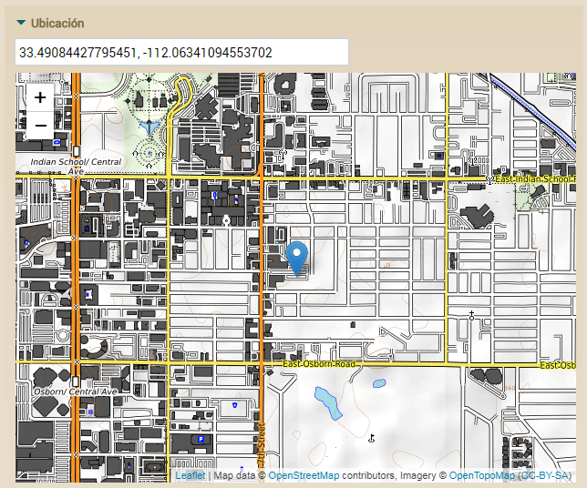

El usuario puede marcar en cualquier parte del mapa y las coordenadas cambiarán. También si teclea o pega las coordenadas en el campo el mapa y la marca se reposicionan.

Puedes usar *@Coordinates* sin ninguna configuración especial, sin embargo tienes la opción de cambiar el proveedor de imágenes de trozos de mapa (*tile provider*) en *xava.properties*. OpenXava usa una librería JavaScript de código abierto para dibujar los mapas ([Leaflet](https://leafletjs.com/)) y los mapas son gratuitos, de [OpenStreetMap](https://www.openstreetmap.org/). Aún así necesitamos un servidor para generar las imágenes de lo mapas bajo demanda y para eso deberíamos instalar y configurar un software en un servidor que convierta los mapas en imágenes y los envíe al componente JavaScript. Configurar este servidor es complejo y cuesta tiempo, por eso la mayoría de las veces es más conveniente usar servidores de terceros que ofrecen ese servicio, lo que llamamos en inglés *tile providers*. OpenXava te permite definir el *tile provider* que quieras en *xava.properties*. Por defecto, viene configurado para usar [OpenTopoMap](https://opentopomap.org/) con estas entradas en *xava.properties*:

*# OpenTopoMap* 

mapsTileProvider=https://b.tile.opentopomap.org/{z}/{x}/{y}.png

mapsAttribution=Map data © <a href="https://www.openstreetmap.org/copyright">OpenStreetMap</a> contributors, Imagery © <a href="https://opentopomap.org">OpenTopoMap</a> (<a href="https://creativecommons.org/licenses/by-sa/3.0/">CC-BY-SA</a>)

OpenTopoMap es de libre uso incluso para proyectos comerciales con la licencia CC-BY-SA.

Puedes definir otros proveedores, como [MapBox](https://www.mapbox.com/), de esta manera:

*# MapBox* 

*# Cambia abajo YOUR\_ACCESS\_TOKEN por tu propio token de acceso*

mapsTileProvider=https://api.mapbox.com/styles/v1/mapbox/streets-v11/tiles/{z}/{x}/{y}?access\_token=YOUR\_ACCESS\_TOKEN

mapsAttribution=Map data © <a href="https://www.openstreetmap.org/copyright">OpenStreetMap</a> contributors, Imagery © <a href="https://www.mapbox.com/">Mapbox</a>

mapsTileSize=512

mapsZoomOffset=-1

MapBox es un proveedor comercial, aunque ofrecen planes gratuitos. Has de registrarte en <https://www.mapbox.com/> para obtener un token de acceso. Recuerda cambiar YOUR\_ACCESS\_TOKEN en la URL por tu propio token de acceso. Para este proveedor has de definir *mapsTileSize* y *mapsZoomOffset* para que los mapas se visualicen bien. Con MapBox el mapa anterior tendría este aspecto:

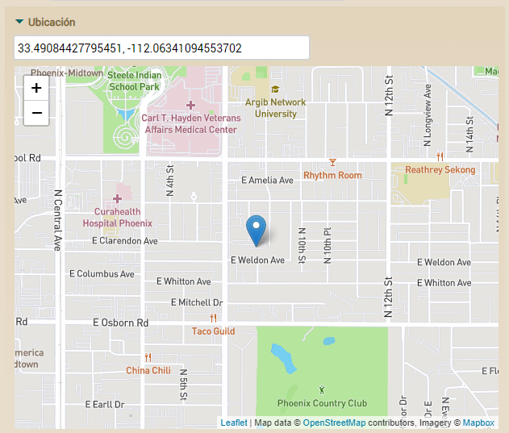

Aparte de OpenTopoMap y MaxBox puedes usar cualquier otro *tile provider*, como [Stamen](https://stamen.com/), [OpenStreeMap](https://www.openstreetmap.org/) o [Thunderforest](https://www.thunderforest.com/).

El editor para *@Coordinates* es un editor con marco, es decir están dentro de un marco que el usuario puede plegar. Puedes usar las [características de disposición de OpenXava por medido de *@View*](C:\Users\Soporte\Documents\openxava\openxava-doc\web\docs\view_es.html) para ponerlo en la interfaz de usuario en la forma que quieras, por ejemplo, si quieres un formulario con todos los campos a la izquierda y el mapa a la derecha, puedes escribir una anotación *@View* como esta:

**@View**(members=

`    `"ciudad [ estado; "

`        `+ "condicionEstado;"

`        `+ "codigo;"

`        `+ "nombre;"

`        `+ "población;"

`        `+ "codigoPostal;"

`        `+ "condado;"

`        `+ "pais;"

`        `+ "fundacion;"

`        `+ "superficie;"

`        `+ "altitud;"

`        `+ "tipoGobierno;"

`        `+ "alcalde;"

`    `+ "], "

`    `+ "ubicacion")

Donde *ubicacion* es una propiedad *@Coordinates*. Fíjate que usamos un grupo (las propiedades entre corchetes []) para las propiedades planas y colocamos la propiedad *ubicacion* al lado (usando una coma). El resultado es:

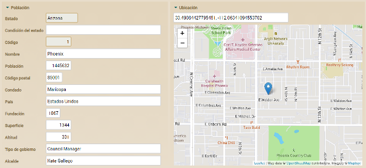

**Firma Manuscrita *(nuevo en v7.6)***

*La firma manuscrita sólo está disponible con [*XavaPro*](https://openxava.org/xavapro)*

Para permitir al usuario firmar a mano y guardar su firma en una propiedad, has de anotar la propiedad con *@HandwrittenSignature* o *@Stereotype("FIRMA\_MANUSCRITA")*:

**import** com.openxava.annotations.\*; *// No org.openxava.annotations.\**

...

**@HandwrittenSignature**

**@Column**(length=32)  

**private** String firmaCliente;

Nota como la anotación está en el paquete *com.openxava.annotations* (de XavaPro) y no en *org.openxava.annotations*.

La propiedad se visualizaría así:

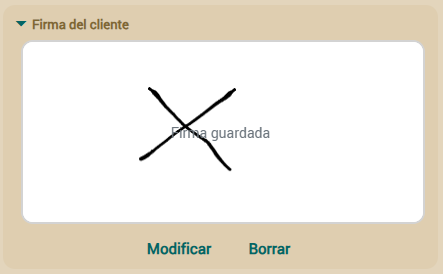

El usuario podrá firmar con el dedo o un lapiz para pantallas táctiles, especialmente pensado para móviles y tablets, aunque también es posible firmar usando el ratón.

El tipo de la propiedad es un *String* de 32 caracteres donde se almacena un id, no la firma en sí. Las firmas se pueden almacenanar [en el sistema de archivos](C:\Users\Soporte\Documents\openxava\openxava-doc\web\docs\model_es.html#Modelo-Propiedades-Estereotipos%20ARCHIVO%20%28nuevo%20en%20v5.0%29//%20y%20ARCHIVOS%20//%28nuevo%20en%20v5.1%29-Almacenamiento%20en%20el%20Sistema%20de%20Archivos) o [en la base de datos](C:\Users\Soporte\Documents\openxava\openxava-doc\web\docs\model_es.html#Modelo-Propiedades-Estereotipos%20ARCHIVO%20%28nuevo%20en%20v5.0%29//%20y%20ARCHIVOS%20//%28nuevo%20en%20v5.1%29-Almacenamiento%20en%20Base%20de%20Datos), usando el mismo mecanismo (el mismo *filePersistorClass*) que *@File* y *@Files*. También es posible [manipular las firmas por código con *FilePersistorFactory*](C:\Users\Soporte\Documents\openxava\openxava-doc\web\docs\model_es.html#manipular-archivos-por-codigo) como con *@File* y *@Files*.

**Máscara *(nuevo en v7.1)***

Una máscara es una cadena de carácteres que define el formato válido de los valores de entrada. Para esto debes usar la anotación *@Mask* con algunos de los siguientes validadores:

- 'L': el usuario deberá ingresar en su lugar una letra alfabética de A ~ z.
- '0': el usuario deberá ingresar en su lugar un dígito.
- 'A': el usuario deberá ingresar en su lugar un carácter alfanumérico.
- '#': el usuario deberá ingresar en su lugar un dígito, espacio en blanco, '+' o '-'.

\
  También puedes agregar carácteres especiales, espacio en blanco de manera estática e incluso combinar los validadores, por ejemplo:

  @Mask("L-000000")

  **private** String pasaporte;

  @Mask("0000 0000 0000 0000")

  **private** String tarjeta;

  @Mask("LL 000 AA")

  **private** String patente;

  @Mask("0.000/0-000")

  **private** String customMask;

  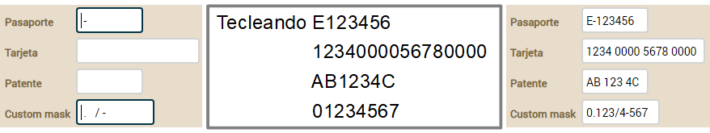

  **Concurrencia y propiedad versión**

  Concurrencia es la habilidad de una aplicación para permitir que varios usuarios graben datos al mismo tiempo sin perder información. OpenXava usa un esquema de concurrencia optimista. Usando concurrencia optimista los registros no se bloquean permitiendo un alto nivel de concurrencia sin perder la integridad de la información.\
  Por ejemplo, si un usuario A lee un registro y entonces un usuario B lee el mismo registro, lo modifica y graba los cambios, cuando el usuario A intente grabar el registro recibirá un error y tendrá que refrescar los datos y reintentar su modificación.\
  Para activar el soporte de concurrencia para un componente OpenXava solo necesitamos declarar una propiedad usando [*@Version*](http://java.sun.com/javaee/5/docs/api/javax/persistence/Version.html), de esta manera:

  @Version

  **private** [**Integer**](http://java.sun.com/j2se/1%2E5%2E0/docs/api/java/lang/Integer.html) version;

  Esta propiedad es para uso del mecanismo de persistencia (Hibernate o JPA), ni nuestra aplicación ni usuarios deberían acceder directamente a ella. Si no usas evolución automática de esquema recuerda añadir la columna VERSION a la tabla.

  **Enums**

  OpenXava soporta *enums* de Java 5. Un *enum* permite definir una propiedad que solo puede contener los valores indicados.\
  Es fácil de usar, veamos un ejemplo:

  **private** Distancia distancia;

  **public** **enum** Distancia { LOCAL, NACIONAL, INTERNACIONAL };

  La propiedad *distancia* solo puede valer LOCAL, NACIONAL o INTERNACIONAL, y como no hemos puesto *@Required* también permite valor vacío (null). Desde v5.3 si pones *@Required*, la primera opción es por defecto y ya no mostrará valor vacío. Si deseas cambiar la opción por defecto usa *@DefaultValueCalculator*. Desde v5.6.1 los enums anotados con *@Required* en una [clase incrustable](C:\Users\Soporte\Documents\openxava\openxava-doc\web\docs\model_es.html#Modelo-Clases%20incrustables%20%28Embeddable%29) mostrarán valor vacío si ésta es utilizada en una colección de elementos.\
\
  A nivel de interfaz gráfico la implementación web actual usa un combo. La etiqueta para cada valor se obtienen de los archivos *i18n*.\
  A nivel de base datos por defecto guarda el entero (0 para LOCAL, 1 para NACIONAL, 2 para INTERNACIONAL y null para cuando no hay valor), pero esto se puede configurar fácilmente para poder usar sin problemas bases de datos legadas. Ver más de esto último en el [capítulo sobre mapeo](C:\Users\Soporte\Documents\openxava\openxava-doc\web\docs\mapping_es.html).

  **Enums con icono *(nuevo en v6.3)***

  Puedes asociar un icono a cada opción de un *enum* usando [*org.openxava.model.IIconEnum*](https://www.openxava.org/OpenXavaDoc/apidocs/org/openxava/model/IIconEnum.html):

**public** **enum** Prioridad implements IIconEnum { 

\
`	`BAJA("transfer-down"), MEDIA("square-medium"), ALTA("transfer-up");

`	`**private** String icon;

`	`**private** **Priority**(String icon) {

`		`**this**.icon = icon;

`	`}

`	`**public** String **getIcon**() {

`		`**return** icon;

`	`} 

};

**private** Prioridad prioridad;

Simplemente haz que tu *enum* implemente *IIconEnum* que fuerza a que tengas un método *getIcon()*. Este método ha de devolver un identificador de icono de [Material Design Icons](https://materialdesignicons.com/). OpenXava puede usar estos iconos en varias partes de la interfaz de usuario, por ejemplo en la lista:

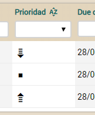

**Propiedades calculadas**

Las propiedades calculadas son de solo lectura (solo tienen *getter*) y no persistentes (no se almacenan en ninguna columna de la tabla de base de datos).\
Una propiedad calculada se define de esta manera:

@Depends("precioUnitario") *// 1*

@Max(9999999999L) *// 2*

**public** [**BigDecimal**](http://java.sun.com/j2se/1%2E5%2E0/docs/api/java/math/BigDecimal.html) getPrecioUnitarioEnPesetas() {

` `**if** (precioUnitario == **null**) **return** **null**;

` `**return** precioUnitario.multiply(**new** [**BigDecimal**](http://java.sun.com/j2se/1%2E5%2E0/docs/api/java/math/BigDecimal.html)("166.386"))

.setScale(0, [**BigDecimal**](http://java.sun.com/j2se/1%2E5%2E0/docs/api/java/math/BigDecimal.html).ROUND\_HALF\_UP);

}

De acuerdo con esta definición ahora podemos usar el código de esta manera:

Producto producto = ...

producto.setPrecioUnitario(2);

[**BigDecimal**](http://java.sun.com/j2se/1%2E5%2E0/docs/api/java/math/BigDecimal.html) resultado = producto.getPrecioUnitarioEnPesetas();

Y *resultado* contendrá 332,772.\
Cuando la propiedad *precioUnitarioEnPesetas* se visualiza al usuario no es editable, y su editor tiene una longitud de 10, indicado usando *@Max(9999999999L)* (2). También, dado que usamos *@Depends("precioUnitario")* (1) cuando el usuario cambie la propiedad *precioUnitario* en la interfaz de usuario la propiedad *precioUnitarioEnPesetas* será recalculada y su valor será refrescado de cara al usuario. *@Depends* permite definir varias propiedades separadas por comas y se puede depender de propiedades planas y referencias, consulta el [JavaDoc de *@Depends*](http://www.openxava.org/OpenXavaDoc/apidocs/org/openxava/annotations/Depends.html) para más detalles.\
Desde una propiedad calculada tenemos acceso a conexiones JDBC. Un ejemplo:

@Max(999)

**public** **int** getCantidadLineas() {

` `*// Un ejemplo de uso de JDBC*

` `[**Connection**](http://java.sun.com/j2se/1%2E5%2E0/docs/api/java/sql/Connection.html) con = **null**;

` `**try** {

` `con = DataSourceConnectionProvider.getByComponent("Factura").getConnection(); *// 1*

` `[**String**](http://java.sun.com/j2se/1%2E5%2E0/docs/api/java/lang/String.html) tabla = MetaModel.get("LineaFactura").getMapping().getTable();

` `[**PreparedStatement**](http://java.sun.com/j2se/1%2E5%2E0/docs/api/java/sql/PreparedStatement.html) ps = con.prepareStatement("select count(\*) from " + tabla +

` `" where FACTURA\_AÑO = ? and FACTURA\_NUMERO = ?");

` `ps.setInt(1, getAño());

` `ps.setInt(2, getNumero());

` `[**ResultSet**](http://java.sun.com/j2se/1%2E5%2E0/docs/api/java/sql/ResultSet.html) rs = ps.executeQuery();

` `rs.next();

` `[**Integer**](http://java.sun.com/j2se/1%2E5%2E0/docs/api/java/lang/Integer.html) result = **new** [**Integer**](http://java.sun.com/j2se/1%2E5%2E0/docs/api/java/lang/Integer.html)(rs.getInt(1));

` `ps.close();

` `**return** result;

` `}

` `**catch** ([**Exception**](http://java.sun.com/j2se/1%2E5%2E0/docs/api/java/lang/Exception.html) ex) {

` `log.error("Problemas al calcular cantidad de líneas de una Factura", ex);

` `*// Podemos lanzar cualquier RuntimeException aquí*

` `**throw** **new** [**SystemException**](http://java.sun.com/j2se/1%2E5%2E0/docs/api/org/omg/CORBA/SystemException.html)(ex);

` `}

` `**finally** {

` `**try** {

` `con.close();

` `}

` `**catch** ([**Exception**](http://java.sun.com/j2se/1%2E5%2E0/docs/api/java/lang/Exception.html) ex) {

` `}

` `}

}

Es verdad, el código JDBC es feo y complicado, pero a veces puede ayudar a resolver problemas de rendimiento. La clase *DataSourceConnectionProvider* nos permite obtener la conexión asociada a la misma fuente de datos que la entidad indicada (en este caso *Factura*). Esta clase es para nuestra conveniencia, también podemos acceder a una conexión JDBC usando JNDI o cualquier otro medio que queramos. De hecho, en una propiedad calculada podemos escribir cualquier código que Java nos permita.\
Si estamos usando acceso basado en propiedades, es decir si anotamos los *getters* o *setters,* entonces hemos de añadir la anotación [*@Transient*](http://java.sun.com/javaee/5/docs/api/javax/persistence/Transient.html) a nuestra propiedad calculada, de esta forma:

**private** **long** codigo;

@Id @Column(length=10) *// Anotamos el getter,*

**public** **long** getCodigo() { *// por tanto JPA usará acceso basado en propiedades para nuestra clase*

` `**return** codigo;

}

**public** **void** setCodigo(**long** codigo) {

` `**this**.codigo = codigo;

}

@Transient *// Hemos de anotar como Transient nuestra propiedad calculada*

**public** [**String**](http://java.sun.com/j2se/1%2E5%2E0/docs/api/java/lang/String.html) getZoneOne() { *// porque usamos acceso basado en propiedades*

` `**return** "En ZONA 1";

}

**Fórmula *(nuevo en v3.1.4)***

Usando [*@Formula*](http://docs.jboss.org/hibernate/stable/annotations/api/org/hibernate/annotations/Formula.html) de [Hibernate Annotations](http://annotations.hibernate.org/) podemos definir un cálculo para nuestra propiedad. Este cálculo se expresa usando SQL, y es ejecutado en la propia base de datos, en vez de por Java. Simplemente hemos de escribir un fragmento válido de SQL:

@org.hibernate.annotations.Formula("PRECIOUNITARIO \* 1.16")

**private** [**BigDecimal**](http://java.sun.com/j2se/1%2E5%2E0/docs/api/java/math/BigDecimal.html) precioUnitarioConIVA;

**public** [**BigDecimal**](http://java.sun.com/j2se/1%2E5%2E0/docs/api/java/math/BigDecimal.html) getPrecioUnitarioConIVA() {

` `**return** precioUnitarioConIVA;

}

El uso es simple. Hemos de poner el cálculo como lo hariamos si lo tuvieramos que poner en una sentencia SQL.\
Normalmente las propiedades con *@Formula* son propiedades de solo lectura, es decir, solo tienen *getter*, no tienen *setter*. Cuando el objeto es leído de la base de datos se hace el cálculo por la misma base de datos y se rellena la propiedad con el resultado.\
Esto es una alternativa a las propiedades calculadas. Tiene la ventaja de que el usuario puede filtrar por esta propiedad en modo lista, y la desventaja de que hemos de usar SQL en vez de Java, y no podemos usar [*@Depends*](http://www.openxava.org/OpenXavaDoc/apidocs/org/openxava/annotations/Depends.html) para recalcular el valor en vivo.

**Calculador valor por defecto**

Con [*@DefaultValueCalculator*](http://www.openxava.org/OpenXavaDoc/apidocs/org/openxava/annotations/DefaultValueCalculator.html) podemos asociar lógica a una propiedad, en este caso la propiedad es lectura y escritura. Este calculador se usa para calcular el valor inicial. Por ejemplo:

@DefaultValueCalculator(CurrentYearCalculator.**class**)

**private** **int** año;

En este caso cuando el usuario intenta crear una nueva factura (por ejemplo) se encontrará con que el campo de año ya tiene valor, que él puede cambiar si quiere. La lógica para generar este valor está en la clase *CurrentYearCalculator* class, así:

**package** org.openxava.calculators;

**import** java.util.\*;

***/\*\****

` `***\* @author Javier Paniza***

` `***\*/***

**public** **class** CurrentYearCalculator **implements** ICalculator {

` `**public** [**Object**](http://www.google.com/search?sitesearch=java.sun.com&q=allinurl%3Aj2se%2F1+5+0%2Fdocs%2Fapi+Object) calculate() **throws** [**Exception**](http://java.sun.com/j2se/1%2E5%2E0/docs/api/java/lang/Exception.html) {

` `[**Calendar**](http://java.sun.com/j2se/1%2E5%2E0/docs/api/java/util/Calendar.html) cal = [**Calendar**](http://java.sun.com/j2se/1%2E5%2E0/docs/api/java/util/Calendar.html).getInstance();

` `cal.setTime(**new** java.util.[**Date**](http://www.google.com/search?sitesearch=java.sun.com&q=allinurl%3Aj2se%2F1+5+0%2Fdocs%2Fapi+Date)());

` `**return** **new** [**Integer**](http://java.sun.com/j2se/1%2E5%2E0/docs/api/java/lang/Integer.html)(cal.get([**Calendar**](http://java.sun.com/j2se/1%2E5%2E0/docs/api/java/util/Calendar.html).YEAR));

` `}

}

Es posible personalizar el comportamiento de un calculador poniendo el valor de sus propiedades, como sigue:

@DefaultValueCalculator(

` `value=org.openxava.calculators.StringCalculator.**class**,

` `properties={ @PropertyValue(name="string", value="BUENA") }

)

**private** [**String**](http://java.sun.com/j2se/1%2E5%2E0/docs/api/java/lang/String.html) relacionConComercial;

En este caso para calcular el valor por defecto OpenXava instancia *StringCalculator* y entonces inyecta el valor "BUENA" en la propiedad *string* de *StringCalculator*, y finalmente llama al método *calculate()* para obtener el valor por defecto para *relacionConComercial*. Como se ve, el uso de la anotación [*@PropertyValue*](http://www.openxava.org/OpenXavaDoc/apidocs/org/openxava/annotations/PropertyValue.html) permite crear calculadores reutilizable.\
*@PropertyValue* permite inyectar valores desde otras propiedades visualizadas, de esta forma:

@DefaultValueCalculator(

` `value=org.openxava.test.calculadores.CalculadorObservacionesTransportista.**class**,

` `properties={

` `@PropertyValue(name="tipoPermisoConducir", from="permisoConducir.tipo")

` `}

)

**private** [**String**](http://java.sun.com/j2se/1%2E5%2E0/docs/api/java/lang/String.html) observaciones;

En este caso antes de ejecutar el calculador OpenXava llena la propiedad *permisoConducir* de *CalculadorObservacionesTransportista* con el valor de la propiedad visualizada *tipo* de la referencia *permisoConducir*. Como se ve el atributo *from* soporta propiedades calificadas (referencia.propiedad). Además, cada ve que *permisoConducir.tipo* cambia *observaciones* se recalcula (*nuevo en v5.1*, con versiones anteriores se recalculaba solo la primera vez).\
Además podemos usar *@PropertyValue* sin *from* ni *value*:

@DefaultValueCalculator(value=CalculadorPrecioDefectoProducto.**class**, properties=

` `@PropertyValue(name="codigoFamilia")

)

En este caso OpenXava coge el valor de la propiedad visualizada *codigoFamilia* y lo inyecta en la propiedad *codigoFamilia* del calculador, es decir *@PropertyValue(name="codigoFamilia")* equivale a *@PropertyValue(name="codigoFamilia", from="codigoFamilia")*.\
Desde un calculador tenemos acceso a conexiones JDBC, he aquí un ejemplo:

@DefaultValueCalculator(value=CalculadorCantidadLineas.**class**,

` `properties= {

` `@PropertyValue(name="año"),

` `@PropertyValue(name="numero"),

` `}

)

**private** **int** cantidadLineas;

Y la clase del calculador:

**package** org.openxava.test.calculadores;

**import** java.sql.\*;

**import** org.openxava.calculators.\*;

**import** org.openxava.util.\*;

***/\*\****

` `***\* @author Javier Paniza***

` `***\*/***

**public** **class** CalculadorCantidadLineas **implements** IJDBCCalculator { *// 1*

` `**private** IConnectionProvider provider;

` `**private** **int** año;

` `**private** **int** numero;

` `**public** **void** setConnectionProvider(IConnectionProvider provider) { *// 2*

` `**this**.provider = provider;

` `}

` `**public** [**Object**](http://www.google.com/search?sitesearch=java.sun.com&q=allinurl%3Aj2se%2F1+5+0%2Fdocs%2Fapi+Object) calculate() **throws** [**Exception**](http://java.sun.com/j2se/1%2E5%2E0/docs/api/java/lang/Exception.html) {

` `[**Connection**](http://java.sun.com/j2se/1%2E5%2E0/docs/api/java/sql/Connection.html) con = provider.getConnection();

` `**try** {

` `[**PreparedStatement**](http://java.sun.com/j2se/1%2E5%2E0/docs/api/java/sql/PreparedStatement.html) ps = con.prepareStatement(

` `"select count(\*) from XAVATEST.LINEAFACTURA “ +

` `“where FACTURA\_AÑO = ? and FACTURA\_NUMERO = ?");

` `ps.setInt(1, getAño());

` `ps.setInt(2, getNumero());

` `[**ResultSet**](http://java.sun.com/j2se/1%2E5%2E0/docs/api/java/sql/ResultSet.html) rs = ps.executeQuery();

` `rs.next();

` `[**Integer**](http://java.sun.com/j2se/1%2E5%2E0/docs/api/java/lang/Integer.html) result = **new** [**Integer**](http://java.sun.com/j2se/1%2E5%2E0/docs/api/java/lang/Integer.html)(rs.getInt(1));

` `ps.close();

` `**return** result;

` `}

` `**finally** {

` `con.close();

` `}

` `}

` `**public** **int** getAño() {

` `**return** año;

` `}

` `**public** **int** getNumero() {

` `**return** numero;

` `}

` `**public** **void** setAño(**int** año) {

` `**this**.año = año;

` `}

` `**public** **void** setNumero(**int** numero) {

` `**this**.numero = numero;

` `}

}

Para usar JDBC nuestro calculador tiene que implementar *IJDBCCalculator* (1) y entonces recibirá un *IConnectionProvider* (2) que podemos usar dentro de *calculate()*.\
OpenXava dispone de un conjunto de calculadores incluidos de uso genérico, que se pueden encontrar en *org.openxava.calculators*.

**Valores por defecto al crear**

Podemos indicar que el valor sea calculado justo antes de crear (insertar en la base de datos) un objeto por primera vez.\
Usualmente para las claves usamos el estándar JPA. Por ejemplo, si queremos usar una columna *identity* (auto incremento) como clave:

@Id @Hidden

@GeneratedValue(strategy=GenerationType.IDENTITY)

**private** [**Integer**](http://java.sun.com/j2se/1%2E5%2E0/docs/api/java/lang/Integer.html) id;

Podemos usar otras técnicas de generación, por ejemplo, una *sequence* de base de datos puede ser definida usando el estándar JPA de esta manera:

@SequenceGenerator(name="SIZE\_SEQ", sequenceName="SIZE\_ID\_SEQ", allocationSize=1 )

@Hidden @Id @GeneratedValue(strategy=GenerationType.SEQUENCE, generator="SIZE\_SEQ")

**private** [**Integer**](http://java.sun.com/j2se/1%2E5%2E0/docs/api/java/lang/Integer.html) id;

Si queremos generar un identificador único de tipo String y 32 caracteres, podemos usar una extensión de Hibernate de JPA:

@Id @GeneratedValue(generator="system-uuid") @Hidden

@GenericGenerator(name="system-uuid", strategy = "uuid")

**private** [**String**](http://java.sun.com/j2se/1%2E5%2E0/docs/api/java/lang/String.html) oid;

Ver la sección 9.1.9 de la especificación JPA 1.0 (parte de JSR-220) para aprender más sobre *@GeneratedValues*.\
Si queremos usar nuestra propia lógica para generar el valor al crear, o bien queremos generar un nuevo valor para propiedades que no son clave entonces no podemos usar el *@GeneratedValue* de JPA, aunque es fácil resolver estos casos con JPA. Solo necesitamos añadir este código a nuestra clase:

@PrePersist

**private** **void** calcularContador() {

` `contador = **new** [**Long**](http://java.sun.com/j2se/1%2E5%2E0/docs/api/java/lang/Long.html)([**System**](http://java.sun.com/j2se/1%2E5%2E0/docs/api/java/lang/System.html).currentTimeMillis()).intValue();

}

La anotación JPA *@PrePersist* hace que este método se ejecute antes de insertar datos por primera vez en la base de datos, en este método podemos calcular el valor para nuestra clave o incluso para propiedades no clave con nuestra propia lógica.

**Validador de propiedad**

Un validador de propiedad ([*@PropertyValidator*](http://www.openxava.org/OpenXavaDoc/apidocs/org/openxava/annotations/PropertyValidator.html)) ejecuta la lógica de validación sobre el valor que se vaya a asignar a esa propiedad antes de grabar. Una propiedad puede tener varios validadores:

@PropertyValidator(value=ValidadorExcluirCadena.**class**, properties=

`    `@PropertyValue(name="cadena", value="MOTO")

)

@PropertyValidator(value=ValidadorExcluirCadena.**class**, properties=

`    `@PropertyValue(name="cadena", value="COCHE"),

`    `onlyOnCreate=**true**

)

**private** [**String**](http://java.sun.com/j2se/1%2E5%2E0/docs/api/java/lang/String.html) descripcion;

Con un OpenXava anterior a 6.1 has de usar *@PropertyValidators* para englobar las anotaciones, así:

@PropertyValidators ({ // Sólo necesario hasta v6.0.2

`    `@PropertyValidator(value=ValidadorExcluirCadena.**class**, properties=

`        `@PropertyValue(name="cadena", value="MOTO")

`    `),

`    `@PropertyValidator(value=ValidadorExcluirCadena.**class**, properties=

`        `@PropertyValue(name="cadena", value="COCHE"),

`        `onlyOnCreate=**true**

`    `)

})

**private** [**String**](http://java.sun.com/j2se/1%2E5%2E0/docs/api/java/lang/String.html) descripcion;

La forma de configurar el validador (con los [*@PropertyValue*](http://www.openxava.org/OpenXavaDoc/apidocs/org/openxava/annotations/PropertyValue.html), aunque el atributo *from* no funciona, hay que usar *value* siempre) es exactamente igual como en los [calculadores](C:\Users\Soporte\Documents\openxava\openxava-doc\web\docs\model_es.html#Modelo-Referencias-Calculador%20valor%20por%20defecto%20en%20referencias). Con el atributo *onlyOnCreate=”true”* se puede definir que esa validación solo se ejecute cuando se crea el objeto, y no cuando se modifica.\
El código del validador es:

**package** org.openxava.test.validadores;

**import** org.openxava.util.\*;

**import** org.openxava.validators.\*;

***/\*\****

` `***\* @author Javier Paniza***

` `***\*/***

**public** **class** ValidadorExcluirCadena **implements** IPropertyValidator { *// 1*

` `**private** [**String**](http://java.sun.com/j2se/1%2E5%2E0/docs/api/java/lang/String.html) cadena;

` `**public** **void** validate(

` `Messages errores, *// 2*

` `[**Object**](http://www.google.com/search?sitesearch=java.sun.com&q=allinurl%3Aj2se%2F1+5+0%2Fdocs%2Fapi+Object) valor, *// 3*

` `[**String**](http://java.sun.com/j2se/1%2E5%2E0/docs/api/java/lang/String.html) nombreObjecto, *// 4*

` `[**String**](http://java.sun.com/j2se/1%2E5%2E0/docs/api/java/lang/String.html) nombrePropiedad) *// 5*

` `**throws** [**Exception**](http://java.sun.com/j2se/1%2E5%2E0/docs/api/java/lang/Exception.html) {

` `**if** (valor==**null**) **return**;

` `**if** (valor.toString().indexOf(getCadena()) >= 0) {

` `errores.add("excluir\_cadena",

` `nombrePropiedad, nombreObjeto, getCadena());

` `}

` `}

` `**public** [**String**](http://java.sun.com/j2se/1%2E5%2E0/docs/api/java/lang/String.html) getCadena() {

` `**return** cadena==**null**?"":cadena;

` `}

` `**public** **void** setCadena([**String**](http://java.sun.com/j2se/1%2E5%2E0/docs/api/java/lang/String.html) cadena) {

` `**this**.cadena = cadena;

` `}

}

Un validador ha de implementar *IPropertyValidator* (1), esto le obliga a tener un método *validate()* en donde se ejecuta la validación de la propiedad. Los argumentos del método *validate()* son:

1. **Messages errores**: Un objeto de tipo *Messages* que representa un conjunto de mensajes (una especie de colección inteligente) y es donde podemos añadir los problemas de validación que encontremos.
1. **Object valor**: El valor a validar.
1. **String nombreObjeto**: Nombre del objeto al que pertenece la propiedad a validar. Útil para usarlo en los mensajes de error.
1. **String nombrePropiedad**: Nombre de la propiedad a validar. Útil para usarlo en los mensajes de error.

   Como se ve cuando encontramos un error de validación solo tenemos que añadirlo (con *errores.add()*) enviando un identificador de mensaje y los argumentos. Para que este validador produzca un mensaje significativo tenemos que tener en nuestro archivo de mensajes i18n la siguiente entrada:

   excluir\_cadena={0} no puede contener {2} en {1}

   Si el identificador que se envía no está en el archivo de mensajes, sale tal cual al usuario; pero lo recomendado es siempre usar identificadores del archivo de mensajes.\
   La validación es satisfactoria si no se añaden mensajes y se supone fallida si se añaden. El sistema recolecta todos los mensajes de todos los validadores antes de grabar y si encuentra los visualiza al usuario y no graba.\
   A partir de v4.6.1 también es posible usar en el validador el mensaje de *@PropertyValidator*. Es decir, podemos escribir:

   @PropertyValidator(value=ValidadorTituloLibro.**class**, message="{libro\_rpg\_no\_permitido}")

   **private** [**String**](http://java.sun.com/j2se/1%2E5%2E0/docs/api/java/lang/String.html) titulo;

   Si el mensaje está entre llaves se obtiene de los archivos i18n, si no se usa tal cual.\
   Además, hemos de implementar la interfaz [*IWithMessage*](http://www.openxava.org/OpenXavaDoc/apidocs/org/openxava/validators/IWithMessage.html) en el validador:

   **public** **class** ValidadorTituloLibro **implements** IPropertyValidator, IWithMessage {

 

   `    `**private** [**String**](http://java.sun.com/j2se/1%2E5%2E0/docs/api/java/lang/String.html) message;

 

   `    `**public** **void** setMessage([**String**](http://java.sun.com/j2se/1%2E5%2E0/docs/api/java/lang/String.html) message) **throws** [**Exception**](http://java.sun.com/j2se/1%2E5%2E0/docs/api/java/lang/Exception.html) {

   `        `**this**.message = message; *// Este es message de @PropertyValidator*

   `    `}

 

   `    `**public** **void** validate(Messages errors, [**Object**](http://www.google.com/search?sitesearch=java.sun.com&q=allinurl%3Aj2se%2F1+5+0%2Fdocs%2Fapi+Object) value, [**String**](http://java.sun.com/j2se/1%2E5%2E0/docs/api/java/lang/String.html) propertyName, [**String**](http://java.sun.com/j2se/1%2E5%2E0/docs/api/java/lang/String.html) modelName) {

   `       `**if** ((([**String**](http://java.sun.com/j2se/1%2E5%2E0/docs/api/java/lang/String.html))value).contains("RPG")) {

   `           `errors.add(message); *// Podemos añadir el mensaje directamente*

   `       `}

   `    `}

 

   }

   El mensaje especificado en la anotación *@PropertyValidator*, *libro\_rpg\_no\_permitido*, se inyecta en el validador llamando a *setMessage()*. Este mensaje puede ser añadido directamente como un error.\
   El paquete [*org.openxava.validators*](http://www.openxava.org/OpenXavaDoc/apidocs/org/openxava/validators/package-summary.html) contiene algunos validadores de uso común.\
   *@PropertyValidator* está definida como una restriccion de [Bean Validation](C:\Users\Soporte\Documents\openxava\openxava-doc\web\docs\model_es.html#Modelo-Bean%20Validation) a partir de v5.3 y como una restricción de [Hibernate Validator](C:\Users\Soporte\Documents\openxava\openxava-doc\web\docs\model_es.html#Modelo-Hibernate%20Validator%20%28nuevo%20en%20v3.0.1%29) hasta v5.2.x*.*\
   Si necesitas usar JPA en tu validador, mira [Usar JPA en un validador o método de retrollamada](C:\Users\Soporte\Documents\openxava\openxava-doc\web\docs\model_es.html#Modelo-Metodos+de+retrollamada+de+JPA).

   **Validador por defecto *(nuevo en v2.0.3)***

   Podemos definir validadores por defecto para las propiedades de cierto tipo o estereotipo. Para esto se usa el archivo *validadores.xml* en *src/main/resources/xava* (simplemente *xava* antes v7) de nuestro proyecto para definir en él los validadores por defecto.\
   Por ejemplo, podemos definir en nuestro *xava/validadores.xml* lo siguiente:

   **<validadores>**

   ` `**<validador-defecto>**

   ` `**<clase-validador**

   ` `clase="org.openxava.test.validadores.ValidadorNombrePersona"**/>**

   ` `**<para-estereotipo** stereotipo="NOMBRE\_PERSONA"**/>**

   ` `**</validador-defecto>**

   **</validadores>**

   En este caso estamos asociando el validador *ValidadorNombrePersona* al estereotipo NOMBRE\_PERSONA. Ahora si definimos una propiedad como la siguiente:

   @Required @Stereotype("NOMBRE\_PERSONA")

   **private** [**String**](http://java.sun.com/j2se/1%2E5%2E0/docs/api/java/lang/String.html) nombre;

   Esta propiedad será validada usando *ValidadorNombrePersona* aunque la propiedad misma no defina ningun validador. *ValidadorNombrePersona* se aplica a todas las propiedades con el estereotipo NOMBRE\_PERSONA.\
   Podemos también asignar validadores por defecto a un tipo.\
   En el archivo *validadores.xml* podemos definir también los validadores para determinar si un valor requerido está presente (ejecutado cuando usamos *@Required*). Además podemos asignar nombre (alias) a las clases de los validadores.\
   Podemos aprender más sobre los validadores examinando [*openxava/src/main/resources/xava/default-validators.xml*](https://github.com/openxava/openxava/blob/master/openxava/src/main/resources/xava/default-validators.xml) y [*openxavatest/src/main/resources/xava/validators.xml*](https://github.com/openxava/openxava/blob/master/openxavatest/src/main/resources/xava/validators.xml).\
   Los validadores por defecto no se aplican cuando grabamos nuestras entidades directamente con la api de JPA.

   **Cálculo *(nuevo en v5.7)***

   Con *@Calculation* podemos definir una expresión aritmética para hacer el cálculo de la propiedad. La expresión puede contener +, -, \*, /, (), valores numéricos y nombres de propiedades de la misma entidad. Por ejemplo:

   @Calculation("((horas \* trabajador.precioHora) + desplazamiento - descuento) \* porcentajeIVA / 100")

   **private** [**BigDecimal**](http://java.sun.com/j2se/1%2E5%2E0/docs/api/java/math/BigDecimal.html) total;

   Fíjate como *trabajador.precioHora* se usa para obtener el valor de una referencia.\
   El cálculo se ejecuta y visualiza cuando el usuario cambia cualquier valor de las propiedades usadas en la expresión en la interfaz de usuario, sin embargo el valor no se graba hasta que el usuario no pulsa en el botón de grabar. Todas las propiedades usadas en *@Calculation* (los operandos) tienen que estar visualizadas en la interfaz de usuario para que *@Calculation* funcione, si no es el caso deberías usar una propiedad calculada convencional en su lugar.

   **Referencias**

   Una referencia hace que desde una entidad o agregado se pueda acceder otra entidad o agregado. Una referencia se traduce a código Java como una propiedad (con su *getter* y su *setter*) cuyo tipo es el del modelo al que se referencia. Por ejemplo un *Cliente* puede tener una referencia a su *Comercial*, y así podemos escribir código Java como éste:

   Cliente cliente = ...

   cliente.getComercial().getNombre();

 

   para acceder al nombre del comercial de ese cliente.\
   La sintaxis para definir referencias es:

   @Required *// 1*

   @Id *// 2*

   @SearchKey *// 3 Nuevo en v3.0.2*

   @DefaultValueCalculator *// 4*

   @ManyToOne( *// 5*

   ` `optional=**false** *// 1*

   )

   **private** tipo nombreReferencia; *// 5*

   **public** tipo getNombreReferencia() { ... } *// 5*

   **public** **void** setNombreReferencia(tipo nuevoValor) { ... } *// 5*

1. **@ManyToOne(optional=false)** ([JPA](http://java.sun.com/javaee/5/docs/api/javax/persistence/ManyToOne.html)), **@Required** ([OX](http://www.openxava.org/OpenXavaDoc/apidocs/org/openxava/annotations/Required.html)) (opcional, el JPA es el preferido): Indica si la referencia es requerida. Al grabar OpenXava comprobará si las referencias requeridas están presentes, si no lo están no se producirá la grabación y se devolverá una lista de errores de validación.
1. **@Id** ([JPA](http://java.sun.com/javaee/5/docs/api/javax/persistence/Id.html), opcional): Para indicar si la referencia forma parte de la clave. La combinación de propiedades y referencias clave se debe mapear a un conjunto de campos en la base de datos que no tengan valores repetidos, típicamente con la clave primaria.
1. [**@DefaultValueCalculator**](C:\Users\Soporte\Documents\openxava\openxava-doc\web\docs\model_es#toc14) ([OX](http://www.openxava.org/OpenXavaDoc/apidocs/org/openxava/annotations/DefaultValueCalculator.html), one, opcional): Para implementar la lógica para calcular el valor inicial de la referencia. Este calculador ha de devolver el valor de la clave, que puede ser un dato simple (solo si la clave del objeto referenciado es simple) o un objeto clave (un objeto especial que envuelve la clave primaria).
1. **@SearchKey** ([OX](http://www.openxava.org/OpenXavaDoc/apidocs/org/openxava/annotations/SearchKey.html), optional): *(Nuevo en v3.0.2)* Las referencias clave de búsqueda se usan por los usuarios para buscar los objetos. Son editables en la interfaz de usuario de las referencias permitiendo al usuario teclear su valor para buscar. OpenXava usa los miembros clave (*@Id*) para buscar por defecto, y si los miembros clave (*@Id*) están ocultos usa la primera propiedad en la vista. Con *@SearchKey* podemos elegir referencias para buscar explícitamente.
1. **Declaración de la referencia**: Una declaración de referencia convencional de Java con sus *getters* y *setters*. La referencia se marca con [*@ManyToOne (JPA)*](http://java.sun.com/javaee/5/docs/api/javax/persistence/ManyToOne.html) y el tipo ha de ser otra entidad.

   Un pequeño ejemplo de referencias:

   @ManyToOne

   **private** Comercial comercial; *// 1*

   **public** Comercial getComercial() {

   ` `**return** comercial;

   }

   **public** **void** setComercial(Comercial comercial) {

   ` `**this**.comercial = comercial;

   }

 

   @ManyToOne(fetch=FetchType.LAZY)

   **private** Comercial comercialAlternativo; *// 2*

   **public** Comercial getComercialAlternativo() {

   ` `**return** comercialAlternativo;

   }

   **public** **void** setComercialAlternativo(Comercial comercialAlternativa) {

   ` `**this**.comercialAlternativo = comercialAlternativo;

   }

 

1. Una referencia llamada *comercial* a la entidad *Comercial*.
1. Una referencia llamada *comercialAlternativo* a la entidad *Comercial*. En este caso usamos *fetch=FetchType.LAZY*, de esta manera los datos son leidos de la base de datos bajo demanda. Este es el enfoque más eficiente, pero no es el valor por defecto en JPA, por tanto es aconsejable **usar siempre *fetch=FetchType.LAZY*** al declarar las referencias.

   Si asumimos que esto está en una entidad llamada *Cliente*, podemos escribir:

   Cliente cliente = ...

   Comercial comercial = cliente.getComercial();

   Comercial comercialAlternativo = cliente.getComercialAlternativo();

 

   **Calculador valor por defecto en referencias**

   En una referencia [***@DefaultValueCalculator***](http://www.openxava.org/OpenXavaDoc/apidocs/org/openxava/annotations/DefaultValueCalculator.html) funciona [como en una propiedad](C:\Users\Soporte\Documents\openxava\openxava-doc\web\docs\model_es.html#Modelo-Propiedades-Calculador%20valor%20por%20defecto), solo que hay que devolver el valor de la clave de la referencia.\
   Por ejemplo, en el caso de una referencia con clave simple podemos poner:

   @ManyToOne(optional=**false**, fetch=FetchType.LAZY) @JoinColumn(name="FAMILY")

   @DefaultValueCalculator(value=IntegerCalculator.**class**, properties=

   ` `@PropertyValue(name="value", value="2")

   )

   **private** Familia familia;

   El método *calculate()* de este calculador es:

   **public** [**Object**](http://www.google.com/search?sitesearch=java.sun.com&q=allinurl%3Aj2se%2F1+5+0%2Fdocs%2Fapi+Object) calculate() **throws** [**Exception**](http://java.sun.com/j2se/1%2E5%2E0/docs/api/java/lang/Exception.html) {

   ` `**return** **new** [**Integer**](http://java.sun.com/j2se/1%2E5%2E0/docs/api/java/lang/Integer.html)(value);

   }

 

   Como se puede ver se devuelve un entero, es decir, el valor para familia por defecto es la familia cuyo código es el 2.\
   En el caso de clave compuesta sería así:

   @ManyToOne(fetch=FetchType.LAZY)

   @JoinColumns({

   ` `@JoinColumn(name="ZONA", referencedColumnName="ZONA"),

   ` `@JoinColumn(name="ALMACEN", referencedColumnName="CODIGO")

   })

   @DefaultValueCalculator(CalculadorDefectoAlmacen.**class**)

   **private** Almacen almacen;

   Y el código del calculador:

   **package** org.openxava.test.calculadores;

 

   **import** org.openxava.calculators.\*;

 

   ***/\*\****

   ` `***\* @author Javier Paniza***

   ` `***\*/***

   **public** **class** CalculadorDefectoAlmacen **implements** ICalculator {

 

   `  `**public** [**Object**](http://www.google.com/search?sitesearch=java.sun.com&q=allinurl%3Aj2se%2F1+5+0%2Fdocs%2Fapi+Object) calculate() **throws** [**Exception**](http://java.sun.com/j2se/1%2E5%2E0/docs/api/java/lang/Exception.html) {

   `    `Almacen clave = **new** Almacen();

   `    `clave.setNumber(4);

   `    `clave.setZoneNumber(4);

   `    `**return** clave;

   `  `}

 

   }

   Devuelve un objeto de tipo *Almacen* pero rellenando sólo las propiedades clave.

   **Usar referencias como clave**

   Podemos usar referencias como clave, o como parte de la clave. Hemos de declarar la referencia como\
   [*@Id*](http://java.sun.com/javaee/5/docs/api/javax/persistence/Id.html), y usar una clase clave, como sigue:

   @[**Entity**](http://www.google.com/search?sitesearch=java.sun.com&q=allinurl%3Aj2se%2F1+5+0%2Fdocs%2Fapi+Entity)

   @IdClass(DetalleAdicionalKey.**class**)

   **public** **class** DetalleAdicional {

 

   ` `*// JoinColumn se especifica también en DetalleAdicionalKey por un*

   ` `*// bug de Hibernate, ver http://opensource.atlassian.com/projects/hibernate/browse/ANN-361*

   ` `@Id @ManyToOne(fetch=FetchType.LAZY)

   ` `@JoinColumn(name="SERVICIO")

   ` `**private** Servicio servicio;

 

   ` `@Id @Hidden

   ` `**private** **int** contador;

 

    ...

 

   }

   Además, necesitamos escribir la clase clave:

   **public** **class** DetalleAdicionalKey **implements** java.io.[**Serializable**](http://java.sun.com/j2se/1%2E5%2E0/docs/api/java/io/Serializable.html) {

 

   ` `@ManyToOne(fetch=FetchType.LAZY)

   ` `@JoinColumn(name="SERVICIO")

   ` `**private** Servicio servicio;

 

   ` `@Hidden

   ` `**private** **int** contador;

 

   ` `*// equals, hashCode, toString, getters y setters*

    ...

 

   ` `}

   Necesitamos escribir la clase clave aunque la clave sea solo una referencia con una sola columna clave.\
   Es mejor usar esta característica sólo cuando estemos trabajando contra bases de datos legadas, si tenemos control sobre el esquema es mejor usar un id autogenerado.

   **Referencias incrustadas**

   Podemos referenciar a una [clase incrustable](C:\Users\Soporte\Documents\openxava\openxava-doc\web\docs\model_es.html#Modelo-Clases%20incrustables%20%28Embeddable%29) usando la anotación [*@Embedded*](http://java.sun.com/javaee/5/docs/api/javax/persistence/Embedded.html). Por ejemplo, en la entidad principal podemos escribir:

   @Embedded

   **private** Direccion direccion;

 

   Y hemos de definir la clase *Direccion* como incrustable:

   **package** org.openxava.test.model;

 

   **import** javax.persistence.\*;

   **import** org.openxava.annotations.\*;

 

   ***/\*\****

   ` `***\****

   ` `***\* @author Javier Paniza***

   ` `***\*/***

 

   @Embeddable

   **public** **class** Direccion **implements** IConPoblacion {

 

   ` `@Required @Column(length=30)

   ` `**private** [**String**](http://java.sun.com/j2se/1%2E5%2E0/docs/api/java/lang/String.html) calle;

 

   ` `@Required @Column(length=5)

   ` `**private** **int** codigoPostal;

 

   ` `@Required @Column(length=20)

   ` `**private** [**String**](http://java.sun.com/j2se/1%2E5%2E0/docs/api/java/lang/String.html) poblacion;

 

   ` `*// ManyToOne dentro de un Embeddable no está soportado en JPA 1.0 (ver en 9.1.34),*

   ` `*// pero la implementación de Hibernate lo soporta.*

   ` `@ManyToOne(fetch=FetchType.LAZY, optional=**false**) @JoinColumn(name="STATE")

   ` `**private** Provincia provincia;

 

   ` `**public** [**String**](http://java.sun.com/j2se/1%2E5%2E0/docs/api/java/lang/String.html) getPoblacion() {

   ` `**return** poblacion;

   ` `}

 

   ` `**public** **void** setPoblacion([**String**](http://java.sun.com/j2se/1%2E5%2E0/docs/api/java/lang/String.html) poblacion) {

   ` `**this**.poblacion = poblacion;

   ` `}

 

   ` `**public** [**String**](http://java.sun.com/j2se/1%2E5%2E0/docs/api/java/lang/String.html) getCalle() {

   ` `**return** calle;

   ` `}

 

   ` `**public** **void** setCalle([**String**](http://java.sun.com/j2se/1%2E5%2E0/docs/api/java/lang/String.html) calle) {

   ` `**this**.calle = calle;

   ` `}

 

   ` `**public** **int** getCodigoPostal() {

   ` `**return** codigoPostal;

   ` `}

 

   ` `**public** **void** setCodigoPostal(**int** codigoPostal) {

   ` `**this**.codigoPostal = codigoPostal;

   ` `}

 

   ` `**public** Provincia getProvincia() {

   ` `**return** provincia;

   ` `}

 

   ` `**public** **void** setProvincia(Provincia provincia) {

   ` `**this**.provincia = provincia;

   ` `}

 

   }

   Como se ve una clase incrustable puede implementar una interfaz (1) y contener referencias (2), entre otras cosas, pero no puede usar métodos de retrollamada de JPA.\
   Este código se puede usar así, para leer:

   Cliente cliente = ...

   Direccion direccion = cliente.getDireccion();

   direccion.getCalle(); *// para obtener el valor*

   O así para establecer una nueva dirección

   *// para establecer una nueva dirección*

   Direccion direccion = **new** Direccion();

   direccion.setCalle(“Mi calle”);

   direccion.setCodigoPostal(46001);

   direccion.setMunicipio(“Valencia”);

   direccion.setProvincia(provincia);

   cliente.setDireccion(direccion);

   En este caso que tenemos una referencia simple, el código generado es un simple JavaBean, cuyo ciclo de vida esta asociado a su objeto contenedor, es decir, la *Direccion* se borrará y creará junto al *Cliente*, jamas tendrá vida propia ni podrá ser compartida por otro *Cliente*.

   **Colecciones**

   **Colecciones de entidades**

   Podemos definir colecciones de referencias a entidades. Una colección es una propiedad Java que devuelve *java.util.Collection*.\
   Aquí la sintaxis para definir una colección:

   @Size *// 1*

   @[**Condition**](http://java.sun.com/j2se/1%2E5%2E0/docs/api/java/util/concurrent/locks/Condition.html) *// 2*

   @OrderBy *// 3*

   @XOrderBy *// 4*

   @OrderColumn *// 5*

   @OneToMany/@ManyToMany *// 6*

   **private** [**Collection**](http://java.sun.com/j2se/1%2E5%2E0/docs/api/java/util/Collection.html)<TuEntidad> nombreColeccion; *// 5*

   **public** [**Collection**](http://java.sun.com/j2se/1%2E5%2E0/docs/api/java/util/Collection.html)<TuEntidad> getNombreColeccion() { ... } *// 5*

   **public** **void** setNombreColeccion([**Collection**](http://java.sun.com/j2se/1%2E5%2E0/docs/api/java/util/Collection.html)<TuEntidad> nuevoValor) { ... } *// 5*

 

1. **@Size** ([BV](http://docs.jboss.org/hibernate/beanvalidation/spec/1.1/api/javax/validation/constraints/Size.html), [HV](http://www.hibernate.org/hib_docs/validator/api/org/hibernate/validator/Size.html), opcional): Cantidad mínima (*min*) y/o máxima (*max*) de elementos esperados. Esto se valida antes de grabar.
1. **@Condition** ([OX](http://www.openxava.org/OpenXavaDoc/apidocs/org/openxava/annotations/Condition.html), opcional): Para restringir los elementos que aparecen en la colección. No funciona en relaciones *@ManyToMany*.
1. **@OrderBy** ([JPA](http://docs.oracle.com/javaee/7/api/javax/persistence/OrderBy.html), opcional): Para que los elementos de la colección aparezcan en un determinado orden.
1. **@XOrderBy** ([OX](http://www.openxava.org/OpenXavaDoc/apidocs/org/openxava/annotations/XOrderBy.html), opcional): *@OrderBy* de JPA no permite usar propiedades calificadas (propiedades de referencias). *@XOrderBy* sí lo permite.
1. [**@OrderColumn**](C:\Users\Soporte\Documents\openxava\openxava-doc\web\docs\model_es.html#Modelo-Colecciones-Listas%20con%20@OrderColumn%20%28nuevo%20en%20v5.3%29) ([JPA](http://docs.oracle.com/javaee/7/api/javax/persistence/OrderColumn.html), opcional): *(Nuevo en v5.3)* El orden de los elementos en la colección se guarda en la base de datos. Una columna especial se crea en la tabla para mantener este orden. La colección ha de ser una *java.util.List*. La interfaz de usuario permite al usuario reordenar los elementos de la colección.
1. **Declaracion de la colección**: Una declaración de colección convencional de Java con sus *getters* y *setters*. La colección se marca con [*@OneToMany (JPA)*](http://docs.oracle.com/javaee/7/api/javax/persistence/OneToMany.html) o [*@ManyToMany (JPA)*](http://docs.oracle.com/javaee/7/api/javax/persistence/ManyToMany.html) y el tipo ha de ser otra entidad.

   Vamos a ver algunos ejemplos. Empecemos por uno simple:

   @OneToMany (mappedBy="factura")

   **private** [**Collection**](http://java.sun.com/j2se/1%2E5%2E0/docs/api/java/util/Collection.html)<Albaran> albaranes;

   **public** [**Collection**](http://java.sun.com/j2se/1%2E5%2E0/docs/api/java/util/Collection.html)<Albaran> getAlbaranes() {

   ` `**return** albaranes;

   }

   **public** **void** setAlbaranes([**Collection**](http://java.sun.com/j2se/1%2E5%2E0/docs/api/java/util/Collection.html)<Albaran> albaranes) {

   ` `**this**.albaranes = albaranes;

   }

 

   Si ponemos esto dentro de una *Factura*, estamos definiendo una colección de los *albaranes* asociados a esa *Factura*. La forma de relacionarlo se hace en la parte del [mapeo objeto-relacional](C:\Users\Soporte\Documents\openxava\openxava-doc\web\docs\mapping_es.html). Usamos *mappedBy="factura"* para indicar que la referencia *factura* de *Albaran* se usa para mapear esta colección.\
   Ahora podemos escribir código como este:

   Factura factura = ...

   **for** (Albaran albaran: factura.getAlbaranes()) {

   ` `albaran.hacerAlgo();

   }

   Para hacer algo con todos los albaranes asociados a una factura.

   Las referencias de las colecciones se asumen bidireccionales, esto quiere decir que si en un *Comercial* tengo una colección *clientes*, en *Cliente* tengo que tener una referencia a *Comercial*. Pero puede ocurrir que en *Cliente* tenga más de una referencia a *Comercial* (por ejemplo, *comercial* y *comercialAlternativo*) y entonce JPA no sabe cual escoger, por eso tenemos el atributo *mappedBy* de *@OneToMany*. En este caso pondríamos:

   @OneToMany(mappedBy="comercial")

   **private** [**Collection**](http://java.sun.com/j2se/1%2E5%2E0/docs/api/java/util/Collection.html)<Cliente> clientes;

   Para indicar que es la referencia *comercial* y no *comercialAlternativo* la que vamos a usar para esta colección.

   Vamos a ver otro ejemplo más complejo, dentro de *Factura*:

   @OneToMany (mappedBy="factura", cascade=CascadeType.REMOVE) *// 1*

   @OrderBy("tipoServicio desc") *// 2*

   @org.hibernate.validator.Size(min=1) *// 3*

   **private** [**Collection**](http://java.sun.com/j2se/1%2E5%2E0/docs/api/java/util/Collection.html)<LineaFactural> facturas;

1. Usar REMOVE como tipo de cascadaas cascade type hace que cuando el usuario borra una factura sus líneas también se borran.
1. Con *@OrderBy* obligamos a que las lineas se devuelvan ordenadas por *tipoServicio*.
1. La restricción de *@Size(min=1)* hace que sea obligado que haya al menos una línea para que la factura sea válida.

\

   **Colecciones con condición**

   Tenemos libertad completa para definir como se obtienen los datos de una colección, con *@Condition* podemos sobreescribir la condición por defecto:

   @[**Condition**](http://java.sun.com/j2se/1%2E5%2E0/docs/api/java/util/concurrent/locks/Condition.html)(

   ` `"${almacen.codigoZona} = ${this.almacen.codigoZona} AND " +

   ` `"${almacen.codigo} = ${this.almacen.codigo} AND " +

   ` `"NOT (${codigo} = ${this.codigo})"

   )

   **public** [**Collection**](http://java.sun.com/j2se/1%2E5%2E0/docs/api/java/util/Collection.html)<Transportista> getCompañeros() {

   ` `**return** **null**;

   }

   Si ponemos esta colección dentro de *Transportista*, podemos obtener todos los transportista del mismo almacén menos él mismo, es decir, la lista de sus compañeros. Es de notar como podemos usar *this* en la condición para referenciar al valor de una propiedad del objeto actual. *@Condition* solo aplica a la interfaz de usuario generada por OpenXava, si llamamos directamente a *getFellowCarriers()* retornará nulo. La condición es absoluta, es decir si ponemos *@Condition("1 = 1")* mostraría todos los transportista en la base de datos.

   **Colecciones calculadas**

   Si con *@Condition* no tenemos suficiente, podemos escribir completamente la lógica que devuelve la colección. La colección del punto anterior también se podría haber definido así:

   **public** [**Collection**](http://java.sun.com/j2se/1%2E5%2E0/docs/api/java/util/Collection.html)<Transportista> getCompañeros() {

   ` `[**Query**](http://java.sun.com/j2se/1%2E5%2E0/docs/api/javax/management/Query.html) query = XPersistence.getManager().createQuery("from Transportista t where " +

   ` `"t.almacen.codigoZona = :zona AND " +

   ` `"t.almacen.codigo = :codigoAlmacen AND " +

   ` `"NOT (t.codigo = :codigo) ");

   ` `query.setParameter("zona", getAlmacen().getCodigoZona());

   ` `query.setParameter("codigoAlmacen", getAlmacen().getCodigo());

   ` `query.setParameter("codigo", getCodigo());

   ` `**return** query.getResultList();

   }

   Como se ve es un método *getter*. Obviamente ha de devolver una *java.util.Collection* cuyos elementos sean de tipo *Transportista*. No hay que definir el campo, el setter ni usar *@OneToMany* o *@ManyToMany*. Únicamente el getter.

   **Colecciones muchos-a-muchos**

   La anotación [*@ManyToMany (JPA)*](http://java.sun.com/javaee/5/docs/api/javax/persistence/ManyToMany.html) permite definir una colección con una multiciplidad de muchos-a-muchos. Como sigue:

   @[**Entity**](http://www.google.com/search?sitesearch=java.sun.com&q=allinurl%3Aj2se%2F1+5+0%2Fdocs%2Fapi+Entity)

   **public** **class** Cliente {

    ...

   ` `@ManyToMany

   ` `**private** [**Collection**](http://java.sun.com/j2se/1%2E5%2E0/docs/api/java/util/Collection.html)<Provincia> provincias;

    ...

   }

 

   En este caso un cliente tiene una colección de provincias, pero una misma provincia puede estar presente en varios clientes.

   **Colecciones incrustadas**

   Las colecciones de objetos incrustados no se soportaban en las primeras versiones de JPA, por eso con OpenXava las simulabamos usando colecciones a entidades con tipo de cascada REMOVE o ALL. OpenXava trata estas colecciones de una manera especial y seguimos llamando a estas colecciones *colecciones incrustadas*.\
   Ahora un ejemplo de una colección incrustada. En la entidad principal (por ejemplo de *Factura*) podemos poner:

   @OneToMany (mappedBy="factura", cascade=CascadeType.REMOVE)

   **private** [**Collection**](http://java.sun.com/j2se/1%2E5%2E0/docs/api/java/util/Collection.html)<LineaFactura> lineas;

   Es de notar que usamos *CascadeType.REMOVE* y *LineaFactura* es una entidad y no una clase incrustable:

   **package** org.openxava.test.model;

 

   **import** java.math.\*;

 

   **import** javax.persistence.\*;

 

   **import** org.hibernate.annotations.Columns;

   **import** org.hibernate.annotations.Type;

   **import** org.hibernate.annotations.Parameter;

   **import** org.hibernate.annotations.GenericGenerator;

   **import** org.openxava.annotations.\*;

   **import** org.openxava.calculators.\*;

   **import** org.openxava.test.validators.\*;

 

   ***/\*\****

   ` `***\****

   ` `***\* @author Javier Paniza***

   ` `***\*/***

 

   @[**Entity**](http://www.google.com/search?sitesearch=java.sun.com&q=allinurl%3Aj2se%2F1+5+0%2Fdocs%2Fapi+Entity)

   @EntityValidator(value=ValidadorLineaFactura.**class**,

   ` `properties= {

   ` `@PropertyValue(name="factura"),

   ` `@PropertyValue(name="oid"),

   ` `@PropertyValue(name="producto"),

   ` `@PropertyValue(name="precioUnitario")

   ` `}

   )

   **public** **class** LineaFactura {

 

   ` `@ManyToOne *// 'Lazy fetching' produce un falla al borrar una linea desde la factura*

   ` `**private** Factura factura;

 

   ` `@Id @GeneratedValue(generator="system-uuid") @Hidden

   ` `@GenericGenerator(name="system-uuid", strategy = "uuid")

   ` `**private** [**String**](http://java.sun.com/j2se/1%2E5%2E0/docs/api/java/lang/String.html) oid;

 

   ` `**private** TipoServicio tipoServicio;

   ` `**public** **enum** TipoServicio { ESPECIAL, URGENTE }

 

   ` `@Column(length=4) @Required

   ` `**private** **int** cantidad;

 

   ` `@Stereotype("DINERO") @Required

   ` `**private** [**BigDecimal**](http://java.sun.com/j2se/1%2E5%2E0/docs/api/java/math/BigDecimal.html) precioUnitario;

 

   ` `@ManyToOne(fetch=FetchType.LAZY, optional=**false**)

   ` `**private** Producto producto;

 

   ` `@DefaultValueCalculator(CurrentDateCalculator.**class**)

   ` `**private** java.util.[**Date**](http://www.google.com/search?sitesearch=java.sun.com&q=allinurl%3Aj2se%2F1+5+0%2Fdocs%2Fapi+Date) fechaEntrega;

 

   ` `@ManyToOne(fetch=FetchType.LAZY)

   ` `**private** Comercial vendidoPor;

 

   ` `@Stereotype("MEMO")

   ` `**private** [**String**](http://java.sun.com/j2se/1%2E5%2E0/docs/api/java/lang/String.html) observaciones;

 

   ` `@Stereotype("DINERO") @Depends("precioUnitario, cantidad")

   ` `**public** [**BigDecimal**](http://java.sun.com/j2se/1%2E5%2E0/docs/api/java/math/BigDecimal.html) getImporte() {

   ` `**return** getPrecioUnitario().multiply(**new** [**BigDecimal**](http://java.sun.com/j2se/1%2E5%2E0/docs/api/java/math/BigDecimal.html)(getCantidad()));

   ` `}

 

   ` `**public** **boolean** isGratis() {

   ` `**return** getImporte().compareTo(**new** [**BigDecimal**](http://java.sun.com/j2se/1%2E5%2E0/docs/api/java/math/BigDecimal.html)("0")) <= 0;

   ` `}

 

   ` `@PostRemove

   ` `**private** **void** postRemove() {

   ` `factura.setComentario(factura.getComentario() + "DETALLE BORRADO");

   ` `}

 

   ` `**public** [**String**](http://java.sun.com/j2se/1%2E5%2E0/docs/api/java/lang/String.html) getOid() {

   ` `**return** oid;

   ` `}

   ` `**public** **void** setOid([**String**](http://java.sun.com/j2se/1%2E5%2E0/docs/api/java/lang/String.html) oid) {

   ` `**this**.oid = oid;

   ` `}

   ` `**public** TipoServicio getTipoServicio() {

   ` `**return** tipoServicio;

   ` `}

   ` `**public** **void** setTipoServicio(TipoServicio tipoServicio) {

   ` `**this**.tipoServicio = tipoServicio;

   ` `}

   ` `**public** **int** getCantidad() {

   ` `**return** cantidad;

   ` `}

   ` `**public** **void** setCantidad(**int** cantidad) {

   ` `**this**.cantidad = cantidad;

   ` `}

   ` `**public** [**BigDecimal**](http://java.sun.com/j2se/1%2E5%2E0/docs/api/java/math/BigDecimal.html) getPrecioUnitario() {

   ` `**return** precioUnitario==**null**?[**BigDecimal**](http://java.sun.com/j2se/1%2E5%2E0/docs/api/java/math/BigDecimal.html).ZERO:precioUnitario;

   ` `}

   ` `**public** **void** setPrecioUnitario([**BigDecimal**](http://java.sun.com/j2se/1%2E5%2E0/docs/api/java/math/BigDecimal.html) precioUnitario) {

   ` `**this**.precioUnitario = precioUnitario;

   ` `}

 

   ` `**public** Product getProducto() {

   ` `**return** producto;

   ` `}

 

   ` `**public** **void** setProducto(Producto producto) {

   ` `**this**.producto = producto;

   ` `}

 

   ` `**public** java.util.[**Date**](http://www.google.com/search?sitesearch=java.sun.com&q=allinurl%3Aj2se%2F1+5+0%2Fdocs%2Fapi+Date) getFechaEntrega() {

   ` `**return** fechaEntrega;

   ` `}

 

   ` `**public** **void** setFechaEntrega(java.util.[**Date**](http://www.google.com/search?sitesearch=java.sun.com&q=allinurl%3Aj2se%2F1+5+0%2Fdocs%2Fapi+Date) fechaEntrega) {

   ` `**this**.fechaEntrega = fechaEntrega;

   ` `}

 

   ` `**public** Comercial getVendidoPor() {

   ` `**return** vendidoPor;

   ` `}

 

   ` `**public** **void** setVendidoPor(Comercial vendidoPor) {

   ` `**this**.vendidoPor = vendidoPor;

   ` `}

 

   ` `**public** [**String**](http://java.sun.com/j2se/1%2E5%2E0/docs/api/java/lang/String.html) getObservaciones() {

   ` `**return** observaciones;

   ` `}

 

   ` `**public** **void** setObservaciones([**String**](http://java.sun.com/j2se/1%2E5%2E0/docs/api/java/lang/String.html) observaciones) {

   ` `**this**.observaciones = observaciones;

   ` `}

 

   ` `**public** Invoice getFactura() {

   ` `**return** factura;

   ` `}

 

   ` `**public** **void** setFactura(Factura factura) {

   ` `**this**.factura = factura;

   ` `}

 

   }

   Como se ve esto es una entidad compleja, con calculadores, validadores, referencias y así por el estilo. También hemos de definir una referencia a su clase contenedora (*factura*). En este caso cuando una factura se borre todas sus líneas se borrarán también. Además hay diferencias a nivel de interface gráfica (podemos aprender más en el capítulo de la [vista](C:\Users\Soporte\Documents\openxava\openxava-doc\web\docs\view_es.html)).

   **Colecciones de elementos *(nuevo en v5.0)***

   A partir de JPA 2.0 puedes definir una colección de auténticos [objetos is](C:\Users\Soporte\Documents\openxava\openxava-doc\web\docs\model_es.html#Modelo-Clases%20incrustables%20%28Embeddable%29). Llamamos a estas colecciones *colecciones de elementos*.\
   Esta es la sintaxis para las colecciones de elementos:

   @Size *// 1*

   @OrderBy *// 2*

   @OrderColumn *// 3  Nuevo en v5.3*

   @ElementCollection *// 4*

   **private** [**Collection**](http://java.sun.com/j2se/1%2E5%2E0/docs/api/java/util/Collection.html)<TuClaseIncrustable> nombreColeccion; *// 3*

   **public** [**Collection**](http://java.sun.com/j2se/1%2E5%2E0/docs/api/java/util/Collection.html)<TuClaseIncrustable> getNombreColeccion() { ... } *// 3*

   **public** **void** setNombreColeccion<TuClaseIncrustable> nuevoValor) { ... } *// 3*

1. **@Size** ([BV](http://docs.jboss.org/hibernate/beanvalidation/spec/1.1/api/javax/validation/constraints/Size.html), [HV](http://www.hibernate.org/hib_docs/validator/api/org/hibernate/validator/Size.html), opcional): Cantidad mínima (*min*) y/o máxima (*max*) de elementos esperados. Esto se valida antes de grabar.
1. **@OrderBy** ([JPA](http://java.sun.com/javaee/5/docs/api/javax/persistence/OrderBy.html), opcional): Para que los elementos de la colección aparezcan en un determinado orden.
1. [**@OrderColumn**](C:\Users\Soporte\Documents\openxava\openxava-doc\web\docs\model_es.html#Modelo-Colecciones-Listas%20con%20@OrderColumn%20%28nuevo%20en%20v5.3%29) ([JPA](http://docs.oracle.com/javaee/7/api/javax/persistence/OrderColumn.html), opcional): *(Nuevo en v5.3)* El orden de los elementos en la colección se guarda en la base de datos. Una columna especial se crea en la tabla para mantener este orden. La colección ha de ser una *java.util.List*. La interfaz de usuario permite al usuario reordenar los elementos de la colección.
1. **Collection declaration**: Una declaración de colección Java convencional con sus *getters* y *setters*. La colección se marca con [*@ElementCollection (JPA)*](http://docs.oracle.com/javaee/6/api/javax/persistence/ElementCollection.html). Los elementos tienes que ser [clases incrustables](C:\Users\Soporte\Documents\openxava\openxava-doc\web\docs\model_es.html#Modelo-Clases%20incrustables%20%28Embeddable%29).

   Los elementos en la colección se graban todos a la vez al mismo tiempo que la entidad principal. Además, la interfaz de usuario generada permite modificar todos los elementos de la colección al mismo tiempo.\
   Una clase incrustable usada en una colección de elementos no puede contener colecciones de ningún tipo.\
\
   Veamos un ejemplo. Primero hemos de definir la colección en la entidad principal:

   @[**Entity**](http://www.google.com/search?sitesearch=java.sun.com&q=allinurl%3Aj2se%2F1+5+0%2Fdocs%2Fapi+Entity)

   **public** **class** Presupuesto **extends** Identifiable {

       ...

   `    `@ElementCollection

   `    `**private** [**Collection**](http://java.sun.com/j2se/1%2E5%2E0/docs/api/java/util/Collection.html)<LineaPresupuesto> lineas;

 

   `    `**public** [**Collection**](http://java.sun.com/j2se/1%2E5%2E0/docs/api/java/util/Collection.html)<LineaPresupuesto> getLineas() {

   `        `**return** lineas;

   `    `}

   `    `**public** **void** setLineas([**Collection**](http://java.sun.com/j2se/1%2E5%2E0/docs/api/java/util/Collection.html)<LineaPresupuesto> lineas) {

   `        `**this**.lineas = lineas;

   `    `}

       ...

   }

   Ahora definimos nuestra clase incrustada:

   @Embeddable

   **public** **class** LineaPresupuesto {

 

   `    `@ManyToOne(fetch=FetchType.LAZY, optional=**false**) *// 1*

   `    `**private** Producto producto;

 

   `    `@Required *// 2*

   `    `**private** [**BigDecimal**](http://java.sun.com/j2se/1%2E5%2E0/docs/api/java/math/BigDecimal.html) precioUnitario;

 

   `    `@Required

   `    `**private** **int** cantidad;

 

   `    `**private** [**Date**](http://www.google.com/search?sitesearch=java.sun.com&q=allinurl%3Aj2se%2F1+5+0%2Fdocs%2Fapi+Date) fechaDisponibilidad;

 

   `    `@Column(length=30)

   `    `**private** [**String**](http://java.sun.com/j2se/1%2E5%2E0/docs/api/java/lang/String.html) comentarios;

 

   `    `@Column(precision=10, scale=2)

   `    `@Depends("precioUnitario, cantidad")

   `    `**public** [**BigDecimal**](http://java.sun.com/j2se/1%2E5%2E0/docs/api/java/math/BigDecimal.html) getImporte() { *// 3*

   `        `**return** getPrecioUnitario().multiply(**new** [**BigDecimal**](http://java.sun.com/j2se/1%2E5%2E0/docs/api/java/math/BigDecimal.html)(getCantidad()));

   `    `}

       ...

   }

   Como se puede ver, una clase incrustable usada en una colección de elementos puede contener referencias(1), validaciones(2) y propiedades calculadas(3) entre otras cosas.

   **Listas con @OrderColumn *(nuevo en v5.3)***

   Para tener una colección que mantenga el orden de sus elementos se ha de usar *java.util.List* en lugar de *java.util.Collection* y hay que anotar la colección con [*@OrderColumn*](http://docs.oracle.com/javaee/7/api/javax/persistence/OrderColumn.html). Es decir, si definimos una colección de esta forma:

   @OneToMany(mappedBy="proyecto", cascade=CascadeType.ALL)

   @OrderColumn

   **private** [**List**](http://www.google.com/search?sitesearch=java.sun.com&q=allinurl%3Aj2se%2F1+5+0%2Fdocs%2Fapi+List)<TareaProyecto> tareas;

   La interfaz de usuario permitirá al usuario cambiar el orden de los elementos y este orden se almacenará en la base de datos. Además, si se cambia el orden de los elementos por código este orden también se persistirá en la base de datos.\
   Para almacenar el orden, JPA usa una columna especial en la tabla de la base de datos, esta columna es para uso interno exclusivamente y no hay una propiedad para poder acceder a ella desde el código. Podemos usar *@OrderColumn(name="MYCOLUMN")* para especificar el nombre de la columna si lo necesitamos, si *name* no se especifica se asume el nombre de la colección más "\_ORDER". Si se usa *updateSchema*, será la herramienta la que cree la columna automáticamente. Si no, es decir, si controlamos el esquema de la base de datos nosotros mismos, deberiamos añadir la columna a la tabla, para la colección de arriba sería así:

   **ALTER** **TABLE** TAREAPROYECTO

   **ADD** TAREAS\_ORDER **INTEGER**

   En la implementación actual el usuario cambia el orden arrastrando y soltando, con colecciones *@OneToMany* el orden se almacena justo después de soltar, mientras que en las colecciones *@ElementCollection* el orden se almacen al grabar la entidad contenedora.

   **Métodos**

   Los métodos se definen en una entidad OpenXava (mejor dicho, en una entidad JPA) como una clase de Java convencional. Por ejemplo:

   **public** **void** incrementarPrecio() {

   ` `setPrecioUnitario(getPrecioUnitario().multiply(**new** [**BigDecimal**](http://java.sun.com/j2se/1%2E5%2E0/docs/api/java/math/BigDecimal.html)("1.02")).setScale(2));

   }

   Los métodos son la salsa de los objetos, sin ellos solo serían caparazones tontos alrededor de los datos. Cuando sea posible es mejor poner la lógica de negocio en los métodos (capa del modelo) que en las acciones (capa del controlador).

   **Buscadores**

   Un buscador es método estático especial que nos permite buscar un objeto o una colección de objetos que sigue algún criterio.\
   Algunos ejemplos:

   **public** **static** Cliente findByCodigo(**int** codigo) **throws** NoResultException {

   ` `[**Query**](http://java.sun.com/j2se/1%2E5%2E0/docs/api/javax/management/Query.html) query = XPersistence.getManager().createQuery(

   ` `"from Cliente as o where o.codigo = :codigo");

   ` `query.setParameter("codigo", codigo);

   ` `**return** (Cliente) query.getSingleResult();

   }

 

   **public** **static** [**Collection**](http://java.sun.com/j2se/1%2E5%2E0/docs/api/java/util/Collection.html) findTodos() {

   ` `[**Query**](http://java.sun.com/j2se/1%2E5%2E0/docs/api/javax/management/Query.html) query = XPersistence.getManager().createQuery("from Cliente as o");

   ` `**return** query.getResultList();

   }

 

   **public** **static** [**Collection**](http://java.sun.com/j2se/1%2E5%2E0/docs/api/java/util/Collection.html) findByNombreLike([**String**](http://java.sun.com/j2se/1%2E5%2E0/docs/api/java/lang/String.html) nombre) {

   ` `[**Query**](http://java.sun.com/j2se/1%2E5%2E0/docs/api/javax/management/Query.html) query = XPersistence.getManager().createQuery(

   ` `"from Cliente as o where o.nombre like :nombre order by o.nombre desc");

   ` `query.setParameter("nombre", nombre);

   ` `**return** query.getResultList();

   }

   Estos métodos se pueden usar de esta manera:

   Cliente cliente = Cliente.findByCodigo(8);

   [**Collection**](http://java.sun.com/j2se/1%2E5%2E0/docs/api/java/util/Collection.html) javieres = Cliente.findByNombreLike(“%JAVI%”);

   Como se ve, usar método buscadores produce un código más legible que usando la verbosa API de JPA. Pero esto es solo una recomendación de estilo, podemos escoger no escribir métodos buscadores y usar directamente consultas de JPA.

   **Validador de entidad**

   Este validador ([*@EntityValidator*](http://www.openxava.org/OpenXavaDoc/apidocs/org/openxava/annotations/EntityValidator.html)) permite poner una validación a nivel de modelo. Cuando necesitamos hacer una validación sobre varias propiedades del modelo, y esta validación no corresponde lógicamente a ninguna de ellas se puede usar este tipo de validación.\
   Su sintaxis es:

   @EntityValidator(

   ` `value=clase, *// 1*

   ` `onlyOnCreate=(**true**|false), *// 2*

   ` `properties={ @PropertyValue ... } *// 3*

   )

1. **value** (opcional, obligada si no se especifica nombre): Clase que implementa la validación. Ha de ser del tipo *IValidator*.
1. **onlyOnCreate** (opcional): Si true el validador es ejecutado solo cuando estamos creando un objeto nuevo, no cuando modificamos uno existente. El valor por defecto es false.
1. **properties** (varios [*@PropertyValue*](http://www.openxava.org/OpenXavaDoc/apidocs/org/openxava/annotations/PropertyValue.html), opcional): Para establecer valor a las propiedades del validador antes de ejecutarse.

   Un ejemplo:

   @EntityValidator(value=org.openxava.test.validadores.ValidadorProductoBarato.**class**, properties= {

   ` `@PropertyValue(name="limite", value="100"),

   ` `@PropertyValue(name="descripcion"),

   ` `@PropertyValue(name="precioUnitario")

   })

   **public** **class** Producto {

   Y el código del validador:

   **package** org.openxava.test.validadores;

 

   **import** java.math.\*;

 

   ***/\*\****

   ` `***\* @author Javier Paniza***

   ` `***\*/***

 

   **public** **class** ValidadorProductoBarato **implements** IValidator { *// 1*

 

   ` `**private** **int** limite;

   ` `**private** [**BigDecimal**](http://java.sun.com/j2se/1%2E5%2E0/docs/api/java/math/BigDecimal.html) precioUnitario;

   ` `**private** [**String**](http://java.sun.com/j2se/1%2E5%2E0/docs/api/java/lang/String.html) descripcion;

 

   ` `**public** **void** validate(Messages errores) { *// 2*

   ` `**if** (getDescripcion().indexOf("CHEAP") >= 0 ||

   ` `getDescripcion().indexOf("BARATO") >= 0 ||

   ` `getDescripcion().indexOf("BARATA") >= 0) {

   ` `**if** (getLimiteBd().compareTo(getPrecioUnitario()) < 0) {

   ` `errors.add("producto\_barato", getLimiteBd()); *// 3*

   ` `}

   ` `}

   ` `}

 

   ` `**public** [**BigDecimal**](http://java.sun.com/j2se/1%2E5%2E0/docs/api/java/math/BigDecimal.html) getPrecioUnitario() {

   ` `**return** precioUnitario;

   ` `}

 

   ` `**public** **void** setPrecioUnitario([**BigDecimal**](http://java.sun.com/j2se/1%2E5%2E0/docs/api/java/math/BigDecimal.html) decimal) {

   ` `precioUnitario = decimal;

   ` `}

 

   ` `**public** [**String**](http://java.sun.com/j2se/1%2E5%2E0/docs/api/java/lang/String.html) getDescripcion() {

   ` `**return** descripcion==**null**?"":descripcion;

   ` `}

 

   ` `**public** **void** setDescripcion([**String**](http://java.sun.com/j2se/1%2E5%2E0/docs/api/java/lang/String.html) string) {

   ` `descripcion = string;

   ` `}

 

   ` `**public** **int** getLimite() {

   ` `**return** limite;

   ` `}

 

   ` `**public** **void** setLimite(**int** i) {

   ` `limite = i;

   ` `}

 

   ` `**private** [**BigDecimal**](http://java.sun.com/j2se/1%2E5%2E0/docs/api/java/math/BigDecimal.html) getLimiteBd() {

   ` `**return** **new** [**BigDecimal**](http://java.sun.com/j2se/1%2E5%2E0/docs/api/java/math/BigDecimal.html)([**Integer**](http://java.sun.com/j2se/1%2E5%2E0/docs/api/java/lang/Integer.html).toString(limite));

   ` `}

 

   }

 

   Este validador ha de implementar *IValidator* (1), lo que le obliga a tener un método *validate(Messages messages)* (2). En este método solo hay que añadir identificadores de mensajes de error (3) (cuyos textos estarán en los archivos i18n), si en el proceso de validación (es decir en la ejecución de todos los validadores) hubiese al menos un mensaje de error, OpenXava no graba la información y visualiza los mensajes al usuario.\
   En este caso vemos como se accede a *descripcion* y *precioUnitario*, por eso la validación se pone a nivel de módelo y no a nivel de propiedad individual, porque abarca más de una propiedad.\
   A partir de v4.6.1 el validador puede implementar [*IWithMessage*](http://www.openxava.org/OpenXavaDoc/apidocs/org/openxava/validators/IWithMessage.html) para inyectar el mensaje desde *@EntityValidator*, funciona como en [el caso del validador de propiedad](C:\Users\Soporte\Documents\openxava\openxava-doc\web\docs\model_es.html#Modelo-Propiedades-Validador%20de%20propiedad).\
   Podemos definir más de un validador por entidad como sigue:

   @EntityValidator(value=org.openxava.test.validadores.ValidadorProductoBarato.**class**, properties= {

   `    `@PropertyValue(name="limite", value="100"),

   `    `@PropertyValue(name="descripcion"),

   `    `@PropertyValue(name="precioUnitario")

   })

   @EntityValidator(value=org.openxava.test.validadores.ValidadorProductoCaro.**class**, properties= {

   `    `@PropertyValue(name="limite", value="1000"),

   `    `@PropertyValue(name="descripcion"),

   `    `@PropertyValue(name="precioUnitario")

   })

   @EntityValidator(value=org.openxava.test.validadores.ValidadorPrecioProhibido.**class**,

   `    `properties= {

   `        `@PropertyValue(name="precioProhibido", value="555"),

   `        `@PropertyValue(name="precioUnitario")

   `    `},

   `    `onlyOnCreate=**true**

   )

   **public** **class** Product {

   Con un OpenXava anterior a 6.1 has de usar *@EntityValidators* para poder aplicar varios validadores:

   @EntityValidators({ // Sólo necesario hasta v6.0.2

   `    `@EntityValidator(value=org.openxava.test.validadores.ValidadorProductoBarato.**class**, properties= {

   `        `@PropertyValue(name="limite", value="100"),

   `        `@PropertyValue(name="descripcion"),

   `        `@PropertyValue(name="precioUnitario")

   `    `}),

   `    `@EntityValidator(value=org.openxava.test.validadores.ValidadorProductoCaro.**class**, properties= {

   `        `@PropertyValue(name="limite", value="1000"),

   `        `@PropertyValue(name="descripcion"),

   `        `@PropertyValue(name="precioUnitario")

   `    `}),

   `    `@EntityValidator(value=org.openxava.test.validadores.ValidadorPrecioProhibido.**class**,

   `        `properties= {

   `            `@PropertyValue(name="precioProhibido", value="555"),

   `            `@PropertyValue(name="precioUnitario")

   `        `},

   `        `onlyOnCreate=**true**

   `    `)

   })

   **public** **class** Product {

   *@EntityValidator* está definida como una restriccion de [Bean Validation](C:\Users\Soporte\Documents\openxava\openxava-doc\web\docs\model_es.html#Modelo-Bean%20Validation) a partir de v5.3 y como una restricción de [Hibernate Validator](C:\Users\Soporte\Documents\openxava\openxava-doc\web\docs\model_es.html#Modelo-Hibernate%20Validator%20%28nuevo%20en%20v3.0.1%29) hasta v5.2.x*.*\
   Si necesitas usar JPA en tu validador, mira [Usar JPA en un validador o método de retrollamada](C:\Users\Soporte\Documents\openxava\openxava-doc\web\docs\model_es.html#Modelo-Metodos+de+retrollamada+de+JPA).

   **Validador al borrar**

   El [*@RemoveValidator*](http://www.openxava.org/OpenXavaDoc/apidocs/org/openxava/annotations/RemoveValidator.html) también es un validador a nivel de modelo, la diferencia es que se ejecuta antes de borrar el objeto, y tiene la posibilidad de vetar el borrado.\
   Su sintaxis es:

   @RemoveValidator(

   ` `value=clase, *// 1*

   ` `properties={ @PropertyValue ... } *// 2*

   )

 

1. **clase** (obligada): Clase que implementa la validación. Ha de ser del tipo *IRemoveValidator*.
1. **properties** (varios [*@PropertyValue*](http://www.openxava.org/OpenXavaDoc/apidocs/org/openxava/annotations/PropertyValue.html), opcional): Para establecer valor a las propiedades del calculador antes de ejecutarse.

   Un ejemplo puede ser:

   @RemoveValidator(value=ValidadorBorrarTipoAlbaran.**class**,

   ` `properties=@PropertyValue(name="codigo")

   )

   **public** **class** TipoAlbaran {

   Y el validador:

   **package** org.openxava.test.validadores;

 

   **import** org.openxava.test.model.\*;

   **import** org.openxava.util.\*;

   **import** org.openxava.validators.\*;

 

   ***/\*\****

   ` `***\* @author Javier Paniza***

   ` `***\*/***

   **public** **class** ValidadorBorrarTipoAlbaran **implements** IRemoveValidator { *// 1*

 

   ` `**private** TipoAlbaran tipoAlbaran;

   ` `**private** **int** codigo; *// Usamos esto (en vez de obtenerlo de tipoAlbaran)*

   ` `*// para probar @PropertyValue con propiedades simples*

 

   ` `**public** **void** setEntity([**Object**](http://www.google.com/search?sitesearch=java.sun.com&q=allinurl%3Aj2se%2F1+5+0%2Fdocs%2Fapi+Object) entidad) **throws** [**Exception**](http://java.sun.com/j2se/1%2E5%2E0/docs/api/java/lang/Exception.html) { *// 2*

   ` `**this**.tipoAlbaran = (TipoAlbaran) entidad;

   ` `}

 

   ` `**public** **void** validate(Messages errores) **throws** [**Exception**](http://java.sun.com/j2se/1%2E5%2E0/docs/api/java/lang/Exception.html) {

   ` `**if** (!tipoAlbaran.getAlbaranes().isEmpty()) {

   ` `errores.add("no\_borrar\_tipo\_albaran\_si\_albaranes", **new** [**Integer**](http://java.sun.com/j2se/1%2E5%2E0/docs/api/java/lang/Integer.html)(getCodigo())); *// 3*

   ` `}

   ` `}

 

   ` `**public** **int** getCodigo() {

   ` `**return** codigo;

   ` `}

 

   ` `**public** **void** setCodigo(**int** codigo) {

   ` `**this**.codigo = codigo;

   ` `}

 

   }

   Como se ve tiene que implementar *IRemoveValidator* (1) lo que le obliga a tener un método *setEntity()* (2) con el recibirá el objeto que va a ser borrado. Si hay algún error de validación se añade al objeto de tipo *Messages* enviado a *validate()* (3). Si después de ejecutar todas las validaciones OpenXava detecta al menos 1 error de validación no realizará el borrado del objeto y enviará la lista de mensajes al usuario.\
   En este caso si se comprueba si hay albaranes que usen este tipo de albarán antes de poder borrarlo.\
   Tal y como ocurre con *@EntityValidator* podemos usar varios *@RemoveValidator* por entidad (con la anotación *@RemoveValidators* para versiones anteriores a 6.1).\
   *@RemoveValidator* se ejecuta cuando borramos entidades desde OpenXava (usando [*MapFacade*](http://www.openxava.org/OpenXavaDoc/apidocs/org/openxava/model/MapFacade.html) o las acciones estándar de OX), pero no cuando usamos directamente JPA. Si queremos crear una restricción al borrar que sea reconocida por JPA, podemos usar un método de retrollamada de JPA, como [*@PreRemove*](http://java.sun.com/javaee/5/docs/api/javax/persistence/PreRemove.html).

   **Métodos de retrollamada de JPA**

   Con [*@PrePersist*](http://java.sun.com/javaee/5/docs/api/javax/persistence/PrePersist.html) podemos indicar que se ejecute cierta lógica justo antes de crear el objeto como persistente.\
   Como sigue:

   @PrePersist

   **private** **void** antesDeCrear() {

   ` `setDescripcion(getDescripcion() + " CREADO");

   }

   En este caso cada vez que se graba por primera vez un *TipoAlbaran* se añade un sufijo a su descripción.\
   Como se ve es exactamente igual que cualquier otro método solo que este se ejecuta automáticamente antes de crear.\
   Con [*@PreUpdate*](http://java.sun.com/javaee/5/docs/api/javax/persistence/PreUpdate.html) podemos indicar que se ejecute cierta lógica justo después de modificar un objeto y justo antes de actualizar su contenido en la base de dato, esto es justo antes de hacer el UPDATE.\
   Como sigue:

   @PreUpdate

   **private** **void** antesDeModificar() {

   ` `setDescripcion(getDescripcion() + " MODIFICADO");

   }

   En este caso cada vez que se modifica un *TipoAlbaran* se añade un sufijo a su descripción.\
   Como se ve es exactamente igual que cualquier otro método solo que este se ejecuta automáticamente antes de modificar.\
   Podemos usar todas las anotaciones JPA de retrollamada: [*@PrePersist*](http://java.sun.com/javaee/5/docs/api/javax/persistence/PrePersist.html), [*@PostPersist*](http://java.sun.com/javaee/5/docs/api/javax/persistence/PostPersist.html), [*@PreRemove*](http://java.sun.com/javaee/5/docs/api/javax/persistence/PreRemove.html), [*@PostRemove*](http://java.sun.com/javaee/5/docs/api/javax/persistence/PostRemove.html), [*@PreUpdate*](http://java.sun.com/javaee/5/docs/api/javax/persistence/PreUpdate.html), [*@PostUpdate*](http://java.sun.com/javaee/5/docs/api/javax/persistence/PostUpdate.html) y [*@PostLoad*](http://java.sun.com/javaee/5/docs/api/javax/persistence/PostLoad.html).

   **Métodos de retrollamada de OX *(nuevo en V4.0.1)***

   Con *@PreCreate* puede marcar métodos que serán ejecutados antes de persistir algún objeto. De esta manera podrá utilizar el manejador de persistencia o crear busquedas que no son permitidas dentro de las retrollamadas de JPA.\
   Por ejemplo, si queremos crear un cliente automaticamente si en la factura no se ha seleccionado ninguno.

   **public** onPreCreate {

   ` `*// Crea automaticamente un cliente*

   ` `**if** (getCliente() == **null**) {

   ` `Cliente clte = **new** Cliente();

   ` `clte.setNombre(getNombre());

   ` `clte.setDireccion(getDireccion());

   ` `clte = XPersistence.getManager().merge(clte);

   ` `setCliente(clte);

   ` `}

   }

 

   En este ejemplo, la operación del manejador de persistencia, no afectará el comportamiento de este y las demás retrollamadas. Además de *@PreCreate* están disponible *@PostCreate* y *@PreDelete*. Los métodos que son decorados con estas anotaciones forman parte de la misma transacción donde se ejecutaran las retrollamadas de JPA. Cuando estas retrollamadas son combinadas con las de JPA el orden de ejecución es de acuerdo a lo siguiente:\
   Para crear una entidad: *@PreCreate, @PrePersist(JPA), @PostPersist(JPA)* y *@PostCreate*.\
   Para borrar una entidad: *@PreDelete, @PreRemove(JPA)* y *@PostRemove(JPA)*.\
   Los métodos anotados con estas anotaciones deben no retornar ningún valor ni tener ningún parámetro. A diferencia de las retrollamadas de JPA, las de OX sólo funcionan en las entidades mismas y no son tomadas en cuentas en los clases indicadas en *@Listeners*.

   **Herencia**

   OpenXava soporta la herencia de [herencia de JPA](http://en.wikibooks.org/wiki/Java_Persistence/Inheritance) y Java.\
   Por ejemplo podemos definer una superclase mapeada ([*@MappedSuperclass*](http://java.sun.com/javaee/5/docs/api/javax/persistence/MappedSuperclass.html)) de esta manera:

   **package** org.openxava.test.model;

 

   **import** javax.persistence.\*;

 

   **import** org.hibernate.annotations.\*;

   **import** org.openxava.annotations.\*;

 

   ***/\*\****

   ` `***\* Clase base para definir entidades con un oid UUID. 
***

   ` `***\****

   ` `***\* @author Javier Paniza***

   ` `***\*/***

 

   @MappedSuperclass

   **public** **class** Identificable {

 

   ` `@Id @GeneratedValue(generator="system-uuid") @Hidden

   ` `@GenericGenerator(name="system-uuid", strategy = "uuid")

   ` `**private** [**String**](http://java.sun.com/j2se/1%2E5%2E0/docs/api/java/lang/String.html) oid;

 

   ` `**public** [**String**](http://java.sun.com/j2se/1%2E5%2E0/docs/api/java/lang/String.html) getOid() {

   ` `**return** oid;

   ` `}

 

   ` `**public** **void** setOid([**String**](http://java.sun.com/j2se/1%2E5%2E0/docs/api/java/lang/String.html) oid) {

   ` `**this**.oid = oid;

   ` `}

 

   }

 

   Podemos definir otra *@MappedSuperclass* que extienda de esta, por ejemplo:

   **package** org.openxava.test.model;

 

   **import** javax.persistence.\*;

 

   **import** org.openxava.annotations.\*;

 

   ***/\*\****

   ` `***\* Clase base para entidades con una propiedad 'nombre'. 
***

   ` `***\****

   ` `***\* @author Javier Paniza***

   ` `***\*/***

   @MappedSuperclass

   **public** **class** ConNombre **extends** Identifiable {

 

   ` `@Column(length=50) @Required

   ` `**private** [**String**](http://java.sun.com/j2se/1%2E5%2E0/docs/api/java/lang/String.html) nombre;

 

   ` `**public** [**String**](http://java.sun.com/j2se/1%2E5%2E0/docs/api/java/lang/String.html) getNombre() {

   ` `**return** nombre;

   ` `}

 

   ` `**public** **void** setNombre([**String**](http://java.sun.com/j2se/1%2E5%2E0/docs/api/java/lang/String.html) nombre) {

   ` `**this**.nombre = nombre;

   ` `}

 

   }

 

   Ahora podemos usar *Identificable* y *ConNombre* para definir nuestra entidades, como sigue:

   **package** org.openxava.test.model;

 

   **import** javax.persistence.\*;

 

   ***/\*\****

   ` `***\****

   ` `***\* @author Javier Paniza***

   ` `***\*/***

 

   @[**Entity**](http://www.google.com/search?sitesearch=java.sun.com&q=allinurl%3Aj2se%2F1+5+0%2Fdocs%2Fapi+Entity)

   @DiscriminatorColumn(name="TYPE")

   @DiscriminatorValue("HUM")

   @Table(name="PERSONA")

   @AttributeOverrides(

   ` `@AttributeOverride(name="name", column=@Column(name="PNOMBRE"))

   )

   **public** **class** Humano **extends** ConNombre {

 

   ` `@Enumerated(EnumType.STRING)

   ` `**private** Sexo sexo;

   ` `**public** **enum** Sexo { MASCULINO, FEMENINO };

 

   ` `**public** Sexo getSexo() {

   ` `**return** sexo;

   ` `}

   ` `**public** **void** setSexo(Sexo sexo) {

   ` `**this**.sexo = sexo;

   ` `}

 

   }

 

   Y ahora, la auténtica herencia de entidades, una entidad que extiende de otra entidad:

   **package** org.openxava.test.model;

 

   **import** javax.persistence.\*;

 

   ***/\*\****

   ` `***\****

   ` `***\* @author Javier Paniza***

   ` `***\*/***

 

   @[**Entity**](http://www.google.com/search?sitesearch=java.sun.com&q=allinurl%3Aj2se%2F1+5+0%2Fdocs%2Fapi+Entity)

   @DiscriminatorValue("PRO")

   **public** **class** Programador **extends** Humano {

 

   ` `@Column(length=20)

   ` `**private** [**String**](http://java.sun.com/j2se/1%2E5%2E0/docs/api/java/lang/String.html) lenguajePrincipal;

 

   ` `**public** [**String**](http://java.sun.com/j2se/1%2E5%2E0/docs/api/java/lang/String.html) getLenguajePrincipal() {

   ` `**return** lenguajePrincipal;

   ` `}

 

   ` `**public** **void** setLenguajePrincipal([**String**](http://java.sun.com/j2se/1%2E5%2E0/docs/api/java/lang/String.html) lenguajePrincipal) {

   ` `**this**.lenguajePrincipal = lenguajePrincipal;

   ` `}

 

   }

 

   Podemo crear un [módulo OpenXava](C:\Users\Soporte\Documents\openxava\openxava-doc\web\docs\application_es.html) para *Humano* y *Programador* (no para *Identificable* ni *ConNombre* directamente). En el módulo de *Programador* el usuario puede acceder solo a programadores, por otra parte usando el módulo de *Humano* el usuario puede acceder a objetos de tipo *Humano* y *Programador*. Además cuando el usuario trata de visualizar el detalle de un *Programador* desde el módulo de *Humano* se mostrará la vista de *Programador*. Polimorfismo puro.\
   A partir de v4.5 OpenXava soporta todas las características de la herencia de JPA, incluyendo una única tabla por jerarquica, tabla para superclase y tabla para subclase (joined) y tabla por clase como estrategias de mapeo, antes de v4.5 sólo [*@AttributeOverrides*](http://java.sun.com/javaee/5/docs/api/javax/persistence/AttributeOverrides.html) y la estrategia de una única tabla por jerarquía se soportaban.

   **Clave múltiple**

   La forma preferida para definir la clave de una entidad es una clave única autogenerada (anotada con [*@Id*](http://java.sun.com/javaee/5/docs/api/javax/persistence/Id.html) y [*@GeneratedValue*](http://java.sun.com/javaee/5/docs/api/javax/persistence/GeneratedValue.html)), pero a veces, por ejemplo cuando vamos contra bases de datos legadas, necesitamos tener una entidad mapeada a una tabla que usa varias columnas como clave. Este caso se pude resolver con JPA (y por tanto con OpenXava) de dos formas, usando [*@IdClass*](http://java.sun.com/javaee/5/docs/api/javax/persistence/IdClass.html) o usando [*@EmbeddedId*](http://java.sun.com/javaee/5/docs/api/javax/persistence/EmbeddedId.html)

   **Clase id**

   En este caso usamos [*@IdClass*](http://java.sun.com/javaee/5/docs/api/javax/persistence/IdClass.html) en nuestra entidad para indicar una clase clave, y marcamos las propiedades clave como [*@Id*](http://java.sun.com/javaee/5/docs/api/javax/persistence/Id.html) en nuestra entidad:

   **package** org.openxava.test.model;

 

   **import** javax.persistence.\*;

 

   **import** org.openxava.annotations.\*;

   **import** org.openxava.jpa.\*;

 

   ***/\*\****

   ` `***\****

   ` `***\* @author Javier Paniza***

   ` `***\*/***

 

   @[**Entity**](http://www.google.com/search?sitesearch=java.sun.com&q=allinurl%3Aj2se%2F1+5+0%2Fdocs%2Fapi+Entity)

   @IdClass(AlmacenKey.**class**)

   **public** **class** Almacen {

 

   ` `@Id

   ` `*// Column también se especifica en AlmacenKey por un bug en Hibernate, ver*

   ` `*// http://opensource.atlassian.com/projects/hibernate/browse/ANN-361*

   ` `@Column(length=3, name="ZONA")

   ` `**private** **int** codigoZona;

 

   ` `@Id @Column(length=3)

   ` `**private** **int** codigo;

 

   ` `@Column(length=40) @Required

   ` `**private** [**String**](http://java.sun.com/j2se/1%2E5%2E0/docs/api/java/lang/String.html) nombre;

 

 

   ` `**public** [**String**](http://java.sun.com/j2se/1%2E5%2E0/docs/api/java/lang/String.html) getNombre() {

   ` `**return** nombre;

   ` `}

 

   ` `**public** **void** setNombre([**String**](http://java.sun.com/j2se/1%2E5%2E0/docs/api/java/lang/String.html) nombre) {

   ` `**this**.nombre = nombre;

   ` `}

 

   ` `**public** **int** getCodigo() {

   ` `**return** codigo;

   ` `}

 

   ` `**public** **void** setCodigo(**int** codigo) {

   ` `**this**.codigo = codigo;

   ` `}

 

   ` `**public** **int** getCodigoZona() {

   ` `**return** codigoZona;

   ` `}

 

   ` `**public** **void** setCodigoZona(**int** codigoZona) {

   ` `**this**.codigoZona = codigoZona;

   ` `}

 

   }

 

   También necesitamos declarar una clase id, una clase serializable normal y corriente con todas las propiedades clave de la entidad:

   **package** org.openxava.test.model;

 

   **import** java.io.\*;

   **import** javax.persistence.\*;

 

   ***/\*\****

   ` `***\****

   ` `***\* @author Javier Paniza***

   ` `***\*/***

 

   **public** **class** AlmacenKey **implements** [**Serializable**](http://java.sun.com/j2se/1%2E5%2E0/docs/api/java/io/Serializable.html) {

 

   ` `@Column(name="ZONE")

   ` `**private** **int** codigoZona;

   ` `**private** **int** codigo;

 

   ` `@[**Override**](http://java.sun.com/j2se/1%2E5%2E0/docs/api/java/lang/Override.html)

   ` `**public** **boolean** equals([**Object**](http://www.google.com/search?sitesearch=java.sun.com&q=allinurl%3Aj2se%2F1+5+0%2Fdocs%2Fapi+Object) obj) {

   ` `**if** (obj == **null**) **return** **false**;

   ` `**return** obj.toString().equals(**this**.toString());

   ` `}

 

   ` `@[**Override**](http://java.sun.com/j2se/1%2E5%2E0/docs/api/java/lang/Override.html)

   ` `**public** **int** hashCode() {

   ` `**return** toString().hashCode();

   ` `}

 

   ` `@[**Override**](http://java.sun.com/j2se/1%2E5%2E0/docs/api/java/lang/Override.html)

   ` `**public** [**String**](http://java.sun.com/j2se/1%2E5%2E0/docs/api/java/lang/String.html) toString() {

   ` `**return** "AlmacenKey::" + codigoZona + ":" + codigo;

   ` `}

 

   ` `**public** **int** getCodigo() {

   ` `**return** codigo;

   ` `}

 

   ` `**public** **void** setCodigo(**int** codigo) {

   ` `**this**.codigo = codigo;

   ` `}

 

   ` `**public** **int** getCodigoZona() {

   ` `**return** codigoZona;

   ` `}

 

   ` `**public** **void** setCodigoZona(**int** codigoZona) {

   ` `**this**.codigoZona = codigoZona;

   ` `}

 

   }

   **Id inscrustado**

   En este case tenemos una referencia a un objeto incrustado ([*@Embeddable*](http://java.sun.com/javaee/5/docs/api/javax/persistence/Embeddable.html)) marcada como [*@EmbeddedId*](http://java.sun.com/javaee/5/docs/api/javax/persistence/EmbeddedId.html):

   **package** org.openxava.test.model;

 

   **import** javax.persistence.\*;

 

   **import** org.openxava.annotations.\*;

 

   ***/\*\****

   ` `***\****

   ` `***\* @author Javier Paniza***

   ` `***\*/***

 

   @[**Entity**](http://www.google.com/search?sitesearch=java.sun.com&q=allinurl%3Aj2se%2F1+5+0%2Fdocs%2Fapi+Entity)

   **public** **class** Almacen {

 

   ` `@EmbeddedId

   ` `**private** AlmacenKey clave;

 

   ` `@Column(length=40) @Required

   ` `**private** [**String**](http://java.sun.com/j2se/1%2E5%2E0/docs/api/java/lang/String.html) nombre;

 

   ` `**public** AlmacenKey getClave() {

   ` `**return** clave;

   ` `}

 

   ` `**public** **void** setClave(AlmacenKey clave) {

   ` `**this**.clave = clave;

   ` `}

 

   ` `**public** [**String**](http://java.sun.com/j2se/1%2E5%2E0/docs/api/java/lang/String.html) getNombre() {

   ` `**return** nombre;

   ` `}

 

   ` `**public** **void** setNombre([**String**](http://java.sun.com/j2se/1%2E5%2E0/docs/api/java/lang/String.html) nombre) {

   ` `**this**.nombre = nombre;

   ` `}

 

   }

 

   Y nuestra clave es una clase incrustable que contiene las propiedades clave:

   **package** org.openxava.test.model;

 

   **import** javax.persistence.\*;

 

   ***/\*\****

   ` `***\****

   ` `***\* @author Javier Paniza***

   ` `***\*/***

 

   @Embeddable

   **public** **class** AlmacenKey **implements** java.io.[**Serializable**](http://java.sun.com/j2se/1%2E5%2E0/docs/api/java/io/Serializable.html) {

 

 

   ` `@Column(length=3, name="ZONA")

   ` `**private** **int** codigoZona;

 

   ` `@Column(length=3)

   ` `**private** **int** codigo;

 

   ` `**public** **int** getCodigo() {

   ` `**return** codigo;

   ` `}

 

   ` `**public** **void** setCodigo(**int** codigo) {

   ` `**this**.codigo = codigo;

   ` `}

 

   ` `**public** **int** getCodigoZona() {

   ` `**return** codigoZona;

   ` `}

 

   ` `**public** **void** setCodigoZona(**int** codigoZona) {

   ` `**this**.codigoZona = codigoZona;

   ` `}

 

   }

   **Bean Validation**

   OpenXava tiene soporte completo del estándar Java para validación: [Bean Validation](http://beanvalidation.org/). (1.1 JSR-349 desde v5.3 y 1.0 JSR-303 desde v4.1) Podemos definir nuestras propias restricciones en nuestras entidades como se explica en la especificación *Bean Validation*, y OpenXava las reconocerá, mostrando los mensajes de error correspondientes al usuario. Consulta la [última documentación de Hibernate Validator](https://docs.jboss.org/hibernate/validator/6.0/reference/en-US/html_single/) para aprender como escribir un validador JSR-349, ya que la versión actual de Hibernate Validator implementa JSR-349.\
   Además, a partir de v5.3 las anotaciones de OpenXava [*@Required*](http://www.openxava.org/OpenXavaDoc/apidocs/org/openxava/annotations/Required.html), [*@PropertyValidator*](http://www.openxava.org/OpenXavaDoc/apidocs/org/openxava/annotations/PropertyValidator.html) y [*@EntityValidator*](http://www.openxava.org/OpenXavaDoc/apidocs/org/openxava/annotations/EntityValidator.html) están definidas como restricciones de Bean Validation, esto significa que cuando grabamos una entidad usando directamente JPA estas validaciones se aplicarán.\
   Por otra parte, [*@RemoveValidator*](http://www.openxava.org/OpenXavaDoc/apidocs/org/openxava/annotations/RemoveValidator.html), *@PropertyValidator(onlyOnCreate=true)*, *EntityValidator(onlyOnCreate=true)* y la característica de [validador por defecto](C:\Users\Soporte\Documents\openxava\openxava-doc\web\docs\model_es.html#Modelo-Propiedades-Validador%20por%20defecto%20%28nuevo%20en%20v2.0.3%29) de OpenXava no son reconocidas ni por Bean Validation ni por JPA, sino solo por OpenXava.

   **@AssertTrue**

   A partir de v4.9 OpenXava permite inyectar propiedades y propiedades calificadas (propiedades de referencias) del bean validado, en el mensaje identificado mediante el elemento message de [*AssertTrue*](http://docs.oracle.com/javaee/6/api/javax/validation/constraints/AssertTrue.html). Por ejemplo:\
   En este caso tenemos a *@AssertTrue* anotando el campo de la Entidad:

   **import** javax.persistence.\*;

   **import** org.openxava.annotations.\*;

   **import** org.openxava.model.\*

   **import** javax.validation.constraints.\*;

 

   @[**Entity**](http://www.google.com/search?sitesearch=java.sun.com&q=allinurl%3Aj2se%2F1+5+0%2Fdocs%2Fapi+Entity)

   **public** **class** Conductor **extends** Identifiable{

 

   ` `@Required

   ` `@Column(length = 40)

   ` `**private** [**String**](http://java.sun.com/j2se/1%2E5%2E0/docs/api/java/lang/String.html) nombre;

 

   ` `@AssertTrue(message = "{no\_puede\_conducir}")

   ` `**private** **boolean** puedeConducir;

 

   ` `*//getters y setters...*

   }

   *{no\_puede\_conducir}* es el identificador de mensaje que se encuentra declarado en el archivo i18n así:

   no\_puede\_conducir=Conductor {nombre} no puede ser registrado: debe aprobar el examen de conducir

   Si intentamos crear una entidad con *nombre=MIGUEL GRAU* y *puedeConducir=false* se mostrará el mensaje de error:\
\
   *Conductor MIGUEL GRAU no puede ser registrado: debe aprobar el examen de conducir*\
\
   En este caso tenemos a *@AssertTrue* anotando un método de la Entidad:

   **import** javax.persistence.\*;

   **import** org.openxava.annotations.\*;

   **import** org.openxava.model.\*;

   **import** javax.validation.constraints.\*;

 

   @[**Entity**](http://www.google.com/search?sitesearch=java.sun.com&q=allinurl%3Aj2se%2F1+5+0%2Fdocs%2Fapi+Entity)

   **public** **class** Vehiculo **extends** Identifiable{

 

   ` `@Required

   ` `@Column(length = 15)

   ` `**private** [**String**](http://java.sun.com/j2se/1%2E5%2E0/docs/api/java/lang/String.html) tipo;

 

   ` `@Required

   ` `@Column(length = 7)

   ` `**private** [**String**](http://java.sun.com/j2se/1%2E5%2E0/docs/api/java/lang/String.html) placa;

 

   ` `**private** **boolean** puedeCircular;

 

   ` `@ManyToOne

   ` `**private** Conductor conductor;

 

   ` `@AssertTrue(message="{no\_puede\_circular}")

   ` `**private** **boolean** isAptoParaCircular(){

   `     `**return** driver == **null** || roadworthy;

   ` `}

 

   ` `*//getters y setters...*

   }

   *{no\_puede\_circular}* es el identificador de mensaje que se encuentra declarado en el archivo i18n así:

   no\_puede\_circular={tipo} de placa {placa} no es apto para circular. No se puede asignar al conductor {conductor.nombre}

   Si tenemos la entidad con: tipo=AUTO, placa=A1-0001 y puedeCircular=false; e intentamos asignar conductor (nombre=MIGUEL GRAU), el método de validación fallará y se mostrará el mensaje de error:\
\
   *AUTO de placa A1-0001 no es apto para circular. No se puede asignar al conductor MIGUEL GRAU*

   **Hibernate Validator *(nuevo en v3.0.1)***

   OpenXava tiene soporte completo de [Hibernate Validator](http://validator.hibernate.org/) con soporte de Bean Validation *(nuevo en v4.1)*. Hibernate Validator 3.x (con la vieja API) se soportó hasta v5.2.x. Podemos definir nuestras propias restricciones en nuestras entidades como se explica en la documentación de Hibernate Validator, y OpenXava las reconocerá, mostrando los mensajes de error correspondientes al usuario.\
   Además, las anotaciones de OpenXava [*@Required*](http://www.openxava.org/OpenXavaDoc/apidocs/org/openxava/annotations/Required.html), [*@PropertyValidator*](http://www.openxava.org/OpenXavaDoc/apidocs/org/openxava/annotations/PropertyValidator.html) y [*@EntityValidator*](http://www.openxava.org/OpenXavaDoc/apidocs/org/openxava/annotations/EntityValidator.html) están definidas como restricciones de Hibernate Validator 3.x hasta v5.2.x y como restricciones de Bean Validation a partir de v5.3, esto significa que cuando grabamos una entidad usando directamente JPA estas validaciones se aplicarán.

***2.  [***Vista***](C:\Users\Soporte\Documents\openxava\openxava-doc\web\docs\view_es.html)***

OpenXava genera a partir del modelo una interfaz gráfica de usuario por defecto. Para muchos casos sencillos esto es suficiente, pero muchas veces es necesario modelar con más precisión la forma de la interfaz de usuario o vista. En este capítulo vamos a ver cómo.
## **Disposición**
La anotación [*@View*](http://www.openxava.org/OpenXavaDoc/apidocs/org/openxava/annotations/View.html) se puede usar en una entidad o una clase incrustable para definir la disposición de sus miembros en la interfaz de usuario.\
La sintaxis para definir una vista (*@View)* es:

@[**View**](http://java.sun.com/j2se/1%2E5%2E0/docs/api/javax/swing/text/View.html)(

` `name="nombre", *// 1*

` `members="miembros", *// 2*

` `extendsView="view" *// 3 Nuevo en v3.1.2*

)

**public** **class** MiEntidad {

1. **name** (opcional): El nombre identifica a la vista, y puede ser usado desde otro lugares de OpenXava (por ejemplo desde *aplicacion.xml*) o desde otra entidad. Si no se pone nombre se asume que es la vista por defecto, es decir la forma normal de visualizar el objeto. Si el nombre es *Simple* o *Search* esta vista se usará por defecto para crear el diálogo de búsqueda *(desde v4m4)*.
1. **members** (opcional): Indica los miembros que tienen que salir y como tienen que estar dispuestos en la interfaz gráfica. Por defecto visualiza todos los miembros no ocultos en el orden en que están declarados en el modelo. Dentro de miembros podemos usar los elementos seccion y grupo para indicar la disposición; o el elemento accion para mostrar un vínculo asociado a una acción propia dentro de la vista.
1. **extendsView** (opcional): *(Nuevo en v3.1.2)* Todos los miembros en la vista *extendsView* se incluyen automáticamente en la actual. Véase [herencia de vistas](C:\Users\Soporte\Documents\openxava\openxava-doc\web\docs\view_es.html#Vista-Disposicion-Herencia+de+vistas+%28nuevo+en+v3.1.2%29).

   Podemos definir varias vistas para una entidad usando la anotación [*@Views*](http://www.openxava.org/OpenXavaDoc/apidocs/org/openxava/annotations/Views.html).\
   Por defecto (es decir si no definimos ni siquiera el elemento *@View* en nuestra clase) se visualizan todos los miembros del objeto en el orden en que están en el modelo, y se disponen uno debajo del otro.\
   Por ejemplo, un modelo así:

   @[**Entity**](http://www.google.com/search?sitesearch=java.sun.com&q=allinurl%3Aj2se%2F1+5+0%2Fdocs%2Fapi+Entity)

   @IdClass(OficinistaKey.**class**)

   **public** **class** Oficinista {

 

   ` `@Id @Required

   ` `@Column(length=3, name="ZONA")

   ` `**private** **int** codigoZona;

 

   ` `@Id @Required

   ` `@Column(length=3, name="OFICINA")

   ` `**private** **int** codigoOficina;

 

   ` `@Id @Required

   ` `@Column(length=3, name="CODIGO")

   ` `**private** **int** codigo;

 

   ` `@Required @Column(length=40)

   ` `**private** [**String**](http://java.sun.com/j2se/1%2E5%2E0/docs/api/java/lang/String.html) nombre;

 

   ` `*// Getters and setters*

    ...

 

   ` `}

   Generaría una vista con este aspecto:\
   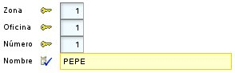\
   Podemos escoger que miembros queremos que aparezcan y en que orden, con el atributo *members*:

   @[**Entity**](http://www.google.com/search?sitesearch=java.sun.com&q=allinurl%3Aj2se%2F1+5+0%2Fdocs%2Fapi+Entity)

   @IdClass(OficinistaKey.**class**)

   @[**View**](http://java.sun.com/j2se/1%2E5%2E0/docs/api/javax/swing/text/View.html)(members="codigoZona; codigoOficina; codigo")

   **public** **class** Oficinista {

 

   En este caso ya no aparece el *nombre* en la vista.\
   También se puede usar *members* para refinar la disposición:

   @[**View**](http://java.sun.com/j2se/1%2E5%2E0/docs/api/javax/swing/text/View.html)(members=

   ` `"codigoZona, codigoOficina, codigo;" +

   ` `"nombre"

   )

 

   Podemos observar como separamos los nombres de miembros con comas y punto y comas, esto nos sirve para indicar la disposición, con la coma el miembro se pone a continuación, y con punto y coma en la línea siguiente, esto es la vista anterior quedaría así:\
   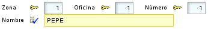
   ### **Grupos**
   Con los grupos podemos agrupar un conjunto de propiedades relacionadas, y esto tiene un efecto visual. Para definir un grupo solo necesitamos poner el nombre del grupo y después sus miembros entre corchetes. Justo de esta forma:

   @[**View**](http://java.sun.com/j2se/1%2E5%2E0/docs/api/javax/swing/text/View.html)(members=

   ` `"id [ codigoZona, codigoOficina, codigo ];" +

   ` `"nombre"

   )

 

   En este caso el resultado sería:\
   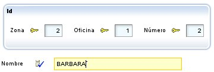\
   Se puede observar como las tres propiedades puestas en el grupo aparecen dentro de un marquito, y como *nombre* aparece fuera. El punto y coma antes de *nombre* es para que aparezca abajo, si no aparecería a continuación.\
   Podemos poner varios grupos en una vista:

   @[**View**](http://java.sun.com/j2se/1%2E5%2E0/docs/api/javax/swing/text/View.html)(members=

   ` `"general [" +

   ` `" codigo;" +

   ` `" tipo;" +

   ` `" nombre;" +

   ` `"]" +

   ` `"contacto [" +

   ` `" telefono;" +

   ` `" correoElectronico;" +

   ` `" sitioWeb;" +

   ` `"]"

   )

   En este caso se visualizaría así:\
   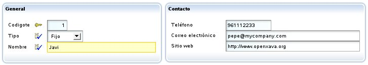\
   Si queremos que aparezca uno debajo del otro debemos poner un punto y coma después del grupo, como sigue:

   @[**View**](http://java.sun.com/j2se/1%2E5%2E0/docs/api/javax/swing/text/View.html)(members=

   ` `"general [" +

   ` `" codigo;" +

   ` `" tipo;" +

   ` `" nombre;" +

   ` `"];" +

   ` `"contacto [" +

   ` `" telefono;" +

   ` `" correoElectronico;" +

   ` `" sitioWeb;" +

   ` `"]"

   )

   En este caso se visualizaría así:\
   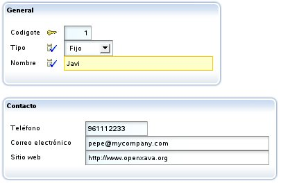\
   Anidar grupos está soportado. Esta interesante característica permite disponer los elementos de la interfaz gráfica de una forma simple y flexible. Por ejemplo, si definimos una vista como ésta:

   @[**View**](http://java.sun.com/j2se/1%2E5%2E0/docs/api/javax/swing/text/View.html)(members=

   ` `"factura;" +

   ` `"datosAlbaran [" +

   ` `" tipo, codigo;" +

   ` `" fecha;" +

   ` `" descripcion;" +

   ` `" envio;" +

   ` `" datosTransporte [" +

   ` `" distancia; vehiculo; modoTransporte; tipoConductor;" +

   ` `" ]" +

   ` `" datosEntregadoPor [" +

   ` `" entregadoPor;" +

   ` `" transportista;" +

   ` `" empleado;" +

   ` `" ]" +

   ` `"]"

   )

   Obtendremos lo siguiente:\
   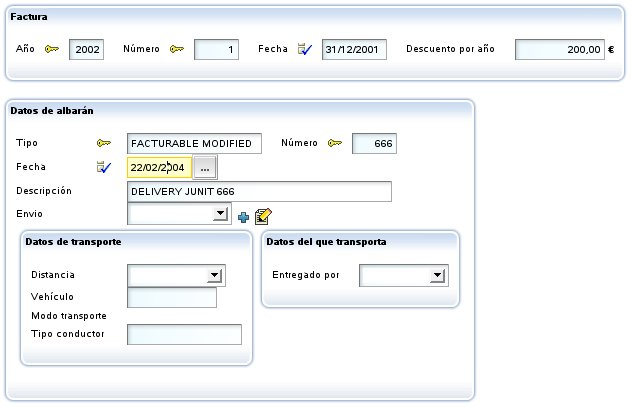\
   A veces es útil distribuir los miembros alineándolos por columnas, como en una tabla. Por ejemplo, la siguiente vista:

   @[**View**](http://java.sun.com/j2se/1%2E5%2E0/docs/api/javax/swing/text/View.html)(name="Amounts", members=

   ` `"año, numero;" +

   ` `"importes [" +

   ` `"descuentoCliente, descuentoTipoCliente, descuentoAño;" +

   ` `"sumaImportes, porcentajeIVA, iva;" +

   ` `"]"

   )

 

   ...será visualizada como sigue:\
   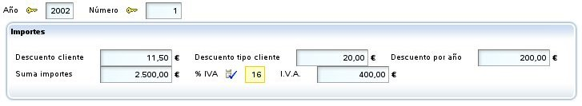\
   Esto es feo. Sería mejor tener la información alineada por columnas. Podemos definir el grupo de esta forma:

   @[**View**](http://java.sun.com/j2se/1%2E5%2E0/docs/api/javax/swing/text/View.html)(name="Amounts", members=

   ` `"año, numero;" +

   ` `"importes [#" +

   ` `"descuentoCliente, descuentoTipoCliente, descuentoAño;" +

   ` `"sumaImportes, porcentajeIVA, iva;" +

   ` `"]"

   )

   Notemos que usamos *[#* en vez de *[*. Ahora obtenemos este resultado:\
   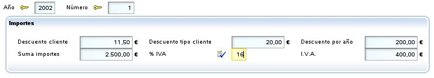\
   Ahora, gracias al *#*, los miembros están alineado por columnas.\
   Esta prestación está disponible también para las secciones (ver abajo) y para *members*, es decir para la vista raíz *(nuevo en v4.7.1)*. Además, si ponemos *alignedByColumns=true (nuevo en v4.7.1)* en *xava.properties* todos los elementos se alinean por columna incluso si no especificamos *#* en la vista.
   ### **Secciones**
   Además de en grupo los miembros se pueden organizar en secciones. Para definir una sección solo necesitamos poner el nombre de la sección y después sus miembros entre llaves. Veamos un ejemplo en la entidad *Factura*:

   @[**View**](http://java.sun.com/j2se/1%2E5%2E0/docs/api/javax/swing/text/View.html)(members=

   ` `"año, numero, fecha, pagada;" +

   ` `"comentario;" +

   ` `"cliente { cliente }" +

   ` `"lineas { lineas }" +

   ` `"importes { sumaImportes; porcentajeIVA; iva }" +

   ` `"albaranes { albaranes }"

   )

   El resultado visual sería:\
   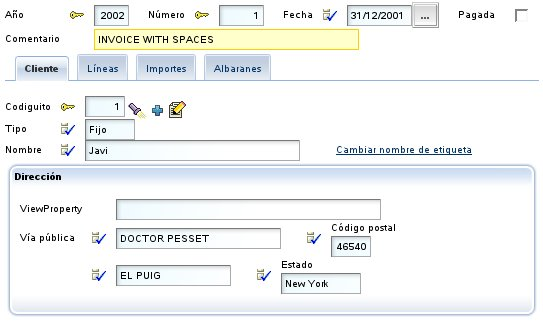\
   Las secciones se convierten en pestañitas que el usuario puede pulsar para ver la información contenida en esa sección. Podemos observar también como en la vista indicamos todo tipo de miembros (y no solo propiedades), así *cliente* es una referencia, *lineas* y *albaranes* son colecciones.\
   Se permiten secciones anidadas. Por ejemplo, podemos definir una vista como ésta:

   @[**View**](http://java.sun.com/j2se/1%2E5%2E0/docs/api/javax/swing/text/View.html)(name="SeccionesAnidadas", members=

   ` `"año, numero, fecha;" +

   ` `"cliente { cliente }" +

   ` `"datos {" +

   ` `" lineas { lineas }" +

   ` `" importes {" +

   ` `" iva { porcentajeIVA; iva }" +

   ` `" sumaImportes { sumaImportes }" +

   ` `" }" +

   ` `"}" +

   ` `"albaranes { albaranes }"

   )

   En este caso podemos obtener una interfaz gráfica como esta:\
   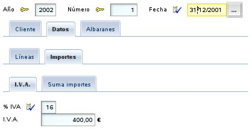\
   Al igual que en los grupos, las secciones permiten usar *#* para conseguir alineado por columnas, así:

   @[**View**](http://java.sun.com/j2se/1%2E5%2E0/docs/api/javax/swing/text/View.html)(name="ImportesAlineadosEnSeccion", members=

   ` `"año, numero;" +

   ` `"cliente { cliente }" +

   ` `"lineas { lineas }" +

   ` `"importes {#" +

   ` `"descuentoCliente, descuentoTipoCliente, descuentoAño;" +

   ` `"sumaImportes, porcentajeIVA, iva;" +

   ` `"}"

   )

   Con el mismo efecto que en el caso de los [grupos](C:\Users\Soporte\Documents\openxava\openxava-doc\web\docs\view_es.html#Vista-Disposicion-Grupos).
   ### **Marcos uno al lado del otro**
   Los miembros que se visualizan dentro de un marco, como es el caso de las referencias, los grupos o las colecciones, se pueden visualizar uno al lado del otro en lugar de uno debajo del otro, si lo deseamos. Es decir, es posible disponer dos marcos en una misma fila. Para esto sólo tenemos que separarlos con coma en lugar de punto y coma, como se puede ver en este ejemplo:

**@View**( members= 

`    `"nombre;" +  

`    `"comercial, comercialAlternativo"

)

En este caso *nombre* es una propiedad plana, pero *comercial* y *comercialAlternativo* son referencias. El resultado visual sería:

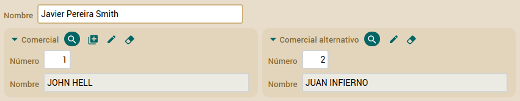

Donde puedes ver que *comercial* y *comercialAlternativo* se visualizan en la misma línea. Esto es así también para colecciones y grupos. Además, se pueden combinar, podemos poner una referencia y un grupo (por ejemplo) en la misma línea.

Lo que no está permitido es colocar en la misma línea miembros que se visualicen con un campo simple, como propiedades o referencia con *@DescriptionsList* y miembros que usen marcos como referencia, grupos y colecciones. En caso de declarlo así en *@View*, OpenXava mostrará los marcos en su propia línea.

Por ejemplo, si tenemos este código:

**@View**( members="nombre, comercial" )

Donde indicamos que *nombre*, que es una propiedad plana, y *comercial*, que es una referencia, se visualicen uno al lado del otro, ya que los separamos por coma. Al visualizarlo, OpenXava acaba haciéndolo así:

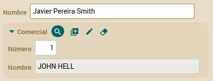

Es decir, uno debajo del otro. OpenXava ha puesto la referencia *comercial* en su propia línea. Vemos como no podemos visualizar campos simples y marcos uno al lado del otro.
### **Herencia de vistas *(nuevo en v3.1.2)***
Al definir una nueva vista podemos heredar los miembros y disposición de una vista ya existente. De esta manera, evitamos copiar y pegar, y al mismo tiempo mantenemos nuestro código breve y fácil de cambiar.\
Esto se hace mediante *extendsView*. Por ejemplo, si tenemos una vista como la siguiente:

@[**View**](http://java.sun.com/j2se/1%2E5%2E0/docs/api/javax/swing/text/View.html)(name="MuySimple", members="nombre, sexo"),

Esto produce la siguiente interfaz de usuario:\
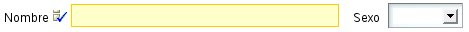\
Si ahora queremos crear una nueva vista que extienda de esta simplemente hemos de escribir:

@[**View**](http://java.sun.com/j2se/1%2E5%2E0/docs/api/javax/swing/text/View.html)(name="Simple", extendsView="MuySimple", members="lenguajePrincipal")

y obtendremos lo siguiente:\
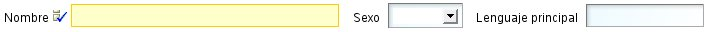\
Como vemos los miembros de la vista *MuySimple* se incluyen automáticamente en la vista *Simple*, y los miembros propios de la vista se añaden al final.\
En este caso estamos extendiendo una vista de la misma entidad, pero también podemos extender una vista de la entidad padre, si que es que estamos usando herencia JPA. Es decir, si tenemos una entidad llamada *Programador*:

@[**Entity**](http://www.google.com/search?sitesearch=java.sun.com&q=allinurl%3Aj2se%2F1+5+0%2Fdocs%2Fapi+Entity)

@[**View**](http://java.sun.com/j2se/1%2E5%2E0/docs/api/javax/swing/text/View.html)(name="ConSecciones",

` `members =

` `"nombre, sexo;" +

` `"lenguajePrincipal;" +

` `"experiencias { experiencias }"

)

**public** **class** Programador {

Podemos reutilizar la vista *ConSecciones* en una clase hija de *Programador*:

@[**Entity**](http://www.google.com/search?sitesearch=java.sun.com&q=allinurl%3Aj2se%2F1+5+0%2Fdocs%2Fapi+Entity)

@[**View**](http://java.sun.com/j2se/1%2E5%2E0/docs/api/javax/swing/text/View.html)(name="ConSecciones", extendsView="super.ConSecciones",

` `members =

` `"marcoTrabajoFavorito;" +

` `"marcosTrabajo { marcosTrabajo }"

)

**public** **class** ProgramadorJava **extends** Programador {

Como podemos ver, la forma de extender una vista de una superclase es usando el prefijo *super* en *extendsView*. En este caso la vista *ConSecciones* de la entidad *ProgramadorJava* tendrá todos los miembros de la vista *ConSecciones* de la entidad *Programador* más los suyos propios.\
Véamos el aspecto de la vista *ConSecciones* de *ProgramadorJava*:\
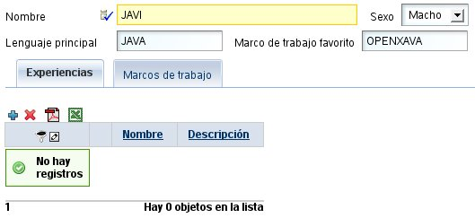\
Si queremos extender la vista por defecto (la vista por defecto es la vista sin nombre) hemos de usar la palabra DEFAULT como nombre en *extendsView*. Como en este ejemplo:

@[**View**](http://java.sun.com/j2se/1%2E5%2E0/docs/api/javax/swing/text/View.html)(members="nombre, sexo; lenguajePrincipal, marcoTrabajoFavorito; experiencias")

@[**View**](http://java.sun.com/j2se/1%2E5%2E0/docs/api/javax/swing/text/View.html)(name="Completa", extendsView="DEFAULT", members = "marcosTrabajo")

La vista *Completa* tendrá todos los miembros de la vista por defecto (*nombre, sexo, lenguajePrincipal, marcoTrabajoFavorito, experiencias*) más *marcosTrabajo*.\
La herencia de vistas solo aplica a los miembros y su distribución. Las acciones, eventos y otros refinamiento a nivel de miembro no se heredan.
### **Disposición adaptable *(nuevo en v5.7)***
Disposición adaptable (*responsive*) significa que la disposición de la interfaz de usuario se adapta al tamaño de la página, así tu aplicación funciona bien en una tableta de 7", un portátil de 15" o en una pantalla de 22", con el mismo código. Para activar la disposición adaptable en OpenXava añade la siguiente entrada en *xava.properties* de tu proyecto:

**flowLayout**=**true**

Después de esto, OpenXava ajusta la disposición de los campos al tamaño de la página. Por ejemplo, a partir de la siguiente *@View*:

@[**View**](http://java.sun.com/j2se/1%2E5%2E0/docs/api/javax/swing/text/View.html)( members=

`    `"#numero, descripcion;" +

`    `"color, fotos;" +

`    `"familia, subfamilia;" +

`    `"almacen, zonaUno;" +

`    `"precioUnitario, precioUnitarioEnPesetas;" +

`    `"precioUnitarioConImpuestos"

)

Con una pantalla pequeña obtendrás:\
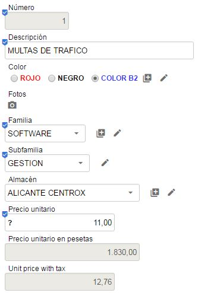\
\
Con una pantalla no tan pequeña obtendrás:\
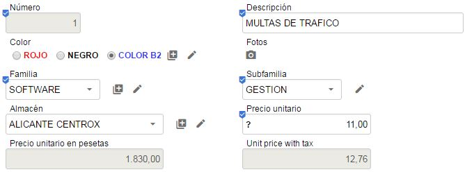\
\
Y con una pantalla un poco más grande:\
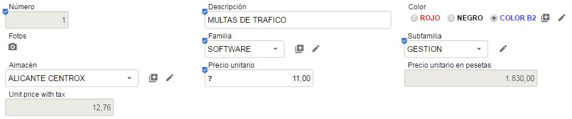\
\
Y así por el estilo. Fíjate como # , y ; de *@View* se ignoran.
### **Filosofía para la disposición**
Es de notar tenemos grupos y no marcos y secciones y no pestañas. Porque en las vistas de OpenXava intentamos mantener un nivel de abstracción alto, es decir, un grupo es un conjunto de propiedades relacionadas semánticamente, y las secciones nos permite dividir la información en partes cuando tenemos mucha y posiblemente no se pueda visualizar toda a la vez, el que los grupos se representen con marquitos y las secciones con pestañas es una cuestión de implementación, pero el generador del interfaz gráfico podría escoger usar un árbol u otro control gráfico para representar las secciones, por ejemplo.
## **Normas para las anotaciones de vista**
Podemos anotar un miembro (propiedad, referencia o colección) con varias anotaciones que refinan su estilo de visualización y comportamiento. Además podemos definir que el efecto de estas anotaciones solo aplica a algunas vistas.\
Por ejemplo, si tenemos una entidad con varias vistas:

@[**Entity**](http://www.google.com/search?sitesearch=java.sun.com&q=allinurl%3Aj2se%2F1+5+0%2Fdocs%2Fapi+Entity)

@[**View**](http://java.sun.com/j2se/1%2E5%2E0/docs/api/javax/swing/text/View.html)( members="codigo; tipo; nombre; direccion" )

@[**View**](http://java.sun.com/j2se/1%2E5%2E0/docs/api/javax/swing/text/View.html)( name="A", members="codigo; tipo; nombre; direccion; comercial" )

@[**View**](http://java.sun.com/j2se/1%2E5%2E0/docs/api/javax/swing/text/View.html)( name="B", members="codigo; tipo; nombre; comercial; comercialAlternativo" )

@[**View**](http://java.sun.com/j2se/1%2E5%2E0/docs/api/javax/swing/text/View.html)( name="C", members="codigo; tipo; nombre; direccion; lugaresEntrega" )

**public** **class** Cliente {

Si usas una versión de OpenXava anterior a la 6.1 has de envolver las vistas con *@Views*:

@[**Entity**](http://www.google.com/search?sitesearch=java.sun.com&q=allinurl%3Aj2se%2F1+5+0%2Fdocs%2Fapi+Entity)

@Views({ // Sólo necesario hasta v6.0.2

`  `@[**View**](http://java.sun.com/j2se/1%2E5%2E0/docs/api/javax/swing/text/View.html)( members="codigo; tipo; nombre; direccion" ),

`  `@[**View**](http://java.sun.com/j2se/1%2E5%2E0/docs/api/javax/swing/text/View.html)( name="A", members="codigo; tipo; nombre; direccion; comercial" ),

`  `@[**View**](http://java.sun.com/j2se/1%2E5%2E0/docs/api/javax/swing/text/View.html)( name="B", members="codigo; tipo; nombre; comercial; comercialAlternativo" ),

`  `@[**View**](http://java.sun.com/j2se/1%2E5%2E0/docs/api/javax/swing/text/View.html)( name="C", members="codigo; tipo; nombre; direccion; lugaresEntrega" )

})

**public** **class** Cliente {

Si ahora queremos que la propiedad *nombre* sea de solo lectura. Podemos anotarlo de esta manera:

@ReadOnly

**private** [**String**](http://java.sun.com/j2se/1%2E5%2E0/docs/api/java/lang/String.html) nombre;

De esta forma *nombre* es de solo lectura en todas las vistas. Ahora bien, puede que queramos que *nombre* sea de solo lectura solo en las vistas B y C, entonces podemos definir el miembro como sigue:

@ReadOnly(forViews="B, C")

**private** [**String**](http://java.sun.com/j2se/1%2E5%2E0/docs/api/java/lang/String.html) nombre;

Otra forma para definir este mismo caso es:

@ReadOnly(notForViews="DEFAULT, A")

**private** [**String**](http://java.sun.com/j2se/1%2E5%2E0/docs/api/java/lang/String.html) nombre;

Usando *notForViews* indicamos las vistas donde la propiedad *nombre* es de solo lectura. DEFAULT se usa para referenciar a la vista por defecto, la vista sin nombre.\
Algunas anotaciones tiene uno o más valores, por ejemplo para indicar que vista del tipo referenciado se usará para visualizar una referencia usamos la anotación *@ReferenceView*:

@ReferenceView("Simple")

**private** Comercial comercial;

En este caso cuando se visualiza el comercial se usa la vista *Simple*, definida en la clase *Comercial*.\
¿Qué ocurre si queremos usar la vista *Simple* de *Comercial* solo en la vista *B* de *Cliente*? Es fácil:

@ReferenceView(forViews="B", value="Simple")

**private** Comercial comercial;

¿Qué ocurre si lo que queremos es usar la vista *Simple* de *Comercial* solo en la vista *B* de *Cliente* y la vista *MuySimple* de *Comercial* para la vista *A* de *Cliente*? En este caso hemos de usar varias *@ReferenceView*:

@ReferenceView(forViews="B", value="Simple"),

@ReferenceView(forViews="A", value="MuySimple")

Si usas una versión anterior a v6.1 debes agrupar las *@ReferenceView* dentro de una *@ReferenceViews*, justo así:

@ReferenceViews({ // Sólo necesario hasta v6.0.2

`  `@ReferenceView(forViews="B", value="Simple"),

`  `@ReferenceView(forViews="A", value="MuySimple")

})

Estas normas aplican a todas las anotaciones de este capítulo, excepto *@View* y *@Views*.
## **Personalización de propiedad**
Podemos refinar la forma de visualización y comportamiento de una propiedad en la vista usando las siguientes anotaciones:

@ReadOnly *// 1*

@LabelFormat *// 2*

@DisplaySize *// 3*

@OnChange *// 4*

@[**Action**](http://java.sun.com/j2se/1%2E5%2E0/docs/api/javax/swing/Action.html) *// 5*

@Editor *// 6*

@LabelStyle *// 7 Nuevo en v4m4*\
@LargeDisplay *// 8 Nuevo en v7.4*\
**private** tipo nombrePropiedad;

Todas estas anotaciones siguen las [normas para anotaciones de vista](C:\Users\Soporte\Documents\openxava\openxava-doc\web\docs\view_es.html#Vista-Normas%20para%20las%20anotaciones%20de%20vista) y todas ellas son opcionales. OpenXava siempre asume valores por defecto correcto si se omiten.

1. **@ReadOnly** ([OX](http://www.openxava.org/OpenXavaDoc/apidocs/org/openxava/annotations/ReadOnly.html)): Si marcas una propiedad con esta anotaciones no será nunca editable por el usuario en esta vista. Una alternativa a esto es hacer la propiedad editable/no editable programáticamente usando [org.openxava.view.View](http://www.openxava.org/OpenXavaDoc/apidocs/org/openxava/view/View.html). Desde v6.2 puedes especificar *@ReadOnly(onCreate=false)* para que la propiedad sea editable al crear una nueva entidad, pero de sólo lectura en el resto de casos.
1. [**@LabelFormat**](C:\Users\Soporte\Documents\openxava\openxava-doc\web\docs\view_es.html#Vista-Personalizacion+de+propiedad-Formato+de+etiqueta) ([OX](http://www.openxava.org/OpenXavaDoc/apidocs/org/openxava/annotations/LabelFormat.html)): Forma en que se visualiza la etiqueta para esta propiedad. Su valor puede ser [*LabelFormatType*](http://www.openxava.org/OpenXavaDoc/apidocs/org/openxava/annotations/LabelFormatType.html)*.NORMAL*, [*LabelFormatType*](http://www.openxava.org/OpenXavaDoc/apidocs/org/openxava/annotations/LabelFormatType.html)*.SMALL* o [*LabelFormatType*](http://www.openxava.org/OpenXavaDoc/apidocs/org/openxava/annotations/LabelFormatType.html)*.NO\_LABEL*.
1. **@DisplaySize** ([OX](http://www.openxava.org/OpenXavaDoc/apidocs/org/openxava/annotations/DisplaySize.html)): La longitud en caracteres del editor en la interfaz de usuario usado para visualizar esta propiedad. El editor mostrará solo los caracteres indicados con longitud-visual pero permite que el usuario introduzca hasta el total de la longitud de la propiedad. Si *@DisplaySize* no se especifica se asume el valor de la longitud de la propiedad.
1. [**@OnChange**](C:\Users\Soporte\Documents\openxava\openxava-doc\web\docs\view_es.html#Vista-Personalizacion+de+propiedad-Evento+de+cambio+de+valor+de+propiedad) ([OX](http://www.openxava.org/OpenXavaDoc/apidocs/org/openxava/annotations/OnChange.html)): Acción a realizar cuando cambia el valor de esta propiedad. Solo una acción *@OnChange* por vista está permitida.
1. [**@Action**](C:\Users\Soporte\Documents\openxava\openxava-doc\web\docs\view_es.html#Vista-Personalizacion+de+propiedad-Acciones+de+la+propiedad) ([OX](http://www.openxava.org/OpenXavaDoc/apidocs/org/openxava/annotations/Action.html)): Acciones (mostradas como vínculos, botones o imágenes al usuario) asociadas (visualmente) a esta propiedad y que el usuario final puede ejecutar. Es posible definir varias *@Action* por cada vista.
1. [**@Editor**](C:\Users\Soporte\Documents\openxava\openxava-doc\web\docs\view_es.html#Vista-Personalizacion+de+propiedad-Escoger+un+editor+%28propiedad%29) ([OX](http://www.openxava.org/OpenXavaDoc/apidocs/org/openxava/annotations/Editor.html)): Nombre del editor a usar para visualizar la propiedad en esta vista. El editor tiene que estar declarado en [*openxava/src/main/resources/xava/default-editors.xml*](https://github.com/openxava/openxava/blob/master/openxava/src/main/resources/xava/default-editors.xml) o *src/main/resources/xava/editores.xml* de nuestro proyecto. Antes de v7 eran *OpenXava/xava/default-editors.xml* y *xava/editores.xml* de nuestro proyecto.
1. **@LabelStyle** ([OX](http://www.openxava.org/OpenXavaDoc/apidocs/org/openxava/annotations/LabelStyle.html)): (*Nuevo en v4m4*): Estilo con el que se visualiza la etiqueta para esta propiedad. Por defecto están definidos los estilos 'bold-label', 'italic-label' y 'reverse-label'; cualquier otro estilo puede ser definido por el propio usuario (basta con incluirlo en un .css).
1. [**@LargeDisplay**](C:\Users\Soporte\Documents\openxava\openxava-doc\web\docs\view_es.html#formato-grande-visualizacion) ([OX](http://www.openxava.org/OpenXavaDoc/apidocs/org/openxava/annotations/LargeDisplay.html)): (*Nuevo en v7.4*): El valor de la propiedad se muestra en un formato grande para hacerlo claramente visible. Generalmente se utiliza una fuente grande, dentro de un marco pequeño con espaciado, etc. Además, permite mostrar un icono, un prefijo y un sufijo opcionalmente.

   Aparte de las anotaciones relacionadas con la vista de arriba puedes anotar tus propiedades con [anotaciones estilo estereotipo](C:\Users\Soporte\Documents\openxava\openxava-doc\web\docs\model_es.html#Modelo-Propiedades-Estereotipo).
   ### **Formato de etiqueta**
   Un ejemplo sencillo para cambiar el formato de la etiqueta ([*@LabelFormat*](http://www.openxava.org/OpenXavaDoc/apidocs/org/openxava/annotations/LabelFormat.html)):

   @LabelFormat(LabelFormatType.SMALL)

   **private** **int** codigoPostal;

   En este caso el código postal lo visualiza así:\
   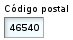\
   El formato [*LabelFormatType*](http://www.openxava.org/OpenXavaDoc/apidocs/org/openxava/annotations/LabelFormatType.html)*.NORMAL* es el que hemos visto hasta ahora (con la etiqueta grande y la izquierda) y el formato [*LabelFormatType*](http://www.openxava.org/OpenXavaDoc/apidocs/org/openxava/annotations/LabelFormatType.html)*.NO\_LABEL* simplemente hace que no salga etiqueta. A partir de v4m4 puedes usar *defaultLabelFormat* en *xava.properties* para especificar el formato a usar cuando se omita *@LabelFormat*.
   ### **Evento de cambio de valor de propiedad**
   Si queremos reaccionar al evento de cambio de valor de una propiedad podemos user [*@OnChange*](http://www.openxava.org/OpenXavaDoc/apidocs/org/openxava/annotations/OnChange.html) como sigue:

   @OnChange(AlCambiarNombreCliente.**class**)

   **private** [**String**](http://java.sun.com/j2se/1%2E5%2E0/docs/api/java/lang/String.html) nombre;

   El código que se ejecutará será:

   **package** org.openxava.test.actions;

 

   **import** org.openxava.actions.\*;

   **import** org.openxava.test.model.\*;

 

   ***/\*\****

   ` `***\* @author Javier Paniza***

   ` `***\*/***

   **public** **class** AlCambiarNombreCliente **extends** OnChangePropertyBaseAction { *// 1*

 

   ` `**public** **void** execute() **throws** [**Exception**](http://java.sun.com/j2se/1%2E5%2E0/docs/api/java/lang/Exception.html) {

   ` `[**String**](http://java.sun.com/j2se/1%2E5%2E0/docs/api/java/lang/String.html) valor = ([**String**](http://java.sun.com/j2se/1%2E5%2E0/docs/api/java/lang/String.html)) getNewValue(); *// 2*

   ` `**if** (valor == **null**) **return**;

   ` `**if** (valor.startsWith("Javi")) {

   ` `getView().setValue("tipo", Cliente.Tipo.FIJO); *// 3*

   ` `}

   ` `}

 

   }

   La acción ha de implementar *IOnChangePropertyAction* aunque es más cómodo hacer que descienda de *OnChangePropertyBaseAction* (1). Dentro de la acción tenemos disponible *getNewValue()* (2) que proporciona el nuevo valor que ha introducido el usuario, y *getView()* (3) que nos permite acceder programáticamente a la vista ([*View*](http://www.openxava.org/OpenXavaDoc/apidocs/org/openxava/view/View.html)) (cambiar valores, ocultar miembros, hacerlos editables, o lo que queramos).
   ### **Acciones de la propiedad**
   También podemos especificar acciones ([*@Action*](http://www.openxava.org/OpenXavaDoc/apidocs/org/openxava/annotations/Action.html)) que el usuario puede pulsar directamente:

   @[**Action**](http://java.sun.com/j2se/1%2E5%2E0/docs/api/javax/swing/Action.html)("Albaran.generarNumero")

   **private** **int** numero;

   En este caso en vez de la clase de la acción se pone un identificador que consiste en el nombre de controlador y nombre de acción. Esta acción ha de estar registrada en *controladores.xml* de la siguiente forma:

   **<controlador** nombre="Albaran"**>**

    ...

   ` `**<accion** nombre="generarNumero" oculta="true"

   ` `clase="org.openxava.test.acciones.GenerarNumeroAlbaran"**>**

   ` `**<usa-objeto** nombre="xava\_view"**/>** *<!-- No obligatorio desde v4m2 -->*

   ` `**</accion>**

    ...

   **</controlador>**

   Las acciones se visualizan con un vínculo o imagen al lado del editor de la propiedad. Como sigue:\
   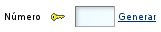\
   Por defecto el vínculo de la acción aparece solo cuando la propiedad es editable, ahora bien si la propiedad es de solo lectura ([*@ReadOnly*](http://www.openxava.org/OpenXavaDoc/apidocs/org/openxava/annotations/ReadOnly.html)) o [calculada](C:\Users\Soporte\Documents\openxava\openxava-doc\web\docs\model_es.html#Modelo-Propiedades-Propiedades%20calculadas) entonces está siempre disponible. Podemos usar el atributo *alwaysEnabled* a *true* para que el vínculo esté siempre presente, incluso si la propiedad no es editable. Como sigue:

   @[**Action**](http://java.sun.com/j2se/1%2E5%2E0/docs/api/javax/swing/Action.html)(value="Albaran.generarNumero", alwaysEnabled=**true**)

   El atributo *alwaysEnabled* es opcional y su valor por defecto es *false*.\
   El código de la acción anterior es:

   **package** org.openxava.test.acciones;

 

   **import** org.openxava.actions.\*;

 

   ***/\*\****

   ` `***\* @author Javier Paniza***

   ` `***\*/***

   **public** **class** GenerarNumeroAlbaran **extends** ViewBaseAction {

 

   ` `**public** **void** execute() **throws** [**Exception**](http://java.sun.com/j2se/1%2E5%2E0/docs/api/java/lang/Exception.html) {

   ` `getView().setValue("numero", **new** [**Integer**](http://java.sun.com/j2se/1%2E5%2E0/docs/api/java/lang/Integer.html)(77));

   ` `}

 

   }

   Una implementación simple pero ilustrativa. Se puede usar cualquier acción definida en *controladores.xml* y su funcionamiento es el normal para una acción OpenXava. En el [capítulo 7](C:\Users\Soporte\Documents\openxava\openxava-doc\web\docs\controllers_es.html) veremos más detalles sobre los controladores.\
   Opcionalmente podemos hacer nuestra acción una [*IPropertyAction*](http://www.openxava.org/OpenXavaDoc/apidocs/org/openxava/actions/IPropertyAction.html) (esto está disponible solo para acciones usadas en *@Action* de propiedades, the esta forma la vista contenedora y el nombre de la propiedad son inyectados en la acción por OpenXava. La clase de la acción anterior se podría reescribir así:

   **package** org.openxava.test.acciones;

 

   **import** org.openxava.actions.\*;

   **import** org.openxava.view.\*;

 

   ***/\*\****

   ` `***\* @author Javier Paniza***

   ` `***\*/***

   **public** **class** GenerarNumeroAlbaran

   ` `**extends** BaseAction

   ` `**implements** IPropertyAction { *// 1*

   ` `**private** [**View**](http://java.sun.com/j2se/1%2E5%2E0/docs/api/javax/swing/text/View.html) view;

   ` `**private** [**String**](http://java.sun.com/j2se/1%2E5%2E0/docs/api/java/lang/String.html) property;

 

   ` `**public** **void** execute() **throws** [**Exception**](http://java.sun.com/j2se/1%2E5%2E0/docs/api/java/lang/Exception.html) {

   ` `view.setValue(property, **new** [**Integer**](http://java.sun.com/j2se/1%2E5%2E0/docs/api/java/lang/Integer.html)(77)); *// 2*

   ` `}

 

   ` `**public** **void** setProperty([**String**](http://java.sun.com/j2se/1%2E5%2E0/docs/api/java/lang/String.html) property) { *// 3*

   ` `**this**.property = property;

   ` `}

   ` `**public** **void** setView([**View**](http://java.sun.com/j2se/1%2E5%2E0/docs/api/javax/swing/text/View.html) view) { *// 4*

   ` `**this**.view = view;

   ` `}

   }

   Esta acción implementa *IPropertyAction* (1), esto requiere que la clase tenga los métodos *setProperty()* (3) y *setView()* (4), estos valores serán inyectados en la acción antes de llamar al método *execute()*, donde pueden ser usados (2). En este caso no necesitas inyectar el objeto *xava\_view* al definir la acción en *controladores.xml*. La vista inyectada por *setView()* (4) es la vista más interna que contiene la propiedad, por ejemplo, si la propiedad está dentro de un agregado es la vista de ese agregado, no la vista principal del módulo. De esta manera podemos escribir acciones más reutilizables.
   ### **Escoger un editor (propiedad)**
   Un editor visualiza la propiedad al usuario y le permite editar su valor. OpenXava usa por defecto el editor asociado al estereotipo o tipo de la propiedad, pero podemos especificar un editor concreto para visualizar una propiedad usando [*@Editor*](http://www.openxava.org/OpenXavaDoc/apidocs/org/openxava/annotations/Editor.html).\
   Por ejemplo, OpenXava usa un combo para editar las propiedades de tipo *enum*, pero si queremos visualizar una propiedad de este tipo en alguna vista concreta usando un radio button podemos definir esa vista de esta forma:

   @Editor(forViews="TipoConRadioButton", value="ValidValuesRadioButton")

   **private** Tipo tipo;

   **public** **enum** Tipo { NORMAL, FIJO, ESPECIAL };

   En este caso para visualizar/editar se usará el editor *ValidValuesRadioButton*, en lugar de del editor por defecto. *ValidValuesRadioButton* está definido en [*openxava/src/main/resources/xava/default-editors.xml*](https://github.com/openxava/openxava/blob/master/openxava/src/main/resources/xava/default-editors.xml) (*OpenXava/xava/default-editors.xml* para v6 o anterior) como sigue:

   **<editor** name="ValidValuesRadioButton" url="radioButtonEditor.jsp"**/>**

   Este editor está incluido con OpenXava, pero nosotros podemos crear nuestro propios editores con nuestro propios JSPs y declararlos en el archivo *editores.xml* en *src/main/resources/xava* (simplemente *xava* en v6 o anterior) de nuestro proyecto.\
   Esta característica es para cambiar el editor solo en una vista. Si lo que se pretende es cambiar el editor para un estereotipo, tipo o una propiedad de un modelo a nivel de aplicación entonces lo mejor es configurarlo usando el archivo *editores.xml*.
   ### **Combos dinámicos *(nuevo en v5.8)***
   Para un combo con una lista estática de valores podemos usar una propiedad de tipo *enum*. Para un combo que obtenga los datos de la base de datos podemos usar una referencia con *@DescriptionsList*. Si queremos cualquier otra cosa a partir de v5.8 tenemos algunos métodos en la clase *org.openxava.view.View* que nos permiten crear listas desplegables usando nuestra propia lógica a partir de cualquier propiedad. Por ejemplo, para una propiedad simple como esta:

   **private** String color;

   Podemos añadir un combo por código de esta manera:

   getView().addValidValue("color", "blc", "Blanco");

   getView().addValidValue("color", "ngr", "Negro");

   Esto crea un combo para la propiedad *color* con dos valores *blc* con la etiqueta *Blanco* y *ngr* con la etiqueta *Negro*. Aparte de [*addValidValue()*](http://www.openxava.org/OpenXavaDoc/apidocs/org/openxava/view/View.html#addValidValue%28java.lang.String,%20java.lang.Object,%20java.lang.String%29), contamos con [*removeValidValue()*](http://www.openxava.org/OpenXavaDoc/apidocs/org/openxava/view/View.html#removeValidValue%28java.lang.String,%20java.lang.Object%29) y [*getValidValues()*](http://www.openxava.org/OpenXavaDoc/apidocs/org/openxava/view/View.html#getValidValues%28java.lang.String%29). A partir de v6.3 también tienes [*clearValidValues()*](http://www.openxava.org/OpenXavaDoc/apidocs/org/openxava/view/View.html#clearValidValues%28java.lang.String%29), [*disableValidValues()*](http://www.openxava.org/OpenXavaDoc/apidocs/org/openxava/view/View.html#disableValidValues%28java.lang.String%29), [*removeBlankValidValue()*](http://www.openxava.org/OpenXavaDoc/apidocs/org/openxava/view/View.html#removeBlankValidValue%28java.lang.String%29) y [*hasBlankValidValue()*](http://www.openxava.org/OpenXavaDoc/apidocs/org/openxava/view/View.html#hasBlankValidValue%28java.lang.String%29). Desde v7.1 puedes seleccionar y editar la opción elegida o ingresar un nuevo valor directamente usando el editor *EditableValidValues*, por ejemplo:

   @Editor("EditableValidValues")\
   @Column(length = 15)\
   **private** String color;

   En este ejemplo seleccionando *Blanco*, puedes editarlo por *Blanco beige* o ingresar un nuevo valor como *Amarillo*. Estos nuevos valores no se agregarán a la lista original de opciones para el uso en otros registros.\
   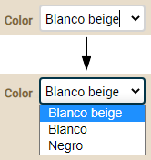
   ### **Formato grande de visualización *(nuevo en v7.4)***
   Es posible hacer que el valor de una propiedad se visualice con un tamaño grande. Así podemos resaltar la propiedad en la vista o hacer una vista estilo cuadro de mandos donde todos los datos tienen formato grande.

   Solo has de anotar tus propiedades con [*@LargeDisplay*](https://openxava.org/OpenXavaDoc/apidocs/org/openxava/annotations/LargeDisplay.html), de esta forma:

**@LargeDisplay** 

**int** anyo;

**@Money** **@LargeDisplay** 

BigDecimal descuento;

Lo que se visualizara así:

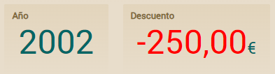

Fíjate como en el caso de la propiedad *descuento* el valor aparece en rojo, esto es porque los valores negativos salen en rojo (este color se puede cambiar vía CSS). Además, nota como tiene como sufijo el símbolo del euro, esto es porque la propiedad está anotada con *@Money,* en ese caso saca el símbolo de la móneda como prefijo o sufijo según el locale del servidor.

También tenemos la opción de especificar nosotros que sufijo o prefijo queremos, con los atributos *prefix* y *suffix*:

**@LargeDisplay**(prefix="€") 

BigDecimal sumaImportes;

**@LargeDisplay**(suffix="%", icon="label-percent-outline") 

BigDecimal porcentajeIVA;

Que se visualizaría:

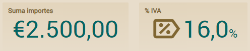

Ahora el símbolo del euro aparece como prefijo de forma fija, no importa que la propiedad esté o no anotada con *@Money*. Y un detalle más, se visualiza un icono en la propiedad *porcentajeIVA*, esto lo hemos conseguido con *icon="label-percent-outline"*. Los iconos son identificadores de [Material Design Icons](https://pictogrammers.com/library/mdi/).

Como ocurre con todos los elementos visuales de OpenXava, puedes cambiar el estilo del formato grande de visualización (*@LargeDisplay*), como el tamaño de la letra, espaciado, etc. usando CSS. Las clases CSS disponibles son *.ox-large-display, .ox-large-display-suffix, .ox-large-display-negative, .ox-large-display-value* o *.ox-large-display i* para el icono. Para los colores puedes cambiar los valores de las variables *--large-display-color, --large-display-negative-color* y *--large-display-icon-color*. El código CSS lo pueddes incluir en *custom.css* o en tu propio estilo como se explica en la [documentación sobre el estilo visual personalizado](C:\Users\Soporte\Documents\openxava\openxava-doc\web\docs\custom-style_es.html).
## **Personalización de referencia**
Podemos refinar la forma de visualización y comportamiento de una referencia en la vista usando las siguientes anotaciones:

@ReferenceView       *// 1*

@ReadOnly            *// 2*

@NoFrame             *// 3*

@NoCreate            *// 4*

@NoModify            *// 5*

@NoSearch            *// 6*

@AsEmbedded          *// 7*

@SearchAction        *// 8*

@SearchListCondition *// 9 Nuevo en v4m4*

@DescriptionsList    *// 10*

@LabelFormat         *// 11*

@[**Action**](http://java.sun.com/j2se/1%2E5%2E0/docs/api/javax/swing/Action.html)              *// 12*

@OnChange            *// 13*

@OnChangeSearch      *// 14*

@Editor              *// 15 Nuevo en v3.1.3*

@LabelStyle          *// 16 Nuevo en v4m4*

@Collapsed           *// 17 Nuevo en v5.0*\
@SearchListTab       *// 18 Nuevo en v7.4*

@ManyToOne

**private** tipo nombreReferencia;

Todas estas anotaciones siguen las [normas para anotaciones de vista](C:\Users\Soporte\Documents\openxava\openxava-doc\web\docs\view_es.html#Vista-Normas%20para%20las%20anotaciones%20de%20vista) y todas ellas son opcionales. OpenXava siempre asume valores por defecto correcto si se omiten.

1. [**@ReferenceView**](C:\Users\Soporte\Documents\openxava\openxava-doc\web\docs\view_es.html#Vista-Personalizacion+de+referencia-Escoger+vista) ([OX](http://www.openxava.org/OpenXavaDoc/apidocs/org/openxava/annotations/ReferenceView.html)): Si omitimos esta anotación usa la vista por defecto del objeto referenciado para visualizarlo, con este anotación podemos indicar que use otra vista.
1. **@ReadOnly** ([OX](http://www.openxava.org/OpenXavaDoc/apidocs/org/openxava/annotations/ReadOnly.html)): Si usamos esta anotación esta referencia no será nunca editable por el usuario en esta vista. Una alternativa a esto es hacer la propiedad editable/no editable programáticamente usando [org.openxava.view.View](http://www.openxava.org/OpenXavaDoc/apidocs/org/openxava/view/View.html). Desde v6.2 puedes especificar *@ReadOnly(onCreate=false)* para que la referencia sea editable al crear una nueva entidad, pero de sólo lectura en el resto de casos.
1. [**@NoFrame**](C:\Users\Soporte\Documents\openxava\openxava-doc\web\docs\view_es.html#Vista-Personalizacion+de+referencia-Personalizar+el+enmarcado) ([OX](http://www.openxava.org/OpenXavaDoc/apidocs/org/openxava/annotations/NoFrame.html)): El dibujador de la interfaz gráfica usa un marco para envolver todos los datos de la referencia. Con esta anotación se puede indicar que no se use ese marco.
1. **@NoCreate** ([OX](http://www.openxava.org/OpenXavaDoc/apidocs/org/openxava/annotations/NoCreate.html)): Por defecto el usuario tiene opción para crear un nuevo objeto del tipo referenciado. Con esta anotación anulamos esta posibilidad.
1. **@NoModify** ([OX](http://www.openxava.org/OpenXavaDoc/apidocs/org/openxava/annotations/NoModify.html)): Por defecto el usuario tiene opción para modificar el objeto actualmente referenciado. Con esta anotación anulamos esta posibilidad.
1. **@NoSearch** ([OX](http://www.openxava.org/OpenXavaDoc/apidocs/org/openxava/annotations/NoSearch.html)): Por defecto el usuario tiene un vínculo para poder realizar búsquedas con una lista, filtros, etc. Con esta anotación anulamos esta posibilidad.
1. **@AsEmbedded** ([OX](http://www.openxava.org/OpenXavaDoc/apidocs/org/openxava/annotations/AsEmbedded.html)): Por defecto en el caso de una referencia a una clase [incrustable](C:\Users\Soporte\Documents\openxava\openxava-doc\web\docs\model_es.html#Modelo-Referencias-Referencias%20incrustadas) el usuario puede crear y editar sus datos, mientras que en el caso de una referencia a una entidad el usuario escoge una entidad existente. Si ponemos *@AsEmbedded* entonce la interfaz de usuario para referencias a entidad se comporta como en el caso de los incrustados, permitiendo al usuario crear un nuevo objeto y editar sus datos directamente. No tiene efecto en el caso de una referencia a un objeto incrustado. ¡Ojo! Si borramos una entidad sus entidades referenciadas no se borran, incluso si estamos usando *@AsEmbedded*.
1. [**@SearchAction**](C:\Users\Soporte\Documents\openxava\openxava-doc\web\docs\view_es.html#Vista-Personalizacion+de+referencia-Accion+de+busqueda+propia) ([OX](http://www.openxava.org/OpenXavaDoc/apidocs/org/openxava/annotations/SearchAction.html)): Nos permite especificar nuestra propia acción de búsqueda cuando se pulsa al vínculo de buscar. Solo es posible una por vista.
1. [**@SearchListCondition**](C:\Users\Soporte\Documents\openxava\openxava-doc\web\docs\view_es.html#Vista-Personalizacion+de+referencia-Condicion+para+la+lista+de+busqueda+%28referencia,+nuevo+en+v4m4%29) ([OX](http://www.openxava.org/OpenXavaDoc/apidocs/org/openxava/annotations/SearchListCondition.html)): *(Nuevo en v4m4)* Condición a usar para la lista de elementos seleccionable susceptibles de ser asignados a la referencia.
1. [**@DescriptionsList**](C:\Users\Soporte\Documents\openxava\openxava-doc\web\docs\view_es.html#Vista-Personalizacion+de+referencia-Lista+descripciones+%28combos%29) ([OX](http://www.openxava.org/OpenXavaDoc/apidocs/org/openxava/annotations/DescriptionsList.html)): Permite visualizar los datos como una lista descripciones, típicamente un combo. Práctico cuando hay pocos elementos del objeto referenciado.
1. **@LabelFormat** ([OX](http://www.openxava.org/OpenXavaDoc/apidocs/org/openxava/annotations/LabelFormat.html)): Formato de la etiqueta de la referencia. Solo aplica si esta referencia se ha anotado con *@DescriptionsList*. Funciona como en [el caso de las propiedades](C:\Users\Soporte\Documents\openxava\openxava-doc\web\docs\view_es.html#Vista-Personalizacion+de+propiedad-Formato+de+etiqueta).
1. **@Action** ([OX](http://www.openxava.org/OpenXavaDoc/apidocs/org/openxava/annotations/Action.html)): Acciones (mostradas como vínculos, botones o imágenes al usuario) asociadas (visualmente) a esta referencia y que el usuario final puede ejecutar. Funciona como en [el caso de las propiedades](C:\Users\Soporte\Documents\openxava\openxava-doc\web\docs\view_es.html#Vista-Personalizacion+de+propiedad-Acciones+de+la+propiedad). Podemos definir varias acciones a la misma referencia en una vista.
1. [**@OnChange**](C:\Users\Soporte\Documents\openxava\openxava-doc\web\docs\view_es.html#Vista-Personalizacion+de+referencia-Evento+de+cambio+de+valor+de+referencia) ([OX](http://www.openxava.org/OpenXavaDoc/apidocs/org/openxava/annotations/OnChange.html)): Acción a realizar cuando cambia el valor de esta propiedad. Solo una acción *@OnChange* por vista está permitida.
1. [**@OnChangeSearch**](C:\Users\Soporte\Documents\openxava\openxava-doc\web\docs\view_es.html#Vista-Personalizacion+de+referencia-Busqueda+de+referencia+al+cambiar) ([OX](http://www.openxava.org/OpenXavaDoc/apidocs/org/openxava/annotations/OnChangeSearch.html)): Nos permite especificar nuestra propia acción de búsqueda cuando el usuario teclea una clave nueva. Solo es posible una por vista.
1. [**@Editor**](C:\Users\Soporte\Documents\openxava\openxava-doc\web\docs\view_es.html#Vista-Personalizacion+de+referencia-Escoger+un+editor+%28referencia,+nuevo+in+v3.1.3%29) ([OX](http://www.openxava.org/OpenXavaDoc/apidocs/org/openxava/annotations/Editor.html)): *(Nuevo en v3.1.3)* Nombre del editor a usar para visualizar la referencia en esta vista. El editor tiene que estar declarado en [*openxava/src/main/resources/xava/default-editors.xml*](https://github.com/openxava/openxava/blob/master/openxava/src/main/resources/xava/default-editors.xml) o *src/main/resources/xava/editores.xml* de nuestro proyecto. Antes de v7 eran *OpenXava/xava/default-editors.xml* y *xava/editores.xml* de nuestro proyecto.
1. **@LabelStyle** ([OX](http://www.openxava.org/OpenXavaDoc/apidocs/org/openxava/annotations/LabelStyle.html)): (*Nuevo en v4m4*): Estilo de la etiqueta de la referencia. Solo aplica si esta referencia se ha anotado con *@DescriptionsList*. Funciona como en [el caso de las propiedades](C:\Users\Soporte\Documents\openxava\openxava-doc\web\docs\view_es.html#Vista-Personalizacion+de+propiedad-Formato+de+etiqueta).
1. **@Collapsed** ([OX](http://www.openxava.org/OpenXavaDoc/apidocs/org/openxava/annotations/Collapsed.html)): *(Nuevo en v5.0)* La referencia se mostrará contraída para las vistas indicadas. Visualmente significa que el marco que rodea a la vista de la referencia se iniciará cerrado. Más tarde el usuario podrá establecer sus preferencias haciendo clic en el icono de expansión.
1. [**@SearchListTab**](C:\Users\Soporte\Documents\openxava\openxava-doc\web\docs\view_es.html#escoger-tab-para-accion-de-busqueda-referencias) ([OX](http://www.openxava.org/OpenXavaDoc/apidocs/org/openxava/annotations/SearchListTab.html)): *(Nuevo en v7.4)* Definimos el tab a mostrar en la lista cuando se hace una busqueda. Si omitimos esta anotación, al realizar una búsqueda se mostrará el tab por defecto.

   Si no usamos ninguna de estas anotaciones OpenXava dibuja la referencia usando su vista por defecto. Por ejemplo si tenemos una referencia así:

   @ManyToOne

   **private** Familia familia;

   La interfaz gráfica tendrá el siguiente aspecto:\
   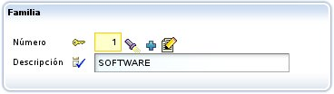
   ### **Escoger vista**
   La modificación más sencilla sería especificar que vista del objeto referenciado queremos usar. Esto se hace mediante [*@ReferenceView*](http://www.openxava.org/OpenXavaDoc/apidocs/org/openxava/annotations/ReferenceView.html):

   @ManyToOne(fetch=FetchType.LAZY)

   @ReferenceView("Simple")

   **private** Factura factura;

   Para esto en el componente *Factura* tenemos que tener una vista llamada simple:

   @[**Entity**](http://www.google.com/search?sitesearch=java.sun.com&q=allinurl%3Aj2se%2F1+5+0%2Fdocs%2Fapi+Entity)

   @Views({

    ...

   ` `@[**View**](http://java.sun.com/j2se/1%2E5%2E0/docs/api/javax/swing/text/View.html)(name="Simple", members="año, numero, fecha, descuentoAño;"),

    ...

   })

   **public** **class** Factura {

   Y así en lugar de usar la vista de la *Factura* por defecto, que supuestamente sacará toda la información, visualizará ésta:\
   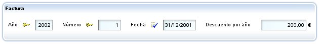
   ### **Personalizar el enmarcado**
   Si combinamos [*@NoFrame*](http://www.openxava.org/OpenXavaDoc/apidocs/org/openxava/annotations/NoFrame.html) con un grupo podemos agrupar visualmente una propiedad que no forma parte de la referencia, por ejemplo:

   @[**View**](http://java.sun.com/j2se/1%2E5%2E0/docs/api/javax/swing/text/View.html)( members=

    ...

   ` `"comercial [" +

   ` `" comercial; " +

   ` `" relacionConComercial;" +

   ` `"]" +

    ...

   )

   **public** **class** Cliente {

    ...

   ` `@ManyToOne(fetch=FetchType.LAZY)

   ` `@NoFrame

   ` `**private** Comercial comercial;

    ...

   }

   Así obtendríamos:\
   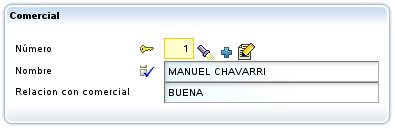
   ### **Acción de búsqueda propia**
   El usuario puede buscar un nuevo valor para la referencia simplemente tecleando el código y al salir del editor recupera el valor correspondiente; por ejemplo, si el usuario teclea "1" en el campo del código de comercial, el nombre (y demás datos) del comercial "1" serán automaticamente rellenados. También podemos pulsar la linternita, en ese caso vamos a una lista en donde podemos filtrar, ordenar, etc, y marcar el objeto deseado.\
   Para definir nuestra propia rutina de búsqueda podemos usar [*@SearchAction*](http://www.openxava.org/OpenXavaDoc/apidocs/org/openxava/annotations/SearchAction.html), como sigue:

   @ManyToOne(fetch=FetchType.LAZY) @SearchAction("MiReferencia.buscar")

   **private** Comercial comercial;

   Ahora al pulsar la linternita ejecuta nuestra acción, la cual tenemos que tener definida en *controladores.xml*:

   **<controlador** nombre="MiReferencia"**>**

   ` `**<accion** nombre="buscar" oculta="true"

   ` `clase="org.openxava.test.acciones.MiAccionBuscar"

   ` `imagen="images/search.gif"**>**

   ` `**<usa-objeto** nombre="xava\_view"**/>** *<!-- No obligatorio desde v4m2 -->*

   ` `**<usa-objeto** nombre="xava\_referenceSubview"**/>** *<!-- No obligatorio desde v4m2 -->*

   ` `**<usa-objeto** nombre="xava\_tab"**/>** *<!-- No obligatorio desde v4m2 -->*

   ` `**<usa-objeto** nombre="xava\_currentReferenceLabel"**/>** *<!-- No obligatorio desde v4m2 -->*

   ` `**</accion>**

    ...

   **</controlador>**

   Lo que hagamos en *MiAccionBuscar* ya es cosa nuestra. Podemos, por ejemplo, refinar la acción por defecto de busqueda para filtrar la lista usada para buscar, como sigue:

   **package** org.openxava.test.acciones;

 

   **import** org.openxava.actions.\*;

 

   ***/\*\****

   ` `***\* @author Javier Paniza***

   ` `***\*/***

 

   **public** **class** MiAccionBuscar **extends** ReferenceSearchAction {

 

   ` `**public** **void** execute() **throws** [**Exception**](http://java.sun.com/j2se/1%2E5%2E0/docs/api/java/lang/Exception.html) {

   ` `**super**.execute(); *// El comportamiento por defecto para buscar*

   ` `getTab().setBaseCondition("${codigo} < 3"); *// Añadir un filtro a la lista*

   ` `}

 

   }

   Veremos más acerca de las acciones en el [capítulo 7](C:\Users\Soporte\Documents\openxava\openxava-doc\web\docs\controllers_es.html).
   ### **Condición para la lista de búsqueda (referencia, *nuevo en v4m4*)**
   Cuando el usuario pulsa la linternita va a una lista donde puede filtrar, ordenar, etc, y marca el objeto deseado. Puedes usar *@SearchAction* para sobreescribir completamente este comportamiento, aunque si solo quieres establecer una condición propia, es más práctico usar [*@SearchListCondition*](http://www.openxava.org/OpenXavaDoc/apidocs/org/openxava/annotations/SearchListCondition.html). Desde *v7.4* la condición soporta el uso de *${this.}* para referenciar una propiedad de la entidad misma. El ejemplo anterior se puede reescribir como sigue:

   **private** int numero;\
\
   @ManyToOne(fetch=FetchType.LAZY) \
   @SearchListCondition("${codigo} < 3")\
   @SearchListCondition("${codigo} < ${this.numero}", forViews="SearchListCondition") *// ${this.} Nuevo en v7.4*

   **private** Comercial comercial;

   Fíjate como no necesitas crear ninguna acción.
   ### **Acción de creación propia**
   Si no hemos puesto [*@NoCreate*](http://www.openxava.org/OpenXavaDoc/apidocs/org/openxava/annotations/NoCreate.html) el usuario tendrá un vínculo para poder crear un nuevo objeto desde la referencia. Es el icono con un + que hemos marcado en rojo:

   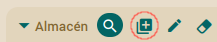

   La anotación ***@NewAction*** de las colecciones **no funciona** con las referencias, por lo que no podemos definir un comportamiento propio para la acción de creación en una referencia concreta. Es decir, esto no se puede hacer:

   *// @NewAction("Transportista.crearAlmacen")  // NO PERMITIDO*

   **@ManyToOne**

   Almacen almacenPrincipal;

   OpenXava siempre sacará un diálogo con la vista por defecto del componente referenciado y permitirá introducir valores y pulsar un botón para crearlo. Así:

   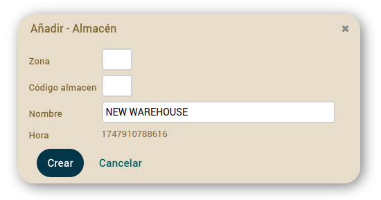

   Pero sí que podemos personalizar como funciona este diálogo de creación, para todas las referencia a *Almacen* en nuestra aplicación. Para esto hemos de crear un controlador llamado como la entidad con el sufijo *Creation* (*AlmacenCreation, ClienteCreation, ProductoCreation*, etc). Si OpenXava ve que existe un controlador así lo usa en vez del de por defecto para permitir crear un nuevo objeto desde una referencia. Por ejemplo, podemos poner en nuestro *controladores.xml*:

*<!--*

*Dado que su nombre es AlmacenCreation (nombre modelo + Creation) es usado*

*por defecto para crear desde referencia, en lugar de NewCreation.*

*La acción 'new' se ejecuta automáticamente.*

*-->*

<controlador nombre="AlmacenCreation">

`    `<hereda-de controlador="NewCreation"/>

`    `<accion nombre="new" oculta="true"

`        `clase="org.openxava.test.acciones.CrearNuevoAlmacenDesdeReferencia"/>

`    `<accion nombre="saveNew" por-defecto="casi-siempre"

`        `clase="org.openxava.test.acciones.GuardarNuevoAlmacenDesdeReferencia"/>	

</controlador>

En este caso cuando en una referencia a *Almacen* pulsemos el icono para crear, se mostrará un diálogo para crear un *Almacen* como el de arriba, pero en lugar de usar las acciones por defecto usará las acciones en *AlmacenCreation*.\
Sí tenemos una acción *new*, ésta se ejecuta automáticamente justo después de abrir el diálogo, la podemos usar para iniciar la vista si lo necesitamos. La definimos como oculta, para que no se muestre como un botón al usuario. Este sería un ejemplo de implementación:

**package** org.openxava.test.acciones;

**import** org.openxava.actions.\*;

**public** **class** **CrearNuevoAlmacenDesdeReferencia** **extends** **NewAction** {

`    `**@Override**

`    `**public** **void** **execute**() **throws** Exception {		

`        `**super**.execute();

`        `getView().setValue("nombre", "NUEVO ALMACEN");

`    `}

}

En este caso, lo que hace es poner un valor por defecto al nombre, pero podemos hacer cosas más complejas como ocultar campos, usar otra vista diferente para el diálogo, etc. Fíjate en el detalle de que no llama a *showDialog()* porque cuando se ejecuta la acción *new* OpenXava ya ha abierto el diálogo.

En nuestro ejemplo también hemos sobreescrito la acción *saveNew*, que es la que se ejecuta al pulsar el botón *Crear* del diálogo. Esto sería un ejemplo de implementación:

**package** org.openxava.test.acciones;

**import** org.openxava.actions.\*;

**public** **class** **GuardarNuevoAlmacenDesdeReferencia** **extends** **SaveNewAction** {

`    `**@Override**

`    `**public** **void** **execute**() **throws** Exception {

`        `String nombre = getView().getValueString("nombre"); *// Obtener nombre antes de cerrar el diálogo*

`        `**super**.execute(); *// Guarda el almacén y cierra el diálogo (si no hay errores de validación)*

`        `**if** (!getErrors().contains() && nombre.equals("NUEVO ALMACEN")) {

`            `addWarning("almacen\_creado\_usando\_nombre\_por\_defecto"); *// Mensaje en archivo de mensajes i18n*  

`        `}

`    `}

}

Es también una lógica muy simple. Si detecta que hemos grabado usando el valor por defecto para el nombre, visualiza un mensaje de advertencia.

No es necesario sobreescribir las dos, podemos implementar solo *new* o solo *saveNew*. También podemos sobreescribir la acción *cancel* si lo necesitamos. Además, si ponemos acciones extra en nuestro controlador *AlmacenCreation*, estas acciones aparecerán como botones adicionales en el diálogo de creación.
### **Acción de modificación propia**
Si no hemos puesto [*@NoModify*](http://www.openxava.org/OpenXavaDoc/apidocs/org/openxava/annotations/NoModify.html)* el usuario tendrá un vínculo para poder modificar el objeto actualmente visualizado en la referencia. Es el icono con un lápiz que hemos marcado en rojo:

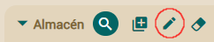

La anotación ***@EditAction*** de las colecciones **no funciona** con las referencias, por lo que no podemos definir un comportamiento propio para la acción de modificación en una referencia concreta. Es decir, esto no se puede hacer:

*// @EditAction("Transportista.modificarAlmacen")  // NO PERMITIDO*

**@ManyToOne**

Almacen almacenPrincipal;

OpenXava siempre sacará un diálogo con la vista por defecto del componente referenciado y permitirá introducir valores y pulsar un botón para modificar los valores actuales. Así:

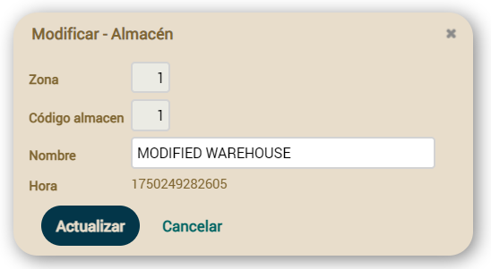

Pero sí que podemos personalizar como funciona este diálogo de modificación, para todas las referencia a *Almacen* en nuestra aplicación. Para esto hemos de crear un controlador llamado como la entidad con el sufijo *Modification* (*AlmacenModification, ClienteModification, ProductoModification*, etc). Si OpenXava ve que existe un controlador así lo usa en vez del de por defecto para permitir modificar un objeto existente desde una referencia. Por ejemplo, podemos poner en nuestro *controladores.xml*:

*<!--* 

*Dado que su nombre es AlmacenModification (nombre modelo + Modification) es usado*

*por defecto para modificar desde referencia, en lugar de Modification.*

*La acción 'search' se ejecuta automáticamente.*

*-->*

<controlador nombre="WarehouseModification">

`    `<hereda-de controlador="Modification"/>

`    `<accion nombre="search" oculta="true"

`        `clase="org.openxava.test.acciones.ModificarAlmacenDesdeReferencia"/>

`    `<accion nombre="update" por-defecto="casi-siempre"

`        `clase="org.openxava.test.acciones.ActualizarAlmacenDesdeReferencia"/>			

</controlador>

En este caso cuando en una referencia a *Almacen* pulsemos el icono para modificar, se mostrará un diálogo para modificar un *Almacen* como el de arriba, pero en lugar de usar las acciones por defecto usará las acciones en *AlmacenModification*.\
Sí tenemos una acción *search*, ésta se ejecuta automáticamente justo después de abrir el diálogo, la podemos usar para iniciar la vista si lo necesitamos. La definimos como oculta, para que no se muestre como un botón al usuario. Este sería un ejemplo de implementación:

**package** org.openxava.test.acciones;

**import** org.openxava.actions.\*;

**public** **class** **ModificarAlmacenDesdeReferencia** **extends** **SearchByViewKeyAction** {

`    `**public** **void** **execute**() **throws** Exception {		

`        `**super**.execute();		

`        `getView().setValue("nombre", "ALMACÉN MODIFICADO");

`    `}

}

En este caso, lo que hace es poner un valor por defecto al nombre, pero podemos hacer cosas más complejas como ocultar campos, usar otra vista diferente para el diálogo, etc. Fíjate en el detalle de que no llama a *showDialog()* porque cuando se ejecuta la acción *search* OpenXava ya ha abierto el diálogo.

En nuestro ejemplo también hemos sobreescrito la acción *update*, que es la que se ejecuta al pulsar el botón *Actualizar* del diálogo. Esto sería un ejemplo de implementación:

**package** org.openxava.test.acciones;

**import** org.openxava.actions.\*;

**public** **class** **ActualizarAlmacenDesdeReferencia** **extends** **UpdateAction** {

`    `**@Override**

`    `**public** **void** **execute**() **throws** Exception {

`        `String nombre = getView().getValueString("nombre"); *// Obtiene el nombre antes de cerrar el diálogo*

`        `**super**.execute(); *// Actualiza el almacén y cierra el diálogo (si no hay errores de validación)*

`        `**if** (!getErrors().contains() && nombre.equals("ALMACÉN MODIFICADO")) {

`            `addWarning("almacen\_modificado\_usando\_nombre\_por\_defecto"); *// Mensaje en archivo de mensajes i18n*  

`        `}

`    `}

}

Es también una lógica muy simple. Si detecta que hemos grabado usando el valor por defecto para el nombre, visualiza un mensaje de advertencia.

No es necesario sobreescribir las dos, podemos implementar solo *search* o solo *update*. También podemos sobreescribir la acción *cancel* si lo necesitamos. Además, si ponemos acciones extra en nuestro controlador *AlmacenModification*, estas acciones aparecerán como botones adicionales en el diálogo de modificación.
### **Lista descripciones (combos)**
Con [*@DescriptionsList*](http://www.openxava.org/OpenXavaDoc/apidocs/org/openxava/annotations/DescriptionsList.html) podemos instruir a OpenXava para que visualice la referencia como una lista de descripciones (actualmente como un combo). Esto puede ser práctico cuando hay pocos valores y haya un nombre o descripción significativo. La sintaxis es:

@DescriptionsList(

`  `descriptionProperties="propiedades",  *// 1*

`  `depends="depende de",                 *// 2*

`  `condition="condición",                *// 3*

`  `orderByKey="true|false",              *// 4*

`  `order="orden"                         *// 5*\
`  `filtro="clase del filtro"             *// 6 Nuevo en v6.4*\
`  `showReferenceView="true|false",       *// 7 Nuevo en v5.5*

`  `forTabs="tab1,tab2,...",              *// 8 Nuevo en v4m4*

`  `notForTabs="tab1,tab2,..."            *// 9 Nuevo en v4m4*

)

1. **descriptionProperties** (opcional): Indica que propiedad o propiedades tienen que aparecer en la lista, si no se especifica asume la propiedad *name, nombre, title, titulo, description* o *descripcion* (desde v7.1 puedes especificar tus propias propiedades por defecto añadiendo la entrada *defaultDescriptionPropertiesValueForDescriptionsList* en *xava.properties*) (hasta v7.3.3 los valores por defecto eran *description*, *descripcion*, *name* o *nombre*). Si el objeto referencia no tiene ninguna propiedad llamada así entonces es obligado especificar aquí un nombre de propiedad. Permite poner una lista de propiedades separadas por comas. Al usuario le aparecen concatenadas.
1. **depends** (opcional): Se usa junto con *condition* para hacer que el contenido de la lista dependa de los valores de otros miembros visualizados en la vista principal (si simplemente ponemos los nombres de los miembro) o en la misma vista (si ponemos *this.* delante de los nombres de los miembros). Para usar más de un miembro sepáralos con comas.
1. **condition** (opcional): Permite poner una condición (al estilo SQL) para filtrar los valores que aparecen en la lista de descripciones.
1. **orderByKey** (opcional): Por defecto los datos salen ordenados por descripción, pero si ponemos está propiedad a *true* saldrán ordenados por clave.
1. **order** (opcional): Permite poner un orden (al estilo SQL) para los valores que aparecen en la lista de descripciones.
1. **filter** (opcional): *(Nuevo en v6.4)* Permite definir la lógica para rellenar los valores de los parametros usados en la condición (los ?). Tiene que implementar [*IFilter*](https://www.openxava.org/OpenXavaDoc/apidocs/org/openxava/filters/IFilter.html) y puedes usar aquí [los mismos filtros usadado para *@Tab*](C:\Users\Soporte\Documents\openxava\openxava-doc\web\docs\tab_es.html#Datos+tabulares-Filtros+y+condicion+base).
1. **showReferenceView** (opcional): *(Nuevo en v5.5)* Muestra un combo y una vista detalle de la referencia al mismo tiempo. La vista de la referencia es de solo lectura y sus valores cambian cuando el usuario cambia el combo. La vista usada es la que se especifica en [*@ReferenceView*](http://www.openxava.org/OpenXavaDoc/apidocs/org/openxava/annotations/ReferenceView.html). El valor por defecto es *false*.
1. **forTabs** (opcional): *(Nuevo en v4m4)* Permite poner una lista de nombres de tabs entre comas. Si alguna de las propiedades de *descriptionProperties* se pone en alguno de esos tabs la propiedad se visualizará como una lista de descripciones para seleccionar en la parte del filtro.
1. **notForTabs** (opcional): *(Nuevo en v4m4)* Permite poner una lista de nombres de tabs entre comas. Si alguna de las propiedades de *descriptionProperties* se pone en alguno de esos tabs la propiedad continuará visualizarándose como una propiedad plana en la parte del filtro.

   El uso más simple es:

   @ManyToOne(fetch=FetchType.LAZY)

   @DescriptionsList

   **private** Almacen almacen;

   Que haría que una referencia a *Almacen* se representara así:\
   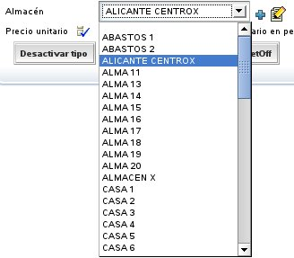\
   En un principio saca todos los almacenes, aunque en realidad usa la *baseCondition* y *filter* especificados en el [*@Tab*](http://www.openxava.org/OpenXavaDoc/apidocs/org/openxava/annotations/Tab.html) por defecto de *Almacen*. Veremos como funcionan los [tabs](C:\Users\Soporte\Documents\openxava\openxava-doc\web\docs\tab_es.html).\
   Si queremos, por ejemplo, que se visualice un combo con las familias de productos y según la familia que se escoja se rellene el combo de las subfamilias, podemos hacer algo así:

   @ManyToOne(fetch=FetchType.LAZY)

   @DescriptionsList(orderByKey=**true**) *// 1*

   **private** Familia familia;

 

   @ManyToOne(fetch=FetchType.LAZY) @NoCreate *// 2*

   @DescriptionsList(

   ` `descriptionProperties="descripcion", *// 3*

   ` `depends="familia", *// 4*

   ` `condition="${familia.codigo} = ?" *// 5*

   ` `order="${descripcion} desc" *// 6*

   ` `)

   **private** Subfamilia subfamilia;

   Se visualizarán 2 combos uno con todas las familias y otro vacío, y al seleccionar una familia el otro combo se rellenará con todas las subfamilias de esa familia.\
   En el caso de *Familia* (1) se visualiza la propiedad *descripcion* de *Familia*, ya que si no lo indicamos por defecto visualiza una propiedad llamada *'descripcion'* o *'nombre'*. En este caso los datos aparecen ordenados por clave y no por descripción. En el caso de *Subfamilia* indicamos que no muestre el vínculo para crear una nueva subfamilia (2) y que la propiedad a visualizar es *descripcion* (aunque esto lo podríamos haber omitido). Con *depends* (4) hacemos que este combo dependa de la referencia *familia*, cuando cambia *familia* en la interfaz gráfica, rellenará esta lista de descripciones aplicando la condición de *condition* (5) y enviando como argumento (para rellenar el interrogante) el nuevo valor de familia. Y las entradas están ordenadas descendentemente por *descripcion* (6).\
   En *condition* y *order* ponemos los nombres de las propiedades entre *${}* y los argumentos como *?*, los operadores de comparación son los de SQL.

   En las referencias donde el *@DescriptionsList* depende de otro *@DescriptionsList* con clave múltiple, puedes poner un ? por cada valor de la clave. Es decir, si tienes una entidad *Almacen* como esta:

**@Entity** **@Getter** **@Setter**

**@IdClass**(AlmacenKey.class)

**public** **class** **Almacen** {

`    `**@Id** 

`    `**int** codigoZona;

`    `**@Id** 

`    `**int** codigo;

`    `**@Column**(length=40) **@Required**

`    `String nombre;

}

Con una clave compuesta que incluye *codigoZona* y *codigo*. Y en otra entidad tienes dos *@DescriptionsLists* como estos:

**@ManyToOne**

**@DescriptionsList**

Warehouse almacenPrincipal;

**@ManyToOne**

**@DescriptionsList**(

`    `depends="almacenPrincipal", 

`    `condition="${almacen.codigoZona} = ? and ${almacen.codigo} = ?") \
`    `*// condition="${almacen} = ?" // A partir de v6.6.3*

Carrier transportistaDefecto;

Donde *transportistaDefecto* depende de *almacenPrincipal* (con su clave compuesta). El truco está en usar dos ? y comparar los dos valores de la clave, *codigoZona* y *codigo* en *condition*.

*Nuevo en v6.6.3*: También es posible indicar sólo el nombre de la referencia en la condición, en lugar de las propiedades calificadas de esa referencia. Es decir, puedes usar simplemente *${almacen} = ?* en lugar de *${almacen.codigoZona} = ? and ${almacen.codigo} = ?* en *condition*. Esto no es sólo para clave múltiples, sino también para referencias con clave simple, mira:

**@DescriptionsList**(

`    `depends="familia", 

`    `*// condition="${familia.codigo} = ?" // Forma clásica*

`    `condition="${familia} = ?" *// A partir de v6.6.3*

)

Fíjate, *${familia}* en lugar de *${familia.codigo}*, aunque esto último todavía está soportado.

*Nuevo en v3.0.3:* Se pueden usar propiedades calificadas en *condition* y *order* incluso si no están incluidas en *descriptionProperties*. Es decir, podemos escribir una condición como esta:

@DescriptionsList( descriptionProperties="nombre",

` `condition="${familia.nivel.descripcion} = 'TOPE'"

)

**private** Subfamilia subfamilia;

Podemos definir condiciones complejas usando [JPQL](http://en.wikipedia.org/wiki/Java_Persistence_Query_Language) (*nuevo en v4.5*, antes de v4.5 se usaba SQL):

@DescriptionsList(

` `condition="e.cosa.codigo = (SELECT c.codigo FROM Cosa c WHERE c.nombre = 'COCHE')"

)

**private** Subfamilia subfamilia;

Como puedes ver en el ejemplo de arriba, con JPQL *(nuevo en v4.5)* podemos usar *e.nombrePropiedad* como alternativa a *${nombrePropiedad}*.\
Podemos especificar una lista de propiedades para que aparezca como descripción:

@ManyToOne(fetch=FetchType.LAZY)

@ReadOnly

@DescriptionsList(descriptionProperties="nivel.descripcion, nombre")

**private** Comercial comercialAlternativo;

En este caso en el combo se visualizará una concatenación de la descripción del nivel y el nombre. Además vemos como podemos usar propiedades calificadas (*nivel.descripcion*) también.\
En el caso de poner una referencia lista descripciones ([*@DescriptionsList*](http://www.openxava.org/OpenXavaDoc/apidocs/org/openxava/annotations/DescriptionsList.html)) como solo lectura ([*@ReadOnly*](http://www.openxava.org/OpenXavaDoc/apidocs/org/openxava/annotations/ReadOnly.html)) se visualizará la descripción (en este caso *nivel.descripcion + nombre*) como si fuera una propiedad simple de texto y no como un combo.\
A partir de v5.5 es posible mostrar el combo y la vista normal al mismo tiempo usando el atributo *showReferenceView*. Si escribes este código:

@ManyToOne(fetch=FetchType.LAZY)

@DescriptionsList(showReferenceView=**true**) *// Combo y vista al mismo tiempo*

@ReferenceView("Simple") *// Esta será la vista usada*

**private** Comercial comercial;

Obtienes:\
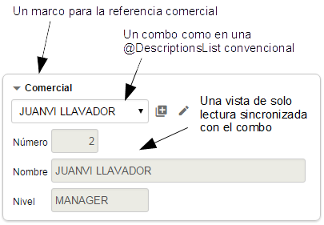\
La vista usada es la que se especifica [*@ReferenceView*](http://www.openxava.org/OpenXavaDoc/apidocs/org/openxava/annotations/ReferenceView.html) o la de por defecto si no se especifica ninguna.\
A partir de v5.8 podremos modificar la condición del combo en tiempo de ejecución. Por ejemplo, si queremos modificar los valores a mostrar en un combo dependiendo de un valor que nos diga el cliente, podemos implementar esta acción al cambiar:

**public** **class** OnChangeStateConditionInCity **extends** OnChangePropertyBaseAction {

`    `**public** **void** execute() **throws** [**Exception**](http://java.sun.com/j2se/1%2E5%2E0/docs/api/java/lang/Exception.html){

`        `[**String**](http://java.sun.com/j2se/1%2E5%2E0/docs/api/java/lang/String.html) value = ([**String**](http://java.sun.com/j2se/1%2E5%2E0/docs/api/java/lang/String.html))getNewValue();

`        `[**String**](http://java.sun.com/j2se/1%2E5%2E0/docs/api/java/lang/String.html) condition = "";

`        `**if** ( Is.empty(value)) condition = "1=1";

`        `**else** condition = "upper(name) like '%" + value + "%'";

`        `getView().setDescriptionsListCondition("state", condition);    *// modificamos la condición del combo 'state'*

`    `}

}

Dependiendo de este valor que nos diga el cliente, mediante el método *setDescriptionsListCondition()*, modificaremos la condición del combo 'state' y por tanto los valores que se estén mostrando cambiarán.
### **Evento de cambio de valor de referencia**
Si queremos reaccionar al evento de cambio de valor de una propiedad podemos poner:

@ManyToOne(fetch=FetchType.LAZY)

@OnChange(AlCambiarTransportistaEnAlbaran.**class**)

**private** Transportista transportista;

En este caso nuestra acción escucha al cambio del código de transportista.\
El código a ejecutar es:

**package** org.openxava.test.acciones;

**import** org.openxava.actions.\*;

***/\*\****

` `***\* @author Javier Paniza***

` `***\*/***

**public** **class** AlCambiarTransportistaEnAlbaran

` `**extends** OnChangePropertyBaseAction { *// 1*

` `**public** **void** execute() **throws** [**Exception**](http://java.sun.com/j2se/1%2E5%2E0/docs/api/java/lang/Exception.html) {

` `**if** (getNewValue() == **null**) **return**;

` `getView().setValue("observaciones",

` `"El transportista es " + getNewValue());

` `addMessage("transportista\_cambiado");

` `}

}

La acción implementa *IOnChangePropertyAction*, mediante *OnChangePropertyBaseAction* (1), aunque es una referencia. Recibimos el cambio de la propiedad clave de la referencia; en este caso *transportista.codigo*. El resto es como en [el caso de una propiedad](C:\Users\Soporte\Documents\openxava\openxava-doc\web\docs\view_es.html#Vista-Personalizacion+de+propiedad-Evento+de+cambio+de+valor+de+propiedad).
### **Búsqueda de referencia al cambiar**
El usuario puede buscar el valor de una referencia simplemente tecleando su clave. Por ejemplo, si hay una referencia a *Subfamilia*, el usuario puede teclear el código de subfamilia y automáticamente se cargará la información de la subfamilia en la vista. Esto se hace usando una acción "al cambiar" que hace la búsqueda. Podemos especificar nuestra propia acción para buscar cuando la clave cambia usando la anotación [*@OnChangeSearch*](http://www.openxava.org/OpenXavaDoc/apidocs/org/openxava/annotations/Actions.html), justo así:

@ManyToOne(fetch=FetchType.LAZY)

@OnChangeSearch(BuscarAlCambiarSubfamilia.**class**)

**private** Subfamilia subfamilia;

Esta acción se ejecuta para realizar la búsqueda, en vez de la acción por defecto, cuando el usuario cambia el código de subfamilia.\
El código a ejecutar es:

**package** org.openxava.test.acciones;

**import** org.openxava.actions.\*;

***/\*\****

` `***\****

` `***\* @author Javier Paniza***

` `***\*/***

**public** **class** BuscarAlCambiarSubfamilia

` `**extends** OnChangeSearchAction { *// 1*

` `**public** **void** execute() **throws** [**Exception**](http://java.sun.com/j2se/1%2E5%2E0/docs/api/java/lang/Exception.html) {

` `**if** (getView().getValueInt("codigo") == 0) {

` `getView().setValue("codigo", **new** [**Integer**](http://java.sun.com/j2se/1%2E5%2E0/docs/api/java/lang/Integer.html)("1"));

` `}

` `**super**.execute();

` `}

}

La acción implementa [*IOnChangePropertyAction*](http://www.openxava.org/OpenXavaDoc/apidocs/org/openxava/actions/IOnChangePropertyAction.html), mediante *OnChangeSearchAction* (1), aunque es una referencia. Recibe el cambio de la propiedad clave de la referencia; en este caso *subfamilia.codigo*.\
Este caso es un ejemplo de refinamiento del comportamiento de la búsqueda al cambiar, porque extiende de *OnChangeSearchAction*, que es la acción por defecto para buscar, y llama a *super.execute()*. También es posible hacer una acción al cambiar convencional (extendiendo de *OnChangePropertyBaseAction* por ejemplo) anulando completamente la lógica de búsqueda.
### **Escoger un editor (referencia, *nuevo en v3.1.3*)**
Un editor visualiza la referencia al usuario y le permite editar su valor. Por defecto, el editor que OpenXava usa para las referencias una vista de detalle dentro de un marco (la forma estándar) o un a combo (si usas *@DescriptionsList)*, pero puedes especificar tu propio editor para una referencia concreta usando [*@Editor*](http://www.openxava.org/OpenXavaDoc/apidocs/org/openxava/annotations/Editor.html).\
Por ejemplo, si tienes una referencia a una entidad *Color* y la quieres visualizar en alguna entidad o vista particular usando una interfaz de usuario personalizada, como un grupo de botones radiales (radio buttons) con los colores disponibles. Puedes hacerlo de esta forma:

@ManyToOne(fetch=FetchType.LAZY)

@Editor("ColorBotonesRadiales")

**private** **Color** color;

En este caso se usará el editor *ColorBotonesRadiales* para visualizar y editar, en vez de la de por defecto. Tienes que definir el editor *ColorRadioButton* en el archivo *editores.xml* en *src/main/resources/xava* (o *xava* para v6 o anterior) de tu proyecto:

**<editor** nombre="ColorBotonesRadiales" url="colorBotonesRadialesEditor.jsp"**/>**

Además has de escribir el código JSP para tu editor en *colorBotonesRadialesEditor.jsp*.\
Esta característica es para cambiar el editor para una referencia concreta en una entidad concreta, o incluso solo en una vista de esa entidad (usando *@Editor(forViews=)*). Si lo que quieres es cambiar un editor para todas las referencias a cierto tipo de entidad a nivel de aplicación entonces es mejor configurarlo usando el archivo *editores.xml*.\
Veáse más en la sección de [Editores para referencias](C:\Users\Soporte\Documents\openxava\openxava-doc\web\docs\customizing_es.html#Personalizacion-Editores-Editores+para+referencias+%28nuevo+en+v3.1.3%29).
### **Escoger tab para la acción de busqueda (referencia, *nuevo en v7.4*)**
Con [*@SearchListTab*](https://www.openxava.org/OpenXavaDoc/apidocs/org/openxava/annotations/SearchListTab.html) podemos indicar que tab mostrar en el dialogo al realizar la acción de busqueda.

@ManyToOne(fetch=FetchType.LAZY)

@SearchListTab("ZonaA")

**private** **Almacen** almacen;

Para esto en el *Almacen* debemos tener un tab llamado *ZonaA*:

@[**Entity**](http://www.google.com/search?sitesearch=java.sun.com&q=allinurl%3Aj2se%2F1+5+0%2Fdocs%2Fapi+Entity)

@[**Tab**](http://java.sun.com/j2se/1%2E5%2E0/docs/api/javax/swing/text/View.html)(name="ZonaA", properties="numero, nombre, zona", defaultOrder="${numero} desc", baseCondition="${zona} = 'A'")

**public** **class** Almacen {

Además, los atributos *forViews* y *notForViews* están disponibles en *@SearchListTab*.
## **Personalización de colección**
Podemos refinar la forma de visualización y comportamiento de una colección *@OneToMany/@ManyToMany* o [calculada](C:\Users\Soporte\Documents\openxava\openxava-doc\web\docs\model_es.html#colecciones-calculadas) en la vista usando las siguientes anotaciones:

@CollectionView         *//  1*

@ReadOnly               *//  2*

@EditOnly               *//  3*

@NoCreate               *//  4*

@NoModify               *//  5*

@AsEmbedded             *//  6*

@ListProperties         *//  7*

@RowStyle               *//  8*

@EditAction             *//  9*

@ViewAction             *// 10*

@NewAction              *// 11*

@AddAction              *// 12 Nuevo en v5.7*

@SaveAction             *// 13*

@HideDetailAction       *// 14*

@RemoveAction           *// 15*

@RemoveSelectedAction   *// 16*\
@DeleteSelectedAction   *// 17 Nuevo en v7.4*

@ListAction             *// 18*

@RowAction              *// 19 Nuevo en v4.6*

@DetailAction           *// 20*

@OnSelectElementAction  *// 21 Nuevo en v3.1.2*

@Editor                 *// 22 Nuevo en v3.1.3*

@SearchListCondition    *// 23 Nuevo en v4m4*

@Tree                   *// 24 Nuevo en v4m4*

@Collapsed              *// 25 Nuevo en v5.0*

@ListSubcontroller      *// 26 Nuevo en v5.7*\
@Chart                  *// 27 Nuevo en v7.4*\
@SimpleList             *// 28 Nuevo en v7.4*\
@SearchListTab          *// 29 Nuevo en v7.4*\
@NoDefaultActions       *// 30 Nuevo en v7.4*\
@OneToMany/@ManyToMany  // No para colecciones calculadas

**private** [**Collection**](http://java.sun.com/j2se/1%2E5%2E0/docs/api/java/util/Collection.html) nombreColeccion; // O un getter para colecciones calculadas

Y las siguientes anotaciones para una *@ElementCollection (nuevo en v5.0)*:

@ReadOnly               *//  2 Nuevo en v5.1*

@EditOnly               *//  3 Nuevo en v5.1*

@ListProperties         *//  7*

@RemoveSelectedAction   *// 15 Nuevo en v5.3*

@Editor                 *// 20*

@Collapsed              *// 23*\
@Chart                  *// 27 Nuevo en v7.4*\
@SimpleList             *// 28 Nuevo en v7.4*\
@ElementCollection

**private** [**Collection**](http://java.sun.com/j2se/1%2E5%2E0/docs/api/java/util/Collection.html) nombreColleccion;

Todas estas anotaciones siguen las [normas para anotaciones de vista](C:\Users\Soporte\Documents\openxava\openxava-doc\web\docs\view_es.html#Vista-Normas%20para%20las%20anotaciones%20de%20vista) y todas ellas son opcionales. OpenXava siempre asume valores por defecto correcto si se omiten.

1. **@CollectionView** ([OX](http://www.openxava.org/OpenXavaDoc/apidocs/org/openxava/annotations/CollectionView.html)): La vista del objeto referenciado que se ha de usar para representar el detalle. Por defecto usa la vista por defecto.
1. **@ReadOnly** ([OX](http://www.openxava.org/OpenXavaDoc/apidocs/org/openxava/annotations/ReadOnly.html)): Si la ponemos solo podremos visualizar los elementos de la colección, no podremos ni añadir, ni borrar, ni modificar los elementos.
1. **@EditOnly** ([OX](http://www.openxava.org/OpenXavaDoc/apidocs/org/openxava/annotations/EditOnly.html)): Si la ponemos podemos modificar los elementos existentes, pero no podemos añadir nuevos ni eliminar.
1. **@NoCreate** ([OX](http://www.openxava.org/OpenXavaDoc/apidocs/org/openxava/annotations/NoCreate.html)): Si la ponemos el usuario final no tendrá el vínculo que le permite crear o añadir objetos del tipo del objeto referenciado.
1. **@NoModify** ([OX](http://www.openxava.org/OpenXavaDoc/apidocs/org/openxava/annotations/NoModify.html)): Si la ponemos el usuario final no tendrá el vínculo que le permite modificar objetos del tipo del objeto referenciado. Sólo aplica a [colecciones incrustadas](C:\Users\Soporte\Documents\openxava\openxava-doc\web\docs\model_es.html#Modelo-Colecciones-Colecciones%20incrustadas).
1. **@AsEmbedded** ([OX](http://www.openxava.org/OpenXavaDoc/apidocs/org/openxava/annotations/AsEmbedded.html)): Por defecto las [colecciones incrustadas](C:\Users\Soporte\Documents\openxava\openxava-doc\web\docs\model_es.html#Modelo-Colecciones-Colecciones%20incrustadas) permiten al usuario crear y añadir elementos, mientras que las colecciones convencionales permiten solo escoger entidades existentes para añadir (o quitar) de la colección. Si ponemos *@AsEmbedded* entonces la colección de entidades se comportan como una colección de agregados, permitiendo al usuario añadir objetos y editarlos directamente. No tiene efecto en el caso de una [colección incrustada](C:\Users\Soporte\Documents\openxava\openxava-doc\web\docs\model_es.html#Modelo-Colecciones-Colecciones%20incrustadas).
1. **@ListProperties** ([OX](http://www.openxava.org/OpenXavaDoc/apidocs/org/openxava/annotations/ListProperties.html)): Indica las propiedades que han de salir en la lista al visualizar la colección. Podemos calificar las propiedades. Por defecto saca todas las propiedades persistentes del objeto referenciado (sin incluir referencias ni calculadas). Solo una *@ListProperties* por vista está permitida. El sufijo + *(nuevo en v4.1)* se puede añadir a una propiedad para mostrar la [suma de la columna, como en los tabs](C:\Users\Soporte\Documents\openxava\openxava-doc\web\docs\tab_es.html#Datos%20tabulares-Sumatorio%20de%20columna%20%28nuevo%20en%20v4.1%29). Antes de v5.9 el sumatorio de columnas no funcionaba en las colecciones calculadas, en las colecciones de elementos ni en las listas *@OrderColumn*. El sumatorio (+) no funciona con propiedades calculadas en colecciones convencionales (*@OneToMany* sin *@OrderColumn*). En el caso de las colecciones de elementos se puede poner el nombre de una referencia *(nuevo en v5.1)* si ésta está anotada con *@DescriptionsList* en la clase incrustable.
1. **@RowStyle** ([OX](http://www.openxava.org/OpenXavaDoc/apidocs/org/openxava/annotations/RowStyle.html)): Para dar un estilo especial a algunas filas. Se comporta igual que en [el caso del Tab](C:\Users\Soporte\Documents\openxava\openxava-doc\web\docs\tab_es.html#Datos%20tabulares-Propiedades%20iniciales%20y%20resaltar%20filas). No funciona para colecciones calculadas. Es posible definir varias *@RowStyle* por cada vista.
1. [**@EditAction**](C:\Users\Soporte\Documents\openxava\openxava-doc\web\docs\view_es.html#Vista-Personalizacion+de+coleccion-Accion+de+editar/ver+detalle+propia) ([OX](http://www.openxava.org/OpenXavaDoc/apidocs/org/openxava/annotations/EditAction.html)): Permite sobreescribir la acción que inicia la edición de un elemento de la colección. Esta es la acción mostrada en cada fila cuando la colección es editable. Solo una *@EditAction* por vista está permitida.
1. [**@ViewAction**](C:\Users\Soporte\Documents\openxava\openxava-doc\web\docs\view_es.html#Vista-Personalizacion+de+coleccion-Accion+de+editar/ver+detalle+propia) ([OX](http://www.openxava.org/OpenXavaDoc/apidocs/org/openxava/annotations/ViewAction.html)): Permite sobreescribir la acción para visualizar un elemento de la colección. Esta es la acción mostrada en cada fila cuando la colección es de solo lectura. Solo una *@ViewAction* por vista está permitida.
1. [**@NewAction**](C:\Users\Soporte\Documents\openxava\openxava-doc\web\docs\view_es.html#Vista-Personalizacion+de+coleccion-Refinar+comportamiento+por+defecto+para+la+vista+de+coleccion) ([OX](http://www.openxava.org/OpenXavaDoc/apidocs/org/openxava/annotations/NewAction.html)): Permite definir nuestra propia acción para empezar a crear un nuevo elemento y añadirlo en la colección. Ésta es la acción que se ejecuta al pulsar en el vínculo 'Nuevo'. Solo una *@NewAction* por vista está permitida. Antes de v5.7 esta anotación también se usaba para sobrescribir la acción 'Añadir', porque entonces no coexistían.
1. [**@AddAction**](C:\Users\Soporte\Documents\openxava\openxava-doc\web\docs\view_es.html#Vista-Personalizacion+de+coleccion-Refinar+comportamiento+por+defecto+para+la+vista+de+coleccion) ([OX](http://www.openxava.org/OpenXavaDoc/apidocs/org/openxava/annotationsAddAction.html)): *(Nuevo en v5.7)* Permite definir nuestra propia acción para empezar a añadir un nuevo elemento a la colección escogiendo uno preexistente. Ésta es la acción que se ejecuta al pulsar en el vínculo 'Añadir'. Solo una *@AddAction* por vista está permitida.
1. [**@SaveAction**](C:\Users\Soporte\Documents\openxava\openxava-doc\web\docs\view_es.html#Vista-Personalizacion+de+coleccion-Refinar+comportamiento+por+defecto+para+la+vista+de+coleccion) ([OX](http://www.openxava.org/OpenXavaDoc/apidocs/org/openxava/annotations/SaveAction.html)): Permite definir nuestra propia acción para grabar el elemento de la colección. Ésta es la acción que se ejecuta al pulsar el vínculo 'Grabar detalle'. Solo una *@SaveAction* por vista está permitida.
1. [**@HideDetailAction**](C:\Users\Soporte\Documents\openxava\openxava-doc\web\docs\view_es.html#Vista-Personalizacion+de+coleccion-Refinar+comportamiento+por+defecto+para+la+vista+de+coleccion) ([OX](http://www.openxava.org/OpenXavaDoc/apidocs/org/openxava/annotations/HideDetailAction.html)): Permite definir nuestra propia acción para ocultar la vista de detalle. Ésta es la acción que se ejecuta al pulsar el bóton 'Cerrar' o al cerrar el diálogo. Solo una *@HideDetailAction* por vista está permitida.
1. [**@RemoveAction**](C:\Users\Soporte\Documents\openxava\openxava-doc\web\docs\view_es.html#Vista-Personalizacion+de+coleccion-Refinar+comportamiento+por+defecto+para+la+vista+de+coleccion) ([OX](http://www.openxava.org/OpenXavaDoc/apidocs/org/openxava/annotations/RemoveAction.html)): Permite definir nuestra propia acción para borrar un elemento de la colección. Ésta es la acción que se ejecuta al pulsar en el botón 'Quitar' en el detalle del elemento. Solo una *@RemoveAction* por vista está permitida.
1. [**@RemoveSelectedAction**](C:\Users\Soporte\Documents\openxava\openxava-doc\web\docs\view_es.html#Vista-Personalizacion+de+coleccion-Refinar+comportamiento+por+defecto+para+la+vista+de+coleccion) ([OX](http://www.openxava.org/OpenXavaDoc/apidocs/org/openxava/annotations/RemoveSelectedAction.html)): Permite definir nuestra propia acción para quitar los elementos seleccionados de la colección. Ésta es la acción que se ejecuta al seleccionar algunas filas y pulsar en el botón 'Quitar seleccionados', o pulsar directamente el icono de quitar en la fila deseada. Solo una *@RemoveSelectedAction* por vista está permitida.
1. [**@DeleteSelectedAction**](C:\Users\Soporte\Documents\openxava\openxava-doc\web\docs\view_es.html#Vista-Personalizacion+de+coleccion-Refinar+comportamiento+por+defecto+para+la+vista+de+coleccion) ([OX](http://www.openxava.org/OpenXavaDoc/apidocs/org/openxava/annotations/DeleteSelectedAction.html)): *(Nuevo en v7.4)* Permite definir nuestra propia acción para eliminar los elementos seleccionados de la colección y de la base de datos. Ésta es la acción que se ejecuta al seleccionar algunas filas y pulsar en el botón 'Eliminar seleccionados', o pulsar directamente el icono de eliminar en la fila deseada. Solo una *@DeleteSelectedAction* por vista está permitida.
1. [**@ListAction**](C:\Users\Soporte\Documents\openxava\openxava-doc\web\docs\view_es.html#Vista-Personalizacion+de+coleccion-Acciones+de+lista+y+fila+propias) ([OX](http://www.openxava.org/OpenXavaDoc/apidocs/org/openxava/annotations/ListAction.html)): Para poder añadir acciones en el modo lista; normalmente acciones cuyo alcance es la colección entera. Es posible definir varias *@ListAction* por cada vista.
1. [**@RowAction**](C:\Users\Soporte\Documents\openxava\openxava-doc\web\docs\view_es.html#Vista-Personalizacion+de+coleccion-Acciones+de+lista+y+fila+propias) ([OX](http://www.openxava.org/OpenXavaDoc/apidocs/org/openxava/annotations/RowAction.html)): *(Nuevo en v4.6)* Para poder añadir acciones en el modo lista asociadas a cada fila; estas acciones no están presente en la barra de botones de la colección sino sólo en cada fila. Es posible definir varias *@RowAction* por cada vista.
1. [**@DetailAction**](C:\Users\Soporte\Documents\openxava\openxava-doc\web\docs\view_es.html#Vista-Personalizacion+de+coleccion-Acciones+de+detalle+propias) ([OX](http://www.openxava.org/OpenXavaDoc/apidocs/org/openxava/annotations/DetailAction.html)): Para poder añadir acciones en detalle, normalmente acciones cuyo alcance es el detalle que se está editando. Es posible definir varias *@DetailAction* por cada vista.
1. [**@OnSelectElementAction**](C:\Users\Soporte\Documents\openxava\openxava-doc\web\docs\view_es.html#Vista-Personalizacion+de+coleccion-Accion+cuando+un+elemento+de+la+coleccion+es+seleccionado+%28nuevo+en+v3.1.2%29) ([OX](http://www.openxava.org/OpenXavaDoc/apidocs/org/openxava/annotations/OnSelectElementAction.html)): *(Nuevo en v3.1.2)* Para poder definir una acción a ser ejecutada cuando un elemento de la colección se selecciona o se deselecciona. Es posible definir varias *@OnSelectElementAction* por cada vista.
1. [**@Editor**](C:\Users\Soporte\Documents\openxava\openxava-doc\web\docs\view_es.html#Vista-Personalizacion+de+coleccion-Escoger+un+editor+%28colecciones,+nuevo+in+v3.1.3%29) ([OX](http://www.openxava.org/OpenXavaDoc/apidocs/org/openxava/annotations/Editor.html)): *(Nuevo en v3.1.3)* Nombre del editor a usar para visualizar la colección en esta vista. El editor tiene que estar declarado en [*openxava/src/main/resources/xava/default-editors.xml*](https://github.com/openxava/openxava/blob/master/openxava/src/main/resources/xava/default-editors.xml) o *src/main/resources/xava/editores.xml* de nuestro proyecto. Antes de v7 eran *OpenXava/xava/default-editors.xml* y *xava/editores.xml* de nuestro proyecto.
1. [**@SearchListCondition**](C:\Users\Soporte\Documents\openxava\openxava-doc\web\docs\view_es.html#Vista-Personalizacion+de+coleccion-Condicion+para+lista+de+busqueda+%28coleccion,+nuevo+en+v4m4%29) ([OX](http://www.openxava.org/OpenXavaDoc/apidocs/org/openxava/annotations/SearchListCondition.html)): *(Nuevo en v4m4)* Condición a usar para la lista de elementos seleccionable susceptibles de ser añadidos a la colección. No aplica a colección embebidas.
1. [**@Tree**](C:\Users\Soporte\Documents\openxava\openxava-doc\web\docs\view_es.html#Vista-Personalizacion+de+coleccion-Visualizar+colecciones+en+formato+arbol+%28nuevo+en+v4m4%29) ([OX](http://www.openxava.org/OpenXavaDoc/apidocs/org/openxava/annotations/Tree.html)): *(Nuevo en v4m4)* Para indicar que esta colección se visualizará usando un árbol en vez de una lista.
1. **@Collapsed** ([OX](http://www.openxava.org/OpenXavaDoc/apidocs/org/openxava/annotations/Collapsed.html)): *(Nuevo en v5.0)* La collección se mostrará contraída para las vistas indicadas. Visualmente significa que el marco que rodea a la vista de la collección se iniciará cerrado. Más tarde el usuario podrá establecer sus preferencias haciendo clic en el icono de expansión.
1. [**@ListSubcontroller**](C:\Users\Soporte\Documents\openxava\openxava-doc\web\docs\view_es.html#subcontrolador-coleccion) ([OX](http://www.openxava.org/OpenXavaDoc/apidocs/org/openxava/annotations/ListSubcontroller.html)): *(Nuevo en v5.7)* Permite agrupar varias acciones y verlas mediante un único botón desplegable.
1. [**@Chart**](C:\Users\Soporte\Documents\openxava\openxava-doc\web\docs\view_es.html#grafico-desde-coleccion) ([OX](http://www.openxava.org/OpenXavaDoc/apidocs/org/openxava/annotations/Chart.html)): *(Nuevo en v7.4)* Para visualizar los valores de una colección como un gráfico.
1. [**@SimpleList**](C:\Users\Soporte\Documents\openxava\openxava-doc\web\docs\view_es.html#lista-simple) ([OX](http://www.openxava.org/OpenXavaDoc/apidocs/org/openxava/annotations/SimpleList.html)): *(Nuevo en v7.4)* La colección se visualizará como una lista simple de solo lectura, sin acciones, filtros, paginación, ordenación, etc.
1. [**@SearchListTab**](C:\Users\Soporte\Documents\openxava\openxava-doc\web\docs\view_es.html#escoger-tab-para-accion-de-busqueda-colecciones) ([OX](http://www.openxava.org/OpenXavaDoc/apidocs/org/openxava/annotations/SearchListTab.html)): *(Nuevo en v7.4)* Definimos el tab a mostrar en la lista cuando se hace una busqueda. Si omitimos esta anotación, al realizar una búsqueda se mostrará el tab por defecto.
1. [**@NoDefaultActions**](C:\Users\Soporte\Documents\openxava\openxava-doc\web\docs\view_es.html#no-default-actions) ([OX](http://www.openxava.org/OpenXavaDoc/apidocs/org/openxava/annotations/NoDefaultActions.html)): *(Nuevo en v7.4)* Usando esta anotación, no se mostrarán las acciones de los controladores *DefaultListActionsForCollections* y ´.
   ### **Propiedades en lista**
   *Aplica a colecciones @OneToMany/@ManyToMany, @ElementCollection y calculadas*\
   Si no usamos ninguna de estas anotaciones una colección se visualiza usando las propiedades persistentes en el modo lista; aunque lo más normal es indicar que propiedades salen en la lista:

   @ListProperties("codigo, nombre, observaciones, relacionConComercial, comercial.nivel.descripcion, tipo")

   @OneToMany(mappedBy="comercial")

   **private** [**Collection**](http://java.sun.com/j2se/1%2E5%2E0/docs/api/java/util/Collection.html)<Cliente> clientes;

   De esta forma la colección se visualiza así:\
   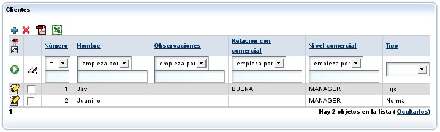\
   Podemos ver como en la lista de propiedades podemos poner propiedades calificadas (como *comercial.nivel.descripcion*).
   ### **Vista para editar**
   *Aplica a colecciones @OneToMany/@ManyToMany y calculadas*\
   Si no usamos ninguna anotación se usa la vista por defecto para editar la entidad en cada línea; aunque lo más normal es indicar que vista se ha de usar para representar el detalle:

   @CollectionView("Simple"),

   @OneToMany(mappedBy="comercial")

   **private** [**Collection**](http://java.sun.com/j2se/1%2E5%2E0/docs/api/java/util/Collection.html)<Cliente> clientes;

   Al pulsar ![edit.gif] ('Editar') se visualizará el detalle usando la vista *Simple* de *Cliente*; para eso\
   hemos de tener una vista llamada *Simple* en la entidad *Cliente* (el modelo de los elementos de la colección).\
   Este vista se usa también cuando el usuario pulsa en  'Añadir' en una [colección incrustada](C:\Users\Soporte\Documents\openxava\openxava-doc\web\docs\model_es.html#Modelo-Colecciones-Colecciones%20incrustadas), en caso contrario OpenXava no muestra esta vista, en su lugar muestra una lista de entidades a añadir.\
   Si la vista *Simple* de *Cliente* es así:

   @[**View**](http://java.sun.com/j2se/1%2E5%2E0/docs/api/javax/swing/text/View.html)(name="Simple", members="codigo; tipo; nombre; direccion")

   Al pulsar detalle aparecerá el diálogo:\
   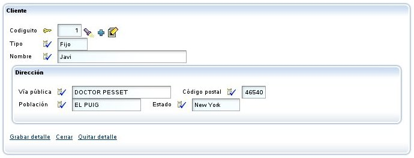
   ### **Colección de elementos**
   En el caso de una *@ElementCollection* *(nuevo en v5.0)* no se usa *@CollectionView* porque los datos son editables directamente en la colección, como en una hoja de cálculo. Sin embargo, la mayoría del comportamiento en modo detalle también está disponbile en las colecciones de elementos, incluyendo el soporte de las siguiente anotaciones en los miembro de la clase incrustable: [*@ReadOnly*](http://www.openxava.org/OpenXavaDoc/apidocs/org/openxava/annotations/ReadOnly.html)*, [*@Editor*](http://www.openxava.org/OpenXavaDoc/apidocs/org/openxava/annotations/Editor.html), [*@SearchListCondition*](http://www.openxava.org/OpenXavaDoc/apidocs/org/openxava/annotations/SearchListCondition.html) (nuevo en v5.1), [*@SearchAction*](http://www.openxava.org/OpenXavaDoc/apidocs/org/openxava/annotations/SearchAction.html) (nuevo en v5.1), [*@DefaultValueCalculator*](http://www.openxava.org/OpenXavaDoc/apidocs/org/openxava/annotations/DefaultValueCalculator.html) (nuevo en v5.1), [*@OnChange*](http://www.openxava.org/OpenXavaDoc/apidocs/org/openxava/annotations/OnChange.html) (nuevo en v5.1), [*@OnChangeSearch*](http://www.openxava.org/OpenXavaDoc/apidocs/org/openxava/annotations/OnChangeSearch.html) (nuevo en v5.1), [*@NoSearch*](http://www.openxava.org/OpenXavaDoc/apidocs/org/openxava/annotations/NoSearch.html) (nuevo en v5.1)* y [*@DescriptionsList*](http://www.openxava.org/OpenXavaDoc/apidocs/org/openxava/annotations/DescriptionsList.html) *(nuevo en v5.1)*.\
   Se puede usar *@ListProperties* en una colección de elementos, de esta manera:

   @ElementCollection

   @ListProperties("producto.codigo, producto.descripcion, precioUnitario, cantidad, importe")

   **private** [**Collection**](http://java.sun.com/j2se/1%2E5%2E0/docs/api/java/util/Collection.html)<LineaPresupuesto> lineas;

   Obtenemos la siguiente interfaz de usuario:\
   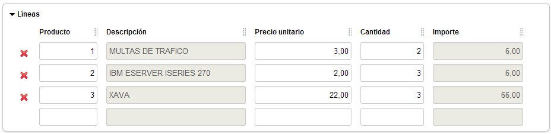\
   En el caso de las colecciones de elementos se puede poner el nombre de una referencia *(nuevo en v5.1)* en *@ListProperties* si está anotada con *@DescriptionsList* en la clase incrustable. Es decir, podemos escribir:

   @ElementCollection

   @ListProperties("factura.ano, factura.numero, factura.importe, estado, recepcionista") *// recepcionista es una referencia*

   **private** [**Collection**](http://java.sun.com/j2se/1%2E5%2E0/docs/api/java/util/Collection.html)<GastorServicio> gastos;

   Donde *recepcionista* es no es una propiedad sino una referencia, una referencia anotada con *@DescriptionsList*, de esta forma:

   @Embeddable

   **public** **class** GastoServicio {

 

   `    `@ManyToOne(fetch=FetchType.LAZY)

   `    `@DescriptionsList

   `    `**private** Recepcionista recepcionista;

 

       ...

 

   }

   A partir del código de arriba se obtiene:\
   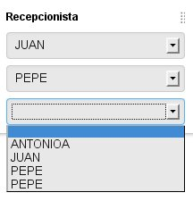\
   *@DescriptionsList* con *showReferenceView=true* no está soportado en las colecciones de elementos.
   ### **Acción de editar/ver detalle propia**
   *Aplica a colecciones @OneToMany/@ManyToMany y calculadas*\
   Podemos refinar fácilmente el comportamiento cuando se pulse el vínculo ![edit.gif] ('Editar') usando [*@EditAction*](http://www.openxava.org/OpenXavaDoc/apidocs/org/openxava/annotations/EditAction.html):

   @EditAction("Factura.editarLinea")

   @OneToMany (mappedBy="factura", cascade=CascadeType.REMOVE)

   **private** [**Collection**](http://java.sun.com/j2se/1%2E5%2E0/docs/api/java/util/Collection.html)<LineaFactura> lineas;

   Hemos de definir *Factura.editarLinea* en *controladores.xml*:

   **<controlador** nombre="Factura"**>**

    ...

   ` `**<accion** nombre="editarLinea" oculta="true"

   ` `imagen="images/edit.gif"

   ` `clase="org.openxava.test.acciones.EditarLineaFactura"**>**

   ` `**<usa-objeto** nombre="xava\_view"**/>** *<!-- No obligatorio desde v4m2 -->*

   ` `**</accion>**

    ...

   **</controlador>**

   Y nuestra acción puede ser así:

   **package** org.openxava.test.acciones;

   **import** java.text.\*;

   **import** org.openxava.actions.\*;

   ***/\*\****

   ` `***\* @author Javier Paniza***

   ` `***\*/***

   **public** **class** EditarLineaFactura **extends** EditElementInCollectionAction { *// 1*

   ` `**public** **void** execute() **throws** [**Exception**](http://java.sun.com/j2se/1%2E5%2E0/docs/api/java/lang/Exception.html) {

   ` `**super**.execute();

   ` `[**DateFormat**](http://java.sun.com/j2se/1%2E5%2E0/docs/api/java/text/DateFormat.html) df = **new** [**SimpleDateFormat**](http://java.sun.com/j2se/1%2E5%2E0/docs/api/java/text/SimpleDateFormat.html)("dd/MM/yyyy");

   ` `getCollectionElementView().setValue( *// 2*

   ` `"observaciones", "Editado el " + df.format(**new** java.util.[**Date**](http://www.google.com/search?sitesearch=java.sun.com&q=allinurl%3Aj2se%2F1+5+0%2Fdocs%2Fapi+Date)()));

   ` `}

   }

   En este caso queremos solamente refinar y por eso nuestra acción desciende de (1) *EditElementInCollectionAction*. Nos limitamos a poner un valor por defecto en la propiedad *remarks*. Es de notar que para acceder a la vista que visualiza el detalle podemos usar el método *getCollectionElementView()* (2).\
   También es posible eliminar la acción para editar de la interfaz de usuario, de esta manera:

   @EditAction("")

   @OneToMany (mappedBy="factura", cascade=CascadeType.REMOVE)

   **private** [**Collection**](http://java.sun.com/j2se/1%2E5%2E0/docs/api/java/util/Collection.html)<LineaFactura> lineas;

   Sólo necesitamos poner una cadena vacía como valor para la acción. Aunque en la mayoría de los casos es suficiente declarar la colección como de solo lectura ([*@ReadOnly*](http://www.openxava.org/OpenXavaDoc/apidocs/org/openxava/annotations/ReadOnly.html)).\
   La técnica para refinar una acción 'ver' (la acción para cada fila cuando la colección es de solo lectura) es la misma pero usando [*@ViewAction*](http://www.openxava.org/OpenXavaDoc/apidocs/org/openxava/annotations/ViewAction.html) en vez de [*@EditAction*](http://www.openxava.org/OpenXavaDoc/apidocs/org/openxava/annotations/EditAction.html).
   ### **Acciones de lista y fila propias**
   *Aplica a colecciones @OneToMany/@ManyToMany y calculadas*\
   Podemos usar [*@ListAction*](http://www.openxava.org/OpenXavaDoc/apidocs/org/openxava/annotations/ListAction.html) para definir acciones que apliquen a toda la colección y [*@RowAction*](http://www.openxava.org/OpenXavaDoc/apidocs/org/openxava/annotations/RowAction.html) *(nuevas en v4.6)* para definir acciones para cada fila. *@ListAction* y *@RowAction* son muy parecidas, de hecho se pueden programar de la misma manera, la diferencia está en que las *@ListActions* se muestran en la barra de botones de la colección, mientras que las *@RowActions* aparecen en cada fila. Las *@ListActions* también pueden aparecer en cada fila si están definidas con *en-cada-fila="true"* en *controladores.xml*.\
   Un ejemplo:

   @ListAction("Transportista.traducirNombre"),

   **private** [**Collection**](http://java.sun.com/j2se/1%2E5%2E0/docs/api/java/util/Collection.html)<Transportista> compañeros;

   Ahora aparecen un nuevo vínculo al usuario:\
   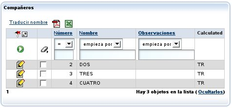\
   Falta definir la acción en *controladores.xml*:

   **<controlador** nombre="Transportista"**>**

    ...

   ` `**<accion** nombre="traducirNombre" oculta="true"

   ` `clase="org.openxava.test.actiones.TraducirNombreTransportista"**>**

   ` `**</accion>**

    ...

   **</controlador>**

   Y el código de nuestra acción:

   **package** org.openxava.test.acciones;

   **import** java.util.\*;

   **import** org.openxava.actions.\*;

   **import** org.openxava.test.modelo.\*;

   ***/\*\****

   ` `***\* @author Javier Paniza***

   ` `***\*/***

   **public** **class** TraducirNombreTransportista **extends** CollectionBaseAction { *// 1*

   ` `**public** **void** execute() **throws** [**Exception**](http://java.sun.com/j2se/1%2E5%2E0/docs/api/java/lang/Exception.html) {

   ` `[**Iterator**](http://java.sun.com/j2se/1%2E5%2E0/docs/api/java/util/Iterator.html) it = getSelectedObjects().iterator(); *// 2*

   ` `**while** (it.hasNext()) {

   ` `Transportista transportista = (Transportista) it.next();

   ` `transportista.traducir();

   ` `}

   ` `}

   }

   La acción desciende de *CollectionBaseAction* (1), de esta forma tenemos a nuestra disposición métodos como *getSelectedObjects()* (2) que ofrece una colección de los objetos seleccionados por el usuario. Hay disponible otros métodos como *getObjects()* (todos los objetos de la colección), *getMapValues()* (los valores de la colección en formato de mapa) y *getMapsSelectedValues()* (los valores seleccionados de la colección en formato de mapa). En el caso de *@RowAction,* *getSelectedObjects()* y *getMapsSelectedValues()* devuelven un único elemento, el correspondiente a la fila de la acción, incluso si la fila no está seleccionada.\
   Como en el caso de la acciones de detalle (ver la siguiente sección) puedes usar *getCollectionElementView()*.\
   También es posible usar [acciones para el modo lista](C:\Users\Soporte\Documents\openxava\openxava-doc\web\docs\controllers_es.html#Controladores-Acciones%20en%20modo%20lista) como acciones de lista para colecciones con *@OneToMany* y *@Condition*, pero no para colecciones calculadas, *@ManyToMany* o listas con *@OrderColumn*.\
   A partir de v5.9 las acciones de fila pueden aparecer de forma selectiva en cada fila [usando *IAvailableAction* igual que con las acciones de modo lista](C:\Users\Soporte\Documents\openxava\openxava-doc\web\docs\controllers_es.html#Controladores-Acciones%20opcionales).
   ### **Acciones de lista y fila por defecto**
   *Aplica a colecciones @OneToMany/@ManyToMany y calculadas*\
   Si queremos añadir alguna acciones de lista a todas las colecciones de nuestra aplicación hemos de crear un controlador llamado *DefaultListActionsForCollections* en nuestro propio *controladores.xml* en *src/main/resources/xava* (o *xava* para v6 o anterior) como sigue:

   **<controlador** nombre="DefaultListActionsForCollections"**>**

   `    `**<hereda-de** controlador="CollectionCopyPaste"**/>** *<!-- New in v5.9 -->*

   `    `**<hereda-de** controlador="Print"**/>**

   `    `**<accion** nombre="exportarComoXML"

   `        `clase="org.openxava.test.acciones.ExportarComoXML"**>**

   `    `**</accion>**

   **</controlador>**

   De esta forma todas las colecciones tendrán las acciones del controlador *CollectionCopyPaste (nuevo en v5.9)* y del controlador *Print* (para exportar a Excel y generar informes PDF) y nuestra propia acción *ExportarComoXML*. Esto tiene el mismo efecto que el elemento [*@ListAction*](http://www.openxava.org/OpenXavaDoc/apidocs/org/openxava/annotations/ListAction.html) (ver la sección [*acciones de lista propias*](C:\Users\Soporte\Documents\openxava\openxava-doc\web\docs\view_es.html#Vista-Personalizacion+de+coleccion-Acciones+de+lista+y+fila+propias)) pero aplica a todas las colecciones a la vez.\
   Si queremos añadir alguna acciones a todas las filas de las colecciones de nuestra aplicación hemos de crear un controlador llamado *DefaultRowActionsForCollections* *(nuevo en v4.6)* en nuestro propio *controladores.xml* en *src/main/resources/xava* (o *xava* para v6 o anterior) como sigue:

   **<controlador** nombre="DefaultRowActionsForCollections"**>**

   `    `**<hereda-de** controlador="CollectionOpenInNewTab"**/>** *<!-- Nuevo en v7.4 -->*

   `    `**<accion** nombre="abrirComoPDF"

   `        `clase="org.openxava.test.acciones.AbrirComoPDF"**>**

   `    `**</accion>**

   **</controlador>**

   De esta forma, las acciones del controlador *CollectionOpenInNewTab* (Nuevo en v7.4) y nuestra propia acción *AbrirComoPDF* estarán presentes en cada fila de las colecciones. Este tiene el mismo efecto que el elemento [*@RowAction* ](http://www.openxava.org/OpenXavaDoc/apidocs/org/openxava/annotations/RowAction.html)(ver la sección [*acciones de lista y fila propias*](C:\Users\Soporte\Documents\openxava\openxava-doc\web\docs\view_es.html#Vista-Personalizacion+de+coleccion-Acciones+de+lista+y+fila+propias))  pero se aplica a todas las colecciones a la vez.\
   A partir de v5.9 esta característica aplica tanto a las colecciones calculadas como a las persistentes. Antes las propiedades calculadas no soportaban acciones por defecto para lista y fila.

   A partir de v7.4 puedes usar [*@NoDefaultActions*](http://www.openxava.org/OpenXavaDoc/apidocs/org/openxava/annotations/NoDefaultActions.html) para que las acciones de lista y fila por defecto no se muestren para una colección concreta.
   ### **Acciones de detalle propias**
   *Aplica a colecciones @OneToMany/@ManyToMany y calculadas*\
   También podemos añadir nuestras propias acciones a la vista de detalle usada para editar cada elemento. Esto se consigue mediante la anotación [*@DetailAction*](http://www.openxava.org/OpenXavaDoc/apidocs/org/openxava/annotations/DetailAction.html). Estas sería acciones que aplican a un solo elemento de la colección. Por ejemplo:

   @DetailAction("Factura.verProducto")

   @OneToMany (mappedBy="factura", cascade=CascadeType.REMOVE)

   **private** [**Collection**](http://java.sun.com/j2se/1%2E5%2E0/docs/api/java/util/Collection.html)<InvoiceDetail> lineas;

   Esto haría que el usuario tuviese a su disposición otro vínculo al editar el detalle:\
   \
   Debemos definir la acción en *controladores.xml*:

   **<controlador** nombre="Facturas"**>**

    ...

   ` `**<accion** nombre="verProducto" oculta="true"

   ` `clase="org.openxava.test.acciones.VerProductoDesdeLineaFactura"**>**

   ` `**<usa-objeto** nombre="xava\_view"**/>** *<!-- No obligatorio desde v4m2 -->*

   ` `**<usa-objeto** nombre="xavatest\_valoresFactura"**/>** *<!-- No obligatorio desde v4m2 -->*

   ` `**</accion>**

    ...

   **</controlador>**

   Y el código de nuestra acción:

   **package** org.openxava.test.acciones;

   **import** java.util.\*;

   **import** javax.ejb.\*;

   **import** org.openxava.actions.\*;

   ***/\*\****

   ` `***\* @author Javier Paniza***

   ` `***\*/***

   **public** **class** VerProductoDesdeLineaFactura

   ` `**extends** CollectionElementViewBaseAction *// 1*

   ` `**implements** INavigationAction {

   ` `@Inject *// A partir de v4m2*

   ` `**private** [**Map**](http://java.sun.com/j2se/1%2E5%2E0/docs/api/java/util/Map.html) valoresFactura;

   ` `**public** **void** execute() **throws** [**Exception**](http://java.sun.com/j2se/1%2E5%2E0/docs/api/java/lang/Exception.html) {

   ` `**try** {

   ` `setValoresFactura(getView().getValues());

   ` `[**Object**](http://www.google.com/search?sitesearch=java.sun.com&q=allinurl%3Aj2se%2F1+5+0%2Fdocs%2Fapi+Object) codigo =

   ` `getCollectionElementView().getValue("producto.codigo"); *// 2*

   ` `[**Map**](http://java.sun.com/j2se/1%2E5%2E0/docs/api/java/util/Map.html) clave = **new** [**HashMap**](http://java.sun.com/j2se/1%2E5%2E0/docs/api/java/util/HashMap.html)();

   ` `clave.put("codigo", codigo);

   ` `getView().setModelName("Producto"); *// 3*

   ` `getView().setValues(clave); *// Desde v4m5 puedes user getParentView()*

   ` `getView().findObject(); *// como alternativa a getView()*

   ` `getView().setKeyEditable(**false**);

   ` `getView().setEditable(**false**);

   ` `}

   ` `**catch** (ObjectNotFoundException ex) {

   ` `getView().clear();

   ` `addError("object\_not\_found");

   ` `}

   ` `**catch** ([**Exception**](http://java.sun.com/j2se/1%2E5%2E0/docs/api/java/lang/Exception.html) ex) {

   ` `ex.printStackTrace();

   ` `addError("system\_error");

   ` `}

   ` `}

   ` `**public** [**String**](http://java.sun.com/j2se/1%2E5%2E0/docs/api/java/lang/String.html)[] getNextControllers() {

   ` `**return** **new** [**String**](http://java.sun.com/j2se/1%2E5%2E0/docs/api/java/lang/String.html) [] { "ProductoDesdeFactura" };

   ` `}

   ` `**public** [**String**](http://java.sun.com/j2se/1%2E5%2E0/docs/api/java/lang/String.html) getCustomView() {

   ` `**return** SAME\_VIEW;

   ` `}

   ` `**public** [**Map**](http://java.sun.com/j2se/1%2E5%2E0/docs/api/java/util/Map.html) getValoresFactura() {

   ` `**return** valoresFactura;

   ` `}

   ` `**public** **void** setValoresFactura([**Map**](http://java.sun.com/j2se/1%2E5%2E0/docs/api/java/util/Map.html) map) {

   ` `valoresFactura = map;

   ` `}

   }

   Vemos como desciende de *CollectionElementViewBaseAction* (1) y así tiene disponible la vista que visualiza el elemento de la colección mediante *getCollectionElementView()* (2). También podemos acceder a la vista principal mediante *getView()* (3) o la vista padre mediante *getParentView()* (*a partir de v4m5*), normalmente *getView()* y *getParentView()* devuelven el mismo valor. En el [capítulo 7](C:\Users\Soporte\Documents\openxava\openxava-doc\web\docs\controllers_es.html) se ven más detalles acerca de como escribir acciones.\
   Además, usando la vista devuelta por *getCollectionElementView()* podemos añadir y borrar programaticamente acciones de detalle y de lista con *addDetailAction()*, *removeDetailAction()*, *addListAction()* y *removeListAction()*, ver API doc para [*org.openxava.view.View*](http://www.openxava.org/OpenXavaDoc/apidocs/org/openxava/view/View.html).
   ### **Refinar comportamiento por defecto para la vista de colección**
   *Aplica a colecciones @OneToMany/@ManyToMany  y calculadas (a partir de v5.3 @RemoveSelectedAction también se puede aplicar a @ElementCollection)*\
   Usando [*@NewAction*](http://www.openxava.org/OpenXavaDoc/apidocs/org/openxava/annotations/NewAction.html), [*@AddAction*](http://www.openxava.org/OpenXavaDoc/apidocs/org/openxava/annotations/AddAction.html) *(nuevo en v5.7)*, [*@SaveAction*](http://www.openxava.org/OpenXavaDoc/apidocs/org/openxava/annotations/SaveAction.html), [*@HideDetailAction*](http://www.openxava.org/OpenXavaDoc/apidocs/org/openxava/annotations/HideDetailAction.html), [*@RemoveAction*](http://www.openxava.org/OpenXavaDoc/apidocs/org/openxava/annotations/RemoveAction.html), [*@RemoveSelectedAction*](http://www.openxava.org/OpenXavaDoc/apidocs/org/openxava/annotations/RemoveSelectedAction.html) y [*@DeleteSelectedAction*](http://www.openxava.org/OpenXavaDoc/apidocs/org/openxava/annotations/DeleteSelectedAction.html)*(nuevo en v7.4)* podemos refinar el comportamiento por defecto para una vista de colección. Por ejemplo, si queremos refinar el comportamiento de la acción de grabar un detalle podemos definir nuestra vista de esta forma:

   @SaveAction("LineaAlbaran.grabar")

   @OneToMany (mappedBy="albaran", cascade=CascadeType.REMOVE)

   **private** [**Collection**](http://java.sun.com/j2se/1%2E5%2E0/docs/api/java/util/Collection.html)<LineaAlbaran> lineas;

   Debemos tener la acción *LineaAlbaran.grabar* en *controladores.xml*:

   **<controlador** nombre="LineaAlbaran"**>**

    ...

   ` `**<accion** nombre="grabar"

   ` `clase="org.openxava.test.acciones.GrabarLineaAlbaran"**>**

   ` `**<usa-objeto** nombre="xava\_view"**/>** *<!-- No obligatorio desde v4m2 -->*

   ` `**</accion>**

    ...

   **</controlador>**

   Y definir la clase acción para grabar:

   **package** org.openxava.test.acciones;

   **import** org.openxava.actions.\*;

   ***/\*\****

   ` `***\* @author Javier Paniza***

   ` `***\*/***

   **public** **class** GrabarDetalleAlbaran **extends** SaveElementInCollectionAction { *// 1*

   ` `**public** **void** execute() **throws** [**Exception**](http://java.sun.com/j2se/1%2E5%2E0/docs/api/java/lang/Exception.html) {

   ` `**super**.execute();

   ` `*// Aquí nuestro código // 2*

   ` `}

   }

   El caso más común es extender el comportamiento por defecto, para eso hemos de extender la clase original para grabar un detalle de una colección (1), esto es la acción *SaveElementInCollection*, entonces llamamos a *super* desde el método *execute()* (2), y después escribimos nuestro propio propio código.\
   También es posible eliminar cualquiera de estas acciones de la interfaz gráfica, por ejemplo, podemos definir una colección de esta manera:

   @RemoveSelectedAction("")

   @OneToMany (mappedBy="albaran", cascade=CascadeType.REMOVE)

   **private** [**Collection**](http://java.sun.com/j2se/1%2E5%2E0/docs/api/java/util/Collection.html)<LineaAlbaran> lineas;

   En este caso la acción para quitar los elementos seleccionadas no aparecerá en la interfaz de usuario. Como se ve, sólo es necesario declarar una cadena vacía como nombre de la acción.\
   *Nuevo en v5.3: @RemoveSelectedAction* también se puede usar con *@ElementCollection*. Por defecto, no se usa ninguna acción Java para eliminar una fila de una colección de elementos, se hace mediante JavaScript en el navegador. Sin embargo, con *@RemoveSelectedAction* se puede indicar que se use una acción Java, de esta manera se puede refinar el comportamiento. Podemos extender [*RemoveSelectedInElementCollectionAction*](http://www.openxava.org/OpenXavaDoc/apidocs/org/openxava/actions/RemoveSelectedInElementCollectionAction.html) *(nuevo en v5.3.2)* para hacerlo.\
   *Nuevo en v7.4: @DeleteSelectedAction*. Podemos extender de [*DeleteSelectedInCollectionAction*](http://www.openxava.org/OpenXavaDoc/apidocs/org/openxava/actions/DeleteSelectedInCollectionAction.html)para refinar el comportamiento. 
   ### **Acción cuando un elemento de la colección es seleccionado *(nuevo en v3.1.2)***
   *Aplica a colecciones @OneToMany/@ManyToMany y calculadas*\
   Podemos definir una acción que se ejecute cuando un elemento de una colección se seleccione o deseleccione. Esto se consigue usando la anotación [*@OnSelectElementAction*](http://www.openxava.org/OpenXavaDoc/apidocs/org/openxava/annotations/OnSelectElementAction.html). Por ejemplo, supongamos que tenemos una colección como esta:\
   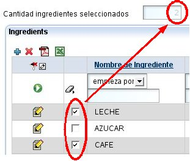\
   Y queremos que al seleccionar una fila el valor de el campo *cantidadIngredientesSeleccionados* se actualice en la interfaz de usuario. Vamos a ver como hacerlo.\
   Primero hemos de anotar nuestra colección:

   @OnSelectElementAction("Formula.alSeleccionarIngrediente") *// 1*

   @OneToMany(mappedBy="formula", cascade=CascadeType.REMOVE)

   **private** [**Collection**](http://java.sun.com/j2se/1%2E5%2E0/docs/api/java/util/Collection.html)<IngredienteFormula> ingredientes;

   De esta manera tan sencilla (1), y gracias a la anotación *@OnSelectElementAction*, estamos diciendo que cuando el usuario haga click en la casilla de chequeo (checkbox) de la fila, la acción *Formula.alSeleccionarIngrediente* se ejecutará. Esta acción se declara en *controladores.xml*, de esta manera:

   **<controlador** nombre="Formula"**>**

    ...

   ` `**<accion** nombre="alSeleccionarIngredientes" oculta="true"

   ` `clase="org.openxava.test.acciones.AlSeleccionarIngrediente"**>**

   ` `**<usa-objeto** nombre="xava\_view"**/>** *<!-- No obligatorio desde v4m2 -->*

   ` `**</accion>**

    ...

   **</controlador>**

   Ahora, solo nos queda el código de la clase *AlSeleccionarIngrediente*:

   **public** **class** AlSeleccionarIngrediente **extends** OnSelectElementBaseAction { *// 1*

   ` `**public** **void** execute() **throws** [**Exception**](http://java.sun.com/j2se/1%2E5%2E0/docs/api/java/lang/Exception.html) {

   ` `**int** size = getView().getValueInt("cantidadIngredientesSeleccionados");

   ` `size = isSelected() ? size + 1 : size - 1; *// 2*

   ` `getView().setValue("cantidadIngredientesSeleccionados", **new** [**Integer**](http://java.sun.com/j2se/1%2E5%2E0/docs/api/java/lang/Integer.html)(size));

   ` `}

   }

   La forma más fácil de implementar la acción es extendiendo de [*OnSelectElementBaseAction*](http://www.openxava.org/OpenXavaDoc/apidocs/org/openxava/actions/OnSelectElementBaseAction.html), esto nos permite acceder a la propiedad *selected* (por medio de *isSelected()*, 2) que indica si el usuario ha seleccionado o deseleccionado la fila; y *row* (usando *getRow()*) que indica el número de fila del elemento de la colección afectado.
   ### **Escoger un editor (colecciones, *nuevo in v3.1.3*)**
   *Aplica a colecciones @OneToMany/@ManyToMany, @ElementCollection y calculadas*\
   Un editor visualiza la colección al usuario y le permite editar su valor. Por defecto, el editor que OpenXava usa para las colecciones es una lista con los datos en formato tabular, que permite filtrar, ordenar, paginar, etc., pero puedes especificar tu propio editor para una colección concreta usando [*@Editor*](http://www.openxava.org/OpenXavaDoc/apidocs/org/openxava/annotations/Editor.html).\
   Por ejemplo, si tienes una colección de entidades *Cliente* y la quieres visualizar en alguna entidad o vista particular usando una interfaz de usuario personalizada, como una lista simple de nombres. Puedes hacerlo de esta forma:

   @OneToMany(mappedBy="comercial")

   @Editor("NombresClientes")

   **private** [**Collection**](http://java.sun.com/j2se/1%2E5%2E0/docs/api/java/util/Collection.html)<Cliente> clientes;

   En este caso se usará el editor *NombresClientes* para visualizar y editar, en vez de la de por defecto. Tienes que definir el editor *NombresClientes* en el archivo *editores.xml* en *src/main/resources/xava* (o *xava* para v6 o anterior) de tu proyecto:

   **<editor** nombre="NombresClientes" url="nombresClientesEditor.jsp"**/>**

   Además has de escribir el código JSP para tu editor en *nombresClientesEditor.jsp*.\
   Esta característica es para cambiar el editor para una colección concreta en una entidad concreta, o incluso solo en una vista de esa entidad (usando *@Editor(forViews=)*). Si lo que quieres es cambiar un editor para todas las colecciones a cierto tipo de entidad a nivel de aplicación entonces es mejor configurarlo usando el archivo *editores.xml*.\
   Veáse la sección [Editores para colecciones](C:\Users\Soporte\Documents\openxava\openxava-doc\web\docs\customizing_es.html#Personalizacion-Editores-Editores+para+colecciones+%28nuevo+en+v3.1.3%29) para más detalles.
   ### **Condición para lista de búsqueda (colección, *nuevo en v4m4*)**
   *Aplica a colecciones @OneToMany/@ManyToMany y calculadas*\
   Puedes especificar una condición para ser aplicada a la lista de elementos disponible para seleccionar. Usando *@SearchListCondition* puedes definir una condición aplicable a la lista para seccionar, además puedes usarlo junto con *forViews* y *notForViews* para definir criterios diferentes para cada vista (1). Desde la v7.4 la condición soporta el uso de *${this.}* para referenciar una propiedad de la entidad misma (2), como muestra el siguiente fragmento de código:

   **private** int numero;\
\
   @OneToMany(mappedBy="comercial")

   @SearchListCondition(value="${codigo} < 5", forViews="SearchListCondition, SearchListConditionBlank") *// 1*\
   @SearchListCondition(value="${codigo} < ${this.numero}", forViews="SearchListConditionNumber") *// 2*

   **private** [**Collection**](http://java.sun.com/j2se/1%2E5%2E0/docs/api/java/util/Collection.html)<Cliente> clientes;
   ### **Visualizar colecciones en formato árbol *(nuevo en v4m4)***
   *Aplica a colecciones @OneToMany/@ManyToMany y calculadas*

   Es posible visualizar una colección con un árbol:

   @OneToMany(mappedBy="padre", cascade = CascadeType.REMOVE)

   @Tree                              *// 1*

   @ListProperties("descripcion")     *// 2*

   @OrderBy("carpeta, ordenElement")  *// 3*

   // @Editor(value="TreeView")       *// 4  No es ncecesario desde v7.5*\
   **private** [**Collection**](http://java.sun.com/j2se/1%2E5%2E0/docs/api/java/util/Collection.html)<ElementoArbolTreeItem> elementos;

   Anotando la colección con *@Tree* (1) indicas que quieres visualizar la colección como un árbol. Con la anotación *@ListProperties* (2) puedes definir las propiedades a visualizar en cada rama. Los elementos se visualizan en el orden natural de la colección definido por *@OrderBy* (3). Debes tener una propidad *String* llamada *path* para que sea usado como la ruta de las ramas, también puedes llamarlo por otro nombre, para esto has de usar la anotación *@Tree* (1) indicando *pathProperty*. En versiones anteriores a la v7.5 es necesario usar *@Editor("TreeView")* para que se muestre el editor del árbol.\
   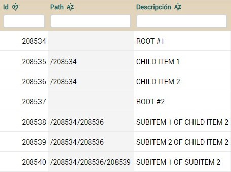

   Como se ve en la tabla, el arbol se hace concatenando el id separado por "/". Los elementos hermanos tienen que tener el mismo path. El editor se encarga de crear y modificar la propiedad path. Una colección vista como un árbol podría desplegarse así:\
   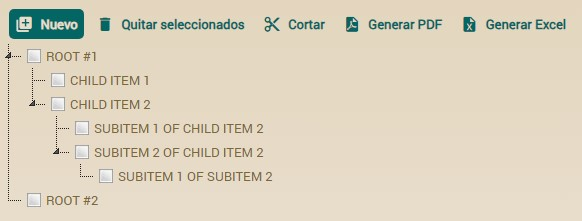

   El usuario puede arrastrar y soltar para mover elementos de una rama a otra (desde v7.2, antes se hacía usando unos botones).

   La sintaxis completa para @Tree es:

   @Tree(

   `  `forViews="",                *// 1*

   `  `notForViews="",             *// 2*

   `  `pathProperty="path",        *// 3*

   `  `idProperties="",            *// 4*

   `  `initialExpandedState=**true**,  *// 5*

   `  `orderIncrement=2,           *// 6  Obsoleto desde la versión 7.2*  

   `  `pathSeparator="/"           *// 7*\
   `  `allowMoveNodes=**true**         *// 8  Nuevo en v7.5*\
   )

1. **forViews**: Indica las vistas para la que aplica.
1. **notForViews**: Indica las vistas a las que no debe aplicar.
1. **pathProperty**: Nombre de la propiedad a ser usada como ruta para el árbol, de manera predeterminada utiliza la propiedad "path" (que debe estar presente en la clase). También puedes indicarle otro nombre.
1. **idProperties**: Cada elemento del árbol debe estar identificado de manera única. Esto normalmente esta asociado con los campos anotados con @Id, por lo tanto la implementación de @Tree utiliza estos campos. No obstante, usted puede preferir utilizar cualquier otro campo para que represente el identificador único del elemento del árbol. Las propiedades definidas aqui deben estar separadas por coma.
1. **initialExpandedState**: Si tiene el valor verdadero (true) el árbol es desplegado de modo expandido.
1. **orderIncrement**: Si utilizar la anotación @OrderBy, la misma hace referencia a un campo tipo entero, entonces la implementación de @Tree permite el reordenamiento del árbol. De manera predeterminada utiliza valores de incremento de 2, y es el mínimo aceptado. (obsoleto desde la versión 7.2).
1. **pathSeparator**: Separador utilizado en la ruta que define cada uno de los elementos del árbol y su ubicación.
1. **allowMoveNodes**: *(Nuevo en v7.5)* Indica si el usuario puede mover nodos en el árbol. Si se establece en *false*, los usuarios no podrán mover nodos mediante arrastrar y soltar. El valor predeterminado es *true*.
   ### **Propiedades de total *(nuevo en v4.3)***
   *Aplica a colecciones @OneToMany/@ManyToMany, @ElementCollection y calculadas*\
   Dentro de *@ListProperties* podemos definir, entre corchetes, un conjunto de propiedades de la entidad padre para se mostradas en el pie de la colección como valores totales. Es decir, si definimos una de esta manera:

**@ListProperties**("fechaEntrega[factura.fechaEntrega], cantidad, importe[factura.sumaImportes, factura.iva, factura.total]")

Que incluyendo el código de las propiedades de total sería:

**public** **class** **Factura** {

...

`    `**@OneToMany** (mappedBy="factura", cascade=CascadeType.REMOVE)

`    `**@ListProperties**("fechaEntrega[factura.fechaEntrega], cantidad, importe[factura.sumaImportes, factura.iva, factura.total]")

`    `**private** Collection<DetalleFactura> detalles;	

`    `**public** Date **getFechaEntrega**() { 

`        `Date resultado = **null**;		

`        `**for** (DetalleFactura detalle: getDetalles()) {

`            `resultado = (Date) ObjectUtils.min(resultado, detalle.getFechaEntrega());

`        `}		

`        `**return** resultado;

`    `}

`    `**@Money**

`    `**public** BigDecimal **getSumaImportes**() {		

`        `BigDecimal resultado = BigDecimal.ZERO;		

`        `**for** (DetalleFactura detalle: getDetalles()) { 			

`            `resultado = resultado.add(detalle.getImporte());

`        `}		

`        `**return** resultado;		

`    `}

`    `**@Money** **@Depends**("porcentajeIva, sumaImportes")

`    `**public** BigDecimal **getIva**() {		

`        `**return** getSumaImportes().multiply(getPorcentajeIva()).divide(CIEN, 2, BigDecimal.ROUND\_HALF\_UP);

`    `}

`    `**@Money** **@Depends**("iva") 

`    `**public** BigDecimal **getTotal**() {

`        `**return** getIva().add(getSumaImportes());

`    `}

}    

Obtendremos:\
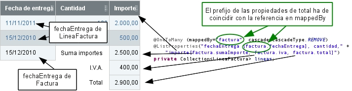\
Las propiedades de total pueden usarse para todo tipo de colecciones, es decir para *@OneToMany, @ManyToMany, @ElementCollection* o colecciones calculadas (simplemente un getter que devuelve una colección). Podemos añadir propiedades de total a cualquier propiedad del *@ListProperties* y pueden ser de cualquier tipo, no sólo número. Estas propiedades de total se obtienen de la entidad contenedora por tanto hemos de usar la referencia a la entidad contenedora como prefijo, es decir, el prefijo de las propiedades de total ha de coincidir con la referencia de *mappedBy* en el caso de las colecciones persistentes.\
A partir de v5.9 las propiedades de total pueden ser persistente, por lo tanto editables, no sólo calculadas (con sólo un getter). También desde 5.9 puedes anotar una propiedad de total con *@Calculation*. Además, a partir de v5.9 es posible combinar el sumatorio de las columnas (el + en la propiedad) con las propiedades de total. Todo est te permite escribir una *@ListProperties* como esta:

@ListProperties("porcentajeIVA, total+[costeTrabajo.porcentajeBeneficio, costeTrabajo.beneficio, costeTrabajo.total]")

Fíjate en el + después de *total* y a continuación las propiedades de total entre corchetes. En este caso *porcentajeBeneficio* es una propiedad persistente, por tanto editable. El *beneficio* y el *total* también son persistente pero con *@Calculation* y *@ReadOnly* (no editable). Este es el código completo:

**public** **class** **CosteTrabajo**  {

...

`    `**@OneToMany** (mappedBy="costeTrabajo")

`    `**@ListProperties**("numero, porcentajeIVA, total+[costeTrabajo.porcentajeBeneficio, costeTrabajo.beneficio, costeTrabajo.total]")

`    `**private** Collection<FacturaTrabajo> facturas;	    

`    `**@DefaultValueCalculator**(value=IntegerCalculator.class,

`        `properties=**@PropertyValue**(name="value", value="13") 

`    `)

`    `**private** **int** porcentajeBeneficio; *// Persistente con getter y setters, editable*

`    `**@Calculation**("sum(facturas.total) \* porcentajeBeneficio / 100")

`    `**@ReadOnly**

`    `**private** BigDecimal beneficio; *// Persistente con getter y setters, no editable por el @ReadOnly*

`    `**@Calculation**("sum(facturas.total) + beneficio")

`    `**@ReadOnly**

`    `**private** BigDecimal total; *// Persistente con getter y setters, no editable por el @ReadOnly*

}

Esto produce el siguiente efecto:\
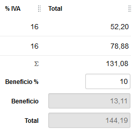\
Donde el 131,08 es el sumatorio de la columna, por causa del *total+.* Debajo tienes *porcentajeBeneficio*, *beneficio* y *total*, las propiedades de total convencionales. Se puede referenciar el sumatorio de la columna (es decir *total+*, el 131,08) desde una propiedad *@Calculation* usando *sum(nombreColumna)*. Por ejemplo, en este caso podrías definir la propiedad *beneficio* de esta manera:

@Calculation("sum(facturas.total) \* porcentajeBeneficio / 100")

@ReadOnly

**private** [**BigDecimal**](http://java.sun.com/j2se/1%2E5%2E0/docs/api/java/math/BigDecimal.html) beneficio;

En este caso el *sum(facturas.total)* dentro de *@Calculation* es la suma de las propiedades *total* de todos los elementos de la colección *facturas*, es decir lo mismo que *total+* en *@ListProperties*, es decir el 131,08 que ves en la imagen.
### **Subcontrolador en una colección *(nuevo en v5.7)***
*Aplica a colecciones @OneToMany/@ManyToMany y calculadas*\
Mediante *@ListSubcontroller* podremos agrupar varias acciones para visualizarlas en un único botón desplegable. Si definimos una colección como la siguiente:

@OneToMany(mappedBy="equipo", cascade=CascadeType.ALL)

@ListSubcontroller("Cosas")

**private** [**Collection**](http://java.sun.com/j2se/1%2E5%2E0/docs/api/java/util/Collection.html)<MiembroEquipo> miembros;

Obtendremos:\
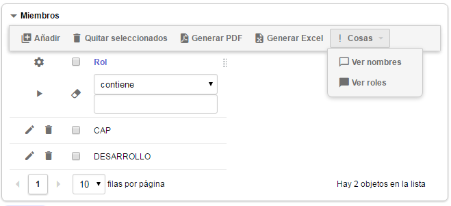\
En *@ListSubcontroller* definiremos el nombre del controlador al que hacemos referencia, además están disponibles los atributos *forViews* y *notForViews*.\
Si queremos que nuestro nuevo subcontrolador muestre una imagen, deberemos definir el controlador con el atributo *icono* o *imagen*:

<controlador nombre="Cosas" icono="exclamation">

`    `<accion nombre="verNombres" clase="org.openxava.test.acciones.VerNombreORolDesdeMiembroEquipo" icono="message-outline"/>

`    `<accion nombre="verRoles" clase="org.openxava.test.acciones.VerNombreORolDesdeMiembroEquipo" icono="message">

`        `<poner valor="true" propiedad="roles"/>

`    `</accion>

</controlador>
### **Gráfico a partir de una colección *(nuevo en v7.4)***
*Aplica a colecciones @OneToMany/@ManyToMany, @ElementCollection y calculadas*\
Se puede hacer que para visualizar una colección se use un gráfico, para ellos hay que anotar la colección con [*@Chart*](https://openxava.org/OpenXavaDoc/apidocs/org/openxava/annotations/Chart.html), de esta manera:

**@OneToMany**(mappedBy="empresa")

**@Chart**

Collection<Empleado> empleados;

Por ejemplo, en este caso en lugar de la típica lista se visualizaría un gráfico usando los datos de los elementos de la colección, así:

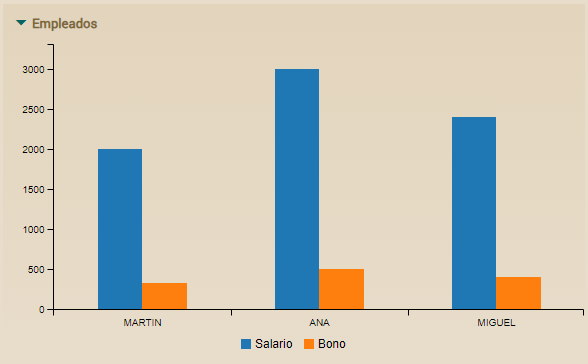

Habría un grupo de barras por cada elemento de la colección, en este caso, si hay 3 empleados en la colección aparecen 3 grupos de barras.

OpenXava determina por defecto que propiedades usar para la etiqueta que aparece en cada grupo de barras y que propiedades usar para obtener los valores de las barras. Mira la [JavaDoc de *@Chart*](https://openxava.org/OpenXavaDoc/apidocs/org/openxava/annotations/Chart.html) para aprender más sobre los valores por defecto. Sin embargo, el programador siempre tiene la opción de definir sus propias propiedades usando los atributos *labelProperties* y *dataProperties* de *@Chart*, de esta forma:

**@OneToMany**(mappedBy="empresa")

**@Chart**(labelProperties="nombre, apellidos", dataProperties="salario")

Collection<Empleado> empleados;

Lo que generaría un gráfico como este:

Dado que hemos puesto *labelProperties="nombre, apellidos"* la etiqueta usada en cada columna del gráfico es la concatenación del nombre y los apellidos del empleado, como MIGUEL SMITH HERRERO por ejemplo. Fíjate también en que sólo sale una columna por empleado, con el valor del salario, porque hemos puesto *dataProperties="salario"*. Por supuesto, se pueden poner más propiedades en *dataProperties* separadas por comas.

A partir de la versión 7.5, está disponible un nuevo atributo *type* en *@Chart*. Este atributo permite especificar el tipo de gráfico que se mostrará. Los valores posibles son:

- *BAR*: Muestra un gráfico de barras (este es el valor por defecto)
- *LINE*: Muestra un gráfico de líneas
- *PIE*: Muestra un gráfico de tarta

  Por ejemplo:

  En el caso de los gráficos de tarta, al igual que con otros tipos de gráficos, es común mostrar datos agregados. Raramente querríamos un gráfico de tarta que muestre todos (o muchos) los registros de una tabla (lo que sería una colección de entidades). Por lo tanto, normalmente es mejor usar una clase auxiliar para mostrar datos agregados o de resumen. Aquí hay un ejemplo:

**@Chart**(type = ChartType.PIE)

**public** Collection<Proporcion> **getProporcionEmpleadosExternos**() { 

`    `EntityManager em = XPersistence.getManager();

`    `*// Consulta para contar empleados internos (email contiene el nombre de la corporación)*

`    `Query consultaInternos = em.createQuery(

`        `"SELECT COUNT(e) FROM EmpleadoCorporacion e " +

`        `"WHERE e.corporacion.id = :idCorporacion AND LOWER(e.email) LIKE :patron");

`    `consultaInternos.setParameter("idCorporacion", getId());

`    `consultaInternos.setParameter("patron", "%" + nombre.toLowerCase() + "%");

`    `Long cantidadInternos = (Long) consultaInternos.getSingleResult();

`    `*// Consulta para contar empleados externos (email no contiene el nombre de la corporación)*

`    `Query consultaExternos = em.createQuery(

`        `"SELECT COUNT(e) FROM EmpleadoCorporacion e " +

`        `"WHERE e.corporacion.id = :idCorporacion AND LOWER(e.email) NOT LIKE :patron");

`    `consultaExternos.setParameter("idCorporacion", getId());

`    `consultaExternos.setParameter("patron", "%" + nombre.toLowerCase() + "%");

`    `Long cantidadExternos = (Long) consultaExternos.getSingleResult();

`    `*// Crear y devolver la colección de proporciones*

`    `Collection<Proporcion> proporciones = **new** ArrayList<>();

`    `proporciones.add(**new** Proporcion("Internos", cantidadInternos.intValue()));

`    `proporciones.add(**new** Proporcion("Externos", cantidadExternos.intValue()));

`    `**return** proporciones;

}

Donde *Proporcion* es una clase simple que representa una proporción con una descripción y un valor:

**@Data**

**@NoArgsConstructor**

**@AllArgsConstructor**

**public** **class** **Proporcion** {

`    `String descripcion;

`    `**int** valor;

}

Esto generaría un gráfico de tarta como este:

Además, los atributos *forViews* y *notForViews* están disponibles en *@Chart*.
### **Lista simple *(nuevo en v7.4)***
*Aplica a colecciones @OneToMany/@ManyToMany, @ElementCollection y calculadas*\
Con la anotación [*@SimpleList*](https://openxava.org/OpenXavaDoc/apidocs/org/openxava/annotations/SimpleList.html) la lista se visualiza de solo lectura, sin acciones, sin filtros, sin paginación, sin ordenación, etc. Es decir, si anotamos nuestra colección con *@SimpleList*, de esta manera:

**@OneToMany**(mappedBy="padre")

**@SimpleList**

Collection<RotacionPersonal> rotacionPorAnyo;

Se visualizaría así:

Útil cuando el usuario necesite ver los datos de forma simple y clara, y no tenga que interactuar con ellos, como en un cuadro de mandos, por ejemplo.

Además, los atributos *forViews* y *notForViews* están disponibles en *@SimpleList.*
### **Escoger tab para la acción de busqueda (colecciones*, nuevo en v7.4*)**
*Aplica a colecciones @OneToMany/@ManyToMany y calculadas*

Con [*@SearchListTab*](https://www.openxava.org/OpenXavaDoc/apidocs/org/openxava/annotations/SearchListTab.html) podemos indicar que tab mostrar en el dialogo al realizar la acción de añadir.

@OneToMany(mappedBy="vendedor")

@SearchListTab("Demo")

**private** **Collection<Cliente>** clientes;

Para esto en *Cliente* debemos tener un tab llamado *Demo*:

@[**Entity**](http://www.google.com/search?sitesearch=java.sun.com&q=allinurl%3Aj2se%2F1+5+0%2Fdocs%2Fapi+Entity)

@[**Tab**](http://java.sun.com/j2se/1%2E5%2E0/docs/api/javax/swing/text/View.html)(name="Demo", properties="nombre, tipo, vendedor.nombre", defaultOrder="${nombre} desc", baseCondition="${tipo} = 'R'")

**public** **class** Cliente {

Además, los atributos *forViews* y *notForViews* están disponibles en *@SearchListTab*.
### **Ocultar acciones por defecto de lista y fila (*nuevo en v7.4*)**
*Aplica a colecciones @OneToMany/@ManyToMany y calculadas*

Con [*@NoDefaultActions*](https://www.openxava.org/OpenXavaDoc/apidocs/org/openxava/annotations/NoDefaultActions.html) podemos ocultar las acciones de los controladores *DefaultListActionsForCollections* y *DefaultRowActionsForCollections.*

@OneToMany(mappedBy="vendedor")

@NoDefaultActions

**private** **Collection<Carrier>** carriers;

Además, los atributos *forViews* y *notForViews* están disponibles en *@NoDefaultActions*.
## **Propiedades transitorias para controles gráficos**
Con [*@Transient (JPA)*](http://java.sun.com/javaee/5/docs/api/javax/persistence/Transient.html) podemos usar una propiedad que no se guarde en la base de datos, pero que sí nos interesa que se visualice al usuario. Podemos usarlas para proporcionar controles al usuario para manejar la interfaz gráfica.\
Un ejemplo:

@Transient

@DefaultValueCalculator(value=EnumCalculator.**class**,

` `properties={

` `@PropertyValue(name="enumType", value="org.openxava.test.modelo.Albaran$EntregadoPor")

` `@PropertyValue(name="value", value="TRANSPORTISTA")

` `}

)

@OnChange(AlCambiarEntradoPor.**class**)

**private** EntragadoPor entregadoPor;

**public** **enum** EntregadoPor { TRABAJADOR, TRANSPORTISTA }

Podemos observar como la sintaxis es exactamente igual que en el caso de definir una propiedad en la parte del modelo, podemos incluso hacer que sea un *enum* y que tenga un [*@DefaultValueCalculator*](http://www.openxava.org/OpenXavaDoc/apidocs/org/openxava/annotations/DefaultValueCalculator.html). Después de haber definido la propiedad podemos usarla en la vista como una propiedad más, asignandole una acción [*@OnChange*](http://www.openxava.org/OpenXavaDoc/apidocs/org/openxava/annotations/OnChange.html) por ejemplo y por supuesto poniendola como miembro de una vista.
## **Acciones de la vista**
Además de poder asociar acciones a una propiedad, referencia o colección, podemos tambien definir acciones arbitrarias en cualquier parte de nuestra vista. Para poder hacer esto se ponemos el nombre calificado de la acción seguido de paréntesis (), de esta manera:

@[**View**](http://java.sun.com/j2se/1%2E5%2E0/docs/api/javax/swing/text/View.html)( members=

` `"codigo;" +

` `"tipo;" +

` `"nombre, Cliente.cambiarEtiquetaDeNombre();" +

...

El efecto visual sería:\
\
Podemos ver el vínculo 'Cambiar nombre de etiqueta' que ejecutará la acción *Clientes.cambiarEtiquetaDeNombre* al pulsarlo.\
Si la vista contenedora de la acción no es editable, la acción no estará presente. Si queremos que la acción esté siempre activa, incluso si la vista no está editable, hemos de usar poner la palabra ALWAYS entre los paréntesis, como sigue:

@[**View**](http://java.sun.com/j2se/1%2E5%2E0/docs/api/javax/swing/text/View.html)( members=

` `"codigo;" +

` `"tipo;" +

` `"nombre, Cliente.cambiarEtiquetaDeNombre(ALWAYS);" +

...

La forma normal de exponer las acciones al usuario es mediante los controladores (acciones en la barra), lo controladores son reutilizables entre vistas, pero puede que a veces necesitemos una acción específica a una vista, y queramos visualizarla dentro de la misma (no en la barra de botones), para estos casos el elemento accion puede ser útil.\
Podemos ver más acerca de las acciones en el [capítulo 7](C:\Users\Soporte\Documents\openxava\openxava-doc\web\docs\controllers_es.html).
## **Clase transitoria: Solo para crear vistas**
En OpenXava no se puede tener vistas que no estén asociadas a un modelo. Así que si queremos dibujar una interfaz gráfica arbitraria, lo que hemos de hacer es crear una clase, no marcarla como entidad y a partir de ésta definir una vista.\
Una clase transitoria no está asociada a ninguna tabla de la base de datos, normalmente se usa solo para visualizar interfaces de usuario no relacionadas con ninguna tabla de la base de datos.\
Un ejemplo puede ser:

**package** org.openxava.test.model;

**import** javax.persistence.\*;

**import** org.openxava.annotations.\*;

***/\*\****

` `***\* Ejemplo de una clase OpenXava transitoria (no persistente) del modelo. 
***

` `***\****

` `***\* Esto se puede usar, por ejemplo, para visualizar un diálogo,***

` `***\* o cualquier otro interfaz gráfica.
***

` `***\****

` `***\* Notemos como no está marcada con @Entity  ***

` `***\****

` `***\* @author Javier Paniza***

` `***\*/***

@Views({

` `@[**View**](http://java.sun.com/j2se/1%2E5%2E0/docs/api/javax/swing/text/View.html)(name="Familia1", members="subfamilia"),

` `@[**View**](http://java.sun.com/j2se/1%2E5%2E0/docs/api/javax/swing/text/View.html)(name="Familia2", members="subfamilia"),

` `@[**View**](http://java.sun.com/j2se/1%2E5%2E0/docs/api/javax/swing/text/View.html)(name="ConFormularioSubfamilia", members="subfamilia"),

` `@[**View**](http://java.sun.com/j2se/1%2E5%2E0/docs/api/javax/swing/text/View.html)(name="Rango", members="subfamilia; subfamiliaHasta")

})

**public** **class** FiltroPorSubfamilia {

` `@ManyToOne(fetch=FetchType.LAZY) @Required

` `@NoCreate(forViews="Familia1, Familia2")

` `@NoModify(forViews="Familia2, ConFormularioSubfamilia")

` `@NoSearch(forViews="ConFormularioSubfamilia")

` `@DescriptionsLists({

` `@DescriptionsList(forViews="Familia1",

` `condition="${familia.codigo} = 1", order="${codigo} desc"

` `),

` `@DescriptionsList(forViews="Familia2",

` `condition="${familia.codigo} = 2"

` `)

` `})

` `**private** Subfamilia subfamilia;

` `@ManyToOne(fetch=FetchType.LAZY)

` `**private** Subfamilia subfamiliaHasta;

` `**public** Subfamilia getSubfamilia() {

` `**return** subfamilia;

` `}

` `**public** **void** setSubfamilia(Subfamilia subfamilia) {

` `**this**.subfamilia = subfamilia;

` `}

` `**public** Subfamilia getSubfamiliaHasta() {

` `**return** subfamiliaHasta;

` `}

` `**public** **void** setSubfamiliaHasta(Subfamilia subfamiliaHasta) {

` `**this**.subfamiliaHasta = subfamiliaHasta;

` `}

}

Para definir una clase del modelo como transitorio solo necesitamos definir una clase convencional sin [*@Entity*](http://java.sun.com/javaee/5/docs/api/javax/persistence/Entity.html). No hemos de poner el mapeo ni declarar propiedades como clave.\
De esta forma podemos hacer un diálogo que puede servir, por ejemplo, para lanzar un listado de familias o productos filtrado por subfamilias.\
Las clases transitorias se usan con [módulos con solo detalle](C:\Users\Soporte\Documents\openxava\openxava-doc\web\docs\application_es.html#Aplicacion-Modulo+con+solo+detalle). A partir de v5.0 hemos de [definir el módulo explícitamente en aplicacion.xml](C:\Users\Soporte\Documents\openxava\openxava-doc\web\docs\application_es.html) para cada clase transitoria. Hasta v4.9.1 se podía usar una clase transitoria sin definir un módulo dado que se generaba uno por defecto, sólo era necesario si queriamos generar el portlet.\
Hasta v7.3.3 el paquete para las clases transitorias del modelo tenía que ser el mismo que el de las clases persistentes. Sin embargo, a partir de v7.4 las clases transitorias también pueden estar en los paquetes hermanos del paquete modelo, es decir si tu paquete modelo es *com.tuempresa.tuaplicacion.modelo* puedes poner tu clases transitorias en *com.tuempresa.tuaplicacion.cuadrosmando* o *com.tuempresa.tuaplicacion.dialogos*, por ejemplo, aunque estos paquetes no contengan ninguna clase persistente.\
Podemos así tener un generador de cualquier tipo de interfaz gráficas sencillo y bastante flexible, aunque no queramos que la información visualizada sea persistente.

***3. [***Datos tabulares***](C:\Users\Soporte\Documents\openxava\openxava-doc\web\docs\tab_es.html)***

Datos tabulares son aquellos que se visualizan en formato de tabla. Cuando creamos un módulo de OpenXava convencional el usuario puede gestionar la información sobre ese componente con una lista como ésta:\
\
Esta lista permite al usuario:

- Filtrar por cualquier columna o combinación de ellas.
- Ordenar por cualquier columna con un simple click.
- Visualizar los datos paginados, y así podemos leer eficientemente tablas de millones de registros.
- Personalizar la lista: añadir, quitar y cambiar de orden las columnas (con el lapicito que hay en la parte superior izquierdas). Las personalizaciones se recuerdan por cada usuario.
- Acciones genéricas para procesar la lista: Como la de generar un informe en PDF, exportar a Excel o borrar los registros seleccionados.

  La lista por defecto suele ir bien, y además el usuario puede personalizarsela. Sin embargo, a veces conviene modificar el comportamiento de la lista. Esto se hace mediante la anotación *@Tab* dentro de la definición de la entidad.\
  La sintaxis de [*@Tab*](http://www.openxava.org/OpenXavaDoc/apidocs/org/openxava/annotations/Tab.html) es:

  @Tab(

  `    `name="nombre",                              *// 1*

  `    `filter=clase del filtro,                    *// 2*

  `    `rowStyles=array de @RowStyle,               *// 3*

  `    `properties="propiedades",                   *// 4*

  `    `editableProperties="propiedades editables", *// 5  Nuevo en v7.6*

  `    `baseCondition="condición base",             *// 6*

  `    `defaultOrder="orden por defecto",           *// 7*

  `    `editor="editor por defecto",                *// 8  Nuevo en v4.6*

  `    `editors="todos los editores disponibles"    *// 9  Nuevo en v5.7*

  )

  **public** **class** MiEntidad {

1. **name** (opcional): Podemos definir varios tabs para una entidad (usa [*@Tabs*](http://www.openxava.org/OpenXavaDoc/apidocs/org/openxava/annotations/Tabs.html)para versiones anteriores a la 6.1), y ponerle un nombre a cada uno. Este nombre se usará después para indicar que tab queremos usar (normalmente en *aplicación.xml* al definir un módulo).
1. [**filter**](C:\Users\Soporte\Documents\openxava\openxava-doc\web\docs\tab_es.html#Datos+tabulares-Filtros+y+condicion+base) (opcional): Permite definir programáticamente un filtro a realizar sobre los valores que introduce el usuario cuando quiere filtrar.
1. [**rowStyles**](C:\Users\Soporte\Documents\openxava\openxava-doc\web\docs\tab_es.html#Datos%20tabulares-Propiedades%20iniciales%20y%20resaltar%20filas) (varios, opcional): Una forma sencilla de especificar una estilo de visualización diferente para ciertas filas. Normalmente para resaltar filas que cumplen cierta condición. Especificamos un array de [*@RowStyle*](http://www.openxava.org/OpenXavaDoc/apidocs/org/openxava/annotations/RowStyle.html), así podemos usar varios estilo por tab.
1. [**properties**](C:\Users\Soporte\Documents\openxava\openxava-doc\web\docs\tab_es.html#Datos%20tabulares-Propiedades%20iniciales%20y%20resaltar%20filas) (opcional): La lista de propiedades a visualizar inicialmente. Pueden ser calificadas. El sufijo + *(nuevo en v4.1)* se puede añadir a una propiedad para mostrar la [suma de la columna](C:\Users\Soporte\Documents\openxava\openxava-doc\web\docs\tab_es.html#sumatorio-columna) abajo.
1. [**editableProperties**](C:\Users\Soporte\Documents\openxava\openxava-doc\web\docs\tab_es.html#Datos%20tabulares-Propiedades%20editables) (opcional): *(Nuevo en v7.6)* Lista de propiedades que pueden ser editadas directamente en la lista. Solo se permiten propiedades simples editables y referencias con *@DescriptionsList*.
1. [**baseCondition**](C:\Users\Soporte\Documents\openxava\openxava-doc\web\docs\tab_es.html#Datos+tabulares-Filtros+y+condicion+base) (opcional): Es una condición que aplicará siempre a los datos visualizados añadiendose a las que pueda poner el usuario.
1. [**defaultOrder**](C:\Users\Soporte\Documents\openxava\openxava-doc\web\docs\tab_es.html#Datos%20tabulares-Orden%20por%20defecto) (opcional): Para especificar el orden en que aparece los datos en la lista inicialmente.
1. [**editor**](C:\Users\Soporte\Documents\openxava\openxava-doc\web\docs\tab_es.html#Datos%20tabulares-Escoger%20un%20editor%20%28nuevo%20en%20v4.6%29) (opcional): *(Nuevo en v4.6)* Editor de *default-editors.xml* o *editores.xml* usado para visualizar la lista. Se usa para el formato por defecto, si la lista tiene varios formatos los otros permanecen inalterados.
1. [**editores**](C:\Users\Soporte\Documents\openxava\openxava-doc\web\docs\tab_es.html#Datos+tabulares-Varios+formatos+de+presentacion+usando+editores+%28nuevo+en+v5.7%29) (opcional): *(Nuevo en v5.7)* Lista de editores separados por coma usados para visualizar la lista. Cada editor corresponde a un formato disponible para los usuarios. Los editores se declaran en *default-editors.xml* o *editores.xml*.
   ## **Propiedades iniciales y resaltar filas**
   La personalización más simple es indicar las propiedades a visualizar inicialmente:

   @Tab(

   `    `rowStyles=@RowStyle(style="row-highlight", property="tipo", value="fijo"),

   `    `properties="nombre, tipo, comercial.nombre, direccion.municipio," +

   `        `"comercial.nivel.descripcion, direccion.estado.nombre"

   )

   Vemos como podemos poner propiedades calificadas (que pertenecen a referencias) hasta cualquier nivel. Estas serán las propiedades que salen la primera vez que se ejecuta el módulo, después cada usuario puede escoger cambiar las propiedades que quiere ver.\
   En este caso vemos también como se indica un [*@RowStyle*](http://www.openxava.org/OpenXavaDoc/apidocs/org/openxava/annotations/RowStyle.html); estamos diciendo que aquellos objetos cuya propiedad *tipo* tenga el valor *fijo* han de usar el estilo *row-highlight*. El estilo ha de definirse en la hoja de estilos CSS. El estilo *row-highlight* (*highlight* en versiones anteriores a la v4m3) ya viene predefinido con OpenXava, pero puedes definir tus propios estilos mediante el fichero *custom.css* (nuevo en v4.5) en *src/main/webapp/xava/style* (desde v7) o en *web/xava/style* (hasta v6). El resultado visual del anterior tab es:\
   
   ## **Filtros y condición base**
   Una técnica habitual es combinar un filtro con una condición base:

   @Tab(name="Actuales",

   `    `filter=FiltroAñoActual.**class**,

   `    `properties="año, numero, sumaImportes, iva, cantidadLineas, pagada, cliente.nombre",

   `    `baseCondition="${año} = ?"

   )

 

   La condición tiene la sintaxis SQL, ponemos *?* para los argumentos y los nombres de propiedades entre *${}*. En este caso usamos el filtro para dar valor al argumento. El código del filtro es:

   **package** org.openxava.test.filtros;

 

   **import** java.util.\*;

 

   **import** org.openxava.filters.\*;

 

   ***/\*\****

   ` `***\* @author Javier Paniza***

   ` `***\*/***

 

   **public** **class** FiltroAñoActual **implements** IFilter {            *// (1)*

 

   `    `**public** [**Object**](http://www.google.com/search?sitesearch=java.sun.com&q=allinurl%3Aj2se%2F1+5+0%2Fdocs%2Fapi+Object) filter([**Object**](http://www.google.com/search?sitesearch=java.sun.com&q=allinurl%3Aj2se%2F1+5+0%2Fdocs%2Fapi+Object) o) **throws** FilterException {  *// (2)*

   `        `[**Calendar**](http://java.sun.com/j2se/1%2E5%2E0/docs/api/java/util/Calendar.html) cal = [**Calendar**](http://java.sun.com/j2se/1%2E5%2E0/docs/api/java/util/Calendar.html).getInstance();

   `        `cal.setTime(**new** java.util.[**Date**](http://www.google.com/search?sitesearch=java.sun.com&q=allinurl%3Aj2se%2F1+5+0%2Fdocs%2Fapi+Date)());

   `        `[**Integer**](http://java.sun.com/j2se/1%2E5%2E0/docs/api/java/lang/Integer.html) año = **new** [**Integer**](http://java.sun.com/j2se/1%2E5%2E0/docs/api/java/lang/Integer.html)(cal.get([**Calendar**](http://java.sun.com/j2se/1%2E5%2E0/docs/api/java/util/Calendar.html).YEAR));

   `        `[**Object**](http://www.google.com/search?sitesearch=java.sun.com&q=allinurl%3Aj2se%2F1+5+0%2Fdocs%2Fapi+Object) [] r = **null**;

   `        `**if** (o == **null**) {                                    *// (3)*

   `            `r = **new** [**Object**](http://www.google.com/search?sitesearch=java.sun.com&q=allinurl%3Aj2se%2F1+5+0%2Fdocs%2Fapi+Object)[1];

   `            `r[0] = año;

   `        `}

   `        `**else** **if** (o **instanceof** [**Object**](http://www.google.com/search?sitesearch=java.sun.com&q=allinurl%3Aj2se%2F1+5+0%2Fdocs%2Fapi+Object) []) {                  *// (4)*

   `            `[**Object**](http://www.google.com/search?sitesearch=java.sun.com&q=allinurl%3Aj2se%2F1+5+0%2Fdocs%2Fapi+Object) [] a = ([**Object**](http://www.google.com/search?sitesearch=java.sun.com&q=allinurl%3Aj2se%2F1+5+0%2Fdocs%2Fapi+Object) []) o;

   `            `r = **new** [**Object**](http://www.google.com/search?sitesearch=java.sun.com&q=allinurl%3Aj2se%2F1+5+0%2Fdocs%2Fapi+Object)[a.length + 1];

   `            `r[0] = año;

   `            `**for** (**int** i = 0; i < a.length; i++) {

   `                `r[i+1]=a[i];

   `            `}

   `        `}

   `        `**else** {                                              *// (5)*

   `            `r = **new** [**Object**](http://www.google.com/search?sitesearch=java.sun.com&q=allinurl%3Aj2se%2F1+5+0%2Fdocs%2Fapi+Object)[2];

   `            `r[0] = año;

   `            `r[1] = o;

   `        `}

 

   `        `**return** r;

   `    `}

 

   }

   Un filtro recoge los argumentos que el usuario teclea para filtrar la lista y los procesa devolviendo lo que al final se envía a OpenXava para que haga la consulta. Como se ve ha de implementar *IFilter* (1) lo que lo obliga a tener un método llamado *filter* (2) que recibe un objeto que el valor de los argumentos y devuelve los argumentos que al final serán usados. Estos argumentos pueden ser nulo (3), si el usuario no ha metidos valores, un objeto simple (5), si el usuario a introducido solo un valor o un array de objetos (4), si el usuario a introducidos varios valores. El filtro ha de contemplar bien todos los casos. En el ejemplo lo que hacemos es añadir delante el año actual, y así se usa como argumento a la condición que hemos puesto en nuestro tab.\
   Resumiendo el tab que vemos arriba solo sacará las facturas correspondientes al año actual.\
   Podemos ver otro caso:

   @Tab(name="AñoDefecto",

   `    `filter=FiltroAñoDefecto.**class**,

   `    `properties="año, numero, cliente.numero, cliente.nombre, sumaImportes, " +

   `        `"iva, cantidadLineas, pagada, importancia",

   `    `baseCondition="${año} = ?"

   )

 

   En este caso el filtro es:

   **package** org.openxava.test.filtros;

 

   **import** java.util.\*;

 

   **import** org.openxava.filters.\*;

 

   ***/\*\****

   ` `***\* @author Javier Paniza***

   ` `***\*/***

 

   **public** **class** FiltroAñoDefecto **extends** BaseContextFilter {    *// (1)*

 

   `    `**public** [**Object**](http://www.google.com/search?sitesearch=java.sun.com&q=allinurl%3Aj2se%2F1+5+0%2Fdocs%2Fapi+Object) filter([**Object**](http://www.google.com/search?sitesearch=java.sun.com&q=allinurl%3Aj2se%2F1+5+0%2Fdocs%2Fapi+Object) o) **throws** FilterException {

   `        `**if** (o == **null**) {

   `            `**return** **new** [**Object**](http://www.google.com/search?sitesearch=java.sun.com&q=allinurl%3Aj2se%2F1+5+0%2Fdocs%2Fapi+Object) [] { getAñoDefecto() };        *// (2)*

   `        `}

   `        `**if** (o **instanceof** [**Object**](http://www.google.com/search?sitesearch=java.sun.com&q=allinurl%3Aj2se%2F1+5+0%2Fdocs%2Fapi+Object) []) {

   `            `[**List**](http://www.google.com/search?sitesearch=java.sun.com&q=allinurl%3Aj2se%2F1+5+0%2Fdocs%2Fapi+List) c = **new** [**ArrayList**](http://java.sun.com/j2se/1%2E5%2E0/docs/api/java/util/ArrayList.html)([**Arrays**](http://java.sun.com/j2se/1%2E5%2E0/docs/api/java/util/Arrays.html).asList(([**Object**](http://www.google.com/search?sitesearch=java.sun.com&q=allinurl%3Aj2se%2F1+5+0%2Fdocs%2Fapi+Object) []) o));

   `            `c.add(0, getAñoDefecto());                       *// (2)*

   `            `**return** c.toArray();

   `        `}

   `        `**else** {

   `            `**return** **new** [**Object**](http://www.google.com/search?sitesearch=java.sun.com&q=allinurl%3Aj2se%2F1+5+0%2Fdocs%2Fapi+Object) [] { getAñoDefecto(), o };     *// (2)*

   `        `}

   `    `}

 

   `    `**private** [**Integer**](http://java.sun.com/j2se/1%2E5%2E0/docs/api/java/lang/Integer.html) getAñoDefecto() **throws** FilterException {

   `        `**try** {

   `            `**return** getInteger("xavatest\_añoDefecto");        *// (3)*

   `        `}

   `        `**catch** ([**Exception**](http://java.sun.com/j2se/1%2E5%2E0/docs/api/java/lang/Exception.html) ex) {

   `            `ex.printStackTrace();

   `            `**throw** **new** FilterException(

   `            `"Imposible obtener año defecto asociado a esta sesión");

   `        `}

   `    `}

 

   }

   Este filtro desciende de *BaseContextFilter*, esto le permite acceder al valor de los objetos de sesión de OpenXava. Vemos como usa un método *getAñoDefecto()* (2) que a su vez llama a *getInteger()* (3) el cual (al igual que *getString()*, *getLong()* o el más genérico *get()*) nos permite acceder al valor del objeto *xavatest\_añoDefecto*. Esto objeto lo definimos en nuestro archivo *controladores.xml* de esta forma:

   **<objeto** nombre="xavatest\_añoDefecto" clase="java.lang.Integer" valor="1999"**/>**

   Las acciones lo pueden modificar y tiene como vida la sesión del usuario y es privado para cada módulo. De esto se habla más profundamente en el [capítulo 7](C:\Users\Soporte\Documents\openxava\openxava-doc\web\docs\controllers_es.html).\
   Esto es una buena técnica para que en modo lista aparezcan unos datos u otros según el usuario o la configuración que éste haya escogido.\
   También es posible acceder a variables de entorno dentro de un filtro de tipo *BaseContextFilter*, usando el método *getEnvironment()*, de esta forma:

   **new** [**Integer**](http://java.sun.com/j2se/1%2E5%2E0/docs/api/java/lang/Integer.html)(getEnvironment().getValue("XAVATEST\_AÑO\_DEFECTO"));

   Para aprender más sobre variable de entorno ver el [capítulo 7 sobre controladores](C:\Users\Soporte\Documents\openxava\openxava-doc\web\docs\controllers_es.html).\
\
   Para ver cómo añadir seguridad a nivel de registro a tu aplicación usando *filter* y *baseCondition* en el *@Tab* mira la documentación sobre [restringir datos por usuario/rol.](C:\Users\Soporte\Documents\openxava\openxava-doc\web\docs\restricting-data-by-user_es.html).
   ## **Select parcial *(nuevo en v5.6)***
   En *baseCondition* puedes escribir la sentencia *select* a partir de la clausula FROM, para hacerlo empieza la condición con *from*:

   @Tab(name="DeValencia",

   `    `baseCondition="from Cliente e, in (e.provincias) p where p.id = 'V'")

   Usa la sintaxis de JPQL usando *e* como alias para la entidad principal.\
   Esta opción es mejor que usar un select íntegro porque la lista de propiedades la genera OpenXava, así el usuario puede personalizar la lista mientras que el desarrollador todavía tiene la opción de hacer consultas sofisticadas.
   ## **Select íntegro**
   Tenemos la opción de poner el select completo para obtener los datos del tab. Desde v4.5 se usa JPQL para la sintaxis:

   @Tab(name="SelectIntegro",

   `    `properties="codigo, descripcion, familia",

   `    `baseCondition=

   `        `"select e.codigo, e.descripcion, f.descripcion " +

   `        `"from Subfamilia e, Familia f " +

   `        `"where e.codigoFamilia  = f.codigo"

   )

   La implementación actual requiere que se use *e* como alias para la entidad principal.\
\
   Hasta v4.4.x se usaba SQL:

   @Tab(name="SelectIntegro",

   `    `properties="codigo, descripcion, familia",

   `    `baseCondition=

   `        `"select" +

   `        `"    ${codigo}, ${descripcion}, XAVATEST.FAMILIA.DESCRIPCION " +

   `        `"from " +

   `        `"    XAVATEST.SUBFAMILIA, XAVATEST.FAMILIA " +

   `        `"where " +

   `        `"    XAVATEST.SUBFAMILIA.FAMILIA = " +

   `        `"    XAVATEST.FAMILIA.CODIGO"

   )

   Esto es mejor usarlo solo en casos de extrema necesidad. No suele ser necesario, y al usarlo el usuario no podrá personalizarse la vista.
   ## **Orden por defecto**
   Por último, establecer un orden por defecto es harto sencillo:

   @Tab(name="Simple", properties="año, numero, fecha",

   `    `defaultOrder="${año} desc, ${numero} desc"

   }

 

   Este orden es solo el inicial, el usuario puede escoger otro con solo pulsar la cabecera de una columna.
   ## **Propiedades editables *(nuevo en v7.6)***
   OpenXava permite definir propiedades que pueden ser editadas directamente en la lista, sin necesidad de entrar al detalle del registro. Para ello se utiliza el atributo *editableProperties* de la anotación *@Tab*:

**@Tab**(

`    `properties="numero, descripcion, precioUnitario, familia.descripcion",

`    `editableProperties="precioUnitario, familia.descripcion"

)

En este ejemplo, hemos declarado como editables *precioUnitario* que es una propiedad simple y *familia.descripcion* que es una referencia que se visualiza con un combo, gracias a la anotación *@DescriptionsList* en la entidad. El resultado es el siguiente:\
\
Solo se permiten propiedades simples editables y referencias con *@DescriptionsList*. Las propiedades calculadas, propiedades con anotaciones *@Formula* y *@Calculation* no están permitidas. Tampoco se permiten propiedades que sean clave (*@Id*), de solo lectura (*@ReadOnly*), versiones (*@Version*) o transitorias (*@Transient*).\
\
Al editar una propiedad en la lista, el valor se guarda automáticamente y se muestra un mensaje de confirmación. Si hay validaciones configuradas para la propiedad, estas se aplicarán normalmente y se mostrarán los mensajes de error correspondientes. ¡Ojo! porque no se ejecuta la acción *save* del módulo para grabar el valor, ni tampoco se ejecutan las acciones *@OnChange*. Es decir, se ejecutan las validaciones a nivel de modelo (anotaciones, setters, métodos de retrollamada, etc.), pero no a nivel de controlador (en las acciones). Lo cual tiene sentido dado que la vista de detalle en la que confían estas acciones no está disponible en la lista.
## **Valores por defecto para los tabs a nivel de aplicación *(new v4m4)***
Puedes definir valor por defecto para todos (o seleccionados) *@Tab*s de tu aplicación de una vez. Para hacerlo, crea un archivo *valores-defecto-tabs.xml* en la carpeta *src/main/resources/xava (*simplemente *xava* antes de v7) de tu aplicación, tal como muestra el siguiente ejemplo:

**<?xml** version = "1.0" encoding = "ISO-8859-1"**?>**

<!DOCTYPE valores-defecto-tabs SYSTEM "dtds/valores-defecto-tabs.dtd">

**<valores-defecto-tabs>**

`    `**<tab>**

`        `**<filtro** clase="org.openxava.test.filtros.FiltroAnoActivo"**/>**

`        `**<condicion-base>**${ano} = ?**</condicion-base>**

`        `**<para-modelo** modelo="Albaran"**/>**

`        `**<para-modelo** modelo="Factura"**/>**

`    `**</tab>**

`    `**<tab>**

`        `**<propiedades>**ano, numero, fecha**</propiedades>**

`        `**<orden-defecto>**${numero} desc**</orden-defecto>**

`        `**<para-modelo** modelo="Albaran"**/>**

`    `**</tab>**

`    `**<tab>**

`        `**<filtro** clase="org.openxava.filters.UserFilter"**/>**

`        `**<condicion-base>**${usuario} = ?**</condicion-base>**

`        `**<excepto-para-modelo** modelo="Usuario"**/>**

`    `**</tab>**

`    `**<tab>**

`        `**<orden-defecto>**${oid} asc**</orden-defecto>**

`        `**<para-todos-los-modelos/>**

`    `**</tab>**

**</valores-defecto-tabs>**

El elemento *<tab/>* sigue la sintaxis de [los tabs en los Componentes XML](C:\Users\Soporte\Documents\openxava\openxava-doc\web\docs\tab-xml_es.html). Con la adición de *<para-modelo/>*, *<excepto-para-modelo/>* y *<para-todos-los-modelos/>* usados para aplicar los valores a las entidades deseadas.\
Con estos elementos *tab* defines *valores por defecto* para los tabs de tus entidades, por lo tanto los valores usados en los *@Tab*s definidos en tus entidades siempre tienen preferencia sobre estos.
## **Sumatorio de columna *(nuevo en v4.1)***
Para mostrar la suma de todos los valores de una columna al final de la lista sólo has de añadir el símbolo + al nombre de la propiedad, como sigue:

@Tab( properties = "año, numero, descripcion, importe+" )

En este caso se mostrará la suma de la columna *importe*, tal como muestra la siguiente imagen:\
\
Sólo se puede aplicar el sumatorio a las propiedades numéricas no calculadas.
## **Escoger un editor (*nuevo en v4.6*)**
Un editor es el código real (normalmente un JSP) que visualiza la lista al usuario. Por defecto, el editor que OpenXava usa para visualizar los datos tabulares es una lista con paginación, filtrado, ordenación y búsqueda, pero podemos especificar nuestro propio editor para visualizar un tab concreto usando el atributo *editor* en *@Tab*.\
Por ejemplo, si tenemos una lista de entidades *Cliente* y queremos visualizarla usando una interfaz de usuario personalizada, como una fila de fichas, lo puedes hacer así:

@Tab ( name ="Fichas", editor="ListaFichasCliente",

`    `properties="codigo, nombre, tipo, direccion.ciudad, direccion.provincia.nombre"

)

En este caso el editor *ListaFichasCliente* se usará para visualizar y editar los datos tabulares, en lugar de la de por defecto. Hemos de definir nuestro editor *ListaFichasCliente* en el archivo *editores.xml* en la carpeta *src/main/resources/xava* (simplemente *xava* antes de v7.0) de nuestro proyecto:

**<editor** nombre="ListaFichasCliente" url="fichasClienteListEditor.jsp"**/>**

También hemos de escribir el código JSP para el editor en *fichasClienteListEditor.jsp*.\
Esta característica es para cambiar el editor para un tab concreto de una entidad. Si lo que queremos es cambiar el editor para todos los tabs de cierta entidad a nivel de aplicación es mejor configurarlo usando el archivo *editores.xml*.\
Veáse la sección [Editores para tabs](C:\Users\Soporte\Documents\openxava\openxava-doc\web\docs\customizing_es.html#Personalizacion-Editores-Editores+para+tabs+%28modo+lista%29+%28nuevo+en+v4.6%29) para más detalles.
## **Inhabilitar personalización**
El usuario puede personalizar la lista añadiendo, moviendo, quitando columnas y algunas cosas más:\
\
Si no quieres que tus usuarios personalicen la lista puedes desactivarlo a nivel de aplicación añadiendo la siguiente entrada en *xava.properties*:

customizeList=false

Si quieres desactivar la personalización para una lista específica bajo determinadas circunstancias puedes hacerlo por código:

**public** **class** MiAccion **extends** TabBaseAction {

`    `**public** **void** execute() **throws** [**Exception**](http://java.sun.com/j2se/1%2E5%2E0/docs/api/java/lang/Exception.html) {

`        `**if** (miCondicion) {

`            `getTab().setCustomizeAllowed(**false**);

`        `}

...

`    `}

}

Si quieres inhabilitar la personalización de la lista justo para un módulo, hay un controlador para eso, llamado *NoCustomizeList (nuevo en v5.0)*. Úsalo cuando definas tu módulo en *aplicacion.xml* (mira el [capítulo 8](C:\Users\Soporte\Documents\openxava\openxava-doc\web\docs\application_es.html)) como sigue:

**<modulo** nombre="Almacen"**>**

`    `**<modelo** nombre="Almacen"**/>**

`    `**<controlador** nombre="Typical"**/>**

`    `**<controlador** nombre="NoCustomizeList"**/>**

**</modulo>**

De esa manera, el módulo *Almacen* no permite al usuario personalizar la lista.
## **Varios formatos de presentación usando editores *(nuevo en v5.7)***
Los mismos datos se pueden visualizar con diferentes formatos de presentación, por ejemplo, usando listas, gráficos, tarjetas, etc. El usuario puede escoger el formato usando los botones a la derecha de la barra de botones superior:\
![tab050.png]\
Los formatos disponibles son todo los editores que están asignado a tab usando *<for-tabs/>* en *default-editors.xml* o *<para-tabs/>* en *editores.xml*. Sin embargo, puedes cambiar los editores disponibles para un tab específico con el atributo *editors* *(nuevo en v5.7)* de @Tab. Por ejemplo, si escribes un *@Tab* como este:

@Tab ( name ="ConTarjetas", editors ="List, Charts, ListaTarjetasClientes",

`    `properties="numero, nombre, tipo, direccion.poblacion, direccion.provincia.nombre"

)

Este tab tendrá los formatos *List* y *Charts*, que son estándar, y un nuevo formato personalizado, *ListaTarjetasClientes*. *ListaTarjetasClientes* es un editor propio definido en *editores.xml*.\
Para aprender como definir los editores para los tabs, lee la [documentación sobre personalización](C:\Users\Soporte\Documents\openxava\openxava-doc\web\docs\customizing_es.html).
## **Quitar los gráficos de modo lista *(nuevo en v5.7)***
Para quitar los gráficos de una lista concreta puedes usar *@Tab(editors=)*, de esta manera:

@Tab ( name ="SoloLista", editors ="List",

`    `properties="numero, nombre, tipo, direccion.poblacion, direccion.provincia.nombre"

)

Así podemos tener un módulo sin gráficos, sólo la lista de OpenXava de toda la vida. Dado que hay solo un editor, los botones para seleccionar formato no aparecen.\
La diferencia entre *editor* y *editors*, es que con *editor* indicamos el editor para el formato por defecto, mientras que con *editors* especificamos todos los formatos disponibles.\
Para quitar los gráficos de todas las listas de tu aplicación de un solo golpe podemos usar *valores-defecto-tabs.xml*:

**<?xml** version = "1.0" encoding = "ISO-8859-1"**?>**

<!DOCTYPE valores-defecto-tabs SYSTEM "dtds/valores-defecto-tabs.dtd">

**<valores-defecto-tabs>**

`    `**<tab** editores="List"**>**

`        `**<para-todos-los-modelos/>**

`    `**</tab>**

**</valores-defecto-tabs>**

Esta técnica no es sólo para quitar los gráficos, es para restringir la lista de formato para todos los módulos. Si no se usan todos los editores *<para-tabs/>*.
## **Buscar por el contenido de una colección desde modo lista *(nuevo en v6.4)***
Es posible definir una propiedad de una colección en *@Tab*, por lo que el usuario puede buscar por esa propiedad, es decir por el contenido de la colección en modo lista. Por ejemplo, podríamos tener un módulo *Factura* y querer saber que facturas tienen líneas de detalles de cierto producto. Algo así como esto:

**@Tab**(properties="anyo, numero, fecha, cliente.nombre, lineas.producto.descripcion")

**public** **class** **Factura** {

...

`	`**@ElementCollection** *// o @OneToMany*

`	`**private** Collection<LineaFactura> lineas;

}

**@Embeddable** *// o @Entity*

**public** **class** **LineaFactura** {

...

`	`**@ManyToOne**

`	`**private** Producto producto; *// Con una propiedad descripcion*

}

Fíjate que ponemos *lineas.producto.descripcion* en las propiedades del *@Tab* donde *lineas* es una colección. El resultado es este:

En el ejemplo de arriba el usuario teclea 'IBM' para *Producto de líneas* (*lineas.producto.descripcion*) y la lista muestra las facturas que contienen líneas de detalle cuya descripción de producto contiene 'IBM'.

***4. [***Mapeo objeto/relacional***](C:\Users\Soporte\Documents\openxava\openxava-doc\web\docs\mapping_es.html)***

Con el mapeo objeto relacional declaramos en que tablas y columnas de nuestra base de datos relacional se guarda la información de nuestra entidad.\
Las herramientas O/R nos permiten trabajar con objetos, en vez de con tablas y columnas y generan automáticamente el código SQL necesario para leer y actualizar la base de datos. De esta forma no necesitamos acceder directamente a la base de datos con SQL, pero para eso tenemos que definir con precisión como se mapean nuestras clases a nuestras tablas, y eso es lo que se hace en las anotaciones de mapeo JPA.\
Las entidades OpenXava son entidades JPA, por lo tanto el mapeo objeto/relacional en OpenXava se hace mediante [Java Persistence API](http://en.wikipedia.org/wiki/Java_Persistence_API) (JPA). Este capítulo muestra las técnicas más básicas y algunos casos especiales. Si queremos aprender más sobre JPA podemos consultar [la documentación de Hibernate Annotations](http://www.hibernate.org/hib_docs/annotations/reference/en/html/entity.html) (la implementación de JPA usada por OpenXava por defecto), o cualquier otro manual de JPA que queramos. OpenXava 6.1 o superior usa JPA 2.2.
## **Mapeo de entidad**
La anotación [*@Table*](http://docs.jboss.org/hibernate/jpa/2.2/api/javax/persistence/Table.html) especifica la tabla principal para la entidad. Se pueden especificar tablas adicionales usando [*@SecondaryTable*](http://docs.jboss.org/hibernate/jpa/2.2/api/javax/persistence/SecondaryTable.html) o [*@SecondaryTables*](http://docs.jboss.org/hibernate/jpa/2.2/api/javax/persistence/SecondaryTables.html).\
Si no se especifica *@Table* para una entidad se aplicaran los valores por defecto.\
Ejemplo:

@[**Entity**](http://www.google.com/search?sitesearch=java.sun.com&q=allinurl%3Aj2se%2F1+5+0%2Fdocs%2Fapi+Entity)

@Table(name="CLI", schema="XAVATEST")

**public** **class** Cliente {
## **Mapeo propiedad**
La anotación [*@Column*](http://docs.jboss.org/hibernate/jpa/2.2/api/javax/persistence/Column.html) se usa para especificar como mapear una propiedad persistente. Si no se especifica *@Column* se aplican los valores por defecto.\
Un ejemplo sencillo:

@Column(name="DESC", length=512)

**private** [**String**](http://java.sun.com/j2se/1%2E5%2E0/docs/api/java/lang/String.html) descripcion;

Un ejemplo anotando el *getter*:

@Column(name="DESC", nullable=**false**, length=512)

**public** [**String**](http://java.sun.com/j2se/1%2E5%2E0/docs/api/java/lang/String.html) getDescripcion() { **return** descripcion; }

Otros ejemplos:

@Column(name="DESC",

` `columnDefinition="CLOB NOT NULL",

` `table="EMP\_DETAIL")

@Lob

**private** [**String**](http://java.sun.com/j2se/1%2E5%2E0/docs/api/java/lang/String.html) descripcion;

@Column(name="ORDER\_COST", updatable=**false**, precision=12, scale=2)

**private** [**BigDecimal**](http://java.sun.com/j2se/1%2E5%2E0/docs/api/java/math/BigDecimal.html) coste;
## **Mapeo de referencia**
La anotación [*@JoinColumn*](http://docs.jboss.org/hibernate/jpa/2.2/api/javax/persistence/JoinColumn.html) se usa para especificar el mapeo de una columna para una referencia.\
Ejemplo:

@ManyToOne

@JoinColumn(name="CLI\_ID")

**private** Cliente cliente;

Si necesitamos definir un mapeo para una clave foranea compuesta hemos de usar varias *@JoinColumn*. En este caso tanto el atributo *name* como *referencedColumnName* tienen que especificarse en cada anotación *@JoinColumn*.\
Ejemplo:

@ManyToOne

@JoinColumn(name="FAC\_AÑO", referencedColumnName="AÑO")

@JoinColumn(name="FAC\_NUMERO", referencedColumnName="NUMERO")

**private** Factura factura;

Si usas una versión de OpenXava anterior a 6.1 (que usaba el viejo JPA 2.1) has de usar [*@JoinColumns*](http://docs.jboss.org/hibernate/jpa/2.2/api/javax/persistence/JoinColumns.html). Esta anotación agrupa anotaciones *@JoinColumn* para la misma referencia.\
Ejemplo:

@ManyToOne

@JoinColumns({ // Sólo necesario hasta OpenXava 6.0.2/JPA 2.1

`  `@JoinColumn(name="FAC\_AÑO", referencedColumnName="AÑO"),

`  `@JoinColumn(name="FAC\_NUMERO", referencedColumnName="NUMERO")

})

**private** Factura factura;
## **Mapeo de colección**
Cuando usamos [*@OneToMany*](http://docs.jboss.org/hibernate/jpa/2.2/api/javax/persistence/OneToMany.html) para una colección el mapeo depende de la referencia usada en la otra parte de la asociación, es decir, normalmente no es necesario hacer nada. Pero si estamos usando [*@ManyToMany*](http://docs.jboss.org/hibernate/jpa/2.2/api/javax/persistence/ManyToMany.html), quizás nos sea útil declarar la tabla de unión ([*@JoinTable*](http://docs.jboss.org/hibernate/jpa/2.2/api/javax/persistence/JoinTable.html)), como sigue:

@ManyToMany

@JoinTable(name="CLIENTE\_PROVINCIA",

` `joinColumns=@JoinColumn(name="CLIENTE"),

` `inverseJoinColumns=@JoinColumn(name="PROVINCIA")

)

**private** [**Collection**](http://java.sun.com/j2se/1%2E5%2E0/docs/api/java/util/Collection.html)<Provincia> provincias;

Si omitimos *@JoinTable* se aplican los valores por defecto.

Cuando usamos [*@ElementCollection*](http://docs.oracle.com/javaee/6/api/javax/persistence/ElementCollection.html) *(nuevo en v5.0)* para una colección podemos usar [*@CollectionTable*](http://docs.oracle.com/javaee/6/api/javax/persistence/CollectionTable.html) y [*@AttributeOverride*](http://docs.oracle.com/javaee/6/api/javax/persistence/AttributeOverride.html), como sigue:

@ElementCollection

@CollectionTable(name="CASAS") *// Usa "join column" por defecto*

@AttributeOverride(name="calle",

`    `column=@Column(name="CASA\_CALLE"))

@AttributeOverride(name="localidad",

`    `column=@Column(name="CASA\_LOCALIDAD"))

@AttributeOverride(name="provincia",

`    `column=@Column(name="CASA\_PROVINCIA"))

**private** [**Collection**](http://java.sun.com/j2se/1%2E5%2E0/docs/api/java/util/Collection.html)<Direccion> casasVacaciones;

Si usas una versión de OpenXava anterior a 6.1 (con JPA 2.1) has de agrupar las *@AttributeOverride* con [*@AttributeOverrides*](http://docs.oracle.com/javaee/6/api/javax/persistence/AttributeOverrides.html), así:

@ElementCollection

@CollectionTable(name="CASAS") *// Usa "join column" por defecto*

@AttributeOverrides({ // Sólo hasta OpenXava 6.0.2/JPA 2.1

`    `@AttributeOverride(name="calle",

`        `column=@Column(name="CASA\_CALLE")),

`    `@AttributeOverride(name="localidad",

`        `column=@Column(name="CASA\_LOCALIDAD")),

`    `@AttributeOverride(name="provincia",

`        `column=@Column(name="CASA\_PROVINCIA"))

})

**private** [**Collection**](http://java.sun.com/j2se/1%2E5%2E0/docs/api/java/util/Collection.html)<Direccion> casasVacaciones;

Si omitimos *@CollectionTable* y *@AttributeOverride* se aplican los valores por defecto.
## **Mapeo de referencia incrustada**
Una [referencia incrustada](C:\Users\Soporte\Documents\openxava\openxava-doc\web\docs\model_es.html#Modelo-Referencias-Referencias%20incrustadas) contiene información que en el modelo relacional se guarda en la misma tabla que la entidad principal. Por ejemplo si tenemos un incrustable *Direccion* asociado a un *Cliente*, los datos de la dirección se guardan en la misma tabla que los del cliente. ¿Cómo se expresa eso con JPA?

Es muy sencillo, usando varias anotaciones [*@AttributeOverride*](http://docs.jboss.org/hibernate/jpa/2.2/api/javax/persistence/AttributeOverride.html), de esta forma:

@Embedded

@AttributeOverride(name="calle", column=@Column("DIR\_CALLE"))

@AttributeOverride(name="codigoPostal", column=@Column("DIR\_CP"))

@AttributeOverride(name="poblacion", column=@Column("DIR\_POB"))

@AttributeOverride(name="pais", column=@Column("DIR\_PAIS"))

**private** Direccion direccion;

Con un OpenXava anterior a 6.1 (JPA 2.) has de usar [*@AttributeOverrides*](http://docs.jboss.org/hibernate/jpa/2.2/api/javax/persistence/AttributeOverrides.html):

@Embedded

@AttributeOverrides({ // Sólo hasta OpenXava 6.0.2/JPA 2.1

`  `@AttributeOverride(name="calle", column=@Column("DIR\_CALLE")),

`  `@AttributeOverride(name="codigoPostal", column=@Column("DIR\_CP")),

`  `@AttributeOverride(name="poblacion", column=@Column("DIR\_POB")),

`  `@AttributeOverride(name="pais", column=@Column("DIR\_PAIS"))

})

**private** Direccion direccion;

Si no usamos *@AttributeOverride* se asumen valores por defectos.
## **Conversión de tipo**
La conversión de tipos entre Java y la base de datos relacional es un trabajo de la implementación de JPA (OpenXava usa Hibernate por defecto). Normalmente, la conversión de tipos por defecto es buena para la mayoría de los casos, pero si trabajamos con bases de datos legadas quizás necesitemos algunos de los trucos que aquí se muestran.\
Dado que OpenXava usa la facilidad de conversión de tipos de Hibernate podemos aprender más en la documentación de [Hibernate](http://www.hibernate.org/).
### **Conversión de propiedad**
Cuando el tipo de una propiedad Java y el tipo de su columna correspondiente en la base de datos no coincide necesitamos escribir un *Hibernate Type* para poder hacer nuestra conversión de tipo personalizada.\
Por ejemplo, si tenemos una propiedad de tipo *String []*, y queremos almacenar su valor concatenándolo en una sola columna de base de datos de tipo VARCHAR. Entonces tenemos que declarar la conversión para nuestra propiedad de esta manera:

@[**Type**](http://java.sun.com/j2se/1%2E5%2E0/docs/api/java/lang/reflect/Type.html)(type="org.openxava.test.types.RegionesType")

**private** [**String**](http://java.sun.com/j2se/1%2E5%2E0/docs/api/java/lang/String.html) [] regiones;

La lógica de conversión en RegionesType es:

**package** org.openxava.test.types;

**import** java.io.\*;

**import** java.sql.\*;

**import** org.apache.commons.logging.\*;

**import** org.hibernate.\*;

**import** org.hibernate.usertype.\*;

**import** org.hibernate.engine.spi.\*; *// A partir de OpenXava 5.3 que usa Hibernate 4.3*

**import** org.openxava.util.\*;

***/\*\****

` `***\****

` `***\* @author Javier Paniza***

` `***\*/***

**public** **class** RegionesType **implements** UserType { *// 1*

`    `**public** **int**[] sqlTypes() {

`        `**return** **new** **int**[] { [**Types**](http://java.sun.com/j2se/1%2E5%2E0/docs/api/java/sql/Types.html).VARCHAR };

`    `}

`    `**public** [**Class**](http://java.sun.com/j2se/1%2E5%2E0/docs/api/java/lang/Class.html) returnedClass() {

`        `**return** [**String**](http://java.sun.com/j2se/1%2E5%2E0/docs/api/java/lang/String.html)[].**class**;

`    `}

`    `**public** **boolean** equals([**Object**](http://www.google.com/search?sitesearch=java.sun.com&q=allinurl%3Aj2se%2F1+5+0%2Fdocs%2Fapi+Object) obj1, [**Object**](http://www.google.com/search?sitesearch=java.sun.com&q=allinurl%3Aj2se%2F1+5+0%2Fdocs%2Fapi+Object) obj2) **throws** HibernateException {

`        `**return** Is.equal(obj1, obj2);

`    `}

`    `**public** **int** hashCode([**Object**](http://www.google.com/search?sitesearch=java.sun.com&q=allinurl%3Aj2se%2F1+5+0%2Fdocs%2Fapi+Object) obj) **throws** HibernateException {

`        `**return** obj.hashCode();

`    `}

`    `*// El argumento SessionImplementor a partir de OpenXava 5.3 que usa Hibernate 4.3*\
`    `*// SharedSessionContractImplementor en lugar de SessionImplementor a partir de OpenXava 6.1 que usa Hibernate 5.3*\
`    `**public** [**Object**](http://www.google.com/search?sitesearch=java.sun.com&q=allinurl%3Aj2se%2F1+5+0%2Fdocs%2Fapi+Object) nullSafeGet([**ResultSet**](http://java.sun.com/j2se/1%2E5%2E0/docs/api/java/sql/ResultSet.html) resultSet, [**String**](http://java.sun.com/j2se/1%2E5%2E0/docs/api/java/lang/String.html)[] names, SharedSessionContractImplementor implementor, [**Object**](http://www.google.com/search?sitesearch=java.sun.com&q=allinurl%3Aj2se%2F1+5+0%2Fdocs%2Fapi+Object) owner) *// 2*

`        `**throws** HibernateException, [**SQLException**](http://java.sun.com/j2se/1%2E5%2E0/docs/api/java/sql/SQLException.html)

`    `{

`        `[**Object**](http://www.google.com/search?sitesearch=java.sun.com&q=allinurl%3Aj2se%2F1+5+0%2Fdocs%2Fapi+Object) o = resultSet.getObject(names[0]);

`        `**if** (o == **null**) **return** **new** [**String**](http://java.sun.com/j2se/1%2E5%2E0/docs/api/java/lang/String.html)[0];

`        `[**String**](http://java.sun.com/j2se/1%2E5%2E0/docs/api/java/lang/String.html) dbValue = ([**String**](http://java.sun.com/j2se/1%2E5%2E0/docs/api/java/lang/String.html)) o;

`        `[**String**](http://java.sun.com/j2se/1%2E5%2E0/docs/api/java/lang/String.html) [] javaValue = **new** [**String**](http://java.sun.com/j2se/1%2E5%2E0/docs/api/java/lang/String.html) [dbValue.length()];

`        `**for** (**int** i = 0; i < javaValue.length; i++) {

`            `javaValue[i] = [**String**](http://java.sun.com/j2se/1%2E5%2E0/docs/api/java/lang/String.html).valueOf(dbValue.charAt(i));

`        `}

`        `**return** javaValue;

`    `}

`    `*// El argumento SessionImplementor a partir de OpenXava 5.3 que usa Hibernate 4.3*\
`    `*// SharedSessionContractImplementor en lugar de SessionImplementor a partir de OpenXava 6.1 que usa Hibernate 5.3*\
`    `**public** **void** nullSafeSet([**PreparedStatement**](http://java.sun.com/j2se/1%2E5%2E0/docs/api/java/sql/PreparedStatement.html) ps, [**Object**](http://www.google.com/search?sitesearch=java.sun.com&q=allinurl%3Aj2se%2F1+5+0%2Fdocs%2Fapi+Object) value, **int** index, SharedSessionContractImplementor implementor) *// 3*

`        `**throws** HibernateException, [**SQLException**](http://java.sun.com/j2se/1%2E5%2E0/docs/api/java/sql/SQLException.html)

`    `{

`        `**if** (value == **null**) {

`            `ps.setString(index, "");

`            `**return**;

`        `}

`        `[**String**](http://java.sun.com/j2se/1%2E5%2E0/docs/api/java/lang/String.html) [] javaValue = ([**String**](http://java.sun.com/j2se/1%2E5%2E0/docs/api/java/lang/String.html) []) value;

`        `[**StringBuffer**](http://java.sun.com/j2se/1%2E5%2E0/docs/api/java/lang/StringBuffer.html) dbValue = **new** [**StringBuffer**](http://java.sun.com/j2se/1%2E5%2E0/docs/api/java/lang/StringBuffer.html)();

`        `**for** (**int** i = 0; i < javaValue.length; i++) {

`            `dbValue.append(javaValue[i]);

`        `}

`        `ps.setString(index, dbValue.toString());

`    `}

`    `**public** [**Object**](http://www.google.com/search?sitesearch=java.sun.com&q=allinurl%3Aj2se%2F1+5+0%2Fdocs%2Fapi+Object) deepCopy([**Object**](http://www.google.com/search?sitesearch=java.sun.com&q=allinurl%3Aj2se%2F1+5+0%2Fdocs%2Fapi+Object) obj) **throws** HibernateException {

`        `**return** obj == **null**?**null**:(([**String**](http://java.sun.com/j2se/1%2E5%2E0/docs/api/java/lang/String.html) []) obj).clone();

`    `}

`    `**public** **boolean** isMutable() {

`        `**return** **true**;

`    `}

`    `**public** [**Serializable**](http://java.sun.com/j2se/1%2E5%2E0/docs/api/java/io/Serializable.html) disassemble([**Object**](http://www.google.com/search?sitesearch=java.sun.com&q=allinurl%3Aj2se%2F1+5+0%2Fdocs%2Fapi+Object) obj) **throws** HibernateException {

`        `**return** ([**Serializable**](http://java.sun.com/j2se/1%2E5%2E0/docs/api/java/io/Serializable.html)) obj;

`    `}

`    `**public** [**Object**](http://www.google.com/search?sitesearch=java.sun.com&q=allinurl%3Aj2se%2F1+5+0%2Fdocs%2Fapi+Object) assemble([**Serializable**](http://java.sun.com/j2se/1%2E5%2E0/docs/api/java/io/Serializable.html) cached, [**Object**](http://www.google.com/search?sitesearch=java.sun.com&q=allinurl%3Aj2se%2F1+5+0%2Fdocs%2Fapi+Object) owner) **throws** HibernateException {

`        `**return** cached;

`    `}

`    `**public** [**Object**](http://www.google.com/search?sitesearch=java.sun.com&q=allinurl%3Aj2se%2F1+5+0%2Fdocs%2Fapi+Object) replace([**Object**](http://www.google.com/search?sitesearch=java.sun.com&q=allinurl%3Aj2se%2F1+5+0%2Fdocs%2Fapi+Object) original, [**Object**](http://www.google.com/search?sitesearch=java.sun.com&q=allinurl%3Aj2se%2F1+5+0%2Fdocs%2Fapi+Object) target, [**Object**](http://www.google.com/search?sitesearch=java.sun.com&q=allinurl%3Aj2se%2F1+5+0%2Fdocs%2Fapi+Object) owner) **throws** HibernateException {

`        `**return** original;

`    `}

}

El conversor de tipo ha de implementar [*org.hibernate.usertype.UserType*](http://docs.jboss.org/hibernate/orm/5.3/javadocs/org/hibernate/usertype/UserType.html) (1). Los métodos principales son *nullSafeGet* (2) para leer de la base de datos y convertir a Java, y *nullSafeSet* (3) para escribir el valor Java en la base de datos.\
OpenXava tiene conversores de tipo de Hibernate genéricos en el paquete [*org.openxava.types*](http://www.openxava.org/OpenXavaDoc/apidocs/org/openxava/types/package-summary.html) listos para usar. Uno de ellos es [*EnumLetterType*](http://www.openxava.org/OpenXavaDoc/apidocs/org/openxava/types/EnumLetterType.html), que permite mapear propiedades de tipo *enum*. Por ejemplo, si tenemos una propiedad como esta:

**private** Distancia distancia;

**public** **enum** Distancia { LOCAL, NACIONAL, INTERNACIONAL };

En esta propiedad Java 'LOCAL' es 1, 'NATIONAL' es 2 and 'INTERNATIONAL' es 3 cuando la propiedad se almacena en la base de datos. Pero, ¿qué ocurre, si en la base de datos se almacena una única letra ('L', 'N' or 'I')? En este caso podemos usar *EnumLetterType* de esta forma:

@[**Type**](http://java.sun.com/j2se/1%2E5%2E0/docs/api/java/lang/reflect/Type.html)(type="org.openxava.types.EnumLetterType",

`    `parameters={

`        `@[**Parameter**](http://java.sun.com/j2se/1%2E5%2E0/docs/api/org/omg/Dynamic/Parameter.html)(name="letters", value="LNI"),

`        `@[**Parameter**](http://java.sun.com/j2se/1%2E5%2E0/docs/api/org/omg/Dynamic/Parameter.html)(name="enumType", value="org.openxava.test.modelo.Albaran$Distancia")

`    `}

)

**private** Distancia distancia;

**public** **enum** Distancia { LOCAL, NACIONAL, INTERNACIONAL }

Al poner 'LNI' como valor para *letters*, hace corresponder la 'L' con 1, la 'N' con 2 y la 'I' con 3. Vemos como el que se puedan configurar propiedades del conversor de tipos nos permite hacer conversores reutilizables.
### **Conversión con múltiples columnas**
Con [*CompositeUserType*](http://docs.jboss.org/hibernate/orm/5.3/javadocs/org/hibernate/usertype/CompositeUserType.html) podemos hacer que varias columnas de la tabla de base de datos correspondan a una propiedad en Java. Esto es útil, por ejemplo cuando tenemos propiedades cuyo tipo Java son clases definidas por nosotros que tienen a su vez varias propiedades susceptibles de ser almacenadas, y también se usa mucho cuando nos enfrentamos a esquemas de bases de datos legados.\
Un ejemplo típico sería usar el conversor genérico [*Date3Type*](http://www.openxava.org/OpenXavaDoc/apidocs/org/openxava/types/Date3Type.html), que permite almacenar en la base de datos 3 columnas y en Java una propiedad *java.util.Date*.

@[**Type**](http://java.sun.com/j2se/1%2E5%2E0/docs/api/java/lang/reflect/Type.html)(type="org.openxava.types.Date3Type")

@Columns(columns = {

`    `@Column(name="AÑOENTREGA"),

`    `@Column(name="MESENTREGA"),

`    `@Column(name="DIAENTREGA")

})

**private** java.util.[**Date**](http://www.google.com/search?sitesearch=java.sun.com&q=allinurl%3Aj2se%2F1+5+0%2Fdocs%2Fapi+Date) fechaEntrega;

DIAENTREGA, MESENTREGA y AÑOENTREGA son las tres columnas que en la base de datos guardan la fecha de entrega. Y aquí *Date3Type*:

**package** org.openxava.types;

**import** java.io.\*;

**import** java.sql.\*;

**import** org.hibernate.\*;

**import** org.hibernate.engine.\*; *// Hasta OpenXava 5.2.x*

**import** org.hibernate.type.\*; *// A partir de OpenXava 5.3 que usa Hibernate 4.3*

**import** org.hibernate.usertype.\*;

**import** org.openxava.util.\*;

***/\*\****

` `***\* In java a <tt>java.util.Date</tt> and in database 3 columns of***

` `***\* integer type. 
***

` `***\****

` `***\* @author Javier Paniza***

` `***\*/***

**public** **class** Date3Type **implements** CompositeUserType { *// 1*

`    `**public** [**String**](http://java.sun.com/j2se/1%2E5%2E0/docs/api/java/lang/String.html)[] getPropertyNames() {

`        `**return** **new** [**String**](http://java.sun.com/j2se/1%2E5%2E0/docs/api/java/lang/String.html)[] { "year", "month", "day" };

`    `}

`    `**public** [**Type**](http://java.sun.com/j2se/1%2E5%2E0/docs/api/java/lang/reflect/Type.html)[] getPropertyTypes() {

`        `*// return new Type[] { Hibernate.INTEGER, Hibernate.INTEGER, Hibernate.INTEGER }; // Antes OpenXava 5.3/Hibernate 4.3*

`        `**return** **new** [**Type**](http://java.sun.com/j2se/1%2E5%2E0/docs/api/java/lang/reflect/Type.html)[] { IntegerType.INSTANCE, IntegerType.INSTANCE, IntegerType.INSTANCE }; *// A partir de OpenXava 5.3/Hibernate 4.3*

`    `}

`    `**public** [**Object**](http://www.google.com/search?sitesearch=java.sun.com&q=allinurl%3Aj2se%2F1+5+0%2Fdocs%2Fapi+Object) getPropertyValue([**Object**](http://www.google.com/search?sitesearch=java.sun.com&q=allinurl%3Aj2se%2F1+5+0%2Fdocs%2Fapi+Object) component, **int** property) **throws** HibernateException { *// 2*

`        `java.util.[**Date**](http://www.google.com/search?sitesearch=java.sun.com&q=allinurl%3Aj2se%2F1+5+0%2Fdocs%2Fapi+Date) date = (java.util.[**Date**](http://www.google.com/search?sitesearch=java.sun.com&q=allinurl%3Aj2se%2F1+5+0%2Fdocs%2Fapi+Date)) component;

`        `**switch** (property) {

`            `**case** 0:

`                `**return** Dates.getYear(date);

`            `**case** 1:

`                `**return** Dates.getMonth(date);

`            `**case** 2:

`                `**return** Dates.getYear(date);

`        `}

`        `**throw** **new** HibernateException(XavaResources.getString("date3\_type\_only\_3\_properties"));

`    `}

`    `**public** **void** setPropertyValue([**Object**](http://www.google.com/search?sitesearch=java.sun.com&q=allinurl%3Aj2se%2F1+5+0%2Fdocs%2Fapi+Object) component, **int** property, [**Object**](http://www.google.com/search?sitesearch=java.sun.com&q=allinurl%3Aj2se%2F1+5+0%2Fdocs%2Fapi+Object) value)

`        `**throws** HibernateException *// 3*

`    `{

`        `java.util.[**Date**](http://www.google.com/search?sitesearch=java.sun.com&q=allinurl%3Aj2se%2F1+5+0%2Fdocs%2Fapi+Date) date = (java.util.[**Date**](http://www.google.com/search?sitesearch=java.sun.com&q=allinurl%3Aj2se%2F1+5+0%2Fdocs%2Fapi+Date)) component;

`        `**int** intValue = value == **null**?0:(([**Number**](http://java.sun.com/j2se/1%2E5%2E0/docs/api/java/lang/Number.html)) value).intValue();

`        `**switch** (property) {

`            `**case** 0:

`                `Dates.setYear(date, intValue);

`            `**case** 1:

`                `Dates.setMonth(date, intValue);

`            `**case** 2:

`                `Dates.setYear(date, intValue);

`        `}

`        `**throw** **new** HibernateException(XavaResources.getString("date3\_type\_only\_3\_properties"));

`    `}

`    `**public** [**Class**](http://java.sun.com/j2se/1%2E5%2E0/docs/api/java/lang/Class.html) returnedClass() {

`        `**return** java.util.[**Date**](http://www.google.com/search?sitesearch=java.sun.com&q=allinurl%3Aj2se%2F1+5+0%2Fdocs%2Fapi+Date).**class**;

`    `}

`    `**public** **boolean** equals([**Object**](http://www.google.com/search?sitesearch=java.sun.com&q=allinurl%3Aj2se%2F1+5+0%2Fdocs%2Fapi+Object) x, [**Object**](http://www.google.com/search?sitesearch=java.sun.com&q=allinurl%3Aj2se%2F1+5+0%2Fdocs%2Fapi+Object) y) **throws** HibernateException {

`        `**if** (x==y) **return** **true**;

`        `**if** (x==**null** || y==**null**) **return** **false**;

`        `**return** !Dates.isDifferentDay((java.util.[**Date**](http://www.google.com/search?sitesearch=java.sun.com&q=allinurl%3Aj2se%2F1+5+0%2Fdocs%2Fapi+Date)) x, (java.util.[**Date**](http://www.google.com/search?sitesearch=java.sun.com&q=allinurl%3Aj2se%2F1+5+0%2Fdocs%2Fapi+Date)) y);

`    `}

`    `**public** **int** hashCode([**Object**](http://www.google.com/search?sitesearch=java.sun.com&q=allinurl%3Aj2se%2F1+5+0%2Fdocs%2Fapi+Object) x) **throws** HibernateException {

`        `**return** x.hashCode();

`    `}

\
`    `*// SharedSessionContractImplementor en lugar de SessionImplementor a partir de OpenXava 6.1 que usa Hibernate 5.3*\
`    `**public** [**Object**](http://www.google.com/search?sitesearch=java.sun.com&q=allinurl%3Aj2se%2F1+5+0%2Fdocs%2Fapi+Object) nullSafeGet([**ResultSet**](http://java.sun.com/j2se/1%2E5%2E0/docs/api/java/sql/ResultSet.html) rs, [**String**](http://java.sun.com/j2se/1%2E5%2E0/docs/api/java/lang/String.html)[] names, SharedSessionContractImplementor session, [**Object**](http://www.google.com/search?sitesearch=java.sun.com&q=allinurl%3Aj2se%2F1+5+0%2Fdocs%2Fapi+Object) owner)

`        `**throws** HibernateException, [**SQLException**](http://java.sun.com/j2se/1%2E5%2E0/docs/api/java/sql/SQLException.html) *// 4*

`    `{

`        `*/\* Antes OpenXava 5.3/Hibernate 4.3*

`        `*Number year = (Number) Hibernate.INTEGER.nullSafeGet( rs, names[0] );*

`        `*Number month = (Number) Hibernate.INTEGER.nullSafeGet( rs, names[1] );*

`        `*Number day = (Number) Hibernate.INTEGER.nullSafeGet( rs, names[2] );*

`        `*\*/*

`        `*// A partir de OpenXava 5.3/Hibernate 4.3*

`        `[**Number**](http://java.sun.com/j2se/1%2E5%2E0/docs/api/java/lang/Number.html) year = ([**Number**](http://java.sun.com/j2se/1%2E5%2E0/docs/api/java/lang/Number.html)) IntegerType.INSTANCE.nullSafeGet( rs, names[0], session, owner);

`        `[**Number**](http://java.sun.com/j2se/1%2E5%2E0/docs/api/java/lang/Number.html) month = ([**Number**](http://java.sun.com/j2se/1%2E5%2E0/docs/api/java/lang/Number.html)) IntegerType.INSTANCE.nullSafeGet( rs, names[1], session, owner );

`        `[**Number**](http://java.sun.com/j2se/1%2E5%2E0/docs/api/java/lang/Number.html) day = ([**Number**](http://java.sun.com/j2se/1%2E5%2E0/docs/api/java/lang/Number.html)) IntegerType.INSTANCE.nullSafeGet( rs, names[2], session, owner );

`        `**int** iyear = year == **null**?0:year.intValue();

`        `**int** imonth = month == **null**?0:month.intValue();

`        `**int** iday = day == **null**?0:day.intValue();

`        `**return** Dates.create(iday, imonth, iyear);

`    `}

\
`    `*// SharedSessionContractImplementor en lugar de SessionImplementor a partir de OpenXava 6.1 que usa Hibernate 5.3*    \
`    `**public** **void** nullSafeSet([**PreparedStatement**](http://java.sun.com/j2se/1%2E5%2E0/docs/api/java/sql/PreparedStatement.html) st, [**Object**](http://www.google.com/search?sitesearch=java.sun.com&q=allinurl%3Aj2se%2F1+5+0%2Fdocs%2Fapi+Object) value, **int** index, SharedSessionContractImplementor session)

`        `**throws** HibernateException, [**SQLException**](http://java.sun.com/j2se/1%2E5%2E0/docs/api/java/sql/SQLException.html) *// 5*

`    `{

`        `java.util.[**Date**](http://www.google.com/search?sitesearch=java.sun.com&q=allinurl%3Aj2se%2F1+5+0%2Fdocs%2Fapi+Date) d = (java.util.[**Date**](http://www.google.com/search?sitesearch=java.sun.com&q=allinurl%3Aj2se%2F1+5+0%2Fdocs%2Fapi+Date)) value;

`        `*/\* Antes OpenXava 5.3/Hibernate 4.3*

`        `*Hibernate.INTEGER.nullSafeSet(st, Dates.getYear(d), index);*

`        `*Hibernate.INTEGER.nullSafeSet(st, Dates.getMonth(d), index + 1);*

`        `*Hibernate.INTEGER.nullSafeSet(st, Dates.getDay(d), index + 2);*

`        `*\*/*

`        `*// A partir de OpenXava 5.3/Hibernate 4.3*

`        `IntegerType.INSTANCE.nullSafeSet(st, Dates.getYear(d), index, session);

`        `IntegerType.INSTANCE.nullSafeSet(st, Dates.getMonth(d), index + 1, session);

`        `IntegerType.INSTANCE.nullSafeSet(st, Dates.getDay(d), index + 2, session);

`    `}

`    `**public** [**Object**](http://www.google.com/search?sitesearch=java.sun.com&q=allinurl%3Aj2se%2F1+5+0%2Fdocs%2Fapi+Object) deepCopy([**Object**](http://www.google.com/search?sitesearch=java.sun.com&q=allinurl%3Aj2se%2F1+5+0%2Fdocs%2Fapi+Object) value) **throws** HibernateException {

`        `java.util.[**Date**](http://www.google.com/search?sitesearch=java.sun.com&q=allinurl%3Aj2se%2F1+5+0%2Fdocs%2Fapi+Date) d = (java.util.[**Date**](http://www.google.com/search?sitesearch=java.sun.com&q=allinurl%3Aj2se%2F1+5+0%2Fdocs%2Fapi+Date)) value;

`        `**if** (value == **null**) **return** **null**;

`        `**return** (java.util.[**Date**](http://www.google.com/search?sitesearch=java.sun.com&q=allinurl%3Aj2se%2F1+5+0%2Fdocs%2Fapi+Date)) d.clone();

`    `}

`    `**public** **boolean** isMutable() {

`        `**return** **true**;

`    `}

\
`    `*// SharedSessionContractImplementor en lugar de SessionImplementor a partir de OpenXava 6.1 que usa Hibernate 5.3*\
`    `**public** [**Serializable**](http://java.sun.com/j2se/1%2E5%2E0/docs/api/java/io/Serializable.html) disassemble([**Object**](http://www.google.com/search?sitesearch=java.sun.com&q=allinurl%3Aj2se%2F1+5+0%2Fdocs%2Fapi+Object) value, SharedSessionContractImplementor session)

`        `**throws** HibernateException

`    `{

`        `**return** ([**Serializable**](http://java.sun.com/j2se/1%2E5%2E0/docs/api/java/io/Serializable.html)) deepCopy(value);

`    `}

\
`    `*// SharedSessionContractImplementor en lugar de SessionImplementor a partir de OpenXava 6.1 que usa Hibernate 5.3* 

`    `**public** [**Object**](http://www.google.com/search?sitesearch=java.sun.com&q=allinurl%3Aj2se%2F1+5+0%2Fdocs%2Fapi+Object) assemble([**Serializable**](http://java.sun.com/j2se/1%2E5%2E0/docs/api/java/io/Serializable.html) cached, SharedSessionContractImplementor session, [**Object**](http://www.google.com/search?sitesearch=java.sun.com&q=allinurl%3Aj2se%2F1+5+0%2Fdocs%2Fapi+Object) owner)

`        `**throws** HibernateException

`    `{

`        `**return** deepCopy(cached);

`    `}

\
`    `*// SharedSessionContractImplementor en lugar de SessionImplementor a partir de OpenXava 6.1 que usa Hibernate 5.3*\
`    `**public** [**Object**](http://www.google.com/search?sitesearch=java.sun.com&q=allinurl%3Aj2se%2F1+5+0%2Fdocs%2Fapi+Object) replace([**Object**](http://www.google.com/search?sitesearch=java.sun.com&q=allinurl%3Aj2se%2F1+5+0%2Fdocs%2Fapi+Object) original, [**Object**](http://www.google.com/search?sitesearch=java.sun.com&q=allinurl%3Aj2se%2F1+5+0%2Fdocs%2Fapi+Object) target, SharedSessionContractImplementor session, [**Object**](http://www.google.com/search?sitesearch=java.sun.com&q=allinurl%3Aj2se%2F1+5+0%2Fdocs%2Fapi+Object) owner)

`        `**throws** HibernateException

`    `{

`        `**return** deepCopy(original);

`    `}

}

Como se ve el conversor de tipo implementa [*CompositeUserType*](http://docs.jboss.org/hibernate/orm/5.3/javadocs/org/hibernate/usertype/CompositeUserType.html) (1). Los métodos clave son *getPropertyValue* (2) y *setPropertyValue* (3) para coger y poner valores en las propiedades del objeto del tipo compuesto, y *nullSafeGet* (4) y *nullSafeSet* (5) para leer y grabar este objeto en la base de datos.
### **Conversión de referencia**
La conversión de referencias no se soporta directamente por Hibernate. Pero en alguna circunstancias extremas puede ser que necesitemos hacer conversión de referencias. En esta sección se explica como hacerlo.\
Por ejemplo, puede que tengamos una referencia a permiso de conducir usando dos columnas, PERMISOCONDUCIR\_NIVEL y PERMISOCONDUCIR\_TIPO, y la columna PERMISOCONDUCIR\_TIPO no admita nulos, pero es posible que el objeto puede no tener permiso de conducir, en cuyo caso la columna PERMISOCONDUCIR\_TIPO almacena una cadena vacía. Esto no es algo normal si nosotros diseñamos la base de datos usando claves foráneas, pero si la base de datos fue diseñada por un programador RPG, por ejemplo, esto se habrá hecho de esta forma, porque los programadores RPG no están acostumbrados a lidiar con nulos.\
Es decir, necesitamos una conversión para PERMISOCONDUCIR\_TIPO, para transformar el nulo en una cadena vacía. Esto se puede conseguir con un código como este:

*// Aplicamos conversión (nulo en una cadena vacía) a la columna PERMISOCONDUCIR\_TIPO*

*// Para hacerlo, creamos permisoConducir\_nivel y permisoConducir\_tipo*

*// Hacemos JoinColumns no insertable ni modificable, modificamos el método get/setPermisoConducir*

*// y creamos un método conversionPermisoConducir().*

@ManyToOne(fetch=FetchType.LAZY)

@JoinColumns({ *// 1*

` `@JoinColumn(name="PERMISOCONDUCIR\_NIVEL", referencedColumnName="NIVEL",

` `insertable=**false**, updatable=**false**),

` `@JoinColumn(name="PERMISOCONDUCIR\_TIPO", referencedColumnName="TIPO",

` `insertable=**false**, updatable=**false**)

})

**private** PermisoConducir permisoConducir;

**private** [**Integer**](http://java.sun.com/j2se/1%2E5%2E0/docs/api/java/lang/Integer.html) permisoConducir\_nivel; *// 2*

**private** [**String**](http://java.sun.com/j2se/1%2E5%2E0/docs/api/java/lang/String.html) permisoConducir\_tipo; *// 2*

**public** PermisoConducir getPermisoConducir() { *// 3*

` `*// De esta manera porque la columna tipo de permiso de conducir no admite nulos*

` `**try** {

` `**if** (permisoConducir != **null**) permisoConducir.toString(); *// para forzar la carga*

` `**return** permisoConducir;

` `}

` `**catch** (EntityNotFoundException ex) {

` `**return** **null**;

` `}

}

**public** **void** setPermisoConducir(PermisoConducir permiso) { *// 4*

` `*// De esta manera porque la columna tipo de permiso de conducir no admite nulos*

` `**this**.permisoConducir = permiso;

` `**this**.permisoConducir\_nivel = permiso==**null**?**null**:permiso.getNivel();

` `**this**.permisoConducir\_tipo = permiso==**null**?**null**:permiso.getTipo();

}

@PrePersist @PreUpdate

**private** **void** conversionPermisoConducir() { *// 5*

` `**if** (**this**.permisoConducir\_tipo == **null**) **this**.permisoConducir\_tipo = "";

}

Lo primero poner [*@JoinColumns*](http://docs.jboss.org/hibernate/jpa/2.2/api/javax/persistence/JoinColumns.html) con *insertable=false* y *updatable=false* en todas las [*@JoinColumn*](http://docs.jboss.org/hibernate/jpa/2.2/api/javax/persistence/JoinColumn.html) (1), de esta manera la referencia es leida de la base de datos, pero no escrita. También tenemos que definir propiedades planas para almacenar la clave foránea de la referencia (2).\
Ahora tenemos que escribir un *getter*, *getPermisoConducir()* (3), para devolver nulo cuand la referencia no se encuentre, y un *setter*, *setPermisoConducir()* (4), para asignar la clave de la referencia a las propiedades planas correspondientes.\
Finalmente, hemos de escribir un [método de retrollamada](C:\Users\Soporte\Documents\openxava\openxava-doc\web\docs\model_es.html#Modelo-Metodos+de+retrollamada+de+JPA), *conversionPermisoConducir()* (5), para hacer el trabajo de conversión. Este método será automáticamente ejecutado al crear y actualizar.\
Este ejemplo enseña como es posible envolver bases de datos legadas simplemente usando un poco de programación y algunos recursos básicos de JPA.
## **Restricciones de valor único**
Desde la v4.9 Openxava permite personalizar los mensajes de las restricciones declaradas en el elemento *uniqueConstraints* de [*@Table*](http://docs.jboss.org/hibernate/jpa/2.2/api/javax/persistence/Table.html) y [*@SecondaryTable*](http://docs.jboss.org/hibernate/jpa/2.2/api/javax/persistence/SecondaryTable.html), así como de *@Column(unique=true)*. Para ello se debe tener en cuenta algunas consideraciones previas respecto a Hibernate (la implementación de JPA usada por defecto en Openxava)\
Ejemplo:

**package** org.openxava.test.model;

@[**Entity**](http://www.google.com/search?sitesearch=java.sun.com&q=allinurl%3Aj2se%2F1+5+0%2Fdocs%2Fapi+Entity)

@SecondaryTable(

`    `name="APPLICATIONUSER\_INFO",

`    `uniqueConstraints={

`        `@UniqueConstraint(name="not\_repeat\_user\_info", columnNames={"name", "birthdate", "sex"})

`    `}

)

**public** **class** ApplicationUser **extends** Identifiable {

`    `@Required

`    `@Column(length=8, unique=**true**) *//not\_repeat\_nic*

`    `**private** [**String**](http://java.sun.com/j2se/1%2E5%2E0/docs/api/java/lang/String.html) nic;

`    `@Column(length=40, table="APPLICATIONUSER\_INFO")

`    `**private** [**String**](http://java.sun.com/j2se/1%2E5%2E0/docs/api/java/lang/String.html) name;

`    `@Column(length=40, table="APPLICATIONUSER\_INFO")

`    `**private** [**Date**](http://www.google.com/search?sitesearch=java.sun.com&q=allinurl%3Aj2se%2F1+5+0%2Fdocs%2Fapi+Date) birthdate;

`    `@Column(table="APPLICATIONUSER\_INFO")

`    `@Enumerated(EnumType.STRING)

`    `**private** Sex sex;

`    `**public** **enum** Sex { MALE, FEMALE }

...

}

- Al construir nuestra aplicación (ejecutando *build.xml*), Hibernate utilizará el dialecto declarado en el ***persistence.xml*** de tu proyecto, para generar un [*DDL*](http://en.wikipedia.org/wiki/Data_definition_language) que mapeará la estructura de tus clases a tablas de la base de datos. Si, por ejemplo, estás trabajando con una base de datos *MySQL*, mostrará:

  **create** **table** APPLICATIONUSER\_INFO (

  `    `birthdate **datetime**,

  `    `name **varchar**(40),

  `    `sex **varchar**(255),

  `    `id **varchar**(32) **not** **null**,

  `    `**primary key** (id), **unique** (name, birthdate, sex)

  )

  **create** **table** ApplicationUser (

  `    `id **varchar**(32) **not** **null**,

  `    `nic **varchar**(8) **unique**,

  `    `**primary key** (id)

  )

  **alter** **table** APPLICATIONUSER\_INFO

  `    `**add** **index** FK375C9572BA846971 (id),

  `    `**add** **constraint** FK375C9572BA846971 **foreign key** (id) **references** ApplicationUser (id)

  Como se observa Hibernate ha mapeado la estructura de nuestra clase ***ApplicationUser***, incluso ha creado la restricciones ***unique (name, birthdate, sex)*** y ***nic varchar(8) unique*** pero no ha asignado el nombre *(“no\_repeat\_user\_info”)* declarado en ***@UniqueConstraint***, ni existe un elemento en ***@Column*** que nos permita dar nombre a la restricción ***unique=true***, dejando que el motor de base de datos asigne nombres por defecto.

- Al producirse una violación a cualquiera de las restricciones anterioriores, Hibernate administrará el error, lanzado por el motor de base de datos, creando una ***org.hibernate.exception.ConstraintViolationException*** o en algunos casos una ***org.hibernate.exception.GenericJDBCException*** -como es el de HSQL-. ***ConstraintViolationException*** tiene una propiedad ***constraintName*** que es asignada por Hibernate después de extraer el nombre de la restricción que tiene la base de datos.
- Es el dialecto definido en tu proyecto el encargado de extraer el nombre de la restricción que será asignado al ***contraintName***. Ésto lo hace por medio del método ***extractConstraintName(SQLException sqle)*** de la interfaz ***ViolatedConstraintNameExtracter***. Pero sucede que los dialectos proporcionados por Hibernate no siempre realizan adecuadamente la extracción del constraintName. Para nuestro ejemplo, el dialecto ***MySQL5Dialect*** -de Hibernate 3.6.10 que usa Openxava- ni implementa la interfaz ***ViolatedConstraintNameExtracter*** -Hibernate4 ya lo hace adecuadamente-.

\
  Por lo tanto, si quisiéramos generar un mensaje personalizado para las restricciones anteriores, hacemos:

- Para mantener coherencia entre el nombre de la ***@UniqueConstraint*** y el nombre de la restricción en la base de datos, la que Hibernate administrará por medio del *contraintName* de *ConstraintViolationException*, mapeamos manualmente el nombre de la restricción en la base de datos:

  **create** **table** APPLICATIONUSER\_INFO (

  `   `birthdate **datetime**,

  `   `name **varchar**(40),

  `   `sex **varchar**(255),

  `   `id **varchar**(32) **not** **null**,

  `   `**primary key** (id),

  `   `**unique** **key** `not**\_**repeat**\_**user**\_**info` (name, birthdate, sex)

  )

- Igual para la restricción de @Column:

  **create** **table** ApplicationUser (

  `   `id **varchar**(32) **not** **null**,

  `   `nic **varchar**(8),

  `   `**primary key** (id),

  `   `**unique** **key** `not**\_**repeat**\_**nic` (nic)

  )

- Si el dialecto no es el adecuado lo redefinimos:

  **package** dialect;

 

  **import** java.sql.\*;

  **import** org.hibernate.dialect.\*;

  **import** org.hibernate.exception.\*;

 

  **public** **class** XMySQL5Dialect **extends** MySQL5Dialect {

 

  `    `**public** XMySQL5Dialect(){}

 

  `    `**private** **static** ViolatedConstraintNameExtracter EXTRACTER = **new** TemplatedViolatedConstraintNameExtracter() {

  `        `**public** [**String**](http://java.sun.com/j2se/1%2E5%2E0/docs/api/java/lang/String.html) extractConstraintName([**SQLException**](http://java.sun.com/j2se/1%2E5%2E0/docs/api/java/sql/SQLException.html) sqle) {

  `            `**try** {

  `                `**int** sqlState = [**Integer**](http://java.sun.com/j2se/1%2E5%2E0/docs/api/java/lang/Integer.html).valueOf( JDBCExceptionHelper.extractSqlState(sqle)).intValue();

  `                `**switch** (sqlState) {

  `                    `**case** 23000: **return** extractUsingTemplate("for key '","'", sqle.getMessage());

  `                    `**default**: **return** **null**;

  `                `}

  `            `} **catch** ([**NumberFormatException**](http://java.sun.com/j2se/1%2E5%2E0/docs/api/java/lang/NumberFormatException.html) nfe) {

  `                `**return** **null**;

  `            `}

  `        `}

  `    `};

 

  `    `@[**Override**](http://java.sun.com/j2se/1%2E5%2E0/docs/api/java/lang/Override.html)

  `    `**public** ViolatedConstraintNameExtracter getViolatedConstraintNameExtracter() {

  `        `**return** EXTRACTER;

  `    `}

  }

- Asignamos el nuevo dialecto en el ***persistence.xml*** de nuestro proyecto.

  ...

  **<property** name="hibernate.dialect"value="dialect.XMySQL5Dialect"**/>**

  ...

- Finalmente, declaramos los nombres asignados a las restricciones como identificadores de mensajes en el archivo i18n de nuestra aplicación.
  ### **Otros dialectos**
  **import** java.sql.\*;

 

  **import** org.hibernate.dialect.\*;

  **import** org.hibernate.exception.\*;

 

  **public** **class** XPostgreSQLDialect **extends** PostgreSQLDialect {

 

  `  `**public** XPostgreSQLDialect(){}

 

  `  `**private** **static** ViolatedConstraintNameExtracter EXTRACTER = **new** TemplatedViolatedConstraintNameExtracter() {

  `    `**public** [**String**](http://java.sun.com/j2se/1%2E5%2E0/docs/api/java/lang/String.html) extractConstraintName([**SQLException**](http://java.sun.com/j2se/1%2E5%2E0/docs/api/java/sql/SQLException.html) sqle) {

  `        `**try** {

  `            `**int** sqlState = [**Integer**](http://java.sun.com/j2se/1%2E5%2E0/docs/api/java/lang/Integer.html).valueOf( JDBCExceptionHelper.extractSqlState(sqle)).intValue();

  `            `**switch** (sqlState) {

  `                `*// CHECK VIOLATION*

  `                `**case** 23514: **return** extractUsingTemplate("violates check constraint **\"**","**\"**", sqle.getMessage());

  `                `*// UNIQUE VIOLATION*

  `                `**case** 23505:

  `                    `**if** (sqle.getMessage().indexOf("violates unique constraint **\"**") > -1)

  `                        `**return** extractUsingTemplate("violates unique constraint **\"**","**\"**", sqle.getMessage());

  `                    `**else** **if** (sqle.getNextException() != **null** )

  `                        `**return** extractConstraintName(sqle.getNextException());

  `                    `**else**

  `                        `**return** "UNIQUE\_CONSTRAINT\_VIOLATION\_UNKNOWN";

  `                `*// FOREIGN KEY VIOLATION*

  `                `**case** 23503: **return** extractUsingTemplate("violates foreign key constraint **\"**","**\"**", sqle.getMessage());

  `                `*// NOT NULL VIOLATION*

  `                `**case** 23502: **return** extractUsingTemplate("null value in column **\"**","**\"** violates not-null constraint", sqle.getMessage());

  `                `*// RESTRICT VIOLATION*

  `                `**case** 23001: **return** **null**;

  `                `*// ALL OTHER*

  `                `**default**: **return** **null**;

  `                `}

  `            `} **catch** ([**NumberFormatException**](http://java.sun.com/j2se/1%2E5%2E0/docs/api/java/lang/NumberFormatException.html) nfe) {

  `                `**return** **null**;

  `            `}

  `        `}

  `    `};

 

  `  `@[**Override**](http://java.sun.com/j2se/1%2E5%2E0/docs/api/java/lang/Override.html)

  `  `**public** ViolatedConstraintNameExtracter getViolatedConstraintNameExtracter() {

  `            `**return** EXTRACTER;

  `  `}

  }

  **import** java.sql.\*;

  **import** org.hibernate.dialect.\*;

  **import** org.hibernate.exception.\*;

 

  **public** **class** XSQLServerDialect **extends** SQLServer2008Dialect {

 

  `   `**public** XSQLServerDialect() {}

 

  `   `**private** **static** ViolatedConstraintNameExtracter EXTRACTER = **new** TemplatedViolatedConstraintNameExtracter() {

  `    `**public** [**String**](http://java.sun.com/j2se/1%2E5%2E0/docs/api/java/lang/String.html) extractConstraintName([**SQLException**](http://java.sun.com/j2se/1%2E5%2E0/docs/api/java/sql/SQLException.html) sqle) {

  `        `**try** {

  `            `**int** sqlState = [**Integer**](http://java.sun.com/j2se/1%2E5%2E0/docs/api/java/lang/Integer.html).valueOf(JDBCExceptionHelper.extractSqlState(sqle)).intValue();

  `            `**switch** (sqlState) {

  `                `**case** 23000:

  `                    `**return** extractUsingTemplate("UNIQUE KEY '", "'", sqle.getMessage());

  `                `**default**:

  `                    `**return** **null**;

  `            `}

  `        `} **catch** ([**NumberFormatException**](http://java.sun.com/j2se/1%2E5%2E0/docs/api/java/lang/NumberFormatException.html) nfe) {

  `            `**return** **null**;

  `        `}

  `    `}

  `    `};

 

  `    `@[**Override**](http://java.sun.com/j2se/1%2E5%2E0/docs/api/java/lang/Override.html)

  `     `**public** ViolatedConstraintNameExtracter getViolatedConstraintNameExtracter() {

  `     `**return** EXTRACTER;

  `     `}

  }

***5. [***Controladores***](C:\Users\Soporte\Documents\openxava\openxava-doc\web\docs\controllers_es.html)***

Los controladores sirven para definir las acciones (botones, vínculos, imágenes) que el usuario final puede pulsar. Los controladores se definen en un archivo llamado *controladores.xml* que ha de estar en el directorio *src/main/resources/xava* de nuestro proyecto (en el directorio *xava* con v6 o anteriores). No definimos las acciones junto con las entidades porque hay muchas acciones de uso genérico que pueden ser aplicadas a cualquier entidad.\
En *openxava/src/main/resources/xava* (en *OpenXava/xava* para v6 o anterior) tenemos un [*default-controllers.xml*](https://github.com/openxava/openxava/blob/master/openxava/src/main/resources/xava/default-controllers.xml) que contiene un grupo de componente de uso genérico que podemos usar en nuestras aplicaciones. Además, tienes muchos ejemplos en la aplicación de pruebas, en [*openxavatest/src/main/resources/xava/controllers.xml*](https://github.com/openxava/openxava/blob/master/openxavatest/src/main/resources/xava/controllers.xml) (en *OpenXavaTest/xava* para v6 o anterior).\
El archivo *controladores.xml* contiene un elemento de tipo *<controladores/>* con la sintaxis:

**<controladores>**

`    `**<var-entorno** ... **/>** ...    *<!-- 1 -->*

`    `**<objeto** ... **/>** ...         *<!-- 2 -->*

`    `**<controlador** ... **/>** ...    *<!-- 3 -->*

**</controladores>**

1. **var-entorno** (varias, opcional): Variable que contienen información de configuración. Estas variables pueden ser accedidas desde las acciones y filtros, y su valor puede ser sobreescrito para cada módulo.
1. **objeto** (varios, opcional): Define objetos Java de sesión, es decir objetos que se crean y existen durante toda la sesión del usuario.
1. **controlador** (varios, opcional): Los controladores son agrupaciones de acciones *(controlador es opcional desde v6.4.2, antes era obligado)*.
   ## **Variable de entorno**
   Las variables de entorno contienen información de configuración. Estas variables pueden ser accedidas desde las acciones y los filtros, y su valor puede ser sobrescrito en cada módulo. Su sintaxis es:

   **<var-entorno**

   `    `nombre="nombre"            <!-- 1 --**>**

   `    `valor="valor"              *<!-- 2 -->*

   />

1. **nombre** (obligado): Nombre de la variable de entorno en mayúsculas y usando subrayados para separar palabras.
1. **valor** (obligado): Valor para la variable de entorno.

   Estos son algunos ejemplos:

   **<var-entorno** nombre="MIAPLICACION\_AÑO\_DEFECTO" valor="2007"**/>**

   **<var-entorno** nombre="MIAPLICACION\_COLOR" valor="ROJO"**/>**

   Para acceder a una variable de entorno desde una acción usa *getEnvironment()*:

   String color = getEnvironment().getValue("MIAPLICACION\_COLOR");
   ## **Objetos de sesión**
   Los objetos Java declarados en *controladores.xml* tienen ámbito de sesión; es decir, son objetos que son creado para un usuario y existen durante toda su sesión. Su sintaxis es:

   **<objeto**

   `    `nombre="nombreObjeto"           <!-- 1 --**>**

   `    `clase="tipoObjeto"              *<!-- 2 -->*

   `    `valor="valorInicial"            *<!-- 3 -->*

   `    `ambito="modulo|global"          *<!-- 4  Muevo en v2.1 -->*

   />

1. **nombre** (obligado): Nombre del objeto, normalmente usaremos el nombre de la aplicación como prefijo para evitar colisión de nombres en proyectos grandes.
1. **clase** (obligado): Nombre calificado de la clase Java para esto objeto.
1. **valor** (opcional): Valor inicial para el objeto.
1. **ambito** (opcional): *(Nuevo en v2.1)* El valor por defecto es module. Si usamos modulo como ámbito cada módulo tendrá su propia copia de este objeto. Si usamos global como ámbito el mismo objeto será compartido por todos los módulos de todas la aplicaciones OpenXava (que se ejecuten dentro del mismo war).

   Definir objetos de sesión es muy fácil, podemos ver los que están definidos en [*openxava/src/main/resources/xava/default-controllers.xml*](https://github.com/openxava/openxava/blob/master/openxava/src/main/resources/xava/default-controllers.xml) (*OpenXava/xava/default-controllers.xml* en v6 o anterior):

   **<object** name="xava\_view" class="org.openxava.view.View"**/>**

   **<object** name="xava\_referenceSubview" class="org.openxava.view.View"**/>**

   **<object** name="xava\_tab" class="org.openxava.tab.Tab"**/>**

   **<object** name="xava\_mainTab" class="org.openxava.tab.Tab"**/>**

   **<object** name="xava\_row" class="java.lang.Integer" value="0"**/>**

   **<object** name="xava\_language" class="org.openxava.session.Language"**/>**

   **<object** name="xava\_newImageProperty" class="java.lang.String"**/>**

   **<object** name="xava\_currentReferenceLabel" class="java.lang.String"**/>**

   **<object** name="xava\_activeSection" class="java.lang.Integer" value="0"**/>**

   **<object** name="xava\_previousControllers" class="java.util.Stack"**/>**

   **<object** name="xava\_previousViews" class="java.util.Stack"**/>**

   Estos objetos son usado por OpenXava para su funcionamiento interno, aunque es bastante normal que los usemos en nuestras propias acciones. Para definir nuestro propios objetos podemos hacerlo en *controladores.xml* en el directorio *src/main/resources/xava* (simplemente *xava* antes v7) de nuestro proyecto o si estamos desarrollando una librería o un framework en *controladores-defecto-ext.xml (desde v7.5)*.
   ## **El controlador y sus acciones**
   La sintaxis de un controlador es:

   **<controlador**

   `    `nombre="nombre"            <!-- 1 --**>**

   >

   `    `**<hereda-de** ... **/>** ...      *<!-- 2 -->*

   `    `**<accion** ... **/>** ...         *<!-- 3 -->*

   `    `**<subcontrolador** ... **/>** ... *<!-- 4 Nuevo en v4.8 -->*

   **</controlador>**

1. **nombre** (obligado): Nombre del controlador.
1. **hereda-de** (varios, opcional): Permite usar herencia múltiple, para que este controlador herede todas las acciones de otro (u otros) controlador. Se puede añadir el atributo *acciones-excluidas* *(nuevo en v5.8)* pare impedir que ciertas acciones sean heredadas.
1. **accion** (varios, obligada): Definición de la lógica a ejecutar cuando el usuario pulse un botón o vínculo.
1. **subcontrolador** (varios, opcional): *(Nuevo en v4.8)* Permite agrupar varias acciones que visualizaremos en un botón desplegable.

   Desde la *versión 5.6* las acciones y los subcontroladores pueden intercalarse.\
   Obviamente los controladores los formas las acciones, que son en sí lo importante. Aquí su sintaxis:

   **<accion**

   `    `nombre="nombre"                                      <!--  1 --**>**

   `    `etiqueta="etiqueta"                                  *<!--  2 -->*

   `    `descripcion="descripcion"                            *<!--  3 -->*

   `    `modo="detail|list|ALL"                               *<!--  4 -->*

   `    `icono="icono"                                        *<!--  5  Nuevo en v5.4 -->*

   `    `imagen="imagen"                                      *<!--  6 -->*

   `    `clase="clase"                                        *<!--  7 -->*

   `    `oculta="true|false"                                  *<!--  8 -->*

   `    `al-iniciar="true|false"                              *<!--  9 -->*

   `    `en-cada-peticion="true|false"                        *<!-- 10  Nuevo en v2.1.2 -->*

   `    `antes-de-cada-peticion="true|false"                  *<!-- 11  Nuevo en v2.2.5 -->*

   `    `despues-de-cada-peticion="true|false"                *<!-- 12  Nuevo en v4.0.1 -->*

   `    `por-defecto="nunca|casi-nunca (nuevo en v4m6)|

   `        `si-posible|casi-siempre|siempre"                 *<!-- 13 -->*

   `    `cuesta="true|false"                                  *<!-- 14 -->*

   `    `confirmar="true|false"                               *<!-- 15 -->*

   `    `atajo-de-teclado="atajo-de-teclado"                  *<!-- 16  Nuevo en v2.0.1 -->*

   `    `mostrar-dialogo="true|false"                         *<!-- 17  Solo en v4m1 -->*

   `    `ocultar-dialogo="true|false|defecto"                 *<!-- 18  Solo en v4m1 -->*

   `    `en-cada-fila="true|false"                            *<!-- 19  Nuevo en v4m4 -->*

   `    `procesar-elementos-seleccionados="true|false"        *<!-- 20  Nuevo en v5.7 -->*

   `    `disponible-en-nuevo="true|false"                     *<!-- 21  Nuevo en v5.8 -->*\
   `    `pierde-datos-cambiados="true|false"                  *<!-- 22  Nuevo en v6.3 -->*\
   >

   `   `**<poner** ... **/>** ...                                     *<!-- 23 -->*

   `   `**<usa-objeto** ... **/>** ...                                *<!-- 24 -->*

   **</accion>**

1. **nombre** (obligado): Nombre identificativo de la acción tiene que ser único dentro del controlador, pero puede repetirse el nombre en diferentes controladores. Cuando referenciemos a una acción desde fuera lo haremos siempre especificando *NombreControlador.nombreAccion*.
1. **etiqueta** (opcional): Etiqueta del botón o texto del vínculo. Es mucho mejor usar los archivos i18n.
1. **descripcion** (opcional): Texto descriptivo de la acción. Es mucho mejor usar los archivos i18n.
1. **modo** (opcional): Indica en que modo ha de ser visible esta acción para el usuario. Por defecto es ALL, que quiere decir que esta acción es siempre visible.
1. **icono** (opcional): *(Nuevo en v5.4)* Id de icono de [Material Design Icons](https://materialdesignicons.com/). Por ejemplo, si escribes *icono="bell"* se usará una campanita como icono para la acción sin tener que incluir ninguna imagen. A partir de v5.4 esta es la forma preferida de definir un icono en lugar de *imagen*.
1. **imagen**(opcional): URL de la imagen asociada a la acción. En la implementación actual si especificamos imagen aparece la imagen como un vínculo en el que el usuario puede pulsar. Hasta v4.1.x la raiz para la URL era *xava*, era necesario usar *images*/ como prefijo. A partir de v4.2 la raiz depende del estilo y en el estilo por defecto es *xava/images*, por lo que ya no es necesario usar *images*/ como prefijo, aunque todavía se soporta para no romper la compatibilidad con versiones anteriores. Si defines ambas *imagen* e *icono*, *icono* tiene preferencia sobre *imagen*, aunque se puede cambiar este comportamiento con *useIconsInsteadOfImages=false* en *xava.properties*. Dentro de los portales *imagen* tiene siempre preferencia.
1. **clase** (opcional): Clase que implementa la lógica a ejecutar. Ha de implementar la interfaz [*IAction*](http://www.openxava.org/OpenXavaDoc/apidocs/org/openxava/actions/IAction.html).
1. **oculta** (opcional): Una acción oculta no aparece por defecto en la barra de botones, aunque sí que se puede usar para todo lo demás, por ejemplo como acción asociada a un evento de cambio de valor, acción de propiedad, en las colecciones, etc. Por defecto vale *false*.
1. **al-iniciar** (opcional): Si la ponemos a *true* esta acción se ejecutará automáticamente al iniciar el módulo. Por defecto vale *false*.
1. **en-cada-peticion** (opcional): *(Nuevo en v2.1.2)* Si la ponemos a *true* esta acción se ejecutará automáticamente en cada petición del usuario, es decir, en la primera ejecución del módulo y antes de la ejecución de cada acción del usuario. En el momento de la ejecución todos los objetos de sesión de OpenXava están configurados y listos para usar. Es decir, desde esta acción podemos usar *xava\_view* y *xava\_tab*. Por defecto vale *false*. Usado conjuntamente con *modo* podemos discriminar la ejecución de esta acción a un modo concreto (lista o detalle) (*nuevo en v3.0.2*).
1. **antes-de-cada-peticion** (opcional): *(Nuevo en v2.2.5)* Si la ponemos a true esta acción se ejecutará automáticamente antes de cada petición del usuario, es decir, en la primera ejecución del módulo y antes de la ejecución de cada acción del usuario, pero antes de que los objetos de sesión de OpenXava estén configurados y listos para usar. Es decir, desde esta acción no podemos usar *xava\_view* ni *xava\_tab*. Por defecto vale *false*. Usado conjuntamente con *modo* podemos discriminar la ejecución de esta acción a un modo concreto (lista o detalle) (*nuevo en v3.0.2*).
1. **despues-de-cada-peticion** (opcional): *(Nuevo en v4.0.1)* Si la ponemos a true esta acción se ejecutará automáticamente después de cada petición del usuario, es decir, en la primera ejecución del módulo y antes de la ejecución de cada acción del usuario. Por defecto vale *false*. Usado conjuntamente con *modo* podemos discriminar la ejecución de esta acción a un modo concreto (lista o detalle).
1. **por-defecto** (opcional): Indica el peso de esta acción a la hora de seleccionar cual es la acción por defecto. Las acción por defecto es la que se ejecuta cuando el usuario pulsa ENTER. Por defecto vale *casi-nunca* (hasta *v4m5* era *nunca*).
1. **cuesta** (opcional): Si la ponemos a *true* indicamos que esta acción cuesta tiempo en ejecutarse (minutos u horas), en la implementación actual OpenXava visualiza una barra de progreso. Por defecto vale *false*.
1. **confirmar** (opcional): Si la ponemos a **true** antes de ejecutarse la acción un diálogo le preguntará al usuario si está seguro de querer ejecutarla. Por defecto vale *false*.
1. **atajo-de-teclado** (opcional): Define una atajo de teclado que el usuario puede pulsar para ejecutar esta acción. Los valores posibles son los mismos que para [*javax.swing.KeyStroke*](http://java.sun.com/j2se/1.5.0/docs/api/javax/swing/KeyStroke.html). Ejemplos: "control A", "alt x", "F7" *(nuevo en v2.0.1)*.
1. **motrar-dialogo** (opcional): (*Solo en v4m1,* *no está disponible desde v4m2)* Si *true* después de ejecutar la acción la interfaz de usuario actual se mostrará dentro de un diálogo modal. Por defecto vale *false*.
1. **ocultar-dialogo** (opcional): *(Solo en v4m1,* *no está disponible desde v4m2)* Si *true* si actualmente hay un diálogo mostrándose lo cierra. Por defecto vale *defecto*, lo que indica que el diálogo se ocultará solo si la acción se llama "cancelar" o es la acción por defecto.
1. **en-cada-fila** (opcional): *(Nuevo en v4m4)* Si *true* y esta acción se muestra en modo lista o en una colección la acción aparecerá en cada fila. La acción tiene que tener una propiedad *int row* ([*TabBaseAction*](http://www.openxava.org/OpenXavaDoc/apidocs/org/openxava/actions/TabBaseAction.html) y [*CollectionBaseAction*](http://www.openxava.org/OpenXavaDoc/apidocs/org/openxava/actions/CollectionBaseAction.html) ya tienen la propiedad *row* incluida). Por defecto vale *false*.
1. **procesar-elementos-seleccionados** (opcional): *(Nuevo en v5.7)* Si *true* esta acción procesa las filas seleccionadas en la lista. De esta manera OpenXava puede ocultar esta acción si la selección de elementos no está disponible. Por defecto vale *false*.
1. **disponible-en-nuevo** (opcional): *(Nuevo en v5.8)* Si *false* la acción no estará disponible mientras se crea una nueva entidad (cuando el usuario pulsa *Nuevo*). Por defecto vale *true*.
1. **pierde-datos-cambiados** (opcional): *(Nuevo en v6.3)* Si *true* significa que cuando se ejecute todos los datos cambiados por el usuario en la vista desde la última grabación se perderán. Esto puede ser usado por OpenXava para preguntar por confirmación antes de ejecutar la acción. Por defecto vale *false*.
1. **poner** (varios, opcional): Sirve para dar valor a las propiedades de la acción. De esta forma una misma acción configurada de forma diferente puede usarse en varios controladores.
1. **usa-objeto** (varios, opcional): Asigna un objeto de sesión a una propiedad de la acción antes de ejecutarse, y al acabar recoge el valor de la propiedad y lo coloca en el contexto (actualiza el objeto de sesión).

   Las acciones son objetos de corta vida, cuando el usuario pulsa un botón se crea el objeto acción, se configura con lo valores de *poner*, [*usa-objeto*](C:\Users\Soporte\Documents\openxava\openxava-doc\web\docs\controllers_es.html#toc6) o [*@Inject*](C:\Users\Soporte\Documents\openxava\openxava-doc\web\docs\controllers_es.html#toc5), se ejecuta y se actualiza los objetos de sesión, y después de eso se desprecia.\
   Un controlador sencillo puede ser:

   **<controlador** nombre="Observaciones"**>**

   `    `**<accion** nombre="ocultarObservaciones"

   `        `clase="org.openxava.test.acciones.OcultarMostrarPropiedad"**>**

   `        `**<poner** propiedad="propiedad" valor="observaciones" **/>**

   `        `**<poner** propiedad="ocultar" valor="true" **/>**

   `        `**<usa-objeto** nombre="xava\_view"**/>**  *<!-- No necesario desde v4m2 -->*

   `    `**</accion>**

   `    `**<accion** nombre="mostrarObservaciones" modo="detail"

   `        `clase="org.openxava.test.actiones.OcultarMostrarPropiedad"**>**

   `        `**<poner** propiedad="propiedad" valor="observaciones" **/>**

   `        `**<poner** propiedad="ocultar" valor="false" **/>**

   `        `**<usa-objeto** nombre="xava\_view"**/>**  *<!-- No necesario desde v4m2 -->*

   `    `**</accion>**

   `    `**<accion** nombre="ponerObservaciones" modo="detail"

   `        `clase="org.openxava.test.acciones.PonerValorPropiedad"**>**

   `        `**<poner** propiedad="propiedad" valor="observaciones" **/>**

   `        `**<poner** propiedad="valor" valor="Demonios tus ojos" **/>**

   `        `**<usa-objeto** nombre="xava\_view"**/>**  *<!-- No necesario desde v4m2 -->*

   `    `**</accion>**

   **</controladores>**

   Podemos ahora incluir este controlador en el módulo deseado; esto se hace editando en *aplicacion.xml*, en la carpeta *src/main/resources/xava* de tu proyecto (en la carpeta *xava* con v6 o anterior), el módulo en el que deseemos usar estas acciones:

   **<modulo** nombre="Albaranes"**>**

   `    `**<modelo** nombre="Albaran"**/>**

   `    `**<controlador** nombre="Typical"**/>**

   `    `**<controlador** nombre="Observaciones"**/>**

   **</modulo>**

   De esta forma en este módulo tendremos disponibles las acciones de *Typical* (mantenimiento e impresión) más las que nosotros hemos definido en nuestro controlador *Observaciones*. La barra de botones superior del módulo tendrá el siguiente aspecto:\
   \
   Y la barra de botones inferior:\
\
   \
   Vemos como las acciones con imagen se colocan arriba, y las acciones sin imagen abajo.\
   Podemos observar el código *ocultarObservaciones* por ejemplo:

   **package** org.openxava.test.acciones;

 

   **import** org.openxava.actions.\*;

 

   ***/\*\****

   ` `***\* @author Javier Paniza***

   ` `***\*/***

 

   **public** **class** OcultarMostrarPropiedad **extends** ViewBaseAction {   *// 1*

 

   `    `**private** **boolean** ocultar;

   `    `**private** [**String**](http://java.sun.com/j2se/1%2E5%2E0/docs/api/java/lang/String.html) propiedad;

 

   `    `**public** **void** execute() **throws** [**Exception**](http://java.sun.com/j2se/1%2E5%2E0/docs/api/java/lang/Exception.html) {                    *// 2*

   `        `getView().setHidden(propiedad, ocultar);                *// 3*

   `    `}

 

   `    `**public** **boolean** isOcultar() {

   `        `**return** ocultar;

   `    `}

 

   `    `**public** **void** setOcultar(**boolean** b) {

   `        `ocultar = b;

   `    `}

 

   `    `**public** [**String**](http://java.sun.com/j2se/1%2E5%2E0/docs/api/java/lang/String.html) getPropiedad() {

   `        `**return** propiedad;

   `    `}

 

   `    `**public** **void** setPropiedad([**String**](http://java.sun.com/j2se/1%2E5%2E0/docs/api/java/lang/String.html) string) {

   `        `propiedad = string;

   `    `}

 

   }

   Una acción ha de implementar [*IAction*](http://www.openxava.org/OpenXavaDoc/apidocs/org/openxava/actions/IAction.html), pero normalmente se hace que descienda de una clase base que a su vez implemente esta interfaz. La acción base básica es [*BaseAction*](http://www.openxava.org/OpenXavaDoc/apidocs/org/openxava/actions/BaseAction.html) que implementa la mayoría de los métodos de *IAction* a excepción de *execute()*. En este caso usamos [*ViewBaseAction*](http://www.openxava.org/OpenXavaDoc/apidocs/org/openxava/actions/ViewBaseAction.html) como clase base. *ViewBaseAction* tiene una propiedad view de tipo [*View*](http://www.openxava.org/OpenXavaDoc/apidocs/org/openxava/view/View.html). Esto unido a que al declarar la acción hemos puesto...

   **<usa-objeto** nombre="xava\_view"**/>**  *<!-- No necesario desde v4m2 -->*

   ...permite desde esta acción manipular mediante view la vista, o dicho de otra forma la interfaz de usuario que éste está viendo.\
   El *<usa-objeto />* coge el objeto de sesión *xava\_view* y lo asigna a la propiedad *view* (quita el prefijo *xava\_*, y en general quita el prefijo *miaplicacion\_* antes de asignar el objeto) de nuestra acción justo antes de llamar a *execute()*. Aunque a partir de v4m2 no es necesario usar *<usa-objeto />* para inyectar *xava\_view* porque *ViewBaseAction* ya lo inyecta mediante [*@Inject*](C:\Users\Soporte\Documents\openxava\openxava-doc\web\docs\controllers_es.html#toc5).\
   Ahora dentro del método *execute()* podemos usar *getView()* a placer (3), en este caso para ocultar una propiedad. Todas las posibilidades de *View* las podemos ver consultando la documentación JavaDoc de [*org.openxava.view.View*](http://www.openxava.org/OpenXavaDoc/apidocs/org/openxava/view/View.html).\
   Con...

   **<poner** propiedad="propiedad" valor="observaciones" **/>**

   **<poner** propiedad="ocultar" valor="true" **/>**

   establecemos valores fijos a las propiedades de nuestra acción.
   ## **Subcontrolador *(nuevo en v4.8)***
   Mediante el subcontrolador podemos agrupar varias acciones para visualizarlas en un único botón desplegable.\
   La sintaxis de un subcontrolador es:

   **<subcontrolador**

   `    `controlador="nombreControlador"    <!-- 1 --**>**

   `    `imagen="imagen"                    *<!-- 2 -->*

   `    `icono="icono"                      *<!-- 3  Nuevo en v5.4 -->*

   `    `modo="detail|list|ALL"             *<!-- 4 -->*

1. **controlador:** (obligado) Nombre del controlador al que hacemos referencia
1. **imagen:** (opcional) imagen asociada al subcontrolador
1. **icono** (opcional): *(Nuevo en v5.4)* Id de icono de [Material Design Icons](https://materialdesignicons.com/). Por ejemplo, si escribes *icono="bell"* se usará una campanita como icono para la acción sin tener que incluir ninguna imagen. A partir de v5.4 esta es la forma preferida de definir un icono en lugar de *imagen*.
1. **modo:** (opcional) Por defecto es ALL. Para indicar si el subcontrolador saldrá en el modo lista, detalle o ambos.

   En nuestro *controladores.xml* podemos definir:

   **<controladores>**

   `    `**<controlador** nombre="Color"**>**

   `        `**<accion** nombre="verMensaje"

   `                `clase="org.openxava.test.actions.SeeMessageAction"**/>**

   `        `**<subcontrolador**

   `                `controlador="ColorSub" <!-- 1 --**>**

   `                `icono="menu"/>

   `    `**</controlador>**

 

   `    `**<controlador** nombre="ColorSub"**>**

   `        `**<accion** nombre="firsAction" imagen="report.gif"

   `                `clase="org.openxava.test.actions.SeeDialogInColor"**>**

   `                `**<poner** propiedaad="actionNumber" valor="1"**/>**

   `        `**</accion>**

   `        `**<accion** nombre="secondAction"

   `                `clase="org.openxava.test.actions.SeeDialogInColor"**>**

   `                `**<poner** propiedaad="actionNumber" valor="2"**/>**

   `        `**</accion>**

   `        `**<accion** nombre="secondAction"

   `                `clase="org.openxava.test.actions.SeeDialogInColor"**>**

   `                `**<poner** propiedaad="actionNumber" valor="3"**/>**

   `        `**</accion>**

   `        `**<accion** nombre="secondAction" mode="detail" <!-- 2 --**>**

   `                `clase="org.openxava.test.actions.SeeDialogInColor">

   `                `**<poner** propiedaad="actionNumber" valor="4"**/>**

   `        `**</accion>**

   `    `**</controlador**

   **</controladores>**

1. **controlador:** referenciamos al controlador ColorSub que tenemos definido en nuestro controladores.xml
1. **mode="detail":** esta acción aparecerá en el subcontrolador solo cuando estemos en el modo detalle, si estamos en el modo lista la acción no estará visible.

   El resultado que obtendremos es este:\
   \
\
   El nombre del controlador podremos traducirlo mediante los ficheros i18n.
   ## **Inyección de dependencias**
   Con [Inyección de dependencias](http://es.wikipedia.org/wiki/Inyecci%C3%B3n_de_dependencias) el valor para un campo o propiedad lo establece el marco de trabajo, y no el desarrollador.
   ### **@Inject (JSR-330) *(nuevo en v4m2)***
   A partir de v4m2 OpenXava soporta [JSR-330](http://jcp.org/en/jsr/detail?id=330), el estándar Java para inyección de dependencias. Para inyectar un objeto de sesión en una acción solo hemos de anotar un campo con [*@javax.inject.Inject*](http://java.sun.com/javaee/6/docs/api/javax/inject/Inject.html). Es decir, si tenemos un objeto de sesión y una acción en nuestro *controladores.xml* como los que siguen:

   **<controladores>**

   `    `**<objeto** nombre="xavatest\_anoActivo" clase="java.lang.Integer" valor="2010" ambito="global"**/>**

 

   `    `**<controlador** nombre="AnoActivo"**>**

   `        `**<accion** nombre="cambiar"

   `        `clase="org.openxava.test.acciones.CambiarAnoActivo"**/>**

   `    `**</controlador>**

   **</controladores>**

   Para inyectar el objeto *xavatest\_anoActivo* en *CambiarAnoActivo* hemos de usar *@Inject* de la siguiente manera:

   **public** **class** CambiarAnoActivo **extends** ViewBaseAction {

 

   `    `@Inject

   `    `**private** **int** anoActivo; *// Los getter y setter no son necesarios*

 

   `    `**public** **void** execute() **throws** [**Exception**](http://java.sun.com/j2se/1%2E5%2E0/docs/api/java/lang/Exception.html) {

   `         `**assert** anoActivo == 2010; *// El valor del objeto de sesión*

   `         `anoActivo = 2012; *// Cambia el valor del objeto de sesión*

   `    `}

 

   }

   Así el objeto *xavatest\_anoActivo* se inyecta en la propiedad *anoActivo* antes de llamar a *execute()*; y después de ejecutar *execute()* el valor del campo *anoActivo* se vuelve a asignar a *xavatest\_anoActivo*. Por tanto, se puede cambiar el estado de los objetos de sesión, incluso con tipos inmutables o primitivos.\
   Como se puede ver, el nombre por defecto del objeto de sesión a inyectar es el nombre del atributo ignorando el prefijo (ignorando *xavatest\_* en este caso). Aunque podemos usar [*@Named*](http://java.sun.com/javaee/6/docs/api/javax/inject/Named.html) (también parte del estándar JSR-330) para especificar un nombre diferente para el objeto de sesión y el campo:

   **public** **class** CambiarAnoActivo **extends** ViewBaseAction {

 

   `    `@Inject @Named("xavatest\_anoActivo")

   `    `**private** **int** ano; *// Los getter y setter no son necesarios*

 

   `    `**public** **void** execute() **throws** [**Exception**](http://java.sun.com/j2se/1%2E5%2E0/docs/api/java/lang/Exception.html) {

   `        `**assert** ano == 2010; *// El valor del objeto de sesión xavatest\_anoActivo*

   `        `ano = 2012; *// Cambia el valor de avatest\_anoActivo*

   `    `}

 

   }

   De esta forma el objeto de sesión *xavatest\_anoActivo* se inyecta en el campo *ano* de la acción.
   ### **Usar <usa-objeto /> para inyección de dependencias**
   La inyección de dependencias ha sido usada en OpenXava desde tiempos inmemorables. La forma tradicional para inyectar objetos de sesión en una acción es mediante *<usa-objeto />* en la declaración *<accion/>*. Si usas una versión anterior a v4m2, tendrás que escribir el ejemplo de arriba usando *<usa-objeto/>* en *controladores.xml*:

   **<controladores>**

   `    `**<objeto** nombre="xavatest\_anoActivo" clase="java.lang.Integer" valor="2010" ambito="global"**/>**

 

   `    `**<controlador** nombre="AnoActivo"**>**

   `        `**<accion** nombre="cambiar"

   `            `clase="org.openxava.test.acciones.CambiarAnoActivo"**>**

   `            `**<usa-objeto** nombre="xavatest\_anoActivo"**/>**

   `        `**</accion>**

   `    `**</controlador>**

   **</controladores>**

   Y escribir la clase sin *@Inject*, y usando *getter* y *setter*:

   **public** **class** CambiarAnoActivo **extends** ViewBaseAction {

 

   `    `**private** **int** anoActivo; *// Sin @Inject, estamos usando <usa-objeto/>*

 

   `    `**public** **void** execute() **throws** [**Exception**](http://java.sun.com/j2se/1%2E5%2E0/docs/api/java/lang/Exception.html) {

   `         `**assert** anoActivo == 2010; *// El valor del objeto de sesión*

   `         `anoActivo = 2012; *// Cambia el valor del objeto de sesión*

   `    `}

 

   `    `**public** **void** setAnoActivo(**int** anoActivo) {  *// Setter y...*

   `         `**this**.anoActivo = anoActivo;

   `    `}

 

   `    `**public** **int** getAnoActivo() { *// getter son necesarios*

   `         `**return** anoActivo;

   `    `}

 

   }

   Podemos usar el atributo *propiedad-accion* para especificar un nombre diferente para el objeto de sesión y el campo:

   **<accion** nombre="cambiar"

   `   `class="org.openxava.test.acciones.CambiarAnoActivo"**>**

   `   `**<usa-objeto** nombre="xavatest\_anoActivo" propiedad-accion="ano"**/>**

   **</accion>**

   Y entonces hemos de escribir la acción de la siguiente forma:

   **public** **class** CambiarAnoActivo **extends** ViewBaseAction {

 

   `    `**private** **int** ano; *// Sin @Inject, estamos usando <usa-objeto/>*

 

   `    `**public** **void** execute() **throws** [**Exception**](http://java.sun.com/j2se/1%2E5%2E0/docs/api/java/lang/Exception.html) {

   `        `**assert** ano == 2010; *// El valor del objeto de sesión xavatest\_anoActivo*

   `        `ano = 2012; *// Cambia el valor de xavatest\_anoActivo*

   `    `}

 

   `    `**public** **void** setAno(**int** ano) {  *// Setter y...*

   `         `**this**.ano = ano;

   `    `}

 

   `    `**public** **int** getAno() { *// getter son necesarios*

   `         `**return** ano;

   `    `}

 

   }

   Vemos como *propiedad-accion* es el homólogo de *@Name* de JSR-330.\
\
\
   Podemos usar ambos *<usa-objeto/>* e *@Inject* para inyección de dependencias, pero dado que JSR-330 es el estándar de Java es el preferido.\
   *(Nuevo en v4.7)* Si el objeto de sesión a ser inyectado tiene una propiedad llamada *request*, esta propiedad se llena con el *HttpServletRequest* actual antes de inyectar el objeto en la acción. Esto funciona así con objetos inyectados usando *<usa-objeto/>* o *@Inject*.
   ## **Herencia de controladores**
   Podemos crear un controlador que herede todas sus acciones de uno o más controladores. Un ejemplo de esto lo encontramos en el controlador genérico más típico *Typical*, este controlador se encuentra en [*openxava/src/main/resources/xava/default-controllers.xml*](https://github.com/openxava/openxava/blob/master/openxava/src/main/resources/xava/default-controllers.xml) (en *OpenXava/xava/default-controllers.xml* para v6 o anteriores):

   **<controller** name="Typical"**>**

   `    `**<extends** controller="Print"**/>**

   `    `**<extends** controller="CRUD"**/>**

   **</controller>**

   A partir de ahora cuando indiquemos que un módulo usa el controlador *Typical* este módulo tendrá a su disposición todas las acciones de *Print* (para generar informes PDF y Excel) y *CRUD* (para hace altas, bajas, modificaciones y consultas).\
   Podemos usar la herencia para refinar la forma de trabajar de un controlador estándar, como sigue:

   **<controlador** nombre="Familia"**>**

   `    `**<hereda-de** controlador="Typical" acciones-excluidas="refresh, delete"**/>**

   `    `**<accion** nombre="new" icono="library-plus"

   `        `clase="org.openxava.test.acciones.CrearNuevaFamilia"**>**

   `        `**<usa-objeto** nombre="xava\_view"**/>**  *<!-- No obligatorio desde v4m2 -->*

   `    `**</accion>**

   **</controlador>**

   Como el nombre de nuestra acción *new* coincide con la de *Typical* (en realidad la de *CRUD* del cual desciende *Typical*) se anula la original y se usará la nuestra. Así de fácil podemos indicar que ha de hacer nuestro módulo cuando el usuario pulse nuevo. También podemos impedir que ciertas acciones sean heredades usando el atributo *excluded-action* *(nuevo en v5.8)*, en este caso *Familia* no incluirá *refresh* y *delete*, normalmente disponibles desde *CRUD* vía *Typical*.
   ## **Acciones en modo lista**
   Podemos hacer acciones que apliquen a varios objetos. Estas acciones normalmente solo se visualizan en modo lista y suelen actuar sobre los objetos que el usuario haya escogido.\
   Un ejemplo puede ser:

   **<accion** nombre="borrarSeleccionados" modo="list"         <!-- 1 --**>**

   `    `confirmar="true"                                     *<!-- 2 -->*

   `    `clase="org.openxava.actions.DeleteSelectedAction">

   **</accion>**

   Ponemos mode="list" para que solo aparezca en modo lista (1). Ya que esta acción borra registros hacemos que el usuario tenga que confirmar antes de ejecutarse (2). No es necesario incluir un *<usa-objeto/>* para *xava\_tab* *(nuevo en v2.1.4)*.\
   Programar la acción sería así:

   **package** org.openxava.actions;

 

   **import** java.util.\*;

 

   **import** org.openxava.model.\*;

   **import** org.openxava.validators.\*;

 

   ***/\*\****

   ` `***\* @author Javier Paniza***

   ` `***\*/***

 

   **public** **class** DeleteSelectedAction **extends** TabBaseAction **implements** IModelAction {    *// 1*

   `    `**private** [**String**](http://java.sun.com/j2se/1%2E5%2E0/docs/api/java/lang/String.html) model;

 

   `    `**public** **void** execute() **throws** [**Exception**](http://java.sun.com/j2se/1%2E5%2E0/docs/api/java/lang/Exception.html) {

   `        `*// int [] selectedOnes = getTab().getSelected();                             // 2*

   `        `*// int [] selectedOnes = getSelected(); // Nuevo en v4m4.                    // 2*

   `        `*// Desde v4.7 es preferible getSelectedKeys() a getSelected()*

   `        `[**Map**](http://java.sun.com/j2se/1%2E5%2E0/docs/api/java/util/Map.html) [] selectedOnes = getSelectedKeys(); *// Nuevo en v4.7                    // 2*

   `        `**if** (selectedOnes != **null**) {

   `            `**for** (**int** i = 0; i < selectedOnes.length; i++) {

   `                `[**Map**](http://java.sun.com/j2se/1%2E5%2E0/docs/api/java/util/Map.html) clave = selectedOnes[i];

   `                `**try** {

   `                    `MapFacade.remove(model, clave);                                  *// 3*

   `                `}

   `                `**catch** (ValidationException ex) {

   `                    `addError("no\_delete\_row", **new** [**Integer**](http://java.sun.com/j2se/1%2E5%2E0/docs/api/java/lang/Integer.html)(i), clave);*// (4)*

   `                    `addErrors(ex.getErrors());

   `                `}

   `                `**catch** ([**Exception**](http://java.sun.com/j2se/1%2E5%2E0/docs/api/java/lang/Exception.html) ex) {

   `                    `addError("no\_delete\_row", **new** [**Integer**](http://java.sun.com/j2se/1%2E5%2E0/docs/api/java/lang/Integer.html)(i), clave);

   `                `}

   `            `}

   `            `getTab().deselectAll();                                                  *// 5*

   `            `resetDescriptionsCache();                                                *// 6*

   `        `}

   `    `}

 

   `    `**public** **void** setModel([**String**](http://java.sun.com/j2se/1%2E5%2E0/docs/api/java/lang/String.html) modelName) {                                         *// 7*

   `        `**this**.model = modelName;

   `    `}

   }

   Esta acción es una acción estándar de OpenXava, pero nos sirve para ver que cosas podemos hacer dentro de nuestras acciones de modo lista. Observamos (1) como desciende de [*TabBaseAction*](http://www.openxava.org/OpenXavaDoc/apidocs/org/openxava/actions/TabBaseAction.html) e implementa [*IModelAction*](http://www.openxava.org/OpenXavaDoc/apidocs/org/openxava/actions/IModelAction.html), al descender de *TabBaseAction* *(new in v2.1.4)* tiene un conjunto de utilidades disponible y no estamos obligados a implementar todos los métodos de [*IAction*](http://www.openxava.org/OpenXavaDoc/apidocs/org/openxava/actions/IAction.html); y al implementar *IModelAction* nuestra acción tendrá un metoto *setModel()* (7) con el que recibirá el nombre del modelo (del componente OpenXava) antes de ejecutarse.\
   Puedes acceder al *Tab* usando el método *getTab()* (2); este método está implementado en *TabBaseAction* y permite acceder al objeto de sesión *xava\_tab*. Mediante *getTab()* podemos manipular la lista de objetos visualizados. Por ejemplo, con *getTab().getSelected()* (2) obtenemos los índices de las filas seleccionadas, aunque desde 4m4 es mejor usar [*getSelected()*](http://www.openxava.org/OpenXavaDoc/apidocs/org/openxava/actions/TabBaseAction.html#getSelected%28%29) en su lugar que es un método de *TabBaseAction.* Desde la v4.7 el método *getSelected()* ha sido marcado como **obsoleto** (deprecated) en su lugar se debe usar el método *getSeletedKeys()* que lo que hace es devolver las claves de los elementos seleccionados. Con *getTab().getTableModel()* un table model para acceder a los datos, y con *getTab().deselectAll()* deseleccionar las filas. Podemos echar un vistazo a la documentación JavaDoc de [*org.openxava.tab.Tab*](http://www.openxava.org/OpenXavaDoc/apidocs/org/openxava/tab/Tab.html) para más detalles sobre sus posibilidades.\
   Algo muy interesante que se ve en este ejemplo es el uso de la clase *MapFacade* (3). *MapFacade* permite acceder a la información del modelo mediante mapas de Java ([*java.util.Map*](http://java.sun.com/j2se/1.5.0/docs/api/java/util/Map.html)), esto es conveniente cuando obtenemos datos de *Tab* o *View* en formato *Map* y queremos con ellos actualizar el modelo (y por ende la base de datos) o viceversa. Todas las clases genéricas de OpenXava interactúan con el modelo mediante *MapFacade* y nosotros también lo podemos usar, pero como consejo general de diseño decir que trabajar con mapas es práctico para proceso automáticos pero cuando queremos hacer cosas específicas es mejor usar directamente los objetos del modelo. Para más detalles podemos ver la documentación JavaDoc de [*org.openxava.model.MapFacade*](http://www.openxava.org/OpenXavaDoc/apidocs/org/openxava/model/MapFacade.html).\
   Observamos como añadir mensajes que serán visualizados al usuario con *addError()*. El método *addError()* recibe el id de una entrada en nuestros archivos i18n y los argumentos que el mensaje pueda usar. Los mensajes añadidos se visualizaran al usuario como errores. Si queremos añadir mensajes de advertencia podemos usar *addMessage(), addInfo() (nuevo en v4.3)* o *addWarning() (nuevo en v4.3)* que tienen exactamente el mismo funcionamiento que *addError()*. Los archivos i18n para errores y mensajes han de llamarse *MiProyecto-messages.properties* o *MensajeMiProyecto.properties* y el sufijo del idioma (\_en, \_ca, \_es, \_it, etc). Podemos ver como ejemplos los archivos que hay en [*openxavatest/src/main/resources/i18n*](https://github.com/openxava/openxava/tree/master/openxavatest/src/main/resources/i18n) (en *OpenXavaTest/i18n* para v6 o anterior). Todas las excepciones no atrapadas producen un mensaje de error genérico, excepto si la excepción es una [*ValidationException*](http://www.openxava.org/OpenXavaDoc/apidocs/org/openxava/validators/ValidationException.html) en cuyo caso visualiza el mensaje de error de la excepción.\
   El método *resetDescriptionsCache()* (6) borra los caché usados por OpenXava para visualizar listas de descripciones (combos), es conveniente llamarlo siempre que se actualicen datos.\
   Podemos ver más posibilidades si vemos la documentación JavaDoc de [*org.openxava.actions.BaseAction*](http://www.openxava.org/OpenXavaDoc/apidocs/org/openxava/actions/BaseAction.html) y [*org.openxava.actions.TabBaseAction*](http://www.openxava.org/OpenXavaDoc/apidocs/org/openxava/actions/TabBaseAction.html).\
   Desde v2.1.4 este tipo de acciones [también pueden ser usadas como @ListAction](C:\Users\Soporte\Documents\openxava\openxava-doc\web\docs\view_en.html#toc22) para colecciones con *@OneToMany* y *@Condition*, pero no para colecciones calculadas, *@ManyToMany* o listas con *@OrderColumn*.
   ## **Acciones opcionales *(nuevo en v5.9)***
   Puedes crear acciones que estén disponibles u ocultas según una condición programática. Estas acciones implementan la interfaz [*IAvailableAction*](http://www.openxava.org/OpenXavaDoc/apidocs/org/openxava/actions/IAvailableAction.html), que define un método *isAvailable()* que devuelve un booleano indicando si la acción debe mostrarse o no.\
   La interfaz *IAvailableAction* puede ser implementada por cualquier tipo de acción (detalle, lista, colección, etc.). Cuando OpenXava está a punto de mostrar una acción, comprueba si la acción implementa *IAvailableAction* y si es así, llama al método *isAvailable()*. Si el método devuelve *false*, la acción no se muestra.\
   Veamos un ejemplo de una acción de lista que solo está disponible para filas específicas dependiendo de su contenido. En este caso, la acción solo se mostrará para las filas donde el nombre del transportista no esté ya en mayúsculas:

**package** org.openxava.test.actions;

**import** java.util.\*;

**import** org.apache.commons.logging.\*;

**import** org.openxava.actions.\*;

**import** org.openxava.model.\*;

**import** org.openxava.test.model.\*;

*/\*\**

` `*\* Acción para convertir los elementos seleccionados en una lista a mayúsculas.*

` `*\* @author Javier Paniza*

` `*\*/*

**public** **class** **CarrierToUpperCaseAction** **extends** **TabBaseAction** **implements** **IAvailableAction** {   *// 1*

`	`**private** **static** Log log = LogFactory.getLog(CarrierToUpperCaseAction.class);

`	`**@Override**

`	`**@SuppressWarnings**("unchecked")

`	`**public** **void** **execute**() **throws** Exception {

`		`Map[] selectedOnes = getSelectedKeys();

`		`**for** (**int** i = 0; i < selectedOnes.length; i++) {

`			`Carrier carrier = (Carrier) MapFacade.findEntity("Carrier", selectedOnes[i]);

`			`carrier.setName(carrier.getName().toUpperCase());

`		`}

`	`}

`	`**@Override**

`	`**@SuppressWarnings**("unchecked")

`	`**public** **boolean** **isAvailable**() {                                                         *// 2*

`		`**try** {

`			`**if** (getRow() < 0) **return** **false**;                                                *// 3*

`			`Map key = getSelectedKeys()[0];

`			`Carrier carrier = (Carrier) MapFacade.findEntity("Carrier", key);

`			`**return** !carrier.getName().equals(carrier.getName().toUpperCase());             *// 4*

`		`}

`		`**catch** (Exception ex) {

`			`log.error("Error checking if CarrierToUpperCaseAction is available", ex);

`			`**return** **false**;

`		`}

`	`}

}

Esta acción convierte a mayúsculas los nombres de los transportistas seleccionados. La acción extiende de *TabBaseAction* e implementa *IAvailableAction* (1), lo que le obliga a implementar el método *isAvailable()* (2). El método *isAvailable()* primero comprueba si hay una fila seleccionada (3), y luego verifica si el nombre del transportista no está ya en mayúsculas (4). La acción solo se mostrará para las filas que cumplan estas condiciones.\
Ten en cuenta que desde el método *isAvailable()* tienes acceso a los mismos recursos que desde el método *execute()*, como *getRow()* o *getSelectedKeys()*, lo que te permite implementar lógica compleja para determinar cuándo una acción debe estar disponible.
## **Sobreescribir búsqueda por defecto**
Cuando en un módulo nos aparece el modo lista y pulsamos para visualizar un detalle, entonces OpenXava busca el objeto correspondiente y lo visualiza en el detalle. Ahora bien si en modo detalle rellenamos la clave y pulsamos a buscar (unos prismático) también hace lo mismo. Y cuando navegamos por los registros pulsando siguiente o anterior hace la misma búsqueda. ¿Cómo podemos personalizar las búsqueda? Vamos a ver cómo.\
Lo único que hemos de hacer es definir nuestro módulo en *src/main/resources/xava/aplicacion.xml* (en la carpeta *xava* para v6 o anterior) de la siguiente forma:

**<modulo** nombre="Albaranes"**>**

`    `**<var-entorno** nombre="XAVA\_SEARCH\_ACTION" valor="Albaranes.buscar"**/>**

`    `**<modelo** nombre="Albaran"**/>**

`    `**<controlador** nombre="Typical"**/>**

`    `**<controlador** nombre="Observaciones"**/>**

`    `**<controlador** nombre="Albaranes"**/>**

**</modulo>**

Podemos observar que definimos una variable de entorno XAVA\_SEARCH\_ACTION que tiene el valor de la acción que queremos usar para buscar. Esa acción está definida en *controladores.xml* así:

**<controlador** nombre="Albaranes"**>**

`    `**<accion** nombre="buscar" modo="detail"

`        `por-defecto="si-posible" oculta="true"

`        `clase="org.openxava.test.acciones.BuscarAlbaran"

`        `atajo-de-teclado="F8"**>**

`        `**<usa-objeto** nombre="xava\_view"**/>**  *<!-- No obligatorio desde v4m2 -->*

`    `**</accion>**

...

**</controlador>**

Y su código es:

**package** org.openxava.test.acciones;

**import** java.util.\*;

**import** org.openxava.actions.\*;

**import** org.openxava.util.\*;

***/\*\****

` `***\* @author Javier Paniza***

` `***\*/***

**public** **class** BuscarAlbaran **extends** SearchByViewKeyAction {                    *// 1*

`    `**public** **void** execute() **throws** [**Exception**](http://java.sun.com/j2se/1%2E5%2E0/docs/api/java/lang/Exception.html) {

`        `**super**.execute();                                                      *// 2*

`        `**if** (!Is.emptyString(getView().getValueString("empleado"))) {

`            `getView().setValue("entregadoPor", **new** [**Integer**](http://java.sun.com/j2se/1%2E5%2E0/docs/api/java/lang/Integer.html)(1));

`            `getView().setHidden("transportista", **true**);

`            `getView().setHidden("empleado", **false**);

`        `}

`        `**else** {

`            `[**Map**](http://java.sun.com/j2se/1%2E5%2E0/docs/api/java/util/Map.html) transportista = ([**Map**](http://java.sun.com/j2se/1%2E5%2E0/docs/api/java/util/Map.html)) getView().getValue("transportista");

`            `**if** (!(transportista == **null** || transportista.isEmpty())) {

`                `getView().setValue("entregadoPor", **new** [**Integer**](http://java.sun.com/j2se/1%2E5%2E0/docs/api/java/lang/Integer.html)(2));

`                `getView().setHidden("transportista", **false**);

`                `getView().setHidden("empleado", **true**);

`            `}

`            `**else** {

`                `getView().setHidden("transportista", **true**);

`                `getView().setHidden("empleado", **true**);

`            `}

`        `}

`    `}

}

Básicamente hemos de buscar en la base de datos (o mediante las APIs de EJB2, EJB3 JPA o Hibernate) y llenar la vista. Muchas veces lo más práctico es hacer que extienda de [*SearchByViewKeyAction*](http://www.openxava.org/OpenXavaDoc/apidocs/org/openxava/actions/SearchByViewKeyAction.html) (1) y dentro del *execute()* hacer un *super.execute()* (2).\
OpenXava viene con 3 acciones de búsquedas:

- **CRUD.searchByViewKey**: Esta es la configurada por defecto. Hace una búsqueda a partir de la clave que hay ese momento en la vista, no ejecuta ningún evento.
- **CRUD.searchExecutingOnChange**: Funciona como la anterior pero al buscar ejecuta las acciones [*@OnChange*](http://www.openxava.org/OpenXavaDoc/apidocs/org/openxava/annotations/OnChange.html)*/al-cambiar* asociadas a las propiedades de la vista.
- **CRUD.searchReadOnly**: Funciona como *searchByViewKey* pero pone la vista de detalle a estado no editable al buscar. Útil para crear [módulos de consulta](C:\Users\Soporte\Documents\openxava\openxava-doc\web\docs\application_es.html#toc6).

  Si queremos que al buscar ejecute las acciones al cambiar tenemos que definir nuestro módulo de la siguiente forma:

  **<modulo** nombre="ProductosAccionesAlCambiarAlBuscar"**>**

  `    `**<var-entorno** nombre="XAVA\_SEARCH\_ACTION" valor="CRUD.searchExecutingOnChange"**/>**

  `    `**<modelo** nombre="Producto"**/>**

  `    `**<controlador** nombre="Typical"**/>**

  `    `**<controlador** nombre="Productos"**/>**

  **</modulo>**

  Como se ve, simplemente poniendo valor a la variable de entorno XAVA\_SEARCH\_ACTION.
  ## **Inicializando un módulo con una acción**
  Con solo poner *al-iniciar="true"* cuando definimos una acción hacemos que esta acción se ejecute automáticamente cuando se ejecuta el módulo por primera vez. Esto nos da una oportunidad para inicializar nuestro módulo. Veamos un ejemplo. En nuestro *controladores.xml* ponemos:

  **<controlador** nombre="Facturas2002"**>**

  `    `**<accion** nombre="iniciar" al-iniciar="true" oculta="true"

  `        `clase="org.openxava.test.acciones.IniciarAñoDefectoA2002"**>**

  `        `*<!-- <usa-objeto nombre="xavatest\_añoDefecto"/> A partir de v4m2 podemos usar @Inject -->*

  `        `*<!-- <usa-objeto nombre="xava\_tab"/> A partir de v4m2 podemos usar @Inject -->*

  `    `**</accion>**

      ...

  **</controlador>**

  Y en nuestra acción:

  **package** org.openxava.test.acciones;

 

  **import** javax.inject.\*;

  **import** org.openxava.actions.\*;

  **import** org.openxava.tab.\*;

 

  ***/\*\****

  ` `***\* @author Javier Paniza***

  ` `***\*/***

 

  **public** **class** IniciarAñoDefectoA2002 **extends** BaseAction {

 

  `    `@Inject  *// A partir de v4m2, si no usamos <usa-objeto/>*

  `    `**private** **int** añoDefecto;

 

  `    `@Inject  *// A partir de v4m2, si no usamos <usa-objeto/>*

  `    `**private** Tab tab;

 

  `    `**public** **void** execute() **throws** [**Exception**](http://java.sun.com/j2se/1%2E5%2E0/docs/api/java/lang/Exception.html) {

  `        `setAñoDefecto(2002);                              *// 1*

  `        `tab.setTitleVisible(**true**);                        *// 2*

  `        `tab.setTitleArgument(**new** [**Integer**](http://java.sun.com/j2se/1%2E5%2E0/docs/api/java/lang/Integer.html)(2002));          *// 3*

  `    `}

 

  `    `**public** **int** getAñoDefecto() {

  `        `**return** añoDefecto;

  `    `}

 

  `    `**public** **void** setAñoDefecto(**int** i) {

  `        `añoDefecto = i;

  `    `}

 

  `    `**public** Tab getTab() {

  `        `**return** tab;

  `    `}

 

  `    `**public** **void** setTab(Tab tab) {

  `        `**this**.tab = tab;

  `    `}

 

  }

  Establecemos el año por defecto a 2002 (1), hacemos que el título de la lista sea visible (2) y asignamos un valor como argumento para ese título (3). El título de la lista está definido en los archivos i18n, normalmente se usa para los informes, pero podemos visualizarlos también en modo lista.
  ## **Llamar a otro módulo**
  A veces resulta conveniente llamar programáticamente desde un módulo a otro. Por ejemplo, imaginemos que queremos sacar una lista de clientes y al pulsar en uno nos aparezca una lista de sus facturas y al pulsar en la factura poder editarla. Una manera de conseguir esto es tener un módulo de clientes que tenga solo la lista y al pulsar vayamos al modulo de facturas haciendo que el tab filtre para mostrar solo las de ese cliente. Vamos a verlo. Primero definiríamos el módulo en *aplicacion.xml* de la siguiente forma:

  **<modulo** nombre="FacturasDeClientes"**>**

  `    `**<var-entorno** nombre="XAVA\_LIST\_ACTION" valor="Facturas.listarDeCliente"**/>**  *<!-- 1 -->*

  `    `**<modelo** nombre="Cliente"**/>**

  `    `**<controlador** nombre="Print"**/>**

  `    `**<controlador** nombre="ListOnly"**/>**                                           *<!-- 2  Innecesario desde v6.0 -->*

  `    `**<controlador-modo** nombre="Void"**/>**                                          *<!-- 3  Innecesario desde v6.0 -->*

  **</modulo>**

  En este modulo solo aparece la lista (sin la parte de detalle) para eso decimos que el controlador de modo ha de ser *Void* (3) y así no aparece lo de detalle y lista, y añadimos un controlador llamado *ListOnly* (2) para que sea el modo lista el que aparezca (si ponemos controlador de modo *Void* y nada más por defecto aparecería solo el detalle). A partir de v6.0 usar *ListOnly* y *Void* no es necesario ya que los botones de modo no aparecen en ningún módulo.

  Además, declaramos la variable XAVA\_LIST\_ACTION para que apunte a una acción nuestra, ahora cuando el usuario pulse en el vínculo que aparece en cada fila de la lista ejecutará nuestra propia acción. Esta acción hemos de declararla en *controladores.xml*:

  **<controlador** nombre="Facturas"**>**

  `    `**<accion** nombre="listarDeCliente" oculta="true"

  `        `clase="org.openxava.test.acciones.ListarFacturasDeCliente"**>**

  `        `*<!-- <usa-objeto nombre="xava\_tab"/> A partir de v4m2 podemos usar @Inject -->*

  `    `**</accion>**

      ...

  **</controlador>**

  Y el código de la acción:

  **package** org.openxava.test.acciones;

 

  **import** java.util.\*;

 

  **import** javax.inject.\*;

  **import** org.openxava.actions.\*;

  **import** org.openxava.controller.\*;

  **import** org.openxava.tab.\*;

 

  ***/\*\****

  ` `***\* @author Javier Paniza***

  ` `***\*/***

  **public** **class** ListarFacturasDeCliente **extends** BaseAction

  `    `**implements** IChangeModuleAction,                                             *// 1*

  `               `IModuleContextAction {                                           *// 2*

 

  `    `**private** **int** row;                                                            *// 3*

  `    `@Inject  *// A partir de v4m2, si no usamos <usa-objeto/>*

  `    `**private** Tab tab;

  `    `**private** ModuleContext context;

 

  `    `**public** **void** execute() **throws** [**Exception**](http://java.sun.com/j2se/1%2E5%2E0/docs/api/java/lang/Exception.html) {

  `        `[**Map**](http://java.sun.com/j2se/1%2E5%2E0/docs/api/java/util/Map.html) claveCliente = ([**Map**](http://java.sun.com/j2se/1%2E5%2E0/docs/api/java/util/Map.html)) tab.getTableModel().getObjectAt(row);          *// 4*

  `        `**int** codigoCliente = (([**Integer**](http://java.sun.com/j2se/1%2E5%2E0/docs/api/java/lang/Integer.html)) claveCliente.get("codigo")).intValue();

  `        `Tab tabFacturas = (Tab)

  `            `context.get("OpenXavaTest", getNextModule(), "xava\_tab");           *// 5*

  `        `tabFacturas.setBaseCondition("${cliente.codigo} = "+codigoCliente);     *// 6*

  `    `}

 

  `    `**public** **int** getRow() {                                                       *// 3*

  `        `**return** row;

  `    `}

  `    `**public** **void** setRow(**int** row) {                                               *// 3*

  `        `**this**.row = row;

  `    `}

 

  `    `**public** Tab getTab() {

  `        `**return** tab;

  `    `}

  `    `**public** **void** setTab(Tab tab) {

  `        `**this**.tab = tab;

  `    `}

 

  `    `**public** [**String**](http://java.sun.com/j2se/1%2E5%2E0/docs/api/java/lang/String.html) getNextModule() {                                            *// 7*

  `        `**return** "FacturasDeCliente";

  `    `}

 

  `    `**public** **void** setContext(ModuleContext context) {                            *// 8*

  `        `**this**.context = context;

  `    `}

 

  `    `**public** **boolean** hasReinitNextModule() {                                     *// 9*

  `        `**return** **true**;

  `    `}

 

  }

  Para poder cambiar de módulo la acción implementa [*IChangeModuleAction*](http://www.openxava.org/OpenXavaDoc/apidocs/org/openxava/actions/IChangeModuleAction.html) (1) esto hace que tenga que tener un método *getNextModule()* (7) que sirve para indicar cual será el módulo al que cambiaremos después de ejecutar la acción, y *hasReinitNextModule()* (9) para indicar si queremos que se reinicie el módulo al cambiar a él.\
  Por otra parte hace que implemente [*IModuleContextAction*](http://www.openxava.org/OpenXavaDoc/apidocs/org/openxava/actions/IModuleContextAction.html) (2) que hace que esta acción reciba un objeto de tipo [*ModuleContext*](http://www.openxava.org/OpenXavaDoc/apidocs/org/openxava/controller/ModuleContext.html) con el método *setContext()* (8). *ModuleContext* nos permite acceder a objetos de sesión de otros módulos, es útil para poder configurar el módulo al que vamos a cambiar.\
  Desde v4m1 [*BaseAction*](http://www.openxava.org/OpenXavaDoc/apidocs/org/openxava/actions/BaseAction.html) implementa *IModuleContextAction*, por tanto solo necesitas usar *getContext()* desde tu método *execute()*:

  **public** **class** ListarFacturasDeCliente **extends** BaseAction

  `    `**implements** IChangeModuleAction,

  `    `*//           IModuleContextAction { // Innecesario desde v4m1*

 

      ...

  `    `*// private ModuleContext context; // Innecesario desde v4m1*

 

  `    `**public** **void** execute() **throws** Exception {

          ...

  `        `Tab tabFacturas = (Tab)

  `          `getContext().  *// Puedes usar getContext() de BaseAction*

  `              `get("OpenXavaTest", getNextModule(), "xava\_tab");

          ...

  `    `}

      ...

  `    `*// public void setContext(ModuleContext context) {  // Not needed since v4m1*

  `    `*//    this.context = context;*

  `    `*// }*

      ...

  }

  Otro detalle es que la acción que se pone como valor para XAVA\_LIST\_ACTION ha de tener un propiedad llamada *row* (3); antes de ejecuta la acción se llena esta propiedad con la fila en la que el usuario ha pulsado.\
  Teniendo esto en cuenta es fácil entender lo que hace la acción:

- Coge la clave del objeto asociada a la fila pulsada (4), para ello usa el tab del modulo actual.
- Accede al tab del módulo al que vamos usando *context* (5).
- Establece la condición base del tab del módulo al que vamos a ir (6) usando la clave obtenida del tab actual.
  ## **Mostrar una vista nueva *(nuevo en v4m2)***
  Como alternativa a cambiar el módulo se puede optar por mostrar una nueva vista. Es fácil, solo necesitas usar las APIs disponible en [*ViewBaseAction*](http://www.openxava.org/OpenXavaDoc/apidocs/org/openxava/actions/ViewBaseAction.html). Ahí hay métodos como *showNewView()*, *showView()* y *returnToPreviousView()*. Un ejemplo:

  **public** **class** VerClienteDesdeFactura **extends** ViewBaseAction {

 

  `    `**public** **void** execute() **throws** [**Exception**](http://java.sun.com/j2se/1%2E5%2E0/docs/api/java/lang/Exception.html) {

  `        `**try** {

  `            `[**Object**](http://www.google.com/search?sitesearch=java.sun.com&q=allinurl%3Aj2se%2F1+5+0%2Fdocs%2Fapi+Object) codigo = getView().getValue("cliente.codigo"); *// 1*

  `            `[**Map**](http://java.sun.com/j2se/1%2E5%2E0/docs/api/java/util/Map.html) key = **new** [**HashMap**](http://java.sun.com/j2se/1%2E5%2E0/docs/api/java/util/HashMap.html)();

  `            `key.put("codigo", codigo);

  `            `showNewView();                                        *// 2*

  `            `getView().setModelName("Cliente");                    *// 3*

  `            `getView().setValues(key);                             *// 4*

  `            `getView().findObject();                               *// 5*

  `            `getView().setKeyEditable(**false**);

  `            `getView().setEditable(**false**);

  `            `setControllers("Return");                             *// 6*

  `        `}

  `        `**catch** (ObjectNotFoundException ex) {

  `            `getView().clear();

  `            `addError("object\_not\_found");

  `        `}

  `        `**catch** ([**Exception**](http://java.sun.com/j2se/1%2E5%2E0/docs/api/java/lang/Exception.html) ex) {

  `            `ex.printStackTrace();

  `            `addError("system\_error");

  `        `}

  `    `}

 

  }

  Esto es el código de una acción que permite visualizar un objeto de otro tipo. Primero hemos de memorizar la clave del objeto a leer (1). Después, mostramos una nueva vista (2) por medio de *showNewView()*. Este método crea una nueva vista y la establece como vista por defecto, por tanto se visualiza. Después de esto cualquier referencia a *getView()* será para la nueva vista (3). Finalmente, rellenamos los valores clave (4) y usamos *findObject()* (5) para cargar los datos en la vista. También usamos *setControllers()* (6) para establecer un nuevo conjunto de acciones a mostrar.\
  Cuando usamos *showNewView()* la vista actual se almacena en una pila, y podemos traerla de vuelta llamando al método *returnToPreviousView()*.
  ## **Cambiar el modelo de la vista actual**
  Si trabajas con una versión anterior a v4m2 una alternativa a mostrar una nueva vista es cambiar el modelo de la vista actual. Hacer esto es muy sencillo solo hemos de usar las APIs disponible en [*View*](http://www.openxava.org/OpenXavaDoc/apidocs/org/openxava/view/View.html). Un ejemplo:

  **public** **void** execute() **throws** [**Exception**](http://java.sun.com/j2se/1%2E5%2E0/docs/api/java/lang/Exception.html) {

  `    `**try** {

  `        `setValoresFactura(getView().getValues());                                *// 1*

  `        `[**Object**](http://www.google.com/search?sitesearch=java.sun.com&q=allinurl%3Aj2se%2F1+5+0%2Fdocs%2Fapi+Object) codigo = getView().getValue("producto.codigo");

  `        `[**Map**](http://java.sun.com/j2se/1%2E5%2E0/docs/api/java/util/Map.html) clave = **new** [**HashMap**](http://java.sun.com/j2se/1%2E5%2E0/docs/api/java/util/HashMap.html)();

  `        `clave.put("codigo", codigo);

  `        `getView().setModelName("Producto");                                      *// 2*

  `        `getView().setValues(clave);                                              *// 3*

  `        `getView().findObject();                                                  *// 4*

  `        `getView().setKeyEditable(**false**);

  `        `getView().setEditable(**false**);

  `    `}

  `    `**catch** (ObjectNotFoundException ex) {

  `        `getView().clear();

  `        `addError("object\_not\_found");

  `    `}

  `    `**catch** ([**Exception**](http://java.sun.com/j2se/1%2E5%2E0/docs/api/java/lang/Exception.html) ex) {

  `        `ex.printStackTrace();

  `        `addError("system\_error");

  `    `}

  }

  Este es un extracto de una acción que permite visualizar pulsando la acción un objeto de otro tipo. Lo primero que hacemos es guardarnos los datos visualizados actualmente (1), para poder dejar la vista como estaba cuando volvamos. Después cambiamos el módulo de la vista (2), esto es la parte clave. Ahora solo llenamos los valores clave (3) y con *findObject()* (4) hacemos que se rellene lo demás.\
  Cuando usamos esta técnica hemos de tener presente que cada módulo tiene un solo objeto *xava\_view* activo a la vez, así que si queremos volver hacia atrás tenemos que ocuparnos nosotros de poner el modelo y vista original en la vista así como de restaurar la información que tenía.
  ## **Ir a una página JSP**
  El generador automático de vista de OpenXava suele ir bien para la inmensa mayoría de los casos, pero puede que nos interese visualizar al usuario una página JSP diseñada manualmente por nosotros. Podemos hacer esto con una acción como esta:

  **package** org.openxava.test.acciones;

 

  **import** org.openxava.actions.\*;

 

  ***/\*\****

  ` `***\* @author Javier Paniza***

  ` `***\*/***

 

  **public** **class** MiAccionBuscar **extends** BaseAction **implements** INavigationAction {  *// 1*

 

  `    `**public** **void** execute() **throws** [**Exception**](http://java.sun.com/j2se/1%2E5%2E0/docs/api/java/lang/Exception.html) {

  `    `}

 

  `    `**public** [**String**](http://java.sun.com/j2se/1%2E5%2E0/docs/api/java/lang/String.html)[] getNextControllers() {                                     *// 2*

  `        `**return** **new** [**String**](http://java.sun.com/j2se/1%2E5%2E0/docs/api/java/lang/String.html) [] { "MiReferencia" } ;

  `    `}

 

  `    `**public** [**String**](http://java.sun.com/j2se/1%2E5%2E0/docs/api/java/lang/String.html) getCustomView() {                                            *// 3*

  `        `**return** "quieresBuscar.jsp";

  `    `}

 

  `    `**public** **void** setKeyProperty([**String**](http://java.sun.com/j2se/1%2E5%2E0/docs/api/java/lang/String.html) s) {

  `    `}

 

  }

  Para ir a una vista personalizada (a una página JSP en este caso) hacemos que nuestra acción implemente [*INavigationAction*](http://www.openxava.org/OpenXavaDoc/apidocs/org/openxava/actions/INavigationAction.html)[*ICustomViewAction*](http://www.openxava.org/OpenXavaDoc/apidocs/org/openxava/actions/ICustomViewAction.html) (con hubiera bastado) y de esta forma podemos indicar con *getNextControllers()* (2) los siguientes controladores a usar y con *getCustomView()* (3) la página JSP que ha de visualizarse (3).
  ## **Generar un informe propio con JasperReports**
  OpenXava permite al usuario final generar sus propios informes desde el modo lista. El usuario puede filtrar, ordenar, añadir/quitar campos, cambiar la posición de los campos y entonces generar un informe PDF. Estas acciones se ejecutan en una ventana emergente. Si el navegador está configurado para bloquear ventanas emergentes, es necesario añadir el sitio de la aplicación OpenXava a la lista de excepciones (en desarrollo normalmente 'localhost' or '127.0.0.1'), si no no funcionará.\
  Pero todas las aplicaciones de gestión no triviales necesitan sus propios informes creados programáticamente. Puedes hacer esto fácilmente usando JasperReports e integrando tu informe en tu aplicación OpenXava con la acción [*JasperReportBaseAction*](http://www.openxava.org/OpenXavaDoc/apidocs/org/openxava/actions/JasperReportBaseAction.html).\
  En primer lugar tienes que diseñar tu informe JasperReports, puedes hacerlo usando el excelente diseñador iReport.\
  Una vez hecho eso puedes escribir tu acción de impresión de esta manera:

  **package** org.openxava.test.acciones;

 

  **import** java.util.\*;

 

  **import** net.sf.jasperreports.engine.\*;

  **import** net.sf.jasperreports.engine.data.\*;

 

  **import** org.openxava.actions.\*;

  **import** org.openxava.model.\*;

  **import** org.openxava.test.model.\*;

  **import** org.openxava.util.\*;

  **import** org.openxava.validators.\*;

 

  ***/\*\****

  ` `***\* Informe de productos de la subfamilia seleccionada. 
***

  ` `***\****

  ` `***\* Usa JasperReports.  ***

  ` `***\****

  ` `***\* @author Javier Paniza***

  ` `***\*/***

  **public** **class** InformeProductosDeFamiliaAction **extends** JasperReportBaseAction {  *// 1*

 

  `    `**private** Subfamilia subfamilia;

 

  `    `**public** [**Map**](http://java.sun.com/j2se/1%2E5%2E0/docs/api/java/util/Map.html) getParameters() **throws** [**Exception**](http://java.sun.com/j2se/1%2E5%2E0/docs/api/java/lang/Exception.html)  {                             *// 2*

  `        `Messages errores =

  `            `MapFacade.validate("FiltroPorSubfamilia", getView().getValues());

  `        `**if** (errores.contains()) **throw** **new** ValidationException(errores);        *// 3*

  `        `[**Map**](http://java.sun.com/j2se/1%2E5%2E0/docs/api/java/util/Map.html) parametros = **new** [**HashMap**](http://java.sun.com/j2se/1%2E5%2E0/docs/api/java/util/HashMap.html)();

  `        `parametros.put("familia", getSubfamilia().getFamilia().getDescripcion());

  `        `parametros.put("subfamilia", getSubfamilia().getDescripcion());

  `        `**return** parametros;

  `    `}

 

  `    `**protected** JRDataSource getDataSource() **throws** [**Exception**](http://java.sun.com/j2se/1%2E5%2E0/docs/api/java/lang/Exception.html) {                  *// 4*

  `        `**return** **new** JRBeanCollectionDataSource(

  `            `getSubfamilia().getProductosValues());

  `    `}

 

  `    `**protected** [**String**](http://java.sun.com/j2se/1%2E5%2E0/docs/api/java/lang/String.html) getJRXML() {                                              *// 5*

  `        `**return** "Productos.jrxml"; *// Para leer del classpath*

  `        `*//return "/home/javi/Products.jrxml"; // Para leer del sistema de ficheros*

  `    `}

 

  `    `**private** Subfamilia getSubfamilia() **throws** [**Exception**](http://java.sun.com/j2se/1%2E5%2E0/docs/api/java/lang/Exception.html) {

  `        `**if** (subfamilia == **null**) {

  `            `**int** codigoSubfamilia = getView().getValueInt("subfamilia.codigo");

  `            `subfamilia = XPersistence.getManager().find(

  `                `Subfamilia.**class**, codigoSubfamilia);

  `        `}

  `        `**return** subfamilia;

  `    `}

 

  }

  Solo necesitas que tu acción extienda de *JasperReportBaseAction* (1) y sobreescribir los siguientes 3 métodos:

- **getParameters()** (2): Un *Map* con los parámetros a enviar al informe, en este caso hacemos también la validación de los datos entrados (usando *MapFacade.validate()*) (3).
- **getDataSource()** (4): Un [*JRDataSource*](http://jasperreports.sourceforge.net/api/net/sf/jasperreports/engine/JRDataSource.html) con los dato a imprimir. En este caso una colección de JavaBeans obtenidos llamando a un objeto modelo. Si usas EJB EntityBeans CMP2 sé cuidadoso y no hagas un bucle sobre una colección de EntityBeans EJB2 dentro de este método, como en este caso obtén los datos con una sola llamada EJB.
- **getJRXML()** (5): El XML con el diseño JasperReports, este archivo puede estar en el classpath. Deberías poner este archivo en *src/main/resources/informes* *(nuevo en v7.0)*. En versiones anteriores a la 7 puedes tener para esto una carpeta de código fuente llamada *informes* en tu proyecto. Otra opción es poner este archivo en el sistema de ficheros *(nuevo en v2.0.3)*, esto se consigue especificando la ruta completa del archivo, por ejemplo: */home/javi/Productos.jrxml* o *c:\\informes\\Productos.jrxml* (empezar con una letra de unidad de windows es reconocido como ruta absoluta *desde v3.0.3*).

  Por defecto el informe es visualizado en una ventana emergente, pero si lo deseas puedes sobreescribir el método *inNewWindow()* para que el informa aparezca en la ventana actual.\
  Puedes unir varios reportes en un único PDF extendiendo la acción [*JasperConcatReportBaseAction*](http://www.openxava.org/OpenXavaDoc/apidocs/org/openxava/actions/JasperConcatReportBaseAction.html). Útil cuando necesitas concatenar varios reportes con diferentes formatos de página (landscape, portrait).\
  Podemos encontrar más ejemplos de acciones JasperReport en el proyecto OpenXavaTest, como *InvoiceReportAction* para imprimir una Factura y *MovieReportAction* para concatenar reportes.

  También puedes seguir nuestro curso de generación de informes [aquí](C:\Users\Soporte\Documents\openxava\openxava-doc\web\docs\report-course-my-first-report_es.html).
  ## **Cargar y procesar un fichero desde el cliente (AJAX) *(nuevo en v6.2)***
  Esta caracteristica te permite subir un archivo binario desde el navegador del cliente, sin recargar la página y usando arrastrar y soltar.

  El primer paso es crear una clase transitoria que incluya una propiedad de tipo *org.apache.commons.fileupload.FileItem*:

**package** com.tuempresa.tuaplicacion.modelo;

**import** java.time.\*;

**import** org.apache.commons.fileupload.\*;

**import** org.openxava.annotations.\*;

**public** **class** **MostrarFichero** {

`    `**@FileItemUpload**(acceptFileTypes="text/plain", maxFileSizeInKb=200) *// Since v6.6*

`    `**private** FileItem fichero;

`    `**private** LocalDate fecha;

`    `**public** FileItem **getFichero**() {

`        `**return** fichero;

`    `}

`    `**public** **void** **setFichero**(FileItem fichero) {

`        `**this**.fichero = fichero;

`    `}

`    `**public** LocalDate **getFecha**() {

`        `**return** fecha;

`    `}

`    `**public** **void** **setFecha**(LocalDate fecha) {

`        `**this**.fecha = fecha;

`    `}

}

Fíjate como puedes tener más propiedades aparte de *fichero*, como una propiedad fecha en este caso. A partir de v6.6 puedes anotar tu propiedad *FileItem* con [*@FileItemUpload*](https://www.openxava.org/OpenXavaDoc/apidocs/org/openxava/annotations/FileItemUpload.html) para limitar los archivo a subir, en *acceptFileTypes* pones una [lista de tipos mime](https://docs.w3cub.com/http/basics_of_http/mime_types/complete_list_of_mime_types) separada por comas y puedes usar asteriscos, y con *maxFileSizeInKb* indicas el tamaño máximo del archivo. En este caso sólo se pueden subir archivos de texto plano de 200 Kb como mucho.

Ahora has de definir un módulo en *aplicacion.xml* porque las clases transitorias no se reconocen como módulos automáticamente:

<modulo nombre="MostrarFichero">

`	`<modelo nombre="MostrarFichero"/>

`	`<controlador nombre="MostrarFichero"/>

</modulo>

Después define el controlador con la acción para procesar el archivo. Añádelo en *controladores.xml*:

<controlador nombre="MostrarFichero">

`	`<accion nombre="mostrarFichero"

`		`clase="com.tuempresa.tuaplicacion.acciones.AccionMostrarFichero"/>    

</controlador>

Finalmente, la lógica que procesa el fichero en tu acción:

**package** com.tuempresa.tuaplicacion.acciones;

**import** java.time.\*;

**import** org.apache.commons.fileupload.\*;

**import** org.openxava.actions.\*;

**public** **class** **AccionMostrarFichero** **extends** **ViewBaseAction** {

`	`**public** **void** **execute**() **throws** Exception {

`		`FileItem fichero = (FileItem) getView().getValue("fichero");

`		`LocalDate fecha = (LocalDate) getView().getValue("fecha");

`		`addMessage(fichero.getName() + " mostrado en: " + fecha);

`		`addMessage(fichero.getName() + " contenido: " + fichero.getString());

`	`}

}

En este caso simplemente visualizamos el contenido como una cadena en un mensaje, pero tú puedes hacer cualquier cosa que te plazca con el fichero usando la API de *FileItem*. Fíjate como usar las otras propiedades de la vista, *fecha* en este caso, se hace de la manera habitual.
## **Cargar y procesar un fichero desde el cliente (formulario multipart)**
*Si usas v6.2 o superior utiliza FileItem en vez de formularios multipart, como se explica en la sección precedente*

Esta característica nos permite procesar en nuestra aplicación OpenXava un archivo binario (o varios) enviado desde el cliente. Esto está implementado en un contexto HTTP/HTML con formularios multipart de HTML, aunque el código OpenXava es tecnologicamente neutral, por ende nuestra acción será portable a otros entornos sin recodificar.\
Para cargar un archivo lo primero es crear una acción para ir al formulario en donde el usuario pueda escoger su archivo. Esta acción tiene que implementar [*ILoadFileAction*](http://www.openxava.org/OpenXavaDoc/apidocs/org/openxava/actions/ILoadFileAction.html), de esta forma:

**public** **class** CambiarImagen **extends** BaseAction **implements** ILoadFileAction {  *// 1*

...

`    `**public** **void** execute() **throws** [**Exception**](http://java.sun.com/j2se/1%2E5%2E0/docs/api/java/lang/Exception.html) {                                *// 2*

`        `showDialog();                                                       *// 3*

`    `}

`    `**public** [**String**](http://java.sun.com/j2se/1%2E5%2E0/docs/api/java/lang/String.html)[] getNextControllers() {                                  *// 4*

`        `**return** **new** [**String**](http://java.sun.com/j2se/1%2E5%2E0/docs/api/java/lang/String.html) [] { "CargarImagen" };

`    `}

`    `**public** [**String**](http://java.sun.com/j2se/1%2E5%2E0/docs/api/java/lang/String.html) getCustomView() {                                         *// 5*

`        `**return** "xava/editors/cambiarImagen";

`    `}

`    `**public** **boolean** isLoadFile() {                                           *// 6*

`        `**return** **true**;

`    `}

...

}

Una acción *ILoadFileAction* (1) es también una [*INavigationAction*](http://www.openxava.org/OpenXavaDoc/apidocs/org/openxava/actions/INavigationAction.html) que nos permite navegar a otros controladores (4) y a otra vista personalizada (5). El nuevo controlador (4) normalmente tendrá un acción del tipo [*IProcessLoadedFileAction*](http://www.openxava.org/OpenXavaDoc/apidocs/org/openxava/actions/IProcessLoadedFileAction.html). El método *isLoadFile()* (6) devuelve true en el caso de que queramos navegar al formulario para cargar el archivo, puedes usar la lógica en *execute()* (2) para determinar este valor. La vista personalizada es (5) un JSP con tu propio formulario para cargar el fichero. Opcionalmente podemos hacer que el formulario para escoger los archivos esté en un diálogo llamando a *showDialog()* (3).\
Un ejemplo de JSP para una vista personalizada puede ser:

**<%**@ include file="../imports.jsp"**%>**

<jsp:useBean id="style" class="org.openxava.web.style.Style" scope="request"/>

<table>

<th align='left' class=**<%=**style.getLabel()**%>**>

<fmt:message key="introducir\_nueva\_imagen"/>

</th>

<td>

<input name = "nuevaImagen" class=**<%=**style.getEditor()**%>** type="file" size='60'/>

</td>

</table>

Como se puede ver, no se especifica el formulario HTML, porque el módulo OpenXava ya tiene uno incluido.\
La última pieza es la acción para procesar los archivos cargados:

**public** **class** CargarImagen **extends** BaseAction

`    `**implements** INavigationAction, IProcessLoadedFileAction {          *// 1*

`    `**private** [**List**](http://www.google.com/search?sitesearch=java.sun.com&q=allinurl%3Aj2se%2F1+5+0%2Fdocs%2Fapi+List) fileItems;

`    `**private** [**View**](http://java.sun.com/j2se/1%2E5%2E0/docs/api/javax/swing/text/View.html) view;

`    `**private** [**String**](http://java.sun.com/j2se/1%2E5%2E0/docs/api/java/lang/String.html) newImageProperty;

`    `**public** **void** execute() **throws** [**Exception**](http://java.sun.com/j2se/1%2E5%2E0/docs/api/java/lang/Exception.html) {

`        `[**Iterator**](http://java.sun.com/j2se/1%2E5%2E0/docs/api/java/util/Iterator.html) i = getFileItems().iterator();                       *// 2*

`        `**while** (i.hasNext()) {

`            `FileItem fi = (FileItem)i.next();                         *// 3*

`            `[**String**](http://java.sun.com/j2se/1%2E5%2E0/docs/api/java/lang/String.html) fileName = fi.getName();

`            `**if** (!Is.emptyString(fileName)) {

`                `getView().setValue(getNewImageProperty(), fi.get());  *// 4*

`            `}

`        `}

`    `}

`    `**public** [**String**](http://java.sun.com/j2se/1%2E5%2E0/docs/api/java/lang/String.html)[] getNextControllers() {

`        `**return** DEFAULT\_CONTROLLERS;

`    `}

`    `**public** [**String**](http://java.sun.com/j2se/1%2E5%2E0/docs/api/java/lang/String.html) getCustomView() {

`        `**return** DEFAULT\_VIEW;

`    `}

`    `**public** [**List**](http://www.google.com/search?sitesearch=java.sun.com&q=allinurl%3Aj2se%2F1+5+0%2Fdocs%2Fapi+List) getFileItems() {

`        `**return** fileItems;

`    `}

`    `**public** **void** setFileItems([**List**](http://www.google.com/search?sitesearch=java.sun.com&q=allinurl%3Aj2se%2F1+5+0%2Fdocs%2Fapi+List) fileItems) {                        *// 5*

`        `**this**.fileItems = fileItems;

`    `}

...

}

La acción implementa [*IProcessLoadedFileAction*](http://www.openxava.org/OpenXavaDoc/apidocs/org/openxava/actions/IProcessLoadedFileAction.html) (1), así la acción tiene que tener un método *setFileItem()* (5) para recibir la lista de los archivos descargados. Esta lista puede procesarse en *execute()* (2). Los elementos de la colección son del tipo [*org.apache.commons.fileupload.FileItem*](http://commons.apache.org/fileupload/apidocs/org/apache/commons/fileupload/FileItem.html) (4) (del proyecto fileupload de apache commons). Llamando a *get()* (4) en el *file item* podemos acceder al contenido del archivo cargado.
## **Sobreescribir los controladores por defecto *(nuevo en v2.0.3)***
Los controladores en [*openxava/src/main/resources/xava/default-controllers.xml*](https://github.com/openxava/openxava/blob/master/openxava/src/main/resources/xava/default-controllers.xml) (antes de v7.0 era *OpenXava/xava/default-controllers.xml*, antes de v2.0.3 era *OpenXava/xava/controllers.xml*) son usados por OpenXava para dar a la aplicación un comportamiento por defecto. Muchas veces la forma más fácil de modificar el comportamiento de OpenXava es creando nuestros propios controladores y usandolos en nuestras aplicaciones, es decir, podemos crear un controlador llamado *MiTipico*, y usarlo en vez del *Typical* que viene con OpenXava.\
Otra opción es sobreescribir un controlador por defecto de OpenXava. Para poder sobreescribir un controlador por defecto solo necesitamos crear en nuestra aplicación un controlador con el mismo nombre que el de defecto. Por ejemplo, si queremos refinar el comportamiento de las colecciones para nuestra aplicación tenemos que crear un controlador *Collection* en nuestro *controladores.xml*, como sigue:

<controlador nombre="Collection">

`    `<accion nombre="new"

`        `clase="org.openxava.actions.CreateNewElementInCollectionAction"/>

`    `<accion nombre="hideDetail"                                           <!-- 1 -->

`        `clase="org.openxava.test.acciones.MiOcultarDetalle"/>

`    `<accion nombre="save"

`        `clase="org.openxava.actions.SaveElementInCollectionAction">

`        `<usa-objeto nombre="xava\_view"/>  *<!-- No obligatorio desde v4m2 -->*

`    `</accion>

`    `<accion nombre="remove"

`        `clase="org.openxava.actions.RemoveElementFromCollectionAction">

`        `<usa-objeto nombre="xava\_view"/>  *<!-- No obligatorio desde v4m2 -->*

`    `</accion>

`    `<accion nombre="edit"

`        `clase="org.openxava.actions.EditElementInCollectionAction">

`        `<usa-objeto nombre="xava\_view"/>  *<!-- No obligatorio desde v4m2 -->*

`    `</accion>

`    `<accion nombre="view"

`        `clase="org.openxava.actions.EditElementInCollectionAction">

`        `<usa-objeto nombre="xava\_view"/>  *<!-- No obligatorio desde v4m2 -->*

`    `</accion>

`    `<accion nombre="next" <!-- Nuevo desde v7.3 --> 

`	`imagen="next.gif" 

`	`icono="skip-next"

`        `clase="org.openxava.actions.EditElementInCollectionAction">

`        `<poner propiedad="openDialog" valor="false"/>  

`	`<poner propiedad="nextValue" valor="1"/>  

`    `</accion> 

`    `<accion nombre="previous" <!-- Nuevo desde v7.3 -->

`	`imagen="previous.gif" 

`	`icono="skip-previous"

`        `clase="org.openxava.actions.EditElementInCollectionAction">

`        `<poner propiedad="openDialog" valor="false"/>  

`	`<poner propiedad="nextValue" valor="-1"/>  

`    `</accion> \
`    `<action name="deleteSelected" <!-- Nuevo desde v7.4 -->

`	`confirm="true"

`	`icon="delete" 

`	`image="delete.gif" 

`	`in-each-row="true"

`	`class="org.openxava.actions.DeleteSelectedInCollectionAction"/>	

</controlador>

En este case solo sobreescribimos el comportamiento de la accion *hideDetail* (1). Pero tenemos que declarar todas las acciones del controlador original, porque OpenXava confia en todas estas acciones para funcionar; no podemos borrar o renombrar acciones.

A partir de la v7.5, si desarrollas una librería o un framework en lugar de una aplicación final, puedes definir los controladores de tu librería en *controladores-defecto-ext.xml* (en lugar de *controladores.xml*). De este modo, en tu librería o framework puedes sobrescribir un controlador de OpenXava, pero el usuario de tu librería también podrá sobrescribirlo si lo desea, respetando siempre la siguiente prioridad: primero *controladores.xml* (aplicación), luego *controladores-defecto-ext.xml* (librería/framework) y, por último, *controladores-defecto.xml* (OpenXava).
## **Mostrar un diálogo modal *(nuevo en v4m2)***
Puedes mostrar un diálogo llamando al método *showDialog()* de [*ViewBaseAction*](http://www.openxava.org/OpenXavaDoc/apidocs/org/openxava/actions/ViewBaseAction.html). Supongamos que la vista actual contiene una dirección (incrustable), y queremos mostrar un diálogo para rellenar la dirección completa en una sola línea.\
La declaración en *controladores.xml* podría ser:

**<controlador** nombre="Direccion"**>**

`    `**<accion** nombre="anadirDireccionCompleta"

`        `clase="org.openxava.test.acciones.IrAnadirDireccionCompleta"**/>**

**</controlador>**

Aquí tienes el código de la acción:

**public** **class** IrAnadirDireccionCompleta **extends** ViewBaseAction {           *// 1*

`    `**public** **void** execute() **throws** Exception {

`        `showDialog();                                                     *// 2*

`        `getView().setTitleId("introduce\_direccion\_completa");             *// 3*

`        `*// getView().setTitle("Introduce la dirección completa");         // 4*

`        `getView().setModelName("DireccionUnaLinea");                      *// 5*

`        `setControllers("AnadirDireccionCompleta", "Dialog");              *// 6*

`        `*// addActions("AnadirDireccionCompleta.anadir", "Dialog.cancel"); // 7*

`    `}

}

Básicamente, muestra una nueva vista dentro de un diálogo (2), le pone el título (3), el contenido (5) y los botones del diálogo (6).\
Tiene que extender de [*ViewBaseAction*](http://www.openxava.org/OpenXavaDoc/apidocs/org/openxava/actions/ViewBaseAction.html) (1) para poder usar *showDialog()*.\
Los botones del diálogo son especificados mediante *setControllers* (6) o *addActions* (7). El controlador 'Dialog' contiene una acción 'cancel' por defecto. Aunque puedes especificar tu propia acción de cancelar, de hecho si tienes una acción llamada 'cancel' o 'cancelar' se ejecutará automáticamente cuando el usuario cierre la ventana del diálogo.\
El título se puede establecer usando *View.setTitleId*() (3), en este caso indicas un id de los archivos i18n (etiquetas o mensajes), o puedes usar *View.setTitle()* (4) para poner el título literalmente. Si no específicas un título OpenXava genera uno a partir de la descripción de la acción.\
Para poner el contenido del diálogo usamos *View.setModelName()* para asignar una entidad o [clase transitoria](C:\Users\Soporte\Documents\openxava\openxava-doc\web\docs\view_es.html#Vista-Clase%20transitoria:%20Solo%20para%20crear%20vistas) a la vista actual. En nuestro caso es una clase transitoria, *DireccionUnaLinea*:

**public** **class** DireccionUnaLinea {

`    `**private** String direccionCompleta;

`    `**public** String getDireccionCompleta() {

`        `**return** direccionCompleta;

`    `}

`    `**public** **void** setDireccionCompleta(String direccionCompleta) {

`        `**this**.direccionCompleta = direccionCompleta;

`    `}

}

Solo una propiedad. Por tanto el diálogo tendrá solo una etiqueta con un campo de texto para entrar la dirección completa. Veamos el controlador *AddFullAddress* que define los botones del diálogo:

**<controlador** nombre="AnadirDireccionCompleta"**>**

`    `**<accion** nombre="anadir"

`        `clase="org.openxava.test.acciones.AnadirDireccionCompleta"**/>**

**</controlador>**

Como puedes ver declaramos la acción principal del diálogo, cuyo código es:

**public** **class** AnadirDireccionCompleta **extends** ViewBaseAction {

`    `**public** **void** execute() **throws** Exception {

`        `String direccionCompleta = getView().getValueString("direccionCompleta"); *// 1*

`        `String [] trozos = direccionCompleta.split(" ");

`        `View vistaDireccion = getPreviousView().getSubview("direccion");          *// 2*

`        `String [] propiedades = { "provincia.id", "municipio", "codigoPostal", "viaPublica" };

`        `**int** iTrozos = trozos.length;

`        `**for** (**int** iPropiedades = 0; iPropiedades < 4 && iTrozos > 0; iPropiedades++) {

`            `vistaDireccion.setValue(propiedades[iPropiedades], trozos[--iTrozos]);

`        `}

`        `StringBuffer viaPublica = **new** StringBuffer();

`        `**for** (**int** i = 0; i <= iTrozos; i++) {

`            `street.append(trozos[i]);

`            `street.append(' ');

`        `}

`        `addressView.setValue("viaPublica", viaPublica.toString().trim());

`        `closeDialog();                                                           *// 3*

`   `}

}

Nota como usando *getView()* (1) puedes acceder al contenido del diálogo, porque ahora la vista actual es el diálogo. También puedes acceder a la vista anterior (2) (la vista en el fondo, la vista principal del módulo en este caso) para manipularla, usando *getPreviousView()*. Para descartar el diálogo y establecer como vista actual la vista anterior llamamos a *closeDialog()* (3).
## **Mostrar un diálogo modal *(solo en v4m1)***
***Nota**:* *Esta forma de usar diálogos no está disponible desde v4m2*\
Mostrar un diálogo es declarativo. Puedes coger cualquier de tus acciones existentes, marcarlas con *mostrar-dialogo="true"* en su declaración *<accion />*, y cuando la acción se ejecute un diálogo aparecerá.\
Hagamos un ejemplo. Supongamos que la vista actual contiene una dirección (incrustable), y queremos una acción para mostrar un diálogo que permita rellenar la dirección en una sola línea.\
La declaración de la acción en *controladores.xml* puede ser:

**<controlador** nombre="Direccion"**>**

`    `**<accion** nombre="anadirDireccionCompleta"

`        `mostrar-dialogo="true"                     <!-- 1 --**>**

`        `clase="org.openxava.test.acciones.IrAnadirDireccionCompleta">

`        `**<usa-objeto** nombre="xava\_view"**/>**           *<!-- 2 -->*

`        `**<usa-objeto** nombre="xava\_previousViews"**/>**  *<!-- 3 -->*

`    `**</accion>**

**</controlador>**

Tan solo con usar *mostrar-dialogo="true"* podemos mostrar el diálogo. Por defecto el dialogo muestra la vista actual, por tanto hemos de cambiar la vista actual si queremos definir el contenido del diálogo, y cuando el diálogo se cierre restauraremos la vista original. Para hacer esto inyectamos *xava\_view* (2) para manipular la vista actual y *xava\_previousViews* para navegar a una nueva vista y después poder volver.\
Aquí tienes el código de la acción:

**public** **class** IrAnadirDireccionCompleta

`    `**extends** ViewBaseAction                                        *// 1*

`    `**implements** IChangeControllersAction {                         *// 2*

`    `**public** **void** execute() **throws** Exception {

`        `showNewView();                                            *// 3*

`        `getView().setTitleId("introduce\_direccion\_completa");     *// 4*

`        `*// getView().setTitle("Introduce la dirección completa");*

`        `getView().setModelName("DireccionUnaLinea");              *// 5*

`    `}

`    `**public** String[] getNextControllers() **throws** Exception {

`        `**return** **new** String [] { "AnadirDireccionCompleta" };       *// 1*

`    `}

}

Básicamente, muestra una nueva vista (3), establece su título (4), su contenido (5) y los botones del diálogo (1).\
Tiene que extender de [*ViewBaseAction*](http://www.openxava.org/OpenXavaDoc/apidocs/org/openxava/actions/ViewBaseAction.html) (1) para poder usar *showNewView()* (que utiliza *xava\_previousViews*) y *getView()* (que utiliza *xava\_view*), e implementa *IChangeControllersAction* (1) para definir las acciones correspondiente a los botones, en este caso las acciones son del controladore *AddFullAddress*.\
El título se puede establecer usando *View.setTitleId*() (4) en este caso indicas un id del los archivos i18n (etiquetas o mensajes), o puedes usar *View.setTitle()* para poner el título literalmente. Si no especificas título OpenXava genera uno a partir de la descripción de la acción.\
Establecemos el contenido del diálogo usando *View.setModelName()* para asignar una entidad o [clase transitoria](C:\Users\Soporte\Documents\openxava\openxava-doc\web\docs\view_es.html#toc32) a la vista actual. En nuestro caso es la clase transitoria, *DireccionUnaLinea*:

**public** **class** DireccionUnaLinea {

`    `**private** String direccionCompleta;

`    `**public** String getDireccionCompleta() {

`        `**return** direccionCompleta;

`    `}

`    `**public** **void** setDireccionCompleta(String direccionCompleta) {

`        `**this**.direccionCompleta = direccionCompleta;

`    `}

}

Tan solo una propiedad. Así el diálogo tendrá solo una etiqueta con un editor de texto para entrar la dirección completa.\
Veamos el controlador *AnadirDireccionCompleta* que define los botones del diálogo:

**<controlador** nombre="AnadirDireccionCompleta"**>**

`    `**<accion** nombre="anadir" ocultar-dialogo="true"  <!-- 1 --**>**

`        `clase="org.openxava.test.acciones.AnadirDireccionCompleta">

`        `**<usa-objeto** nombre="xava\_previousViews"**/>**   *<!-- 2 -->*

`        `**<usa-objeto** nombre="xava\_view"**/>**

`    `**</accion>**

`    `**<accion** nombre="cancelar"                       <!-- 3 --**>**

`        `clase="org.openxava.actions.CancelAction">

`        `**<usa-objeto** nombre="xava\_previousViews"**/>**   *<!-- 2 -->*

`        `**<usa-objeto** nombre="xava\_view"**/>**

`    `**</accion>**

**</controlador>**

Como puedes ver el dialogo tendrá 2 botones: "anadir" y "cancelar". Ambas acciones ocultan el dialogo al finalizar, "add" porque declara *ocultar-dialogo="true"* y "cancelar" por causa de su nombre (3); las acciones llamadas "cancelar" por defecto ocultan el diálogo. Ambas acciones inyectan *xava\_previousViews* (2) para volver a la vista previa.\
La acción *CancelAction* está incluida en OpenXava. El código de *AnadirDireccionCompleta* es el siguiente:

**public** **class** AnadirDireccionCompleta **extends** ViewBaseAction {

`    `**public** **void** execute() **throws** Exception {

`        `String direccionCompleta = getView().getValueString("direccionCompleta"); *// 1*

`        `String [] trozos = direccionCompleta.split(" ");

`        `View vistaDireccion = getPreviousView().getSubview("direccion");          *// 2*

`        `String [] propiedades = { "provincia.id", "municipio", "codigoPostal", "viaPublica" };

`        `**int** iTrozos = trozos.length;

`        `**for** (**int** iPropiedades = 0; iPropiedades < 4 && iTrozos > 0; iPropiedades++) {

`            `vistaDireccion.setValue(propiedades[iPropiedades], trozos[--iTrozos]);

`        `}

`        `StringBuffer viaPublica = **new** StringBuffer();

`        `**for** (**int** i = 0; i <= iTrozos; i++) {

`            `street.append(trozos[i]);

`            `street.append(' ');

`        `}

`        `addressView.setValue("viaPublica", viaPublica.toString().trim());

`        `returnToPreviousView();                                                  *// 3*

`   `}

}

Fíjate como usando *getView()* (1) puedes acceder al contenido del diálogo, porque ahora la vista actual es el diálogo. También puedes acceder a la vista anterior (2) (la vista en el fondo, la vista principal del módulo en este caso) para manipularla, usando *getPreviousView()*. Para descartar la vista del diálogo y establecer como actual la vista previa llamamos a *returnToPreviousView()* (3).\
Esta lógica de navegación entre vistas no es algo específico de los diálogos, de hecho puedes quitar el *mostrar-dialogo="true"* y ver como funciona perfectamente, aunque sin diálogo.
## **Sobrescribir acción de ir a lista**
La acción para ir a lista desde modo detalle:\

Es por defecto *Mode.list*. Puedes sobrescribirla definiendo tu propio *controlador-modo* para tu módulo. Para eso, define tu módulo en *aplicacion.xml* (en *src/main/resources/xava* para v7 o superior y en la carpeta *xava* para versiones anteriores) en tu proyecto de esta forma:

<modulo nombre="Autor">

`	`<modelo nombre="Autor"/> 

`	`<controlador nombre="Typical"/>

`	`<controlador-modo nombre="MiIrModoLista"/>

</modulo>        

Después define tu controlador *MiIrModoLista* en tu *controladores.xml*, así:

<controlador nombre="MiIrModoLista">

`	`<hereda-de controlador="Mode"/>

`	`<accion nombre="list"

`		`icono="chevron-left"

`		`clase="org.openxava.test.acciones.IrModoLista"

`		`atajo-de-teclado="F9"/>

</controlador>

Fíjate que extendemos el controlador *Mode* y sobrescribimos la acción *list*. Ahora sólo nos queda escribir el código de la acción, que podría ser algo así:

**package** org.openxava.test.acciones;

**import** org.openxava.actions.\*;

**public** **class** **IrModoLista** **extends** **GoListAction** {

`	`**public** **void** **execute**() **throws** Exception {

`		`**super**.execute();

`		`addMessage("volvemos\_a\_lista"); 

`	`}

}

La lógica puede ser la que tú quieras, en este caso simplemente refinamos el comportamiento estándar extendiendo *GoListAction*.
## **Todos los tipos de acciones**
Se puede observar por lo visto hasta ahora que nosotros podemos hacer que nuestra acción implemente una interfaz u otra para hacer que se comporte de una manera u otra. A continuación se enumeran las interfaces que tenemos disponibles para nuestras acciones:

- [**IAction**](http://www.openxava.org/OpenXavaDoc/apidocs/org/openxava/actions/IAction.html): Interfaz básica que obligatoriamente ha de implementar toda acción.
- [**IAvailableAction**](http://www.openxava.org/OpenXavaDoc/apidocs/org/openxava/actions/IAvailableAction.html): *(Nuevo en v5.9)* La acción puede estar disponible para el usuario u oculta, dependiendo de una condición programática.
- [**IChainAction**](http://www.openxava.org/OpenXavaDoc/apidocs/org/openxava/actions/IChainAction.html): Permite encadenar acciones, es decir que cuando se termine de ejecutar nuestra acción ejecute otra inmediatamente.
- [**IChainActionWithArgv**](http://www.openxava.org/OpenXavaDoc/apidocs/org/openxava/actions/IChainActionWithArgv.html): *(Nuevo en v2.2)* Es un refinamiento de *IChainAction*. Permite enviar como argumentos valores para llenar las propiedades de la acción encadenada antes de ejecutarla.
- [**IChangeControllersAction**](http://www.openxava.org/OpenXavaDoc/apidocs/org/openxava/actions/IChangeControllersAction.html): Para cambiar los controladores (y por ende las acciones) disponible al usuario. *Nuevo en v4m2:* Puedes usar los métodos *setControllers()*, *returnToPreviousControllers()*, *setDefaultControllers()*, *addActions()*, *removeActions()* and *clearActions()* de [*BaseAction*](http://www.openxava.org/OpenXavaDoc/apidocs/org/openxava/actions/BaseAction.html) en lugar de implementar directamente esta interfaz.
- [**IChangeModeAction**](http://www.openxava.org/OpenXavaDoc/apidocs/org/openxava/actions/IChangeModeAction.html): Para cambiar de modo, de lista a detalle o viceversa. *Nuevo en v4m1:* Puedes usar el método *setNextMode()* de [*BaseAction*](http://www.openxava.org/OpenXavaDoc/apidocs/org/openxava/actions/BaseAction.html) en lugar de implementar directamente esta interfaz.
- [**IChangeModuleAction**](http://www.openxava.org/OpenXavaDoc/apidocs/org/openxava/actions/IChangeModuleAction.html): Para cambiar de módulo.
- [**ICustomViewAction**](http://www.openxava.org/OpenXavaDoc/apidocs/org/openxava/actions/ICustomViewAction.html): Para que la vista sea una página JSP propia.
- [**IForwardAction**](http://www.openxava.org/OpenXavaDoc/apidocs/org/openxava/actions/IForwardAction.html): Redirecciona a una URI interna en la misma aplicación, como un JSP o un Servlet, o a una URL absoluta en internet *(URL absoluta nuevo en v4m1)*. No es como *ICustomViewAction*, *ICustomViewAction* hace que la vista que está dentro de nuestro interfaz generado con OpenXava (que a su vez puede estar dentro de un portal) sea nuestro JSP, mientras que *IForwardAction* redirecciona de forma completa a la URI indicada.
- [**IHideActionAction**](http://www.openxava.org/OpenXavaDoc/apidocs/org/openxava/actions/IHideActionAction.html), [**IHideActionsAction**](http://www.openxava.org/OpenXavaDoc/apidocs/org/openxava/actions/IHideActionsAction.html): Permite ocultar una acción o un conjunto de acciones en la interfaz de usuario *(nuevo en v2.0)*. *Nuevo en v4m2:* Puedes usar los métodos *removeActions()* and *clearActions()* de [*BaseAction*](http://www.openxava.org/OpenXavaDoc/apidocs/org/openxava/actions/BaseAction.html) en lugar de implementar directamente estas interfaces. Otra alternativa para ocultar y mostrar acciones es que la acción a ocultar implemente [*IAvailableAction*](http://www.openxava.org/OpenXavaDoc/apidocs/org/openxava/actions/IAvailableAction.html) *(nuevo en v5.9)*.
- [**IJavaScriptPostAction**](http://www.openxava.org/OpenXavaDoc/apidocs/org/openxava/actions/IJavaScriptPostAction.html): Ejecuta código JavaScript después de la ejecución normal de la acción.
- [**IJDBCAction**](http://www.openxava.org/OpenXavaDoc/apidocs/org/openxava/actions/IJDBCAction.html): Permite usar directamente JDBC en una acción. Recibe un [*IConnectionProvider*](http://www.openxava.org/OpenXavaDoc/apidocs/org/openxava/util/IConnectionProvider.html). Funciona de forma parecida a un [*IJDBCCalculator*](http://www.openxava.org/OpenXavaDoc/apidocs/org/openxava/calculators/IJDBCCalculator.html) (ver capítulo 3).
- [**ILoadFileAction**](http://www.openxava.org/OpenXavaDoc/apidocs/org/openxava/actions/ILoadFileAction.html): Permite navegar a una vista con la posibilidad de cargar un archivo.
- [**IModelAction**](http://www.openxava.org/OpenXavaDoc/apidocs/org/openxava/actions/IModelAction.html): Una acción que recibe el nombre del modelo.
- [**IModuleContextAction**](http://www.openxava.org/OpenXavaDoc/apidocs/org/openxava/actions/IModuleContextAction.html): Recibe un [*ModuleContext*](http://www.openxava.org/OpenXavaDoc/apidocs/org/openxava/controller/ModuleContext.html) para poder acceder a objetos de sesión de otros módulos, por ejemplo. *Nuevo en v4m1:* Puedes usar el método *getContext()* de [*BaseAction*](http://www.openxava.org/OpenXavaDoc/apidocs/org/openxava/actions/BaseAction.html) en lugar de implementar directamente esta interfaz.
- [**IMultipleForwardAction**](http://www.openxava.org/OpenXavaDoc/apidocs/org/openxava/actions/IMultipleForwardAction.html): *(Nuevo en v4.3)* Redirecciona a varias URIs internas en la misma aplicación, como JSPs o Servlets; o a varias URLs absolutas en internet.
- [**INavigationAction**](http://www.openxava.org/OpenXavaDoc/apidocs/org/openxava/actions/INavigationAction.html): Extiende de *IChangeControllersAction* y *ICustomViewAction*.
- [**IOnChangePropertyAction**](http://www.openxava.org/OpenXavaDoc/apidocs/org/openxava/actions/IOnChangePropertyAction.html): Este interfaz lo ha de implementar las acciones que reaccionan a un cambio de valor de propiedad en la interfaz gráfica.
- [**IProcessLoadedFileAction**](http://www.openxava.org/OpenXavaDoc/apidocs/org/openxava/actions/IProcessLoadedFileAction.html): Procesa una lista de archivos cargados desde el cliente al servidor.
- [**IPropertyAction**](http://www.openxava.org/OpenXavaDoc/apidocs/org/openxava/actions/IPropertyAction.html): Esta accíon está asociada a una propiedad (visualizada en la interfaz de usuario), antes de ejecutarla el nombre de la propiedad y la vista contenedora son inyectados *(nuevo en in v2.0.2)*.
- [**IRequestAction**](http://www.openxava.org/OpenXavaDoc/apidocs/org/openxava/actions/IRequestAction.html): Recibe un request de Servlets. Hace que nuestras acciones se vinculen a la tecnología de servlets/jsp, por lo que es mejor evitarla. Pero a veces es necesario cierta flexibilidad. *Nuevo en v4m1:* Puedes usar el método *getRequest()* de [*BaseAction*](http://www.openxava.org/OpenXavaDoc/apidocs/org/openxava/actions/BaseAction.html) en lugar de implementar directamente esta interfaz.
- [**IShowActionAction**](http://www.openxava.org/OpenXavaDoc/apidocs/org/openxava/actions/IShowActionAction.html), [**IShowActionsAction**](http://www.openxava.org/OpenXavaDoc/apidocs/org/openxava/actions/IShowActionsAction.html): Permite mostrar una acción o un grupo de acciones previamente ocultadas en una *IHideAction(s)Action* *(nuevo en v2.0)*. *Nuevo en v4m2:* Puedes usar el método *addActions()* de [*BaseAction*](http://www.openxava.org/OpenXavaDoc/apidocs/org/openxava/actions/BaseAction.html) en lugar de implementar directamente estas interfaces. Otra alternativa para ocultar y mostrar acciones es que la acción a mostrar implemente [*IAvailableAction*](http://www.openxava.org/OpenXavaDoc/apidocs/org/openxava/actions/IAvailableAction.html) *(nuevo en v5.9)*.

  Mucha veces en vez de implementar directamente estas interfaces tu acción puede extender de una acción base, tal como [*BaseAction*](http://www.openxava.org/OpenXavaDoc/apidocs/org/openxava/actions/BaseAction.html), que ya los implemente.\
  Para saber más como funcionan las acciones lo ideal es mirar la API JavaDoc del paquete [*org.openxava.actions*](http://www.openxava.org/OpenXavaDoc/apidocs/org/openxava/actions/package-summary.html) y ver los ejemplos disponibles en el proyecto *OpenXavaTest*.

***6. [***Aplicación***](C:\Users\Soporte\Documents\openxava\openxava-doc\web\docs\application_es.html)***

Una aplicación es el software que el usuario final puede usar. Hasta ahora hemos visto como definir las piezas que forman una aplicación (los componentes y las acciones principalmente), ahora vamos a ver como ensamblarlas para crear aplicaciones.\
La definición de una aplicación OpenXava se hace en el archivo *aplicacion.xml* que encontramos en el directorio *src/main/resources/xava* de nuestro proyecto (en el directorio *xava* en v6 o anteriores).\
La sintaxis de este archivo es:

**<aplicacion**

`    `nombre="nombre"                   <!-- 1 --**>**

`    `etiqueta="etiqueta"               *<!-- 2 -->*

\>

`    `**<modulo-defecto** ... **/>** ...        *<!-- 3  Nuevo en v2.2.2 -->*

`    `**<modulo** ... **/>** ...                *<!-- 4 -->*

**</aplicacion>**

1. **nombre** (obligado): Nombre de la aplicación.
1. **etiqueta** (opcional): Mucho mejor usar archivos i18n.
1. **modulo-defecto** (uno, opcional): *Nuevo en v2.2.2*. Para definir los controladores para los módulos por defecto (generados automáticamente para cada componentes).
1. **modulo** (varios, opcionales): Cada módulo es ejecutable directamente por el usuario final.

   Se ve claramente que una aplicación es un conjunto de módulos. Vamos a ver como se define un módulo:

   **<modulo**

   `    `nombre="nombre"                  <!--  1 --**>**

   `    `etiqueta="etiqueta"              *<!--  2 -->*

   `    `descripcion="descripcion"        *<!--  3 -->*

   >

   `    `**<var-entorno** ... **/>** ...          *<!--  4 -->*

   `    `**<modelo** ... **/>**                   *<!--  5 -->*

   `    `**<vista** ... **/>**                    *<!--  6 -->*

   `    `**<vista-web** ... **/>**                *<!--  7 -->*

   `    `**<tab** ... **/>**                      *<!--  8 -->*

   `    `**<controlador** ... **/>** ...          *<!--  9 -->*

   `    `**<controlador-modo** ... **/>**         *<!-- 10 -->*

   `    `**<doc** ... **/>**                      *<!-- 11  Hasta v6.6.3 -->*

   **</modulo>**

1. **nombre** (obligado): Identificador único del módulo dentro de esta aplicación.
1. **etiqueta** (opcional): Nombre corto que se visualizará al usuario. Mucho mejor usar archivos i18n.
1. **descripcion** (opcional): Descripción larga que se visualizará al usuario.
1. **var-entorno** (varias, opcional): Permite definir una variable con un valor que podrán ser accedidos posteriormente desde las acciones. Así podemos tener acciones configurables según el módulo.
1. **modelo** (uno, opcional): Indica el nombre de componente usado en este módulo. Si no lo ponemos estamos obligados a usar *vista-web*.
1. **vista** (una, opcional): El nombre de la vista que se va a usar para dibujar el detalle. Si no lo ponemos usará la vista por defecto para ese modelo.
1. **vista-web** (una, opcional): Nos permite indicar nuestro propia página JSP que será usada como vista.
1. **tab** (uno, opcional): El nombre del tab que usará la el modo lista. Si no lo ponemos usará el tab por defecto.
1. **controlador** (varios, opcional): Controladores con las acciones que aparecen en el módulo al iniciarse.
1. **controlador-modo** (uno, opcional): Permite definir el comportamiento para pasar de detalle a lista, o bien definir un módulo que no tenga lista. Los valores posibles son *Mode* (el valor por defecto) y *DetailOnly*. Entre v4m5 y v5.9.1 había un modo, *split*, quitado en v6.0. Entre v4m5 y v5.9.1 los modos disponibles eran *Mode* (detalle - lista - split), *DetailList*, *DetailOnly*, *ListOnly* y *SplitOnly*. Desde v6.0 los modos *DetailList, ListOnly* y *SplitOnly* se han quitado, aunque si se usan OpenXava asume *Mode*, para no producir incompatibilidades hacia atrás.
1. **doc** (uno, opcional): *Hasta 6.6.3*. Es exclusivo con todos los demás elementos. Permite definir módulos que solo contienen documentación, no lógica. Útil para generar portlets informativos para nuestras aplicaciones.
   ## **Un módulo típico**
   Definir un módulo sencillo puede ser como sigue:

   **<aplicacion** nombre="gestion"**>**

   `    `**<modulo** nombre="Almacen" carpeta="almacen"**>**

   `        `**<modelo** nombre="Almacen"**/>**

   `        `**<controlador** nombre="Typical"**/>**

   `        `**<controlador** nombre="Almacen"**/>**

   `    `**</modulo>**

       ...

   **</aplicacion>**

   En este caso tenemos un módulo que nos permite hacer altas, bajas modificaciones, consultas, listados en PDF y exportación a Excel de los datos de los almacenes (gracias a *Typical*) y acciones propias que aplican solo a almacenes (gracias al controlador *Almacen*). En el caso en que el sistema genere una estructura de módulos (actualmente no soportado) este módulo estará en la carpeta "almacen".\
   Para ejecutar este módulo podemos desde nuestro navegador escribir:\
   <http://localhost:8080/gestion/modules/Almacen>\
   Hasta v6.6.3 también se generaba un portlet para poder desplegar el módulo como un portlet JSR-168/286 en un portal Java. *El soporte de portales se quito en v7.0*.\
   Puedes ver la definición del controlador *Typical* en [*openxava/src/main/resources/xava/default-controllers.xml*](https://github.com/openxava/openxava/blob/master/openxava/src/main/resources/xava/default-controllers.xml) (en *OpenXava/xava/default-controllers.xml* para v6 o anteriores), donde también puedes encontrar otros controladores útiles tal como *TypicalNotResetOnSave, TypicalNewOnInit* o *TypicalRealExcel* con un comportamiento ligeramente diferente.
   ## **Módulos por defecto *(nuevo en v2.2.2)***
   OpenXava asume un módulo por defecto para cada entidad en la aplicación, aunque el módulo no se defina explícitamente en *aplicacion.xml*.\
   Es decir, si definimos una entidad *Factura.java*, podemos abrir nuestro navegador e ir a:\
   <http://localhost:8080/gestion/modules/Factura>\
   Hasta v6.6.3 también se generaba un portlet para poder desplegar el módulo como un portlet JSR-168/286 en un portal Java. *El soporte de portales se quito en v7.0*.\
   Y todo esto sin necesidad de definirlo en *aplicacion.xml*.\
   El controlador para estos módulos por defecto será *Typical*, pero podemos cambiar este valor por defecto usando el elemento *modulo-defecto* en *aplicacion.xml*, de esta manera:

   **<aplicacion** nombre="gestion"**>**

 

   `    `**<modulo-defecto>**

   `        `**<controlador** nombre="MantenimientoGestion"**/>**

   `    `**</modulo-defecto>**

 

   **</aplicacion>**

   En este caso todos los módulos por defecto de la aplicación *gestion* tendrán el controlador *MantenimientoGestion* asignado a ellos.\
   Si queremos que cierto módulo no use estos controladores por defecto, tenemos dos opciones:

1. Definir un controlador en nuestro *controladores.xml* con el mismo nombre que el componente.
1. Definir explícitamente el módulo en *aplicacion.xml*, tal y como se [explica arriba](C:\Users\Soporte\Documents\openxava\openxava-doc\web\docs\application_es.html#toc1).

   Resumiendo, si definimos un componente, llamado *Cliente* por ejemplo, entonces tenemos un módulo llamado *Cliente*. Este módulo se definirá de una de la siguiente formas:

1. Si definimos un módulo llamado *Cliente* en *aplicacion.xml* entonces este módulo será el válido, si no...
1. Si definimos un controlador llamado *Cliente* en *controlladores.xml* un módulo será generado usando el controlador *Cliente* como controlador y el componente *Cliente* como modelo, si no...
1. Si definimos un elemento *modulo-defecto* en nuestro *aplicacion.xml* entonces un modulo se generará usando los controladores en *modulo-defecto* y el componente *Cliente* como modelo, si no ...
1. un módulo con *Typical* como controlador y *Cliente* como modelo se asumirá en última instancia.
   ## **Módulo con solo detalle**
   Un módulo con solo modo detalle, sin lista se define así *(nuevo en v4m5)*:

   **<modulo** nombre="FacturaSinLista"**>**

   `    `**<modelo** nombre="Factura"**/>**

   `    `**<controlador** nombre="Typical"**/>**

   `    `**<controlador-modo** nombre="DetailOnly"**/>**    *<!-- 1 -->*

   **</modulo>**

   Simplemente usa *DetailOnly* (1) como *mode-controller*.\
   Si estás usando una versión anterior a v4m5 has de definir los módulos de solo detalle de esta forma:

   **<modulo** nombre="FacturaSinLista"**>**

   `    `**<modelo** nombre="Factura"**/>**

   `    `**<controlador** nombre="Typical"**/>**

   `    `**<controlador-modo** nombre="Void"**/>**    *<!-- 1 -->*

   **</modulo>**

   El controlador de modo *Void* (1) es para que no aparezcan los vínculos "detalle – lista"; en esta caso el módulo usa por defecto el modo detalle únicamente. Aunque obsoleta esta forma todavía está soportada.
   ## **Módulo con solo lista**
   Un módulo con solo modo lista, sin detalle se define así *(nuevo en v6.0)*:

   **<modulo** nombre="FamiliaSoloLista"**>**

   `    `**<var-entorno** nombre="XAVA\_LIST\_ACTION" valor=""**/>**    *<!-- 1  Nuevo en v2.0.4 -->*

   `    `**<modelo** nombre="Familia"**/>**

   `    `**<controlador** nombre="Typical"**/>**

   **</modulo>**

   Poniendo XAVA\_LIST\_ACTION a cadena vacía (1) el vínculo de detalle en cada fila no aparece *(nuevo en v2.0.4)*.

   Entre v4m5 y v5.9.1 un módulo con solo modo lista, sin detalle se definía así:

   **<modulo** nombre="FamiliaSoloLista"**>**

   `    `**<var-entorno** nombre="XAVA\_LIST\_ACTION" valor=""**/>**    

   `    `**<modelo** nombre="Familia"**/>**

   `    `**<controlador** nombre="Typical"**/>**

   `    `**<controlador-modo** nombre="ListOnly"**/>**               *<!-- 1 -->*

   **</modulo>**

   El controlador de modo *ListOnly* (1) es para que no aparezcan los vínculos "detalle – lista" e inicializar el módulo en modo detalle. A partir de v6.0 esto vínculos no aparecen en ningún módulo. Aunque obsoleta está forma todavía está soportada.\
   Si estás usando una versión anterior a v4m5 has de definir los módulos de solo lista de esta forma:

   **<modulo** nombre="FamiliaSoloLista"**>**

   `    `**<var-entorno** nombre="XAVA\_LIST\_ACTION" valor=""**/>**

   `    `**<modelo** nombre="Familia"**/>**

   `    `**<controlador** nombre="Typical"**/>**

   `    `**<controlador** nombre="ListOnly"**/>**                     *<!-- 1 -->*

   `    `**<controlador-modo** nombre="Void"**/>**                   *<!-- 2 -->*

   **</modulo>**

   El controlador de modo *Void* (2) es para que no aparezcan los vínculos "detalle – lista". Además al definir *ListOnly* (1) como controlador el módulo cambia a modo lista al iniciar, por lo tanto éste es un módulo de solo lista. Aunque obsoleta esta forma todavía está soportada.
   ## **Módulo de documentación *(hasta v6.6.3)***
   ***Advertencia: Los módulos de documentación sólo funcionan con Liferay o WebSphere Portal***

   *El soporte de portales se eliminó en v7.0, por lo que los módulos de documentación se ignorán a partir de v7.0*

   Un módulo de documentación solo visualiza un documento HTML. Es fácil de definir:

   **<modulo** nombre="Descripcion"**>**

   `    `**<doc** url="doc/descripcion" idiomas="es,en"**/>**

   **</modulo>**

   Este módulo muestra el documento *web/doc/descripcion\_en.html* o *web/doc/descripcion\_es.html* según el idioma del navegador. Si el idioma del navegador no es inglés o español entonces asume español (el primer idioma especificado). Si no especificamos idioma entonces el documento a visualizar será *web/doc/descripcion.html*.\
   Esto es útil para portlets informativos. Este tipo de módulos no tiene efecto fuera de un portal.
   ## **Módulo de solo lectura**
   Un módulo de solo lectura, es decir solo para consultar no para modificar, puede ser definido como sigue:

   **<modulo** nombre="ConsultaClientes"**>**

   `    `**<var-entorno** nombre="XAVA\_SEARCH\_ACTION" valor="CRUD.searchReadOnly"**/>**  *<!-- 1 -->*

   `    `**<modelo** nombre="Cliente"**/>**

   `    `**<controlador** nombre="Print"**/>**                                           *<!-- 2 -->*

   **</modulo>**

   Usando *CRUD.searchReadOnly* (1) el usuario no puede editar los datos, y usando solo el controlador *Print*(2) (o\
   (o *ExtendedPrint* a partir de v4.6)\
   ), sin *CRUD* ni *Typical*, las acciones para grabar, borrar, etc. no están presentes. Esto es un simple módulo de consulta.\
\
   La sintaxis de *aplicacion.xml* no tiene mucha complicación. Podemos ver más ejemplos en [*openxavatest/src/main/resources/xava/application.xml*](https://raw.githubusercontent.com/openxava/openxava/master/openxavatest/src/main/resources/xava/application.xml).

***7. [***Personalización***](C:\Users\Soporte\Documents\openxava\openxava-doc\web\docs\customizing_es.html)***

La interfaz de usuario generada por OpenXava es buena para la mayoría de los casos, pero a veces puede que necesitemos personalizar alguna parte de la interfaz de usuario (creando nuestros propios [editores](C:\Users\Soporte\Documents\openxava\openxava-doc\web\docs\customizing_es.html#Personalizacion-Editores)) o crear nuestra interfaz de usuario íntegramente a mano (usando [vistas personalizadas con JSP](C:\Users\Soporte\Documents\openxava\openxava-doc\web\docs\customizing_es.html#Personalizacion-Vistas+JSP+propias+y+taglibs+de+OpenXava)).\
Por otra parte, si simplemente quieres definir la apariencia visual de tu aplicación, mira la guía para definir un [Estilo visual personalizado](C:\Users\Soporte\Documents\openxava\openxava-doc\web\docs\custom-style_es.html).
## **Editores**
### **Configuración de editores**
Vemos como el nivel de abstracción usado para definir las vista es alto, nosotros especificamos las propiedades que aparecen y como se distribuyen, pero no cómo se visualizan. Para visualizar las propiedades OpenXava utiliza editores.\
Un editor indica como visualizar una propiedad. Consiste en una definición XML junto con un fragmento de código JSP.\
Para refinar el comportamiento de los editores de OpenXava o añadir los nuestros podemos crear en el directorio *src/main/resources/xava* (*xava* en v6 o anteriores) de nuestro proyecto un archivo llamado *editores.xml*. Este archivo es como sigue:

**<?xml** version = "1.0" encoding = "ISO-8859-1"**?>**

<!DOCTYPE editores SYSTEM "dtds/editores.dtd">

**<editores>**

` `**<editor** ...**/>** ...

**</editores>**

Simplemente contiene la definición de un conjunto de editores, y un editor se define así:

**<editor**

`    `nombre="nombre"                                         <!--  1  Nuevo en v2.1.3 --**>**

`    `url="url"                                               *<!--  2 -->*

`    `formatear="true|false"                                  *<!--  3 -->*

`    `depende-de-estereotipos="estereotipos"                  *<!--  4 -->*

`    `depende-de-propiedades="propiedades"                    *<!--  5 -->*

`    `enmarcable="true|false"                                 *<!--  6 -->*

`    `recargar-siempre="true|false"                           *<!--  7  Nuevo en v3.1.2 -->*

`    `compuesto="true|false"                                  *<!--  8  Nuevo en v3.1.3 -->*

`    `icono="icono"                                           *<!--  9  Nuevo en v5.7 -->*

`    `accion-iniciar="Controlador.accion"                     *<!-- 10  Nuevo en v5.7 -->*

`    `accion-liberar="Controlador.accion"                     *<!-- 11  Nuevo en v5.7 -->*

`    `elementos-seleccionables="true|false"                   *<!-- 12  Nuevo en v5.7 -->*\
`    `formato-etiqueta-defecto="normal|pequena|sin-etiqueta"  *<!-- 13  Nuevo en v7.4 -->*\
\>

`   `**<propiedad** ... **/>** ...                                    *<!-- 14 -->*

`   `**<formateador** ... **/>**                                      *<!-- 15 -->*

`   `**<formateador-lista** ... **/>**                                *<!-- 16  Nuevo en v3.1.4 -->*

`   `**<para-estereotipo** ... **/>** ...                             *<!-- 17 -->*\
`   `**<para-anotacion** ... **/>** ...                               *<!-- 18  Nuevo en v6.6 -->*\
`   `**<para-tipo** ... **/>** ...                                    *<!-- 19 -->*

`   `**<para-propiedad-modelo** ... **/>** ...                        *<!-- 20 -->*

`   `**<para-referencia** ... **/>** ...                              *<!-- 21  Nuevo en v3.1.3 -->*

`   `**<para-coleccion** ... **/>** ...                               *<!-- 22  Nuevo en v3.1.3 -->*

`   `**<para-tab** ... **/>** ...                                     *<!-- 23  Nuevo en v4.6 -->*

`   `**<para-valores-posibles** **/>**                                *<!-- 24  Nuevo en v2.1.2 -->*

`   `**<para-referencias** **/>**                                     *<!-- 25  Nuevo en v3.1.3 -->*

`   `**<para-colecciones** **/>**                                     *<!-- 26  Nuevo en v3.1.3 -->*

`   `**<para-colecciones-elementos** **/>**                           *<!-- 27  Nuevo en v5.0 -->*

`   `**<para-tabs** **/>**                                            *<!-- 28  Nuevo en v4.6 -->*

**</editor>**

1. **nombre** (opcional): *(Nuevo en v2.1.3)* Nombre para referenciar a este editor desde otros sitios, por ejemplo desde *@Editor* en una entidad JPA o desde *<vista-referencia ... editor=/>* desde un componente XML.
1. **url** (obligado): URL de la página JSP que implementa el editor. Empieza desde *xava/editors* (dentro de la carpeta *src/main/webapp* de nuestro proyecto, simplemente *web* antes de v7).
1. **formatear** (opcional): Si es *true* es OpenXava el que tiene la responsabilidad de formatear los datos desde HTML hasta Java y viceversa, si vale *false* tiene que hacerlo el propio editor (generalmente recogiendo información del *request* y asignandolo a [*org.openxava.view.View*](http://www.openxava.org/OpenXavaDoc/apidocs/org/openxava/view/View.html) y viceversa). Por defecto vale *true*.
1. **depende-de-estereotipos** (opcional): Lista de estereotipos separados por comas de los cuales depende este editor. Si en la misma vista hay algún editor para estos estereotipos éstos lanzarán un evento de cambio si cambian.
1. **depende-de-propiedades** (opcional): Lista de propiedades separadas por comas de los cuales depende este editor. Si en la misma vista se está visualizando alguna de estas propiedades éstas lanzarán un evento de cambio si cambian.
1. **enmarcable** (opcional): Si vale *true* enmarca visualmente el editor. Por defecto vale *false*. Es útil para cuando hacemos editores grandes (de más de una línea) que pueden quedar más bonitos de esta manera.
1. **recargar-siempre** (opcional): *(Nuevo en v3.1.2)* Si es *true*, este editor se recarga siempre (cada vez que el usuario ejecuta una acción o hace cualquier otra petición a la aplicación). Cuando vale *false* el editor solo se recarga cuando el dato que está representado ha sido cambiado. Por defecto vale *false*.
1. **compuesto** (opcional): *(Nuevo en v3.1.3)* Una editor compuesto está formado por otros editores; recibe un objeto [*View*](http://www.openxava.org/OpenXavaDoc/apidocs/org/openxava/view/View.html) que reepresenta una subvista. Por defecto vale *false*.
1. **icono** (opcional): *(Nuevo en v5.7)* Id de un icono de [Material Design Icons](https://materialdesignicons.com/). Por ejemplo, si escribes *icono="bell"* un campana se usará como icono para permitir al usuario escoger el editor. Actualmente escoger un editor sólo está disponible en modo lista.
1. **accion-iniciar** (opcional) *(Nuevo en v5.7)*: Nombre calificado de la acción (de *controladores.xml*) para iniciar el editor. Actualmente aplica solo a editores de modo lista.
1. **accion-liberar** (opcional) *(Nuevo en v5.7)*: Nombre calificado de la acción (de *controladores.xml*) para liberar los recursos usados por el editor. Actualmente aplica sólo a editores de modo lista.
1. **elementos-seleccionables** (opcional) *(Nuevo en v5.7)*: Si *true*, el editor permite al usuario seleccionar varios elementos (con casillas de verificación o similares). De esta manera OpenXava puede saber cuando ocultar las acciones que procesan varios elementos. Actualmente aplica sólo a editores de modo lista. Por defecto vale *true*.
1. **formato-etiqueta-defecto** (opcional) *(Nuevo en v7.4)*: Permite indicar el formato de la etiqueta que se usara para este editor cuando el miembro no esté anotado con [*@LabelFormat*](https://www.openxava.org/OpenXavaDoc/apidocs/org/openxava/annotations/LabelFormat.html). Los valores posibles son *normal*, *pequena* y *sin-etiqueta*. Si no se especifica este atributo el formato de etiqueta será el de por defecto para la aplicación, que se puede indicar con *defaultLabelFormat* en *xava.properties*.
1. **propiedad** (varias, opcional): Permite enviar valores al editor, de esta forma podemos configurar un editor y poder usarlo en diferente situaciones.
1. **formateador** (uno, opcional): Clase java para definir la conversión de Java a HTML y de HTML a Java.
1. **formateador-lista** (uno, opcional): *(Nuevo en v3.1.4)* Clase java para definir la conversión de Java a HTML en modo lista.
1. **para-estereotipo** (varias, opcional): Asocia este editor a un estereotipo. La preferencia es: un editor a una propiedad de un modelo, después por estereotipo, después por anotación y como último por tipo.
1. **para-anotacion** (varias, opcional): *(Nuevo en v6.6)* Asocia este editor a una anotación Java. La preferencia es: un editor a una propiedad de un modelo, después por estereotipo, después por anotación y como último por tipo.
1. **para-tipo** (varias, opcional): Asocia este editor a un tipo. La preferencia es: un editor a una propiedad de un modelo, después por estereotipo, después por anotación y como último por tipo.
1. **para-propiedad-modelo** (varias, opcional): Asocia este editor a una propiedad concreta de un modelo.
1. **para-referencia** (varios, opcional): *(Nuevo en v3.1.3)* Este editor se usará para las referencias al modelo especificado.
1. **para-coleccion** (varios, opcional): *(Nuevo en v3.1.3)* Este editor se usará para las colecciones de objetos del modelo especificado.
1. **para-tab** (varios, opcional): *(Nuevo en v4.6)* Este editor se usará para los tabs (modo lista) de objetos del modelo especificado.
1. **para-valores-posibles** (uno, opcional): *(Nuevo en v2.1.2)* Este será el editor por defecto para *enum y <valores-posibles/>*.
1. **para-referencias** (uno, opcional): *(Nuevo en v3.1.3)* Este será el editor por defecto para las referencias.
1. **para-colecciones** (uno, opcional): *(Nuevo en v3.1.3)* Este será el editor por defecto para las colecciones.
1. **para-colecciones-elementos** (uno, opcional): *(Nuevo en v5.0)* Este será el editor por defecto para las colecciones de elementos (*@ElementCollection*).
1. **para-tabs** (uno, opcional): *(Nuevo en v4.6)* Este será el editor por defecto para los tabs, es decir para el modo lista.

   La preferencia es: un editor a una propiedad de un modelo, después por anotación, después por estereotipo y como último por tipo. Si hay varias anotaciones con editor sobre un mismo miembro tiene prioridad la última anotación declarada en *editores.xml*. Hasta v7.3.3 los estereotipo tenían preferencia sobre las anotaciones y si había conflicto entre varias anotaciones para determinar el editor el resultado era indeterminado.

   Podemos ver un ejemplo de definición de editor, este ejemplo es uno de los editores que vienen incluidos con OpenXava, pero es un buen ejemplo para aprender como hacer nuestros propios editores:

   **<editor** url="textEditor.jsp"**>**

   ` `**<for-type** type="java.lang.String"**/>**

   ` `**<for-type** type="java.math.BigDecimal"**/>**

   ` `**<for-type** type="int"**/>**

   ` `**<for-type** type="java.lang.Integer"**/>**

   ` `**<for-type** type="long"**/>**

   ` `**<for-type** type="java.lang.Long"**/>**

   **</editor>**

   Aquí asignamos a un grupo de tipos básicos el editor *textEditor.jsp* (podemos encontrarlo en [*openxava/src/main/resources/META-INF/resources/xava/editors*](https://github.com/openxava/openxava/tree/master/openxava/src/main/resources/META-INF/resources/xava/editors)). El código JSP de este editor es:

   **<%**@ page import="org.openxava.model.meta.MetaProperty" **%>**

 

   **<%**

   String propertyKey = request.getParameter("propertyKey"); *// 1*

   MetaProperty p = (MetaProperty) request.getAttribute(propertyKey); *// 2*

   String fvalue = (String) request.getAttribute(propertyKey + ".fvalue"); *// 3*

   String align = p.isNumber()?"right":"left"; *// 4*

   boolean editable="true".equals(request.getParameter("editable")); *// 5*

   String disabled=editable?"":"disabled"; *// 5*

   String script = request.getParameter("script"); *// 6*  Ignorado desde v7.2, por lo que ya no es necesario

   boolean label = org.openxava.util.XavaPreferences.getInstance().isReadOnlyAsLabel();

   if (editable || !label) { *// 5*

   **%>**

   <input id="**<%=**propertyKey**%>**" name="**<%=**propertyKey**%>**" class=editor <!-- 1 -->

   ` `type="text"

   ` `tabindex="1" <!-- 7 -->

   ` `title="**<%=**p.getDescription(request)**%>**"

   ` `align='**<%=**align**%>**' <!-- 4 -->

   ` `maxlength="**<%=**p.getSize()**%>**"

   ` `size="**<%=**p.getSize()**%>**"

   ` `value="**<%=**fvalue**%>**" <!-- 3 -->

   ` `**<%=**disabled**%>** <!-- 5 -->

   ` `**<%=**script**%>** <!-- 6  Ignorado desde v7.2 -->

   ` `/>

   **<%**

   } else {

   **%>**

   **<%=**fvalue**%>**&nbsp;

   **<%**

   }

   **%>**

   **<%** if (!editable) { **%>**

   ` `<input type="hidden" name="**<%=**propertyKey**%>**" value="**<%=**fvalue**%>**">

   **<%** } **%>**

   Un editor JSP recibe un conjunto de parámetros y tiene accesos a atributos que le permiten configurarse adecuadamente para encajar bien en una vista OpenXava. En primer lugar vemos como cogemos *propertyKey* (1) que después usaremos como id HTML. A partir de ese id podemos acceder a la [*MetaProperty*](http://www.openxava.org/OpenXavaDoc/apidocs/org/openxava/model/meta/MetaProperty.html) (2) (que contiene toda la meta información de la propiedad a editar). El atributo *fvalue*(3) contiene el valor ya formateado y listo para visualizar. Averiguamos también la alineación (4) y si es o no editable (5). También recibimos el trozo de script de javascript (6) que hemos de poner en el editor (a partir de v7.2 no tienes que especificar script, es ignorado).\
   Hemos de especificar *tabindex="1"* (7) para que el editor aparezca en el orden correcto de tabulación *(nuevo en v4.5.1)*.

   Para tus propios editores el archivo JSP tiene que estar en la carpeta *src/main/webapp/xava/editors* (*web/xava/editors* en v6 o anterior) de tu proyecto, si la carpeta no existe aún, creala.

   Aunque crear un editor directamente con JSP es sencillo no es una tarea muy habitual, es más habitual configurar JSPs ya existentes. Por ejemplo si en nuestro *editores.xml* en *src/main/resources/xava* (simplemente *xava* antes de v7) ponemos:

   **<editor** url="textEditor.jsp"**>**

   ` `**<formatedor** clase="org.openxava.formatters.UpperCaseFormatter"**/>**

   ` `**<para-tipo** tipo="java.lang.String"**/>**

   **</editor>**

   Estaremos sobreescribiendo el comportamiento de OpenXava para las propiedades de tipo *String*, ahora todas las cadenas se visualizaran y aceptaran en mayúsculas. Podemos ver el código del formateador:

   **package** org.openxava.formatters;

 

   **import** javax.servlet.http.\*;

 

   ***/\*\****

   ` `***\* @author Javier Paniza***

   ` `***\*/***

 

   **public** **class** UpperCaseFormatter **implements** IFormatter { *// 1*

 

   ` `**public** [**String**](http://java.sun.com/j2se/1%2E5%2E0/docs/api/java/lang/String.html) format(HttpServletRequest request, [**Object**](http://www.google.com/search?sitesearch=java.sun.com&q=allinurl%3Aj2se%2F1+5+0%2Fdocs%2Fapi+Object) string) { *// 2*

   ` `**return** string==**null**?"":string.toString().toUpperCase();

   ` `}

 

   ` `**public** [**Object**](http://www.google.com/search?sitesearch=java.sun.com&q=allinurl%3Aj2se%2F1+5+0%2Fdocs%2Fapi+Object) parse(HttpServletRequest request, [**String**](http://java.sun.com/j2se/1%2E5%2E0/docs/api/java/lang/String.html) string) { *// 3*

   ` `**return** string==**null**?"":string.toString().toUpperCase();

   ` `}

 

   }

   Un formateador ha de implementar [*IFormatter*](http://www.openxava.org/OpenXavaDoc/apidocs/org/openxava/formatters/IFormatter.html) (1) o [*IMetaPropertyFormatter*](http://www.openxava.org/OpenXavaDoc/apidocs/org/openxava/formatters/IMetaPropertyFormatter.html) *(nuevo en v5.9)* lo que lo obliga a tener un método *format()* (2) que convierte el valor de la propiedad que puede ser un objeto Java cualquiera en una cadena para ser visualizada en un documento HTML; y un método *parse()* (3) que convierte la cadena recibida de un *submit* del formulario HTML en un objeto Java listo para asignar a la propiedad.\
   También podemos establecer un formateador especifico para modo lista *(Nuevo en v3.1.4)*, para esto disponemos de *formateador-lista.* El formateador asignado a este atributo nos indicará la forma en la cual se visualizará la información en el modo lista sin afectar al modo detalle. Este formateador implementará [*IFormatter*](http://www.openxava.org/OpenXavaDoc/apidocs/org/openxava/formatters/IFormatter.html) pero a diferencia del anterior solo será necesario implementar *format()*. Si no se especifica *formateador-lista* los datos de la lista son formateados con *formateador*.
   ### **Editores para valores múltiples**
   Definir un editor para editar valores múltiples es parecido a hacerlo para valores simples. Veamos.\
   Por ejemplo, si queremos definir un estereotipo REGIONES que permita al usuario seleccionar más de una región para una propiedad. Ese estereotipo se puede usar de esta manera:

   @Stereotype("REGIONES")

   **private** [**String**](http://java.sun.com/j2se/1%2E5%2E0/docs/api/java/lang/String.html) [] regiones;

   Entonces podemos añadir una entrada en el archivo *tipo-estereotipo-defecto.xml* como sigue:

   **<para** estereotipo="REGIONES" tipo="String []"**/>**

   Y definir nuestro editor en el *editores.xml* de nuestro proyecto:

   **<editor** url="editorRegiones.jsp"**>** *<!-- 1 -->*

   ` `**<propiedad** nombre="cantidadRegiones" valor="3"**/>** *<!-- 2 -->*

   ` `**<formateador** clase="org.openxava.formatters.MultipleValuesByPassFormatter"**/>** *<!-- 3 -->*

   ` `**<para-estereotipo** estereotipo="REGIONES"**/>**

   **</editor>**

   *editorRegiones.jsp* (1) es el archivo JSP que dibuja nuestro editor. Podemos definir propiedades que serán enviada al JSP como parámetros del *request* (2). El formateador tiene que implementar [*IMultipleValuesFormatter*](http://www.openxava.org/OpenXavaDoc/apidocs/org/openxava/formatters/IMultipleValuesFormatter.html), que es similar a [*IFormatter*](http://www.openxava.org/OpenXavaDoc/apidocs/org/openxava/formatters/IFormatter.html) pero usa *String []* en vez de *String*. En este caso usamos un formateador genérico que simplemente deja pasar el dato.\
   Y para terminar escribimos nuestro editor JSP en la carpeta *src/main/webapp/xava/editors* (*web/xava/editors* en v6 o anterior) de tu proyecto:

   **<%**@ page import="java.util.Collection" **%>**

   **<%**@ page import="java.util.Collections" **%>**

   **<%**@ page import="java.util.Arrays" **%>**

   **<%**@ page import="org.openxava.util.Labels" **%>**

 

   <jsp:useBean id="style" class="org.openxava.web.style.Style" scope="request"/>

 

   **<%**

   String propertyKey = request.getParameter("propertyKey");

   String [] fvalues = (String []) request.getAttribute(propertyKey + ".fvalue"); *// (1)*

   boolean editable="true".equals(request.getParameter("editable"));

   String disabled=editable?"":"disabled";

   String script = request.getParameter("script"); // Ignorado desde v7.2, ya no es necesario 

   boolean label = org.openxava.util.XavaPreferences.getInstance().isReadOnlyAsLabel();

   if (editable || !label) {

   ` `String sregionsCount = request.getParameter("cantidadRegiones");

   ` `int regionsCount = sregionsCount == **null**?5:Integer.parseInt(sregionsCount);

   ` `Collection regions = fvalues==**null**?Collections.EMPTY\_LIST:Arrays.asList(fvalues);

   **%>**

   <select id="**<%=**propertyKey**%>**" name="**<%=**propertyKey**%>**" multiple="multiple"

   ` `class=**<%=**style.getEditor()**%>**

   ` `**<%=**disabled**%>**

   ` `**<%=**script**%>**> <!-- No se usa desde v7.2 -->

   ` `**<%**

   ` `for (int i=1; i<regionsCount+1; i++) {

   ` `String selected = regions.contains(Integer.toString(i))?"selected":"";

   ` `**%>**

   ` `<option

   ` `value="**<%=**i**%>**" **<%=**selected**%>**>

   ` `**<%=**Labels.get("regions." + i, request.getLocale())**%>**

   ` `</option>

   ` `**<%**

   ` `}

   ` `**%>**

   </select>

   **<%**

   }

   else {

   ` `for (int i=0; i<fvalues.length; i++) {

   **%>**

   **<%=**Labels.get("regions." + fvalues[i], request.getLocale())**%>**

   **<%**

   ` `}

   }

   **%>**

 

   **<%**

   if (!editable) {

   ` `for (int i=0; i<fvalues.length; i++) {

   **%>**

   ` `<input type="hidden" name="**<%=**propertyKey**%>**" value="**<%=**fvalues[i]**%>**">

   **<%**

   ` `}

   }

   **%>**

   Como se puede ver es como definir un editor para un valor simple, la principal diferencia es que el valor formateado (1) es un array de cadenas (*String []*) y no una cadena simple (*String*).\
   Como alternativa, puedes definir el editor anterior usando casillas de verificación (checkboxes) *(nuevo en v4.9)*, como sigue:

   **<%**@ page import="java.util.Collection" **%>**

   **<%**@ page import="java.util.Collections" **%>**

   **<%**@ page import="java.util.Arrays" **%>**

   **<%**@ page import="org.openxava.util.Labels" **%>**

 

   <jsp:useBean id="style" class="org.openxava.web.style.Style" scope="request"/>

 

   **<%**

   String propertyKey = request.getParameter("propertyKey");

   String [] fvalues = (String []) request.getAttribute(propertyKey + ".fvalue");

   boolean editable="true".equals(request.getParameter("editable"));

   String disabled=editable?"":"disabled";

   String script = request.getParameter("script"); // Ignorado desde v7.2, ya no es necesario 

   boolean label = org.openxava.util.XavaPreferences.getInstance().isReadOnlyAsLabel();

   if (editable || !label) {

   `    `String sregionsCount = request.getParameter("cantidadRegiones");

   `    `int regionsCount = sregionsCount == **null**?5:Integer.parseInt(sregionsCount);

   `    `Collection regions = fvalues==**null**?Collections.EMPTY\_LIST:Arrays.asList(fvalues);

   `    `for (int i=1; i<regionsCount+1; i++) {

   `        `String checked = regions.contains(Integer.toString(i))?"checked":"";

   `    `**%>**

   `        `<input name="**<%=**propertyKey**%>**" type="checkbox" class="**<%=**style.getEditor()**%>**"

   `                `tabindex="1"

   `                `value="**<%=**i**%>**"

   `                `**<%=**checked**%>**

   `                `**<%=**disabled**%>**

   `                `**<%=**script**%>** <!-- No se usa desde v7.2 -->

   `        `/>

   `        `**<%=**Labels.get("regions." + i, request.getLocale())**%>**

   `    `**<%**

   `    `}

   }

   else {

   `    `for (int i=0; i<fvalues.length; i++) {

   **%>**

   **<%=**Labels.get("regions." + fvalues[i], request.getLocale())**%>**

   **<%**

   `    `}

   }

   **%>**

 

   **<%**

   if (!editable) {

   `    `for (int i=0; i<fvalues.length; i++) {

   **%>**

   `        `<input type="hidden" name="**<%=**propertyKey**%>**" value="**<%=**fvalues[i]**%>**">

   **<%**

   `    `}

   }

   **%>**
   ### **Editores para referencias *(nuevo en v3.1.3)***
   Por defecto las referencias se visualizan con una vista de detalle, pero podemos crear nuestro propio editor para las referencias. Por ejemplo, podemos escribir lo siguiente en el archivo *editores.xml* de nuestra aplicación:

   **<editor** url="colorEditor.jsp"**>**

   ` `**<para-referencia** modelo="Color"**/>**

   **</editor>**

 

   Con este código estamos diciendo que cualquier referencia a la entidad *Color* se tiene que visualizar usando *colorEditor.jsp* (para usar un editor solo para una referencia concreta en una entidad concreta véase la sección [Escoger un editor](C:\Users\Soporte\Documents\openxava\openxava-doc\web\docs\view_es.html#Vista-Personalizacion+de+referencia-Escoger+un+editor+%28referencia,+nuevo+in+v3.1.3%29) del [capítulo sobre Vista](C:\Users\Soporte\Documents\openxava\openxava-doc\web\docs\view_es.html)).\
   Aquí tenemos el código para *colorEditor.jsp* en la carpeta *src/main/webapp/xava/editors* (*web/xava/editors* en v6 o anterior) de tu proyecto:

<%@page import="java.util.Iterator"%>

<%@page import="org.openxava.test.model.Color"%>

<%

String propertyKey = request.getParameter("propertyKey"); // Id de la propiedad clave de la referencia (1)

Object value = request.getAttribute(propertyKey + ".value"); // Podemos usar propertyKey + ".value" (2)

if (value == null) value = new Integer(0);

%>

<%

Iterator it = Color.findAll().iterator();

for (int c=0; it.hasNext() && c < 3; c++) {

`	`Color color = (Color) it.next();

`	`String checked = value.equals(color.getNumber())?"checked='checked'":"";

%>	

<input name="<%=propertyKey%>" value="<%=color.getNumber()%>" type="radio" <%=checked%> *<!-- (3) -->*

`	`tabindex="1"/>

	

`	`"><b><%=color.getName()%></b>

<%

}

%>

El parámetro "propertyKey" (1) nos da el id de la propiedad clave de la referencia. Podemos usarlo para nombrar el elemento HTML input (3) o para obtener su valor actual (2). La lista de parámetros que se puede usar es:

1. **referenceKey**: El identificador único que OX da a esta referencia.
1. **propertyKey**: El identificador único de la propiedad que es clave de la referencia.
1. **editable**: Si la referencia tiene que ser editable por el usuario.
1. **viewObject**: El nombre del objeto de sesión de la subvista que representa esta referencia. Solo aplica a editores compuestos.
1. **propertyPrefix**: Prefijo usado para dar nombre a los editores para las propiedades. Solo aplica a editores compuestos.

   Además, podemos definir la forma en que se visualizan todas la referencias por defecto para toda nuestra aplicación, usando *<para-referencias/>*. Para ello hemos de editar nuestro *editores.xml* y añadir:

   **<editor** nombre="MiReferencia" url="miReferenciaEditor.jsp" enmarcable="true" compuesto="true"**>**

   ` `**<para-referencias/>**

   **</editor>**

   Ya que hemos marcado el editor con *<para-referencias/>* ahora todas las referencias de nuestra aplicación se visualizarán usando nuestro *miReferenciaEditor.jsp*. Esta es una forma sencilla de personalizar el comportamiento del generador de interfaz de usuario de OpenXava.
   ### **Editores para colecciones *(nuevo en v3.1.3)***
   Por defecto las colecciones se visualizan con una lista de datos tabulares, pero podemos crear nuestro propio editor para colecciones. Por ejemplo, podemos escribir lo siguiente en el archivo *editores.xml* de nuestra aplicación:

   **<editor** url="comentariosBlogEditor.jsp"**>**

   ` `**<para-coleccion** modelo="ComentarioBlog"**/>**

   **</editor>**

   Con el código de arriba estamos diciendo que cualquier colección de entidades *ComentarioBlog* tiene que ser visualizada y editada usando *comentariosBlogEditor.jsp* (para usar un editor solo para una colección concreta en una entidad concreta ver la sección [Escoger un editor](C:\Users\Soporte\Documents\openxava\openxava-doc\web\docs\view_es.html#Vista-Personalizacion+de+coleccion-Escoger+un+editor+%28colecciones,+nuevo+in+v3.1.3%29) en el [capítulo sobre Vista](C:\Users\Soporte\Documents\openxava\openxava-doc\web\docs\view_es.html)).\
   *<para-coleccion />* funciona para colecciones de tipo *@OneToMany/@ManyToMany* y *@ElementCollection*.\
   Aquí tenemos el código para *comentariosBlogEditor.jsp*:

   <jsp:include page="collectionEditor.jsp">

   ` `<jsp:param name="listEditor" value="comentariosBlogListEditor.jsp"/>

   </jsp:include>

   Esta es una forma habitual de crear un editor para colecciones. Aquí llamamos a *collectionEditor.jsp* (el editor por defecto de OpenXava para colecciones) enviando como argumento para *listEditor* un JSP que contiene el editor para parte de la lista. De esta forma tenemos gratis todas las acciones y comportamiento por defecto de las colecciones, por tanto solo hemos de preocuparnos por dibujar la lista.\
   El *comentariosBlogListEditor.jsp* en la carpeta *src/main/webapp/xava/editors* (*web/xava/editors* en v6 o anterior) de tu proyecto:

   **<%**@ include file="../imports.jsp"**%>**

 

   **<%**@page import="org.openxava.view.View"**%>**

   **<%**@page import="org.openxava.model.MapFacade"**%>**

   **<%**@page import="org.openxava.test.model.Blog"**%>**

   **<%**@page import="org.openxava.test.model.BlogComment"**%>**

   **<%**@page import="java.util.Iterator"**%>**

   **<%**@page import="java.util.Map"**%>**

   **<%**@page import="java.text.DateFormat"**%>**

   **<%**@page import="org.openxava.util.Locales"**%>**

   **<%**@page import="org.openxava.util.Is"**%>**

 

   <jsp:useBean id="context" class="org.openxava.controller.ModuleContext" scope="session"/>

 

   **<%**

   String viewObject = request.getParameter("viewObject"); *// Id para acceder al objeto view de la colección*

   View collectionView = (View) context.get(request, viewObject); *// Obtenemos el objeto view de la colección mediante context*

   View rootView = collectionView.getRoot(); *// En este caso usamos la vista raiz, la vista de Blog*

   Map key = rootView.getKeyValues();

   if (Is.empty(key)) {

   **%>**

   No hay comentarios

   **<%**

   } else { *// Si la clave tiene valor dibujamos la colección de comentarios*

 

   Blog blog = (Blog) MapFacade.findEntity("Blog", key);

   String action = request.getParameter("rowAction"); *// rowAction es la acción para editar o visualizar cada elemento*

   String actionArgv = ",viewObject=" + viewObject;

   **%>**

 

   Estos son los comentarios 

   **<%**

   DateFormat df = DateFormat.getDateInstance(DateFormat.SHORT, Locales.getCurrent());

   int f=0;

   for (Iterator it = blog.getComentarios().iterator(); it.hasNext(); f++) {

   ` `ComentarioBlog comentario = (ComentarioBlog) it.next();

   **%>**

   <i><b><big>Comentario del **<%=**df.format(comentario.getFecha())**%>**</big></b></i>

   <xava:action action='**<%=**action**%>**' argv='**<%=**"row=" + f + actionArgv**%>**'/>

   

   <i>**<%=**comentario.getCuerpo()**%>**</i>

   

   

   **<%**

   }

 

   }

   **%>**

   Este editor dibuja los comentarios del blog como un texto simple con una cabecera con la fecha.\
   La lista de parámetro a usar en un editor de lista para colecciones es:

1. **collectionName**: El nombre de la colección tal y como lo tenemos en nuestra entidad.
1. **viewObject**: El nombre del objeto de sesión de la subvista que representa esta colección.
1. **rowAction**: El nombre calificado de acción (*Controlador.accion* como está en *controladores.xml*) a ejecutar en cada elemento para visualizarlo o editarlo.

   Por supuesto, podemos crear nuestro editor para colección desde cero, sin usar *collectionEditor.jsp*. En este caso has de escribir la interfaz de usuario completa para la colección. Veamos un ejemplo en *nombresTransportistaEditor.jsp*:

   **<%**@page import="org.openxava.view.View"**%>**

   **<%**@page import="org.openxava.model.MapFacade"**%>**

   **<%**@page import="org.openxava.test.model.Carrier"**%>**

   **<%**@page import="java.util.Iterator"**%>**

 

   <jsp:useBean id="context" class="org.openxava.controller.ModuleContext" scope="session"/>

 

   **<%**

   String viewObject = request.getParameter("viewObject"); *// viewObject es el id del objeto view del padre*

   View view = (View) context.get(request, viewObject); *// view es el objeto view de Transportista, el padre de la colección*

   Transportista transportista = (Transportista) MapFacade.findEntity("Transportista", view.getKeyValues());

   **%>**

   Los compañeros de **<%=**transportista.getNombre()**%>** son: 

   <ul>

   **<%**

   for (Iterator it = transportista.getCompaneros().iterator(); it.hasNext(); ) {

   ` `Transportista companero = (Transportista) it.next();

   **%>**

   <li>**<%=**companero.getNombre()**%>**</li>

   **<%**

   }

   **%>**

   </ul>

   En este caso escribimos el código para dibujar la colección completamente, si queremos tener algunas acciones para trabajar con la colección tenemos que ponerlas nosotros mismos. ¡Ojo!, porque aquí *viewObject* es la vista del objeto que contiene la colección, no de la colección en sí.\
   La lista de parámetros a usar en un editor para colecciones es:

1. **collectionName**: El nombre de la colección tal y como lo tenemos en nuestra entidad..
1. **viewObject**: El nombre del objeto de sesión para la vista o subvista que representa el objeto padre de esta colección

\
   Además, podemos definir la forma en que visualizan todas la colecciones en toda nuestra aplicación, usando *<para-colecciones/>* para colecciones *@OneToMany/@ManyToMany* y *<para-colecciones-elementos />* *(nuevo en v5.0)* para *@ElementCollection*. Editemos nuestro *editors.xml* y añadamos:

   **<editor** nombre="MiColeccion" url="miColeccionEditor.jsp"**>**

   ` `**<para-colecciones/>**

   **</editor>**

 

   **<editor** nombre="MiColeccionElementos" url="miColeccionElementosEditor.jsp"**>**

   ` `**<para-colecciones-elementos/>** *<!-- Nuevo en v5.0 -->*

   **</editor>**

   Ahora todas las colecciones *@OneToMany/@ManyToMany* en nuestra aplicación se visualizan usando nuestro *miColeccionEditor.jsp* y las @ElementCollection usando nuestro *miColeccionElementosEditor.jsp*.
   ### **Editores para tabs (modo lista) *(nuevo en v4.6)***
   Por defecto los datos tabulares (los que se muestran en modo lista) se visualizan con una lista, pero podemos crear nuestro propio editor. Por ejemplo, podemos escribir esto en el *editores.xml* de nuestra aplicación:

   **<editor** url="empleadoCorporativoListEditor.jsp"**>**

   `  `**<para-tab** modelo="EmpleadoCorporativo"**/>**

   **</editor>**

   Con el código de arriba estamos diciendo que todos los tabs (es decir todas la listas) para la entidad *EmpleadoCorporativo* tienen que ser editados y visualizados usando *empleadoCorporativoListEditor.jsp* (para usar un editor sólo para un tab concreto de una entidad ver la sección [Escogiendo un editor](C:\Users\Soporte\Documents\openxava\openxava-doc\web\docs\tab_es.html#Datos%20tabulares-Escoger%20un%20editor%20%28nuevo%20en%20v4.6%29)).\
   Aqui tenemos el código para *empleadoCorporativoListEditor.jsp* en la carpeta *src/main/webapp/xava/editors* (*web/xava/editors* en v6 o anterior) de tu proyecto:

   **<%**@ include file="../imports.jsp"**%>**

 

   <jsp:useBean id="context" class="org.openxava.controller.ModuleContext" scope="session"/>

 

   **<%**

   String tabObject = request.getParameter("tabObject");

   tabObject = (tabObject == **null** || tabObject.equals(""))?"xava\_tab":tabObject;

   org.openxava.tab.Tab tab = (org.openxava.tab.Tab) context.get(request, tabObject);

   String condition = tab.getBaseCondition()==**null**?"":tab.getBaseCondition();

   String all = condition.equals("")?"selected":"";

   String low = condition.contains("<=")?"selected":"";

   String high = condition.contains(">")?"selected":"";

   String action="openxava.executeAction('OpenXavaTest', 'EmpleadoCorporativo'," +

   `    `"false, false, 'EmpleadoCorporativo.filtrar', 'segmento='+this.value)";

   **%>**

 

   <select name="<xava:id name='escogerSegmento'/>" onchange=

   `    `"**<%=**action**%>**">

   `    `<option value="all" **<%=**todos**%>**>Todos los empleados</option>

   `    `<option value="low" **<%=**bajo**%>**>Empleados con salario bajo</option>

   `    `<option value="high" **<%=**alto**%>**>Empleados con salario alto</option>

   </select>

 

   <jsp:include page="listEditor.jsp"/>

   Un detalle importante es que este editor incluye *listEditor.jsp* al final. *listEditor.jsp* es el editor por defecto para modo lista, por tanto en este caso simplemente estamos refinando la lista estándar añadiendo un combo para escoger un filtro personalizado. Sin embargo, podemos crear nuestro propio editor para lista desde cero, por ejemplo, el siguiente editor, *fichasClienteListEditor.jsp*, muestra la lista de clientes como una fila de fichas:

   **<%**@ include file="../imports.jsp"**%>**

 

   <jsp:useBean id="context" class="org.openxava.controller.ModuleContext" scope="session"/>

 

   **<%**

   String collection = request.getParameter("collection");

   String id = "list";

   String collectionArgv = "";

   String prefix = "";

   String tabObject = request.getParameter("tabObject");

   tabObject = (tabObject == **null** || tabObject.equals(""))?"xava\_tab":tabObject;

   if (collection != **null** && !collection.equals("")) {

   `    `id = collection;

   `    `collectionArgv=",collection="+collection;

   `    `prefix = tabObject + "\_";

   }

   org.openxava.tab.Tab tab = (org.openxava.tab.Tab) context.get(request, tabObject);

   org.openxava.tab.impl.IXTableModel model = tab.getTableModel();

   for (int r=tab.getInitialIndex(); r<model.getRowCount() && r < tab.getFinalIndex(); r++) {

   **%>**

   `    `<xava:link action="List.viewDetail">

   `    `<h4>**<%=**model.getValueAt(r, 1)**%>**(**<%=**model.getValueAt(r, 0)**%>**)</h4>

   `    `**<%=**model.getValueAt(r, 2)**%>** 

   `    `**<%=**model.getValueAt(r, 3)**%>** (**<%=**model.getValueAt(r, 4)**%>**)

   `    `
</xava:link>

   **<%**

   }

   **%>**

   Para este editor usamos una clase CSS, *ficha-cliente* (el estilo en línea no está permitido desde v7.1), pon esta clase CSS en un archivo *fichasClienteListEditor.css* dentro de la carpeta *src/main/webapp/xava/editors/style* (*web/xava/editors/style* en v6 o anterior) de tu proyecto, puede que necesites crear la carpeta *style* la primera vez:

.ficha-cliente {

`    `border: 2px solid rgb(130, 143, 149); 

`    `display: inline-block; 

`    `padding: 10px; 

`    `margin-bottom: 10px;

}

Además, podemos definir la forma en que las listas se visualizan por defecto en toda la aplicación, usando *<para-tabs/>*, para ello editamos *editores.xml* y añadimos:

**<editor** nombre="MiLista" url="miListaEditor.jsp"**>**

`  `**<para-tabs/>**

**</editor>**

Como hemos marcado el editor con *<for-tabs/>* ahora todos los tabs de nuestra aplicación se visualizaran usando nuestro *miListaEditor.jsp*. Esta es una forma sencilla de personalizar el comportamiento del generador de interfaz gráfica de OpenXava.
### **Editores para formatos de lista *(nuevo en v5.7)***
Todos los editores marcados con *<for-tabs/>* en *default-editors.xml* y *<para-tabs/>* en *editores.xml* se usan como formatos de lista diferentes que el usuario puede escoger. Por ejemplo, si tenemos esto en [openxava/src/main/resources/xava/default-editors.xml](https://github.com/openxava/openxava/blob/master/openxava/src/main/resources/xava/default-editors.xml) (*OpenXava/xava/default-editors.xml* antes de v7):

**<editor** name="List" url="listEditor.jsp" icon="table-large"**>**

`    `**<for-tabs/>**

**</editor>**

**<editor** name="Charts" url="chartsEditor.jsp"

`    `selectable-items="false"

`    `icon="chart-line"

`    `init-action="Chart.init"

`    `release-action="Chart.release"**>**

`    `**<for-tabs/>**

**</editor>**

Y esto en *editores.xml* de tu proyecto:

**<editor** nombre="MiFicha" url="miFichaEditor.jsp" icono="view-module"**>**

`    `**<para-tabs/>**

**</editor>**

Tu usuario tendrá tres formatos para escoger en la lista:\
![tab050.png]\
Es decir, a partir de v5.7 *<para-tabs/>* no sustituye sino acumula. Fíjate en el atributo *icono* en *<editor/>*, usado como icono para el botón de formato.\
Si quieres restringir los formatos disponibles sin tener que tocar *openxava/src/main/resources/xava/default-editors.xml* (*OpenXava/xava/default-editors.xml* antes de v7) [usa valores-defecto-tabs.xml](C:\Users\Soporte\Documents\openxava\openxava-doc\web\docs\tab_es.html#quitar-formato-lista) de tu proyecto.\
Lo explicado aquí es para hacer cambios a nivel global, para cambiar los formatos para una lista concreta puedes usar el atributo [editors de la anotación @Tab](C:\Users\Soporte\Documents\openxava\openxava-doc\web\docs\tab_es.html#varios-formatos-presentaci%C3%B3n-editores) en tu entidad.
### **Editores para formatos de lista en entidades específicas *(nuevo en v7.3)***
A partir de v7.3, en los editores marcados con *<for-tabs/>* y *<para-tabs/>*, se podrán agregar condiciones:

**<editor** nombre="MiEditor" url="miEditor.jsp"

`    `icono="puzzle"**>**

`    `**<para-tabs> \
`        `<tiene-tipo tipo="java.util.Date">\
`	`<tiene-tipo tipo="java.time.LocalDate">\
`	`<tiene-anotacion anotacion="DateTime">\
`	`<tiene-estereotipo estereotipo="FECHAHORA">\
`    `</para-tabs>**

**</editor>**

Las condiciones te permiten mostrar el editor para formatos de lista en los módulos cuya entidades cumplan con alguna de las condiciones definidas.

En *<tiene-tipo>*, la condición se cumple si la entidad contiene alguna propiedad del tipo definido. Recuerda que debes incluir también el nombre del paquete. En el ejemplo anterior, la entidad debe tener una propiedad de tipo *Date (java.util.Date)* o *LocalDate (java.time.LocalDate)*.\
En *<tiene-anotacion>*, la condición se cumple si en la entidad posee alguna propiedad que tenga la anotación definida. En el ejemplo anterior, la entidad debe tener una propiedad con la anotación *@DateTime*.

En *<tiene-estereotipo>*, la condición se cumple si en la entidad existe alguna propiedad que lleve el estereotipo definido. En el ejemplo anterior, la entidad debe tener una propiedad con *@Stereotype("FECHAHORA")*.

De esta manera, puedes evitar que ciertos formatos de lista aparezcan en determinados módulos. Por ejemplo, no sería útil permitir la navegación a un formato de lista similar a Calendario en un módulo donde no existan fechas.
### **Editores para anotaciones *(nuevo en v6.6)***
Es posible asociar un editor a una anotación Java y así cuando una propiedad (a partir de v73.3 también se soportan las referencias y colecciones) se anote con esa anotación se usará el editor correspondiente. Por ejemplo, puedes definir una anotación como esta:

**package** com.tuempresa.facturacion.anotaciones;

**import** java.lang.annotation.\*;

**@Retention**(RetentionPolicy.RUNTIME)

**@Target**({ ElementType.FIELD, ElementType.METHOD })

**public** **@interface** Colorido {

`    `String **color**() **default** "black";

}

Fíjate como es una anotación Java convencional, sin ningún requisito especial. Puedes incluso usar anotaciones ya existentes de cualquier librería Java.

Ahora puedes anotar una propiedad de tu entidad con tu anotación, de esta forma:

**@Column**(length=40) **@Required**

**@Colorido**(color = "green") 

String nombre;

Lo que queremos es que la propiedad *nombre* se visualice usando tu propio editor en lugar del editor por defecto para propiedades *String*. Para ello, define tu propio editor en *editores.xml* y asígnale tu anotación usando *para-anotacion*:

<editor nombre="Colorido" url="coloridoEditor.jsp">

`    `<propiedad nombre="fondo" valor="yellow"/> 

`    `<para-anotacion anotacion="com.tuempresa.facturacion.anotaciones.Colorido"/>

</editor>

Aquí estás asociando la anotación *Colorido* al editor *coloridoEditor.jsp*. También definimos la propiedad "fondo" para enviar al editor. Este es el código de *coloridoEditor.jsp* en la carpeta *src/main/webapp/xava/editors* (*web/xava/editors* en v6 o anterior) de tu proyecto:

<%

String fondo = request.getParameter("fondo");

String color = request.getParameter("color");

%>

 colorido-fondo-<%=background%>">

`	`<jsp:include page="textEditor.jsp"/>

En este caso el editor simplemente envuelve el *textEditor.jsp* estándar para definir colores personalizados para las letras y el fondo. Lo importante aquí es que puedes leer el atributo definido en tu anotación (*color = "green"* en este caso) usando *request.getParameter("color")*.

Para este editor usamos algunas clases CSS para los colores (porque los estilos en línea no se permiten desde la v7.1), pon estas clases CSS en un archivo *coloridoEditor.css* dentro de la carpeta *src/main/webapp/xava/editors/style* (*web/xava/editors/style* en v6 o anterior) de tu proyecto, puede que necesites crear la carpeta *style* la primera vez:

.colorido-color-black **input** { color: black; }

.colorido-fondo-black **input** { background: black; }

.colorido-color-white **input**{ color: white; }

.colorido-fondo-white **input**{ background: white; }

.colorido-color-red **input**{ color: red; }

.colorido-fondo-red **input**{ background: red; }

.colorido-color-green **input**{ color: green; }

.colorido-fondo-green **input**{ background: green; }

.colorido-color-blue **input**{ color: blue; }

.colorido-fondo-blue **input**{ background: blue; }

.colorido-color-yellow **input**{ color: yellow; }

.colorido-fondo-yellow **input**{ background: yellow; }

.colorido-color-orange **input**{ color: orange; }

.colorido-fondo-orange **input**{ background: orange; }

.colorido-color-purple **input**{ color: purple; }

.colorido-fondo-purple **input**{ background: purple; }

.colorido-color-gray **input**{ color: gray; }

.colorido-fondo-gray **input**{ background: gray; }

Desde v7.4 tus anotaciones pueden contener los atributos *forViews* y *notForViews*, lo que te permite aplicar la anotación sólo a unas vistas concretas. Por ejemplo, la anotación *@Colorido*, se podría escribir así:

**package** com.tuempresa.facturacion.anotaciones;

**import** java.lang.annotation.\*;

**@Retention**(RetentionPolicy.RUNTIME)

**@Target**({ ElementType.FIELD, ElementType.METHOD })

**public** **@interface** Colorido {

`    `*/\*\**

`     `*\* Lista de nombres de vistas separados por comas donde se aplica esta anotación. 
*

`     `*\** 

`     `*\* Exclusivo con notForViews. *

`     `*\* Si se omiten tanto forViews como notForViews, entonces esta anotación se aplica* 

`     `*\* a todas las vistas. *

`     `*\* Puedes usar la cadena "DEFAULT" para hacer referencia a la vista* 

`     `*\* predeterminada (la vista sin nombre).*

`     `*\*/*	

`    `String **forViews**() **default** "";

`    `*/\*\**

`     `*\* Lista de nombres de vistas separados por comas donde esta anotación no se aplica. 
*

`     `*\** 

`     `*\* Exclusivo con forViews. *

`     `*\* Si se omiten tanto forViews como notForViews, entonces esta anotación se aplica* 

`     `*\* a todas las vistas. *

`     `*\* Puedes usar la cadena "DEFAULT" para hacer referencia a la vista* 

`     `*\* predeterminada (la vista sin nombre).*

`     `*\*/* 	

`    `String **notForViews**() **default** "";

`    `String **color**() **default** "black";

}

Después en tu entidad podrías usarla de esta forma:

**@Column**(length=40) **@Required**

**@Colorido**(forViews="Completa, Colorida", color = "green") 

String nombre;

Lo que haría que tu editor personalizado para *@Colorido* solo apareciera en las vistas llamadas *Completa* y *Colorida*.
### **JavaScript en los editores**
#### **A partir de v4m3**
Si necesitas usar funciones JavaScript, ya sean propias o de terceros, en tu editor, no lo puedes hacer incluyendolas directamente en el JSP, porque el código HTML del editor se carga vía AJAX. En lugar de eso, has de poner tus funciones en un archivo JS en la carpeta *src/main/webapp/xava/editors/js* de tu proyecto (*web/xava/editors/js* en v6 o anteriores). Si la carpeta todavía no existe, creala. Todo el JavaScript que hay ahí se carga automáticamente.\
Además, desde v7.1 no se permiten los eventos en línea como *onclick*, es decir, el siguiente código no está permitido:

<**input** ... onclick="f()"/> <!-- NO PERMITIDO DESDE V7.1-->

En su lugar has de asociar los eventos desde el código en tus archivos JS. Para tu código JavaScript crea un archivo llamado *miEditor.js* (o cualquier otro nombre que quieras), y ponlo en la carpeta *src/main/webapp/xava/editors/js* (*web/xava/editors/js* en v6 o anteriores).

La mayoría de la veces necesitarás lógica JavaScript para inicializar tu editor, no puedes usar el evento *onload* o equivalente, porque el código HTML del editor es cargado vía AJAX, por tanto no se produce carga de la página. Has de registrar tu código de inicialización en OpenXava. Puedes hacerlo en tu archivo *miEditor.js* (o cualquier otro archivo en *src/main/webapp/xava/editors/js*), como sigue:

openxava.addEditorInitFunction(**function**() {

` `*/\**

` `*Aquí tu código de inicialización para tu editor.*

` `*Es decir, las cosas que normalmente pondrías en el event onload de JavaScript*

` `*o $(function() { ... }) de jQuery*

` `*\*/*

...

});

Vemos como usamos *openxava.addEditorInitFunction()* para registrar una función de inicialización. El evento JavaScript *onload* o el evento *ready()* de jQuery no funciona, porque no se produce carga de página, en vez de eso el editor se genera en el servidor, se carga vía AJAX y se inserta en la página que ya se estaba visualizando.\
A partir de v4.8.1 puedes definir una función de destrucción para tu editor en tu *miEditor.js*:

openxava.addEditorDestroyFunction(**function**() { *// Nuevo en v4.8.1*

*/\**

*Aquí el código de destrucción de tu editor.*

*Esto es para liberar los recursos obtenidos por el editor.*

*\*/*

...

});

A partir de v7.1 puedes definir una función a ejecutar antes de cada llamada AJAX de OpenXava, ponla en tu *miEditor.js*:

openxava.addEditorPreRequestFunction(**function**() { *// Nuevo en v7.1*

*/\**

*Aquí el código a ejecutar para tu editor*

*antes de cada llamada AJAX de OpenXava.*

*\*/*

...

});

Por ejemplo, si quieres mostrar un diálogo de JavaScript con un mensaje cuando el usuario pulse en un botón de tu editor, y tienes este código en tu *miEditor.jsp*:

<input class="mi-editor" type="button" value="Di hola"/>

Simplemente añade el siguiente código en tu *miEditor.js*:

openxava.addEditorInitFunction(**function**() {

`	`$(".mi-editor").click(**function**() {

`  		`alert("Hola");

`	`});

});

En este caso usamos jquery para asociar el evento, pero puedes hacerlo de cualquier otra forma.

La función *eval()* en JavaScript no está permitida en el código desde la versión 7.3. Sin embargo, es posible sortear esta limitación agregando *unsafeEvalInScripts=true* en el archivo *xava.properties*.
#### **Hasta v4m2**
Has de poner todo el código JavaScript para todos tus editores en *custom-editors.js* en la carpeta *web/xava/js*. Esta técnica todavía se soporta, aunque se considera obsoleta.
#### **Until 3.0.x**
No se usa AJAX, por tanto el código JavaScript se puede incluir directamente en el JSP del editor.
### **Funciones JavaScript de utilidad *(nuevo en v7.6)***
En OpenXava existe un objeto JavaScript llamado openxava de uso interno, pero desde la versión 7.6 incluye algunas funciones de utilidad que puedes usar en tus editores personalizados. Estas funciones te permiten interactuar con la interfaz de usuario de OpenXava de forma consistente.
#### **openxava.showMessage()**
Esta función muestra un mensaje informativo utilizando el mismo formato que usa una aplicación OpenXava. Es útil cuando tu editor necesita mostrar un mensaje de confirmación o información desde JavaScript sin necesidad de llamar al servidor.

openxava.showMessage("Operación completada con éxito");
#### **openxava.showError()**
Similar a la función anterior, pero muestra un mensaje de error con el formato estándar de OpenXava. Útil para mostrar errores de validación u otros problemas detectados en el lado del cliente.

openxava.showError("No se pudo completar la operación");

Ejemplo de uso en un editor personalizado:

openxava.addEditorInitFunction(**function**() {

`    `$(".mi-boton-guardar").click(**function**() {

`        `*// Lógica de validación*

`        `**if** (datosValidos) {

`            `*// Procesar datos*

`            `openxava.showMessage("Datos guardados correctamente");

`        `}

`        `**else** {

`            `openxava.showError("Por favor, revise los datos ingresados");

`        `}

`    `});

});

Estas funciones son especialmente útiles si tu editor personalizado necesita mostrar mensajes o errores desde JavaScript sin tener que llamar al servidor, manteniendo la consistencia visual con el resto de la aplicación OpenXava.
### **CSS en editores *(nuevo en v5.4)***
Todos los archivos CSS en la carpeta *src/main/webapp/xava/editors/style* (*web/xava/editors/style* en v6 o anteriores) de nuestra aplicación se cargan automáticamente. Si la carpeta todavía no existe, creala. Aquí se ponen los archivos CSS necesarios por los componentes JavaScript que usamos en nuestros editores. También, podemos poner los CSS específicos de nuestros editores. No hay que poner en *src/main/webapp/xava/editors/style* los CSS para [el estilo general de la aplicación](C:\Users\Soporte\Documents\openxava\openxava-doc\web\docs\custom-style_es.html).
### **Editores personalizables y estereotipos para crear combos**
Podemos hacer que propiedades simples que se visualicen como combos que rellenen sus datos desde la base datos. Veámoslo.\
Definimos las propiedades así en nuestro componente:

@Stereotype("FAMILY")

**private** **int** familyNumber;

@Stereotype("SUBFAMILY")

**private** **int** subfamilyNumber;

Y en nuestro *editores.xml* ponemos:

**<editor** url="descriptionsEditor.jsp"**>** *<!-- 10 -->*

` `**<propiedad** nombre="modelo" valor="Familia"**/>** *<!-- 1 -->*

` `**<propiedad** nombre="propiedadClave" valor="codigo"**/>** *<!-- 2 -->*

` `**<propiedad** nombre="propiedadDescripcion" valor="descripcion"**/>** *<!-- 3 -->*

` `**<propiedad** nombre="ordenadoPorClave" valor="true"**/>** *<!-- 4 -->*

` `**<propiedad** nombre="readOnlyAsLabel" valor="true"**/>** *<!-- 5 -->*

` `**<para-estereotipo** estereotipo="FAMILIA"**/>** *<!-- 11 -->*

**</editor>**

*<!-- Es posible especificar dependencias de estereotipos o propiedades -->*

**<editor** url="descriptionsEditor.jsp" <!-- 10 --**>**

` `depende-de-estereotipos="FAMILIA"> *<!-- 12 -->*

*<!--*

*<editor url="descriptionsEditor.jsp" depende-de-propiedades="codigoFamilia"> <!-- 13 -->*

-->

` `**<propiedad** nombre="modelo" valor="Subfamilia"**/>** *<!-- 1 -->*

` `**<propiedad** nombre="propiedadClave" valor="codigo"**/>** *<!-- 2 -->*

` `**<propiedad** nombre="propiedadesDescripcion" valor="codigo, descripcion"**/>** *<!-- 3 -->*

` `**<propiedad** nombre="condicion" value="${codigoFamilia} = ?"**/>** *<!-- 6 -->*

` `**<propiedad** nombre="estereotiposValoresParametros" valor="FAMILIA"**/>** *<!-- 7 -->*

` `*<!--*

` `*<propiedad nombre="propiedadesValoresParametros" valor="codigoFamilia"/> <!-- 8 -->*

` `-->

` `**<propiedad** nombre="formateadorDescripciones" <!-- 9 --**>**

` `valor="org.openxava.test.formatters.FormateadorDescripcionesFamilia"/>

` `**<para-estereotipo** estereotipo="SUBFAMILIA"**/>** *<!-- 11 -->*

**</editor>**

Al visualizar una vista con estas dos propiedades *codigoFamilia* y *codigoSubfamilia* sacará un combo para cada una de ellas, el de familias con todas las familias disponible y el de subfamilias estará vacío y al escoger una familia se rellenará con sus subfamilias correspondientes.\
Para hacer eso asignamos a los estereotipos (FAMILIA y SUBFAMILIA en este caso(11)) el editor *descriptionsEditor.jsp* (10) y lo configuramos asignandole valores a sus propiedades. Algunas propiedades con las que podemos configurar estos editores son:

1. **modelo**: Modelo del que se obtiene los datos. Puede ser el nombre de una entidad (*Factura*) o el nombre de un modelo usado en una [colección incrustada](C:\Users\Soporte\Documents\openxava\openxava-doc\web\docs\model_es.html#Modelo-Colecciones-Colecciones%20incrustadas) (*Factura.LineaFactura*).
1. **propiedadClave** o **propiedadesClave**: Propiedad clave o lista de propiedades clave que es lo que se va a usar para asignar valor a la propiedad actual. No es obligado que sean las propiedades clave del modelo, aunque sí que suele ser así.
1. **propiedadDescripcion** o **propiedadesDescripcion**: Propiedad o lista de propiedades a visualizar en el combo.
1. **ordenadoPorClave**: Si ha de estar ordenador por clave, por defecto sale ordenado por descripción. También se puede usar order con un orden al estilo SQL, si lo necesitas.
1. **readOnlyAsLabel**: Si cuando es de solo lectura se ha de visualizar como una etiqueta. Por defecto es *false*.
1. **condicion**: Condición para restringir los datos a obtener. Tiene formato SQL, pero podemos poner nombres de propiedades con *${}*, incluso calificadas. Podemos poner argumentos con *?*. En ese caso es cuando dependemos de otras propiedades y solo se obtienen los datos cuando estas propiedades cambian.
1. **estereotiposValoresParametros**: Lista de estereotipos de cuyas propiedades dependemos. Sirven para rellenar los argumentos de la condición y deben coincidir con el atributo *depende-de-estereotipos*. (12)
1. **propiedadesValoresParametros**: Lista de propiedades de las que dependemos. Sirven para rellenar los argumentos de la condición y deben coincidir con el atributo *depende-de-propiedades*. (13)
1. **formateadorDescripciones**: Formateador para las descripciones visualizadas en el combo. Ha de implementar [*IFormatter*](http://www.openxava.org/OpenXavaDoc/apidocs/org/openxava/formatters/IFormatter.html).

   Siguiendo este ejemplo podemos hacer fácilmente nuestro propios estereotipos que visualicen una propiedad simple con un combo con datos dinámicos. Sin embargo, en la mayoría de los casos es más conveniente usar [referencias visualizadas como @DescriptionsList](C:\Users\Soporte\Documents\openxava\openxava-doc\web\docs\view_es.html#Vista-Personalizacion+de+referencia-Lista+descripciones+%28combos%29); pero siempre tenemos la opción de los estereotipos disponible.
   ## **Vistas JSP propias y taglibs de OpenXava**
   Obviamente la mejor forma de crear interfaces de usuario es usando las anotaciones de vista que se ven en el [capítulo sobre Vista](C:\Users\Soporte\Documents\openxava\openxava-doc\web\docs\view_es.html). Pero, en casos extremos quizás necesitemos definir nuestra propia vista usando JSP. OpenXava nos permite hacerlo. Y para hacer más fácil la labor podemos usar algunas taglibs JSP provistas por OpenXava. Veamos un ejemplo.
   ### **Ejemplo**
   Lo primero es indicar en nuestro módulo que queremos usar nuestro propio JSP, en *aplicacion.xml*:

   **<modulo** nombre="ComercialJSP" carpeta="facturacion.variaciones"**>**

   ` `**<modelo** nombre="Comercial"**/>**

   ` `**<vista** nombre="ParaJSPPropio"**/>** *<!-- 1 -->*

   ` `**<vista-web** url="jsp-propios/comercial.jsp"**/>** *<!-- 2 -->*

   ` `**<controlador** nombre="Typical"**/>**

   **</modulo>**

   Si usamos *vista-web* (2) al definir el módulo, OpenXava usa nuestro JSP para dibujar el detalle, en vez de usar la vista generada automáticamente. Opcionalmente podemos definir una vista OpenXava con *vista* (1), esta vista es usada para saber que eventos lanzar y que propiedades llenar, si no se especifica se usa la vista por defecto de la entidad; aunque es aconsejable crear una vista OpenXava explícita para nuestra vista JSP, de esta manera podemos controlar los eventos, las propiedades a rellenar, el orden del foco, etc explicitamente. Podemos poner nuestro JSP dentro de la carpeta *src/main/webapp/custom-jsp/jsp-propios* (u otra de nuestra elección) de nuestro proyecto (*web* en lugar de *src/main/webapp* para versiones anteriores a v7.0), y este JSP puede ser así:

   **<%**@ include file="../xava/imports.jsp"**%>**

 

   <table>

   <tr>

   ` `<td>C&oacute;digo: </td>

   ` `<td>

   ` `<xava:editor property="codigo"/>

   ` `</td>

   </tr>

   <tr>

   ` `<td>Nombre: </td>

   ` `<td>

   ` `<xava:editor property="nombre"/>

   ` `</td>

   </tr>

 

   <tr>

   ` `<td>Nivel: </td>

   ` `<td>

   ` `<xava:editor property="nivel.id"/>

   ` `<xava:editor property="nivel.descripcion"/>

   ` `</td>

   </tr>

   </table>

   Somos libres de crear el archivo JSP como queramos, pero puede ser práctico usar las taglibs de OpenXava, en este caso, por ejemplo, se usa *<xava:editor/>*, esto dibuja un editor apto para la propiedad indicada, además añade el JavaScript necesario para lanzar los eventos. Si usamos *<xava:editor/>*, podemos manejar la información visualizada usando el objeto *xava\_view* (del tipo [*org.openxava.view.View*](http://www.openxava.org/OpenXavaDoc/apidocs/org/openxava/view/View.html)), por lo tanto todos los controladores estándar de OpenXava (*CRUD* incluido) funcionan.\
   Podemos observar como las propiedades cualificadas están soportadas (como *nivel.id* o *nivel.descripcion*) *(nuevo en v2.0.1)*, además cuando el usuario rellena *nivel.id*, *nivel.descripcion* se llena con su valor correspondiente. Sí, todo el comportamiento de una vista OpenXava está disponible dentro de nuestros JSPs si usamos las taglibs de OpenXava.\
   Veamos las taglib de OpenXava.
   ### **xava:editor**
   La marca (tag) *<xava:editor/>* permite visualizar un editor (un control HTML) para nuestra propiedad, de la misma forma que lo hace OpenXava cuando genera automáticamente la interfaz de usuario.

   **<xava:editor**

   ` `property="nombrePropiedad" <!-- 1 --**>**

   ` `editable="true|false" *<!-- 2 Nuevo en v2.0.1 -->*

   ` `throwPropertyChanged="true|false" *<!-- 3 Nuevo en v2.0.1 -->*

   ` `value="valorExplicito" *<!-- 4 Nuevo en v7.6 -->*

   />

1. **property** (obligado): Propiedad del modelo asociado al módulo actual.
1. **editable** (opcional): *Nuevo en v2.0.1*. Fuerza a este editor a ser editable, de otra forma se asume un valor por defecto apropiado.
1. **throwPropertyChanged** (opcional): *Nuevo en v2.0.1*. Fuerza a este editor a lanzar el evento de propiedad cambiada, de otra forma se asume un valor por defecto apropiado.
1. **value** (opcional): *Nuevo en v7.6*. Permite establecer el valor que se mostrará en el editor directamente, en lugar de que el editor lo obtenga automáticamente de la vista usando *view.getValue(property)*. Esto proporciona mayor flexibilidad para mostrar valores que pueden no estar directamente en el modelo de vista.

   Esta marca genera el JavaScript para permitir a nuestra vista trabajar de la misma forma que una vista automática. Las propiedades calificadas (propiedades de referencias) están soportadas *(nuevo en v2.0.1)*.
   ### **xava:action, xava:link, xava:image, xava:button**
   La marca (tag) *<xava:action/>* permite dibujar una acción (un botón o una imagen que el usuario puede pulsar).

   **<xava:action** action="controlador.accion" argv="argv"**/>**

   El atributo action indica la acción a ejecutar, y el atributo *argv* (opcional) nos permite establecer valores a algunas propiedades de la acción antes de ejecutarla. Un ejemplo:

   **<xava:action** action="CRUD.save" argv="resetAfter=true"**/>**

   Cuando el usuario pulse en la acción se ejecutará *CRUD.save*, antes pone a true la propiedad *resetAfter* de la acción.\
   La acción se visualiza como una imagen si tiene una imagen asociada y como un botón si no tiene imagen asociada. Si queremos detereminar el estilo de visualización podemos usar directamente las siguientes marcas: *<xava:button/>*, *<xava:image/>* o *<xava:link/>* similares a *<xava:action/>*.\
   Podemos especificar una cadena vacía para la acción *(nuevo en v2.2.1)*, como sigue:

   **<xava:action** action=""**/>**

   En este caso la marca (tag) no tiene efecto y no se produce error. Esta característica puede ser útil cuando el nombre de la acción lo obtenemos dinámicamente (es decir *action=”<%=micodigo()%>”*), y el valor pueda estar vacío en ciertos casos.\
   A partir de v7.5 *<xava:action/>, <xava:link/>, <xava:image/>* y *<xava:button/>* tienen un nuevo atributo, *alwaysAvailable*, es opcional y su valor por defecto es *false*. Cuando su valor es *true* la acción aparece siempre, incluso si *isAvailable()* de *IAvailableAction* devuelve *false*.
   ### **xava:message (nuevo en v2.0.3)**
   La marca (tag) <xava:message/> permite mostrar en HTML un mensaje de los archivos de recursos i18n de OpenXava.

   **<xava:message** key="clave\_mensaje" param="parametroMensaje" intParam="paramMensaje"**/>**

   El mensaje es buscado primero en los archivos de recursos de nuestro proyecto (*miproyecto/src/main/resources/i18n/miproyecto-messages\_es.properties* para v7 o superior, y *MiProyecto/i18n/MensajesMiProyecto.properties* para v6 o anterior) y si no se encuentra ahí es buscado en los mensajes por defecto de OpenXava ([*openxava/src/main/resources/i18n/Messages_en.properties*](https://github.com/openxava/openxava/blob/master/openxava/src/main/resources/i18n/Messages_en.properties) *para v7 o superior, y OpenXava/i18n/Messages.properties* para v6 o anterior).\
   Los atributos *param* y *intParam* son opcionales. El atributo *intParam* es usado cuando el valor a enviar como parametro es de tipo int. Si usamos Java 5 podemos usar siempre param porque int es automáticamente convertido por autoboxing. A partir de v5.9 también se puede usar *param1, param2, param3* y *param4*.\
   Esta marca solo genera el texto del mensaje, sin ningún tipo de formateo HTML.\
   Un ejemplo:

   **<xava:message** key="cantidad\_lista" intParam="<%=cantidadTotal%>"/>
   ### **xava:label (nuevo en v5.5)**
   La marca <xava:label/> permite mostrar en HTML una etiqueta de los archivos de etiquetas de OpenXava.

   **<xava:label** key="nombreMiembro"**/>**

   El mensaje es buscado primero en los archivos de etiquetas de nuestro proyecto (*miproyecto/src/main/resources/i18n/miproyecto-labels\_es.properties* para v7 o superior*, y MiProyecto/i18n/EtiquetasMiProyecto.properties* para v6 o anterior) y si no se encuentra ahí es buscado en los mensajes por defecto de OpenXava ([*openxava/src/main/resources/i18n/Labels_en.properties*](https://github.com/openxava/openxava/blob/master/openxava/src/main/resources/i18n/Labels_en.properties) para v7 o superior, y *OpenXava/i18n/Labels.properties* para v6 o anterior).\
   Esta marca solo genera el texto de la etiqueta, sin ningún tipo de formateo HTML.\
   Con <xava:label/> en lugar de escribir:

   <tr>

   `    `<td>Number: </td><td>

   `    `<xava:editor property="number"/>

   `    `</td>

   </tr>

   Puedes escribir esto:

   <tr>

   `    `<td><xava:label key="number"/>: </td><td>

   `    `<xava:editor property="number"/>

   `    `</td>

   </tr>

   Y así tener la etiqueta traducida.
   ### **xava:descriptionsList (nuevo en v2.0.3)**
   La marca (tab) *<xava:descriptionsList/>* permite visualizar una lista descripciones (un combo HTML) para una referencia, del mismo modo que lo hace OpenXava cuando genera la interfaz de usuario automáticamente.

   **<xava:descriptionsList**

   ` `reference="nombreReferencia"  <!-- 1 --**>**\
   ` `readOnlyAsLabel="true|false"  *<!-- 2 Nuevo en v6.0.1 -->*\
   ` `descriptionValue="valorDescripcion"  *<!-- 3 Nuevo en v7.6 -->*\
   />

1. **reference** (obligado): Una referencia del modelo asociado con el módulo actual.
1. **readOnlyAsLabel** (opcional): *Nuevo en v6.0.1.* Si es *true* se visualizará como una etiqueta cuando la referencia sea de sólo lectura.
1. **descriptionValue** (opcional): *Nuevo en v7.6.* Permite establecer explícitamente el valor de la descripción que se mostrará en la lista desplegable, en lugar de obtenerlo automáticamente desde la vista.

   Esta marca genera el JavaScript necesario para permitir a la vista personalizada trabajar de la misma forma que una automática.\
   Un ejemplo:

   <tr>

   ` `<td>Nivel: </td>

   ` `<td>

   ` `<xava:descriptionsList reference="nivel"/>

   ` `</td>

   </tr>

   En este caso *nivel* es una referencia al modelo actual (por ejemplo *Comercial*). Un combo es mostrado con todos los niveles disponibles.\
\
   *Un ejemplo usando descriptionValue:*

   <tr>

   ` `<td>Cliente: </td>

   ` `<td>

   ` `<xava:descriptionsList reference="cliente" descriptionValue="${nombreCliente}"/>

   ` `</td>

   </tr>

   En este ejemplo, la descripción mostrada en la lista desplegable será el valor de *nombreCliente* en lugar del valor de descripción predeterminado obtenido de la vista.
   ## **Modificar el código JSP del núcleo de OpenXava**
   *Estas instrucciones son para v7 o superior, con v6 o anterior tienes el código JSP dentro de la carpeta web de tu aplicación* {{ ... }}

   OpenXava utiliza un grupo de JSPs como parte de su motor para generar la interfaz de usuario. Puedes modificar cualquiera de estos JSP solo para tu aplicación y así personalizar el funcionamiento de OpenXava. Sin embargo, desaconsejamos modificar las JSP de OpenXava (a excepción de *welcome.jsp* y *firstSteps.jsp*), porque aunque te da mucha flexibilidad tendrás problemas al actualizar a una nueva versión de OpenXava. La mayoría de las veces, tiene otras opciones para modificar la forma en que se genera la interfaz de usuario, como:

- Usar [editores propios](C:\Users\Soporte\Documents\openxava\openxava-doc\web\docs\customizing_es.html#Personalizacion-Editores) para definir como una parte de tu vista se genera.
- Usar [vistas propias  JSP](C:\Users\Soporte\Documents\openxava\openxava-doc\web\docs\customizing_es.html#Personalizacion-Vistas+JSP+propias+y+taglibs+de+OpenXava) para definir completamente la forma en que la vista para el módulo se genera.
- Usar un estilo pesonalizado, al combinar CSS y algo de JSP [puedes añadir cualquier elemento visual](C:\Users\Soporte\Documents\openxava\openxava-doc\web\docs\custom-style_es.html#Anadir-elementos-a-la-pagina) a tu aplicación, como cartelitos, pies y cabeceras.

  De todos modos, si decides modificar las JSP de OpenXava. Esta es la forma. Primero mira los JSPs disponibles en código OpenXava en GitHub, aquí:

  *https://github.com/openxava/openxava/tree/**7.1.1**/openxava/src/main/resources/META-INF/resources* (cambia 7.1.1 por la versión de OpenXava que estés usando)

  Ahí tienes dos carpetas, *naviox* y *xava*. La carpeta *naviox* genera el marco de navegación e inicio de sesión, mientras que la carpeta *xava* genera la interfaz de usuario para el módulo, incluido el modo de detalle y lista. Debes copiar el JSP que deseas modificar de GitHub a la carpeta *src/main/webapp* en tu proyecto. Por ejemplo, supongamos que quieres modificar la forma en que funciona la barra de botones. Has de descargar el código de la barra de botones JSP desde aquí:

  *https://github.com/openxava/openxava/blob/**7.1.1**/openxava/src/main/resources/META-INF/resources/xava/buttonBar.jsp* (cambia 7.1.1 por la versión de OpenXava que estés usando)

  Pulsa en el botón *Raw*. Luego copia *buttonBar.jsp* en la carpeta *src/main/webapp/xava* de tu proyecto y ahora ya puedes modificar el *buttonBar.jsp* que tienes. Tu proyecto usará tu propio *buttonBar.jsp* en lugar del incluido en el jar de OpenXava. Ten en cuenta que en futuras versiones de OpenXava *buttonBar.jsp* podría modificarse, quizás para corregir un error, por lo tanto, después de actualizar a una nueva versión, debes comparar el nuevo código de *buttonBar.jsp* con el antiguo código de *buttonBar.jsp* para ver si hay cambios, y si es el caso, tienes que aplicar esos cambios a tu propio *buttonBar.jsp*.

  Generalmente no necesitas modificar ninguna JSP de OpenXava, pero tenemos dos excepciones, la página de Bienvenida, *naviox/welcome.jsp* (a partir de v7.3 está incluida en los nuevos proyectos para no tener que copiarla desde el GitHub), y la página de Primeros Pasos, *naviox/firstSteps.jsp* (aunque es preferible usar *initialModule* en *naviox.properties* como se explica [aquí](C:\Users\Soporte\Documents\openxava\openxava-doc\web\docs\navigation_es.html#toc4)). La página *welcome.jsp* es la página a la que va el usuario cuando entra en la raíz de tu aplicación, mientras que *firstSteps.jsp* es la página a la que va después de iniciar sesión en la aplicación por primera vez.

  Para usar JavaScript en las páginas del núcleo de OpenXava, coloca el JavaScript en archivos JS externos e inclúyelos en tus JSPs. No se recomienda usar JavaScript en línea porque en muchas páginas, como las que obtienen su contenido a través de AJAX, no va a funcionar. En otras páginas, como *welcome.jsp*, encabezados, pie de página, etc., podría funcionar, pero desde la versión 7.1 debes agregar el atributo *nonce* usando *<xava:nonce />*, de esta manera:

<%@include file="../xava/imports.jsp"%>

...

Fíjate en el nuevo elemento *<xava:once>* y que has de incluir *imports.jsp*.
## **Configuración de propiedades en xava.properties**
El archivo *xava.properties* permite cambiar el comportamiento de OpenXava para toda la aplicación.

|**Propiedad**|**Descripción**|**Valor por defecto**|
| :- | :- | :- |
|**Correo Electronico**|||
|emailAsUserNameInPortal *(quitado a partir de v7.0)*||false|
|smtpHost|Servidor de correo SMTP||
|smtpHostTrusted *(nuevo en v4.7)*|Si es *true* se puede utilizar un servidor de correos SMTP con el certificado vencido|false|
|smtpPort|Puerto para envio de correos||
|smtpUserId|Usuario para conectar al servidor SMTP||
|smtpUserPassword|Contraseña del usuario para servicios de correo||
|smtpStartTLSEnable *(nuevo en v5.6)*|Si es *true* activa el uso de la orden STARTTLS (si lo soporta el servidor) para cambiar la conexión a una conexión protegida con TLS antes de usar cualquier orden de identificación.|false|
|smtpFromEmail *(nuevo en v6.2)*|Valor para el campo *from* del mensaje. Úsalo si necesitas un valor diferente para el id de usuario y para el campo *from* (útil en entornos del tipo AWS SES).|El valor de *smtpUserId*|
||||
|**Persistencia**|||
|entityManagerFactoryProviderClass *(nuevo en v7.5)*|Clase que implementa la interfaz IEntityManagerFactoryProvider para crear instancias de EntityManagerFactory. Esto permite extender o reemplazar el mecanismo predeterminado sin modificar el código base de OpenXava.|org.openxava.jpa.impl.EntityManagerFactoryProvider|
|defaultPersistenceUnit|Unidad de persistencia predeterminada|default|
|jpaCodeInPOJOs *(quitado a partir de v5.6)*||Depends on persistence provider|
|mapFacadeAsEJB||false|
|mapFacadeAutoCommit||false|
|persistenceProviderClass *(quitado a partir de v5.6)*|Clase encargada de manejar la persistencia de datos|org.openxava.model.impl.JPAPersistenceProvider|
||||
|**Etiquetas, Mensajes y Localización**|||
|i18nWarnings||false|
|portletLocales *(quitado a partir de v7.0)*|Si no se especifica se usan los locales incluidos en la carpeta *i18n*|bg, ca, de, en, es, fr, in, it, ja, ko, nl, pl, pt, ru, sv, zh|
||||
|**Aplicación y Controladores**|||
|defaultLabelFormat|Possibles values for defaultLabelFormat are: *NORMAL, SMALL* and *NO\_LABEL*|NORMAL|
|defaultLabelStyle|Se han definido: bold-label, italic-label, además de que puede definir sus propios estilos||
|defaultModeController *(nuevo en v4m5)*|Los valores posibles para *defaultModeController* son: *Mode, DetailList, DetailOnly, ListOnly* and *SplitOnly*|Mode|
|duplicateComponentWarnings|Cuando se encuentran componentes con nombres duplicados se generan mensajes de advertencia|true|
|failOnAnnotationMisuse|Lanza un error si algún miembro (propiedades, referencias o colecciones) tienen anotaciones que no les son aplicables|true|
|generateDefaultModules|Si es *true* no es requerido definir los módulos en application.xml / applicacion.xml. OX se encarga de generarlos automaticamente|true|
||||
|**Estilos**|||
|liferay6StyleClass *(nuevo en v4m6, quitado a partir de v7.0)*|Estilo compatible con liferay 6|org.openxava.web.style.Liferay6Style|
|liferay51StyleClass *(quitado a partir de v7.0)*|Estilo compatible con liferay 5.1|org.openxava.web.style.Liferay51Style|
|liferay41StyleClass *(quitado a partir de v7.0)*|Estilo compatible con liferay 4.1|org.openxava.web.style.Liferay41Style|
|liferay43StyleClass *(quitado a partir de v7.0)*|Estilo compatible con liferay 4.3|org.openxava.web.style.Liferay43Style|
|webSpherePortal61StyleClass *(quitado a partir de v7.0)*|Estilo compatible WebSphere Portal 6.1|org.openxava.web.style.WebSpherePortal61Style|
|styleClass|Maneja la asignación de atributos *class* para los elementos desplegables.|org.openxava.web.style.XavaStyle *(desde v6.0)* org.openxava.web.style.Liferay51Style *(hasta v5.9.1)*|
|styleCSS|URL del archivo CSS que provee las caracteristicas de la interfase visual.|terra.css *(desde v6.0)* liferay51/css/everything\_unpacked.css *(hasta v5.9.1)*|
|themes *(nuevo en v6.3)*|Lista de archivos CSS separados por coma de los estilos disponibles para ser elegidos como temas por el usuario. Si el valor está vacío el selector de temas no está disponible para el usuario.|Vacío|
||||
|**Vistas**|||
|alignedByColumns *(nuevo en v4.7.1)*|Si es *true* las propiedades de la vista son desplegadas alineadas por columnas. Sólo funciona en las implementaciones por defecto de layoutParser & layoutPainter. Provoca que las todas las vistas se comporten como si tuviesen # al inicio|false|
|buttonsForNoImageActions|Si es *true,* cuando una acción no tiene imagen asociada muestra un botón. Si es *false* entonces muestra un hipervínculo|false|
|layoutParser *(nuevo en v4.5, hasta v6.0.2)*|Nombre del interpretador de despliegue de vistas. Ha de implementar org.openxava.web.layout.ILayoutParser|Hasta v5.4.1: org.openxava.web.layout.impl.DefaultLayoutParser A partir de v5.5: null (por tanto usa JSP)|
|layoutPainter *(nuevo en v4.5, hasta v6.0.2)*|Nombre de la clase encargada de dibujar las vistas. Ha de implementar org.openxava.web.layout.ILayoutPainter|Hasta v5.4.1: org.openxava.web.layout.impl.DefaultLayoutPainter A partir de v5.5: null (por tanto usa JSP)|
|maxSizeForTextEditor|Limita el tamaño del campo de entrada para propiedades que representen textos largos|100|
|messagesOnTop *(nuevo en v4.5. hasta v5.7.1)*|Si es *true* los errores, advertencias y mensajes son mostrados en la parte superior de la página, si es *false* son mostrados al pie de la página. A partir de v5.8 se puede user CSS para poner los mensajes abajo.|true|
|readOnlyAsLabel||false|
|showIconForViewReadOnly *(nuevo en v4.6)*|||
|showLabelsForToolBarActions *(nuevo en v4m6)*|Si es *false, la barra de botones no despliega lo nombre de las acciones, sólo las imágenes*|true|
|useIconsInsteadOfImages *(nuevo en v5.4)*|Cuando se especifique un icono y una imagen para una acción, se usará el icono|true|
|flowLayout *(nuevo en v5.7)*|Si es *true* la disposición de los campos se ajusta al tamaño de la página, ignorando los , ; # de @View|false|
|showDefaultActionInBottom *(nuevo en v5.8)*|Si es *true* la acción por defecto aparece como la primera acción abajo, incluso si ya está en la barra de botones superior|true|
||||
|**Listas y Colecciones**|||
|addColumnsPageRowCount *(hasta v5.1.1)*|Limita el numero de propiedades seleccionables para ser adicionadas a las columnas de las listas o propiedades|100|
|customizeList *(nuevo en v4m5)*|Si es *false*, no se permite personalizar las columnas de la lista|true|
|detailOnBottomInCollections *(quitado a partir de v4.0)*||false|
|ignoreAccentsForStringArgumentsInConditions *(nuevo en v4m6)*|Si es *true* Ignora las acentuaciones en las condiciones de lista y colecciones|false|
|pageRowCount|Default number of objects to show in lists and collections|10|
|resizeColumns *(nuevo en v4m5)*|Si es *false*, No se permite cambiar el tamaño de las columnas|true a partir de v7.5 y hasta v5.9.1, false entre v6.0 y v7.4.5|
|saveAndStayForCollections *(nuevo en v4m6)*|Si es *false*, el boton *grabar y continuar* no es mostrado cuando adicionan elementos a collecciones|true|
|showCountInList||true|
|showIconForViewReadOnly||true|
|showFilterByDefaultInList|Si es *true,* la fila de filtrar se muestra inicialmente en las listas, El usuario siempre tiene la opción de mostrar / ocultar la fila de filtrado|true|
|showFilterByDefaultInCollections *(quitada a partir de v6.0)*|Si es *true,* la fila de filtrar se muestra inicialmente en las colecciones, El usuario siempre tiene la opción de mostrar / ocultar la fila de filtrado|true|
|summationInList *(nuevo en v4.3)*|Si es *true* Se muestra una fila de totales al final de la lista, bajo los campos numericos. El usuario puede manualmente encender o apagar los totales para cada columna|true|
|tabAsEJB||false|
|toUpperForStringArgumentsInConditions|Si es *true* se convierten a mayusculas los argumentos de busqueda en las listas y colecciones. Aunque esto permite las busquedas de datos independientemente de que esten en mayusculas o minusculas, puede producir bajos rendimientos con algunos manejadores de base de datos|true|
|filterOnChange *(nuevo en v4.8)*|El filtrado se realiza automáticamente al seleccionar una opción de un combo, sin pulsar en el botón de filtrar|true|
|rowActionsPopupThreshold *(nuevo en v7.5)*|Número de acciones a partir del cual se usará un menú emergente para mostrar las acciones en cada fila. Por ejemplo, si el valor es 5 y una fila tiene 5 o más acciones, se mostrará la primera acción directamente y un botón con tres puntos para agrupar el resto en un menú emergente. Un valor alto (como 99) desactiva el menú emergente, mostrando siempre todas las acciones en línea.|3|
||||
|**Ayuda**|||
|helpAvailable *(nuevo en v5.6)*|Si es *true* un icono para acceder a la ayuda se muestra en el módulo|false since v6.0, true until v5.9.1|
|helpInNewWindow *(nuevo en v4m5)*|Si es *true* la página de ayuda se muestra en una nueva ventana, si es *false*, la página de ayuda es abierta en la ventana actual|true|
|helpPrefix *(nuevo en v4m5)*|Prefijo para la generación del URL de ayuda||
|helpSuffix *(nuevo en v4m5)*|Sufijo para la generación del URL de ayuda||
||||
|**Estereotipo FILE/ARCHIVO**|||
|filePersistorClass|Clase encargada de almacenar los archivos adjuntos|org.openxava.web.editors.FileSystemPersistor|
|filesPath|Directorio de almacenamiento de los archivos, en caso no se use base de datos.||
||||
|**Estereotipo COORDENADAS/COORDINATES (*nuevo en v6.6*)**|||
|mapsTileProvider|La URL del proveedor de imágenes de mapa (*tile provider*). Puedes usar un *tile provider* de [OpenTopoMap](https://opentopomap.org/) (*https://b.tile.opentopomap.org/{z}/{x}/{y}.png*), [MapBox](https://www.mapbox.com/) (*https://api.mapbox.com/styles/v1/mapbox/streets-v11/tiles/{z}/{x}/{y}?access\_token=YOUR\_ACCESS\_TOKEN*), [Stamen](https://stamen.com/) (*http://tile.stamen.com/toner/{z}/{x}/{y}.png*), [OpenStreeMap](https://www.openstreetmap.org/) (*https://tile.openstreetmap.org/{z}/{x}/{y}.png*) o [Thunderforest](https://www.thunderforest.com/) (*https://tile.thunderforest.com/neighbourhood/{z}/{x}/{y}.png?apikey=YOUR\_API\_KEY*), entre otros. Te cuidado con cumplir con los términos de servicio del proveedor correspondiente. |https://b.tile.opentopomap.org/{z}/{x}/{y}.png|
|mapsAttribution|Texto de atribución a mostrar en una esquina del mapa. Depende del proveedor que uses. Asegurate de usar la atribución correcta.|Map data © [OpenStreetMap](https://www.openstreetmap.org/copyright) contributors, Imagery © [OpenTopoMap](https://opentopomap.org) ([CC-BY-SA](https://creativecommons.org/licenses/by-sa/3.0/))|
|mapsTileSize|Ancho y alto de la imagen en la rejilla.|256|
|mapsZoomOffset|El número de zoom usado en la URL será ajustado según este valor.|0|
||||
|**Reportes**|||
|reportParametersProviderClass|Clase para obtener los parametros para los informes. Tiene que implementar IReportParametersProvider o IRequestReportParametersProvider.|org.openxava.util.DefaultReportParametersProvider|
||||
|**Content Security Policy (CSP)**|||
|trustedHostsForImages *(nuevo en v7.1.2)*|Lista de sitios, separados por comas, que se pueden utilizar como origen para las imágenes. Se añade a img-src de la Política de Seguridad de Contenido (Content Security Policy, CSP). Puedes utilizar cualquier [<host-source> como se explica en la documentación de CSP](https://developer.mozilla.org/en-US/docs/Web/HTTP/Headers/Content-Security-Policy/Sources#sources).||
|trustedHostsForScripts *(nuevo en v7.1.2)*|Lista de sitios, separados por comas, que se pueden utilizar como origen para los scripts. Se añade a script-src de la Política de Seguridad de Contenido (Content Security Policy, CSP). Puedes utilizar cualquier [<host-source> como se explica en la documentación de CSP](https://developer.mozilla.org/en-US/docs/Web/HTTP/Headers/Content-Security-Policy/Sources#sources).||
|trustedHostsForStyles *(nuevo en v7.1.2)*|Lista de sitios, separados por comas, que se pueden utilizar como origen para los archivos CSS. Se añade a style-src de la Política de Seguridad de Contenido (Content Security Policy, CSP). Puedes utilizar cualquier [<host-source> como se explica en la documentación de CSP](https://developer.mozilla.org/en-US/docs/Web/HTTP/Headers/Content-Security-Policy/Sources#sources).||
|trustedHostsForFrames *(nuevo en v7.1.2)*|Lista de sitios, separados por comas, que se pueden utilizar como origen para los frames e iframes. Se añade a frame-src de la Política de Seguridad de Contenido (Content Security Policy, CSP). Puedes utilizar cualquier [<host-source> como se explica en la documentación de CSP](https://developer.mozilla.org/en-US/docs/Web/HTTP/Headers/Content-Security-Policy/Sources#sources).||
|unsafeEvalInScripts *(nuevo en v7.3)*|Si es *true*, los encabezados de la Content Security Policy se configuran para permitir el uso de *eval()* inseguro en el código JavaScript. Esto permitiría la ejecución de código malicioso en la página web de la aplicación, por lo que es recomendable reescribir tu código JavaScript para no usar *eval()* en lugar de poner esta propiedad a *true*.|false|
|turnOffWebSecurity *(nuevo en v7.2)*|Si es *true* las cabeceras de Content Security Policy no se envían. Esto permitiría la ejecución de código malicioso en la página web de la aplicación, por eso es aconsejable utilizar las propiedades de arriba (las *trustedHostForXXXX*) antes de poner *turnOffWebSecurity* a *true*.|false|
||||
|**Miscelánea**|||
|csvEncoding *(nuevo en v4.2.1)*|Porque es imposible obtener la codificación del cliente, que es usada por Excel al abrir el archivo. UTF-8, ISO-8859-1||
|csvSeparator||;|
|hibernateJavaLoggingLevel|Nivel para la bitácora de Hibernate. Los valores pueden ser: SEVERE, WARNING, INFO, CONFIG, FINE, FINER, FINEST, ALL, OFF|INFO|
|javaLoggingLevel|Nivel para la bitácora de Java. Los valores válidos son: SEVERE, WARNING, INFO, CONFIG, FINE, FINER, FINEST, ALL, OFF|INFO|
|componentParsersClasses *(nuevo en v5.6)*|Lista de clases separadas por comas para analizar los componentes, tienen que implementar org.openxava.component.parse.IComponentParser|org.openxava.component.parse.XMLComponentParser, org.openxava.component.parse.AnnotatedClassParser|
|connectionRefinerClass *(nuevo en v5.6)*|Clase para crear un org.openxava.util.IConnectionRefiner para refinar las conexiones JDBC justo después de obtenerlas de la fuente de datos y antes de usarlas.||
|accessTrackerProvidersClasses *(nuevo en v5.9)*|Lista de clases separadas por comas usadas para monitorear cada cambio o acceso de lectura hecho por los usuarios a los datos. Las clases tienen que implementar org.openxava.util.IAccessTrackerProvider. Ya hay algunos proveedores incluidos en OpenXava como org.openxava.util.EmailNotificationsAccessTrackerProvider y org.openxava.util.LogAccessTrackerProvider.||
|enterMovesToNextField *(nuevo en v6.4)*|Si *true* la tecla INTRO (ENTER) mueve el foco al siguiente campo, como la tecla TAB, en lugar de aceptar el formulario.|false|
|applicationPort *(nuevo en v6.4.2)*|El puerto usado por el lanzador de la aplicación (la clase *\_Run\_TuAplicacion*).|8080|
|defaultDescriptionPropertiesValueForDescriptionsList *(nuevo en v7.1)*|Nombres de las propiedades a mostrar en el combo de un *@DescriptionsList* cuando el atributo *descriptionProperties* se omite.|descripcion, description, nombre, name|
|currencySymbol *(nuevo en v7.4)*|Permite definir el símbolo de dinero para toda la aplicación sin importar el idioma del servidor.|Símbolo de moneda correspondiente al locale del servidor de aplicaciones|

[edit.gif]: Aspose.Words.c6c0cf8c-c55f-49bc-9c87-11a68c54b32e.040.gif
[tab050.png]: Aspose.Words.c6c0cf8c-c55f-49bc-9c87-11a68c54b32e.064.png
