**Apéndices**

- [Apéndice A: Arquitectura y filosofía](C:\Users\Soporte\Documents\openxava\openxava-doc\web\docs\philosophy_es.html)
- [Apéndice B: Java Persistence API](C:\Users\Soporte\Documents\openxava\openxava-doc\web\docs\jpa_es.html)
- [Apéndice C: Anotaciones](C:\Users\Soporte\Documents\openxava\openxava-doc\web\docs\annotations_es.html)
- [Apéndice D: Pruebas automáticas](C:\Users\Soporte\Documents\openxava\openxava-doc\web\docs\testing_es.html)

  [Apéndice A: Arquitectura y filosofía](C:\Users\Soporte\Documents\openxava\openxava-doc\web\docs\philosophy_es.html)

  OpenXava es un marco de trabajo para desarrollo rápido de aplicaciones de gestión con Java. Es fácil de aprender y rápido para desarrollar. Al mismo tiempo es extensible y personalizable, además el código de la aplicación se estructura desde un punto de vista orientado a objetos puro. Por lo tanto, puedes enfrentarte a aplicaciones complejas con él.\
  La aproximación de OpenXava al desarrollo rápido no es por medio de usar entornos visuales (como Visual Basic, Delphi o plataformas Low-Code), o *scripting*, como PHP. Más bien, el enfoque de OpenXava es dirigido por el modelo (model-driven), donde el corazón de tu aplicación son clases Java que describen tu problema. De esta forma conseguimos productividad sin utilizar código espagueti.\
  Este capítulo mostrará los conceptos en los que se fundamenta OpenXava y también una visión general de su arquitectura.

  **Los conceptos**

  Aunque OpenXava tiene una visión muy pragmática del desarrollo, está basado en un refinamiento de conceptos preexistentes, algunos populares y otros no tanto. El más popular es el Desarrollo Dirigido por el Modelo (*Model-Driven Development*, MDD), que OpenXava usa de una manera ligera. El otro concepto, el Componente de Negocio, es raíz y principio básico de OpenXava, además de ser la alternativa opuesta a MVC.\
  Veamos estos conceptos con más detalles.

  **Desarrollo Dirigido por el Modelo Ligero**

  Básicamente, MDD establece que únicamente se ha de desarrollar la parte del modelo de una aplicación y el resto se generará a partir de este modelo:\
  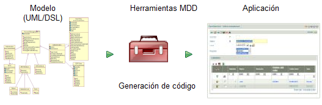\
  En el contexto de MDD el modelo es el medio para representar los datos y la lógica de la aplicación. Puede ser, bien mediante una notación gráfica, como UML, o bien mediante una notación textual como un Lenguaje Específico del Dominio (*Domain-Specific Language*, DSL).\
  Por desgracia, el uso de MDD es muy complejo. Requiere de una gran cantidad de tiempo, pericia y herramientas. Aun así la idea tras MDD sigue siendo muy buena, por lo tanto OpenXava toma esa idea de una manera simplificada. Usa simples clases de Java con anotaciones para definir el modelo y no usa generación de código, en vez de eso toda la funcionalidad de la aplicación es generada dinámicamente en tiempo de ejecución:

||**Definición del modelo**|**Generación de la aplicación**|
| :-: | :-: | :-: |
|MDD clásico|UML/DSL|Generación de código|
|OpenXava|Simple clases Java|Dinámicamente en tiempo de ejecución|

Podemos decir pues, que OpenXava es un Marco de trabajo Ligero Dirigido por el Modelo:\
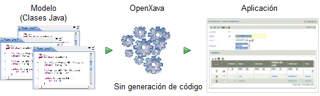\
A partir de clases Java simples obtienes una aplicación lista para usar. La siguiente sección sobre el concepto de Componente de Negocio revelará algunos detalles importantes sobre la naturaleza de estas clases.

**Componente de Negocio**

Un Componente de Negocio consiste en todos los artefactos de software relacionados con un concepto de negocio. Los componentes de negocio son tan solo una forma de organizar el software. La otra forma de organizar software es MVC (Model-View Controller), donde clasificas el código por datos (modelo), interfaz de usuario (vista) y lógica (controlador).\
Así se organizan los artefactos de software en una aplicación MVC:\
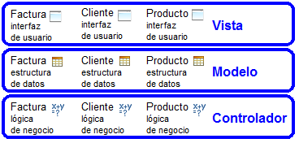\
Todos los artefactos para la interfaz de usuario de la aplicación, tales como archivos HTML, JavaScript, CSS, JSP, JSF, Swing, JavaFX, etc. están en el mismo lugar, la capa de la vista. Lo mismo ocurre para el modelo y el controlador. Esto contrasta con una arquitectura basada en componentes de negocio donde los artefactos de software se organizan alrededor de los conceptos de negocio, de esta manera:\
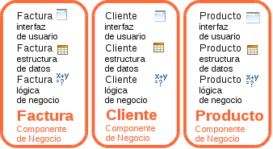\
Aquí, todos los artefactos de software acerca del concepto de factura, como la interfaz de usuario, acceso a base de datos, lógica de negocio, etc. están en un mismo lugar.\
¿Qué enfoque es mejor? Eso depende de tus necesidades. Si tienes que cambiar frecuentemente la estructura de los datos y la lógica de negocio entonces la opción de los componentes de negocio es muy práctica, porque todas las cosas que necesitas tocar cuando haces un cambio están en el mismo sitio y no esparcidas por multitud de archivos.\
La pieza básica para desarrollar aplicaciones OpenXava es el componente de negocio y la forma de definir un componente de negocio en OpenXava es usando una simple clase Java con anotaciones. Tal como se ilustra en este código:

***/\*\****

` `***\* Una clase Java para definir un componente de negocio.***

` `***\*/***

@[**Entity**](http://www.google.com/search?sitesearch=java.sun.com&q=allinurl%3Aj2se%2F1+5+0%2Fdocs%2Fapi+Entity)  *// Base de datos*

@Table(name="GSTFCT")  *// Base de datos*

@[**View**](http://java.sun.com/j2se/1%2E5%2E0/docs/api/javax/swing/text/View.html)(members=  *// Interfaz de usuario*

`    `"anyo, numero, fecha, pagada;" +

`    `"cliente, comercial;" +

`    `"detalles;" +

`    `"totales [ sumaImportes, porcentajeIva, iva ]"

)

**public** **class** Factura {

`    `@Id  *// Base de datos*

`    `@Column(length=4)  *// Base de datos*

`    `@Max(9999)  *// Validación*

`    `@Required  *// Validación*

`    `@DefaultValueCalculator(  *// Lógica de negocio declarativa*

`        `CurrentYearCalculator.**class**

`    `)

`    `**private** **int** anyo;  *// Estructura de datos (1)*

`    `@ManyToOne(fetch=FetchType.LAZY)  *// Base de datos*

`    `@DescriptionsList  *// Interfaz de usuario*

`    `**private** Comercial comercial;  *//  Estructura de datos*

`    `**public** **void** aplicarDescuentos() {  *// Lógica de negocio programática (2)*

...

`    `}

...

}

Como puedes ver, todo acerca del concepto de negocio de factura se define en un único lugar, la clase *Factura*. En esta clase defines cosas de base de datos, estructura de los datos, lógica de negocio, interfaz de usuario, validación, etc.\
Esto se hace usando la facilidad de metadatos de Java, las famosas anotaciones. Estas son las anotaciones usadas en este ejemplo:

|**Faceta**|**Metadatos**|**Implementado por**|
| :-: | :-: | :-: |
|Base de datos|@Entity, @Table, @Id, @Column, @ManyToOne|JPA|
|Interfaz de usuario|@View, @DescriptionsList|OpenXava|
|Validación|@Max, @Required|Bean Validation, OpenXava|
|Lógica de negocio|@DefaultValueCalculator|OpenXava|

Gracias a los metadatos puedes hacer la mayor parte del trabajo de una forma declarativa y el motor de JPA (el estándar Java para persistencia), Bean Validation (el estándar Java para validación) y OpenXava harán el trabajo sucio por ti.\
Además, usamos Java básico, como propiedades (*anyo* y *comercial*, 1) para definir la estructura de los datos, y los métodos (*aplicarDescuentos()*, 2) para la lógica de negocio programada.\
Todo lo que se necesita escribir sobre factura está en Factura*.java*. Es un componente de negocio. La magia de OpenXava es que puede producir una aplicación funcional a partir de componentes de negocio.

**Arquitectura de la aplicación**

Has visto como los componentes de negocio son las células básicas para construir una aplicación OpenXava, es más, puedes crear una aplicación OpenXava completa usando únicamente componentes de negocio. No obstante, hay otros ingredientes que puedes usar en una aplicación OpenXava.

**Perspectiva del desarrollador de aplicaciones**

Aunque puedes crear una aplicación completamente funcional usando solo componentes de negocio, a veces es necesario añadir algún que otro elemento adicional para poder ajustar el comportamiento de tu aplicación a tus necesidades. Una aplicación completa de OpenXava tiene la siguiente forma:\
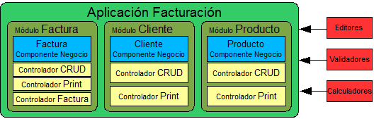\
Aparte de componentes de negocio puedes encontrar módulos, controladores, editores, validadores y calculadores. Veamos que son estas cosas:

- **Componentes de negocio**: Clases de Java que describen los conceptos de negocio en todos sus aspectos. Estas son las únicas piezas requeridas en una aplicación OpenXava.
- **Módulos**: Un módulo es lo que el usuario final ve. Es la unión de un componente de negocio y varios controladores. Puedes omitir la definición de los módulos, en ese caso se asume un módulo por cada componente de negocio.
- **Controladores**: Un controlador es una colección de acciones. Para el usuario, las acciones son botones o vínculos que él puede pulsar; para el desarrollador son clases con lógica a hacer cuando el usuario pulsa en esos botones. Los controladores definen el comportamiento de la aplicación y normalmente son reutilizables. OpenXava incluye un conjunto de controladores predefinidos y por supuesto puedes definir los tuyos propios.
- **Editores**: Componentes de la interfaz de usuario para definir la forma en que los miembros de un componente de negocio son visualizados y editados. Es una manera de personalizar la generación de la interfaz de usuario.
- **Validadores**: Lógica de validación reutilizable que puedes usar en cualquier componente de negocio.
- **Calculadores**: Lógica de negocio reutilizable que puedes usar en algunos puntos de los componentes de negocio.

  **Perspectiva del usuario**

  El usuario ejecuta los módulos, usualmente tecleando la URL del módulo en su navegador o accediendo desde el menú de la aplicación. Un módulo de OpenXava normalmente consta de un modo lista para navegar por los objetos:\
  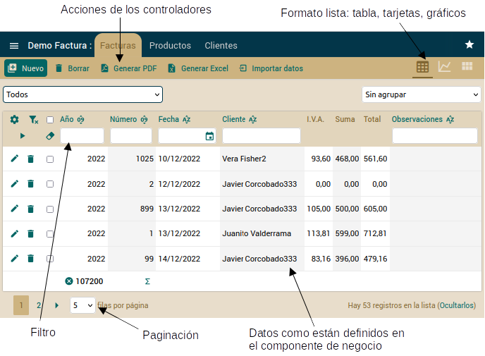\
  Y un modo detalle para editarlos:\
  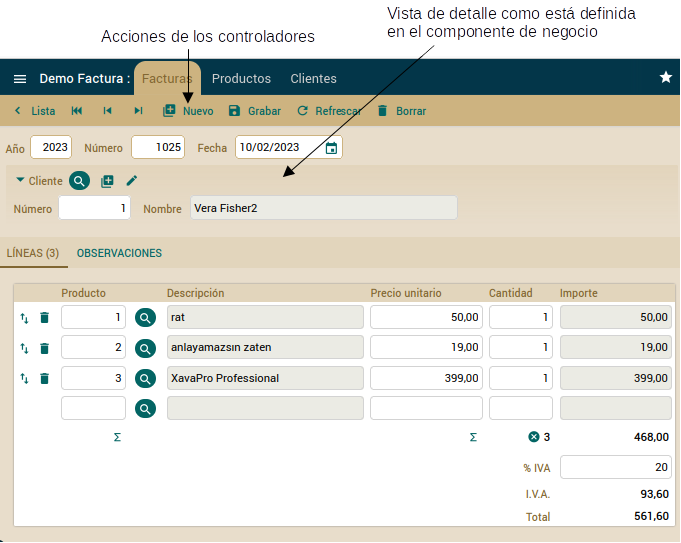\
  Esto muestra visualmente lo que es un módulo: una pieza funcional de software generada a partir de un componente de negocio (datos y lógica de negocio) y varios controladores (comportamiento).

  **Estructura del proyecto**

  Has visto el punto de vista conceptual y del usuario de una aplicación, pero ¿qué aspecto tiene una aplicación OpenXava para ti como desarrollador?:\
  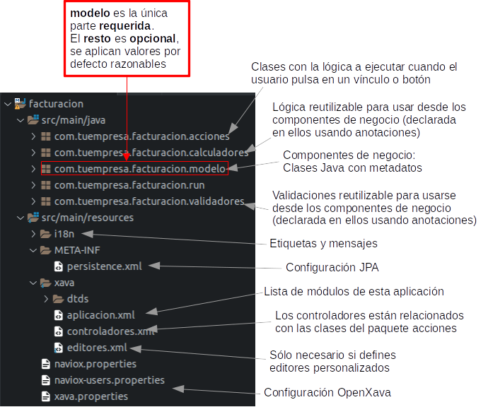\
  Sólo las clases en el paquete *modelo*, los componentes de negocio, son obligatorias. Esto es a vista de pájaro. Aprenderás muchos más detalles en el resto del libro.

  **Flexibilidad**

  OpenXava genera automáticamente una aplicación desde clases con metadatos. Esto incluye la generación automática de la interfaz de usuario. Puedes pensar que esto es demasiado “automático”, y es fácil que la interfaz de usuario resultante no cumpla con tus requerimientos, especialmente si estos son muy específicos. Esto no es así, las anotaciones de OpenXava te ofrecen flexibilidad suficiente para interfaces de usuario muy potentes que cubren la mayoría de los casos.\
  A pesar de eso, OpenXava te proporciona puntos de extensión para darte la oportunidad de personalizar la generación de la interfaz de usuario. Estos puntos de extensión incluyen editores y vistas personalizadas.

  **Editores**

  Los editores son los elementos de la interfaz de usuario para ver y editar los miembros de tu componente de negocio. OpenXava usa editores predefinidos para los tipos básicos, pero puedes crearte tus propios editores. En el siguiente ejemplo se usan editores predefinidos para números y cadenas, pero para la propiedad color se usa un editor personalizado:\
  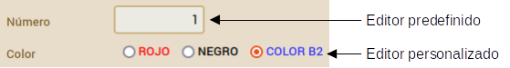\
  Puedes usar JSP, JavaScript, HTML, AJAX, o la tecnología de presentación web que quieras, para crear tu editor personalizado, y entonces asignarlo a los miembros o tipos que desees.\
  Esta es una manera bastante reutilizable de personalizar la generación de la interfaz de usuario en tu aplicación OpenXava.

  **Vista personalizada**

  A veces necesitas visualizar tu componente de negocio usando una interfaz de usuario especial, por ejemplo, usando una galería de fotos, un mapa, un gráfico, un cuadro de mandos, un calendario, etc. Para esto puedes usar una vista personalizada, que te permite generar la interfaz de usuario usando JavaScript, HTML, JSP, etc. a mano, incluso puedes usar librerías JavaScript de terceros. Esta vista hecha por ti la puedes incluir dentro de tu aplicación OpenXava. El siguiente pantallazo muestra un módulo OpenXava que usa una vista personalizada:\
  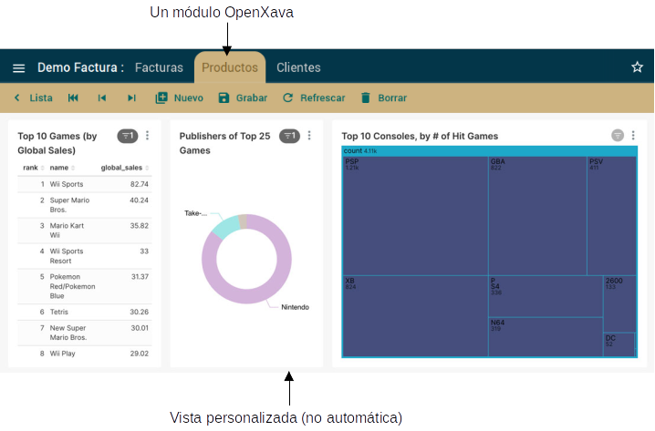\
  Resumiendo, OpenXava genera la interfaz de usuario automáticamente para ti, pero siempre tienes la opción de hacerlo tú mismo.

  **Resumen**

  OpenXava usa un enfoque dirigido por el modelo para hacer desarrollo rápido, donde tú escribes el modelo y obtienes una aplicación completa a partir de él. Lo especial de OpenXava es que el modelo está formado por componentes de negocio.\
  Un componente de negocio te permite estructurar la aplicación alrededor de los conceptos de negocio. En OpenXava una simple y llana clase Java con anotaciones es suficiente para definir un componente de negocio, haciendo el desarrollo de la aplicación bastante declarativo.\
  Aparte de los componentes de negocio una aplicación OpenXava tiene módulos, controladores, validadores, calculadores, etc. que puedes usar para personalizar tu aplicación. Es posible, incluso, personalizar la forma en que OpenXava genera la interfaz de usuario con los editores y las vistas personalizadas.\
  OpenXava es una solución pragmática para el desarrollo Java Empresarial. Genera muchísimas cosas automáticamente, pero a la vez es suficientemente flexible como para ser útil en el desarrollo de aplicaciones de gestión de la vida real.\
  Como conclusión, podrás desarrollar aplicaciones con simples clases Java con anotaciones. En los otros apéndices puedes aprender más detalles sobre las anotaciones que podemos usar con OpenXava.

- [**Apéndice B: Java Persistence API**](C:\Users\Soporte\Documents\openxava\openxava-doc\web\docs\jpa_es.html)

  Java Persistence API (JPA) es el estándar Java para hacer mapeo objeto-relacional. El mapeo objeto-relacional te permite acceder a los datos en una base de datos relacional usando un estilo orientado a objetos. En tu aplicación solo trabajas con objetos, estos objetos se declaran como persistentes, y es responsabilidad del motor JPA leer y grabar los objetos desde la base de datos a la aplicación.\
  JPA mitiga el famoso problema de desajuste de impedancia, que se produce porque las bases de datos relacionales tienen una estructura, tablas y columnas con datos simples, y las aplicaciones orientadas a objetos otra, clases con referencias, colecciones, interfaces, herencia, etc. Es decir, si en tu aplicación estás usando clases Java para representar conceptos de negocio, tendrás que escribir bastante código SQL para escribir los datos desde tus objetos a la base de datos y viceversa. JPA lo hace para ti.\
  Este lección es una introducción a JPA. Para una completa inmersión en esta tecnología estándar necesitarías leer un libro completo sobre JPA, de hecho, se citan algunos en el sumario de esta lección. OpenXava soporta JPA 2.2 desde v6.1.\
  Por otra parte, si ya conoces JPA puedes saltarte esta lección.

  **Anotaciones JPA**

  JPA tiene 2 aspectos diferenciados, el primero es un conjunto de anotaciones Java para añadir a tus clases marcándolas como persistentes y dando detalles acerca del mapeo entre las clases y las tablas. Y el segundo es un API para leer y escribir objetos desde tu aplicación. Veamos primero las anotaciones.

  **Entidad**

  En la nomenclatura JPA a una clase persistente se le llama entidad. Podemos decir que una entidad es una clase cuyas instancias se graban en la base de datos. Usualmente cada entidad representa un concepto del dominio, por lo tanto usamos una entidad JPA como base para definir un componente de negocio en OpenXava, de hecho puedes crear un aplicación completa de OpenXava a partir de simples entidades JPA. Una entidad JPA se define así:

  @[**Entity**](http://www.google.com/search?sitesearch=java.sun.com&q=allinurl%3Aj2se%2F1+5+0%2Fdocs%2Fapi+Entity)  *// Para definir esta clase como persistente*

  @Table(name="GSTCST")  *// Para indicar la tabla de la base de datos (opcional)*

  **public** **class** Cliente {

  Como puedes ver solo has de marcar tu clase con la anotación *@Entity* y opcionalmente también con la anotación *@Table*, en este caso estamos diciendo que la entidad *Cliente* se graba en la tabla GSTCST de la base de datos. De ahora en adelante, JPA guardará y recuperará información entre los objetos Cliente en la aplicación y la tabla GSTCST en la base de datos, como se muestra aquí:\
  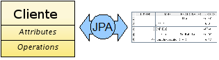\
  Además, marcar Cliente con *@Entity* es suficiente para que OpenXava la reconozca como un componente de negocio. Sí, en OpenXava “entidad” es sinónimo de componente de negocio.

  **Propiedades**

  El estado básico de una entidad se representa mediante propiedades. Las propiedades de una entidad son propiedades Java convencionales, con *getters* y *setters*:

  **private** [**String**](http://java.sun.com/j2se/1%2E5%2E0/docs/api/java/lang/String.html) nombre;

 

  **public** [**String**](http://java.sun.com/j2se/1%2E5%2E0/docs/api/java/lang/String.html) getNombre() {

  `    `**return** nombre;

  }

 

  **public** **void** setNombre([**String**](http://java.sun.com/j2se/1%2E5%2E0/docs/api/java/lang/String.html) nombre) {

  `    `**this**.nombre = nombre;

  }

  Por defecto las propiedades son persistentes, es decir, JPA asume que la propiedad *nombre* se almacena en la columna llamada 'nombre' de la tabla en la base de datos. Si quieres que una determinada propiedad no se guarde en la base de datos has de marcarla como *@Transient*:

  @Transient  *// Marcada como transitoria, no se almacena en la base de datos*

  **private** [**String**](http://java.sun.com/j2se/1%2E5%2E0/docs/api/java/lang/String.html) nombre;

 

  **public** [**String**](http://java.sun.com/j2se/1%2E5%2E0/docs/api/java/lang/String.html) getNombre() {

  `    `**return** nombre;

  }

 

  **public** **void** setNombre([**String**](http://java.sun.com/j2se/1%2E5%2E0/docs/api/java/lang/String.html) nombre) {

  `    `**this**.nombre = nombre;

  }

  Nota que hemos anotado el campo, puedes anotar el *getter* en su lugar, si así lo prefieres:

  **private** [**String**](http://java.sun.com/j2se/1%2E5%2E0/docs/api/java/lang/String.html) nombre;

 

  @Transient  *// Marcamos el getter, por tanto todas las anotaciones JPA*

  **public** [**String**](http://java.sun.com/j2se/1%2E5%2E0/docs/api/java/lang/String.html) getNombre() {  *//  en esta entidad tienen que estar en los getters*

  `    `**return** nombre;

  }

 

  **public** **void** setNombre([**String**](http://java.sun.com/j2se/1%2E5%2E0/docs/api/java/lang/String.html) nombre) {

  `    `**this**.nombre = nombre;

  }

  Esta norma aplica a todas la anotaciones JPA, puedes anotar el campo (acceso basado en el campo) o el *getter* (acceso basado en la propiedad), pero no mezcles los dos estilos en la misma entidad.\
  Otras anotaciones útiles para las propiedades son *@Column* para especificar el nombre y longitud de la columna de la tabla, e *@Id* para indicar que propiedad es la propiedad clave. Puedes ver el uso de estas anotaciones en la ya utilizable entidad *Cliente*:

  @[**Entity**](http://www.google.com/search?sitesearch=java.sun.com&q=allinurl%3Aj2se%2F1+5+0%2Fdocs%2Fapi+Entity)

  @Table(name="GSTCST")

  **public** **class** Cliente {

 

  `    `@Id  *// Indica que  number es la propiedad clave (1)*

  `    `@Column(length=5)  *// Aquí @Column indica solo la longitud (2)*

  `    `**private** **int** numero;

 

  `    `@Column(name="CSTNAM", length=40)  *// La propiedad name se mapea a la columna*

  `    `**private** [**String**](http://java.sun.com/j2se/1%2E5%2E0/docs/api/java/lang/String.html) nombre;             *// CSTNAM en la base de datos*

 

  `    `**public** **int** getNumero() {

  `        `**return** numero;

  `    `}

 

  `    `**public** **void** setNumero(**int** numero) {

  `        `**this**.numero = numero;

  `    `}

 

  `    `**public** [**String**](http://java.sun.com/j2se/1%2E5%2E0/docs/api/java/lang/String.html) getNombre() {

  `        `**return** nombre;

  `    `}

 

  `    `**public** **void** setNombre([**String**](http://java.sun.com/j2se/1%2E5%2E0/docs/api/java/lang/String.html) nombre) {

  `        `**this**.nombre = nombre;

  `    `}

 

  }

  Es obligatorio que al menos una propiedad sea clave (1). Has de marcar la propiedad clave con *@Id* y normalmente se mapea contra la columna clave de la tabla. *@Column* puede usarse para indicar la longitud sin el nombre de columna (2). La longitud es usada por el motor JPA para la generación de esquema, pero también es usada por OpenXava para conocer el tamaño del editor en la interfaz de usuario. A partir del código de la entidad *Cliente* OpenXava genera la siguiente interfaz de usuario:\
  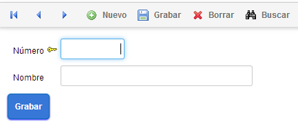\
  Ahora que ya sabes como definir propiedades básicas en tu entidad, aprendamos como declarar relaciones entre entidades usando referencias y colecciones.

  **Referencias**

  Una entidad puede hacer referencia a otra entidad. Únicamente has de definir una referencia Java convencional anotada con la anotación JPA @*ManyToOne*:

  @[**Entity**](http://www.google.com/search?sitesearch=java.sun.com&q=allinurl%3Aj2se%2F1+5+0%2Fdocs%2Fapi+Entity)

  **public** **class** Factura {

 

  `    `@ManyToOne(  *// La referencia se almacena como una relación a nivel de base de datos (1)*

  `        `fetch=FetchType.LAZY,  *// La referencia se cargará bajo demanda (2)*

  `        `optional=**false**)  *// La referencia tiene que tener valor siempre*

  `    `@JoinColumn(name="INVCST")  *// INVCST es la columna para la clave foranea (3)*

  `    `**private** Cliente cliente;  *// Una referencia Java convencional (4)*

 

  `    `*// Getter y setter para cliente*

  Como puedes ver hemos declarado una referencia a *Cliente* dentro de *Factura* en un estilo Java simple y llano (4). *@ManyToOne* (1) es para indicar que esta referencia se almacenará en la base de datos como una relación muchos-a-uno entre la tabla para *Factura* y la tabla para *Cliente*, usando la columna INVCST (3) como clave foránea. *@JoinColumn* (3) es opcional. JPA asume valores por defecto para las columnas de unión (CLIENTE\_NUMERO en este caso).\
  Si usas *fetch=FetchType.LAZY* (3) los datos del objeto *Cliente* no se cargarán hasta que se usen por primera vez. Es decir, en el momento justo que uses la referencia a *Cliente*, por ejemplo, llamando al método *factura.getCliente().getNombre()* los datos del *Cliente* son cargados desde la base de datos. Es aconsejable usar siempre *lazy fetching*.\
  Una referencia Java convencional normalmente corresponde a una relación *@ManyToOne* en JPA y a una asociación \*..1 en UML:\
  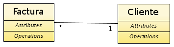\
  Esta es la interfaz de usuario que OpenXava genera automáticamente para una referencia:\
  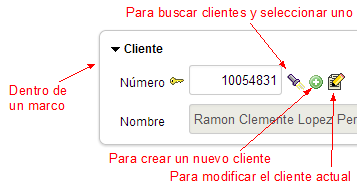\
  Has visto como hacer referencia a otras entidades, pero también puedes hacer referencia a otros objetos que no son entidades, por ejemplo, a objetos incrustados.

  **Clases incrustables**

  Además de entidades puedes usar clases incrustables para modelar algunos conceptos de tu dominio. Si tienes una entidad A que tiene una referencia a B, modelarías B como una clase incrustable cuando:

- Puedas decir que A tiene un B.
- Si A es borrado su B es borrado también.
- B no es compartido.

  A veces el mismo concepto puede ser modelado como incrustable o como entidad. Por ejemplo, el concepto de dirección. Si una dirección es compartida por varias personas entonces tienes que usar una referencia a una entidad, mientras que si cada persona tiene su propia dirección quizás un objeto incrustable sea mejor opción.\
  Modelemos una dirección como una clase incrustable. Es fácil, simplemente crea una simple clase Java y anótala como *@Embeddable*:

  @Embeddable  *// Para definir esta clase como incrustable*

  **public** **class** Direccion {

 

  `    `@Column(length=30)  *// Puedes usar  @Column como en una entidad*

  `    `**private** [**String**](http://java.sun.com/j2se/1%2E5%2E0/docs/api/java/lang/String.html) viaPublica;

 

  `    `@Column(length=5)

  `    `**private** **int** codigoPostal;

 

  `    `@Column(length=20)

  `    `**private** [**String**](http://java.sun.com/j2se/1%2E5%2E0/docs/api/java/lang/String.html) poblacion;

 

  `    `*// Getters y setters*

      ...

  }

  Y ahora, crear una referencia a *Direccion* desde una entidad también es fácil. Se trata simplemente de una referencia Java normal anotada como *@Embedded*:

  @[**Entity**](http://www.google.com/search?sitesearch=java.sun.com&q=allinurl%3Aj2se%2F1+5+0%2Fdocs%2Fapi+Entity)

  @Table(name="GSTCST")

  **public** **class** Cliente {

 

 

  `    `@Embedded  *// Referencia a una clase incrustable*

  `    `**private** Direccion direccion;  *// Una referencia Java convencional*

 

  `    `*// Getter y setter para address*

      ...

  }

  Desde el punto de vista de la persistencia un objeto incrustable se almacena en la misma tabla que su entidad contenedora. En este caso las columnas viaPublica, codigoPostal y poblacion están en la tabla para *Cliente*. *Direccion* no tiene tabla propia.\
  OpenXava genera automáticamente para una referencia a una clase incrustable una interfaz de usuario como esta:\
  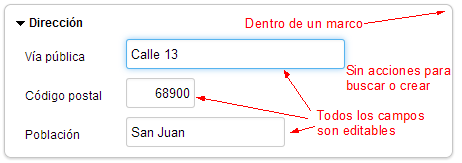

  **Colecciones**

  Una entidad puede tener una colección de entidades. Sólo has de definir una colección de Java convencional anotada con las anotaciones JPA *@OneToMany* o *@ManyToMany*:

  @[**Entity**](http://www.google.com/search?sitesearch=java.sun.com&q=allinurl%3Aj2se%2F1+5+0%2Fdocs%2Fapi+Entity)

  **public** **class** Cliente {

 

  `    `@OneToMany(  *// La colección es persistente (1)*

  `        `mappedBy="cliente")      *// La referencia cliente de Factura se usa*

  `                                        `*// para mapear la relación a nivel de base de datos (2)*

  `    `**private** [**Collection**](http://java.sun.com/j2se/1%2E5%2E0/docs/api/java/util/Collection.html)<Factura> facturas;  *// Una colección Java convencional (3)*

 

  `    `*// Getter y setter para facturas*

      ...

  }

  Como puedes ver declaramos una colección de entidades *Factura* dentro de *Cliente* en un estilo Java plano (3). *@OneToMany* (1) es para indicar que esta colección se almacena en la base de datos con una relación uno-a-muchos entre la tabla para *Cliente* y la tabla para *Factura*, usando la columna de *cliente* en *Factura* (normalmente una clave foránea hacia la tabla de *Cliente* desde la tabla de *Factura*) .\
  Una colección de entidades en Java corresponde a una relación *@OneToMany* o *@ManyToMany* en JPA y a una asociación con una multiplicidad 1..\* o \*..\* en UML:\
  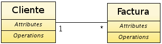\
  Se puede simular la semántica de los objetos incrustados usando una colección de entidades con el atributo *cascade* de *@OneToMany*:

  @[**Entity**](http://www.google.com/search?sitesearch=java.sun.com&q=allinurl%3Aj2se%2F1+5+0%2Fdocs%2Fapi+Entity)

  **public** **class** Factura {

 

  `    `@OneToMany (mappedBy="factura",

  `        `cascade=CascadeType.REMOVE)  *// Cascade REMOVE para simular incrustamiento*

  `    `**private** [**Collection**](http://java.sun.com/j2se/1%2E5%2E0/docs/api/java/util/Collection.html)<DetalleFactura> detalles;

 

  `    `*// Getter y setter para detalles*

      ...

  }

  *DetalleFactura* es una entidad:

  @[**Entity**](http://www.google.com/search?sitesearch=java.sun.com&q=allinurl%3Aj2se%2F1+5+0%2Fdocs%2Fapi+Entity)

  **public** **class** DetalleFactura {

  ...

  }

  Así, cuando una factura se borra sus líneas de detalle se borran también. Podemos decir que una factura tiene líneas de detalle.\
  Esta es la interfaz de usuario que OpenXava genera automáticamente para una colección de entidades:\
  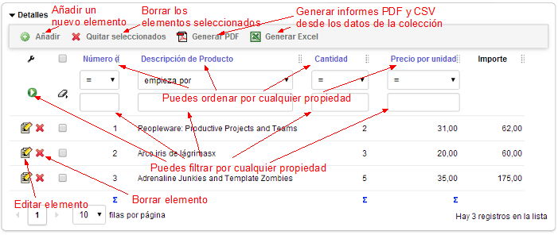\
  Hay algunas ligeras diferencias en el comportamiento de la interfaz de usuario si usas cascade REMOVE o ALL. Con *cascade* REMOVE o ALL cuando el usuario pulsa para añadir un nuevo elemento, puede introducir todos los datos del elemento, por otra parte si tu colección no es *cascade* REMOVE o ALL , cuando el usuario pulsa para añadir un nuevo elemento se muestra una lista de entidades para escoger.\
  Además, se puede definir una colección de auténticos objetos embebidos. Podriamos reescribir el ejemplo de los detalles de factura así:

  @[**Entity**](http://www.google.com/search?sitesearch=java.sun.com&q=allinurl%3Aj2se%2F1+5+0%2Fdocs%2Fapi+Entity)

  **public** **class** Factura {

 

  @ElementCollection

  **private** [**Collection**](http://java.sun.com/j2se/1%2E5%2E0/docs/api/java/util/Collection.html)<DetalleFactura> detalles;

 

  *// Getter and setter for details*

  ...

  }

  Fíjate que anotamos la colección con *@ElementCollection*. En este caso *DetalleFactura* es una clase incrustada anotada con *@Embeddable*:

  @Embeddable

  **public** **class** DetalleFactura {

  ...

  }

  La interfaz de usuario que OpenXava genera para una *@ElementCollection*:\
  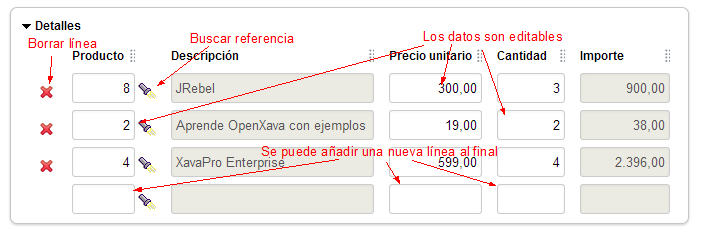\
  En una colección de elementos (*@ElementCollection*) el usuario puede editar cualquier propiedad de cualquier fila en cualquier momento. También se puede quitar y añadir filas, pero los datos no se grabarán en la base de datos hasta que la entidad principal se grabe.\
  Hay muchos casos que se pueden modelar con *@OneToMany(cascade=CascadeType.REMOVE)* o *@ElementCollection*. Ambas opciones borran los elementos de la colección cuando la entidad contenedora se borra. Ambas opciones tiene la semántica de incrustado, es decir podemos decir "tiene un". Escoger una opción es fácil para un programador OpenXava, porque cada opción genera una interfaz de usuario totalmente diferente.

  **Clave compuesta**

  Es mejor evitar el uso de claves compuestas. Siempre tienes la opción de usar un identificador oculto autogenerado. Aunque, algunas veces tienes la necesidad de conectarte a bases de datos legadas o puede que el diseño del esquema lo haya hecho alguien que le gustan las claves compuestas, y no tengas otra opción que usar claves compuestas aunque no sea lo ideal. Por lo tanto, vamos a aprender como usar una clave compuesta.\
  Veamos una versión sencilla de una entidad *Factura*:

**package** com.tuempresa.facturacion.modelo;

**import** java.time.\*;\
**import** java.util.\*;

**import** javax.persistence.\*;

**import** org.openxava.annotations.\*;

**@Entity**

**@IdClass**(FacturaKey.class) *// La clase id contiene todas las propiedades clave (1)*

**public** **class** **Factura** {

`    `**@Id** *// Aunque tenemos las clase id aún es necesario marcarlo como @Id (2)*

`    `**@Column**(length = 4)

`    `**private** **int** anyo;

`    `**@Id** *// Aunque tenemos las clase id aún es necesario marcarlo como @Id (2)*

`    `**@Column**(length = 6)

`    `**private** **int** numero;

`    `**@Required**

`    `**private** LocalDate fecha;

`    `**@Stereotype**("MEMO")

`    `**private** String observaciones;

`    `*// RECUERDA GENERAR LOS GETTERS Y SETTERS PARA LOS CAMPOS*

}

Si quieres usar *anyo* y *numero* como clave compuesta para *Factura*, una forma de hacerlo, es marcándolos con *@Id* (2), y además tener una clase id (1). La clase id tiene que tener *anyo* y *numero* como propiedades. Puedes ver *FacturaKey* aquí:

**package** com.tuempresa.facturacion.modelo;

**public** **class** **FacturaKey** **implements** **java**.**io**.**Serializable** { *// La clase key tiene que ser serializable*

`    `**private** **int** anyo; *// Contiene las propiedades marcadas ...*

`    `**private** **int** numero; *// ... como @Id en la entidad*

`    `**public** **boolean** **equals**(Object obj) { *// Ha de definir el método equals*

`        `**if** (obj == **null**) **return** **false**;

`        `**return** obj.toString().equals(**this**.toString());

`    `}

`    `**public** **int** **hashCode**() { *// Ha de definir el método hashCode*

`        `**return** toString().hashCode();

`    `}

`    `**public** String **toString**() {

`        `**return** "FacturaKey::" + anyo + ":" + numero;

`    `}

`    `*// RECUERDA GENERAR LOS GETTERS Y SETTERS PARA anyo Y numero*

}

En este código se ven algunos de los requerimientos para una clase id, como el ser serializable e implementar *hashCode()* y *equals()*. OpenXava Studio (o Eclipse) puede generartelos con *Source > Generate hashCode() and equals()...*

Has visto como escribir tus entidades usando anotaciones JPA, y como OpenXava las interpreta para así generar una interfaz de usuario adecuada. Ahora vas a aprender como usar el API JPA para leer y escribir de la base de datos de desde tu propio código.

**API JPA**

La clase de JPA más importante es *javax.persistence.EntityManager*. Un *EntityManager* te permite grabar, modificar y buscar entidades.\
El siguiente código muestra la forma típica de usar JPA en una aplicación no OpenXava:

EntityManagerFactory f =  *// Necesitas un EntityManagerFactory para crear un  manager*

`    `Persistence.createEntityManagerFactory("default");

EntityManager manager = f.createEntityManager();  *// Creas el manager*

manager.getTransaction().begin();  *// Has de empezar una transacción*

Cliente cliente = **new** Cliente();  *// Ahora creas tu entidad*

cliente.setNumero(1);  *// y la rellenas*

cliente.setNombre("JAVI");

manager.persist(cliente);  *// persist marca el objeto como persistente*

manager.getTransaction().commit();      *// Al confirmar la transacción los cambios se*

`                                                `*// efectúan en la base de datos*

manager.close();  *// Has de cerrar el manager*

Ves como es una forma muy verbosa de trabajar. Demasiado código burocrático. Si así lo prefieres puedes usar código como éste dentro de tus aplicaciones OpenXava, aunque OpenXava te ofrece una forma más sucinta de hacerlo:

Cliente cliente = **new** Cliente();

cliente.setNumero(1);

cliente.setNombre("PEDRO");

XPersistence.getManager().persist(cliente);  *// Esto es suficiente (1)*

Dentro de un aplicación OpenXava puedes obtener el *manager* mediante la clase *org.openxava.jpa.XPersistence*. No necesitas cerrar el *manager*, ni arrancar y parar la transacción. Este trabajo sucio lo hace OpenXava por ti. El código de arriba es suficiente para grabar una nueva entidad en la base de datos (1).\
Si quieres modificar una entidad existente has de hacerlo así:

Cliente cliente = XPersistence.getManager()

.find(Cliente.**class**, 1);  *// Primero, buscas el objeto a modificar (1)*

cliente.setNombre("PEDRITO");  *// Entonces, cambias el estado del objeto. Nada más*

Para modificar un objeto solo has de buscarlo y modificarlo. JPA es responsable de grabar los cambios en la base de datos al confirmar la transacción (a veces antes), y OpenXava confirma las transacciones JPA automáticamente.\
Has visto como encontrar por clave primaria, usando *find()*. Además, JPA te permite usar consultas:

Cliente pedro = (Cliente) XPersistence.getManager()

.createQuery(

`        `"from Cliente c where c.nombre = 'PEDRO')")  *// Consulta JPQL (1)*

.getSingleResult();  *// Para obtener una única entidad (2)*

[**List**](http://www.google.com/search?sitesearch=java.sun.com&q=allinurl%3Aj2se%2F1+5+0%2Fdocs%2Fapi+List) pedros = XPersistence.getManager()

.createQuery(

`        `"from Cliente c where c.nombre like 'PEDRO%')")  *// Consulta JPQL*

.getResultList();  *// Para obtener una colección de entidades (3)*

Puedes usar el lenguaje de consultas de JPA (Java Persistence Query Language, JPQL, 1) para crear consultas complejas sobre tu base de datos, y obtener una entidad única, usando el método *getSingleResult()* (2), o una colección de entidades mediante el *getResultList()* (3).

Este Apendice ha sido una breve introducción a la tecnología JPA. Por desgracia, muchas e interesantes cosas sobre JPA se nos han quedado en el tintero, como la herencia, el polimorfismo, las claves compuestas, relaciones uno a uno y muchos a muchos, relaciones unidireccionales, métodos de retrollamada, consultas avanzadas, etc. De hecho, hay más de 80 anotaciones en JPA. Necesitaríamos varios libros completos para aprender todos los detalles sobre JPA.\
Afortunadamente, tendrás la oportunidad de aprender algunos casos de uso avanzados de JPA en el transcurso de este curso. Y si aun quieres aprender más, lee libros y referencias, como por ejemplo:

- [*Java Persistence API Specification*](https://jcp.org/en/jsr/detail?id=338) por Linda DeMichiel. 
- [*Pro JPA 2*](https://books.google.es/books?id=Mh5KDwAAQBAJ) por Mike Keith and Merrick Schincariol.
- [*Java Persistence with Hibernate*](http://www.amazon.com/Java-Persistence-Hibernate-Christian-Bauer/dp/1617290459/) por Christian Bauer y Gavin King.

  JPA es una tecnología indisputable en el universo Java de empresa, por tanto todo el conocimiento y código que acumulemos alrededor de JPA es siempre una buena inversión.

- [**Apéndice C: Anotaciones**](C:\Users\Soporte\Documents\openxava\openxava-doc\web\docs\annotations_es.html)

  Las anotaciones son la herramienta que Java provee para definir metadatos en tus aplicaciones, en otras palabras, es la forma de hacer desarrollo declarativo con Java, donde dices el “qué” y no el “cómo”.\
  En esta lección verás las anotaciones que puedes usar en una aplicación OpenXava para definir validaciones, la interfaz de usuario y otros aspectos para ajustar la aplicación a tus necesidades.\
  El objetivo de esta lección es introducirte a estas anotaciones, pero no te muestra todas su sutilezas y posibles casos de uso; lo cual requeriría varios libros de los gordos.
  ## **Validación**
  OpenXava incluye un marco de validación fácil de usar y extensible. Además soporta [Bean Validation](http://beanvalidation.org/) e [Hibernate Validator](http://hibernate.org/validator/).
  ### **Validación declarativa**
  La forma preferida de hacer validación en OpenXava es mediante anotaciones, es decir, de manera declarativa. Por ejemplo, sólo has de marcar una propiedad como *@Required*:

  @Required  *// Esto fuerza a validar esta propiedad como requerida al grabar*

  **private** [**String**](http://java.sun.com/j2se/1%2E5%2E0/docs/api/java/lang/String.html) nombre;

  Y OpenXava hará la validación correspondiente al grabar:\
  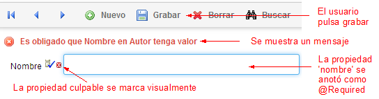
  ### **Validaciones predefinidas**
  Las anotaciones de validación que OpenXava tiene incluidas (en *org.openxava.annotations*) son:

|**Anotación**|**Aplica a**|**Validación**|
| :-: | :-: | :-: |
|@Required|Propiedad|Comprueba si la propiedad tiene valor|
|@PropertyValidator|Propiedad|Permite definir una lógica de validación personalizada|
|@EntityValidator|Entidad|Permite definir una lógica de validación personalizada|
|@RemoveValidator|Entidad|Permite definir una lógica de validación personalizada al borrar|

Las anotaciones de Bean Validation (*javax.validation.constraints*) son reconocidas por OpenXava, por tanto puedes usar todas las anotaciones predefinidas de Bean Validation en tus aplicaciones OpenXava:

|**Anotación**|**Aplica a**|**Validación**|
| :-: | :-: | :-: |
|@Max(value=)|Propiedad (numérica)|Comprueba que el valor sea igual o menor al máximo|
|@Min(value=)|Propiedad (numérica)|Comprueba que el valor sea igual o mayor al mínimo|
|@DecimalMax(value=)|Propiedad (numérica o cadena representando un valor numérico)|Comprueba que el valor sea igual o menor al máximo el cual puede contener decimales|
|@DecimalMin(value=)|Propiedad (numérica o cadena representando un valor numérico)|Comprueba que el valor sea igual o mayor al mínimo el cual puede contener decimales|
|@NotNull|Propiedad|Comprueba que el valor no sea nulo|
|@Null|Propiedad|Comprueba que el valor sea nulo|
|@Past|Propiedad (fecha o calendario)|Comprueba que la fecha esté en el pasado|
|@Future|Propiedad (fecha o calendario)|Comprueba que la fecha esté en el futuro|
|@Pattern(regexp="regexp", flags=)|Propiedad (cadena)|Comprueba que la propiedad cumpla la expresión regular dado un *match flag*|
|@Size(min=, max=)|Propiedad (cadena, array, colección, mapa)|Comprueba que la cantidad de elementos esté entre min y max (ambos incluidos)|
|@AssertFalse|Propiedad|Comprueba que el método se evalúe a falso (útil para restricciones expresadas con código en vez de por anotaciones)|
|@AssertTrue|Propiedad|Comprueba que el método se evalúe a cierto (útil para restricciones expresadas con código en vez de por anotaciones)|
|@Digits(integer=, fraction=)|Propiedad (numérica o cadena representando un valor numérico)|Comprueba que la propiedad sea un número con como máximo los enteros indicados en *integer* y los decimales indicados en *fraction*|

A partir de OpenXava 6.1 se soporta Bean Validation 2.0, por lo que también tenemos disponibles las siguientes anotaciones en *javax.validation.constraints*:

|**Anotación**|**Aplica a**|**Validación**|
| :-: | :-: | :-: |
|@Email|Propiedad (cadena)|Comprueba que la cadena cumpla con la especificación de formato para una dirección de correo electrónico|
|@NotEmpty|Propiedad (cadena, array, colección, mapa)|Comprueba que el valor no sea nulo ni esté vacío|
|@NotBlank|Propiedad (cadena)|Comprueba que la cadena no sea nulo y su longitud sea mayor de cero después de hacer un *trim()*|
|@Positive|Propiedad (numérica)|Comprueba si el valor es positivo|
|@PositiveOrZero|Propiedad (numérica)|Comprueba si el valor es positivo o cero|
|@Negative|Propiedad (numérica)|Comprueba si el valor es negativo|
|@NegativeOrZero|Propiedad (numérica)|Comprueba si el valor es negativo o cero|
|@PastOrPresent|Propiedad (fecha u hora)|Comprueba si la fecha u hora está en el presente o en el pasado|
|@FutureOrPresent|Propiedad (fecha u hora)|Comprueba si la fecha u hora está en el presente o en el futuro|

También puedes usar las anotaciones de Hibernate Validator (*org.hibernate.validator.constraints*):

|**Anotación**|**Aplica a**|**Validación**|
| :-: | :-: | :-: |
|@Length(min=, max=)|Propiedad (cadena)|Comprueba que la longitud de la cadena esté dentro del rango|
|@NotEmpty ***Obsoleto, usa el @NotEmpty estándar en su lugar***|Propiedad (cadena, array, colección, mapa)|Comprueba que el valor no sea nulo ni esté vacío|
|@Range(min=, max=)|Propiedad (numérica o cadena representando un valor numérico)|Comprueba que el valor este entre min y max (ambos incluidos)|
|@Email ***Obsoleto, usa el @Email estándar en su lugar***|Propiedad (cadena)|Comprueba que la cadena cumpla con la especificación de formato para una dirección de correo electrónico|
|@CreditCardNumber(ignoreNonDigitCharacters=)|Propiedad (cadena)|Comprueba si la cadena es un número de tarjeta de crédito bien formateado (derivado del algoritmo del Luhn)|
|@EAN|Propiedad (cadena)|Comprueba que la cadena sea un código EAN o UPC-A correctamente formateado|
|@LuhnCheck(startIndex=, endIndex=, checkDigitIndex=, ignoreNonDigitCharacters=)|Propiedad (cadena)|Comprueba que los dígitos en la cadena pasen el algoritmo de Luhn|
|@Mod10Check(multiplier=, weight=, startIndex=, endIndex=, checkDigitIndex=, ignoreNonDigitCharacters=)|Propiedad (cadena)|Comprueba que los dígitos en la cadena pasen el algoritmo genérico mod 10|
|@Mod11Check(threshold=, startIndex=, endIndex=, checkDigitIndex=, ignoreNonDigitCharacters=, treatCheck10As=, treatCheck11As=)|Propiedad (cadena)|Comprueba que los dígitos en la cadena pasen el algoritmo genérico mod 11|
|@NotBlank ***Obsoleto, usa el @NotBlank estándar en su lugar***|Propiedad (cadena)|Comprueba que la cadena no sea nulo y su longitud sea mayor de cero después de hacer un *trim()*|
|@SafeHtml(whitelistType=, additionalTags=, additionalTagsWithAttributes=) ***No disponible desde la v7.4.3***|Propiedad (cadena)|Comprueba que la cadena no contenga fragmentos potencialmente peligrosos como *<script/>*|
|@ScriptAssert(lang=, script=, alias=)|Propiedad (cualquier tipo)|Comprueba que el script provisto pueda ser evaluado con éxito contra el valor de la propiedad|
|@URL(protocol=, host=, port= regexp=, flags=)|Propiedad (cadena)|Comprueba que la cadena sea una URL válida según RFC2396|

A partir de OpenXava 6.1 se soporta Hibernate Validator 6.0, por lo que también tenemos disponibles las siguiente anotaciones en *org.hibernate.validator.constraints*:

|**Anotación**|**Aplica a**|**Validación**|
| :-: | :-: | :-: |
|@CodePointLength|Propiedad (cadena)|Comprueba si la longitud de punto de código está entre min y max ambos incluidos|
|@Currency|Propiedad (MonetaryAmount de javax.money)|Comprueba si la MonetaryAmount tiene que estar en la CurrencyUnit correcta|
|@ISBN|Propiedad (cadena)|Comprueba si la cadena es un ISBN válido. La longitud del número y el dígito de control se verifican|
|@UniqueElements|Propiedad (colección)|Comprueba que cada uno de los objetos de la colección es único, es decir, no podemos encontrar 2 elementos iguales en la colección|
### **Validación propia**
Añadir tu propia lógica de validación a tu entidad es muy fácil porque las anotaciones *@PropertyValidator*, *@EntityValidator* y *@RemoveValidator* te permiten indicar una clase (el validador) con la lógica de validación.\
Por ejemplo, si quieres tu propia lógica para validar una propiedad *precioUnitario*, has de escribir algo parecido a esto:

@PropertyValidator(ValidadorPrecioUnitario.**class**)  *// Contiene la lógica de validación*

**private** [**BigDecimal**](http://java.sun.com/j2se/1%2E5%2E0/docs/api/java/math/BigDecimal.html) precioUnitario;

Y ahora puedes escribir la lógica que quieras dentro de la clase *ValidadorPrecioUnitario*:

**public** **class** ValidadorPrecioUnitario

`    `**implements** IPropertyValidator {  *// Tiene que implementar IPropertyValidator (1)*

`    `**public** **void** validate(  *// Requerido por IPropertyValidator (2)*

`        `Messages errores,  *// Aquí añades los mensajes de error(3)*

`        `[**Object**](http://www.google.com/search?sitesearch=java.sun.com&q=allinurl%3Aj2se%2F1+5+0%2Fdocs%2Fapi+Object) objeto,  *// El valor a validar*

`        `[**String**](http://java.sun.com/j2se/1%2E5%2E0/docs/api/java/lang/String.html) nombreObjeto,  *// El nombre de entidad, normalmente para usar en el mensaje*

`        `[**String**](http://java.sun.com/j2se/1%2E5%2E0/docs/api/java/lang/String.html) nombrePropiedad)  *// El nombre de propiedad, normalmente para usar en el mensaje*

`    `{

`        `**if** (objeto == **null**) **return**;

`        `**if** (!(objeto **instanceof** [**BigDecimal**](http://java.sun.com/j2se/1%2E5%2E0/docs/api/java/math/BigDecimal.html))) {

`            `errores.add(  *// Si añades un error la validación fallará*

`                `"tipo\_esperado",  *// Id de mensaje en el archivo i18n*

`                `nombrePropiedad,  *// Argumentos para el mensaje i18n*

`                `nombreObjeto,

`                `"bigdecimal");

`            `**return**;

`        `}

`        `[**BigDecimal**](http://java.sun.com/j2se/1%2E5%2E0/docs/api/java/math/BigDecimal.html) n = ([**BigDecimal**](http://java.sun.com/j2se/1%2E5%2E0/docs/api/java/math/BigDecimal.html)) objeto;

`        `**if** (n.intValue() > 1000) {

`            `errors.add("no\_mayor\_de\_1000");  *// Id de mensaje en el archivo i18n*

`        `}

`    `}

}

Como ves tu clase validador ha de implementar *IPropertyValidator* (1), esto te obliga a tener un método *validate()* (2) que recibe un objeto *Messages*, que llamamos *errores* (3); que es un contenedor de los mensajes de error. Solo necesitas añadir algún mensaje de error para hacer que falle la validación.\
Esta es una forma sencilla de hacer tus propias validaciones, además la lógica de validación en tus validadores puede reutilizarse por toda tu aplicación. Aunque, si lo que quieres es crear validaciones reutilizables una opción mejor es crear tu propia anotación de validación usando Bean Validation; es más largo que usar una clase validador, pero es más elegante si reutilizas la validación muchas veces.
## **Interfaz de usuario**
Aunque OpenXava genera automáticamente una interfaz de usuario bastante funcional a partir de una entidad JPA desnuda, esto es solo útil para casos muy básicos. En aplicaciones de la vida real es necesario refinar la manera en que la interfaz de usuario es generada. En OpenXava esto se hace con anotaciones que, con un nivel de abstracción alto, definen el aspecto de la interfaz de usuario.
### **La interfaz de usuario por defecto**
Por defecto, OpenXava genera una interfaz de usuario que muestra todos los miembros de la entidad en secuencia. Con una entidad como esta:

@[**Entity**](http://www.google.com/search?sitesearch=java.sun.com&q=allinurl%3Aj2se%2F1+5+0%2Fdocs%2Fapi+Entity)

**public** **class** Comercial {

`    `@Id @Column(length=3)

`    `**private** **int** numero;

`    `@Column(length=40) @Required

`    `**private** [**String**](http://java.sun.com/j2se/1%2E5%2E0/docs/api/java/lang/String.html) nombre;

`    `@OneToMany(mappedBy="comercial")

`    `**private** [**Collection**](http://java.sun.com/j2se/1%2E5%2E0/docs/api/java/util/Collection.html)<Cliente> clientes;

`    `*// Getters y setters*

...

}

OpenXava producirá para ti la siguiente interfaz de usuario:\
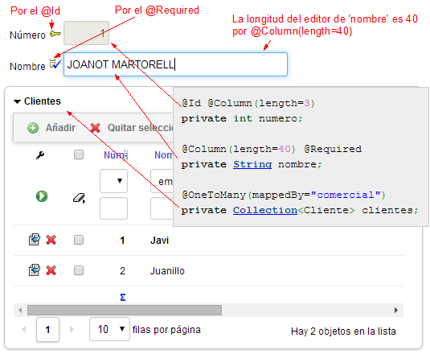\
Como ves, muestra los miembros (*numero*, *nombre* y *clientes* en este caso) en el mismo orden en que fueron declarados en el código Java. OpenXava usa las anotaciones JPA y de validación para generar la mejor interfaz de usuario posible, por ejemplo, determina el tamaño del editor a partir de *@Column(length)*, muestra la llavecita de clave para la propiedad con *@Id* y muestra un icono para indicar que es requerido si la propiedad está marcada con *@Required* y así por el estilo.\
Esta interfaz por defecto es útil para casos simples, pero para interfaces de usuario más avanzadas necesitas una forma de personalizar. OpenXava te proporciona anotaciones para hacerlo, tal como *@View* para definir la disposición de los miembros.
### **La anotación @View**
*@View* sirve para definir la disposición de los miembros en la interfaz de usuario. Se define a nivel de entidad:

@[**Entity**](http://www.google.com/search?sitesearch=java.sun.com&q=allinurl%3Aj2se%2F1+5+0%2Fdocs%2Fapi+Entity)

@[**View**](http://java.sun.com/j2se/1%2E5%2E0/docs/api/javax/swing/text/View.html)(members=

`    `"ano, numero, fecha;" +  *// Coma indica en la misma línea*

`    `"descuentos [" +  *// Entre corchetes indica dentro de un marco*

`    `"    descuentoCliente, descuentoTipoCliente;" +

`    `"];" +

`    `"observaciones;" +  *// Punto y coma indica nueva línea*

`    `"cliente { cliente }" +     *// Entre llaves indica dentro de una pestaña*

`    `"detalles { detalles }" +

`    `"importes { sumaImportes; porcentajeIVA; iva }" +

`    `"albaranes { albaranes }"

)

**public** **class** Factura {

La interfaz de usuario resultante es:\
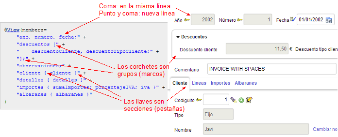\
Como ves, definir la disposición de los miembros es fácil, solo necesitas enumerarlos dentro de una cadena, usando comas para separar los elementos, punto y coma para salto de línea, corchetes para grupos (marcos), llavecitas para secciones (pestañas) y así por el estilo.\
Puedes tener varias vistas por cada entidad, para eso usa la anotación *@Views*, dando un nombre a cada vista:

@[**Entity**](http://www.google.com/search?sitesearch=java.sun.com&q=allinurl%3Aj2se%2F1+5+0%2Fdocs%2Fapi+Entity)

@Views({

`    `@[**View**](http://java.sun.com/j2se/1%2E5%2E0/docs/api/javax/swing/text/View.html)(

`        `members="codigo, nombre; direccion; facturas"

`    `),

`    `@[**View**](http://java.sun.com/j2se/1%2E5%2E0/docs/api/javax/swing/text/View.html)(

`        `name="Simple", members="codigo, nombre"

`    `)

})

**public** **class** Cliente {

Si dejas una vista sin nombre, será la vista por defecto. Los nombres de vista se usarán desde otras partes de la aplicación para escoger que vista usar.\
Con *@View* defines la distribución, pero también necesitas definir la forma en que cada miembro es visualizado, para eso, OpenXava te proporciona un conjunto de anotaciones bastante útiles que verás en la siguiente sección.
### **Refinando la presentación de los miembros**
OpenXava te permite refinar la interfaz de usuario para cualquier propiedad, referencia o colección de infinidad de maneras. Sólo necesitas añadir la anotación correspondiente. Por ejemplo, por defecto una referencia (una relación *@ManyToOne*) se visualiza usando un marco con una vista detallada, si quieres mostrar esa referencia usando un combo solo has de anotar la referencia con *@DescriptionsList*:\
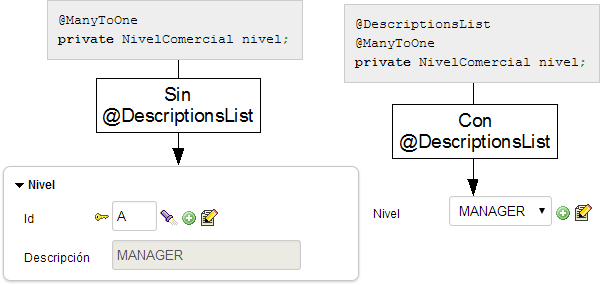\
Puede que quieras el efecto de una anotación solo para algunas vistas. Para ello usa el atributo *forViews* disponible en todas las anotaciones de interfaz de usuario:

@Views ({     *// Tienes varias vistas para Comercial*

`    `@[**View**](http://java.sun.com/j2se/1%2E5%2E0/docs/api/javax/swing/text/View.html)(members=" ... "),

`    `@[**View**](http://java.sun.com/j2se/1%2E5%2E0/docs/api/javax/swing/text/View.html)(name="Simplisima", members=" ... "),

`    `@[**View**](http://java.sun.com/j2se/1%2E5%2E0/docs/api/javax/swing/text/View.html)(name="Simple", members=" ... "),

`    `@[**View**](http://java.sun.com/j2se/1%2E5%2E0/docs/api/javax/swing/text/View.html)(name="Completa", members=" ... ")

})

**public** **class** Comercial {

`    `@DescriptionsList(forViews="Simplisima, Simple")  *// El combo solo se usará*

`    `@ManyToOne(fetch=FetchType.LAZY)           *// para 'nivel' en la vistas Simplisima y Simple*

`    `**private** NivelComercial nivel;

La siguiente tabla muestra todas las anotaciones OpenXava para personalizar la interfaz de usuario de los miembros de una entidad:

|**Anotación**|**Descripción**|**Aplica a**|
| :-: | :-: | :-: |
|@Action|Asocia una acción a una propiedad o referencia en la vista|Propiedades y referencias|
|@AsEmbedded|Hace que comportamiento en la vista de una referencia (o colección) a entidad sea como en el caso de un objeto incrustado (o colección de entidades con CascadeType.REMOVE)|Referencias y colecciones|
|@Collapsed|El marco que envuelve al miembro estará cerrado inicialmente|Referencias y colecciones|
|@CollectionView|La vista del objeto referenciado (cada elemento de la colección) que será usada para visualizar el detalle|Colecciones|
|@Condition|Restringe los elementos que aparecen en la colección|Colecciones|
|@DescriptionsList|Para visualizar una referencia como una lista de descripciones (un combo)|Referencias|
|@DetailAction|Añade una acción al detalle que está siendo editado en una colección|Colecciones|
|@DisplaySize|El tamaño en caracteres del editor en la interfaz de usuario usado para visualizar esta propiedad|Propiedades|
|@EditAction|Permite definir una acción propia para editar el elemento de la colección|Colecciones|
|@EditOnly|El usuario final podrá modifica los elementos existentes en la colección, pero no añadir o quitar elementos|Colecciones|
|@Editor|Nombre del editor a usar para visualizar el miembro en esta vista|Propiedades, referencias y colecciones.|
|@HideDetailAction|En una colección permite definir una acción propia para ocultar la vista de detalle|Colecciones|
|@LabelFormat|Formato para visualizar la etiqueta de esta propiedad o referencia (visualizada como lista descripciones)|Propiedades y referencias|
|@LabelStyle|Estilo para visualizar la etiqueta|Propiedades y referencias como lista descripciones|
|@ListAction|Para añadir acciones a la lista en una colección|Colecciones|
|@ListProperties|Propiedades a mostrar en la lista que visualiza la colección|Colecciones|
|@NewAction|Permite definir una acción propia para añadir un nuevo elemento a la colección|Colecciones|
|@NoCreate|El usuario final no podrá crear nuevos objetos del tipo referenciado desde aquí|Referencias y colecciones|
|@NoFrame|La referencia no se visualizará dentro de un marco|Referencias|
|@NoModify|El usuario final no podrá modificar el objeto actual referenciado desde aquí|Referencias y colecciones|
|@NoSearch|El usuario no tendrá el vínculo para hacer búsquedas con una lista, filtros, etc.|Referencias|
|@OnChange|Acción a ejecutar cuando el valor de la propiedad o referencia cambia|Propiedades y referencias|
|@OnChangeSearch|Acción a ejecutar para hacer la búsqueda de la referencia cuando el usuario teclea los valores clave|Referencias|
|@OnSelectElementAction|Permite definir una acción a ejecutar cuando un elemento de la colección es seleccionado o deseleccionado|Colecciones|
|@ReadOnly|El miembro nunca será editable por el usuario final en las vistas indicadas|Propiedades, referencias y colecciones|
|@ReferenceView|Vista del objeto referenciado a usar para visualizar esta referencia|Referencia|
|@RemoveAction|Permite definir una acción propia para quitar el elemento de la colección|Colecciones|
|@RemoveSelectedAction|Permite definir una acción propia para quitar los elementos seleccionados de la colección|Colecciones|
|@RowAction|En las colecciones añade una acción en cada fila, pero no en la barra de botones de la colección|Colecciones|
|@RowStyle|Para indicar el estilo de la fila para la lista y colecciones|Entidad (mediante @Tab) y colecciones|
|@SaveAction|Permite definir una acción propia para grabar el elemento de la colección|Colecciones|
|@SearchAction|Permite definir una acción propia para buscar|Referencias|
|@SearchListCondition|Define una condición para ser usada cuando se muestra la lista de elementos seleccionables para añadir a una colección o asignar a una referencia|Referencias y colecciones|
|@Tree|Visualiza la colección usando un árbol|Colecciones|
|@ViewAction|Permite definir una acción propia para visualizar el elemento de la colección|Colecciones|
|@XOrderBy|La versión eXtendida de @OrderBy (JPA)|Colecciones|

Puedes pensar que hay muchas anotaciones, pero en realidad hay todavía más, porque la mayoría de estas anotaciones tienen una versión en plural para definir diferentes valores para diferentes vistas:

@DisplaySizes({  *// Para usar varias veces @DisplaySize*

`    `@DisplaySize(forViews="Simple", value=20),  *// nombre tiene  20 para display*

`                                        `*// size en la vista Simple*

`    `@DisplaySize(forViews="Completa", value=40)  *// nombre tiene 40 para display*

`                                        `*// size en la vista Complete*

})

**private** [**String**](http://java.sun.com/j2se/1%2E5%2E0/docs/api/java/lang/String.html) nombre;

No te preocupes si aún no sabes como usar todas las anotaciones. Las irás aprendiendo poco a poco a medida que desarrolles aplicaciones OpenXava.
### **Aprende más acerca de la interfaz de usuario**
Esta sección te introduce brevemente a la generación de interfaz de usuario con OpenXava. Por desgracia, muchas e interesantes cosas se nos han quedado en el tintero, como por ejemplo, los grupos y secciones anidados, la herencia de vistas, detalles sobre como usar todas las anotaciones de IU, etc.\
A través de este curso aprenderás técnicas avanzadas sobre la interfaz de usuario.
## **Otras anotaciones**
Aparte de las validaciones y de la interfaz de usuario, OpenXava dispone de algunas otras anotaciones interesantes:

|**Anotación**|**Descripción**|**Aplica a**|
| :-: | :-: | :-: |
|@DefaultValueCalculator|Para calcular el valor inicial|Propiedades y referencias|
|@Hidden|Una propiedad oculta tiene significado para el desarrollador pero no para el usuario|Propiedades|
|@Depends|Declara que una propiedad depende de otra(s)|Propiedades|
|@Stereotype|Un estereotipo es la forma de determinar un comportamiento específico para un tipo|Propiedades|
|@Tab|Define el comportamiento para la presentación de los datos tabulares (modo lista)|Entidades|
|@SearchKey|Una propiedad o referencia marcada como clave de búsqueda se usará por el usuario para buscar|Propiedades y referencias|

Este apéndice  ha mostrado como usar anotaciones Java para hacer programación declarativa con OpenXava. Cosas como la interfaz de usuario o las validaciones, que típicamente son pura programación, se pueden hacer con tan solo anotar nuestro código.\
Puedes aprender más detalles sobre estas anotaciones e incluso aprender más anotaciones en [*la Guía de Referencia*](C:\Users\Soporte\Documents\openxava\openxava-doc\web\docs\reference_es.html) de OpenXava y en [*OpenXava API Doc de org.openxava.annotations*](http://www.openxava.org/OpenXavaDoc/apidocs/org/openxava/annotations/package-summary.html).( <https://www.openxava.org/OpenXavaDoc/apidocs/allclasses.html>)  

- [**Apéndice D: Pruebas automáticas**](C:\Users\Soporte\Documents\openxava\openxava-doc\web\docs\testing_es.html)

  Las pruebas son la parte más importante del desarrollo de software. No importa cuan bonita, rápida o tecnológicamente avanzada sea tu aplicación, si falla, darás una impresión muy pobre.\
  Hacer pruebas manuales, es decir, abrir el navegador y ejecutar la aplicación exactamente como lo haría un usuario final, no es viable; porque el problema real no está en el código que acabas de escribir, sino en el código que ya estaba ahí. Normalmente pruebas el código que acabas de escribir, pero no pruebas todo el código que ya existe en tu aplicación. Y sabes muy bien que cuando tocas cualquier parte de tu aplicación puedes romper cualquier otra parte inadvertidamente.\
  Necesitas poder hacer cualquier cambio en tu código con la tranquilidad de que no vas a romper tu aplicación. Una forma de conseguirlo, es usando pruebas automáticas. Vamos a hacer pruebas automáticas usando JUnit.

  **El código fuente a partir de aquí es para ponerlo encima del código de la sección *Modelar con Java* (lección 5), hasta nuevo aviso.**

  **JUnit**

  JUnit es una herramienta muy popular para hacer pruebas automáticas. Esta herramienta está integrada con OpenXava Studio, por tanto no necesitas descargarla para poder usarla. OpenXava extiende las capacidades de JUnit para permitir probar un módulo de OpenXava exactamente de la misma forma que lo haría un usuario final. De hecho, OpenXava usa HtmlUnit, un software que simula un navegador real (incluyendo JavaScript) desde Java. Todo está disponible desde la clase de OpenXava *ModuleTestBase*, que te permite automatizar las pruebas que tú harías a mano usando un navegador de verdad de una forma simple.\
  La mejor manera de entender como funcionan las pruebas en OpenXava es verlo en acción.

  **ModuleTestBase para probar módulos**

  Para crear una prueba para un módulo de OpenXava extendemos de la clase *ModuleTestBase* del paquete *org.openxava.tests*. Esta clase te permite conectar con un módulo OpenXava como un navegador real, y tiene muchos métodos útiles para probar tu módulo. Creemos la prueba para tu módulo *Cliente*.

  **El código para la prueba**

  Crea un paquete nuevo llamado *com.tuempresa.facturacion.pruebas* y dentro de él una nueva clase llamada *PruebaCliente* con el siguiente código:

**package** com.tuempresa.facturacion.pruebas;

**import** org.openxava.tests.\*;

**public** **class** **PruebaCliente** **extends** **ModuleTestBase** { *// Ha de extender de ModuleTestBase*

`    `**public** **PruebaCliente**(String nombrePrueba) {

`        `**super**(nombrePrueba, "facturacion", *// Indicamos el nombre de aplicación (facturacion)*

`                `"Cliente"); *// y nombre de módulo (Cliente)*

`    `}

`    `*// Los métodos de prueba han de empezar por 'test'*

`    `**public** **void** **testCrearLeerActualizarBorrar**() **throws** Exception {

`        `login("admin", "admin"); *// Identificación de usuario para acceder al módulo*

`        `*// Crear*

`        `execute("CRUD.new"); *// Pulsa el botón 'Nuevo'*

`        `setValue("numero", "77"); *// Teclea 77 como valor para el campo 'numero'*

`        `setValue("nombre", "Cliente JUNIT"); *// Pone valor en el campo 'nombre'*

`        `setValue("direccion.viaPublica", "Calle JUNIT"); *// Fíjate en la notación del punto*

`                                                `*// para acceder al miembro de la referencia*

`        `setValue("direccion.codigoPostal", "77555"); *// Etc*

`        `setValue("direccion.municipio", "La ciudad JUNIT"); *// Etc*

`        `setValue("direccion.provincia", "La provincia JUNIT"); *// Etc*

`        `execute("CRUD.save"); *// Pulsa el botón 'Grabar'*

`        `assertNoErrors(); *// Verifica que la aplicación no muestra errores*

`        `assertValue("numero", ""); *// Verifica que el campo 'numero' está vacío*

`        `assertValue("nombre", ""); *// Verifica que el campo 'nombre' está vacío*

`        `assertValue("direccion.viaPublica", ""); *// Etc*

`        `assertValue("direccion.codigoPostal", ""); *// Etc*

`        `assertValue("direccion.municipio", ""); *// Etc*

`        `assertValue("direccion.provincia", ""); *// Etc*

`        `*// Leer*

`        `setValue("numero", "77"); *// Pone 77 como valor para el campo 'numero'*

`        `execute("CRUD.refresh"); *// Pulsa el botón 'Refrescar'*

`        `assertValue("numero", "77"); *// Verifica que el campo 'numero' tiene un 77*

`        `assertValue("nombre", "Cliente JUNIT"); *// y 'nombre' tiene 'Cliente JUNIT'*

`        `assertValue("direccion.viaPublica", "Calle JUNIT"); *// Etc*

`        `assertValue("direccion.codigoPostal", "77555"); *// Etc*

`        `assertValue("direccion.municipio", "La ciudad JUNIT"); *// Etc*

`        `assertValue("direccion.provincia", "La provincia JUNIT"); *// Etc*

`        `*// Actualizar*

`        `setValue("nombre", "Cliente JUNIT MODIFICADO"); *// Cambia el valor del campo 'nombre'*

`        `execute("CRUD.save"); *// Pulsa el botón 'Grabar'*

`        `assertNoErrors(); *// Verifica que la aplicación no muestra errores*

`        `assertValue("numero", ""); *// Verifica que el campo 'numero' está vacío*

`        `assertValue("nombre", ""); *// Verifica que el campo 'nombre' está vacío*

`        `*// Verifica si se ha modificado*

`        `setValue("numero", "77"); *// Pone 77 como valor para el campo 'numero'*

`        `execute("CRUD.refresh"); *// Pulsa en el botón 'Refrescar'*

`        `assertValue("numero", "77"); *// Verifica que el campo 'numero' tiene un 77*

`        `assertValue("nombre", "Cliente JUNIT MODIFICADO"); *// y 'nombre' tiene*

`                                                        `*// 'Cliente JUNIT MODIFICADO'*

`        `*// Borrar*

`        `execute("CRUD.delete"); *// Pulsa en el botón 'Borrar'*

`        `assertMessage("Cliente borrado satisfactoriamente"); *// Verifica que el mensaje*

`                                `*// 'Cliente borrado satisfactoriamente' se muestra al usuario*

`    `}

}

Esta prueba crea un nuevo cliente, lo busca, lo modifica y al final lo borra. Aquí ves como puedes usar métodos como *execute()* o *setValue()* para simular las acciones del usuario, y métodos como *assertValue()*, *assertNoErrors()* o *assertMessage()* para verificar el estado de la interfaz de usuario. Tu prueba actúa como las manos y los ojos del usuario:\
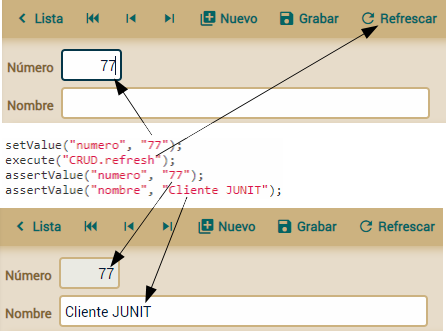\
En *execute()* tienes que especificar el nombre calificado de la acción, esto quiere decir *NombreControlador.nombreAccion*. ¿Cómo puedes saber el nombre de la acción? Pasea tu ratón sobre el vínculo de la acción y verás en la barra inferior de tu navegador un código JavaScript que incluye el nombre calificado de la acción:\
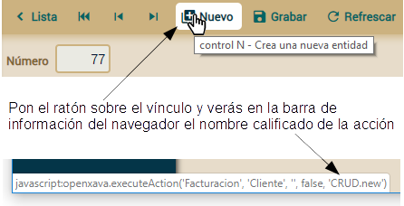\
Ahora ya sabes como crear una prueba para probar las operaciones de mantenimiento básicas de un módulo. No es necesario escribir una prueba demasiado exhaustiva al principio. Simplemente prueba las cosas básicas, aquellas cosas que normalmente probarías con un navegador. Tu prueba crecerá de forma natural a medida que tu aplicación crezca y los usuarios vayan encontrando fallos.\
Aprendamos como ejecutar tu prueba desde OpenXava Studio.

**Ejecutar las pruebas desde OpenXava Studio**

JUnit está integrado dentro del OpenXava Studio, por eso ejecutar tus pruebas es más fácil que quitarle un caramelo a un niño. Para que la prueba funcione tu aplicación tiene que estar ejecutándose, si no es el caso iníciala antes de nada. Para ejecutar la prueba pon el ratón sobre tu clase de prueba, *PruebaCliente*, y con el botón derecho escoge *Run As > JUnit Test*:\
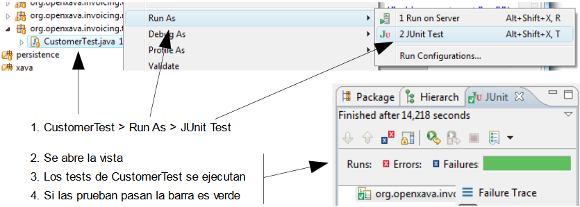\
Si la prueba no es satisfactoria la barra sale roja. Puedes probarlo. Edita *PruebaCliente* y comenta la línea que da valor al campo *nombre*:

...

setValue("numero", "77");

*// setValue("nombre", "Cliente JUNIT"); // Comenta esta línea*

setValue("direccion.viaPublica", "Calle JUNIT");

...

Ahora, reejecuta la prueba. Ya que *nombre* es una propiedad requerida, un mensaje de error será mostrado al usuario, y el objeto no se grabará:\
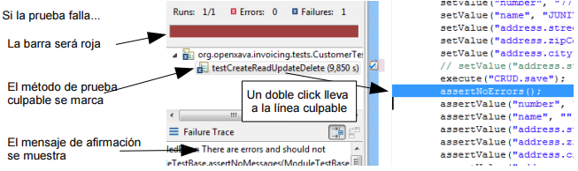\
El assert culpable es *assertNoErrors()*, el cual además de fallar muestra en la consola los errores mostrados al usuario. Por eso, en la consola de ejecución de tu prueba verás un mensaje como este:

16**-jul-2019** 18:03 **org**.openxava.tests.ModuleTestBase **assertNoMessages**

**SEVERE**: **Error** **unexpected**: **Es** **ogligado** **que** **Nombre** **en** **Cliente** **tenga** **valor**

El problema es claro. El cliente no se ha grabado porque el nombre es obligatorio y éste no se ha especificado.\
Has aprendido como se comporta la prueba cuando falla. Ahora, puedes descomentar la línea culpable y volver a ejecutar la prueba para verificar que todo sigue en su sitio.

**Crear datos de prueba usando JPA**

En tu primera prueba, *PruebaCliente*, la prueba misma empieza creando los datos que van a ser usados en el resto de la prueba. Este es un buen enfoque, especialmente si quieres probar la entrada de datos también. Pero a veces te interesa probar solo un pequeño caso que falla, o simplemente tu módulo no permite entrada de datos. En cualquier caso puedes crear los datos que necesites para probar usando JPA desde tu prueba.

**Los métodos setUp() y tearDown()**

Vamos a usar *PruebaProducto* para aprender como usar JPA para crear datos de prueba. Crearemos algunos productos antes de ejecutar cada prueba y los borraremos después. Veamos el código de *PruebaProducto*:

**package** com.tuempresa.facturacion.pruebas;

**import** java.math.\*;

**import** com.tuempresa.facturacion.modelo.\*;

**import** org.openxava.tests.\*;

**import** **static** org.openxava.jpa.XPersistence.\*;

**public** **class** **PruebaProducto** **extends** **ModuleTestBase** {

`    `**private** Autor autor; *// Declaramos las entidades a crear*

`    `**private** Categoria categoria; *// como miembros de instancia para que*

`    `**private** Producto producto1; *// estén disponibles en todos los métodos de prueba*

`    `**private** Producto producto2; *// y puedan ser borradas al final de cada prueba*

`    `**public** **PruebaProducto**(String testName) {

`        `**super**(testName, "facturacion", "Producto");

`    `}

`    `**protected** **void** **setUp**() **throws** Exception { *// setUp() se ejecuta siempre antes de cada prueba*

`        `**super**.setUp(); *// Es necesario porque ModuleTestBase lo usa para inicializarse, JPA se inicializa aquí*

`        `crearProductos(); *// Crea los datos usados en las pruebas*

`    `}

`    `**protected** **void** **tearDown**() **throws** Exception { *// tearDown() se ejecuta*

`                                                 `*// siempre después de cada prueba*

`        `**super**.tearDown(); *// Necesario, ModuleTestBase cierra recursos aquí*

`        `borrarProductos(); *// Se borran los datos usados en las pruebas*

`    `}

`    `**public** **void** **testBorrarDesdeLista**() **throws** Exception { ... }

`    `**public** **void** **testSubirFotos**() **throws** Exception { ... }

`    `**private** **void** **crearProductos**() { ... }

`    `**private** **void** **borrarProductos**() { ... }

}

Aquí estamos sobrescribiendo los métodos *setUp()* y *tearDown()*. Estos métodos son métodos de JUnit que son ejecutados justo antes y después de ejecutar cada método de prueba. Creamos los datos de prueba antes de ejecutar cada prueba y borramos los datos después de cada prueba. Así, cada prueba puede contar con unos datos concretos para ejecutarse. No importa si otras pruebas borran o modifican datos o el orden de ejecución de las pruebas. Siempre, al principio de cada método de prueba tenemos todos los datos listos para usar.

**Crear datos con JPA**

El método *crearProductos()* es el responsable de crear los datos de prueba usando JPA. Examinémoslo:

**private** **void** **crearProductos**() {

`    `*// Crear objetos Java*

`    `autor = **new** Autor(); *// Se crean objetos de Java convencionales*

`    `autor.setNombre("JUNIT Author"); *// Usamos setters como se suele hacer con Java*

`    `categoria = **new** Categoria();

`    `categoria.setDescripcion("Categoria JUNIT");

`    `producto1 = **new** Producto();

`    `producto1.setNumero(900000001);

`    `producto1.setDescripcion("Producto JUNIT 1");

`    `producto1.setAutor(autor);

`    `producto1.setCategoria(categoria);

`    `producto1.setPrecio(**new** BigDecimal("10"));

`    `producto2 = **new** Producto();

`    `producto2.setNumero(900000002);

`    `producto2.setDescripcion("Producto JUNIT 2");

`    `producto2.setAutor(autor);

`    `producto2.setCategoria(categoria);

`    `producto2.setPrecio(**new** BigDecimal("20"));

`    `*// Marcar los objetos como persistentes*

`    `getManager().persist(autor); *// getManager() es de XPersistence*

`    `getManager().persist(categoria); *// persist() marca el objeto como persistente*

`    `getManager().persist(producto1); *// para que se grabe en la base de datos*

`    `getManager().persist(producto2);

`    `*// Confirma los cambios en la base de datos*

`    `commit(); *// commit() es de XPersistence. Graba todos los objetos en la base de datos*

`              `*// y confirma la transacción*

}

Como puedes ver, primero creas los objetos al estilo convencional de Java. Fíjate que los asignamos a miembros de instancia, así puedes usarlos dentro de la prueba. Entonces, los marcas como persistentes, usando el método *persist()* del *EntityManager* de JPA. Para obtener el *PersistenceManager* solo has de escribir *getManager()* porque tienes un import estático arriba:

**import** **static** org.openxava.jpa.XPersistence.\*;

...

getManager().persist(autor);

`    `*// Gracias al static import de XPersistence es lo mismo que*

XPersistence.getManager().persist(autor);

...

commit();

`    `*// Gracias al static import de XPersistence es lo mismo que*

XPersistence.commit();

Para finalizar, *commit()* (también de *XPersistence*) graba todos los objetos a la base de datos y entonces confirma la transacción. Después de eso, los datos ya están en la base de datos listos para ser usados por tu prueba.

**Borrar datos con JPA**

Después de que se ejecute la prueba borraremos los datos de prueba para dejar la base de datos limpia. Esto se hace en el método *borrarProductos()*:

**private** **void** **borrarProductos**() { *// Llamado desde tearDown()*

`                                 `*// por tanto ejecutado después de cada prueba*

`    `borrar(producto1, producto2, autor, categoria); *// borrar() borra*

`    `commit(); *// Confirma los cambios en la base de datos, en este caso borrando datos*

}

**private** **void** **borrar**(Object ... entidades) { *// Usamos argumentos varargs*

`    `**for** (Object entidad : entidades) { *// Iteramos por todos los argumentos*

`        `getManager().remove(getManager().merge(entidad)); *// Borrar(1)*

`    `}

}

Es un simple bucle por todas las entidades usadas en la prueba, borrándolas. Para borrar una entidad con JPA has de usar el método *remove()*, aunque en este caso has de usar el método *merge()* también (1). Esto es porque no puedes borrar una entidad desasociada (*detached entity*). Al usar *commit()* en *crearProductos()* todas la entidades grabadas pasaron a ser entidades desasociadas, porque continúan siendo objetos Java válidos pero el contexto persistente (*persistent context*, la unión entre las entidades y la base de datos) se perdió en el *commit()*, por eso tienes que reasociarlas al nuevo contexto persistente. Este concepto es fácil de entender con el siguiente código:

getManager().persist(autor); *// autor está asociado al contexto persistente actual*

commit(); *// El contexto persistente actual se termina y autor pasa a estar desasociado*

getManager().remove(autor); *// Falla porque autor está desasociado*

autor = getManager().merge(autor); *// Reasocia autor al contexto actual*

getManager().remove(autor); *// Funciona*

Aparte de este curioso detalle sobre el *merge()*, el código para borrar es bastante sencillo.

**Filtrar datos desde modo lista en una prueba**

Ahora que ya sabes como crear y borrar datos para las pruebas, examinemos los métodos de prueba para tu módulo *Producto*. El primero es *testBorrarDesdeLista()* que selecciona una fila en el modo lista y pulsa en el botón *Borrar seleccionados*. Veamos su código:

**public** **void** **testBorrarDesdeLista**() **throws** Exception {

`    `login("admin", "admin");

`    `setConditionValues("", "JUNIT"); *// Establece los valores para filtrar los datos*

`    `setConditionComparators("=", "contains\_comparator"); *// Pone los comparadores para filtrar los datos*

`    `execute("List.filter"); *// Pulsa el botón para filtrar*

`    `assertListRowCount(2); *// Verifica que hay 2 filas*

`    `checkRow(1); *// Seleccionamos la fila 1 (que resulta ser la segunda)*

`    `execute("CRUD.deleteSelected"); *// Pulsa en el botón para borrar*

`    `assertListRowCount(1); *// Verifica que ahora solo hay una fila*

}

Aquí filtramos en modo lista todos los productos que contienen la palabra “JUNIT” (recuerda que has creado dos de estos en el método *crearProductos()*), entonces verificamos que hay dos filas, seleccionamos el segundo producto y lo borramos, verificando al final que la lista se queda con un solo producto.\
Has aprendido como seleccionar una fila (usando *checkRow()*) y como verificar el número de filas (usando *assertListRowCount()*). Quizás la parte más intrincada es usar *setConditionValues()* y *setConditionComparators()*. Ambos métodos reciben una cantidad variable de cadenas con valores y comparadores para la condición, tal como se muestra aquí:\
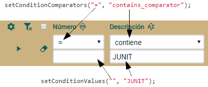\
Los valores son asignados al filtro de la lista secuencialmente (de izquierda a derecha). En este caso hay dos valores, pero puedes usar todos los que necesites. No es necesario que especifiques todos los valores. El método *setConditionValues()* admite cualquier cadena mientras que *setConditionComparators()* admite los siguientes valores posibles: *contains\_comparator, starts\_comparator, ends\_comparator, not\_contains\_comparator, empty\_comparator, not\_empty\_comparator, =, <>, >=, <=, >,* *<, in\_comparator*, *not\_in\_comparator* y *range\_comparator*.

**Usar instancias de entidad dentro de una prueba**

La prueba que queda, *testSubirFotos()*, escoge un producto y sube fotos en él. Vamos a usar en la prueba una entidad creada en *crearProductos()*:

**public** **void** **testSubirFotos**() **throws** Exception { 

`	`login("admin", "admin");

`	`*// Buscar producto1*

`	`execute("CRUD.new");

`	`setValue("numero", Integer.toString(producto1.getNumero())); *// (1)*

`	`execute("CRUD.refresh");

`	`assertFilesCount("fotos", 0);

`	`*// Subir fotos*

`	`uploadFile("fotos", "web/xava/images/add.gif"); *// (2)*

`	`uploadFile("fotos", "web/xava/images/attach.gif"); *// (2)*

`	`*// Verificar*

`	`execute("CRUD.new");

`	`assertFilesCount("fotos", 0);

`	`setValue("numero", Integer.toString(producto1.getNumero())); *// (1)*

`	`execute("CRUD.refresh");

`	`assertFilesCount("fotos", 2);

`	`assertFile("fotos", 0, "image");

`	`assertFile("fotos", 1, "image");

`	`*// Quitar fotos*

`	`removeFile("fotos", 1);

`	`removeFile("fotos", 0);

}

Lo interesante de esta prueba es que para dar valor al número usado para buscar el producto, lo obtenemos de *producto1.getNumero()* (1). Recuerda que *producto1* es una variable de instancia de la prueba a la que se asigna valor en *crearProductos()*, el cual es llamado desde *setUp()*, es decir se ejecuta antes de cada prueba. También has aprendido como usar los métodos *uploadFile(), assertFileCount(), assertFile()* y *removeFile()* para trabajar con las fotos. Estos métodos funcionan con cualquier propiedad que permita subir archivos (GALERIA\_IMAGENES, FOTO, IMAGEN, ARCHIVO, ARCHIVOS, etc). En este caso usamos imágenes incluidas en OpenXava, gifs de *web/xava/images* (2), pero puedes crear tu propia carpeta con tus propias imágenes para las pruebas.\
\
Ya tienes la prueba para *Producto* y al mismo tiempo has aprendido como probar usando datos de prueba creados mediante JPA. Ejecútalo, debería salir verde.

**Usar datos ya existentes para probar**

A veces puedes simplificar la prueba usando una base de datos que contenga los datos necesarios para la prueba. Si no quieres probar la creación de datos desde el módulo, y no borras datos en la prueba, ésta puede ser una buena opción.\
Por ejemplo, puedes probar *Autor* y *Categoria* con una prueba tan simple como esta:

**package** com.tuempresa.facturacion.pruebas;

**import** org.openxava.tests.\*;

**public** **class** **PruebaAutor** **extends** **ModuleTestBase** {

`    `**public** **PruebaAutor**(String nombrePrueba) {

`        `**super**(nombrePrueba, "facturacion", "Autor");

`    `}

`    `**public** **void** **testReadAuthor**() **throws** Exception {

`        `login("admin", "admin");

`        `assertValueInList(0, 0, "JAVIER CORCOBADO"); *// El primer autor en la*

`                                                    `*// lista es JAVIER CORCOBADO*

`        `execute("List.viewDetail", "row=0"); *// Pulsamos en la primera fila*

`        `assertValue("nombre", "JAVIER CORCOBADO");

`        `assertCollectionRowCount("productos", 2); *// Tiene 2 productos*

`        `assertValueInCollection("productos", 0, *// Fila 0 de productos*

`                                `"numero", "2"); *// tiene “2” en la columna “numero”*

`        `assertValueInCollection("productos", 0, "descripcion", "Arco iris de lágrimas");

`        `assertValueInCollection("productos", 1, "numero", "3");

`        `assertValueInCollection("productos", 1, "descripcion", "Ritmo de sangre");

`    `}

}

Esta prueba verifica que el primer autor en la lista es “JAVIER CORCOBADO”, recuerda crearlo antes de ejecutar la prueba. Entonces va al detalle y confirma que tiene una colección llamada "productos" con 2 productos: “Arco iris de lágrimas” y “Ritmo de sangre”, antes de ejecutar la prueba créalos y asocialos a "JAVIER CORCOBADO". De paso, has aprendido como usar los métodos *assertValueInList()*, *assertValueInCollection()* y *assertCollectionRowCount()*.\
Podemos usar la misma técnica para probar el módulo *Categoria*:

**package** com.tuempresa.facturacion.pruebas;

**import** org.openxava.tests.\*;

**public** **class** **PruebaCategoria** **extends** **ModuleTestBase** {

`    `**public** **PruebaCategoria**(String nombrePrueba) {

`        `**super**(nombrePrueba, "facturacion", "Categoria");

`    `}

`    `**public** **void** **testCategoriasEnLista**() **throws** Exception {

`        `login("admin", "admin");

`        `assertValueInList(0, 0, "MÚSICA"); *// Fila 0 columna 0 tiene “MÚSICA”*

`        `assertValueInList(1, 0, "LIBROS"); *// Fila 1 columna 0 tiene “LIBROS”*

`        `assertValueInList(2, 0, "SOFTWARE"); *// Fila 2 columna 0 tiene “SOFTWARE”*

`    `}

}

En este caso solo verificamos que en la lista las tres primeras categorías son “MÚSICA”, “LIBROS” y “SOFTWARE”. Acuerdate de crearlos antes de ejecutar esta prueba.\
Puedes ver como la técnica de usar datos preexistentes de una base de datos de prueba te permite crear pruebas más simples. Empezar con una prueba simple e ir complicándolo bajo demanda es una buena idea.

Recuerda añadir los datos correspondientes usando los módulos antes de ejecutar estas pruebas.

**Probar colecciones**

Es el momento de enfrentarnos a la prueba del módulo principal de tu aplicación, *PruebaFactura*. Por ahora la funcionalidad del módulo *Factura* es limitada, solo puedes añadir, borrar y modificar facturas. Aun así, esta es la prueba más extensa; además contiene una colección, por tanto aprenderás como probar las colecciones.

**Dividir la prueba en varios métodos**

La prueba para crear una factura está dividida en varios métodos:

**package** com.tuempresa.facturacion.pruebas;

**import** java.time.\*;

**import** java.time.format.\*;\
**import** javax.persistence.\*;

**import** org.openxava.tests.\*;

**import** **static** org.openxava.jpa.XPersistence.\*; *// Para usar JPA*

**public** **class** **PruebaFactura** **extends** **ModuleTestBase** {

`    `**private** String numero; *// Para almacenar el número de la factura que probamos*

`    `**public** **PruebaFactura**(String nombrePrueba) {

`        `**super**(nombrePrueba, "facturacion", "Factura");

`    `}

`    `**public** **void** **testCrear**() **throws** Exception { *// El método de prueba*

`        `login("admin", "admin");

`        `verificarValoresDefecto();

`        `escogerCliente();

`        `anyadirDetalles();

`        `ponerOtrasPropiedades();

`        `grabar();

`        `verificarCreado();

`        `borrar();

`    `}

`    `**private** **void** **verificarValoresDefecto**() **throws** Exception { … }

`    `**private** **void** **escogerCliente**() **throws** Exception { … }

`    `**private** **void** **anyadirDetalles**() **throws** Exception { … }

`    `**private** **void** **ponerOtrasPropiedades**() **throws** Exception { … }

`    `**private** **void** **grabar**() **throws** Exception { … }

`    `**private** **void** **verificarCreado**() **throws** Exception { … }

`    `**private** **void** **borrar**() **throws** Exception { … }

`    `**private** String **getAnyoActual**() { … }

`    `**private** String **getFechaActual**() { … }

`    `**private** String **getNumero**() { … }

}

El único método de prueba de esta clase es *testCrear()*, pero dado que es bastante extenso, es mejor dividirlo en varios métodos más pequeños. De hecho, es una buena práctica de orientación a objetos escribir métodos cortos.\
Ya que el método es corto puedes ver con un solo golpe de vista que es lo que hace. En este caso verifica los valores por defecto para una factura nueva, escoge un cliente, añade las líneas de detalle, añade otras propiedades, graba la factura, verifica que ha sido guardada correctamente y al final la borra. Entremos en los detalles de cada uno de estos pasos.

**Verificar valores por defecto**

Lo primero es verificar que los valores por defecto para una factura nueva son calculados correctamente. Esto se hace en el método *verificarValoresDefecto()*:

**private** **void** **verificarValoresDefecto**() **throws** Exception {

`    `execute("CRUD.new");

`    `assertValue("anyo", getAnyoActual());

`    `assertValue("numero", getNumero());

`    `assertValue("fecha", getFechaActual());

}

Cuando el usuario pulsa en *Nuevo*, los campos año, número y fecha tienen que rellenarse con datos válidos. El método *verificarValoresDefecto()* precisamente comprueba esto. Usa varios métodos de utilidad para calcular los valores esperados:

**private** String **getAnyoActual**() { *// Año actual en formato cadena*

`    `**return** Integer.toString(LocalDate.now().getYear()); *// La forma*

`                                            `*// típica de hacerlo con Java*

}

**private** String **getFechaActual**() { *// Fecha actual como una cadena*

`    `**return** LocalDate.now().format( *// La forma típica de hacerlo con Java*

`        `DateTimeFormatter.ofPattern("dd/MM/yyyy"));

}

**private** String **getNumero**() { *// El número de factura para una factura nueva*

`    `**if** (numero == **null**) { *// Usamos inicialización vaga*

`        `Query query = getManager(). *// Una consulta JPA para obtener el último número*

`                `createQuery("select max(f.numero) from Factura f where f.anyo = :anyo");

`        `query.setParameter("anyo", LocalDate.now().getYear());  

`        `Integer ultimoNumero = (Integer) query.getSingleResult();

`        `**if** (ultimoNumero == **null**) ultimoNumero = 0;

`        `numero = Integer.toString(ultimoNumero + 1); *// Añadimos 1 al*

`                                                     `*// último número de factura*

`    `}

`    `**return** numero;

}

Los métodos *getAnyoActual()* y *getFechaActual()* usan técnicas clásicas de Java para formatear la fecha como una cadena.\
El método *getNumero()* es un poco más complejo: usa JPA para calcular el último número de factura del año en curso y después devuelve este valor más uno. Dado que acceder a la base de datos es más pesado que un simple cálculo Java, usamos una inicialización vaga. Una inicialización vaga retrasa el cálculo hasta la primera vez que se necesita y después lo almacena para futuros usos. Esto lo hacemos guardando el valor en el campo *numero*.

**Entrada de datos**

Ahora es el momento de *escogerCliente()* de la factura:

**private** **void** **escogerCliente**() **throws** Exception {

`    `setValue("cliente.numero", "1");

`    `assertValue("cliente.nombre", "JAVIER PANIZA"); *// El cliente 1 debe de existir en la DB*

}

Al introducir el número de cliente el nombre del cliente se rellena con un valor apropiado. La prueba confía en que el cliente 1 con nombre "JAVIER PANIZA" existe, deberías crearlo antes de ejecutar la prueba. Ya hemos asociamos el cliente 1 con la factura actual.\
Y ahora viene la parte más peliaguda de la prueba: añadir las líneas de detalle:

**private** **void** **anyadirDetalles**() **throws** Exception {

`    `assertCollectionRowCount("detalles", 0); *// La colección esta vacía*

`    `*// Añadir una línea de detalle*

`    `setValueInCollection("detalles", 0, *// 0 es la primera fila*

`        `"producto.numero", "1");

`    `assertValueInCollection("detalles", 0,

`        `"producto.descripcion", "Peopleware: Productive Projects and Teams");

`    `setValueInCollection("detalles", 0, "cantidad", "2");

`    `*// Añadir otro detalle*

`    `setValueInCollection("detalles", 1, "producto.numero", "2");

`    `assertValueInCollection("detalles", 1, "producto.descripcion", "Arco iris de lágrimas");

`    `setValueInCollection("detalles", 1, "cantidad", "1");

`    `assertCollectionRowCount("detalles", 2); *// Ahora tenemos 2 filas*

}

Probar una colección es exactamente igual que probar cualquier otra parte de tu aplicación, solo has de seguir los mismos pasos que un usuario haría con el navegador. Tienes métodos como *setValueInCollection()*, *assertValueInCollection()* o *assertCollectionRowCount()* para trabajar con colecciones. Nota que estos métodos tienen el nombre de la colección como primer argumento y algunos reciben el número de fila siendo el 0 la primera fila. Recuerda añadir a la base de datos los productos 1 y 2 con sus correspondientes descripciones antes de ejecutar esta prueba.\
Ahora que tenemos los detalles añadidos, vamos a llenar los datos restantes y grabar la factura. Los datos restantes se establecen en el método *ponerOtrasPropiedades()*:

**private** **void** **ponerOtrasPropiedades**() **throws** Exception {

`    `setValue("observaciones", "Esto es una prueba JUNIT");

}

Aquí ponemos valor al campo *observaciones*. Y ahora estamos listos para grabar la factura:

**private** **void** **grabar**() **throws** Exception {

`    `execute("CRUD.save");

`    `assertNoErrors();

`    `assertValue("cliente.numero", "");

`    `assertCollectionRowCount("detalles", 0);

`    `assertValue("observaciones", "");

}

Simplemente pulsa en *Grabar*, entonces verifica que no ha habido errores y la vista se ha limpiado.

**Verificar los datos**

Ahora, buscamos la factura recién creada para verificar que ha sido grabada correctamente. Esto se hace en el método *verificarCreado()*:

**private** **void** **verificarCreado**() **throws** Exception {

`    `setValue("anyo", getAnyoActual()); *// El año actual en el campo año*

`    `setValue("numero", getNumero()); *// El número de la factura usada en la prueba*

`    `execute("CRUD.refresh"); *// Carga la factura desde la base de datos*

`    `*// En el resto de la prueba confirmamos que los valores son los correctos*

`    `assertValue("anyo", getAnyoActual());

`    `assertValue("numero", getNumero());

`    `assertValue("fecha", getFechaActual());

`    `assertValue("cliente.numero", "1");

`    `assertValue("cliente.nombre", "JAVIER PANIZA");

`    `assertCollectionRowCount("detalles", 2);

`    `*// Fila 0*

`    `assertValueInCollection("detalles", 0, "producto.numero", "1");

`    `assertValueInCollection("detalles", 0, "producto.descripcion",

`        `"Peopleware: Productive Projects and Teams");

`    `assertValueInCollection("detalles", 0, "cantidad", "2");

`    `*// Fila 1*

`    `assertValueInCollection("detalles", 1, "producto.numero", "2");

`    `assertValueInCollection("detalles", 1, "producto.descripcion",

`        `"Arco iris de lágrimas");

`    `assertValueInCollection("detalles", 1, "cantidad", "1");

`    `assertValue("observaciones", "Esto es una prueba JUNIT");

}

Después de buscar la factura creada verificamos que los valores que hemos grabado están ahí. Si la prueba llega a este punto tu módulo *Factura* funciona bien. Solo nos queda borrar la factura creada para que la prueba se pueda ejecutar la siguiente vez. Hacemos esto en el método *borrar()*:

**private** **void** **borrar**() **throws** Exception {

`    `execute("CRUD.delete");

`    `assertNoErrors();

}

Simplemente presiona en *Borrar* y verifica que no se han producido errores.\
\
¡Enhorabuena! Has completado tu *PruebaFactura*. Ya puedes ejecutarla, debería salir verde, si no comprueba que los datos en la base de datos están bien, puede que tengas que añadir los productos, cliente, etc. correspondientes.

**Suite**

Tienes 5 casos de prueba que velan por tu código, preservando la calidad de tu aplicación. Cuando termines alguna mejora o corrección en tu aplicación ejecuta todas tus pruebas unitarias para verificar que la funcionalidad existente no se ha roto.\
Tradicionalmente, para ejecutar todos las pruebas de tu aplicación deberías crear una suite de pruebas y ejecutarla. Una suite de pruebas es una clase que agrega todas tus pruebas JUnit para que puedas ejecutarlas todas de un golpe. Afortunadamente, con OpenXava Studio no necesitas escribir una clase de suite, te permite ejecutar todas las pruebas de tu aplicación automáticamente:\
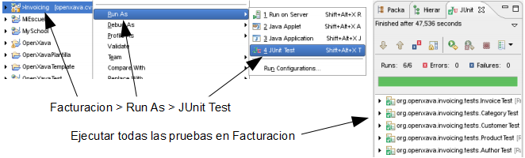\
Es decir, si ejecutas *Run As > JUnit Test* en el proyecto, se ejecutarán todas sus pruebas JUnit.

**Código fuente hasta la lección 5**

El código de prueba hasta aquí es para aplicar sobre el código de la lección 5. Aquí puedes descarga el código fuente de la lección 5 pero incluyendo el código de prueba de arriba:

[**Descarga el código fuente hasta la lección 5 con pruebas**](https://sourceforge.net/projects/openxava/files/openxava-course-source-code/openxava-course-source-code-testing_es.zip/download)

Todo el código a descargar a partir de la lección 5 ya include el código de prueba, que puedes ver con explicaciones a partir de aquí.

**Herencia en las pruebas JUnit**

**El código fuente a partir de aquí es para ponerlo encima del código de la sección *Herencia*, hasta nuevo aviso.**

*Factura* ha sido refactorizada para usar herencia y también hemos usado herencia para añadir una nueva entidad, *Pedido*. Además, esta entidad *Pedido* tiene relación con *Factura*. Lo cual es una nueva funcionalidad, por ende has de probar todas estas nuevas características.\
Dado que *Factura* y *Pedido* tienen bastantes cosas en común (la parte de *DocumentoComercial*) podemos refactorizar las pruebas para usar herencia, y así eludir el dañino “copiar y pegar” también en tu código de prueba.

**Crear una prueba de módulo abstracta**

Si examinas la prueba para crear una factura, en el método *testCrear()* de *PruebaFactura*. Puedes notar que probar la creación de una factura es exactamente igual que probar la creación de un pedido. Porque ambos tienen año, número, fecha, cliente, detalles y observaciones. Por tanto, aquí la herencia es una buena herramienta para la reutilización de código.\
Vamos a renombrar *PruebaFactura* como *PruebaDocumentoComercial*, y entonces crearemos *PruebaFactura* y *PruebaPedido* a partir de él. Éste es el diagrama UML de esta idea:\
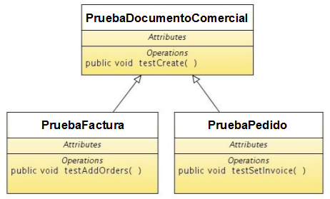\
Primero renombra tu actual clase *PruebaFactura* a *PruebaDocumentoComercial*, y después haz los cambios indicados en el siguiente código:

**package** com.tuempresa.facturacion.pruebas;

**import** java.time.\*;

**import** java.time.format.\*;

**import** javax.persistence.\*;

**import** org.openxava.tests.\*;

**import** **static** org.openxava.jpa.XPersistence.\*; 

**abstract** **public** **class** **PruebaDocumentoComercial** // **A**ñ**ade** **abstract** **a** **la** **definici**ó**n** **de** **clase**

`    `**extends** **ModuleTestBase** {

`    `**private** String numero;

`    `**public** **PruebaDocumentoComercial**(

`        `String nombrePrueba,

`        `String nombreModulo) *// nombreModulo añadido como argumento en el constructor*

`    `{

`        `**super**(nombrePrueba, "facturacion", nombreModulo); *// nombreModulo en vez de "Factura"*

`    `}

`    `**public** **void** **testCrear**() **throws** Exception { … } *// Como el original*

`    `**private** **void** **anyadirDetalles**() **throws** Exception { … } *// Como el original*

`    `**private** String **getNumero**() {

`        `**if** (numero == **null**) {

`            `Query query = getManager().

`                `createQuery(

`                    `"select max(f.numero) "

`                    `+ "from DocumentoComercial f " *// Factura cambiada por DocumentoComercial*

`                    `+ "where f.anyo = :anyo");

`            `query.setParameter("anyo", LocalDate.now().getYear());

`            `Integer ultimoNumero = (Integer) query.getSingleResult();

`            `**if** (ultimoNumero == **null**) ultimoNumero = 0;

`            `numero = Integer.toString(ultimoNumero + 1);

`        `}

`        `**return** numero;

`    `}

`    `**private** **void** **borrar**() **throws** Exception { … } *// Como original*

`    `**private** **void** **verificarCreado**() **throws** Exception { … } *// Como original*

`    `**private** **void** **grabar**() **throws** Exception { … } *// Como original*

`    `**private** **void** **ponerOtrasPropiedades**() **throws** Exception { … } *// Como original*

`    `**private** **void** **escogerCliente**() **throws** Exception { … } *// Como original*

`    `**private** **void** **verificarValoresDefecto**() **throws** Exception { … } *// Como original*

`    `**private** String **getAnyoActual**() { … } *// Como original*

`    `**private** String **getFechaActual**() { … } *// Como original*

}

Como ves has tenido que hacer unos pocos cambios para adaptar *PruebaDocumentoComercial*. Primero, la has declarado abstracta, de esta forma esta clase no es ejecutada por OpenXava Studio como una prueba JUnit, es solo válida como clase base para crear pruebas, pero ella misma no es una prueba.\
Otro cambio importante nos lo encontramos en el constructor, donde ahora tienes *nombreModulo* en vez de “Factura”, así puedes usar esta prueba para *Pedido*, *Factura* o cualquier otro módulo que quieras. El otro cambio es un simple detalle: has de cambiar “Factura” por “DocumentoComercial” en la consulta para obtener el siguiente número.\
Ahora ya tienes una clase base lista para crear los módulos de prueba para *Pedido* y *Factura*. Hagámoslo sin más dilación.

**Prueba base abstracta para crear pruebas de módulo concretas**

Crear tu primera versión para *PruebaFactura* y *PruebaPedido* es simplemente extender de *PruebaDocumentoComercial*. Nada más. Mira el código de *PruebaFactura*:

**package** com.tuempresa.facturacion.pruebas;

**public** **class** **PruebaFactura** **extends** **PruebaDocumentoComercial** {

`    `**public** **PruebaFactura**(String nombrePrueba) {

`        `**super**(nombrePrueba, "Factura");

`    `}

}

Y *PruebaPedido*:

**package** com.tuempresa.facturacion.pruebas;

**public** **class** **PruebaPedido** **extends** **PruebaDocumentoComercial** {

`    `**public** **PruebaPedido**(String nombrePrueba) {

`        `**super**(nombrePrueba, "Pedido");

`    `}

}

Ejecuta estas dos prueba y verás como *testCrear()*, heredado de *PruebaDocumentoComercial*, se ejecuta en ambos casos, contra su módulo correspondiente. Con esto estamos probando el comportamiento común para *Pedido* y *Factura*. Probemos ahora la funcionalidad particular de cada uno.

**Añadir nuevas pruebas a las pruebas de módulo extendidas**

Hasta ahora hemos probado como crear una factura y un pedido. En esta sección probaremos como añadir pedidos a una factura en el módulo *Factura* y como establecer la factura a un pedido en el módulo *Pedido*.\
Para probar como añadir un pedido a una factura añade el método *testAnyadirPedidos()* a *PruebaFactura*:

*// Esta prueba confía en que al menos exista una factura y un pedido*

**public** **void** **testAnyadirPedidos**() **throws** Exception {

`    `login("admin", "admin");

`    `assertListNotEmpty(); *// Esta prueba confía en que ya existen facturas*

`    `execute("List.orderBy", "property=numero"); *// Para usar siempre el mismo pedido*

`    `execute("List.viewDetail", "row=0"); *// Va al modo detalle editando la primera factura*

`    `execute("Sections.change", "activeSection=1"); *// Cambia a la pestaña 1*

`    `assertCollectionRowCount("pedidos", 0); *// Esta factura no tiene pedidos*

`    `execute("Collection.add", *// Pulsa el botón para añadir un nuevo pedido, esto te lleva*

`        `"viewObject=xava\_view\_section1\_pedidos"); *// a la lista de pedidos*

`    `execute("AddToCollection.add", "row=0"); *// Escoge el primer pedido de la lista*

`    `assertCollectionRowCount("pedidos", 1); *// El pedido se ha añadido a la factura*

`    `checkRowCollection("pedidos", 0); *// Marca el pedido, para borrarlo*

`    `execute("Collection.removeSelected", *// Borra el pedido recién añadido*

`        `"viewObject=xava\_view\_section1\_pedidos");

`    `assertCollectionRowCount("pedidos", 0); *// El pedido ha sido borrado*\
` `*}*

En este caso asumimos que hay al menos una factura y que la primera factura de la lista no tiene pedidos. Antes de ejecutar esta prueba, si no tienes facturas todavía, crea una sin pedidos, o si ya tienes facturas, asegúrate de que la primera no tiene pedidos.\
Para probar como asignar una factura a un pedido añade el método *testPonerFactura()* a *PruebaPedido*:

**public** **void** **testPonerFactura**() **throws** Exception {

`    `login("admin", "admin");

`    `assertListNotEmpty(); *// Esta prueba confía en que existen pedidos*

`    `execute("List.viewDetail", "row=0"); *// Va a modo detalle editando la primera factura*

`    `execute("Sections.change", "activeSection=1"); *// Cambia a la pestaña 1*

`    `assertValue("factura.numero", ""); *// Este pedido todavía no tiene*

`    `assertValue("factura.anyo", ""); *// una factura asignada*

`    `execute("Reference.search", *// Pulsa en el botón para buscar la factura, esto te*

`        `"keyProperty=factura.anyo"); *// lleva a la lista de facturas*

`    `String anyo = getValueInList(0, "anyo"); *// Memoriza el año y el número de*

`    `String numero = getValueInList(0, "numero"); *// la primera factura de la lista*

`    `execute("ReferenceSearch.choose", "row=0"); *// Escoge la primera factura*

`    `assertValue("factura.anyo", anyo); *// Al volver al detalle del pedido verificamos*

`    `assertValue("factura.numero", numero); *// que la factura ha sido seleccionada*

}

En este caso asumimos que hay al menos un pedido y el primer pedido de la lista no tiene factura. Antes de ejecutar esta prueba, si no tienes pedidos, crea uno sin factura, o si ya tienes pedidos, asegúrate de que el primero no tiene factura.\
Con esto ya tienes tus pruebas listas. Ejecútalas y obtendrás el siguiente resultado:\
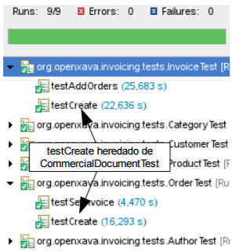\
Fíjate que la prueba base *PruebaDocumentoComercial* no se muestra porque es abstracta. Y *testCrear()* de *PruebaDocumentoComercial* se ejecuta para *PruebaFactura* y *PruebaPedido*.\
No solo has adaptado tu código de pruebas al nuevo código de *facturacion*, sino que también has aprendido como usar herencia en el mismo código de pruebas.

**Probar lógica de negocio básica**

**El código fuente a partir de aquí es para ponerlo encima del código de la sección *Lógica de negocio básica*, hasta nuevo aviso.**

Vamos a escribir el código JUnit para la sección *Lógica de negocio básica*. Recuerda, el código no está terminado si no tiene pruebas JUnit. Puedes escribir las pruebas antes, durante o después del código principal. Pero siempre has de escribirlas.\
El código de prueba mostrado aquí no es solo para darte un buen ejemplo, sino también para enseñarte maneras de probar diferentes casos en tu aplicación OpenXava.

**Modificar la prueba existente**

Crear una nueva prueba para cada nuevo caso parece una buena idea desde un punto de vista estructural, pero en la mayoría de los casos no es práctico, porque de esa forma tu código de prueba crecerá muy rápido, y con el tiempo, ejecutar todas las pruebas supondrá muchísimo tiempo.\
El enfoque más pragmático es modificar el código de prueba existente para cubrir todos los nuevos casos que hemos desarrollado. Hagámoslo de esta forma.\
En nuestro caso, la mayoría del código de esta lección aplica a *DocumentoComercial*, por tanto vamos a modificar el método *testCrear()* de *PruebaDocumentoComercial* para ajustarlo a la nueva funcionalidad. Dejamos el método *testCrear()* tal como muestra el siguiente código:

**public** **void** **testCrear**() **throws** Exception {

`    `login("admin", "admin");

`    `calcularNumero(); *// Añadido para calcular primero el siguiente número de documento*

`    `verificarValoresDefecto();

`    `escogerCliente();

`    `anyadirDetalles();

`    `ponerOtrasPropiedades();

`    `grabar();

`    `verificarBeneficioEstimado(); *// Prueba @Formula*

`    `verificarCreado();

`    `borrar();

}

Como ves, añadimos una nueva línea, después de *login(...)*, para calcular el siguiente número de documento, y una llamada al nuevo método *verificarBeneficioEstimado()*.\
Ahora nos conviene más calcular el siguiente número de documento al principio para usarlo en el resto de la prueba. Para hacer esto, cambia el viejo método *getNumero()* por los dos métodos mostrados en el siguiente código:

**private** **void** **calcularNumero**() {

`    `Query query = getManager().createQuery(

`        `"select max(f.numero) from " +

`        `modelo + *// Cambiamos DocumentoComercial por una variable*

`        `" f where f.anyo = :anyo");

`    `query.setParameter("anyo", LocalDate.now().getYear());

`    `Integer ultimoNumero = (Integer) query.getSingleResult();

`    `**if** (ultimoNumero == **null**) ultimoNumero = 0;

`    `numero = Integer.toString(ultimoNumero + 1);

}

**private** String **getNumero**() {

`    `**return** numero;

}

Anteriormente, teníamos solo *getNumero()* que calculaba y devolvía el número, ahora tenemos un método para calcular (*calcularNumero()*), y otro para devolver el resultado (*getNumero()*). Puedes notar que la lógica del cálculo tiene un pequeño cambio, en vez de usar “DocumentoComercial” como fuente de la consulta usamos *modelo*, una variable. Esto es así porque ahora la numeración para facturas y pedidos está separada. Llenamos esta variable, un campo de la clase de prueba, en el constructor, tal como muestra el siguiente código:

**private** String modelo; *// Nombre del modelo para la condición. Puede ser 'Factura' o 'Pedido'*

**public** **PruebaDocumentoComercial**(String nombrePrueba, String nombreModulo) {

`    `**super**(nombrePrueba, "facturacion", nombreModulo);

`    `**this**.modelo = nombreModulo; *// El nombre del módulo coincide con el del modelo*

}

En este caso el nombre de módulo, *Factura* o *Pedido*, coincide con el nombre de modelo, *Factura* o *Pedido*, así que la forma más fácil de obtener el nombre de modelo es desde el nombre de módulo.\
Veamos el código que prueba la nueva funcionalidad.

**Verificar valores por defecto, propiedades calculadas y *@Calculation***

En esta lección hemos hecho algunas modificaciones en los valores por defecto. Ahora, el valor por defecto para *numero* ya no se calcula mediante un *@DefaultValueCalculator* en su lugar usamos un método de retrollamada JPA. Para probar este caso hemos de modificar el método *verificarValoresDefecto()* como ves en el siguiente código:

**private** **void** **verificarValoresDefecto**() **throws** Exception {

`    `execute("CRUD.new");

`    `assertValue("anyo", getAnyoActual());

`    `*// assertValue("numero", getNumero()); // Ahora el número no tiene valor inicial...*

`    `assertValue("numero", ""); *// ... al crear un documento nuevo*

`    `assertValue("fecha", getFechaActual());

}

Verificamos que *numero* no tiene valor inicial, porque ahora *numero* no se calcula hasta el momento de grabar el documento (sección [Cálculo de valor por defecto multiusuario](C:\Users\Soporte\Documents\openxava\openxava-doc\web\docs\basic-business-logic_es.html#Metodos-de-retrollamadas-JPA-Calculo-de-valor-por-defecto-multiusuario)). Cuando el documento (factura o pedido) se grabe verificaremos que *numero* se calcula.

Cuando la línea se añade podemos verificar el cálculo de *importe* de *Detalle* (la propiedad calculada simple, sección [Propiedad calculada simple](C:\Users\Soporte\Documents\openxava\openxava-doc\web\docs\basic-business-logic_es.html#Propiedades-calculadas-Propiedad-calculada-simple)), el valor por defecto para *precioPorUnidad* (*@DefaultValueCalculator*, sección [Usar @DefaultValueCalculator](C:\Users\Soporte\Documents\openxava\openxava-doc\web\docs\basic-business-logic_es.html#Propiedades-calculadas-Usar-DefaultValueCalculator)) y las propiedades de importes del documento (sección [Propiedades de total de una colección](C:\Users\Soporte\Documents\openxava\openxava-doc\web\docs\basic-business-logic_es.html#Propiedades-calculadas-Propiedades-de-total-de-una-coleccion)). Entre las propiedades de total probamos *porcentajeIVA* cuyo valor por defecto se calcula leyendo de un archivo de propiedades. Todo esto lo probamos haciendo unas ligeras modificaciones en el ya existente método *anyadirDetalles()*:

**private** **void** **anyadirDetalles**() **throws** Exception {

`    `assertCollectionRowCount("detalles", 0);

\
`    `*// Antes de ejecutar esta prueba asegurate de que*

`    `*//   producto 1 tenga 19 como precio y* 

`    `*//   producto 2 tenga 20 como precio*

`    `*// Añadir una línea de detalle*

`    `setValueInCollection("detalles", 0, "producto.numero", "1");

`    `assertValueInCollection("detalles", 0,

`        `"producto.descripcion", "Peopleware: Productive Projects and Teams");

`    `assertValueInCollection("detalles", 0,

`        `"precioPorUnidad", "19,00"); *// @DefaultValueCalculator*

`    `setValueInCollection("detalles", 0, "cantidad", "2");

`    `assertValueInCollection("detalles", 0,

`        `"importe", "38,00"); *// Propiedada calculada, sección 'Propiedad calculada simple'*

`    `*// Verificando propiedades de total de la colección*

`    `assertTotalInCollection("detalles", 0, "importe", "38,00"); *// Suma de importes usando +*

`    `assertTotalInCollection("detalles", 1, "importe", "21"); *// Valor por defecto desde un archivo de propiedades*

`    `assertTotalInCollection("detalles", 2, "importe", "7,98"); *// IVA, con @Calculation*

`    `assertTotalInCollection("detalles", 3, "importe", "45,98"); *// Importe total, con @Calculation*

`    `*// Añadir otro detalle*

`    `setValueInCollection("detalles", 1, "producto.numero", "2");

`    `assertValueInCollection("detalles", 1, "producto.descripcion", "Arco iris de lágrimas");

`    `assertValueInCollection("detalles", 1, "precioPorUnidad", "20,00"); 

`    `setValueInCollection("detalles", 1, "precioPorUnidad", "10,00"); *// Modificando el valor por defecto*

`    `setValueInCollection("detalles", 1, "cantidad", "1");

`    `assertValueInCollection("detalles", 1, "importe", "10,00");

`    `assertCollectionRowCount("detalles", 2); *// Ahora tenemos dos líneas*

`    `*// Verificando propiedades de total de la colección*

`    `assertTotalInCollection("detalles", 0, "importe", "48,00");

`    `assertTotalInCollection("detalles", 1, "importe", "21");

`    `assertTotalInCollection("detalles", 2, "importe", "10,08");

`    `assertTotalInCollection("detalles", 3, "importe", "58,08");

}

Como ves, con estas modificaciones sencillas probamos la mayoría de nuestro nuevo código. Nos quedan sólo las propiedades *beneficioEstimado* y *diasEntrega*. Las cuales probaremos en las siguientes secciones.

**Verificar *@Formula***

En la sección [Lógica desde la base de datos](C:\Users\Soporte\Documents\openxava\openxava-doc\web\docs\basic-business-logic_es.html#Logica-desde-la-base-de-datos-Formula) hemos creado una propiedad que usa *@Formula*, *beneficioEstimado*. Esta propiedad se muestra sólo en modo lista.\
Obviamente, la forma más simple de probarlo es yendo a modo lista y verificando que el valor para esta propiedad es el esperado. En *testCrear()* llamamos a *verificarBeneficioEstimado()*. Veamos su código:

**private** **void** **verificarBeneficioEstimado**() **throws** Exception {

`    `execute("Mode.list"); *// Cambiar a modo lista*

`    `setConditionValues(**new** String [] { *// Filtra para ver en la lista solamente*

`        `getAnyoActual(), getNumero() *// el documento que acabamos de crear*

`    `});

`    `execute("List.filter"); *// Hace filtro*

`    `assertValueInList(0, 0, getAnyoActual()); *// Verifica que*

`    `assertValueInList(0, 1, getNumero()); *// el filtro ha funcionado*

`    `assertValueInList(0, "beneficioEstimado", "5,81"); *// Confirma el beneficio estimado*

`    `execute("List.viewDetail", "row=0"); *// Va a modo detalle*

}

Dado que ahora vamos a modo lista y después volvemos a detalles, hemos de hacer una pequeña modificación en el método *verificarCreado()*, que es ejecutado justo después de *verificarBeneficioEstimado()*. Veamos la modificación:

**private** **void** **verificarCreado**() **throws** Exception {

`    `*// setValue("anyo", getAnyoActual()); // Borramos estas líneas*

`    `*// setValue("numero", getNumero());  // para buscar el documento*

`    `*// execute("CRUD.refresh"); // porque ya lo hemos buscado desde el modo lista*

`    `*// El resto de la prueba ...*

...

Quitamos estas líneas porque ahora no es necesario buscar el documento recién creado. Ahora en el método *verificarBeneficioEstimado()* vamos a modo lista y escogemos el documento, por tanto ya estamos editando el documento.

**Probar sincronización de propiedades calculadas y persistentes**

En la sección [Sincronizar propiedades persistentes y calculadas](C:\Users\Soporte\Documents\openxava\openxava-doc\web\docs\basic-business-logic_es.html#Metodos-de-retrollamadas-JPA-Sincronizar-propiedades-persistentes-y-calculadas) usamos métodos de retrollamada JPA en *Pedido* para tener una propiedad persistente, *diasEntrega*, sincronizada con una calculada, *diasEntregaEstimados*. La propiedad *diasEntrega* sólo se muestra en modo lista.\
Ve a la clase *PruebaPedido* y añade un nuevo método *testDiasEntrega()*:

**public** **void** **testDiasEntrega**() **throws** Exception {

`    `login("admin", "admin");

`    `assertListNotEmpty(); 

`    `execute("List.viewDetail", "row=0"); 

`    `setValue("fecha", "5/6/2020");

`    `assertValue("diasEntregaEstimados", "1");

`    `setValue("fecha", "6/6/2020");

`    `assertValue("diasEntregaEstimados", "3");

`    `setValue("fecha", "7/6/2020");

`    `assertValue("diasEntregaEstimados", "2");

`    `execute("CRUD.save");

`    `execute("Mode.list"); *// Para verificar que diasEntrega está sincronizado*

`    `assertValueInList(0, "diasEntrega", "2"); 

`    `execute("List.viewDetail", "row=0");

`    `setValue("fecha", "13/1/2020");

`    `assertValue("diasEntregaEstimados", "7");

`    `execute("CRUD.save");

`    `execute("Mode.list"); *// Para verificar que diasEntrega está sincronizado*

`    `assertValueInList(0, "diasEntrega", "7");        

}

Probamos varios valores para *fecha* para verificar que *diasEntregaEstimados* se calcula correctamente cada vez, además vamos a modo lista para verificar que *diasEntrega* tiene el valor correcto y por tanto ambas propiedades están sincronizadas.

¡Enhorabuena! Ahora tus pruebas ya están sincronizadas con tu código. Es un buen momento para ejecutar todas las pruebas de tu aplicación.

**Probar validación**

**El código fuente a partir de aquí es para ponerlo encima del código de la sección *Validación avanzada*, hasta nuevo aviso.**

Nuestra meta no es desarrollar una ingente cantidad de código, sino crear software de calidad. Al final, si creas software de calidad acabarás escribiendo más cantidad de software, porque podrás dedicar más tiempo a hacer cosas nuevas y excitantes, y menos depurando legiones de bugs. Y tú sabes que la única forma de conseguir calidad es mediante las pruebas automáticas, por tanto actualicemos nuestro código de prueba.

**Probar la validación al añadir a una colección**

Recuerda que hemos refinado tu código para que el usuario no pueda asignar pedidos a una factura si los pedidos no están servidos. Después de esto, tu actual *testAnyadirPedidos()* de *PruebaFactura* puede fallar, porque trata de añadir el primer pedido y es posible que ese primer pedido no esté marcado como servido.\
Modifiquemos la prueba para que funcione y también para comprobar la nueva funcionalidad de validación. Mira como:

**public** **void** **testAnyadirPedidos**() **throws** Exception {

`    `login("admin", "admin");

`    `assertListNotEmpty();

`    `execute("List.orderBy", "property=numero");

`    `execute("List.viewDetail", "row=0");

`    `execute("Sections.change", "activeSection=1");

`    `assertCollectionRowCount("pedidos", 0);

`    `execute("Collection.add",

`        `"viewObject=xava\_view\_section1\_pedidos");

`    `*// execute("AddToCollection.add", "row=0"); // Ahora no seleccionamos al azar*

`    `seleccionarPrimerPedidoConEntregadoIgual("Entregado"); *// Selecciona un pedido entregado*

`    `seleccionarPrimerPedidoConEntregadoIgual(""); *// Selecciona uno no entregado*

`    `execute("AddToCollection.add"); *// Tratamos de añadir ambos*

`    `assertError( *// Un error, porque el pedido no entregado no se puede añadir*

`        `"¡ERROR! 1 elemento(s) NO añadido(s) a Pedidos de Factura");

`    `assertMessage( *// Un mensaje de confirmación, porque el pedido entregado ha sido añadido*

`        `"1 elemento(s) añadido(s) a Pedidos de Factura");

`    `assertCollectionRowCount("pedidos", 1);

`    `checkRowCollection("pedidos", 0);

`    `execute("Collection.removeSelected",

`        `"viewObject=xava\_view\_section1\_pedidos");

`    `assertCollectionRowCount("pedidos", 0);

}

Hemos modificado la parte de la selección de pedidos a añadir, antes seleccionábamos el primero, no importaba si estaba servido o no. Ahora seleccionamos un pedido servido y otro no servido, de esta forma comprobamos que el pedido servido se añade y el no servido es rechazado.\
La pieza que nos falta es la forma de seleccionar los pedidos. Esto es el trabajo del método *seleccionarPrimerPedidoConEntregadoIgual()*. Veámoslo:

**private** **void** **seleccionarPrimerPedidoConEntregadoIgual**(String valor) **throws** Exception {

`    `**int** c = getListRowCount(); *// El total de filas visualizadas en la lista*

`    `**for** (**int** i = 0; i < c; i++) {

`        `**if** (valor.equals(getValueInList(i, 12))) { *// Obtenermos valor de la columna 'entregado'*    

`            `checkRow(i);

`            `**return**;

`        `}

`    `}

`    `fail("Debe tener al menos una fila con entregado=" + valor);

}

Aquí ves una buena técnica para hacer un bucle sobre los elementos visualizados de una lista para seleccionarlos y coger algunos datos, o cualquier otra cosa que quieras hacer con los datos de la lista. Para que esta prueba funcione la primera factura no ha de tener pedidos y además tiene que haber al menos un pedido entregado, pero que no sea el primero.

**Probar validación al asignar una referencia y al borrar**

Desde el módulo *Factura* el usuario no puede asignar pedidos a una factura si los pedidos no están servidos, por lo tanto, desde el módulo *Pedido* el usuario tampoco debe poder asignar una factura a un pedido si éste no está servido. Es decir, hemos de probar también la otra parte de la asociación. Lo haremos modificando el actual *testPonerFactura()* de *PruebaPedido*.\
Además, aprovecharemos este caso para probar la validación al borrar que vimos en las secciones [Validar al borrar con @RemoveValidator](C:\Users\Soporte\Documents\openxava\openxava-doc\web\docs\validation_es.html#toc7) y [Validar al borrar con un método de retrollamada](C:\Users\Soporte\Documents\openxava\openxava-doc\web\docs\validation_es.html#toc8). Allí modificamos la aplicación para impedir que un usuario borrara un pedido si éste tenía una factura asociada. Ahora probaremos este hecho.\
Todo esto está en el *testPonerFactura()* de *PruebaPedido* mejorado que puedes ver a continuación:

**public** **void** **testPonerFactura**() **throws** Exception {

`    `login("admin", "admin");

`    `assertListNotEmpty();

`    `execute("List.orderBy", "property=numero"); *// Establece el orden de la lista*

`    `execute("List.viewDetail", "row=0");

`    `assertValue("entregado", "false"); *// El pedido no debe estar entregado*

`    `execute("Sections.change", "activeSection=1");

`    `assertValue("factura.numero", "");

`    `assertValue("factura.anyo", "");

`    `execute("Reference.search",

`        `"keyProperty=factura.anyo");

`    `String anyo = getValueInList(0, "anyo");

`    `String numero = getValueInList(0, "numero");

`    `execute("ReferenceSearch.choose", "row=0");

`    `assertValue("factura.anyo", anyo);

`    `assertValue("factura.numero", numero);

`    `*// Los pedidos no entregados no pueden tener factura*

`    `execute("CRUD.save");

`    `assertErrorsCount(1); *// No podemos grabar porque no ha sido entregado*

`    `setValue("entregado", "true");

`    `execute("CRUD.save"); *// Con 'entregado=true' podemos grabar el pedido*

`    `assertNoErrors();

`    `*// Un pedido con factura no se puede borrar*

`    `execute("Mode.list"); *// Vamos al modo lista*

`    `execute("CRUD.deleteRow", "row=0"); *// y eliminanos el pedido grabado*

`    `assertError("Imposible borrar Pedido por: " + *// No podemos borrar porque tiene*

`        `"Pedido asociado a factura no puede ser eliminado"); *// una factura asociada*

`    `*// Restaurar los valores originales*

`    `execute("List.viewDetail", "row=0");

`    `setValue("factura.anyo", "");

`    `setValue("entregado", "false");

`    `execute("CRUD.save");

`    `assertNoErrors();

}

La prueba original solo buscaba una factura, ni siquiera intentaba grabar. Ahora, hemos añadido código al final para probar la grabación de un pedido marcado como servido y marcado como no servido, de esta forma comprobamos la validación. Después de eso, tratamos de borrar el pedido, el cual tiene una factura, así probamos también la validación al borrar. Antes de ejecutar esta prueba asegurate de que el primer pedido no esté entregado y no tenga factura.

**Probar el *Bean Validation* propio**

Solo nos queda probar tu *Bean Validation ISBN*, el cual usa un servicio REST para hacer la validación. Simplemente hemos de escribir una prueba que trate de asignar un ISBN incorrecto, uno inexistente y uno correcto a un producto, y ver que pasa. Para hacer esto añadamos un método *testValidarISBN()* a *PruebaProducto*.

**public** **void** **testValidarISBN**() **throws** Exception {

`    `login("admin", "admin");

`    `*// Buscar producto1*

`    `execute("CRUD.new");

`    `setValue("numero", Integer.toString(producto1.getNumero()));

`    `execute("CRUD.refresh");

`    `assertValue("descripcion", "Producto JUNIT 1");

`    `assertValue("isbn", "");

`    `*// Con un formato de ISBN incorrecto*

`    `setValue("isbn", "1111");

`    `execute("CRUD.save"); *// Falla por el formato (apache commons validator)*

`    `assertError("1111 no es un valor válido para ISBN de Producto: " +

`        `"ISBN inválido o inexistente");

`    `*// ISBN no existe aunque tiene un formato correcto*

`    `setValue("isbn", "9791034369997");

`    `execute("CRUD.save"); *// Falla porque no existe ISBN (el servicio REST)*

`    `assertError("9791034369997 no es un valor válido para ISBN de " +

`        `"Producto: ISBN inválido o inexistente");

`    `*// ISBN existe*

`    `setValue("isbn", "9780932633439");

`    `execute("CRUD.save"); *// No falla*

`    `assertNoErrors();

}

Seguramente la prueba manual que hacías mientras estabas escribiendo el validador *@ISBN* era parecida a esta. Por eso, si hubieras escrito tu [código de prueba antes que el código de la aplicación](http://www.extremeprogramming.org/rules/testfirst.html), lo hubieras podido usar mientras que desarrollabas, lo cual es más eficiente que repetir una y otra vez a mano las pruebas con el navegador.\
Fíjate que si usas *@ISBN(search=false)* esta prueba no funciona porque no solo comprueba el formato sino que también hace la búsqueda con el servicio REST. Por tanto, has de usar *@ISBN* sin atributos para anotar la propiedad *isbn* y poder ejecutar esta prueba.\
Ahora ejecuta todas las prueba de tu aplicación *Facturación* para verificar que todo sigue en su sitio.

**Probar refinar el comportamiento predefinido**

**El código fuente a partir de aquí es para ponerlo encima del código de la sección *Refinar el comportamiento predefinido*, hasta nuevo aviso.**

Hemos refinado la manera en que tu aplicación borra entidades, además hemos añadido dos módulos personalizados, los módulos papelera. Antes de seguir adelante, tenemos que escribir las pruebas de estas nuevas funcionalidades.

**Probar el comportamiento personalizado para borrar**

No hemos de escribir una prueba para esto, porque el código actual de prueba ya comprueba esta funcionalidad de borrado. Generalmente, cuando cambias la implementación de cierta funcionalidad pero no su uso desde el punto de vista del usuario, como es nuestro caso, no necesitas añadir nuevas pruebas.\
Ejecuta todas las prueba de tu aplicación y ajusta los detalles necesarios para que funcionen bien. Realmente, solo necesitarás cambiar “CRUD.delete” por “Facturacion.delete” y “CRUD.deleteSelected” por “Facturacion.deleteSelected” en algunas pruebas. El siguiente código resume los cambios que necesitas aplicar a tu código de pruebas.

*// En el archivo PruebaCliente.java*

**public** **class** **PruebaCliente** **extends** **ModuleTestBase** {

...

`    `**public** **void** **testCrearLeerActualizarBorrar**() **throws** Exception {

...

`        `*// Borrar*

`        `*// execute("CRUD.delete");*

`        `execute("Facturacion.delete");

`        `assertMessage("Cliente borrado satisfactoriamente");

`    `}

...

}

*// En el archivo PruebaDocumentoComercial.java*

**abstract** **public** **class** **PruebaDocumentoComercial** **extends** **ModuleTestBase** {

...

`    `**private** **void** **borrar**() **throws** Exception {

`        `*// execute("CRUD.delete");*

`        `execute("Facturacion.delete");

`        `assertNoErrors();

`    `}

...

}

*// En el archivo PruebaProducto.java*

**public** **class** **PruebaProducto** **extends** **ModuleTestBase** {

...

`    `**public** **void** **testBorrarDesdeLista**() **throws** Exception {

`        `*//execute("CRUD.deleteSelected");*

`        `execute("Facturacion.deleteSelected");

`        `assertListRowCount(1);

`    `}

...

}

*// En el archivo PruebaPedido.java*

**public** **class** **PruebaPedido** **extends** **PruebaDocumentoComercial** {

...

`    `**public** **void** **testPonerFactura**() **throws** Exception {

...

`        `*//execute("CRUD.deleteRow", "row=0");*

`        `execute("Facturacion.deleteRow", "row=0");

...

`    `}

}

Después de estos cambios todas tus prueba funcionarán bien y esto confirma que tus acciones para borrar personalizadas conservan la semántica original. Solo ha cambiado la implementación.

**Probar varios módulos en el mismo método de prueba**

También has de probar los nuevos módulos personalizados, *PapeleraPedido* y *PapeleraFactura*. De paso, verificaremos que la lógica de borrado funciona bien, y que la entidades son solo marcadas como borradas y no son borradas de verdad.\
Para probar el módulo *PapeleraFactura* seguiremos los siguientes pasos:

- Empezamos en el módulo *Factura*.
- Borramos una factura desde modo detalle y verificamos que ha sido borrada.
- Borramos una factura desde modo lista y verificamos que ha sido borrada.
- Vamos al módulo *PapeleraFactura*.
- Verificamos que contiene las dos facturas borradas.
- Las restauramos y verificamos que desaparecen de la lista del módulo papelera.
- Volvemos al módulo *Factura*.
- Verificamos que las dos facturas restauradas están en la lista.

  Puedes observar como empezamos en el módulo *Factura*. Además, seguramente te hayas dado cuenta de que la prueba para *Pedido* es exactamente igual. Por tanto, en vez de crear dos nuevas clases de prueba, *PruebaPapeleraPedido* y *PruebaPapeleraFactura*, simplemente añadiremos un método de prueba en la ya existente *PruebaDocumentoComercial*. Así, reutilizaremos el mismo código para probar *PedidoPapelera*, *PapeleraFactura* y la lógica personalizada de borrado. Añade el código del siguiente método *testPapelera()* a *PruebaDocumentoComercial*:

**public** **void** **testPapelera**() **throws** Exception {

`    `login("admin", "admin");

`    `confirmarSoloUnaPaginaEnLista(); *// Sólo una página en la lista, es decir menos de 10 filas*

`    `*// Borrar desde modo detalle*

`    `**int** numeroFilasInicial = getListRowCount();

`    `String anyo1 = getValueInList(0, 0);

`    `String numero1 = getValueInList(0, 1);

`    `execute("List.viewDetail", "row=0");

`    `execute("Facturacion.delete");

`    `execute("Mode.list");

`    `assertListRowCount(numeroFilasInicial - 1); *// Hay una fila menos*

`    `confirmarDocumentoNoEstaEnLista(anyo1, numero1); *// La entidad borrada no está en lista*

`    `*// Borrar desde el modo lista*

`    `String anyo2 = getValueInList(0, 0);

`    `String numero2 = getValueInList(0, 1);

`    `checkRow(0);

`    `execute("Facturacion.deleteSelected");

`    `assertListRowCount(numeroFilasInicial - 2); *// Hay dos filas menos*

`    `confirmarDocumentoNoEstaEnLista(anyo2, numero2); *// La otra entidad borrada no está en la lista*

`    `*// Verificar la entidades borradas en el módulo papelera*

`    `changeModule("Papelera" + modelo); *// model puede ser 'Factura' o 'Pedido'*

`    `confirmarSoloUnaPaginaEnLista();

`    `**int** numeroFilasInicialPapelera = getListRowCount();

`    `confirmarDocumentoEstaEnLista(anyo1, numero1); *// Verificamos que las entidades borradas*

`    `confirmarDocumentoEstaEnLista(anyo2, numero2); *// están en la lista del módulo papelera*

`    `*// Restaurar usando una acción de fila*

`    `**int** fila1 = getFilaDocumentoEnLista(anyo1, numero1);

`    `execute("Papelera.restaurar", "row=" + fila1);

`    `assertListRowCount(numeroFilasInicialPapelera - 1); *// 1 fila menos después de restaurar*

`    `confirmarDocumentoNoEstaEnLista(anyo1, numero1); *// La entidad restaurada ya*

`        `*// no se muestra en la lista del módulo papelera*

`    `*// Restaurar seleccionando una fila y usando el botón de abajo*

`    `**int** fila2 = getFilaDocumentoEnLista(anyo2, numero2);

`    `checkRow(fila2);

`    `execute("Papelera.restaurar");

`    `assertListRowCount(numeroFilasInicialPapelera - 2); *// 2 filas menos*

`    `confirmarDocumentoNoEstaEnLista(anyo2, numero2); *// La entidad restaurada ya*

`        `*// no se muestra en la lista del módulo papelera*

`    `*// Verificar las entidades restauradas*

`    `changeModule(modelo);

`    `assertListRowCount(numeroFilasInicial); *// Después de restaurar tenemos*

`    `confirmarDocumentoEstaEnLista(anyo1, numero1); *// las filas originales de nuevo*

`    `confirmarDocumentoEstaEnLista(anyo2, numero2);

}

Como ves *testPapelera()* sigue los susodichos pasos. Fíjate como usando el método *changeModule()* de *ModuleTestBase* tu prueba puede cambiar a otro módulo. Usamos esto para cambiar al módulo papelera y volver atrás.\
Aquí estamos utilizando algunos métodos auxiliares que has de añadir a *PruebaDocumentoComercial*. El primero es *confirmarSoloUnaPaginaEnLista()* que confirma que el modo lista es apropiado para ejecutar esta prueba. Mira su código:

**private** **void** **confirmarSoloUnaPaginaEnLista**() **throws** Exception {

`    `assertListNotEmpty(); *// De ModuleTestBase*

`    `assertTrue("Debe tener menos de 10 filas para ejecutar esta prueba",

`        `getListRowCount() < 10);

}

Necesitamos tener menos de 10 filas, porque el método *getListRowCount()* informa solo de las filas visualizadas, por tanto si tienes más de 10 filas (10 es el número de filas por página por defecto) no puedes aprovechar *getListRowCount()*, ya que siempre devolvería 10.\
Los métodos restantes son para verificar que cierto pedido o factura está (o no está) en la lista. Míralos a continuación:

**private** **void** **confirmarDocumentoNoEstaEnLista**(String anyo, String numero)

`    `**throws** Exception

{

`    `assertTrue(

`        `"Documento " + anyo + "/" + numero + " no debe estar en la lista",

`            `getFilaDocumentoEnLista(anyo, numero) < 0);

}

**private** **void** **confirmarDocumentoEstaEnLista**(String anyo, String numero)

`    `**throws** Exception

{

`    `assertTrue(

`        `"Documento " + anyo + "/" + numero + " debe estar en la lista",

`            `getFilaDocumentoEnLista(anyo, numero) >= 0);

}

**private** **int** **getFilaDocumentoEnLista**(String anyo, String numero)

`    `**throws** Exception

{

`    `**int** c = getListRowCount();

`    `**for** (**int** i = 0; i < c; i++) {

`        `**if** (anyo.equals(getValueInList(i, 0)) &&

`            `numero.equals(getValueInList(i, 1)))

`        `{

`            `**return** i;

`        `}

`    `}

`    `**return** -1;

}

Puedes ver en *getFilaDocumentoEnLista()* como se hace un bucle para buscar valores concretos en una lista.\
Ahora puedes ejecutar todas las pruebas de tu aplicación *facturacion*. Todo tiene que salir en color verde.

**Probar comportamiento y lógica de negocio**

**El código fuente a partir de aquí es para ponerlo encima del código de la sección *Comportamiento y lógica de negocio*, hasta nuevo aviso.**

El código que escribimos en la sección *Comportamiento y lógica de negocio* no estará completo hasta que no escribamos las pruebas. Recuerda, todo código nuevo tiene que tener su correspondiente código de prueba. Escribamos pues las pruebas para estas dos nuevas acciones.

**Probar la acción de modo detalle**

Primero probaremos la acción *Pedido.crearFactura*, la acción para crear una factura a partir del modo detalle del pedido visualizado. Recordamos aquí como funciona este proceso:\
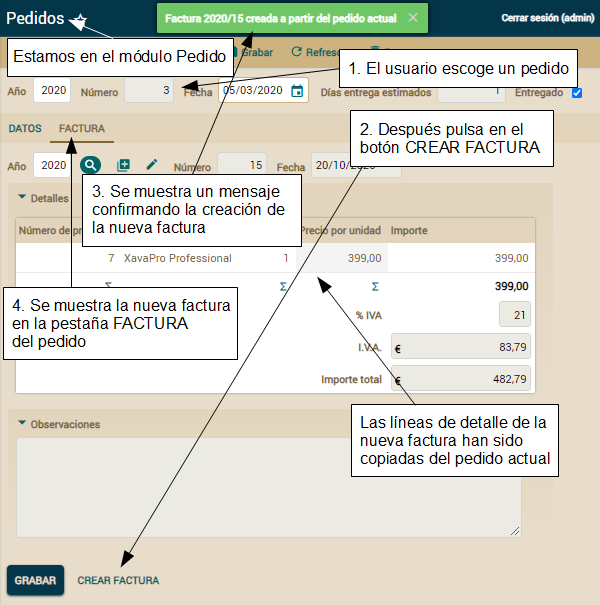\
Ahora vamos a escribir la prueba para verificar que funciona justo de esta forma. Añade el método *testCrearFacturaDesdePedido()* a la clase *PruebaPedido*:

**public** **void** **testCrearFacturaDesdePedido**() **throws** Exception {

`    `login("admin", "admin");

`    `*// Buscar el pedido*

`    `buscarPedidoSusceptibleDeSerFacturado(); *// Busca un pedido*  

`    `assertValue("entregado", "true"); *// El pedido está entregado*

`    `**int** cantidadDetallesPedido = getCollectionRowCount("detalles"); *// Toma nota de*

`                                      `*// la cantidad de detalles en el pedido*

`    `execute("Sections.change", "activeSection=1"); *// La sección de la factura*

`    `assertValue("factura.anyo", ""); *// Todavía no hay factura*

`    `assertValue("factura.numero", ""); *// en este pedido*

`    `*// Crear la factura*

`    `execute("Pedido.crearFactura"); *// Ejecuta la acción que estamos probando (1)*

`    `String anyoFactura = getValue("factura.anyo"); *// Verifica que ahora*

`    `assertTrue("Año de fectura ha de tener valor", *// hay una factura*

`        `!Is.emptyString(anyoFactura)); *// en la pestaña de factura (2)*

`    `String numeroFactura = getValue("factura.numero");

`    `assertTrue("Número de factura ha de tener valor",

`        `!Is.emptyString(numeroFactura)); *// Is.emptyString() es de org.openxava.util*

`    `assertMessage("Factura " + anyoFactura + "/" + numeroFactura +

`        `" creada a partir del pedido actual"); *// El mensaje de confirmación (3)*

`    `assertCollectionRowCount("factura.detalles", *// La factura recién creada*

`        `cantidadDetallesPedido); *// tiene el mismo número de detalles que el pedido (4)*

`    `*// Restaurar el pedido para poder ejecutar la prueba la siguiente vez*

`    `setValue("factura.anyo", "");

`    `assertValue("factura.numero", "");

`    `assertCollectionRowCount("factura.detalles", 0);

`    `execute("CRUD.save");

`    `assertNoErrors();

}

Esta prueba pulsa el botón para ejecutar la acción *Pedido.crearFactura* (1), entonces verifica que una factura ha sido creada, está siendo visualizada en la pestaña de factura (2) y tiene la misma cantidad de líneas de detalle que el pedido actual (4). También comprueba que se ha generado el mensaje de confirmación correcto (3).\
Para ejecutarla es necesario escoger un pedido susceptible de ser facturado. Esto se hace en el método *buscarPedidoSusceptibleDeSerFacturado()* que vamos a examinar en la siguiente sección.

**Buscar una entidad para la prueba usando el modo lista y JPA**

Para seleccionar un pedido adecuado para nuestra prueba usaremos JPA para determinar el año y número de ese pedido, y entonces usaremos el modo lista para seleccionar este pedido y editarlo en modo detalle. Aquí tienes los métodos para implementar esto:

**private** **void** **buscarPedidoSusceptibleDeSerFacturado**() **throws** Exception {

`    `buscarPedidoUsandoLista("entregado = true and factura = null"); *// Envía la condición,*

}                            *// en este caso buscamos por un pedido entregado y sin factura*

**private** **void** **buscarPedidoUsandoLista**(String condicion) **throws** Exception {

`    `Pedido pedido = buscarPedido(condicion); *// Busca el pedido con la condición usando JPA*

`    `String anyo = String.valueOf(pedido.getAnyo());

`    `String numero = String.valueOf(pedido.getNumero());

`    `setConditionValues(**new** String [] { anyo, numero }); *// Llena el año y el número*

`    `execute("List.filter"); *// y pulsa en el botón filtrar en la lista*

`    `assertListRowCount(1); *// Sólo una fila, correspondiente al pedido buscado*

`    `execute("List.viewDetail", "row=0"); *// Para ver el pedido en modo detalle*

`    `assertValue("anyo", anyo); *// Verifica que el pedido editado*

`    `assertValue("numero", numero); *// es el deseado*

}

**private** Pedido **buscarPedido**(String condicion) {

`    `Query query = XPersistence.getManager().createQuery( *// Crea una consulta JPA*

`        `"from Pedido p where p.eliminado = false and " *// a partir de la condición. Fíjate en*

`        `+ condicion); *// deleted = false para excluir los pedidos borrados*

`    `List<Pedido> pedidos = query.getResultList();

`    `**if** (pedidos.isEmpty()) { *// Es necesario al menos un pedido con la condición*

`        `fail("Para ejecutar esta prueba necesitas tener al menos un pedido con " + condicion);

`    `}

`    `**return** pedidos.get(0);

}

Además necesitas añadir los siguiente imports a *PruebaPedido* para que te compile:

**import** java.util.\*;

**import** javax.persistence.\*;

**import** org.openxava.jpa.\*;

**import** org.openxava.util.\*;

**import** com.tuempresa.facturacion.modelo.\*;

El método *buscarPedidoSusceptibleDeSerFacturado()* simplemente llama a un método más genérico, *buscarPedidoUsandoLista()*, para buscar una entidad por una condición. El método *buscarPedidoUsandoLista()* obtiene la entidad *Pedido* mediante *buscarPedido()*, entonces usa la lista para filtrar por el año y el número a partir de este *Pedido*, yendo a modo detalle al finalizar. El método *buscarPedido()* usa JPA simple y llano para buscar.\
Como puedes ver, combinar el modo lista con JPA es una herramienta muy útil en ciertas circunstancias. Usaremos los métodos *buscarPedidoUsandoLista()* y *buscarPedido()* en las siguientes pruebas.

**Probar que la acción se oculta cuando no aplica**

Recuerda que refinamos el módulo *Pedido* para que mostrara la acción para crear la factura sólo cuando el pedido visualizado fuese susceptible de ser facturado. Éste es el método de prueba para este caso, añádelo a *PruebaPedido*:

**public** **void** **testOcultaCrearFacturaDesdePedidoCuandoNoAplicable**() **throws** Exception {

`    `login("admin", "admin");

`    `buscarPedidoUsandoLista(

`        `"entregado = true and factura <> null"); *// Si el pedido ya tiene factura*

`    `assertNoAction("Pedido.crearFactura"); *// no se puede facturar otra vez*

`    `execute("Mode.list");

`    `buscarPedidoUsandoLista(

`        `"entregado = false and factura = null"); *// Si el pedido no está entregado*

`    `assertNoAction("Pedido.crearFactura"); *// no se puede facturar*

`    `execute("CRUD.new"); *// Si el pedido todavía no está grabado*

`    `assertNoAction("Pedido.crearFactura"); *// no puede ser facturado*

}

Probamos tres casos en los que el botón para crear la factura no tiene que estar presente. Fíjate en el uso de *assertNoAction()* para preguntar si el vínculo o botón para una acción está presente en la interfaz de usuario. Aquí estamos reutilizando el método *buscarPedidoUsandoLista()* desarrollado en la sección anterior.\
Ya hemos probado que el botón está presente cuando el pedido es adecuado en la prueba *testCrearFacturaDesdePedido()*, porque *execute()* falla si la acción no está en la interfaz de usuario.

**Probar la acción de modo lista**

Ahora probaremos *Pedido.crearFacturaDesdePedidosSeleccionados*, la acción que crea una factura desde varios pedidos en modo lista. Recordemos su funcionamiento:\
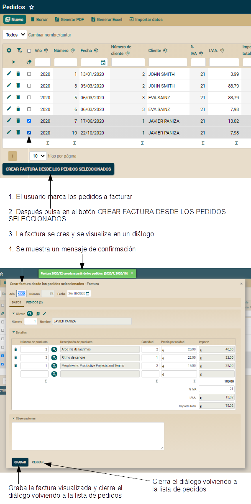\
Escribamos una prueba para verificar que esto funciona justo de esta forma. Añade el método *testCrearFacturaDesdePedidosSeleccionados()* a la clase *PruebaPedido*:

**public** **void** **testCrearFacturaDesdePedidosSeleccionados**() **throws** Exception {

`    `login("admin", "admin");

`    `verificarPedido(2021, 2, 1, "45.98"); *// El pedido 2021/2 tiene 1 línea y 45,98 de importe base*

`    `verificarPedido(2021, 4, 2, "98.01"); *// El pedido 2021/4 tiene 2 líneas y 98,01 de importe base*

`    `execute("List.orderBy", "property=numero"); *// Ordena la lista por número*

`    `checkRow( *// Marca la fila a partir del número de fila*

`        `getFilaDocumentoEnLista("2021", "2") *// Obtiene la fila del año y número del pedido*

`    `);             *// por tanto, esta línea marca la línea del pedido 2021/2 en la lista (1)*

`    `checkRow(

`        `getFilaDocumentoEnLista("2021", "4") *// Marca el pedido 2021/4 en la lista (1)*

`    `); 

`    `execute("Pedido.crearFacturaDesdePedidosSeleccionados"); *// Ejecuta la acción que*

`                                                             `*// estamos probando (2)*

`    `String anyoFactura = getValue("anyo"); *// Ahora estamos viendo el detalle de*

`    `String numeroFactura = getValue("numero"); *// la factura recién creada*

`    `assertMessage("Factura " + anyoFactura + "/" + numeroFactura +

`        `" creada a partir de los pedidos: [2021/2, 2021/4]"); *// El mensaje de confirmación*

`    `assertCollectionRowCount("detalles", 3); *// Confirma que el número de líneas de la*

`                      `*// factura recién creada es la suma de la de los pedidos fuente (3)*

`    `assertValue("importeTotal", "143,99"); *// Confirma que el importe base de la factura*

`                               `*// recién creada es la suma de la de los pedidos fuente (4)*

`    `execute("Sections.change", "activeSection=1"); *// Cambia a la pestaña de*

`                                                   `*// pedidos de la factura*

`    `assertCollectionRowCount("pedidos", 2); *// La nueva factura tiene 2 pedidos (5)*

`    `assertValueInCollection("pedidos", 0, 0, "2021"); *// y son los correctos*

`    `assertValueInCollection("pedidos", 0, 1, "2");

`    `assertValueInCollection("pedidos", 1, 0, "2021");

`    `assertValueInCollection("pedidos", 1, 1, "4");

`    `assertAction("EdicionFactura.grabar"); *// Los botones GRABAR (6)*

`    `assertAction("EdicionFactura.cerrar"); *// y CERRAR (6)*

`    `checkRowCollection("pedidos", 0); *// Seleccionamos los 2 pedidos*

`    `checkRowCollection("pedidos", 1);

`    `execute("Collection.removeSelected", *// y los borramos, para ejecutar esta prueba*

`        `"viewObject=xava\_view\_section1\_pedidos"); *// otra vez usando los mismo pedidos*

`    `assertNoErrors();

`    `execute("EdicionFactura.cerrar"); *// Vuelve a la lista de pedidos (7)*

`    `confirmarDocumentoEstaEnLista("2021", "2"); *// Confirma que estamos realmente*

`    `confirmarDocumentoEstaEnLista("2021", "4"); *// en la lista de pedidos*

}

Esta prueba marca dos pedidos (1) y pulsa en el botón CREAR FACTURA DESDE LOS PEDIDOS SELECCIONADOS (2). Entonces verifica que se ha creado una nueva factura con el número correcto de líneas (3), importe total (4) y lista de pedidos (5). También verifica que las acciones GRABAR y CERRAR están disponibles (6) y usa el botón CERRAR para volver a la lista de pedidos (7).\
Usamos *getFilaDocumentoEnLista()* y *confirmarDocumentoEstaEnLista()*, métodos de la clase base *PruebaDocumentoComercial*, que fueron definidos originalmente como privados, por lo tanto tenemos que redefinirlos como protegidos para poder utilizarlos desde *PruebaPedido*. Edita *PruebaDocumentoComercial* y haz los siguientes cambios:

**protected** **void** **confirmarDocumentoEstaEnLista**(String anyo, String numero) ... *// protected en lugar*

*// private void confirmarDocumentoEstaEnLista(String anyo, String numero) ... // de private*

**protected** **int** **getFilaDocumentoEnLista**(String anyo, String numero) ... *// protected en lugar*

*// private int getFilaDocumentoEnLista(String anyo, String numero) ... // de private*

El único detalle pendiente es el método *verificarPedido()* que veremos en la siguiente sección.

**Verificar datos de prueba**

En la lección sobre pruebas automáticas aprendiste como confiar en datos existentes en la base de datos para tus pruebas. Obviamente, si tu base de datos se altera accidentalmente tus pruebas, aunque correctas, no pasarán. Por tanto, verificar los valores de la base de datos antes de ejecutar la prueba que confía en ellos es una buena práctica. En nuestro ejemplo lo hacemos llamando a *verificarPedido()* al principio. Veamos el contenido de *verificarPedido()* en *PruebaPedido*:

**private** **void** **verificarPedido**(

`    `**int** anyo, **int** numero, **int** cantidadDetalles, String importeTotal)

{

`    `Pedido pedido = buscarPedido("anyo = " + anyo + " and numero=" + numero);

`    `assertEquals("Para ejecutar esta prueba el pedido " +

`        `pedido + " tiene que tener " + cantidadDetalles + " detalles",

`        `cantidadDetalles, pedido.getDetalles().size());

`    `assertTrue("Para ejecutar esta prueba el pedido " +

`        `pedido + " must have " + importeTotal + " como importe total",

`        `pedido.getImporteTotal().compareTo(**new** BigDecimal(importeTotal)) == 0);

`    `assertTrue("Para ejecutar esta prueba el pedido " + pedido + " tiene que estar entegrado",

`        `pedido.isEntregado());        

}

Este método busca un pedido y verifica la cantidad de líneas, el importe total y si el pedido está entregado. Usar este método tiene la ventaja de que si los pedidos necesarios para la prueba no están en la base de datos con los valores correctos obtienes un mensaje preciso. Así, no derrocharás tu tiempo intentando adivinar que es lo que está mal. Esto es especialmente útil si la prueba no la está ejecutando el programador original. Por cierto, si te resulta dificil adaptar tus pedidos para que se ajusten a esta prueba (número de pedido, importe, número de líneas), puedes adaptar los valores en la prueba a tus pedidos actuales.

**Probar casos excepcionales**

Dado que la acción para crear la factura se oculta si el pedido no está listo para ser facturado, no podemos probar el código para los casos excepcionales desde modo detalle. Sin embargo, en modo lista el usuario todavía tiene la opción de escoger cualquier pedido para facturar. Por tanto, intentaremos crear la factura desde la lista de pedidos para probar que los casos excepcionales se comportan correctamente. Añade el siguiente código a *PruebaPedido*:

**public** **void** **testExcepcionesCreandoFacturaDesdePedido**() **throws** Exception {

`    `login("admin", "admin");

`    `confirmarExcepcionCreandoFacturaDesdePedido( *// Confirma que cuando el pedido ya tiene (1)*

`        `"entregado = true and factura <> null", *// factura se produce el error correcto*

`        `"Ha sido imposible ejecutar la acción Crear factura desde pedidos seleccionados: " +

`            `"El pedido ya tiene una factura"

`    `);

`    `confirmarExcepcionCreandoFacturaDesdePedido( *// Confirma que cuando el pedido no está (2)*

`        `"entregado = false and factura = null", *// entregado se produce el error correcto*

`        `"Ha sido imposible ejecutar la acción Crear factura desde pedidos seleccionados: " + 

`            `"El pedido todavía no está entregado"

`    `);

}

**private** **void** **confirmarExcepcionCreandoFacturaDesdePedido**(

`    `String condicion, String mensaje) **throws** Exception

{

`    `Pedido pedido = buscarPedido(condicion); *// Busca el pedido por la condición (3)*

`    `**int** fila = getFilaDocumentoEnLista( *// y obtiene el número de fila para ese pedido (4)*

`       `String.valueOf(pedido.getAnyo()),

`       `String.valueOf(pedido.getNumero())

`    `);

`    `checkRow(fila); *// Marca la fila (5)*

`    `execute("Pedido.crearFacturaDesdePedidosSeleccionados"); *// Trata de crear la factura (6)*

`    `assertError(mensaje); *// ¿Se ha mostrado el mensaje esperado? (7)*

`    `uncheckRow(fila); *// Desmarca la fila, así podemos llamar a este método otra vez*

}

La prueba verifica que el mensaje es el correcto cuando tratamos de crear una factura a partir de un pedido que ya tiene factura (1), y también desde un pedido no entregado todavía (2). Para hacer estas verificaciones llama al método *confirmarExcepcionCreandoFacturaDesdePedido()*. Este método busca la entidad *Pedido* usando la condición (3), localiza la fila donde la entidad se está visualizando (4) y la marca (5). Después, la prueba ejecuta la acción (6) y verifica que el mensaje esperado se muestra (7).

**Probar referencias y colecciones**

**El código fuente a partir de aquí es para ponerlo encima del código de la sección *Referencias y colecciones*.**

Todavía tenemos la sana costumbre de hacer un poco de código de aplicación, y después un poco de código de pruebas. Y ahora es el tiempo de escribir el código de pruebas para las nuevas características añadidas en la sección *Referencias y colecciones*.

**Adaptar *PruebaPedido***

Si ejecutaras *PruebaPedido* ahora, no pasaría. Esto es porque nuestro código confía en ciertos detalles que han cambiado. Por lo tanto, hemos de modificar nuestro código de pruebas actual. Edita el método *testPonerFactura()* de *PruebaPedido* y aplica los siguientes cambios:

**public** **void** **testPonerFactura**() **throws** Exception {

...

`    `assertValue("factura.numero", "");

`    `assertValue("factura.anyo", "");

`    `*// execute("Reference.search", // Ya no usamos la acción estándar para*

`    `*//    "keyProperty=factura.anyo"); // buscar la factura, en su lugar*

`    `execute("Pedido.buscarFactura", *// usamos nuestra acción personalizada (1)*

`        `"keyProperty=factura.numero");

`    `execute("List.orderBy", "property=numero");

...

`    `*// Restaurar valores*

`    `setValue("factura.anyo", ""); *// Ahora es necesario teclear el año*

`    `setValue("factura.numero", ""); *// y el número para buscar la factura (2)*

`    `setValue("entregado", "false");

`    `execute("CRUD.save");

`    `assertNoErrors();

}

Recuerda que anotamos la referencia *factura* en *Pedido* con *@SearchAction("Pedido.buscarFactura")*, por tanto hemos de modificar la prueba para llamar a *Pedido.buscarFactura* (1) en vez de a *Reference.search*. También añadimos *@SearchKey* a *anyo* y *numero* de *CommercialDocument*, por lo tanto nuestra prueba ha de indicar *anyo* tanto como *numero* para obtener (o en este caso borrar) una factura (2). Por causa de esto último también hemos de modificar *testCrearFacturaDesdePedido()* de *PruebaPedido* como se muestra:

**public** **void** **testCrearFacturaDesdePedido**() **throws** Exception {

...

`    `*// Restaurar el pedido para ejecutar la prueba la siguiente vez*

`    `setValue("factura.anyo", ""); *// Ahora es necesario teclear el año*

`    `setValue("factura.numero", ""); *// y el número para buscar la factura (2)*

`    `assertValue("factura.numero", "");

`    `assertCollectionRowCount("factura.detalles", 0);

`    `execute("CRUD.save");

`    `assertNoErrors();

}

Después de estos cambios *PruebaPedido* tiene que pasar. Sin embargo, todavía nos queda probar la nueva funcionalidad del módulo *Pedido*.

**Probar *@SearchAction***

Hemos usado *@SearchAction* en la referencia *factura* de *Pedido* para mostrar en la lista de búsqueda solo facturas del cliente del pedido actual. Añade el siguiente método a *PruebaPedido* para probar esta funcionalidad :

**public** **void** **testBuscarFacturaDesdePedido**() **throws** Exception {

`    `login("admin", "admin");      

`    `execute("CRUD.new");

`    `setValue("cliente.numero", "1"); *// Si el cliente es 1...*

`    `execute("Sections.change", "activeSection=1");

`    `execute("Pedido.buscarFactura", *// ...cuando el usuario pulsa para escoger una factura...*

`        `"keyProperty=factura.numero");

`    `confirmarClienteEnTodasFilas("1"); *// ...sólo se muestran las facturas del cliente 1*

`    `execute("ReferenceSearch.cancel");

`    `execute("Sections.change", "activeSection=0");

`    `setValue("cliente.numero", "2"); *// Y si el cliente es 2...*

`    `execute("Sections.change", "activeSection=1");

`    `execute("Pedido.buscarFactura", *// ...cuando el usuario pulsa para escoger una factura...*

`        `"keyProperty=factura.numero");

`    `confirmarClienteEnTodasFilas("2"); *// ...sólo se muestran las facturas del cliente 2*

}

La parte más peliaguda es verificar la lista de facturas, este es el trabajo *confirmarClienteEnTodasFilas()* en *PruebaPedido*:

**private** **void** **confirmarClienteEnTodasFilas**(String numeroCliente) **throws** Exception {

`    `assertListNotEmpty();

`    `**int** c = getListRowCount();

`    `**for** (**int** i=0; i<c; i++) { *// Un bucle por todas las filas*

`        `**if** (!numeroCliente.equals(getValueInList(i, "cliente.numero"))) {

`            `fail("Cliente en fila " + i + *// Si el cliente no es el esperado falla*

`                `" no es " + numeroCliente);

`        `}

`    `}

}

Consiste en un bucle por todas la filas verificando el número de cliente.

**Probar *@OnChangeSearch***

Hemos usado *@OnChangeSearch* en la referencia *factura* de *Pedido* para asignar automáticamente el cliente de la factura escogida al pedido actual cuando el usuario todavía no tiene cliente, o para verificar que el cliente de la factura y del pedido coinciden, si el pedido ya tiene cliente. Aquí se muestra el método de prueba en *PruebaPedido*:

**public** **void** **testAlCambiarFactura**() **throws** Exception {

`    `login("admin", "admin");

`    `execute("CRUD.new"); *// Estamos creando un nuevo pedido*

`    `assertValue("cliente.numero", ""); *// por tanto no tiene cliente todavía*

`    `execute("Sections.change", "activeSection=1");

`    `execute("Pedido.buscarFactura", *// Busca la factura usando una lista*

`        `"keyProperty=factura.numero");

`    `execute("List.orderBy", "property=cliente.numero"); *// Ordena por cliente*

`    `String numeroCliente1 = getValueInList(0, "cliente.numero"); *// Memoriza..*

`    `String anyoFactura1 = getValueInList(0, "anyo"); *// ...los datos de la...*

`    `String numeroFactura1 = getValueInList(0, "numero"); *// ...primera factura*

`    `execute("List.orderBy", "property=cliente.numero"); *// Ordena por cliente*

`    `String numeroCliente2 = getValueInList(0, "cliente.numero"); *// Memoriza...*

`    `String nombreCliente2 = getValueInList(0, "cliente.nombre"); *// ...los datos de...*

`                                                                 `*// ...la última factura*

`    `assertNotEquals("Han de ser facturas de diferentes clientes",

`        `numeroCliente1, numeroCliente2);*// Las 2 facturas memorizadas no son la misma*

`    `execute("ReferenceSearch.choose","row=0"); *// La factura se escoge con la lista (1)*

`    `execute("Sections.change", "activeSection=0");

`    `assertValue("cliente.numero", numeroCliente2); *// Los datos del cliente*

`    `assertValue("cliente.nombre", nombreCliente2); *// se rellenan automáticamente (2)*

`    `execute("Sections.change", "activeSection=1");

`    `setValue("factura.anyo", anyoFactura1); *// Tratamos de poner una factura de...*

`    `setValue("factura.numero", numeroFactura1); *// ...otro cliente (3)*

`    `assertError("Cliente Nº " + numeroCliente1 + " de la factura " + *// Muestra...*

`        `anyoFactura1 + "/" + numeroFactura1 + *// ...un mensaje de error... (4)*

`        `" no coincide con el cliente Nº " +

`        `numeroCliente2 + " del pedido actual");

`    `assertValue("factura.anyo", ""); *// ...y reinicia los datos de la factura (5)*

`    `assertValue("factura.numero", "");

`    `assertValue("factura.fecha", "");

}

Aquí probamos que nuestra acción *@OnChangeSearch* rellene los datos del cliente (3) al escoger una factura (2), y que si el cliente ya está establecido se muestre un mensaje de error (4) y la factura se borre de la vista (5). Fíjate como la primera vez usamos la lista (1) para escoger la factura y la segunda lo hacemos tecleando el año y el número (3).

**Adaptar *PruebaFactura***

Como en el caso de *PruebaPedido*, *PruebaFactura* también falla. Has de hacer unos pequeños ajustes para que funcione. Edita *testAnyadirPedidos()* de *PruebaFactura* y aplica los siguiente cambios:

**public** **void** **testAnyadirPedidos**() **throws** Exception {

`    `login("admin", "admin");

`    `assertListNotEmpty();

`    `execute("List.orderBy", "property=numero");

`    `execute("List.viewDetail", "row=0");

`    `execute("Sections.change", "activeSection=1");

`    `assertCollectionRowCount("pedidos", 0);

`    `*// execute("Collection.add", // La acción estándar para añadir pedidos ya no se usa*

`    `execute("Factura.anyadirPedidos", *// En su lugar usamos nuestra propia acción*

`        `"viewObject=xava\_view\_section1\_pedidos");

`    `*// seleccionarPrimerPedidoConEntregadoIgual("Entregado"); // Ahora todos los pedidos de la lista* 

`    `*// seleccionarPrimerPedidoConEntregadoIgual(""); // están entregados; esto ya no hace falta* 	

`    `*// execute("AddToCollection.add"); // En lugar de la acción estándar*

`    `execute("AnyadirPedidosAFactura.add", "row=0"); *// ...ahora tenemos la nuestra propia*

`    `*// assertError("¡ERROR! 1 elemento(s) NO añadido a Pedidos de Factura"); // Es*

`                  `*// imposible porque el usuario no puede escoger pedidos incorrectos*

`    `assertMessage("1 elemento(s) añadido a Pedidos de Factura");

`    `assertCollectionRowCount("pedidos", 1);

`    `checkRowCollection("pedidos", 0);

`    `execute("Collection.removeSelected",

`        `"viewObject=xava\_view\_section1\_pedidos");

`    `assertCollectionRowCount("pedidos", 0);

}

Ya no necesitamos el método *seleccionarPrimerPedidoConEntregadoIgual()*, por tanto podemos quitarlo de *PruebaFactura*:

*// Quita seleccionarPrimerPedidoConEntregadoIgual() de PruebaFactura*

*// private void seleccionarPrimerPedidoConEntregadoIgual(String valor)*

*// throws Exception { ... }*

Después de estos cambios *PruebaFactura* ha de funcionar. Sin embargo, todavía nos queda probar la nueva funcionalidad del módulo *Factura*.

**Probar *@AddAction***

En esta lección anotamos la colección *pedidos* de *Factura* con *@AddAction* para refinar la lista de pedidos a ser añadidos a la colección. De esta forma solo los pedidos entregados del cliente de la factura actual y todavía sin facturar se mostraban. Vamos a probar esto, y al mismo tiempo, aprenderemos como refactorizar el código existente para poder reutilizarlo. \
Primero queremos verificar que la lista para añadir pedidos solo contiene pedidos del cliente actual. El siguiente código muestra los cambios en *testAnyadirPedidos()* para conseguir esto:

**public** **void** **testAnyadirPedidos**() **throws** Exception {

`    `login("admin", "admin");

`    `assertListNotEmpty();

`    `execute("List.orderBy", "property=numero");

`    `execute("List.viewDetail", "row=0");

`    `String numeroCliente = getValue("cliente.numero"); *// Tomamos nota del*

`    `execute("Sections.change", "activeSection=1");  *// cliente de la factura*

`    `assertCollectionRowCount("pedidos", 0);

`    `execute("Factura.anyadirPedidos",

`        `"viewObject=xava\_view\_section1\_pedidos");

`    `confirmarClienteEnTodasFilas(numeroCliente); *// Confirmamos que todos los cliente en*

`                               `*// la lista coinciden con el cliente de la factura*

...

}

Ahora hemos de escribir el método *confirmarClienteEnTodasFilas()*. Pero, espera un momento, ya hemos escrito este método en *PruebaPedido*. Estamos en *PruebaFactura* por tanto no podemos llamar a este método. Por fortuna tanto *PruebaFactura* como *PruebaPedido* heredan de *PruebaDocumentoComercial*, por lo tanto sólo tenemos que subir el método a la clase madre. Para hacer esto copia el método *confirmarClienteEnTodasFilas()* desde *PruebaPedido* a *PruebaDocumentoComercial*, cambiando *private* por *protected*, tal como se muestra:

**abstract** **public** **class** **PruebaDocumentoComercial** **extends** **ModuleTestBase** {

`    `**protected** **void** *// Cambiamos de private a protected*

`        `confirmarClienteEnTodasFilas(String numeroCliente) **throws** Exception {

...

`    `}

...

}

Ahora puedes quitar el método *confirmarClienteEnTodasFilas()* de *PruebaPedido*:

*// Quita confirmarClienteEnTodasFilas() de PruebaPedido*

*// private void confirmarClienteEnTodasFilas(String numeroCliente)*

*//     throws Exception { ... }*

Después de estos cambios el método *testAnyadirPedidos()* compila y funciona. No solo queremos comprobar que la lista de pedidos son del cliente correcto, sino también que están entregados. Nuestro primer impulso es copiar y pegar *confirmarClienteEnTodasFilas()* para crear un método *confirmarEntregadoEnTodasFilas()*. Sin embargo, resistimos la tentación, y en vez de eso vamos a crear un método reutilizable. Primero, copiamos y pegamos *confirmarClienteEnTodasFilas()* como *confirmarValorEnTodasFilas()*. Aquí puedes ver estos dos métodos en *PruebaDocumentoComercial*:

**protected** **void** **confirmarClienteEnTodasFilas**(String numeroCliente) **throws** Exception {

`    `assertListNotEmpty();

`    `**int** c = getListRowCount();

`    `**for** (**int** i=0; i<c; i++) { 

`        `**if** (!numeroCliente.equals(

`		    `getValueInList(i, "cliente.numero"))) *// Preguntamos por el cliente de forma fija*

`        `{

`            `fail("Cliente en fila " + i + 

`                `" no es " + numeroCliente);

`        `}

`    `}

}

**protected** **void** **confirmarValorEnTodasFilas**(**int** columna, String valor) **throws** Exception {

`    `assertListNotEmpty();

`    `**int** c = getListRowCount();

`    `**for** (**int** i=0; i<c; i++) {

`        `**if** (!valor.equals(

`            `getValueInList(i, columna))) *// Preguntamos por la columna enviada como parámetro*

`        `{

`            `fail("Columna " + columna + " en fila " + i + " no es " + valor);

`        `}

`    `}

}

Puedes ver como con unas ligeras modificaciones hemos convertido en un método genérico para preguntar por el valor de cualquier columna, no solo por la del número de cliente. Ahora hemos de quitar el código redundante, puedes, bien quitar *confirmarClienteEnTodasFilas()* o bien reimplementarlo usando el nuevo método. El siguiente código en *PruebaDocumentoComercial* muestra la última opción:

**protected** **void** **confirmarClienteEnTodasFilas**(String numeroCliente) **throws** Exception {

`    `confirmarValorEnTodasFilas(3, numeroCliente); *// Número de cliente está en la columna 3*

}

Usemos *confirmarValorEnTodasFilas()* para verificar que la lista de pedidos contiene solo pedidos entregados. El siguiente código muestra la modificación necesaria en *testAnyadirPedidos()* de *PruebaFactura*.

**public** **void** **testAnyadirPedidos**() **throws** Exception {

`    `login("admin", "admin");

`    `assertListNotEmpty();

`    `execute("List.orderBy", "property=numero");

`    `execute("List.viewDetail", "row=0");

`    `String numeroCliente = getValue("cliente.numero");

`    `execute("Sections.change", "activeSection=1");

`    `assertCollectionRowCount("pedidos", 0);

`    `execute("Factura.anyadirPedidos",

`        `"viewObject=xava\_view\_section1\_pedidos");

`    `confirmarClienteEnTodasFilas(numeroCliente);

`    `confirmarValorEnTodasFilas(12, "Entregado"); *// Todas las celdas de la columna 12* 

`                                                `*// tienen 'Entregado'*

...

}

Además, queremos que solo los pedidos sin factura se muestren en la lista. Una forma sencilla de hacerlo es verificando que después de añadir un pedido a la factura actual, la lista de pedidos tenga una entrada menos. El siguiente código muestra los cambios necesarios en *testAnyadirPedidos()* de *PruebaFactura* para hacer esto:

**public** **void** **testAnyadirPedidos**() **throws** Exception {

...

`    `confirmarClienteEnTodasFilas(numeroCliente);

`    `confirmarValorEnTodasFilas(12, "Entregado");

`    `**int** cantidadPedidos = getListRowCount(); *// Tomamos nota de la cantidad de pedidos*

`    `execute("AnyadirPedidosAFactura.add", "row=0"); *// cuando se muestra la lista*

`    `assertMessage("1 elemento(s) añadido a Pedidos de Factura");

`    `assertCollectionRowCount("pedidos", 1); *// Se añadió un pedido*

`    `execute("Factura.anyadirPedidos", *// Mostramos la lista de pedidos otra vez*

`        `"viewObject=xava\_view\_section1\_pedidos");

`    `assertListRowCount(cantidadPedidos - 1); *// Tenemos un pedido menos en la lista*

`    `execute("AddToCollection.cancel");

...

}

Con el código de esta sección hemos probado la *@AddAction* de la colección *pedidos*, y al mismo tiempo hemos visto como no es necesario crear código genérico desde el principio, porque no es difícil convertir el código concreto en genérico bajo demanda.

**Probar la acción para añadir elementos a la colección**

En esta lección también aprendimos como refinar la acción para añadir pedidos a la factura, ahora es el momento de escribir su correspondiente código de prueba. Recuerda que esta acción copia las líneas de los pedidos seleccionados a la factura actual. El siguiente código muestra los cambios en *testAnyadirPedidos()* de *PruebaFactura* para probar nuestra acción personalizada para añadir pedidos:

**public** **void** **testAnyadirPedidos**() **throws** Exception {

...

`    `String numeroCliente = getValue("cliente.numero");

`    `assertCollectionRowCount("detalles", 0); *// Factura sin detalles para esta preuba (1)*

`    `assertValue("importeTotal", "0,00"); *// Sin detalles el importe total es 0*

`    `execute("Sections.change", "activeSection=1");

`    `assertCollectionRowCount("pedidos", 0);

`    `execute("Factura.anyadirPedidos", *// Cuando mostramos la lista de pedidos (2) ...*

`        `"viewObject=xava\_view\_section1\_orders");

`    `confirmarClienteEnTodasFilas(numeroCliente);

`    `confirmarValorEnTodasFilas(12, "Entregado");

`    `String importeTotalPrimerPedido = getValueInList(0, 7); *//..tomamos nota del importe*

`    `**int** cantidadPedidos = getListRowCount();    *// base del primer pedido de la lista (3)*

...

`    `assertCollectionRowCount("pedidos", 1);

`    `execute("Sections.change", "activeSection=0");

`    `assertCollectionNotEmpty("detalles"); *// Hay detalles, han sido copiados (4)*

`    `assertValue("importeTotal", importeTotalPrimerPedido); *// El importe total de la factura*

`    `execute("Sections.change", "activeSection=1"); *// coincide con el del*

`                                                   `*// pedido recién añadido (5)*

...

`    `execute("Sections.change", "activeSection=0"); *// Volvemos a la pestaña de detalles de la factura*

`    `eliminarFilas(); *// Eliminamos las filas que se agregaron (6)*   

`    `waitAJAX(); *// Esperamos que se completen los procesos JS de fondo*

`    `assertCollectionRowCount("detalles", 0); *// Verificamos nuevamente que no hayan filas*

`    `assertValue("importeTotal", "0,00");

`    `execute("CRUD.save");

}

Primero, Verificamos que la factura para esta prueba no tiene detalles (1), después añadimos un pedido (2), tomando nota de su importe total (3), entonces verificamos que la factura actual tiene detalles (4) y que su importe total es el mismo que el del pedido añadido (5), por último borramos las filas que tiene detalles (6). Agregamos el siguiente código en la misma clase de PruebaFactura:

**protected** **void** **eliminarFilas**() **throws** Exception {

`  `*// contamos la cantidad de filas que hay en la tabla, para este ejemplo debemos tener menos de 100 elementos en la tabla*

`  `**int** contador = getHtmlPage().getElementById("ox\_facturacion\_Factura\_\_detalles") *// (1)*

.getChildElements().iterator().next().getChildElementCount()-7; *//(2)*

`  `**for** (**int** i=0; i < contador; i++) { 

`	`HtmlElement boton = (HtmlElement)getHtmlPage().getElementById("ox\_facturacion\_Factura\_\_detalles\_\_\_0") *// (3)*

.getChildElements().iterator().next()

.getChildElements().iterator().next()

.getChildElements().iterator().next()

.getChildElements().iterator().next(); *// (4)*

`	`boton.click(); *// (5)*

`   `}

}

Normalmente para ejecutar un botón, usamos "controlador.accion", por ejemplo para guardar usamos *"CRUD.save"*, pero en este caso, el boton que elimina la fila es una función JavaScript, por lo que no lo podemos ejecutar de esta manera. Para lograrlo debemos usar la librería de HtmlUnit.

Para saber la cantidad de filas que hay en la tabla de detalles, accedemos al código de html con *getHtmlPage()* y filtramos los elementos de la página por id con *getElementById()* pasando el id de la tabla como parámetro: *"ox\_facturacion\_Factura\_\_detalles"* (1), con *getChildElements()* nos dará el elemento hijo que es el cuerpo de la tabla, cada fila de la tabla esta representado como un elemento en el cuerpo de la tabla, por lo que usamos *getChildElementCount()* para saber cuantos elementos tiene y restamos 7 que son las filas que siempre están presentes (2).

Ahora vamos a eliminar todas las filas de la tabla, si lo haces manualmente notarás que al eliminar una fila, la de abajo sube arriba.

Vamos a iterar la cantidad de veces como sea necesario usando el *contador*, pero esta vez pasaremos como parámetro el id de la primera fila *"ox\_facturacion\_Factura\_\_detalles\_\_\_0"* (3), el 0 es la enumeración de la fila pero como dijimos recién, al eliminar una fila, la de abajo sube, entonces basta con eliminar siempre la primera fila. Luego llegaremos al elemento donde tenga la funcion del botón (4) y es allí donde paramos y le haremos click (5).

El método *testAnyadirPedidos()* está acabado. Éste es su código definitivo:

**public** **void** **testAnyadirPedidos**() **throws** Exception {

`    `login("admin", "admin");

`    `assertListNotEmpty();

`    `execute("List.orderBy", "property=numero");

`    `execute("List.viewDetail", "row=0");

`    `String numeroCliente = getValue("cliente.numero");

`    `assertCollectionRowCount("detalles", 0);

`    `assertValue("importeTotal", "0,00");

`    `execute("Sections.change", "activeSection=1");

`    `assertCollectionRowCount("pedidos", 0);

`    `execute("Factura.anyadirPedidos",

`        `"viewObject=xava\_view\_section1\_pedidos");

`    `confirmarClienteEnTodasFilas(numeroCliente);

`    `confirmarValorEnTodasFilas(12, "Entregado");

`    `String importeTotalPrimerPedido = getValueInList(0, 7);

`    `**int** cantidadPedidos = getListRowCount();

`    `execute("AnyadirPedidosAFactura.add", "row=0");

`    `assertMessage("1 elemento(s) añadido(s) a Pedidos de Factura");

`    `assertCollectionRowCount("pedidos", 1);

`    `execute("Sections.change", "activeSection=0");

`    `assertCollectionNotEmpty("detalles");

`    `assertValue("importeTotal", importeTotalPrimerPedido);

`    `execute("Sections.change", "activeSection=1");

`    `execute("Factura.anyadirPedidos",

`        `"viewObject=xava\_view\_section1\_pedidos");

`    `assertListRowCount(cantidadPedidos - 1);

`    `execute("AddToCollection.cancel");

`    `checkRowCollection("pedidos", 0);

`    `execute("Collection.removeSelected",

`        `"viewObject=xava\_view\_section1\_pedidos");

`    `assertCollectionRowCount("pedidos", 0);

`    `execute("Sections.change", "activeSection=0"); 

`    `eliminarFilas();   

`    `waitAJAX();

`    `assertCollectionRowCount("detalles", 0);

`    `assertValue("importeTotal", "0,00");

`    `execute("CRUD.save");

}

