El propósito de este curso es enseñarte a desarrollar aplicaciones Java Web de gestión usando OpenXava y otras tecnologías, herramientas y marcos de trabajo relacionados. El camino para conseguir este objetivo va a ser desarrollar una aplicación desde cero, paso a paso, hasta obtener una aplicación de gestión completamente funcional.\
La [guía de referencia](C:\Users\Soporte\Documents\openxava\openxava-doc\web\docs\reference_es.html) de OpenXava describe con precisión toda la sintaxis de OpenXava junto con su semántica. Sin duda, es una herramienta esencial que permite conocer todos los secretos de OpenXava. Pero, si eres principiante en el mundo *Java Enterprise* puede ser que necesites algo más que una documentación de referencia. Querrás tener mucho código de ejemplo y también aprender las demás tecnologías necesarias para crear una aplicación final.\
En este curso aprenderás, no solo OpenXava, sino también JPA,  JUnit, Bean Validation, etc. Y lo más importante, vas a aprender técnicas para resolver casos comunes y avanzados a los que te enfrentarás al desarrollar aplicaciones de gestión.\
No dudes en preguntar en el [foro de ayuda](http://sourceforge.net/p/openxava/discussion/437013/) (https://sourceforge.net/p/openxava/discussion/437013/), si tienes algún problema o poner tus sugerencias en el [foro de debate](http://sourceforge.net/p/openxava/discussion/437015/).

**Primeros pasos**

- [Lección 1: Primeros pasos](C:\Users\Soporte\Documents\openxava\openxava-doc\web\docs\getting-started_es.html)

  **Modelar con Java**

- [Lección 2: Modelo básico del dominio - Parte 1](C:\Users\Soporte\Documents\openxava\openxava-doc\web\docs\basic-domain-model1_es.html)
- [Lección 3: Modelo básico del dominio - Parte 2](C:\Users\Soporte\Documents\openxava\openxava-doc\web\docs\basic-domain-model2_es.html)
- [Lección 4: Refinar la interfaz de usuario](C:\Users\Soporte\Documents\openxava\openxava-doc\web\docs\refining-user-interface_es.html)
- [Lección 5: Desarrollo ágil](C:\Users\Soporte\Documents\openxava\openxava-doc\web\docs\agile-development_es.html)

  **Herencia**

- [Lección 6: Herencia de superclases mapedas](C:\Users\Soporte\Documents\openxava\openxava-doc\web\docs\mapped-superclass-inheritance_es.html)
- [Lección 7: Herencia de entidades](C:\Users\Soporte\Documents\openxava\openxava-doc\web\docs\entity-inheritance_es.html)
- [Lección 8. Herencia de vistas](C:\Users\Soporte\Documents\openxava\openxava-doc\web\docs\view-inheritance_es.html)

  **Lógica de negocio básica**

- [Lección 9: Propiedades Java\
  ](C:\Users\Soporte\Documents\openxava\openxava-doc\web\docs\java-properties_es.html)[Lección 10: Propiedades calculadas\
  ](C:\Users\Soporte\Documents\openxava\openxava-doc\web\docs\calculated-properties_es.html)[Lección 11: @DefaultValueCalculator en colecciones\
  ](C:\Users\Soporte\Documents\openxava\openxava-doc\web\docs\defaultvaluecalculator-in-collections_es.html)[Lección 12: @Calculation y totales de colección](C:\Users\Soporte\Documents\openxava\openxava-doc\web\docs\calculation-and-collections-total_es.html)
- [Lección 13: @DefaultValueCalculator desde archivo\
  ](C:\Users\Soporte\Documents\openxava\openxava-doc\web\docs\defaultvaluecalculator-from-file_es.html)[Lección 14: Evolución de esquema manual\
  ](C:\Users\Soporte\Documents\openxava\openxava-doc\web\docs\manual-schema-evolution_es.html)[Lección 15: Cálculo de valor por defecto multiusuario\
  ](C:\Users\Soporte\Documents\openxava\openxava-doc\web\docs\multi-user-default-value-calculation_es.html)[Lección 16: Sincronizar propiedades persistentes y calculadas\
  ](C:\Users\Soporte\Documents\openxava\openxava-doc\web\docs\synchronize-persistent-and-computed-properties_es.html)[Lección 17: Lógica desde la base de datos](C:\Users\Soporte\Documents\openxava\openxava-doc\web\docs\logic-from-database_es.html)

  **Validación avanzada**

- [Lección 18: Validando con @EntityValidator](C:\Users\Soporte\Documents\openxava\openxava-doc\web\docs\validating-with-entityvalidator_es.html)
- [Lección 19: Alternativas de validación](C:\Users\Soporte\Documents\openxava\openxava-doc\web\docs\validation-alternatives_es.html)
- [Lección 20: Validación al borrar](C:\Users\Soporte\Documents\openxava\openxava-doc\web\docs\validation-on-remove_es.html)
- [Lección 21: Anotación Bean Validation propia](C:\Users\Soporte\Documents\openxava\openxava-doc\web\docs\custom-bean-validation-annotation_es.html)
- [Lección 22: Llamada REST desde una validación](C:\Users\Soporte\Documents\openxava\openxava-doc\web\docs\rest-service-call-from-validation_es.html)
- [Lección 23: Atributos en anotaciones](C:\Users\Soporte\Documents\openxava\openxava-doc\web\docs\attributes-in-annotations_es.html)

  **Refinar el comportamiento predefinido**

- [Lección 24: Refinar el comportamiento predefinido](C:\Users\Soporte\Documents\openxava\openxava-doc\web\docs\refining-standard-behavior_es.html)

  **Comportamiento y lógica de negocio**

- [Lección 25: Comportamiento y lógica de negocio](C:\Users\Soporte\Documents\openxava\openxava-doc\web\docs\business-logic-behavior_es.html)

  **Referencias y colecciones**

- [Lección 26: Referencias y colecciones](C:\Users\Soporte\Documents\openxava\openxava-doc\web\docs\references-collections_es.html)

  **Apéndices**

- [Apéndice A: Arquitectura y filosofía](C:\Users\Soporte\Documents\openxava\openxava-doc\web\docs\philosophy_es.html)
- [Apéndice B: Java Persistence API](C:\Users\Soporte\Documents\openxava\openxava-doc\web\docs\jpa_es.html)
- [Apéndice C: Anotaciones](C:\Users\Soporte\Documents\openxava\openxava-doc\web\docs\annotations_es.html)
- [Apéndice D: Pruebas automáticas](C:\Users\Soporte\Documents\openxava\openxava-doc\web\docs\testing_es.html)

  **Primeros pasos**

- [Lección 1: Primeros pasos](C:\Users\Soporte\Documents\openxava\openxava-doc\web\docs\getting-started_es.html)
  ## Crear un proyecto nuevo
  En primer lugar has de crear un proyecto OpenXava nuevo:\
  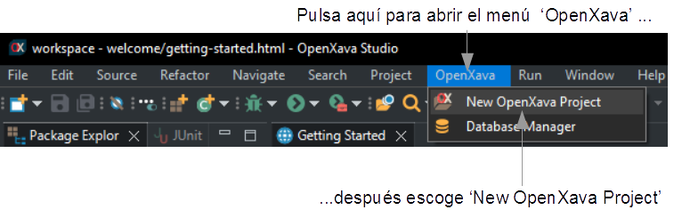\
  Entonces aparecerá un asistente. Teclea el nombre del proyecto, *facturacion*. Recuerda también escoger *Español* como idioma para que el código de este tutorial funcione bien. Presiona en *Finish*:\
  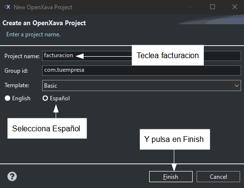

  Ahora tu proyecto ya está listo para empezar a escribir código:\
  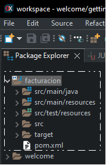
  ## Crear tu primera entidad
  Desarrollar es muy fácil: solo has de añadir entidades para ir haciendo crecer tu aplicación. Empezaremos con una versión simplificada de *Cliente* con solo *numero* y *nombre*.

  Abre la carpeta *src/main/java*, allí selecciona el paquete *com.tuempresa.facturacion.modelo* y pulsa el botón *New Java Class*:\
  ![getting-started_es125.png]\
  Después teclea *Cliente* como nombre de clase y pulsa *Finish*.\
  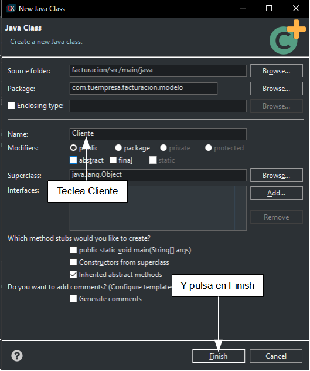\
  Fíjate que la *C* de *Cliente* está en mayúscula, esto es muy importante, en Java todas las clases empiezan con mayúscula.\
  El código inicial que Eclipse proporciona para *Cliente* es muy simple:

**package** com.tuempresa.facturacion.modelo;

**public** **class** **Cliente** {

}

Ahora, te toca a ti rellenar esta clase para convertirla en una entidad adecuada para OpenXava. Solo necesitas añadir la anotación *@Entity* y las propiedades *numero* y *nombre*:

**package** com.tuempresa.facturacion.modelo;

**import** javax.persistence.\*;

**import** org.openxava.annotations.\*;

**import** lombok.\*;

**@Entity**  *// Esto marca la clase Cliente como una entidad*

**@Getter** **@Setter** *// Esto hace los campos a continuación públicamente accesibles*

**public** **class** **Cliente** {

`    `**@Id**  *// La propiedad numero es la clave.  Las claves son obligatorias (required) por defecto*

`    `**@Column**(length=6)  *// La longitud de columna se usa a nivel UI y a nivel DB*

`    `**int** numero;

`    `**@Column**(length=50) *// La longitud de columna se usa a nivel UI y a nivel DB*

`    `**@Required**  *// Se mostrará un error de validación si la propiedad nombre se deja en blanco*

`    `String nombre;

}

Con esto tienes el código suficiente (justo una clase) para ejecutar tu aplicación. Hagámoslo.
## Ejecutar la aplicación
Pulsa el botón *Run*:\
![getting-started_es150.png]

Espera hasta que la consola muestre un mensaje diciendo "Aplicación iniciada", como este:

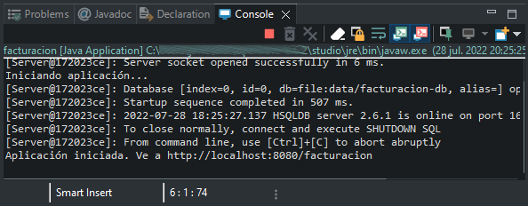

Ya tienes tu aplicación ejecutándose. Para verla, abre tu navegador favorito (Chrome, Firefox, Edge o Safari) y ve a la siguiente URL:

`    `*[*http://localhost:8080/facturacion*](http://localhost:8080/facturacion)*

Estás viendo tu aplicación por primera vez. Para empezar pulsa en el botón *Iniciar sesión*:\
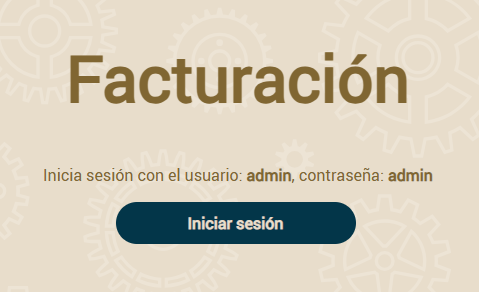

Ahora, introduce admin/admin y pulsa en *Entrar*:

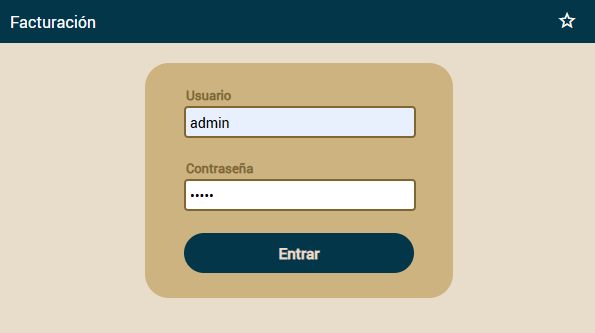

Después, pulsa en la parte de la izquierda se mostrará una lista de módulos, escoge *Clientes*:\
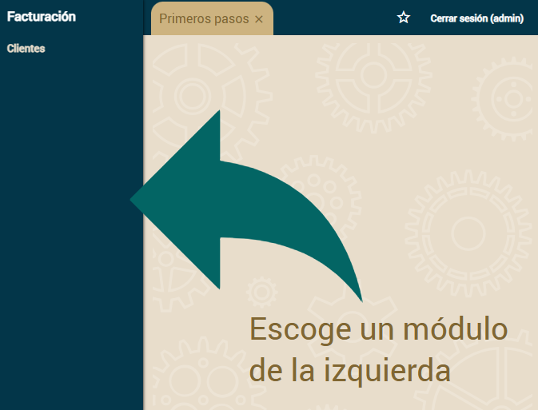\
Usa el módulo *Clientes* para crear nuevos clientes, simplemente introduce el número y el nombre y pulsa *Grabar*.\
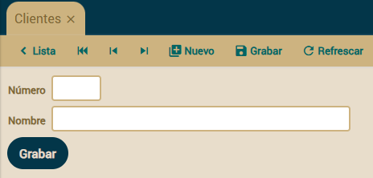\
Pulsa en *Lista* para ver los clientes que has creado. Enhorabuena, tienes tu primera aplicación OpenXava funcionando.
## Modificar la aplicación
A partir de ahora, desarrollar con OpenXava es muy fácil. Simplemente, escribes una clase y ya puedes ver el resultado en el navegador. Creemos una entidad para *Producto*.

Selecciona el paquete *com.tuempresa.facturacion.modelo* y pulsa el botón *New Java Class*:\
![getting-started_es125.png]\
Después teclea *Producto* como nombre de clase y pulsa *Finish*.\
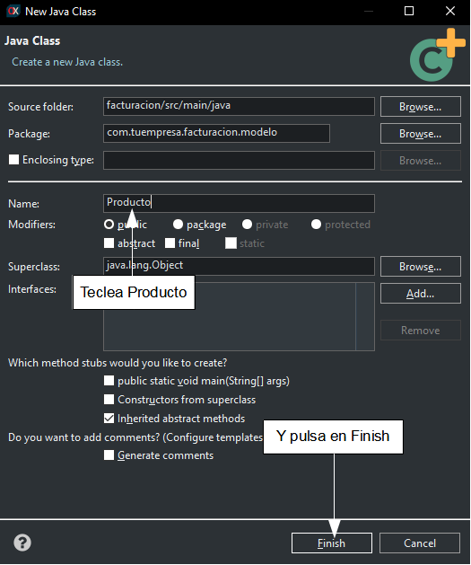

Escribe el siguiente código para *Producto*:

**package** com.tuempresa.facturacion.modelo;

**import** javax.persistence.\*;

**import** org.openxava.annotations.\*;

**import** lombok.\*;

**@Entity** **@Getter** **@Setter**

**public** **class** **Producto** {

`    `**@Id** **@Column**(length=9)

`    `**int** numero;

`    `**@Column**(length=50) **@Required**

`    `String descripcion;

}

Ahora, pulsa el botón *Run*, esto parará la aplicación y la volverá a iniciar:

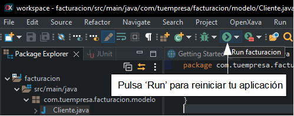

*Nota: En versiones recientes de OpenXava ya no es necesario reiniciar la aplicación para ver los cambios, gracias a la [*recarga de código en caliente*](C:\Users\Soporte\Documents\openxava\openxava-doc\web\docs\hot-code-reloading_es.html).*

Para ver tu nueva entidad en acción abre tu navegador y ve a la URL:

`    `*[*http://localhost:8080/facturacion/modules/Producto*](http://localhost:8080/facturacion/modules/Producto)*

Después de identificarte con admin/admin obtendrás:\
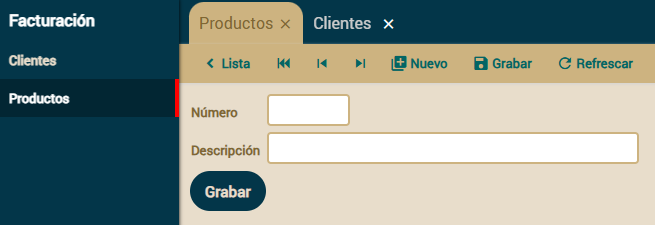\
Sí, ya tienes un nuevo módulo en marcha, y solo has tenido que escribir una simple clase. Ahora puedes concentrarte en hacer crecer tu aplicación.

## [**Lección 2: Modelo básico del dominio - Parte 1**](C:\Users\Soporte\Documents\openxava\openxava-doc\web\docs\basic-domain-model1_es.html)
## Modelo del dominio
Primero crearemos las entidades para tu aplicación *facturacion*. El modelo del dominio es más bien básico, pero suficiente para aprender bastantes cosas interesantes:\
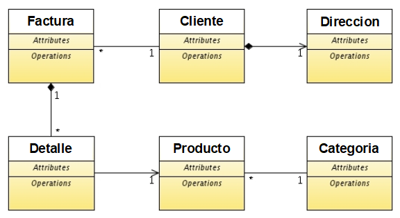\
Empezaremos con seis clases, y más adelante añadiremos algunas más. Recuerda que ya tienes una versión inicial de *Cliente* y *Producto*.
## Referencia (ManyToOne) como lista de descripciones (combo)
Empecemos con el caso más simple. Vamos a crear una entidad *Categoria* y asociarla a *Producto*, visualizándola con un combo.\
El código para la entidad *Categoria* es:

**package** com.tuempresa.facturacion.modelo;

**import** javax.persistence.\*;

**import** org.hibernate.annotations.GenericGenerator;

**import** org.openxava.annotations.\*;

**import** lombok.\*;

**@Entity** **@Getter** **@Setter**

**public** **class** **Categoria** {

`    `**@Id**

`    `**@Hidden** *// La propiedad no se muestra al usuario. Es un identificador interno*

`    `**@GeneratedValue**(generator="system-uuid") *// Identificador Universal Único (1)*

`    `**@GenericGenerator**(name="system-uuid", strategy = "uuid")

`    `**@Column**(length=32)

`    `String oid;

`    `**@Column**(length=50)

`    `String descripcion;

}

Sin duda, la entidad más simple posible. Solo tiene un identificador y una propiedad *descripcion*. En este caso usamos el algoritmo Identificador Universal Único (1) para generar el identificador. La ventaja de este generador de identificadores es que puedes migrar tu aplicación a otras bases de datos (DB2, MySQL, Oracle, Informix, etc) sin tocar tu código. Los otros generadores de identificadores de JPA usan la base de datos para generar el identificador, por lo que no son tan portables como UUID.\
Ahora puedes ejecutar el módulo *Categoria* y añadir algunas categorías:\
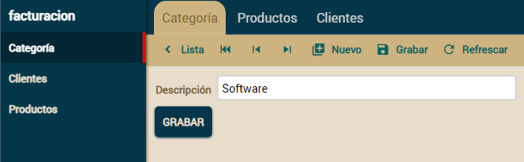\
Lo siguiente sería asociar *Producto* con *Categoria*: Añade la siguiente declaración para la referencia *categoria* en tu entidad *Producto*:

**public** **class** **Producto** {

...

`    `**@ManyToOne**( *// La referencia se almacena como una relación en la base de datos*

`        `fetch=FetchType.LAZY, *// La referencia se carga bajo demanda*

`        `optional=**true**) *// La referencia puede estar sin valor*

`    `**@DescriptionsList** *// Así la referencia se visualiza usando un combo*

`    `Categoria categoria; *// Una referencia Java convencional*

}

Es una simple relación muchos-a-uno de JPA, como se puede ver en el [apéndice B](C:\Users\Soporte\Documents\openxava\openxava-doc\web\docs\jpa_es.html). En este caso, gracias a la anotación *@DescriptionsList* se visualiza usando un combo:\
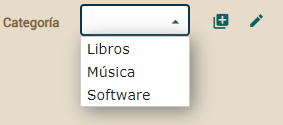\
Ahora es el momento de completar la entidad *Producto*.
## Anotaciones
La entidad *Producto* necesita tener al menos precio, además estaría bien que tuviese fotos y un campo para observaciones. Vamos a usar anotaciones para conseguirlo. Las anotaciones son como etiquetas para el código, es una forma de añadir metadatos a nuestro código, como en variables, métodos, clases, paquetes, entre otros.

La mejor forma de entender que es una anotación es verlo en acción. Añadamos las propiedades *precio*, *fotos* y *observaciones* a tu entidad *Producto*:

**@Money** *// La propiedad precio se usa para almacenar dinero*

BigDecimal precio; *// BigDecimal se suele usar para dinero*

**@Files** *// Una galería de fotos completa está disponible*

**@Column**(length=32) *// La cadena de 32 de longitud es para almacenar la clave de la galería*

String fotos;

**@TextArea** *// Esto es para un texto grande, se usará un área de texto o equivalente*

String observaciones;

Has visto como usar anotaciones, solo debes escribir la anotación y OpenXava hará un tratamiento especial. Si ejecutas el módulo para *Producto* ahora verás lo siguiente:\
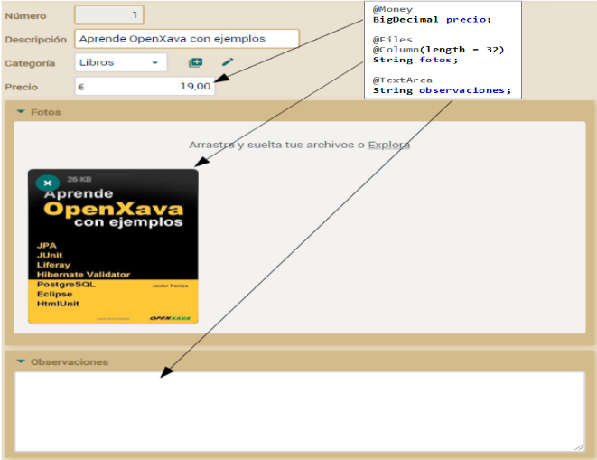\
En este caso usamos algunas de las anotaciones que están incluidas dentro de OpenXava, puedes notar que cada una produce un efecto en la interfaz de usuario.

Algunas de las anotaciones disponibles son *@Password, @Money, @TextArea, @Label, @DateTime, @Discussion, @Icon, @Telephone, @IP, @EmailList, @MAC , @StringTime, @HtmlText, @Coordinates, @Files*, *@File*, etc. Para más información puedes ver [aquí](C:\Users\Soporte\Documents\openxava\openxava-doc\web\docs\model_es.html#Modelo-Propiedades-Estereotipo), donde se habla más sobre anotaciones.[\
](C:\Users\Soporte\Documents\openxava\openxava-doc\web\docs\annotations_es.html)

Ya tienes *Producto* listo. Refinemos ahora *Cliente*.
## Embeddable
Vamos a añadir una dirección a nuestro, hasta ahora algo desnudo, *Cliente*. La dirección del *Cliente* no está compartida por otros objetos *Cliente*, es decir, cuando un cliente se borra, su dirección es borrada también, por lo tanto modelaremos el concepto de dirección como una clase incrustable. Esto se puede ver en el [apéndice B](C:\Users\Soporte\Documents\openxava\openxava-doc\web\docs\jpa_es.html#Ap%C3%A9ndice%20B:%20Java%20Persistence%20API-Anotaciones%20JPA-Clases%20incrustables) sobre JPA.\
Añade la clase *Direccion* a tu proyecto:

**package** com.tuempresa.facturacion.modelo;

**import** avax.persistence.\*;

import lombok.\*;

@Embeddable *// Usamos @Embeddable en vez de @Entity*

@Getter @Setter

public class Direccion {

`    `@Column(length = 30) *// Los miembros se anotan igual que en las entidades*

`    `String viaPublica;

`    `**@Column**(length = 5)

`    `**int** codigoPostal;

`    `**@Column**(length = 20)

`    `String municipio;

`    `**@Column**(length = 30)

`    `String provincia;

}

Como ves, es una clase normal y corriente anotada como *@Embeddable*. Sus propiedades se anotan de la misma manera que en las entidades, aunque las clases incrustables no soportan toda la funcionalidad de las entidades.\
Ahora, puedes usar *Direccion* en cualquier entidad. Simplemente añade una referencia a ella en tu entidad *Cliente*:

**public** **class** **Cliente** {

...

`    `**@Embedded** *// Así para referenciar a una clase incrustable*

`    `Direccion direccion; *// Una referencia Java convencional*

}

Los datos de *Direccion* se almacenan en la misma tabla que los de *Cliente*. Y desde una perspectiva de la interfaz de usuario hay un marco alrededor de *Direccion*, aunque si no te gusta el marco sólo has de anotar la referencia con *@NoFrame*, como se muestra aquí:

**@Embedded** **@NoFrame** *// Con @NoFrame no se muestra marco para direccion*

**private** Direccion direccion;

Aquí se muestra la interfaz de usuario para una referencia incrustada con y sin *@NoFrame*:\
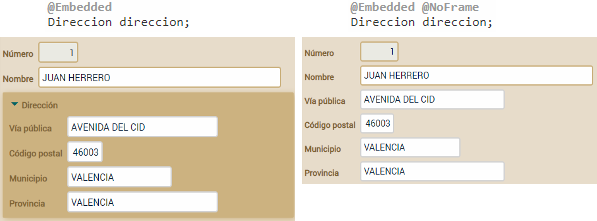

## **Lección 3: Modelo básico del dominio - Parte 2**
## Calcular valores por defecto
Vamos a escribir nuestra entidad *Factura* con año, número y fecha. Estaría bien tener valores por defecto para estas propiedades, para que el usuario no tuviera que teclearlos. Esto es fácil de conseguir usando la anotación *@DefaultValueCalculator*. En esta primera versión de *Factura* puedes ver como definimos valores por defecto para *anyo* y *fecha*:

**package** com.tuempresa.facturacion.modelo;

**import** java.time.\*;

**import** javax.persistence.\*;

**import** org.hibernate.annotations.GenericGenerator;

**import** org.openxava.annotations.\*;

**import** org.openxava.calculators.\*;

**import** lombok.\*;

**@Entity** **@Getter** **@Setter**

**public** **class** **Factura** {

`    `**@Id**

`    `**@GeneratedValue**(generator="system-uuid")

`    `**@Hidden**

`    `**@GenericGenerator**(name="system-uuid", strategy="uuid")

`    `**@Column**(length=32)

`    `String oid;

`    `**@Column**(length=4)

`    `**@DefaultValueCalculator**(CurrentYearCalculator.class) *// Año actual*

`    `**int** anyo;

`    `**@Column**(length=6)

`    `**int** numero;

`    `**@Required**

`    `**@DefaultValueCalculator**(CurrentLocalDateCalculator.class) *// Fecha actual*

`    `LocalDate fecha;

`    `**@TextArea**

`    `String observaciones;

}

Así cuando el usuario pulse en el botón *Nuevo* el campo para año será el año actual, y el campo para la fecha la fecha actual. Estos dos calculadores (*CurrentYearCalculator* y *CurrentLocalDateCalculator*) están incluidos en OpenXava. Explora el paquete [*org.openxava.calculators*](http://www.openxava.org/OpenXavaDoc/apidocs/org/openxava/calculators/package-summary.html) para ver otros calculadores predefinidos que pueden serte útiles.

Fíjate que para la fecha usamos el tipo *LocalDate* (del paquete *java.time*). Java tiene un tipo *Date* (en el paquete *java.util*). Sin embargo *Date* no es una fecha, sino un momento en el tiempo, incluyendo horas, segundo y milisegundos, mientras que *LocalDate* tiene simplemente día, mes y año, es decir una fecha. Para el caso de la factura, y para la mayoría en aplicaciones de gestión, usaremos *LocalDate* en lugar de *Date*.

A veces necesitas tu propia lógica para calcular el valor por defecto. Por ejemplo, para *numero* queremos sumar uno al último número de factura dentro de este mismo año. Crear tu propio calculador con tu lógica es fácil. Primero, crea un paquete *com.tuempresa.facturacion.calculadores* para los calculadores.

Para crear un paquete nuevo selecciona la carpeta *facturacion/src/main/java* y pulsa en el botón *New Java Package*:

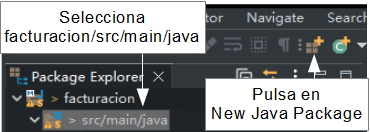

Se mostrará un diálogo donde introducir el nombre del paquete, *com.tuempresa.facturacion.calculadores*, y pulsa *Finish*:

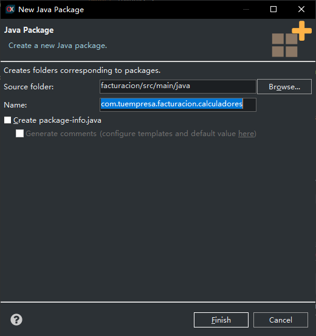

Las paquetes son la forma que tiene Java de organizar el código. Deberías cambiar *com.tuempresa* por el dominio de tu organización, es decir si trabajas para Telefónica el paquete para los calculadores debería ser *es.telefonica.facturacion.calculadores*.

Ahora crea en él una clase *CalculadorSiguienteNumeroParaAnyo*, con el siguiente código:

**package** com.tuempresa.facturacion.calculadores;

**import** javax.persistence.\*;

**import** org.openxava.calculators.\*;

**import** org.openxava.jpa.\*;

**import** lombok.\*;

**public** **class** **CalculadorSiguienteNumeroParaAnyo**

`    `**implements** **ICalculator** { *// Un calculador tiene que implementar ICalculator*

`    `**@Getter** **@Setter**     

`    `**int** anyo; *// Este valor se inyectará antes de calcular*

`    `**public** Object **calculate**() **throws** Exception { *// Hace el cálculo*

`        `Query query = XPersistence.getManager() *// Una consulta JPA*

.createQuery("select max(f.numero) from Factura f where f.anyo = :anyo"); *// La consulta devuelve*

`                                                              `*// el número de factura máximo del año indicado*

`        `query.setParameter("anyo", anyo); *// Ponemos el año inyectado como parámetro de la consulta*

`        `Integer ultimoNumero = (Integer) query.getSingleResult();

`        `**return** ultimoNumero == **null** ? 1 : ultimoNumero + 1; *// Devuelve el último número*

`                                            `*// de factura del año + 1 o 1 si no hay último número*

`    `}

}

Tu calculador tiene que implementar *ICalculator* (y por lo tanto tener un método *calculate()*). Declaramos una propiedad *anyo* para poner en ella el año del cálculo. Para implementar la lógica usamos una consulta JPA. Repásate el [apéndice B](C:\Users\Soporte\Documents\openxava\openxava-doc\web\docs\jpa_es.html) sobre JPA. Ahora sólo queda anotar la propiedad *numero* en la entidad *Factura*:

**@Column**(length=6)

**@DefaultValueCalculator**(value=CalculadorSiguienteNumeroParaAnyo.class,

`    `properties=**@PropertyValue**(name="anyo") *// Para inyectar el valor de anyo de Factura*

`                                           `*// en el calculador antes de llamar a calculate()*

)

**int** numero;

En este caso ves algo nuevo, *@PropertyValue*. Usándolo, estás diciendo que el valor de la propiedad *anyo* en la *Factura* actual se moverá a la propiedad *anyo* del calculador antes de hacer el cálculo. Ahora cuando el usuario pulse en *Nuevo* el siguiente número de factura disponible para este año estará en el campo. La forma de calcular el número de factura no es la mejor para muchos usuarios concurrentes añadiendo facturas. No te preocupes, lo mejoraremos más adelante.\
El efecto visual del calculador para valor por defecto es este:\
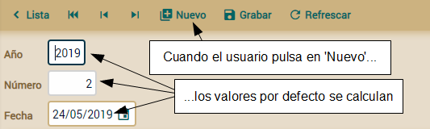\
Los valores por defecto son solo los valores iniciales, el usuario los puede cambiar si así lo desea.

Fíjate como *anyo* y *numero* no son clave, en su lugar usamos una propiedad *oid* como clave (anotada con *@Id*). Generalmente usar claves simples es mejor, sin embargo [usar claves compuesta también es posible](C:\Users\Soporte\Documents\openxava\openxava-doc\web\docs\jpa_es.html#Apendice+B:+Java+Persistence+API-Anotaciones+JPA-Clave+compuesta).
## Referencias convencionales (ManyToOne)
Ahora que tenemos todas las propiedades atómicas listas para usar, es tiempo de añadir relaciones con otras entidades. Empezaremos añadiendo una referencia desde *Factura* a *Cliente*, porque una factura sin cliente no parece demasiado útil. Antes de añadir el cliente **usa el módulo *Factura* para borrar todas las facturas existentes**, porque vamos a hacer el cliente obligatorio y esto podría fallar con los datos existentes.\
Añade el siguiente código a la entidad *Factura*:

**@ManyToOne**(fetch=FetchType.LAZY, optional=**false**) *// El cliente es obligatorio*

Cliente cliente;

No hace falta más. El módulo *Factura* es así:\
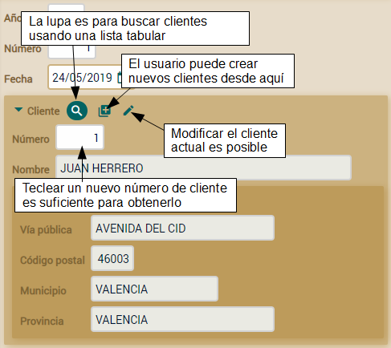\
No hay más trabajo que hacer aquí. Añadamos una colección de líneas de detalle a *Factura*.
## Colección de objectos dependientes
Usualmente una factura necesita tener varias líneas con productos, cantidades, etc. Estos detalles son parte de la factura, no son compartidos por otras facturas y cuando una factura se borra sus líneas de detalle son borradas con ella. Por tanto, la forma más natural de modelar los detalles de una factura es usando objetos incrustados. Para hacerlo con JPA declara una colección convencional en *Factura* y anótala con *@ElementCollection*:

**@ElementCollection**

Collection<Detalle> detalles;

Usando *@ElementCollection* cuando la factura se borra sus líneas se borran también. Los detalles no se guardan en la base de datos hasta que la factura se guarde y se guardan todos al mismo tiempo.\
Para que esta colección funcione necesitas escribir la clase *Detalle*:

**package** com.tuempresa.facturacion.modelo;

**import** javax.persistence.\*;

**import** lombok.\*;

**@Embeddable** **@Getter** **@Setter**

**public** **class** **Detalle** {

`    `**int** cantidad;

`    `**@ManyToOne**(fetch = FetchType.LAZY, optional = **true**)

`    `Producto producto;

}

Fíjate que está anotada con *@Embeddable* no con *@Entity*, no puedes definir una *@ElementCollection* de entidades. Esta clase incrustable puede contener propiedades y referencias, pero no colecciones.\
De momento solo tenemos *cantidad* y *producto*, pero es suficiente para tener la *Factura* funcionando con *detalles*. El usuario puede añadir, editar y borrar elementos de la colección como en una hoja de cálculo:\
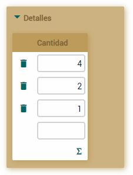\
Este pantallazo enfatiza el hecho de que las propiedades a mostrar por defecto son las propiedades planas, es decir, las propiedades de las referencias no se incluyen por defecto. Esto produce una interfaz de usuario fea para nuestra colección de líneas de factura en nuestro caso, porque solo se muestra la propiedad *cantidad*. Puedes arreglarlo usando *@ListProperties*, así:

**@ElementCollection**

**@ListProperties**("producto.numero, producto.descripcion, cantidad")

Collection<Detalle> detalles;

Como puedes ver, solo has de poner como valor para *@ListProperties* la lista de la propiedades que quieres separadas por comas. Puedes usar propiedades calificadas, es decir, usar la notación del punto para acceder a las propiedades de referencias, tal como *producto.numero* y *producto.descripcion* en este caso. El resultado visual es:\
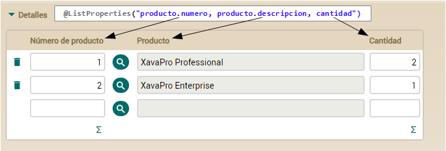

\
Ahora deseamos cambiar la etiqueta de la propiedad *producto.numero* por otro que sea más corto: *N° de Producto*. Para lograr esto, debemos ir al archivo *invoicing-labels\_es.properties* que se encuentra en la carpeta *invoicing/src/main/resources/i18n* y añadir la siguiente linea para sobrescribir la etiqueta por defecto que nos trae OpenXava:

producto.numero = N° de Producto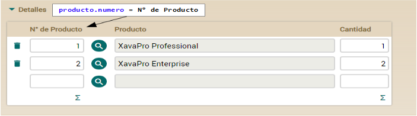

\

Esta nueva etiqueta de *producto.numero* se cambiará en todos los módulos que se use, en caso que quisieramos aplicarlo solamente en colección detalles de la entidad Factura, deberíamos usar la siguiente etiqueta:

*//Para esta aplicación usaremos la etiqueta anterior y no la siguiente*\
*Factura.detalles.producto.numero = N° de Producto*

De esta manera, podemos personalizar las etiquetas que trae OpenXava o crear nuestras propias etiquetas.

- [**Lección 4: Refinar la interfaz de usuario**](C:\Users\Soporte\Documents\openxava\openxava-doc\web\docs\refining-user-interface_es.html)
  ## Interfaz de usuario por defecto
  Así es la interfaz de usuario por defecto para *Factura*:\
  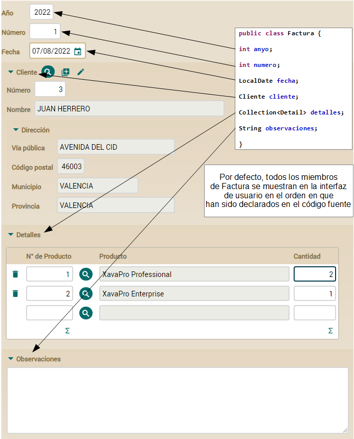\
  Como ves, OpenXava muestra todos los miembros, uno debajo de otro, en el orden en que los has declarado en el código fuente. También ves como en el caso de la referencia *cliente* se usa la vista por defecto de *Cliente*.\
  Vamos a hacer algunas pequeñas mejoras. Primero, definiremos la disposición de los miembros explícitamente, de esta forma podemos poner *anyo*, *numero* y *fecha* en la misma línea. Segundo, vamos a usar una vista más simple para *Cliente*. El usuario no necesita ver todos los datos del cliente cuando está introduciendo la factura.
  ## Usar @View para definir la disposición
  Para definir la disposición de los miembros de *Factura* en la interfaz de usuario has de usar la anotación *@View*. Es fácil, sólo has de enumerar los miembros a mostrar. Mira el código:

**@View**(members= *// Esta vista no tiene nombre, por tanto será la vista usada por defecto*

` `"anyo, numero, fecha;" + *// Separados por coma significa en la misma línea*

` `"cliente;" + *// Punto y coma significa nueva línea*

` `"detalles;" +

` `"observaciones"

)

**public** **class** **Factura** {

Mostramos todos los miembros de *Factura*, pero usamos comas para separar *anyo*, *numero* y *fecha*, así son mostrados en la misma línea, produciendo una interfaz de usuario más compacta, como esta:\

## Usar @ReferenceView para refinar la interfaz de referencias
Todavía necesitas refinar la forma en que la referencia *cliente* se visualiza, porque visualiza todos los miembros de *Cliente*, y para introducir los datos de una *Factura* una vista más simple del cliente puede ser mejor. Para hacer esto, has de definir una vista *Simple* en *Cliente*, y entonces indicar en *Factura* que quieres usar esa vista *Simple* de *Cliente* para visualizarlo.\
Primero definamos la vista *Simple* en *Cliente*:

**@View**(name="Simple", *// Esta vista solo se usará cuando se especifique “Simple”*

`    `members="numero, nombre" *// Muestra únicamente numero y nombre en la misma línea*

)

**public** **class** **Cliente** {

Cuando una vista tiene un nombre, como en este caso, esa vista solo se usa cuando ese nombre se especifica. Es decir, aunque *Cliente* solo tiene esta anotación *@View*, cuando tratas de visualizar un *Cliente* no usará esta vista *Simple*, sino la generada por defecto. Si defines una *@View* sin nombre, esa vista será la vista por defecto, aunque este no es el caso.\
Ahora has de indicar que la referencia a *Cliente* desde *Factura* use esta vista *Simple*. Esto se hace mediante *@ReferenceView*. Edita la referencia *cliente* en la clase *Factura* de esta forma:

**@ManyToOne**(fetch=FetchType.LAZY, optional=**false**)

**@ReferenceView**("Simple") *// La vista llamada 'Simple' se usará para visualizar esta referencia*

Cliente cliente;

Realmente sencillo, solo has de indicar el nombre de la vista de la entidad referenciada que quieres usar.\
Después de esto la referencia *cliente* se mostrará de una forma más compacta:\
\
Hemos refinado un poco la interfaz de *Factura*.\
La interfaz de usuario refinada

Este es el resultado de nuestros refinamientos en la interfaz de usuario de *Factura*:\
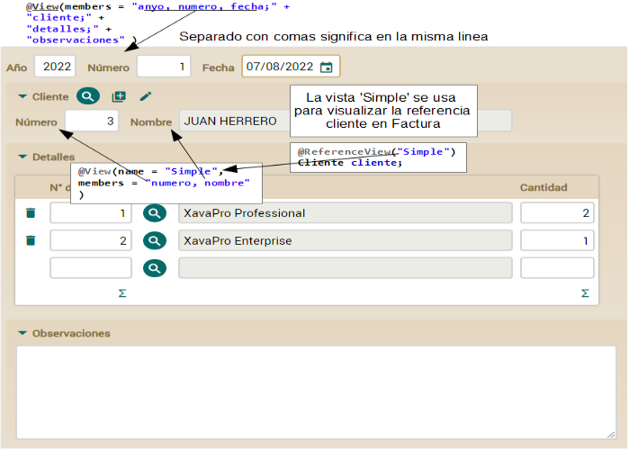\
Has visto lo fácil que es usar *@View* y *@ReferenceView* para obtener una interfaz de usuario más compacta para *Factura*.\
Ahora tienes una interfaz de usuario suficientemente buena para empezar a trabajar, y realmente hemos hecho poco trabajo para conseguirlo.

- [**Lección 5: Desarrollo ágil**](C:\Users\Soporte\Documents\openxava\openxava-doc\web\docs\agile-development_es.html)

- Si no estás familiarizado con el desarrollo ágil puedes echar un vistazo a [agilemanifesto.org](https://agilemanifesto.org/iso/es/manifesto.html). Básicamente, el desarrollo ágil favorece el uso de retroalimentación obtenida de un producto funcional sobre un diseño previo meticuloso. Esto da más protagonismo a los programadores y usuarios, y minimiza la importancia de los analistas y los arquitectos de software.\
  Este tipo de desarrollo necesita también un nuevo tipo de herramientas. Porque necesitas una aplicación funcional rápidamente. Tiene que ser tan rápido desarrollar la aplicación inicial como lo sería escribir la descripción funcional. Además, necesitas responder a las peticiones y opiniones del usuario rápidamente. El usuario necesita ver sus propuestas funcionando en corto tiempo.\
  OpenXava es ideal para el desarrollo ágil no sólo porque permite un desarrollo inicial muy rápido, sino porque también te permite hacer cambios y ver su efecto instantáneamente. Veamos un pequeño ejemplo de esto.
- ## Añadir otra referencia
- Por ejemplo, una vez que el usuario ve tu aplicación y empieza a jugar con ella, se da cuenta que él trabaja con libros, música, programas y así por el estilo. Todos estos productos tienen autor, y sería útil almacenar el autor, así como ver los productos por autor.\
  Añadir esta nueva funcionalidad a tu aplicación es simple y rápido. Lo primero es crear una nueva clase para *Autor* con el siguiente código:
- **package** com.tuempresa.facturacion.modelo;
 
- **import** javax.persistence.\*;
- **import** org.hibernate.annotations.GenericGenerator;
- **import** org.openxava.annotations.\*;
- **import** lombok.\*;
 
- **@Entity** **@Getter** **@Setter**
- **public** **class** **Autor** {
 
- `    `**@Id** **@GeneratedValue**(generator="system-uuid") **@Hidden**
- `    `**@GenericGenerator**(name="system-uuid", strategy = "uuid")
- `    `**@Column**(length=32)
- `    `String oid;
 
- `    `**@Column**(length=50) **@Required**
- `    `String nombre;
  
- }
- Ahora, añade este código a la ya existente entidad *Producto*:
- **@ManyToOne**(fetch=FetchType.LAZY)
- **@DescriptionsList**
- Autor autor;
- Así, tu entidad *Producto* tiene una referencia a *Autor*.\
  Realmente has escrito una cantidad pequeña de código. Para ver el efecto, solo necesitas reiniciar tu aplicación pulsando el botón *Run*:
- ![getting-started_es195.png][getting-started_es150.png]
- Después ve al navegador y recarga la página con el módulo *Producto*, y ahí verás, un combo para escoger el autor del producto, como se muestra aquí:\
  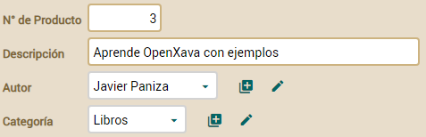
- ## Añadir una colección de entidades
- ¿Qué ocurre si el usuario quiere escoger un autor y ver todos sus productos? Está chupado. Solo has de hacer la relación entre *Producto* y *Autor* bidireccional. Ve a la clase *Autor* y añade el siguiente código:
- **@OneToMany**(mappedBy="autor")
- **@ListProperties**("numero, descripcion, precio")
- Collection<Producto> productos;
- Ahora reinicia tu aplicación y refresca tu navegador con el módulo *Autor*. Escoge un autor y verás sus productos. Tienes algo parecido a esto:\
  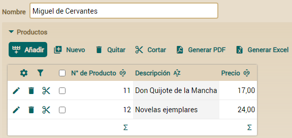
- Sí, añades una nueva colección, rearrancas tu aplicación, refrescas tu navegador y tienes una interfaz de usuario completa para manejarla. En este caso el usuario puede pulsar en el botón *Añadir* para escoger un libro de una lista de libros existentes o pulsar *Nuevo* para introducir los datos para crear un nuevo libro que se añadirá a la colección. Además, el autor no se puede borrar mientras tenga libros asociados a él. Puedes definir un comportamiento diferente con *cascade* como REMOVE o ALL, así:
- **@OneToMany**(mappedBy="autor", cascade=CascadeType.REMOVE) *// NO LO AÑADAS A TU CÓDIGO*
- De esta forma sólo el botón *Nuevo* para crear nuevos libros está disponible, el botón *Añadir* no está presente. Además, cuando el autor se borre sus libros se borrarán también. Para el caso autor/libros no queremos este comportamiento, pero puede ser útil en muchos casos donde una *@ElementCollection* sea insuficiente.
- [**Lección 6: Herencia de superclases mapedas**](C:\Users\Soporte\Documents\openxava\openxava-doc\web\docs\mapped-superclass-inheritance_es.html)
## Superclase mapeada
Las clases *Autor*, *Categoria* y *Factura* tienen algo de código en común. Este código es la definición del campo *oid*:

**@Id** **@GeneratedValue**(generator="system-uuid") **@Hidden**

**@GenericGenerator**(name="system-uuid", strategy = "uuid")

**@Column**(length=32)

String oid;

Este código es exactamente el mismo para todas estas clases. Ya sabes que copiar y pegar es un pecado mortal, por eso tenemos que buscar una forma de quitar este código repetido y así evitar ir al infierno.\
Una solución elegante en este caso es usar herencia. JPA permite varias formas de herencia. Una de ellas es heredar de una superclase mapeada. Una superclase mapeada es una clase Java con anotaciones de mapeo JPA, pero no es una entidad en sí. Su único objetivo es ser usada como clase base para definir entidades. Usemos una y verás su utilidad rápidamente.\
Primero, movemos el código común a una clase marcada como *@MappedSuperclass*. La llamamos *Identificable*:

**package** com.tuempresa.facturacion.modelo;

**import** javax.persistence.\*;

**import** org.hibernate.annotations.GenericGenerator;

**import** org.openxava.annotations.\*;

**import** lombok.\*;

**@MappedSuperclass** *// Marcada como una superclase mapeada en vez de como una entidad*

**@Getter** **@Setter**

**public** **class** **Identificable** {

`    `**@Id** **@GeneratedValue**(generator="system-uuid") **@Hidden**

`    `**@GenericGenerator**(name="system-uuid", strategy = "uuid")

`    `**@Column**(length=32)

`    `String oid; *// La definición de propiedad incluye anotaciones de OpenXava y JPA*

}
## Simplificar tus entidades
Ahora puedes definir las entidades *Autor, Categoria* y *Factura* de una manera más sucinta. Para ver un ejemplo aquí tienes el nuevo código para *Categoria*:

**package** com.tuempresa.facturacion.modelo;

**import** javax.persistence.\*;

**import** lombok.\*;

**@Entity** **@Getter** **@Setter**

**public** **class** **Categoria** **extends** **Identificable** { *// Extiende de Identificable*

`                        `*// por tanto no necesita tener una propiedad id*

`    `**@Column**(length=50)

`    `String descripcion;

}

La refactorización es extremadamente simple. *Categoria* ahora desciende de *Identificable* y hemos quitado la propiedad *oid*. De esta forma, no sólo tu código es más corto, sino también más elegante, porque estás declarando tu clase como identificable (el qué, no el cómo), y has quitado de tu clase de negocio un código que era un tanto técnico.\
Aplica esta misma refactorización a las entidades *Autor* y *Factura*. Además, a partir de ahora extenderás la mayoría de tus entidades de la superclase mapeada *Identificable*.

Hemos creado nuestra propia clase *Identificable* para ver las ventajas de usar superclases mapeadas, sin embargo OpenXava te provee una clase *Identifiable* lista para usar que puedes encontrar en el paquete *org.openxava.model*. Por tanto, en tu próximo proyecto no has de escribir la clase *Identificable* otra vez, simplemente usa la incluida en OpenXava.

- [**Lección 7: Herencia de entidades**](C:\Users\Soporte\Documents\openxava\openxava-doc\web\docs\entity-inheritance_es.html)
  ## Nueva entidad Pedido
  Queremos añadir un nuevo concepto a la aplicación *facturacion*: pedido. Mientras que una factura es algo que quieres cobrar a tu cliente, un pedido es algo que tu cliente te ha solicitado. Estos dos conceptos están fuertemente unidos, porque cobrarás por las cosas que tu cliente te ha pedido y tú le has servido.\
  Sería interesante poder tratar pedidos en tu aplicación y asociar estos pedidos con sus correspondientes facturas. Tal como muestra el siguiente diagrama UML:\
  ![inheritance_es010.png]\
  Y con código Java:

**@Entity**

**public** **class** **Factura** {

`    `**@OneToMany**(mappedBy="factura")

`    `Collection<Pedido> pedidos;

...

}

**@Entity**

**public** **class** **Pedido** {

`    `**@ManyToOne** *// Sin carga vaga (1)*

`    `Factura factura;

...

}

Es decir, una factura tiene varios pedidos y un pedido puede referenciar a una factura. Fíjate como no usamos inicialización vaga (lazy fetching) para la referencia *factura* (1), esto es por un bug de Hibernate cuando la referencia contiene la relación bidireccional (es decir, es la referencia declarada en el atributo *mappedBy* del *@OneToMany*).\
¿Cómo es *Pedido*? Bien, tiene un cliente, unas líneas de detalle con producto y cantidad, un año y un número. Algo así como esto:\
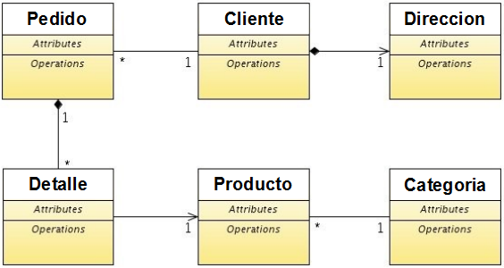\
Curiosamente, este diagrama UML es idéntico al diagrama de *Factura*. Es decir, para crear tu entidad *Pedido* puedes copiar y pegar la clase *Factura*, y asunto zanjado. Pero, ¡espera un momento! ¿“Copiar y pegar” no era un pecado mortal? Hemos de encontrar una forma de reutilizar *Factura* para *Pedido*.
## DocumentoComercial como entidad abstracta
Una manera práctica de reutilizar el código de *Factura* para *Pedido* es usando herencia, además es una excusa perfecta para aprender lo fácil que es usar la herencia con JPA y OpenXava.\
En la mayoría de las culturas orientadas a objetos has de observar el precepto sagrado *es un*. Esto significa que no podemos hacer que *Factura* herede de *Pedido*, porque una *Factura* no es un *Pedido*, y por la misma regla no podemos hacer que *Pedido* descienda de *Factura*. La solución para este caso es crear una clase base para ambos, *Pedido* y *Factura*. Llamaremos a esta clase *DocumentoComercial*.\
Aquí tienes el diagrama UML para *DocumentoComercial*:\
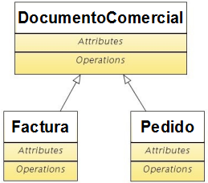\
Y aquí tienes la misma idea expresada con Java:

**public** **class** **DocumentoComercial** { ... }

**public** **class** **Pedido** **extends** **DocumentoComercial** { ... }

**public** **class** **Factura** **extends** **DocumentoComercial** { ... }

Empecemos a refactorizar el código actual. Primero, renombra (usando *Refactor > Rename*) *Factura* como *DocumentoComercial*. Después, edita el código de *DocumentoComercial* para declararla como una clase abstracta, así:

**abstract** **public** **class** **DocumentoComercial** // **A**ñ**adimos** **el** **modificador** **abstract**

Queremos crear instancias de *Factura* y *Pedido*, pero no queremos crear instancias de *DocumentoComercial* directamente, por eso la declaramos abstracta.
## Factura refactorizada para usar herencia
Ahora, has de crear la entidad *Factura* extendiéndola de *DocumentoComercial*. Puedes ver el nuevo código de *Factura*:

**package** com.tuempresa.facturacion.modelo;

**import** javax.persistence.\*;

**import** lombok.\*;

**@Entity** **@Getter** **@Setter**

**public** **class** **Factura** **extends** **DocumentoComercial** {

}

*Factura* tiene ahora un código bastante breve, de hecho el cuerpo de la clase está, por ahora, vacío.

Este nuevo código necesita un esquema de base de datos ligeramente diferente, ahora las facturas y los pedidos se almacenarán en la misma tabla (la tabla DocumentoComercial) usando una columna discriminador. Por tanto has de borrar las viejas tablas ejecutando las siguientes sentencias SQL:

**DROP** **TABLE** FACTURA\_DETALLES;

**DROP** **TABLE** FACTURA;

Para ejecutar estas sentencias SQL, primero asegurate de que tu aplicación se esté ejecutando, después usa la opción de menú *OpenXava > Database Manager* de OpenXava Studio:\
\
Después:\
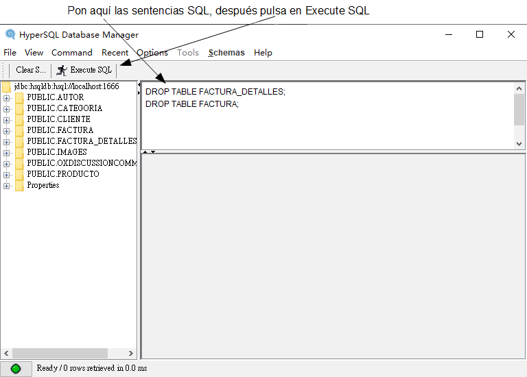\
Ya puedes ejecutar el módulo *Factura* y verlo funcionando en tu navegador. Lanza también *PruebaFactura*. Tiene que salirte verde.

Si usas tu propia versión de Eclipse o IntelliJ puedes ejecutar Database Manager ejecutando la tarea Ant *runDBManager* de *OpenXava/build.xml*.
## Crear Pedido usando herencia
Gracias a *DocumentoComercial* el código para *Pedido* es más sencillo que el mecanismo de un sonajero:

**package** com.tuempresa.facturacion.modelo;

**import** javax.persistence.\*;

**import** lombok.\*;

**@Entity** **@Getter** **@Setter**

**public** **class** **Pedido** **extends** **DocumentoComercial** {

}

Después de escribir la clase *Pedido*, aunque de momento esté vacía, ya puedes usar el módulo *Pedido* desde tu navegador. Sí, a partir de ahora crear una nueva entidad con una estructura parecida a *Factura*, es decir cualquier entidad para un documento comercial, es simple y rápido. Un buen uso de la herencia es una forma elegante de tener un código más simple.\
El módulo *Pedido* funciona perfectamente, pero tiene un pequeño problema. El nuevo número de pedido lo calcula a partir del último número de factura, no de pedido. Esto es así porque el calculador para el siguiente número lee de la entidad *Factura*. Un solución obvia es mover la definición de la propiedad *numero* de *DocumentoComercial* a *Factura* y *Pedido*. Aunque, no lo vamos a hacer así, porque en la siguiente lección refinaremos la forma de calcular el número de documento, de momento simplemente haremos un pequeño ajuste en el código actual para que no falle. Edita la clase *CalculadorSiguienteNumeroParaAnyo* y en la consulta cambia “Factura” por “DocumentoComercial”, dejando el método *calculate()*, así:

**public** Object **calculate**() **throws** Exception {

`    `Query query = XPersistence.getManager().createQuery(

`        `"select max(f.numero) from " +

`        `"DocumentoComercial f " + *// DocumentoComercial en vez de Factura*

`        `"where f.anyo = :anyo");

`    `query.setParameter("anyo", anyo);

`    `Integer ultimoNumero = (Integer) query.getSingleResult();

`    `**return** ultimoNumero == **null**?1:ultimoNumero + 1;

}

Ahora buscamos el número máximo de cualquier tipo de documento comercial del año para calcular el nuevo número, por lo tanto la numeración es compartida para todos los tipos de documentos. Esto lo mejoraremos en la siguiente lección para separar la numeración para facturas y pedidos; y para tener un mejor soporte de entornos multiusuario.
## Convención de nombres y herencia
Fíjate que no has necesitado cambiar el nombre de ninguna propiedad de *Factura* para hacer la refactorización. Esto es por el siguiente principio práctico: *No uses el nombre de clase en los nombres de miembro*, por ejemplo, dentro de una clase *Cuenta* no uses la palabra “Cuenta” en ningún método o propiedad:

**public** **class** **Cuenta** { *// No usaremos Cuenta en los nombres de los miembros*

`    `**private** **int** numeroCuenta; *// Mal, porque usa “cuenta”*

`    `**private** **int** numero; *// Bien, no usa “cuenta”*

`    `**public** **void** **cancelarCuenta**() { } *// Mal, porque usa “Cuenta”*

`    `**public** **void** **cancelar**() { } *// Bien, no usa “cuenta”*

...

}

Usando esta nomenclatura puedes refactorizar la clase *Cuenta* en una jerarquía sin renombrar sus miembros y además puedes escribir código polimórfico con *Cuenta*.
## Asociar Pedido con Factura
Hasta ahora, *Pedido* y *Factura* son exactamente iguales. Vamos a hacerles sus primeras extensiones, que va a ser asociar *Pedido* con *Factura*, como se muestra en el diagrama:\
![inheritance_es010.png]\
Solo necesitas añadir una referencia desde *Pedido* a *Factura*:

**package** com.tuempresa.facturacion.modelo;

**import** javax.persistence.\*;

**import** lombok.\*;

**@Entity** **@Getter** **@Setter**

**public** **class** **Pedido** **extends** **DocumentoComercial** {

`    `**@ManyToOne**

`    `Factura factura; *// Referencia a factura añadida*

}

Por otra parte en *Factura* añadimos una colección de entidades *Pedido*:

**package** com.tuempresa.facturacion.modelo;

**import** java.util.\*; 

**import** javax.persistence.\*;

**import** lombok.\*;

**@Entity** **@Getter** **@Setter**

**public** **class** **Factura** **extends** **DocumentoComercial** {

`    `**@OneToMany**(mappedBy="factura")

`    `Collection<Pedido> pedidos; *// Colección de entidades Pedido añadida*

}

Después de escribir este código tan simple, ya puedes probar estas, recién creadas, relaciones. Reinicia tu aplicación y abre tu navegador y explora los módulos *Pedido* y *Factura*. Fíjate como al final de la interfaz de usuario de *Pedido* tienes una referencia a *Factura*. El usuario puede usar esta referencia para asociar una factura al pedido actual. Por otra parte, si exploras el módulo *Factura*, verás una colección de pedidos al final. El usuario puede usarla para añadir pedidos a la factura actual.\
Intenta añadir pedidos a la factura y asociar una factura a un pedido. Funciona, aunque la interfaz de usuario es un poco fea. No te preocupes, mejoraremos esto en la siguiente lección.

- [**Lección 8. Herencia de vistas**](C:\Users\Soporte\Documents\openxava\openxava-doc\web\docs\view-inheritance_es.html)
  ## El atributo extendsView
  Tanto *Pedido* como *Factura* usan una interfaz de usuario generada por defecto con todos sus miembros uno por cada línea. Nota como la *@View* que hemos declarado en *DocumentoComercial* no se ha heredado. Es decir, si no defines una vista para la entidad se genera una por defecto, la *@View* de la entidad padre no se usa. Como se muestra aquí:

**@View**(members = "a, b, c;") *// Esta vista se usa para visualizar Padre, pero no para Hijo*

**public** **class** **Padre** { ... }

**public** **class** **Hijo** **extends** **Padre** { ... } *// Hijo se visualiza usando la vista*

`                                        `*// generada automáticamente, no la vista de Padre*

Generalmente la vista de la entidad padre “tal cual” no es demasiado útil porque no contiene todas las propiedades de la entidad actual. Por tanto este comportamiento suele venir bien como comportamiento por defecto.\
Aunque, en una entidad no trivial necesitas refinar la interfaz de usuario y quizás sea útil heredar (en lugar de copiar y pegar) la vista del padre. Puedes hacer esto usando el atributo *extendsView* en *@View*:

**@View**(members = "a, b, c;") *// Esta vista sin nombre es la vista DEFAULT*

**public** **class** **Padre** { ... }

**@View**(name="A" members = "d", *// Añade d a la vista heredada*

`    `extendsView = "super.DEFAULT") *// Extienda la vista por defecto de Padre*

**@View**(name="B" members = "a, b, c; d") *// La vista B es igual a la vista A*

**public** **class** **Hijo** **extends** **Padre** { ... } *// Hijo se visualiza usando la vista*

`                                        `*// generada automáticamente, no la vista de Padre*

Usando *extendsView* los miembros a mostrar serán aquellos en la vista que extendemos más aquellos en *members* de la actual.\
Vamos a usar esta característica para definir las vistas para *DocumentoComercial*, *Pedido* y *Factura*.
## Vista para Factura usando herencia
Dado que la *@View* de *DocumentoComercial* no se hereda, la interfaz de usuario actual para *Factura* es bastante fea: todos los miembros, uno por línea. Vamos a definir una interfaz de usuario mejor. Una vista parecida a la que ya teníamos, pero añadiendo una pestaña para pedidos, así:\
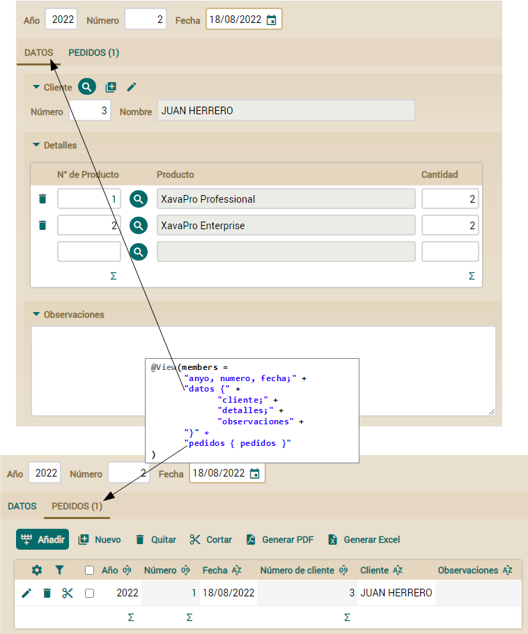\
Nota que ponemos todos los miembros de la parte de *DocumentoComercial* de *Factura* en la cabecera y la primera pestaña (datos), y la colección de pedidos en la otra pestaña. El siguiente código muestra la forma de definir esto sin herencia.

**@View**( members=

`    `"anyo, numero, fecha;" +

`    `"datos {" +

`        `"cliente;" +

`        `"detalles;" +

`        `"observaciones" +

`    `"}" +

`    `"pedidos { pedidos } "

)

Puedes notar como todos los miembros, excepto la parte de *pedidos*, son comunes para todos los *DocumentoComercial*. Por lo tanto, vamos a mover esta parte común a *DocumentoComercial* y redefinir la vista usando herencia.\
Quita el viejo *@View* de *DocumentoComercial* y escribe esto:

**@View**(members=

`    `"anyo, numero, fecha," + *// Los miembros para la cabecera en una línea*

`    `"datos {" + *// Una pestaña 'datos' para los datos principales del documento*

`        `"cliente;" +

`        `"detalles;" +

`        `"observaciones" +

`    `"}"

)

**abstract** **public** **class** **DocumentoComercial** **extends** **Identifiable** {

Esta vista indica como distribuir los datos comunes para todos los documentos comerciales. Ahora podemos redefinir la vista de *Factura* a partir de esta:

**@View**(extendsView="super.DEFAULT", *// Extiende de la vista de DocumentoComercial*

`    `members="pedidos { pedidos }" *// Añadimos pedidos dentro de una pestaña*

)

**public** **class** **Factura** **extends** **DocumentoComercial** {

De esta forma declarar la vista para *Factura* es más corto, es más, la distribución común para *Pedido*, *Factura* y todos los demás posibles *DocumentoComercial* está en un único sitio, por tanto, si añades una nueva propiedad a *DocumentoComercial* solo has de tocar la vista de *DocumentoComercial*.
## Vista para Pedido usando herencia
Ahora que tienes una vista adecuada para *DocumentoComercial*, declarar una vista para *Pedido* es lo más fácil del mundo. La vista que queremos contiene toda la información del pedido, y su factura asociada en otra pestaña:\
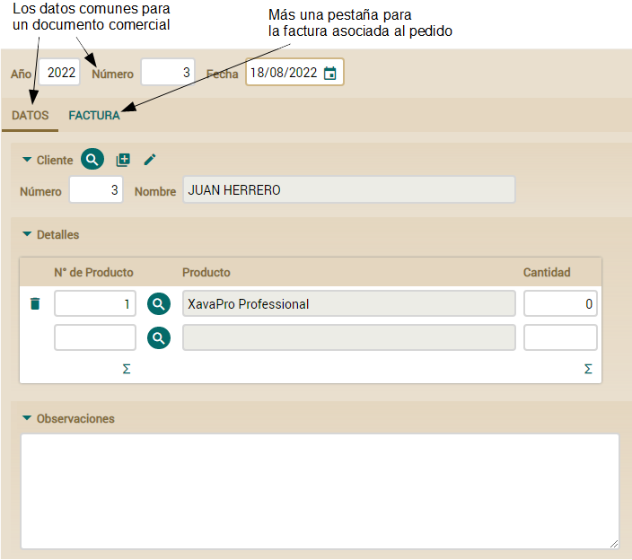\
Para obtener este resultado, puedes definir la vista de *Pedido* extendiendo la vista por defecto de *DocumentoComercial* y añadiendo la referencia a factura, así:

**@View**(extendsView="super.DEFAULT", *// Extiende de la vista de DocumentoComercial*

`    `members="factura { factura } " *// Añadimos factura dentro de una pestaña*

)

**public** **class** **Pedido** **extends** **DocumentoComercial** {

Con esto conseguimos toda la información de *DocumentoComercial* más una pestaña con la factura.
## Usar @ReferenceView y @CollectionView para refinar vistas
Queremos que cuando un pedido sea visualizado desde la interfaz de usuario de *Factura* la vista a usar sea simple, sin cliente ni factura, porque estos datos son redundantes en este caso:\
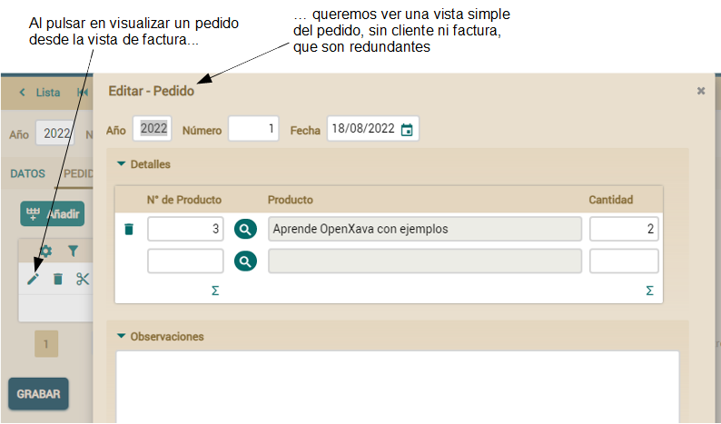\
Para obtener este resultado define una vista más simple en *Pedido*:

**@View**( extendsView="super.DEFAULT", *// La vista por defecto*

`    `members="factura { factura } "

)

**@View**( name="SinClienteNiFactura", *// Una vista llamada SinClienteNiFactura*

`    `members=                       *// que no incluye cliente ni factura*

`        `"anyo, numero, fecha;" +   *// Ideal para ser usada desde Factura*

`        `"detalles;" +

`        `"observaciones"

)

**public** **class** **Pedido** **extends** **DocumentoComercial** {

Esta nueva vista definida en *Pedido* llamada *SinClienteNiFactura* puede ser referenciada desde *Factura* para visualizar elementos individuales de la colección *pedidos* usando *@CollectionView*:

**public** **class** **Factura** **extends** **DocumentoComercial** {

...      

`    `**@OneToMany**(mappedBy="factura")

`    `**@CollectionView**("SinClienteNiFactura") *// Esta vista se usa para visualizar pedidos*

`    `**private** Collection<Pedido> pedidos;

Y tan solo con este código la colección *pedidos* usará una vista más apropiada de *Factura* para visualizar elementos individuales.\
Además, queremos que desde la interfaz de usuario de *Pedido* la factura no muestre el cliente y los pedidos, porque son datos redundantes en este caso. Para conseguirlo, vamos a definir una vista más simple en *Factura*:

**@View**( extendsView="super.DEFAULT", *// La vista por defecto*

`    `members="pedidos { pedidos } "

)

**@View**( name="SinClienteNiPedidos", *// Una vista llamada SinClienteNiPedidos*

`    `members=                       *// que no incluye cliente ni pedidos*

`        `"anyo, numero, fecha;" +   *// Ideal para usarse desde Pedido*

`        `"detalles;" +

`        `"observaciones"

)

**public** **class** **Factura** **extends** **DocumentoComercial** {

Esta nueva vista definida en *Factura* llamada *SinClienteNiPedidos* puede ser referenciada desde *Pedido* para visualizar la referencia a *Factura* usando *@ReferenceView*:

**public** **class** **Pedido** **extends** **DocumentoComercial** {

`    `**@ManyToOne**

`    `**@ReferenceView**("SinClienteNiPedidos") *// Esta vista se usa para visualizar factura*

`    `**private** Factura factura;

...

Ahora la referencia *factura* será visualizada desde *Pedido* sin incluir el cliente y los pedidos, por lo que tendrás la interfaz de usuario más simple: 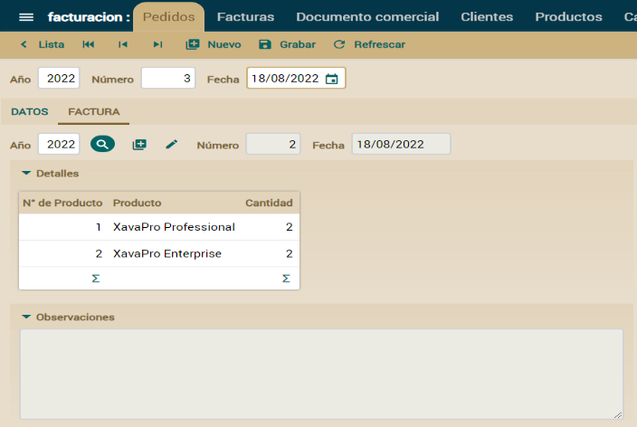

Esta lección ha mostrado cómo usar la herencia para simplificar la definición de la interfaz de usuario, por medio del atributo *extendsView* de *@View*. Por el camino hemos visto también algunos ejemplo de simplificar la forma en que se visualizan las referencias y colecciones usando *@ReferenceView* y *@CollectionView*.

**Lección 9: Propiedades Java**
## Conceptos
Para entender bien algunos de los conceptos de las lecciones venideras, has de saber cómo funcionan las propiedades en Java. La forma estándar de definir una propiedad en Java es:

*// Propiedad*

**private** **int** cantidad; *// Tiene un campo*

**public** **int** **getCantidad**() { *// Un getter para devolver el valor del campo*

`    `**return** cantidad;

}

**public** **void** **setCantidad**(**int** cantidad) { *// Cambia el valor del campo*

`    `**this**.cantidad = cantidad;

}

Esto se basa en la idea de que nunca deberiamos acceder al estado de un objeto (sus campos) directamente, sino siempre llamando a métodos. Esto es muy útil porque puedes cambiar la implementación de una propiedad sin afecta al codigo que la usa. Además, todas las herramientas, marcos de trabajo y librerias del ecosistema Java confían en esta norma (parte de las especificaciones JavaBeans). Por lo tanto, deberiamos usar esta convención siempre. Una propiedad en Java es un método getter (*getCantidad()* por ejemplo) y un método setter (*setCantidad(int cantidad)*) si la propiedad es modificable. De hecho, el campo (*private int cantidad* en este caso) no es necesario.\
El problema de este enfoque es que es muy verboso y acabamos con nuestro código lleno de getters y setters que no aportan nada y hacen mucho ruido. Para resolver este problema usamos una librería llamada Lombok. Con Lombok puedes definir la propiedad *cantidad* de arriba de esta manera:

**@Getter** **@Setter** *// Genera un método getter y uno setter*

**int** cantidad; 

*@Getter* y *@Setter* generan el getter y setter en el código compilado, por lo que cuando accedas a la propiedad has de usarlos, así:

**int** c = elObjeto.getCantidad(); *// Nunca int c = elObjeto.cantidad* 

elObjeto.setCantidad(c + 10); *// Nunca elObjeto.cantidad = c + 10*

Puedes declarar *@Getter* y *@Setter* a nivel de clase y así todos los campos tendrán getter y setter automáticamente. Y por supuesto, puedes escribir tu propio setter y getter si quieres usar tu propia lógica:

*// @Data // NUNCA USES @Data*

**@Getter** **@Setter**

**public** **class** **Incidencia** {

`    `**int** numero;

`    `String descripcion;

`    `**public** String **getDescripcion**() { *// Tu propio getter sobrescribe el generado por Lombok*

`        `**if** (descripcion == **null**) **return** "Todavía sin descripción";

`        `**return** descripcion;

`    `}

}

En este caso Lombok genera para ti *getNumero(), setNumero()* y *setDescripcion()* mientras que *getDescripcion()* es el que hemos escrito nosotros. Fíjate como nunca deberías usar la anotación *@Data* de Lombok, dado que produce bucles recursivos infinitos si tienes referencias recíprocas, algo bastante común en las aplicaciones de negocio.

**Lección 10: Propiedades calculadas**
## Propiedades calculadas
Quizás la lógica de negocio más simple que puedes añadir a tu aplicación es una propiedad calculada. Las propiedades que has usado hasta ahora son persistentes, es decir, cada propiedad se almacena en una columna de una tabla de la base de datos. Una propiedad calculada es una propiedad que no almacena su valor en la base de datos, sino que se calcula cada vez que se accede a la propiedad. Observa la diferencia entre una propiedad persistente y una calculada:

*// Propiedad persistente*

**@Getter** **@Setter** *// Tiene getter y setter*

**int** cantidad; *// Tiene un campo, por tanto es persistente*

*// Propiedad calculada*

**public** **int** **getImporte**() { *// No tiene campo, ni setter, solo un getter*

`    `**return** cantidad \* precio; *// con un cálculo*

}

Las propiedades calculadas son reconocidas automáticamente por OpenXava. Puedes usarlas en vistas, listas tabulares o cualquier otra parte de tu código.\
Vamos a usar propiedades calculadas para añadir el elemento “económico” a nuestra aplicación *facturacion*. Porque, tenemos líneas de detalle, productos, cantidades. Pero, ¿qué pasa con el dinero?
## Propiedad calculada simple
El primer paso será añadir una propiedad de importe a *Detalle*. Lo que queremos es que cuando el usuario elija un producto y teclee la cantidad el importe de la línea sea recalculado y mostrado al usuario:\
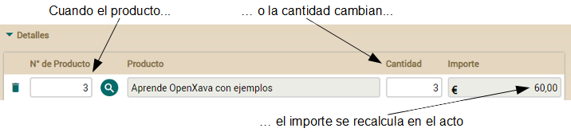\
Añadir esta funcionalidad a tu actual código es prácticamente añadir una propiedad calculada a *Detalle*. Simplemente añade el código siguiente a la clase *Detalle*:

**@Money**

**@Depends**("producto.numero, cantidad") *// Cuando usuario cambie producto o cantidad*

**public** BigDecimal **getImporte**() { *// esta propiedad se recalculará y se redibujará*

`    `**if** (producto == **null** || producto.getPrecio() == **null**) **return** BigDecimal.ZERO;

`    `**return** **new** BigDecimal(cantidad).multiply(producto.getPrecio());

}

Es tan solo poner el cálculo en *getImporte()* y usar *@Depends* para indicar a OpenXava que la propiedad *importe* depende de *producto.numero* y *cantidad*, así cada vez que el usuario cambia alguno de estos valores la propiedad se recalculará. Fíjate como en este caso usamos *producto* y no *getProducto()*, y *cantidad* en vez de *getCantidad()*, porque desde dentro de la clase sí que se puede acceder directamente a sus campos.\
Ahora has de añadir esta nueva propiedad a la lista de propiedades mostradas en la colección *detalles* de *DocumentoComercial*:

**@ElementCollection**

**@ListProperties**("producto.numero, producto.descripcion, cantidad, importe") *// importe añadida*

Collection<Detalle> detalles;

Nada más. Tan solo necesitas añadir el getter y modificar la lista de propiedades. Ahora puedes probar los módulos *Factura* y *Pedido* para ver la propiedad *importe* en acción.

[getting-started_es125.png]: Aspose.Words.de8323ae-3ce2-41e6-809b-62d8a9d0a11a.004.png
[getting-started_es150.png]: Aspose.Words.de8323ae-3ce2-41e6-809b-62d8a9d0a11a.006.png
[inheritance_es010.png]: Aspose.Words.de8323ae-3ce2-41e6-809b-62d8a9d0a11a.033.png
