- [Lección 11: @DefaultValueCalculator en colecciones\
  ](file:///C:\Users\Soporte\Documents\openxava\openxava-doc\web\docs\defaultvaluecalculator-in-collections_es.html)[Lección 12: @Calculation y totales de colección](C:\Users\Soporte\Documents\openxava\openxava-doc\web\docs\calculation-and-collections-total_es.html)
- [Lección 13: @DefaultValueCalculator desde archivo\
  ](C:\Users\Soporte\Documents\openxava\openxava-doc\web\docs\defaultvaluecalculator-from-file_es.html)[Lección 14: Evolución de esquema manual\
  ](C:\Users\Soporte\Documents\openxava\openxava-doc\web\docs\manual-schema-evolution_es.html)[Lección 15: Cálculo de valor por defecto multiusuario\
  ](C:\Users\Soporte\Documents\openxava\openxava-doc\web\docs\multi-user-default-value-calculation_es.html)[Lección 16: Sincronizar propiedades persistentes y calculadas\
  ](C:\Users\Soporte\Documents\openxava\openxava-doc\web\docs\synchronize-persistent-and-computed-properties_es.html)[Lección 17: Lógica desde la base de datos](C:\Users\Soporte\Documents\openxava\openxava-doc\web\docs\logic-from-database_es.html)

  **Validación avanzada**

- [Lección 18: Validando con @EntityValidator](C:\Users\Soporte\Documents\openxava\openxava-doc\web\docs\validating-with-entityvalidator_es.html)
- [Lección 19: Alternativas de validación](C:\Users\Soporte\Documents\openxava\openxava-doc\web\docs\validation-alternatives_es.html)
- [Lección 20: Validación al borrar](C:\Users\Soporte\Documents\openxava\openxava-doc\web\docs\validation-on-remove_es.html)
- [Lección 21: Anotación Bean Validation propia](C:\Users\Soporte\Documents\openxava\openxava-doc\web\docs\custom-bean-validation-annotation_es.html)
- [Lección 22: Llamada REST desde una validación](C:\Users\Soporte\Documents\openxava\openxava-doc\web\docs\rest-service-call-from-validation_es.html)
- [Lección 23: Atributos en anotaciones](C:\Users\Soporte\Documents\openxava\openxava-doc\web\docs\attributes-in-annotations_es.html)

  **Refinar el comportamiento predefinido**

- [Lección 24: Refinar el comportamiento predefinido](C:\Users\Soporte\Documents\openxava\openxava-doc\web\docs\refining-standard-behavior_es.html)

  **Comportamiento y lógica de negocio**

- [Lección 25: Comportamiento y lógica de negocio](C:\Users\Soporte\Documents\openxava\openxava-doc\web\docs\business-logic-behavior_es.html)

  **Referencias y colecciones**

- [Lección 26: Referencias y colecciones](C:\Users\Soporte\Documents\openxava\openxava-doc\web\docs\references-collections_es.html)

  **Apéndices**

- [Apéndice A: Arquitectura y filosofía](C:\Users\Soporte\Documents\openxava\openxava-doc\web\docs\philosophy_es.html)
- [Apéndice B: Java Persistence API](C:\Users\Soporte\Documents\openxava\openxava-doc\web\docs\jpa_es.html)
- [Apéndice C: Anotaciones](C:\Users\Soporte\Documents\openxava\openxava-doc\web\docs\annotations_es.html)
- [Apéndice D: Pruebas automáticas](C:\Users\Soporte\Documents\openxava\openxava-doc\web\docs\testing_es.html)

  Lección 11: @DefaultValueCalculator en colecciones
  ## Usar *@DefaultValueCalculator*
  La forma en que calculamos el importe de la línea de detalle no es la mejor. Tiene, al menos, dos inconvenientes. El primero es que el usuario puede querer tener la posibilidad de cambiar el precio unitario. Y segundo, si el precio de un producto cambia los importes de todas las facturas cambian también, y esto no es bueno.\
  Para evitar estos inconvenientes lo mejor es almacenar el precio de cada producto en cada línea de detalle. Añadamos pues una propiedad persistente *precioPorUnidad* a la clase *Detalle* y calculemos su valor desde *precio* de *Producto* usando un *@DefaultValueCalculator*. De tal forma que consigamos el efecto que puedes ver en la siguiente figura:\
  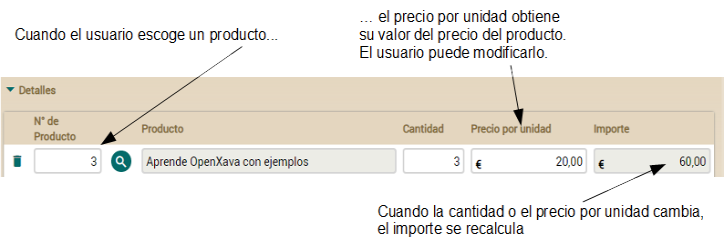\
  La lógica para calcular el valor inicial la tendremos en *CalculadorPrecioPorUnidad* que simplemente lee el precio del producto. Observa el código de este calculador:

**package** com.tuempresa.facturacion.calculadores; *// En el paquete calculadores*

**import** org.openxava.calculators.\*;

**import** com.tuempresa.facturacion.modelo.\*;

**import** lombok.\*;

**import** **static** org.openxava.jpa.XPersistence.\*; *//Para usar getManager()*

**public** **class** **CalculadorPrecioPorUnidad** **implements** **ICalculator** {

`    `**@Getter** **@Setter**

`    `**int** numeroProducto;

`    `**@Override**

`    `**public** Object **calculate**() **throws** Exception {

`        `Producto producto = getManager() *// getManager() de XPersistence*

.find(Producto.class, numeroProducto); *// Busca el producto*

`        `**return** producto.getPrecio();    *// Retorna su precio*

`    `}

}

El siguiente paso es añadir la propiedad *precioPorUnidad*. Añade el siguiente código a la clase *Detalle*:

**@DefaultValueCalculator**(

`    `value=CalculadorPrecioPorUnidad.class, *// Esta clase calcula el valor inicial*

`    `properties=**@PropertyValue**(

`        `name="numeroProducto", *// La propiedad numeroProducto del calculador...*

`        `from="producto.numero") *// ... se llena con el valor de producto.numero de la entidad*

)

**@Money**

BigDecimal precioPorUnidad; *// Una propiedad persistente convencional*

De esta forma cuando el usuario escoge un producto el campo de precio unitario se rellena con el precio del producto, pero dado que es una propiedad persistente, el usuario puede cambiar este valor. Y si en el futuro el precio del producto cambiara este precio unitario de la línea de detalle no cambiaría.\
Esto implica que has de adaptar la propiedad calculada *importe*:

**@Money**

**@Depends**("precioPorUnidad, cantidad") *// precioPorUnidad en vez de producto.numero*

**public** BigDecimal **getImporte**() {

`    `**if** (precioPorUnidad == **null**) **return** BigDecimal.ZERO; *// precioPorUnidad en vez de producto y producto.getPrecio()*

`    `**return** **new** BigDecimal(cantidad).multiply(precioPorUnidad); *// precioPorUnidad en vez de producto.getPrecio()*

}

Ahora *getImporte()* usa *precioPorUnidad* como fuente en lugar de *producto.precio*.\
Finalmente, debemos editar la entidad *DocumentoComercial* y modificar la lista de propiedades de la colección para mostrar la nueva propiedad:

**@ElementCollection**

**@ListProperties**("producto.numero, producto.descripcion, cantidad, precioPorUnidad, importe") *// precioPorUnidad añadida*

Collection<Detalle> detalles;

Prueba los módulos *Pedido* y *Factura* y podrás observar el nuevo comportamiento al añadir líneas de detalle.

[**Lección 12: @Calculation y totales de colección**](C:\Users\Soporte\Documents\openxava\openxava-doc\web\docs\calculation-and-collections-total_es.html)
## Propiedades persistentes con *@Calculation*
A veces las propiedades calculadas no son la mejor opción. Imagínate que tienes una propiedad calculada en *Factura*, digamos *descuento*:

*// NO LO AÑADAS A TU CÓDIGO, ES SÓLO PARA ILUSTRAR*

**public** BigDecimal **getDescuento**() {

`    `**return** getImporte().multiply(**new** BigDecimal("0.10"));

}

Si necesitas procesar todas las facturas cuyo descuento sea mayor de 1000, has de escribir un código como el siguiente:

*// NO LO AÑADAS A TU CÓDIGO, ES SÓLO PARA ILUSTRAR*

Query query = getManager().createQuery("from Factura"); *// Sin condición en la consulta*

**for** (Object o: query.getResultList()) { *// Itera por todos los objetos*

`    `Factura f = (Factura) o;

`    `**if** (f.getDescuento() *// Pregunta a cada objeto*

.compareTo(**new** BigDecimal("1000")) > 0) {

`            `f.hacerAlgo();

`    `}

}

No puedes usar una condición en la consulta para discriminar por *descuento*, porque *descuento* no está en la base de datos, está sólo en el objeto Java, por lo que has de instanciar todos y cada uno de los objetos para poder preguntar por el *descuento*. En algunos casos esta forma es una buena opción, pero si tienes una cantidad inmensa de facturas y sólo unas pocas tiene el *descuento* mayor de 1000, entonce tu proceso va a ser muy ineficiente. ¿Qué alternativas tenemos?\
Nuestra alternativa es usar la anotación *@Calculation*. *@Calculation* es una anotación OpenXava que permite asociar un cálculo simple a una propiedad persistente. Puedes definir *descuento* con *@Calculation* como se muestra en el siguiente código:

*// NO LO AÑADAS A TU CÓDIGO, ES SÓLO PARA ILUSTRAR*

**@ReadOnly**

**@Calculation**("importe \* 0.10")

BigDecimal descuento;

Esto es una propiedad persistente convencional, es decir con una columna correspondiente en la base de datos, pero tiene un cálculo definido con *@Calculation*. En este caso el cálculo es *importe \* 0.10*, de tal manera que cuando el usuario cambia *importe* en la interfaz de usuario *descuento* se recalcula instantaneamente. El valor recalculado se graba en la base de datos cuando el usuario pulsa en *Grabar*, como con cualquier otra propiedad persistente. También hemos anotado *descuento* con *@ReadOnly*, por lo que parece y se comporta como una propiedad calculada, aunque puedes omitir *@ReadOnly* y así el usuario podría modificar el valor calculado.

Lo más útil de las propiedades *@Calculation* es que se pueden usar en las condiciones, por lo que puedes reescribir el proceso de arriba como se muestra en el siguiente código:

*// NO LO AÑADAS A TU CÓDIGO, ES SÓLO PARA ILUSTRAR*

Query query = getManager().createQuery("from Factura f where f.descuento > :descuento"); *// Condición permitida*

query.setParameter("descuento", **new** BigDecimal(1000));

**for** (Object o: query.getResultList()) { *// Itera sólo por los objectos seleccionados*

`    `Factura f = (Factura) o;

`    `f.hacerAlgo();

}

De esta manera ponemos el peso de seleccionar los registros en el servidor de la base de datos y no en el servidor Java. Además, los descuentos no se recalculan cada vez, sino que ya está calculados y grabados.\
Este hecho tiene también efecto en el modo lista, porque el usuario no puede filtrar ni ordenar por las propiedades calculadas, pero sí que lo puede hacer usando propiedades persistentes con *@Calculation*:\
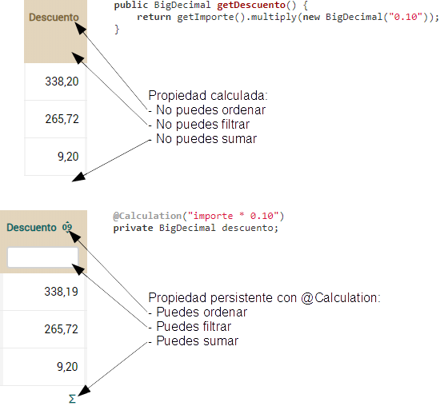\
*@Calculation* es una buena opción cuando necesitas filtrar y ordenar, y un cálculo simple es suficiente. Una desventaja de las propiedades con *@Calculation* es que sus valores se recalculan sólo cuando el usuario interactúa con el registro y cambia algún valor de las propiedades usadas en el cálculo, por lo tanto cuando añades una nueva propiedad *@Calculation* a una entidad con datos existente has de actualizar los valores de la nueva columna en la tabla usando SQL. Por otra parte si necesitas un cálculo complejo, con bucles o consultando otras entidades, todavía sigues necesitando una propiedad calculada con tu lógica Java en el getter. En este último caso si además necesitas ordenar y filtrar en modo lista por la propiedad calculada una opción es tener ambas, la calculada y la persistente, y sincronizar sus valores usando los métodos de retrollamada de JPA (hablaremos sobre los métodos de retrollamada en próximas lecciones).
## Propiedades de total de una colección
También queremos añadir importes a *Pedido* y *Factura*. Tener IVA, importe base e importe total es indispensable. Para hacerlo sólo necesitas añadir unas pocas propiedades a la clase *DocumentoComercial*. La siguiente figura muestra la interfaz de usuario para estas propiedades:\
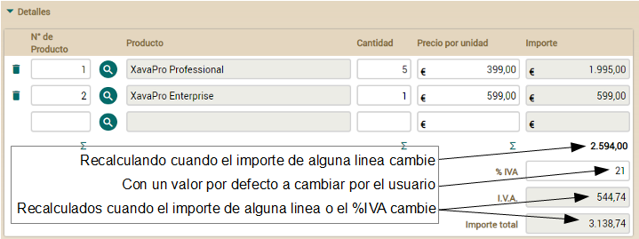\
Añade el siguiente código a la entidad *DocumentoComercial*:

**@Digits**(integer=2, fraction=0) *// Para indicar su tamaño*

BigDecimal porcentajeIVA;

**@ReadOnly**

**@Money**

**@Calculation**("sum(detalles.importe) \* porcentajeIVA / 100")

BigDecimal iva;

**@ReadOnly**

**@Money**

**@Calculation**("sum(detalles.importe) + iva")    

BigDecimal importeTotal;    

Fíjate como hemos escogido propiedades persistentes con *@Calculation + @ReadOnly* en lugar de propiedades calculadas para *iva* e *importeTotal*, porque los cálculos son simples, y filtrar y ordenar por ellos es muy útil. También, puedes ver como en *@Calculation* puedes usar *sum(detalles.importe)* para referirte a la suma de columna *importe* de la colección *detalles*, de esta manera podemos prescindir de una propiedad *importeBase*. Por otra parte, *porcentajeIVA* es un propiedad persistente convencional. En este caso usamos *@Digits* (una anotación de Bean Validation, el estándar de validación de Java) como una alternativa a *@Column* para especificar su tamaño.\
Ahora que ya has escrito las propiedades para los importes de *DocumentoComercial*, tienes que modificar la lista de propiedades de la colección *detalles* para mostrar las [propiedades de total](C:\Users\Soporte\Documents\openxava\openxava-doc\web\docs\view_es.html#Vista-Personalizacion+de+coleccion-Propiedades+de+total+%28nuevo+en+v4.3%29) de *DocumentoComercial*. Veámoslo:

**abstract** **public** **class** **DocumentoComercial** **extends** **Identificable** {

`    `**@ElementCollection**

`    `**@ListProperties**(

`        `"producto.numero, producto.descripcion, cantidad, precioPorUnidad, " +

`        `"importe+[" + 

`        	`"documentoComercial.porcentajeIVA," +

`        	`"documentoComercial.iva," +

`        	`"documentoComercial.importeTotal" +

`        `"]" 

`    `)	

`    `**private** Collection<Detalle> detalles;

...

}

Las propiedades de total son propiedades normales de la entidad (*DocumentoComercial* en este caso) que en la interfaz de usuario se localizan debajo de una columna de una colección. Para eso, en *@ListProperties* se usan corchetes después de la propiedad para enumerarlas, algo así como *importe[documentoComercial.importeTotal]*. Además, si simplemente quieres la suma de la columna no necesitas una propiedad para ello, con un + después de la propiedad en *@ListProperties* es suficiente, como *importe+*. En nuestro caso combinamos ambas cosas, + y propiedades de total entre [ ].

Ahora puedes probar tu aplicación. Debería funcionar casi como en la figura del inicio de esta sección. “Casi” porque *porcentajeIVA* todavía no tiene un valor por defecto. Lo añadiremos en la siguiente sección.

**Lección 13: @DefaultValueCalculator desde archivo**
## Valor por defecto desde un archivo de propiedades
Es conveniente para el usuario tener el campo *porcentajeIVA* lleno por defecto con un valor adecuado. Podrías usar un calculador (*@DefaultValueCalculator*) que devuelva un valor fijo, pero en ese caso cambiar el valor por defecto implica cambiar el código fuente. O podrías leer el valor por defecto de una base de datos (usando JPA desde tu calculador), pero en ese caso cambiar el valor por defecto implica actualizar la base de datos.\
Otra opción es tener estos valores de configuración en un archivo de propiedades, un archivo plano con pares clave=valor. En este caso cambiar el valor por defecto de *porcentajeIVA* es tan simple como editar un archivo plano con un editor de texto.\
Implementemos la opción del archivo de propiedades. Crea un archivo llamado *facturacion.properties* en la carpeta *facturacion/src/main/resources* con el siguiente contenido:

porcentajeIVADefecto=21

Aunque puedes usar la clase *java.util.Properties* de Java para leer este archivo preferimos usar una clase propia para leer estas propiedades. Vamos a llamar a esta clase *PreferenciasFacturacion* y la pondremos en un nuevo paquete llamado *com.tuempresa.facturacion.util*. Veamos el código:

**package** com.tuempresa.facturacion.util; *// En el paquete 'util'*

**import** java.io.\*;

**import** java.math.\*;

**import** java.util.\*;

**import** org.apache.commons.logging.\*;

**import** org.openxava.util.\*;

**public** **class** **PreferenciasFacturacion** {

`    `**private** **final** **static** String ARCHIVO\_PROPIEDADES="facturacion.properties";

`    `**private** **static** Log log = LogFactory.getLog(PreferenciasFacturacion.class);

`    `**private** **static** Properties propiedades; *// Almacenamos las propiedades aquí*

`    `**private** **static** Properties **getPropiedades**() {

`        `**if** (propiedades == **null**) { *// Usamos inicialización vaga*

`            `PropertiesReader reader = *// PropertiesReader es una clase de OpenXava*

`                `**new** PropertiesReader(

`                    `PreferenciasFacturacion.class, ARCHIVO\_PROPIEDADES);

`            `**try** {

`                `propiedades = reader.get();

`            `}

`            `**catch** (IOException ex) {

`                `log.error(

`                    `XavaResources.getString( *// Para leer un mensaje i18n*

`                        `"properties\_file\_error",

`                        `ARCHIVO\_PROPIEDADES),

`                    `ex);

`                  `propiedades = **new** Properties();

`             `}

`        `}

`        `**return** propiedades;

`    `}

`    `**public** **static** BigDecimal **getPorcentajeIVADefecto**() { *// El único método público*

`        `**return** **new** BigDecimal(getPropiedades().getProperty("porcentajeIVADefecto"));

`    `}

}

Como puedes ver *PreferenciasFacturacion* es una clase con un método estático, *getPorcentajeIVADefecto()*. La ventaja de usar esta clase en lugar de leer directamente del archivo de propiedades es que si cambias la forma en que se obtienen las preferencias, por ejemplo leyendo de una base de datos o de un directorio LDAP, solo has de cambiar esta clase en toda tu aplicación.\
Puedes usar esta clase desde el calculador por defecto para la propiedad *porcentajeIVA*. Aquí tienes el código del calculador:

**package** com.tuempresa.facturacion.calculadores; *// En el paquete 'calculadores'*

**import** org.openxava.calculators.\*; *// Para usar 'ICalculator'*

**import** com.tuempresa.facturacion.util.\*; *// Para usar 'PreferenciasFacturacion'*

**public** **class** **CalculadorPorcentajeIVA** **implements** **ICalculator** {

`    `**public** Object **calculate**() **throws** Exception {

`        `**return** PreferenciasFacturacion.getPorcentajeIVADefecto();

`    `}

}

Como ves, simplemente devuelve *porcentajeIVADefecto* de *PreferenciasFacturacion*. Ahora, ya puedes usar este calculador en la definición de la propiedad *porcentajeIVA* en *DocumentoComercial*. Mira el código:

**@DefaultValueCalculator**(CalculadorPorcentajeIVA.class)

BigDecimal porcentajeIVA;

Con este código cuando el usuario pulsa para crear una nueva factura, el campo *porcentajeIVA* se rellenará con 21, o cualquier otro valor que hayas puesto en *facturacion.properties*.

**Lección 14: Evolución de esquema manual**
## Evolución de esquema manual
Cuando usamos cosas como *@Calculation* o *@DefaultValueCalculator* la evolución de esquema automática que provee OpenXava se nos queda corta, porque añade una nueva columna cuando tu añades una nueva propiedad, pero no rellena la columna con los valores correctos. En este caso hemos añadido varias propiedades persistentes con *@Calculation* cuyos valores no se recalculan hasta que el usuario interactua con el registro. Además, tenemos un valor por defecto para *porcentajeIVA* que sólo tiene efecto cuando el usuario crea un nuevo registro pero no en los registros ya existentes. Hemos de rellenar las nuevas columnas con valores razonables.

Dado que estamos en una etapa temprana del desarrollo una buena opción sería borrar todos los registros, pero es seguro que esto no es una buena idea para producción, por tanto vamos a ajustar nuestra base de datos al nuevo código sin perder información para ilustrar la evolución manual de esquema.

Lo más fácil es usar la propia aplicación para hacer las actualizaciones. Vamos a hacerlo para actualizar los precios de los productos. Para que las nuevas propiedades calculadas funcionen bien todos los productos deberían tener un precio, por tanto ve al módulo *Producto* con tu navegador y asegurate de que todos los productos tienen precio:

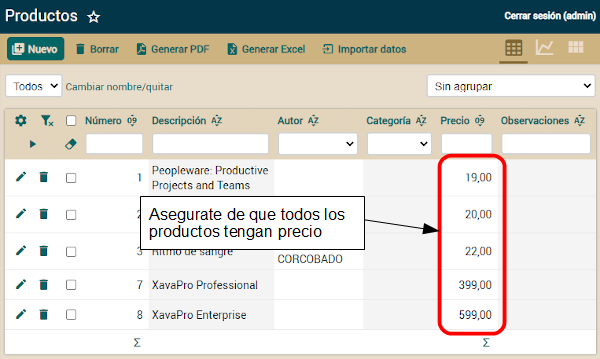

Si algún producto no tiene precio edítalo e introduce un precio.

Los siguientes cambios no son tan sencillos, por lo que vamos a ejecutar sentencias SQL contra nuestra base de datos. Para ejecutar estas sentencias SQL, primero asegurate de que tu aplicación se está ejecutando, después usa la opción de menú *OpenXava > Database Manager* de OpenXava Studio::\
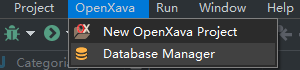\
Ahora estás listo para escribir y ejecutar SQLs. Primero, establecemos el valor para la columna *precioPorUnidad* en todos los detalles:

**UPDATE** DOCUMENTOCOMERCIAL\_DETALLES 

**SET** PRECIOPORUNIDAD = (

`    `**SELECT** PRECIO **FROM** PRODUCTO 

`    `**WHERE** NUMERO = PRODUCTO\_NUMERO

)

Ahora actualizamos *porcentajeIVA* para todas las facturas:

**UPDATE** DOCUMENTOCOMERCIAL

**SET** PORCENTAJEIVA = 21

Lo siguiente es actualizar *iva*:

**UPDATE** DOCUMENTOCOMERCIAL

**SET** IVA = (

`    `**SELECT** **SUM**(PRECIOPORUNIDAD \* CANTIDAD) \* 0.21 

`    `**FROM** DOCUMENTOCOMERCIAL\_DETALLES D 

`    `**WHERE** D.DOCUMENTOCOMERCIAL\_OID = DOCUMENTOCOMERCIAL.OID

)

Finalmente, actualizamos *importeTotal* en todas las facturas:

**UPDATE** DOCUMENTOCOMERCIAL

**SET** IMPORTETOTAL = (

`    `**SELECT** **SUM**(PRECIOPORUNIDAD \* CANTIDAD) \* 1.21 

`    `**FROM** DOCUMENTOCOMERCIAL\_DETALLES D 

`    `**WHERE** D.DOCUMENTOCOMERCIAL\_OID = DOCUMENTOCOMERCIAL.OID

)

Ten cuidado, las sentencias de arriba funciona bien con HSQLDB, la base de datos incluida con OpenXava. Si usas otra base de datos probablemente tengas que adaptar la sintaxis. Después de ejecutar estas sentencias puedes probar tu aplicación. Debería funcionar como en la figura que aparece en la sección "Propiedades de total de una colección" que puedes encontrar en la lección [12. @Calculation y totales de colección](C:\Users\Soporte\Documents\openxava\openxava-doc\web\docs\calculation-and-collections-total_es.html), incluso para facturas y pedidos ya existentes.

**Lección 15: Cálculo de valor por defecto multiusuario**
## Métodos de retrollamadas JPA
Otra forma práctica de añadir lógica de negocio a tu modelo es mediante los métodos de retrollamada JPA. Un método de retrollamada se llama en un momento específico del ciclo de vida de la entidad como objeto persistente. Es decir, puedes especificar cierta lógica a ejecutar al grabar, leer, borrar o modificar una entidad.\
En esta sección veremos algunas aplicaciones prácticas de los métodos de retrollamada JPA.
## Cálculo de valor por defecto multiusuario
Hasta ahora estamos calculando el número para *Factura* y *Pedido* usando *@DefaultValueCalculator*. Éste calcula el valor por defecto en el momento que el usuario pulsa para crear una nueva *Factura* o *Pedido*. Por tanto, si varios usuarios pulsan en el botón *Nuevo* al mismo tiempo todos ellos obtendrán el mismo número. Esto no es apto para aplicaciones multiusuario. La forma correcta de generar un número único es generándolo justo en el momento de grabar.\
Vamos a implementar la generación del número usando métodos de retrollamada JPA. JPA permite marcar cualquier método de tu clase para ser ejecutado en cualquier momento de su ciclo de vida. Indicaremos que justo antes de grabar un *DocumentoComercial* calcule su número. De paso mejoraremos el cálculo para tener una numeración diferente para *Pedido* y *Factura*.\
Edita la entidad *DocumentoComercial* y añade el método *calcularNumero()*. Veamos el código:

**@PrePersist** *// Ejecutado justo antes de grabar el objeto por primera vez*

**private** **void** **calcularNumero**() {

`    `Query query = XPersistence.getManager().createQuery(

`        `"select max(f.numero) from " +

`        `getClass().getSimpleName() + *// De esta forma es válido para Factura y Pedido*

`        `" f where f.anyo = :anyo");

`    `query.setParameter("anyo", anyo);

`    `Integer ultimoNumero = (Integer) query.getSingleResult();

`    `**this**.numero = ultimoNumero == **null** ? 1 : ultimoNumero + 1;

}

Este código es el mismo que el de *CalculadorSiguienteNumeroParaAnyo* pero usando *getClass().getSimpleName()* en lugar de "DocumentoComercial". El método *getSimpleName()* devuelve el nombre de la clase sin paquete, es decir, precisamente el nombre de la entidad. Será "Pedido" para *Pedido* y "Factura" para *Factura*. Así podremos obtener una numeración diferente para *Factura* y *Pedido*.\
La especificación JPA establece que no puedes usar el API JPA dentro de un método de retrollamada. Por tanto, el método de arriba no es legal desde un punto de vista estricto. Pero, Hibernate (la implementación de JPA que OpenXava usa por defecto) te permite usarla en *@PrePersist*. Y dado que usar JPA es la forma más fácil de hacer este cálculo, nosotros lo usamos.\
Ahora borra la clase *CalculadorSiguienteNumeroParaAnyo* de tu proyecto y modifica la propiedad *numero* de *DocumentoComercial* para que no la use:

**@Column**(length = 6)

*//  @DefaultValueCalculator(value=CalculadorSiguienteNumeroParaAnyo.class, // Quita esto*

*//      properties=@PropertyValue(name="anyo")*

*//  )*

**@ReadOnly** *// El usuario no puede modificar el valor*

**int** numero;

Fíjate que además de quitar *@DefaultValueCalculator*, hemos añadido la anotación *@ReadOnly*. Esto significa que el usuario no puede introducir ni modificar este número. Esta es la forma correcta de hacerlo ahora dado que el número es generado al grabar el objeto, por lo que el valor que tecleara el usuario sería sobrescrito siempre.\
Prueba ahora el módulo de *Factura* o *Pedido*, verás como el número está vacío y no es editable, y cuando grabes el documento, el número se calcula y se muestra un mensaje con el año y el número recién calculado para esa factura o pedido.

**Lección 16: Sincronizar propiedades persistentes y calculadas.**
## Sincronizar propiedades persistentes y calculadas
Como ya hemos aprendido, las propiedades calculadas no permiten filtrar ni ordenar en la lista, por lo que preferimos propiedades persistentes con *@Calculation*. Sin embargo, las propiedades *@Calculation* sólo sirven para cálculos aritméticos simples. Cuando necesitas bucles, condiciones, leer de la base de datos, conectar a servicios externos o cualquier lógica compleja, *@Calculation* no es suficiente. Para estos casos necesitas escribir la lógica con Java, en el getter. Pero, ¿cómo podemos hacer esto y al mismo tiempo mantener la ordenación y el filtrado en la lista? Fácil, puedes usar dos propiedades, una calculada y otra persistente, y mantenerlas sincronizadas usando los métodos de retrollamada de JPA. Vamos a aprender como hacerlo en esta sección.

Añadamos un nueva propiedad a la entidad *Pedido* llamada *diasEntregaEstimados*:

**@Depends**("fecha")

**public** **int** **getDiasEntregaEstimados**() {

`    `**if** (getFecha().getDayOfYear() < 15) {

`        `**return** 20 - getFecha().getDayOfYear(); 

`    `}

`    `**if** (getFecha().getDayOfWeek() == DayOfWeek.SUNDAY) **return** 2;

`    `**if** (getFecha().getDayOfWeek() == DayOfWeek.SATURDAY) **return** 3;

`    `**return** 1;

}

Esto es una propiedad calculada pura, un getter con lógica Java. Calcula los día estimados de entrega usando *fecha* como fuente. Este caso no puede solucionarse con *@Calculation* que solo soporta operaciones aritméticas básicas.

También hemos de añadir *diasEntregaEstimados* a la declaración de la *@View* por defecto en el código de *Pedido*:

**@View**(extendsView="super.DEFAULT", 

`    `members=

`        `"diasEntregaEstimados," + *// AÑADE ESTA LÍNEA*

`        `"factura { factura }"

)

...

**public** **class** **Pedido** **extends** **DocumentoComercial** {

El resultado es este:

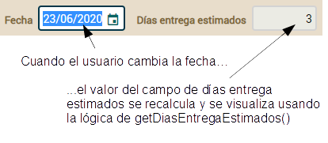

El valor se recalcula cada vez que la fecha cambia en la interfaz de usuario gracias a el *@Depends("fecha")* en *diasEntregaEstimados.* Todo esto está muy bien, pero cuando vas al modo lista no puedes ordenar ni filtrar por días estimados de entrega. Para solucionar este problema añadimos una segunda propiedad, esta vez persistente. Agrega el siguiente código a tu entidad *Pedido*:

**@Column**(columnDefinition="INTEGER DEFAULT 1")

**int** diasEntrega;

Ten en cuenta que hemos usado *@Column(columnDefinition="INTEGER DEFAULT 1")*, con este truco cuando OpenXava crea la columna usa "INTEGER DEFAULT 1" como definición de columna, por lo que la nueva columna tiene 1 como valor predeterminado en lugar de nulo, y nosotros evitamos un feo error con nuestra propiedad int. Sí, en muchos casos *@Column(columnDefinition=)* es una alternativa para hacer una ACTUALIZACIÓN sobre la tabla (como hicimos en la lección "Evolución manual del esquema"), aunque tiene el problema de que depende de la base de datos. De todos modos, esta disertación de *columnDefinition* es tangencial a nuestro problema de sincronización calculada/persistente, *@Column* no es del todo necesaria, solo es conveniente para nuestra propiedad int. Esta nueva propiedad *diasEntrega* contendrá el mismo valor que *diasEntregaEstimados*, pero *diasEntrega* será persistente con su columna correspondiente en la base de datos. El truco está en mantener sincronizada la propiedad *diasEntrega*. Usaremos los métodos de retrollamadas JPA en la clase de Pedido. Basta con asignar el valor de *díasEntregaEstimados* a *diasEntrega* cada vez que se crea un nuevo pedido (*@PrePersist*) o se actualiza (*@PreUpdate*). Agreguemos un nuevo método *recalcularDiasEntrega()* a la entidad de pedido anotada con *@PrePersist* y *@PreUpdate*, por lo tanto:

**@PrePersist** **@PreUpdate** 

**private** **void** **recalcularDiasEntrega**() {

`    `setDiasEntrega(getDiasEntregaEstimados());

}

Básicamente, el método *recalcularDiasEntrega()* se llama cada vez que se registra una entidad de *Pedido* en la base de datos por primera vez y cuando se actualiza el pedido. Puedes probar el módulo *Pedido* con este código, y verás como cuando se crea o modifica un pedido, la columna de la base de datos para *diasEntrega* se actualiza correctamente después de guardar, lista para ser utilizada en procesamiento masivo y disponible para ordenar y filtrar lista.

[**Lección 17: Lógica desde la base de datos**](C:\Users\Soporte\Documents\openxava\openxava-doc\web\docs\logic-from-database_es.html)
## Uso de *@Formula*
Otra alternativa a *@Calculation,* o a tener propiedades calculadas y persistentes sincronizadas, es la anotación *@Formula*. *@Formula* es una extensión de Hibernate al estándar JPA, que permite mapear una propiedad a un fragmento de SQL. Por ejemplo, puedes definir *beneficioEstimado* con *@Formula* en *DocumentoComercial* como se muestra en el siguiente código:

**@org**.hibernate.annotations.Formula("IMPORTETOTAL \* 0.10") *// El cálculo usando SQL*

**@Setter**(AccessLevel.NONE) *// El setter no se genera, sólo necesitamos el getter*

**@Money**

BigDecimal beneficioEstimado; *// Un campo, como con una propiedad persistente*

Esto significa que cuando un *DocumentoComercial* se lea de la base de datos, el campo *beneficioEstimado* se rellenerá con el cálculo de *@Formula* que es ejecutado por la base de datos. El usuario puede filtrar y ordenar por las propiedades *@Formula* en modo lista, pero siempre son de solo lectura y no se recalculan en tiempo real en modo detalle. Dado que son de sólo lectura no necesitan el método setter, por lo que la hemos anotamos con *@Setter(AccessLevel.NONE)* para que Lombok no genere el setter. Además, las propiedades *@Formula* dependen de la base de datos, porque podrías usar sintaxis sólo soportada por cierto fabricante de base de datos.
## Resumen
En esta lección has aprendido algunas formas comunes de añadir lógica de negocio a tus entidades. No hay duda sobre la utilidad de las propiedades calculadas, *@Calculation*, los métodos de retrollamada o *@Formula*. Sin embargo, todavía tenemos muchas otras formas de añadir lógica a tu aplicación OpenXava, que vamos a aprender a usar.\
En futuros lecciones verás como añadir validación, modificar el funcionamiento estándar del módulo y añadir tu propia lógica de negocio, entre otras formas de añadir lógica personalizada a tu aplicación.

- [**Lección 18: Validando con @EntityValidator**](C:\Users\Soporte\Documents\openxava\openxava-doc\web\docs\validating-with-entityvalidator_es.html)
  ## Nuestra validación
  Vamos a refinar tu código para que el usuario no pueda asignar pedidos a una factura si los pedidos no han sido entregados todavía. Es decir, solo los pedidos entregados pueden asociarse a una factura. Aprovecharemos la oportunidad para explorar diferentes formas de hacer esta validación.
  ## Añadir la propiedad entregado a Pedido
  Para hacer esto, lo primero es añadir una nueva propiedad a la entidad *Pedido*. La propiedad *entregado*:

**@Column**(columnDefinition="BOOLEAN DEFAULT FALSE")

**boolean** entregado;

Además es necesario añadir la propiedad *entregado* a la vista. Modifica la vista *Pedido* como muestra el siguiente código:

**@View**(extendsView="super.DEFAULT", 

`    `members=

`        `"diasEntregaEstimados, entregado, " + *// Añade entregado*

`        `"factura { factura }"

)

...

**public** **class** **Pedido** **extends** **DocumentoComercial** {

Ahora tienes una nueva propiedad *entregado* que el usuario puede marcar para indicar que el pedido ha sido entregado. Ejecuta el nuevo código y marca algunos de los pedidos existentes como entregados.
## Validar con *@EntityValidator*
En tu aplicación actual el usuario puede añadir cualquier pedido que le plazca a una factura usando el módulo *Factura* y puede asignar una factura a cualquier pedido desde el módulo *Pedido*. Vamos a restringir esto. Solo los pedidos entregados podrán añadirse a una factura.\
La primera alternativa que usaremos para implementar esta validación es mediante *@EntityValidator*. Esta anotación te permite asignar a tu entidad una clase con la lógica de validación deseada. Anotemos tu entidad *Pedido* tal como muestra el siguiente código:

**@EntityValidator**(

`    `value=com.tuempresa.facturacion.validadores.ValidadorEntregadoParaEstarEnFactura.class, *// Clase con la lógica de validación*

`    `properties= {

`        `**@PropertyValue**(name="anyo"), *// El contenido de estas propiedades*

`        `**@PropertyValue**(name="numero"), *// se mueve desde la entidad 'Pedido'*

`        `**@PropertyValue**(name="factura"), *// al validador antes de*

`        `**@PropertyValue**(name="entregado") *// ejecutar la validación*

})

**public** **class** **Pedido** **extends** **DocumentoComercial** {

Cada vez que un objeto *Pedido* se crea o modifica un objeto del tipo *ValidadorEntregadoParaEstarEnFactura* es creado, entonces las propiedades *anyo*, *numero*, *factura* y *entregado* se rellenan con las propiedades del mismo nombre del objeto *Pedido*. Después de eso, el método *validate()* del validador se ejecuta. Escribamos el código del validador, primero crea el paquete *com.tuempresa.facturacion.validadores* y después pon en él esta clase:

**package** com.tuempresa.facturacion.validadores; *// En el paquete 'validadores'*

**import** com.tuempresa.facturacion.modelo.\*;

**import** org.openxava.util.\*;

**import** org.openxava.validators.\*;

**import** lombok.\*;

**@Getter** **@Setter** 

**public** **class** **ValidadorEntregadoParaEstarEnFactura**

`    `**implements** **IValidator** { *// ha de implementar 'IValidator'*

`    `**private** **int** anyo; *// Propiedades a ser inyectadas desde Pedido*

`    `**private** **int** numero;

`    `**private** **boolean** entregado;

`    `**private** Factura factura;

`    `**public** **void** **validate**(Messages errors)

`        `**throws** Exception { *// La lógica de validación*

`        `**if** (factura == **null**) **return**;

`        `**if** (!entregado) {

`            `errors.add( *// Al añadir mensajes a 'errors' la validación fallará*

`                `"pedido\_debe\_estar\_entregado", *// Un id del archivo i18n*

`                `anyo, numero); *// Argumentos para el mensaje*

`        `}

`    `}

}

La lógica de validación es extremadamente fácil, si una factura está presente y este pedido no está marcado como entregado, añadimos un mensaje de error, por tanto la validación fallará. Has de añadir el mensaje de error en el archivo *facturacion/src/main/resources/i18n/facturacion-messages\_es.properties*. Tal como muestra a continuación:

*# Mensajes  para la aplicación Facturacion*

pedido\_debe\_estar\_entregado=Pedido {0}/{1} debe estar entregado para ser añadido a una Factura

Ahora puedes intentar añadir pedidos a una factura con la aplicación, verás como los pedidos no entregados son rechazados. Ve al módulo *Facturas*, selecciona la pestaña PEDIDOS de una factura y desde ahí pulsa en el botón *Añadir*:

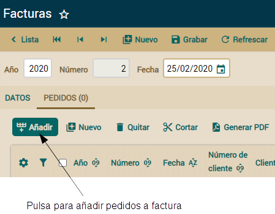

Se mostrará un diálogo con una lista de pedidos para escoger. Selecciona dos, uno de ellos no entregado todavía y pulsa en AÑADIR:

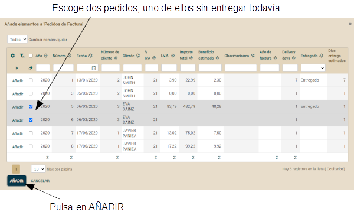

Entonces el pedido entregado se añadirá mientras que el otro es rechazado, generando los siguientes mensajes:

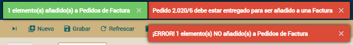

- [**Lección 19: Alternativas de validación**](C:\Users\Soporte\Documents\openxava\openxava-doc\web\docs\validation-alternatives_es.html)
  ## Validar con métodos de retrollamada JPA
  Vamos a probar otra forma más sencilla de hacer esta validación, simplemente moviendo la lógica de validación desde la clase validador a la misma entidad *Pedido*, en este caso a un método *@PrePersist* y *@PreUpdate*.\
  Lo primero es eliminar la clase *ValidadorEntregadoParaEstarEnFactura* de tu proyecto. También quita la anotación *@EntityValidator* de tu entidad *Pedido*:

*// @EntityValidator( // Eliminar '@EntityValidator'*

*//    value=com.tuempresa.facturacion.validadores.ValidadorEntregadoParaEstarEnFactura.class,*

*//    properties= {*

*//        @PropertyValue(name="anyo"),*

*//        @PropertyValue(name="numero"),*

*//        @PropertyValue(name="factura"),*

*//        @PropertyValue(name="entregado")*

*// })*

**public** **class** **Pedido** **extends** **DocumentoComercial** {

Acabamos de eliminar la validación. Ahora, vamos a añadirla de nuevo, pero ahora dentro de la misma clase *Pedido*. Escribe el método *validar()* que se muestra a continuación dentro de tu clase *Pedido*:

**@PrePersist** **@PreUpdate** *// Antes de crear o modificar*

**private** **void** **validar**() **throws** Exception {

`    `**if** (factura != **null** && !isEntregado()) { *// La lógica de validación*

`        `*// La excepción de validación del entorno Bean Validation*

`        `**throw** **new** javax.validation.ValidationException(

`            `XavaResources.getString( *// Para leer un mensaje i18n*

`                `"pedido\_debe\_estar\_entregado",

`                `getAnyo(),

`                `getNumero())

`        `);

`    `}

}

Antes de grabar un pedido esta validación se ejecutará, si falla una *ValidationException* será lanzada. Esta excepción es del marco de validación Bean Validation, de esta forma OpenXava sabe que es una excepción de validación. Así con solo un método dentro de tu entidad tienes la validación hecha.

Sólo está permitido un método *@PrePersist* y un método *@PreUpdate* por entidad, por eso antes de ejecutar el código de arriba has de comentar las anotaciones *@PrePersist* y *@PreUpdate* que tenías en *recalcularDiasEntrega()*, de esta manera:

*// @PrePersist @PreUpdate // Comenta estas anotaciones*

**private** **void** **recalcularDiasEntrega**()() {

`    `setDiasEntrega(getDiasEntregaEstimados());

}

No te preocupes, descomentaremos estas anotaciones más adelante. Aunque JPA sólo permita un método *@PrePersist/@PreUpdate* siempre tenemos la opción de crear un único método de retrollamada desde el cual llamar a todos los demás métodos que necesitemos, pero esto no hace falta en nuestro caso, porque no vamos a quedarnos con este estilo de validación como definitivo.

Ahora, intentar añadir pedidos no entregados a una factura y verás los errores de validación, como en nuestro primer ejemplo.
## Validar en el setter
Otra alternativa para hacer tu validación es poner tu lógica de validación dentro del método setter. Es un enfoque simple y llano.

Para probarlo, primero vuelve a poner las anotaciones *@PrePersist* y *@PreUpdate* en el método *recalcularDiasEntrega(),* también quita el método *validar()* de tu entidad *Pedido*:

**@PrePersist** **@PreUpdate** *// Añádelas de nuevo*

**private** **void** **recalcularDiasEntrega**() {

`    `setDiasEntrega(getDiasEntregaEstimados());

}	

*// Quita el método validar()*

*// @PrePersist @PreUpdate // Antes de crear o modificar*

*// private void validar() throws Exception {*

*//     if (factura != null && !isEntregado()) { // La lógica de validación*

*//         // La excepción de validación del entorno Bean Validation*

*//         throw new javax.validation.ValidationException(*

*//             XavaResources.getString( // Para leer un mensaje i18n*

*//                 "pedido\_debe\_estar\_entregado",*

*//                 getAnyo(),*

*//                 getNumero())*

*//         );*

*//     }*

*// }*    

Después añade el método setter *setFactura()* a *Pedido*:

**public** **void** **setFactura**(Factura factura) {

`    `**if** (factura != **null** && !isEntregado()) { *// La lógica de validación*

`        `*// La excepción de validación del entorno Bean Validation*

`        `**throw** **new** javax.validation.ValidationException(

`            `XavaResources.getString( *// Para leer un mensaje i18n*

`                `"pedido\_debe\_estar\_entregado",

`                `getAnyo(),

`                `getNumero())

`        `);

`    `}

`    `**this**.factura = factura; *// La asignación típica del setter*

}

Esto funciona exactamente como las dos opciones anteriores. Es parecida a la alternativa del *@PrePersist/@PreUpdate*, solo que no depende de JPA, es una implementación básica de Java.
## Validar con *Bean Validation*
Como opción final vamos a hacer la más breve. Consiste en poner tu lógica de validación dentro de un método booleano anotado con la anotación de Bean Validation *@AssertTrue*.\
Para implementar esta alternativa primero quita el método *setFactura()*:

*// Quita el método setter*

*// public void setFactura(Factura factura) {*

*//    if (factura != null && !isEntregado()) { // La lógica de validación*

*//        // La excepción de validación del entorno Bean Validation*

*//        throw new javax.validation.ValidationException(*

*//            XavaResources.getString( // Para leer un mensaje i18n*

*//                "pedido\_debe\_estar\_entregado",*

*//                getAnyo(),*

*//                getNumero())*

*//        );*

*//    }*

*//    this.factura = factura; // La asignación típica del setter*

*// }*

Después, añade *isEntregadoParaEstarEnFactura()* a tu entidad *Pedido*, como se muestra a continuación:

**@AssertTrue**(  *// Antes de grabar confirma que el método devuelve true, si no lanza una excepción*

`    `message="pedido\_debe\_estar\_entregado" *// Mensaje de error en caso retorne false*

)

**private** **boolean** **isEntregadoParaEstarEnFactura**() { *// ...*

`    `**return** factura == **null** || isEntregado(); *// La lógica de validación*

}

En las formas anteriores de validación nuestro mensaje de error era construído mediante dos argumentos, *anyo* y *numero*, que en nuestro archivo *i18n* son representados por *{0}/{1}* respectivamente. Para el caso de validación con *@AssertTrue* no podemos pasar estos dos argumentos para construir nuestro mensaje de error, sino que podemos declarar propiedades y propiedades calificadas del bean validado en la definición del mensaje, para eso cambia en *facturacion-messages\_es.properties* la entrada:

pedido\_debe\_estar\_entregado=Pedido {0}/{1} debe estar entregado para ser añadido a una Factura

Por:

pedido\_debe\_estar\_entregado=Pedido {anyo}/{numero} debe estar entregado para ser añadido a una Factura

Fíjate que hemos cambiado *{0}/{1}* por *{anyo}/{numero}*. OpenXava llenará *{anyo}/{numero}* con los valores de *anyo* y *numero* que tenga el *Pedido* que está siendo actualizado y no cumple la condición de validación.\
Esta es la forma más simple de validar, porque solo anotamos el método con la validación, y es el entorno Bean Validation el responsable de llamar este método al grabar y lanzar la excepción correspondiente si la validación no pasa.

- [**Lección 20: Validación al borrar**](C:\Users\Soporte\Documents\openxava\openxava-doc\web\docs\validation-on-remove_es.html)
  ## Validar al borrar con *@RemoveValidator*
  Las validaciones que hemos visto hasta ahora se hacen cuando la entidad se modifica, pero a veces es útil hacer la validación justo al borrar la entidad y usar la validación para vetar el borrado de la misma.\
  Vamos a modificar la aplicación para impedir que un usuario borre un pedido si éste tiene una factura asociada. Para hacer esto anota tu entidad *Pedido* con *@RemoveValidator*, como se muestra a continuación:

**@RemoveValidator**(com.tuempresa.facturacion.validadores.ValidadorBorrarPedido.class) *// La clase con la validación*

**public** **class** **Pedido** **extends** **DocumentoComercial** {

Ahora, antes de borrar un pedido la lógica de *ValidadorBorrarPedido* se ejecuta y si la validación falla el pedido no se borra. Veamos el código de este validador:

**package** com.tuempresa.facturacion.validadores; *// En el paquete 'validadores'*

**import** com.tuempresa.facturacion.modelo.\*;

**import** org.openxava.util.\*;

**import** org.openxava.validators.\*;

**public** **class** **ValidadorBorrarPedido**

`    `**implements** **IRemoveValidator** { *// Ha de implementar 'IRemoveValidator'*

`    `**private** Pedido pedido;

`    `**public** **void** **setEntity**(Object entity) *// La entidad a borrar se inyectará...*

`        `**throws** Exception *// ...con este método antes de la validación*

`    `{

`        `**this**.pedido = (Pedido) entity;

`    `}

`    `**public** **void** **validate**(Messages errors) *// La lógica de validación*

`        `**throws** Exception

`    `{

`        `**if** (pedido.getFactura() != **null**) {

`            `*// Añadiendo mensajes a 'errors' la validación fallará y el*

`            `*// borrado se abortará*

`            `errors.add("no\_puede\_borrar\_pedido\_con\_factura");

`        `}

`    `}

}

La lógica de validación está en el método *validate()*. Antes de llamarlo la entidad a validar es inyectada usando *setEntity()*. Si se añaden mensajes al objeto *errors* la validación fallará y la entidad no se borrará. Has de añadir el mensaje de error en el archivo *facturacion/src/main/resources/i18n/facturacion-messages\_es.properties*:

no\_puede\_borrar\_pedido\_con\_factura=Pedido asociado a factura no puede ser eliminado

Ahora si intentas borrar un pedido con una factura asociada obtendrás un mensaje de error y el borrado no se producirá.\
Puedes ver que usar un *@RemoveValidator* no es difícil, pero es un poco verboso. Has de escribir una clase nueva solo para añadir un simple if. Examinemos una alternativa más breve.
## Validar al borrar con un método de retrollamada
Vamos a probar otra forma más simple de hacer esta validación al borrar, moviendo la lógica de validación desde la clase validador a la misma entidad *Pedido*, en este caso en un método *@PreRemove*.\
El primer paso es eliminar la clase *ValidadorBorrarPedido* de tu proyecto. Además quita la anotación *@RemoveValidator* de tu entidad *Pedido*:

*// @RemoveValidator(com.tuempresa.facturacion.validadores.ValidadorBorrarPedido.class) // Quitamos '@RemoveValidator'*

**public** **class** **Pedido** **extends** **DocumentoComercial** {

Hemos quitado la validación. Añadámosla otra vez, pero ahora dentro de la misma clase *Pedido*. Añade el método *validarPreBorrar()* a la clase *Pedido*, como se muestra a continuación:

**@PreRemove**

**private** **void** **validarPreBorrar**() {

`    `**if** (factura != **null**) { *// La lógica de validación*

`        `**throw** **new** javax.validation.ValidationException( *// Lanza una excepción runtime*

`            `XavaResources.getString( *// Para obtener un mensaje de texto*

`                `"no\_puede\_borrar\_pedido\_con\_factura"));

`    `}

}

Antes de borrar un pedido esta validación se efectuará, si falla se lanzará una *ValidationException*. Puedes lanzar cualquier excepción runtime para abortar el borrado. Tan solo con un método dentro de la entidad tienes la validación hecha.
## ¿Cuál es la mejor forma de validar?
Has aprendido varias formas de hacer la validación sobre tus clases del modelo. ¿Cuál de ellas es la mejor? Todas ellas son opciones válidas. Depende de tus circunstancias y preferencias personales. Si tienes una validación que no es trivial y es reutilizable en varios puntos de tu aplicación, entonces usar un *@EntityValidator* y *@RemoveValidator* es una buena opción. Por otra parte, si quieres usar tu modelo fuera de OpenXava y sin JPA, entonces el uso de la validación en los *setters* es mejor.\
En nuestro caso particular hemos optado por *@AssertTrue* para la validación “el pedido ha de estar servido para estar en una factura” y por *@PreRemove* para la validación al borrar. Ya que son las alternativas más simples que funcionan.

- [**Lección 21: Anotación Bean Validation propia**](C:\Users\Soporte\Documents\openxava\openxava-doc\web\docs\custom-bean-validation-annotation_es.html)
  ## Crear tu propia anotación de *Bean Validation*
  Las técnicas mencionadas hasta ahora son muy útiles para la mayoría de las validaciones de tus aplicaciones. Sin embargo, a veces te encuentras con algunas validaciones que son muy genéricas y quieres usarlas una y otra vez. En este caso definir tu propia anotación de *Bean Validation* puede ser una buena opción. Definir un *Bean validation* es más largo y engorroso que lo que hemos visto hasta ahora, pero usarlo y reusarlo es simple, tan solo añadir una anotación a tu propiedad o clase.\
  Vamos a aprender como crear un *Bean Validation*.
  ## Usar un *Bean Validation* en tu entidad
  Es superfácil. Simplemente anota tu propiedad como ves a continuación:

**@ISBN** *// Esta anotación indica que esta propiedad tiene que validarse como un ISBN*

String isbn;

Solo con añadir *@ISBN* a tu propiedad ésta será validada justo antes de que la entidad se grabe en la base de datos, ¡genial! El problema es que *@ISBN* no está incluida como un validador predefinido en el marco de validación *Bean Validation*. Esto no es un gran problema, si quieres una anotación *@ISBN*, hazla tú mismo. De hecho, vamos a crear la anotación de validación *@ISBN* en esta sección.\
Antes de nada, añadamos una nueva propiedad *isbn* a *Producto*. Edita tu clase *Producto* y añádele el siguiente código:

**@Column**(length=13)

String isbn;

Ejecuta el módulo *Producto* con tu navegador. Sí, la propiedad *isbn* ya está ahí. Ahora, puedes añadir la validación.
## Definir tu propia anotación *ISBN*
Creemos la anotación *@ISBN*. Primero, crea un paquete en tu proyecto llamado *com.tuempresa.facturacion.anotaciones*. Pulsa en él con el botón derecho del ratón y escoge *New > Annotation*, como sigue:\
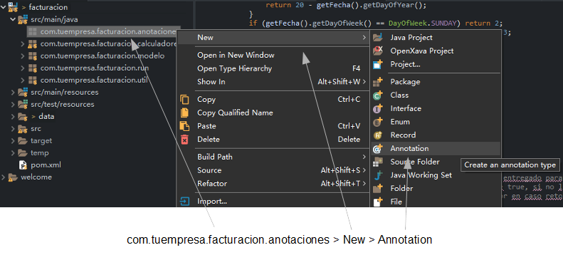\
Se mostrará un diálogo, teclea ISBN y pulsa en *Finish*:

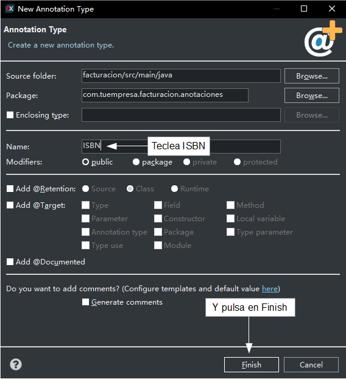

Edita el código de tu recién creada anotación *ISBN* y déjala así:

**package** com.tuempresa.facturacion.anotaciones; *// En el paquete 'anotaciones'*

**import** java.lang.annotation.\*;

**import** javax.validation.\*;

**@Constraint**(validatedBy = com.tuempresa.facturacion.validadores.ValidadorISBN.class)

**@Target**({ElementType.FIELD, ElementType.METHOD})

**@Retention**(RetentionPolicy.RUNTIME)

**public** **@interface** ISBN {

`    `Class<?>[] groups() **default**{};

`    `Class<? extends Payload>[] payload() **default**{};

`    `String **message**() **default** "isbn\_invalido"; *// Id del mensaje en el archivo i18n*

}

Como puedes ver, es una definición de anotación normal y corriente. El atributo *message* es el mensaje a mostrar al usuario si la validación falla, puedes escribir el mensaje tal cual o poner un identificador i18n. El desarrollador puede especificar su propio mensaje cuando use la anotación, aunque nosotros proveemos unos por defecto, "isbn\_invalido", por lo que hemos de añadir la siguiente entrada en facturacion-messages*\_es.properties*:

isbn\_invalido=ISBN inválido o inexistente

*@Constraint* indica la clase con la lógica de validación. Escribamos la clase *ValidadorISBN*.
## Usa *Apache Commons Validator* para implementar la lógica
Vamos a escribir la clase *ValidadorISBN* con la lógica de validación para un *ISBN*. En lugar de escribir nosotros mismos la lógica para validar un *ISBN* usaremos el proyecto [Commons Validator](http://commons.apache.org/proper/commons-validator/) de Apache. Commons Validator contiene algoritmos de validación para direcciones de correo electrónico, fechas, URL y así por el estilo. El *commons-validator.jar* se incluye por defecto en los proyectos OpenXava, por tanto lo puedes usar sin ninguna configuración adicional.\
El código para *ValidadorISBN* lo puedes ver a continuación:

**package** com.tuempresa.facturacion.validadores; *// En el paquete 'validadores'*

**import** javax.validation.\*;

**import** com.tuempresa.facturacion.anotaciones.\*;

**import** org.openxava.util.\*;

**public** **class** **ValidadorISBN** **implements** **ConstraintValidator**<**ISBN**, **Object**> {

`    `**private** **static** org.apache.commons.validator.routines.ISBNValidator

`        `validador = *// De 'Commons Validator'*

`            `**new** org.apache.commons.validator.routines.ISBNValidator();

`    `**public** **void** **initialize**(ISBN isbn) {

`    `}

`    `*// Contiene la lógica de validación*

`    `**public** **boolean** **isValid**(Object valor, ConstraintValidatorContext contexto) { 

`        `**if** (Is.empty(valor)) **return** **true**;

`        `**return** validador.isValid(valor.toString()); *// Usa 'Commons Validator'*

`    `}

}

Como ves, la clase validador tiene que implementar *ConstraintValidator* del paquete *javax.validation*. Esto fuerza a tu validador a implementar *initialize()* e *isValid()*. El método *isValid()* contiene la lógica de validación. Fíjate que si el elemento a validar está vacío asumimos que es válido, porque validar si un valor está presente es responsabilidad de otras anotaciones, como *@Required*, y no de *@ISBN*.\
En este caso la lógica de validación es sencillísima, porque nos limitamos a llamar al validador ISBN de Apache Commons Validator.\
*@ISBN* está listo para usar. Para hacerlo anota tu propiedad *isbn* con él. Puedes ver cómo:

**@Column**(length=13) **@ISBN**

String isbn;

En este caso cuando grabes la clase el import para *@ISBN* no se añade automáticamente. Esto es porque hay otra *@ISBN* disponible (de la librería Hibernate Validator incluida con OpenXava), por tanto OpenXava Studio no sabe cual escoger. No te preocupes, pon el ratón sobre la anotación *@ISBN* y una ventana emergente se mostrará con varias soluciones posibles, escoge *Import 'ISBN' (com.yourcompany.invoicing.annotations)* para que el import correcto se añada a la clase *Producto*:

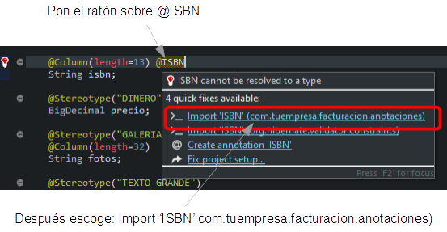

Ahora, puedes probar tu módulo, y verificar que el *ISBN* que introduces se valida correctamente. Enhorabuena, has escrito tu primer *Bean Validation*. No ha sido tan difícil: una anotación, una clase.\
Este *@ISBN* es suficientemente bueno para usarlo en la vida real, sin embargo, vamos a mejorarlo un poco más y así tendremos la posibilidad de experimentar con algunas posibilidades interesantes.

- [**Lección 22: Llamada REST desde una validación**](C:\Users\Soporte\Documents\openxava\openxava-doc\web\docs\rest-service-call-from-validation_es.html)
  ## Llamar a un servicio web REST para validar el ISBN
  Aunque la mayoría de los validadores tienen una lógica simple, puedes crear validadores con una lógica compleja si lo necesitas. Por ejemplo, en el caso de nuestro ISBN, queremos, no sólo verificar el formato correcto, sino también comprobar que existe de verdad un libro con ese ISBN. Una forma de hacer esto es usando servicios web.\
  Como seguramente ya sepas, un servicio web es una funcionalidad que reside en un servidor web y que tú puedes llamar desde tu programa. La forma tradicional de desarrollar servicios web es mediante los estándares WS-\*, como SOAP, UDDI, etc. Aunque, hoy en día, la forma más simple de desarrollar servicios es REST. REST consiste básicamente en usar la ya existente “forma de trabajar” de internet para comunicación entre programas. Llamar a un servicio REST consiste en usar una URL web convencional para obtener un recurso de un servidor web. Este recurso usualmente contiene datos en formato XML, HTML, JSON, etc. En otras palabras, los programas usan internet de la misma manera que lo hacen los usuarios con sus navegadores.\
  Hay bastantes sitio con servicios web SOAP y REST para consultar el ISBN de un libro, vamos a usar [openlibrary.org](https://openlibrary.org/) que proporciona una API REST gratuita para consultar su catálogo de libros. Para probar la API de Open Library abre un navegador y ve a la siguiente URL:

  <https://openlibrary.org/api/books?jscmd=data&format=json&bibkeys=ISBN:9780932633439>

  Donde el último parámetro es el ISBN del libro, a partir del cual obtenemos un JSON con los datos del libro, algo como esto:

  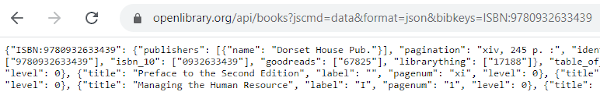

  Un JSON es simplemente data con clave/valor que usa {} y [] para anidar y repetir. Si intentas obtener los datos de un libro inexistente, como en esta URL:

  <https://openlibrary.org/api/books?jscmd=data&format=json&bibkeys=ISBN:9791034369997>

  Obtienes un JSON vacío, como este:

  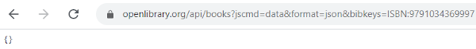

  Es decir, un JSON vacío, simplemente unas llaves vacías, así: {}.

  Para llamar a este servicio web usaremos JAX-RS. JAX-RS es el estándar Java para llamar a servicios web REST. OpenXava incluye soporte para llamar a servicios web usando JAX-RS, por lo que no necesitas añadir ninguna librería adicional.\
  Modifiquemos *ValidadorISBN* para usar este servicio *REST*. Veamos el resultado:

**package** com.tuempresa.facturacion.validadores; 

**import** javax.validation.\*;

**import** javax.ws.rs.client.\*; *// Para usar JAX-RS*

**import** com.tuempresa.facturacion.anotaciones.\*;

**import** org.apache.commons.logging.\*; *// Para usar Log*

**import** org.openxava.util.\*;

**public** **class** **ValidadorISBN**

`    `**implements** **ConstraintValidator**<**ISBN**, **Object**> {

`    `**private** **static** Log log = LogFactory.getLog(ValidadorISBN.class); *// Instancia 'log'*

`    `**private** **static** org.apache.commons.validator.routines.ISBNValidator

`        `validador = 

`            `**new** org.apache.commons.validator.routines.ISBNValidator();

`    `**public** **void** **initialize**(ISBN isbn) {

`    `}

`    `**public** **boolean** **isValid**(Object valor, ConstraintValidatorContext contexto) {

`        `**if** (Is.empty(valor)) **return** **true**;

`        `**if** (!validador.isValid(valor.toString())) **return** **false**;

`        `**return** existeISBN(valor); *// Aquí hacemos la llamada REST*

`    `}

`    `**private** **boolean** **existeISBN**(Object isbn) {

`        `**try** {

`            `*// Aquí usamos JAX-RS para llamar al servicio REST*

`            `String respuesta = ClientBuilder.newClient()

.target("http://openlibrary.org/") *// El sitio*

.path("/api/books") *// La ruta del servicio*

.queryParam("jscmd", "data") *// Los parámetros*

.queryParam("format", "json")

.queryParam("bibkeys", "ISBN:" + isbn) *// El ISBN es un parámetro*

.request()

.get(String.class); *// Una cadena con el JSON*

`            `**return** !respuesta.equals("{}"); *// ¿Está el JSON vacío? Suficiente para nuestro caso*

`        `}

`        `**catch** (Exception ex) {

`            `log.warn("Imposible conectar a openlibrary.org " +

`                `"para validar el ISBN. Validación fallida", ex);

`            `**return** **false**; *// Si hay errores asumimos que la validación falla*

`        `}

`    `}

}

Simplemente abrimos la URL con el ISBN como parámetro de la petición. Si el JSON resultante es un JSON vacío, es decir {}, la búsqueda ha fallado, en caso contrario hemos encontrado el libro. Para nuestro caso, obtener el JSON como una cadena para poder hacer una comparación simple es el camino más corto, sin embargo JAX-RS permite convertir el JSON en un objeto Java de tu propia clase (*Libro* por ejemplo) rellenando las propiedades correspondientes, sólo has de usar *.get(Libro.class)* en lugar de *.get(String.class)* como última línea de la llamada.

Prueba ahora tu aplicación y verás como si introduces un ISBN no existente la validación falla.

- [**Lección 23: Atributos en anotaciones**](C:\Users\Soporte\Documents\openxava\openxava-doc\web\docs\attributes-in-annotations_es.html)
  ## Agregar atributos a su anotación
  Es recomendable crear una nueva anotación *de validación de Bean* si se reutiliza la validación varias veces, generalmente en varios proyectos. Para mejorar la reutilización, se puede parametrizar el código de validación. Por ejemplo, si su proyecto actual busca el ISBN en [openlibrary.org](https://openlibrary.org/) , está bien, pero en otro proyecto, o incluso en otra entidad del mismo, no se desea llamar a esta URL en particular. El código de la anotación debe ser más flexible.\
  Esta flexibilidad se puede lograr mediante atributos. Por ejemplo, podemos añadir un atributo de búsqueda booleano a nuestra anotación *de ISBN* para activar o desactivar la búsqueda en internet para la validación. Para implementar esta funcionalidad, simplemente añada el atributo *de búsqueda* al código de la anotación *de ISBN* , que se encuentra en el paquete de la carpeta *com.yourcompany.invoicing.annotations* .

**public** **@interface** ISBN {

`    `**boolean** **search**() **default** **true**; *// To (de)activate web search on validate*

`    `*// ...*

}

Este nuevo atributo de búsqueda se puede leer desde la clase validadora que puede encontrar en la carpeta *com.yourcompany.invoicing.validators* :

**public** **class** **ISBNValidator** **implements** **ConstraintValidator**<**ISBN**, **Object**> {

`    `*// ...*

`    `**private** **boolean** search; *// Stores the search option*

`    `**public** **void** **initialize**(ISBN isbn) { *// Read the annotation attributes values*

`        `**this**.search = isbn.search();

`    `}

`    `**public** **boolean** **isValid**(Object value, ConstraintValidatorContext context) {

`        `**if** (Is.empty(value)) **return** **true**;

`        `**if** (!validator.isValid(value.toString())) **return** **false**;\
`	`**return** search ? isbnExists(value) : **true**; *// Using 'search'*

`    `}

`    `*// ...*

}

Aquí se ve el uso del método *initialize()* : la anotación de origen puede usarse para inicializar el validador, en este caso simplemente almacenando el valor de *isbn.search()* para evaluarlo en *isValid()* .\
Ahora puede elegir si desea llamar a nuestro servicio REST u omitir la validación del ISBN:

**public** **class** **Product**{\
*//...*\
\
*@ISBN(search=false) // In this case no internet search is done to validate the ISBN*

**private** String isbn;\
\
*//...*\
*}* 

Ahora prueba tu aplicación y notarás que la validación no se realizará.

- [**Lección 24: Refinar el comportamiento predefinido**](C:\Users\Soporte\Documents\openxava\openxava-doc\web\docs\refining-standard-behavior_es.html)
- Toda la lógica de negocio está en esas entidades, y OpenXava genera una aplicación con un comportamiento decente a partir de ellas.\
  No solo de lógica de negocio vive el hombre. Un buen comportamiento también es importante. Seguramente, te habrás encontrado con que o bien tú o bien tu usuario queréis un comportamiento diferente al estándar de OpenXava, al menos para ciertas partes de tu aplicación. Refinar el comportamiento predefinido a veces es necesario si quieres que tu usuario esté cómodo.\
  El comportamiento de la aplicación viene dado por los controladores. Un controlador es una colección de acciones. Una acción contiene el código a ejecutar cuando el usuario pulsa en un vínculo o botón. Puedes definir tus propios controladores y acciones, y asociarlos a tus módulos o entidades, de esta forma refinas la forma en que OpenXava se comporta.\
  En esta lección refinaremos los controladores y acciones estándar para poder personalizar el comportamiento de tu aplicación *facturacion*.
- ## Acciones personalizadas
- Por defecto, un módulo OpenXava te permite manejar tu entidad de una forma bastante buena: es posible añadir, modificar, borrar, buscar, generar informes PDF, exportar a Excel (CSV) e importar datos a las entidades. Estas acciones por defecto están contenidas en el controlador *Typical*. Puedes refinar o extender el comportamiento de tu módulo definiendo tu propio controlador. Esta sección te enseñará como definir tu propio controlador y escribir tus acciones personalizadas.
- ### Controlador Typical
- Por defecto el módulo *Factura* usa las acciones del controlador *Typical*. El controlador *Typical* está definido en *default-controllers.xml* y puedes verlo en la carpeta [xava de github](https://github.com/openxava/openxava/tree/master/openxava/src/main/resources/xava). Una definición de controlador es un fragmento de XML con una lista de acciones. OpenXava aplica por defecto el controlador *Typical* a todos los módulos. Puedes ver su definición:
- <controller name="Typical"> *<!-- 'Typical' hereda sus acciones de los controladores -->*
- `    `<extends controller="Navigation"/> *<!-- 'Navigation', -->*
- `    `<extends controller="CRUD"/> *<!-- 'CRUD' -->*
- `    `<extends controller="Print"/> *<!-- 'Print' -->*
- `    `<extends controller="ImportData"/> *<!-- e 'ImportData' -->*
- </controller>
- Aquí puedes ver como se puede definir un controlador a partir de otros controladores. Este es un uso sencillo de la herencia. En este caso el controlador *Typical* tiene todas las acciones de los controladores *Navigation*, *Print*, *CRUD* e *ImportData*. *Navigation* tiene las acciones para navegar por los registros en modo detalle. *Print* tiene las acciones para imprimir informes PDF y exportar a Excel, *CRUD* tiene las acciones para crear, leer, actualizar y borrar, e *ImportData* tiene la acción que permite cargar un archivo, con formato de tabla (csv, xls, xlsx), para importar registros al módulo. El siguiente código muestra un extracto del controlador *CRUD*:
- <controller name="CRUD">
 
- `    `<action name="new"
- `        `class="org.openxava.actions.NewAction"
- `        `image="new.gif"
- `        `icon="library-plus"
- `        `keystroke="Control N"
- `        `loses-changed-data="true">
- `        `*<!--*
- `        `*name="new": Nombre para referenciar la acción desde otras partes*
- `        `*class="org.openxava.actions.NewAction" : La clase con la lógica de la acción*
- `        `*image="images/new.gif": Imagen a mostrar para esta acción,*
- `            `*en caso "useIconsInsteadOfImages=false" de "xava.properties"*
- `        `*icon="library-plus": Icono a mostrar para esta acción, ésta es por defecto*
- `        `*keystroke="Control N": Teclas que se pueden pulsar para ejecutar la acción*
- `        `*loses-changed-data="true": Si el usuario pulsa en esta acción sin grabar primero*
- `            `*los datos actuales se perderan*
- `        `*-->*
- `        `<set property="restoreModel" value="true"/> *<!-- La propiedad restoreModel de la acción*
- `            `*se pondrá a true antes de ejecutarla -->*
- `    `</action>
 
- `    `<action name="save" mode="detail"
- `        `by-default="if-possible"
- `        `class="org.openxava.actions.SaveAction"
- `        `image="save.gif"
- `        `icon="content-save"
- `        `keystroke="Control S"/>
- `        `*<!--*
- `        `*mode="detail": Esta acción se mostrará solo en modo detalle*
- `        `*by-default=”if-possible”: Esta acción se ejecutará cuando el usuario pulse INTRO*
- `        `*-->*
 
- `    `<action name="delete" mode="detail"
- `        `confirm="true"
- `        `class="org.openxava.actions.DeleteAction"
- `        `image="delete.gif"
- `        `icon="delete"
- `        `available-on-new="false"
- `        `keystroke="Control D"/>
- `        `*<!--*
- `        `*confirm="true" : Pide confirmación al usuario antes de ejecutar la acción*
- `        `*available-on-new="false" : La acción no estará disponible mientras se crea una nueva entidad*
- `        `*-->*
 
- `    `*<!-- Otras acciones... -->*
- </controller>
- Aquí se ve como definir las acciones. Básicamente consiste en vincular un nombre con una clase con la lógica a ejecutar. Además, define un icono y un atajo de teclado. También vemos como se puede configurar la acción usando *<set />*.\
  Las acciones se muestran por defecto en modo lista y detalle, aunque puedes, por medio del atributo *mode*, especificar que sea mostrada solo en modo lista (list) o detalle (detail).
- ### Refinar el controlador para un módulo
- Empezaremos refinando la acción para borrar del módulo *Factura*. Nuestro objetivo es que cuando el usuario pulse en el botón de borrar, la factura no sea borrada de la base de datos, sino que simplemente se marque como borrada. De esta forma, podemos recuperar las facturas borradas si fuese necesario.\
  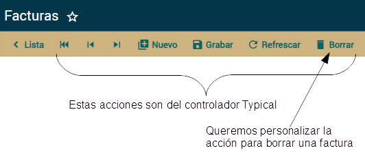\
  La figura anterior muestra las acciones de *Typical*; queremos todas estas acciones en nuestro módulo *Factura*, con la excepción de que vamos a escribir nuestra propia lógica para la acción de borrar.\
  Define tu propio controlador para *Factura* añadiéndolo al archivo *controladores.xml* de la carpeta *src/main/resources/xava* de tu proyecto, dejándolo como sigue:
- **<?xml version = "1.0" encoding = "ISO-8859-1"?>**
 
- **<!DOCTYPE controladores SYSTEM "dtds/controladores.dtd">**
 
- <controladores>
 
- `    `<controlador nombre="Factura"> *<!-- El mismo nombre de la entidad-->*
 
- `        `<hereda-de controlador="Typical"/> *<!-- Hereda todas las acciones de 'Typical' -->*
 
- `        `*<!-- Typical ya tiene una acción 'delete', al usar el mismo nombre la sobrescribimos -->*
- `        `<accion nombre="delete"
- `            `modo="detail" confirmar="true"
- `            `clase="com.tuempresa.facturacion.acciones.EliminarFactura"
- `            `icono="delete"
- `            `disponible-en-nuevo="false"
- `            `atajo-de-teclado="Control D"/>
 
- `    `</controlador>
 
- </controladores>
- Para definir un controlador para tu entidad, has de crear un controlador con el mismo nombre que la entidad. Es decir, si existe un controlador llamado “Factura”, cuando ejecutes el módulo *Factura* éste será el controlador a usar en vez de *Typical*.\
  Extendemos el controlador *Factura* de *Typical*, así todas las acciones de *Typical* están disponible en tu módulo *Factura*. Cualquier acción que definas en tu controlador *Factura* estará disponible como un botón para que el usuario pueda pulsarlo. Aunque en este caso hemos llamado a nuestra acción “delete”, precisamente el nombre de una acción del controlador *Typical*, de esta forma estamos anulando la acción de *Typical*. Es decir, solo una acción *delete* se mostrará al usuario y será la nuestra.
- ### Escribir tu propia acción
- Primero crea un nuevo paquete llamado *com.tuempresa.facturacion.acciones*. Después añádele una clase *EliminarFactura*, con este código:
- **package** com.tuempresa.facturacion.acciones;  *// En el paquete 'acciones'*
 
- **import** org.openxava.actions.\*;
 
- **public** **class** **EliminarFactura**
- `    `**extends** **ViewBaseAction** { *// ViewBaseAction tiene getView(), addMessage(), etc*
 
- `    `**public** **void** **execute**() **throws** Exception { *// La lógica de la acción*
- `        `addMessage( *// Añade un mensaje para mostrar al usuario*
- `            `"¡No te preocupes! Sólo he borrado la pantalla");
- `        `getView().clear(); *// getView() devuelve el objeto xava\_view*
- `            `*// clear() borra los datos en la interfaz de usuario*
- `    `}
- }
- Una acción es una clase simple. Tiene un método *execute()* con la lógica a hacer cuando el usuario pulse en el botón o vínculo correspondiente. Una acción ha de implementar la interfaz *org.openxava.actions.IAction*, aunque normalmente es más práctico extender de *BaseAction*, *ViewBaseAction* o cualquier otra acción base del paquete *org.openxava.actions*.
- *ViewBaseAction* tiene una propiedad *view* que puedes usar desde dentro de *execute()* mediante *getView()*. Este objeto del tipo *org.openxava.view.View* permite manejar la interfaz de usuario, en este caso borramos los datos visualizados usando *getView().clear()*.\
  También usamos *addMessage()*. Todos los mensajes añadidos con *addMessage()* se mostrarán al usuario al final de la ejecución de la acción. Puedes, bien añadir el mensaje a mostrar, o bien un id de una entrada en *src/main/resources/i18n/facturacion-messages\_es.properties*.\
  La siguiente imagen muestra el comportamiento del módulo *Factura* después de añadir la acción de borrar personalizada:\
  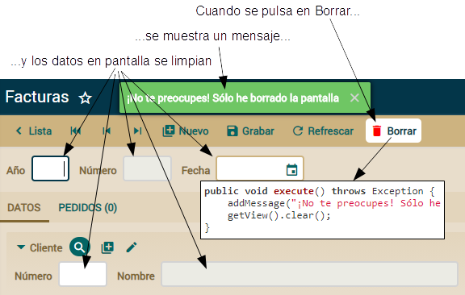\
  Por supuesto, este es un comportamiento tonto. Añadamos el comportamiento real. Para marcar como borrada la factura actual sin borrarla realmente, necesitamos añadir una nueva propiedad a *Factura*. Llamémosla *eliminado*:
- **@Hidden** *// No se mostrará por defecto en las vistas y los tabs*
- **@Column**(columnDefinition="BOOLEAN DEFAULT FALSE") *// Para llenar con falses en lugar de con nulos*
- **boolean** eliminado;
- Como ves, es una propiedad booleana simple y llana. El único detalle es el uso de la anotación *@Hidden*. Indica que cuando una vista o lista tabular por defecto sea generada la propiedad *eliminado* no se mostrará; aunque si la pones explícitamente en *@View(members=)* o *@Tab(properties=)* sí que se mostrará. Usa esta anotación para marcar aquellas propiedades de uso interno del programador pero que no tienen sentido para el usuario final.\
  Usamos *@Column(columnDefinition=)* para llenar la columna con *falses* en lugar de con nulos. Aquí puedes poner la definición SQL de la columna para enviar a la base de datos. Es más sencillo que actualizar la base de datos pero el código es más dependiente de la base de datos.\
  Ya estamos preparados para escribir el código real de la acción:
- **public** **void** **execute**() **throws** Exception {
- `    `Factura factura = XPersistence.getManager().find(
- `        `Factura.class,
- `        `getView().getValue("oid")); *// Leemos el id de la vista*
- `    `factura.setEliminado(**true**); *// Modificamos el estado de la entidad*
- `    `addMessage("object\_deleted", "Factura"); *// El mensaje de confirmación de borrado*
- `    `getView().clear(); *// Borramos la vista*
- }
- El efecto visual es el mismo, se ve un mensaje y la vista se borra, pero en este caso hacemos algo de lógica. Buscamos la entidad *Factura* asociada con la vista actual y entonces cambiamos el valor de su propiedad *eliminado*. No necesitas hacer nada más, porque OpenXava confirma automáticamente la transacción JPA. Es decir, puedes leer cualquier objeto y modificar su estado en una acción, y cuando la acción finalice los cambios se almacenarán en la base de datos.\
  Pero hemos dejado algunos cabos sueltos. El botón de "borrar" sigue en la vista después de haber borrado la entidad, es decir, cuando no hay un objeto seleccionado, además si el usuario lo pulsa la instrucción para buscar fallará y un mensaje un tanto técnico e ininteligible se le mostrará a nuestro desamparado usuario. Podemos refinar este caso no mostrando el botón, tal como cuando pulsamos el botón *Nuevo*. Observa la ligera modificación al método *execute()*:
- **public** **void** **execute**() **throws** Exception {
- `    `*// ...*
- `    `getView().clear();
- `    `getView().setKeyEditable(**true**); *// Crearemos una nueva entidad*
- }
- Con *getView().setKeyEditable(true)* indicamos que creamos una nueva entidad y como nuestra acción *delete* tiene el atributo *disponible-en-nuevo="false"*, entonces, el botón de borrar no se mostrará.\
  Ahora que ya sabes como escribir tus propias acciones personalizadas, es tiempo de aprender como escribir código genérico.
- ## Acciones genéricas
- El código actual de *EliminarFactura* refleja la forma típica de escribir acciones. Es código concreto que accede directamente a entidades concretas para manipularlas.\
  Pero a veces puedes encontrarte alguna lógica en tu acción susceptible de ser usada y reusada por toda tu aplicación, incluso en todas tus aplicaciones. En este caso, puedes utilizar algunas técnicas para crear código más reutilizable y así convertir tus acciones personalizadas en acciones genéricas.\
  Aprendamos estas técnicas para escribir código más genérico en nuestras acciones.
- ### Código genérico con MapFacade
- Imagínate que quieres usar tu *EliminarFactura* también para pedidos. Es más, imagínate que quieres usarla para cualquier entidad de la aplicación con una propiedad *eliminado*. Es decir, quieres una acción para marcar como borrada, en lugar de borrarla de la base de datos, no solo facturas sino cualquier entidad. En este caso, el código actual de tu acción no es suficiente. Necesitas un código más genérico.\
  Puedes conseguir una acción más genérica usando la clase de OpenXava llamada *MapFacade*. *MapFacade* (del paquete *org.openxava.model*) te permite manejar el estado de tus entidades usando mapas, esto es conveniente ya que *View* trabaja con mapas. Además, los mapas son más dinámicos que los objetos y por tanto más apropiados para crear código genérico.\
  Reescribamos nuestra acción para borrar. Primero, renombremos *EliminarFactura* (una acción para borrar objetos de tipo *Factura*) como *EliminarParaFacturacion* (la acción para borrar objetos en la aplicación *facturacion*). Esto implica que tienes que cambiar la entrada para la acción en *controladores.xml*, para cambiar el nombre de la clase. Tal como se muestra a continuación:
- <accion nombre="delete"
- `    `modo="detail" confirmar="true"
- `    `clase="com.tuempresa.facturacion.acciones.EliminarParaFacturacion"
- `    `icono="delete"
- `    `disponible-en-nuevo="false"
- `    `atajo-de-teclado="Control D"/>
- Ahora, renombra tu *EliminarFactura* como *EliminarParaFacturacion* y reescribe su código:
- **package** com.tuempresa.facturacion.acciones;
 
- **import** java.util.\*;
- **import** org.openxava.actions.\*;
- **import** org.openxava.model.\*;
 
- **public** **class** **EliminarParaFacturacion** **extends** **ViewBaseAction** {

- `    `**public** **void** **execute**() **throws** Exception {
- `        `Map<String, Object> valores =
- `            `**new** HashMap<>(); *// Los valores a modificar en la entidad*
- `        `valores.put("eliminado", **true**); *// Asignamos true a la propiedad 'eliminado'*
- `        `MapFacade.setValues( *// Modifica los valores de la entidad indicada*
- `            `getModelName(), *// Un método de ViewBaseAction*
- `            `getView().getKeyValues(), *// La clave de la entidad a modificar*
- `            `valores); *// Los valores a cambiar*
- `        `resetDescriptionsCache(); *// Reinicia los caches para los combos*
- `        `addMessage("object\_deleted", getModelName());
- `        `getView().clear();
- `        `getView().setKeyEditable(**true**);
- `        `getView().setEditable(**false**); *// Dejamos la vista como no editable*
- `    `}
- }
- Esta acción hace lo mismo que la anterior, pero no tiene ninguna referencia a la entidad *Factura*. Por tanto, es genérica, puedes usarla con *Pedido*, *Autor* o cualquier otra entidad siempre y cuando tenga una propiedad *eliminado*. El truco está en *MapFacade* la cual permite modificar una entidad a partir de mapas. Puedes obtener esos mapas directamente de la vista (usando *getView().getKeyValues()* por ejemplo) o puedes crearlos de una manera genérica, como en el caso del mapa *valores*.\
  Adicionalmente puedes ver dos pequeñas mejoras sobre la versión antigua. Primero, llamamos a *resetDescriptionsCache()*, un método de *BaseAction*. Este método borra el caché usado para los combos. Cuando modificas una entidad, si quieres que los combos reflejen los cambios en la sesión actual has de llamar a este método. Segundo, llamamos a *getView().setEditable(false)*. Esto inhabilita los controles de la vista, para impedir que el usuario rellene datos en la vista. Para crear una nueva entidad el usuario tiene que pulsar el botón *Nuevo*.\
  Ahora tu acción está lista para ser usada por cualquier otra entidad. Podríamos copiar y pegar el controlador *Factura* como *Pedido* en *controladores.xml*. De esta forma, nuestra lógica genérica para borrar se usaría para *Pedido*. ¡Espera un momento! ¿He dicho “copiar y pegar”? No queremos arder en el fuego eterno del infierno, ¿verdad? Así que usaremos una forma más automática de insuflar nuestra nueva acción a todos lo módulos. Aprendámoslo en la siguiente sección.
- ### Cambiar el controlador por defecto para todos los módulos
- Si usas *EliminarParaFacturacion* solo para *Factura* entonces definirla en el controlador *Factura* de *controladores.xml* es una buena táctica. Pero, recuerda que hemos mejorado esta acción precisamente para hacerla reutilizable, por tanto reutilicémosla. Vamos a asignar un controlador a todos los módulos de un solo golpe.\
  El primer paso es cambiar el nombre del controlador de *Factura* a *Facturacion*:
- <controlador nombre="Facturacion">
 
- `    `<hereda-de controlador="Typical"/>
 
- `    `<accion nombre="delete" modo="detail" confirmar="true"
- `        `clase="com.tuempresa.facturacion.acciones.EliminarParaFacturacion"
- `        `icono="delete"
- `        `disponible-en-nuevo="false"
- `        `atajo-de-teclado="Control D"/>
 
- </controlador>
- Como ya sabes, cuando usas el nombre de una entidad, como *Factura*, como nombre de controlador, ese controlador será usado por defecto en el módulo de esa entidad. Por lo tanto, si cambiamos el nombre del controlador, este controlador no se usará para la entidad. De hecho el controlador *Facturacion* no es usado por ningún módulo, porque no hay ninguna entidad llamada "Facturacion".\
  Queremos que el controlador *Facturacion* sea el controlador usado por defecto por todos los módulos de la aplicación. Para hacer esto hemos de modificar el archivo *aplicacion.xml* que esta en la carpeta *src/main/resources/xava* de tu aplicación. Dejándolo así:
- **<?xml version = "1.0" encoding = "ISO-8859-1"?>**
 
- **<!DOCTYPE aplicacion SYSTEM "dtds/aplicacion.dtd">**
 
- <aplicacion nombre="facturacion">
 
- `    `*<!--*
- `    `*Se asume un módulo por defecto para cada entidad con el*
- `    `*controlador de <modulo-defecto/>*
- `    `*-->*
- `    `<modulo-defecto>
- `        `<controlador nombre="Facturacion" />
- `    `</modulo-defecto>
 
- </aplicacion>
- De esta forma tan simple todos los módulos de tu aplicación ahora usarán *Facturacion* en lugar de *Typical* como controlador por defecto. Trata de ejecutar tu módulo *Factura* y verás como la acción se ejecuta al borrar un elemento.\
  Puedes probar el módulo *Pedido* también, pero no funcionará porque no tiene la propiedad *eliminado*. Podríamos añadir la propiedad *eliminado* a *Pedido* y funcionaría con nuestro nuevo controlador, pero en vez de “copiar y pegar” la propiedad *eliminado* en todas nuestras entidades, vamos a usar una técnica mejor. Veámoslo en la siguiente sección.
- ### Volvamos un momento al modelo
- Tu tarea ahora sería añadir la propiedad *eliminado* a todas las entidades para que la *EliminarParaFacturacion* funcione. Esta es una buena ocasión para usar herencia y así poner el código común en el mismo sitio, en lugar de usar el infame “copiar y pegar”.\
  Primero quita la propiedad *eliminado* de *Factura*:
- **public** **class** **Factura** **extends** **DocumentoComercial** {
 
- `    `*//@Hidden // No se mostrará por defecto en las vistas y los tabs*
- `    `*//@Column(columnDefinition="BOOLEAN DEFAULT FALSE")*
- `    `*//boolean eliminado;*
 
- `    `*// El resto del código...*
- }
- Y ahora crea una nueva superclase mapeada llamada *Eliminable* en el paquete *com.tuempresa.facturacion.modelo*:
- **package** com.tuempresa.facturacion.modelo;
 
- **import** javax.persistence.\*;
- **import** org.openxava.annotations.\*;
- **import** lombok.\*;
 
- **@MappedSuperclass** **@Getter** **@Setter**
- **public** **class** **Eliminable** **extends** **Identificable** {
 
- `    `**@Hidden**
- `    `**@Column**(columnDefinition="BOOLEAN DEFAULT FALSE")
- `    `**boolean** eliminado;
 
- }
- *Eliminable* es una superclase mapeada. Recuerda, una superclase mapeada no es una entidad, es una clase con propiedades, métodos y anotaciones de mapeo para ser usada como superclase para entidades. *Eliminable* extiende de *Identificable*, por tanto cualquier entidad que extienda *Eliminable* tendrá las propiedades *oid* y *eliminado*.\
  Ahora puedes convertir cualquiera de tus entidades actuales en *Eliminable*, solo has de cambiar *Identificable* por *Eliminable* como superclase. Hagámoslo con *DocumentoComercial*:
- *// abstract public class DocumentoComercial extends Identificable {* 
- **abstract** **public** **class** **DocumentoComercial** **extends** **Eliminable** {
 
- `    `*// El resto del código...*
 
- }
- Dado que *Factura* y *Pedido* son *DocumentoComercial*, ahora puedes usar tu controlador *Facturacion* con la *EliminarParaFaturacion* contra ellos.\
  Nos queda un sutil detalle. La entidad *Pedido* tiene un método *@PreRemove* para hacer una validación al borrar. Esta validación puede impedir el borrado. Podemos mantener esta validación para nuestro borrado personalizado simplemente sobrescribiendo el método *setEliminado()* de *Pedido*:
- **public** **class** **Pedido** **extends** **DocumentoComercial** {
- `    `*// ...*
- `    `**@PreRemove**
- `    `**private** **void** **validarPreBorrar**() { *// Ahora este método no se ejecuta*
- `        `**if** (factura != **null**) { *// automáticamente ya que el borrado real no se produce*
- `            `**throw** **new** javax.validation.ValidationException(
- `                `XavaResources.getString("no\_puede\_borrar\_pedido\_con\_factura"));
- `        `}
- `    `}
 
- `    `**public** **void** **setEliminado**(**boolean** eliminado) {
- `        `**if** (eliminado) validarPreBorrar(); *// Llamamos a la validación explícitamente*
- `        `**super**.setEliminado(eliminado);
- `    `}
- }
- Con este cambio la validación funciona igual que en el caso de un borrado de verdad, así preservamos el comportamiento original intacto.
- ### Metadatos para un código más genérico
- Con tu actual código de *Factura* y *Pedido* el funcionamiento es bueno. Aunque si tratas de borrar una entidad de cualquier otro módulo, recibirás un feo mensaje de error. La figura siguiente muestra lo que ocurre cuando intentas borrar un *Cliente*.\
  \
  Sí, si tu entidad no tiene una propiedad *eliminado*, la acción de borrar falla miserablemente. Es verdad que gracias a la clase *Eliminable* puedes añadir la propiedad *eliminado* a todas tus entidades fácilmente, pero puede ser que quieras tener entidades que puedan marcarse como borradas (*Eliminable*) y entidades que sean borradas de verdad de la base de datos. Queremos que la acción funcione bien en todos los casos.\
  OpenXava almacena metadatos para todas tus entidades y puedes acceder a estos metadatos desde tu código. Esto te permite, por ejemplo, averiguar si la entidad tiene una propiedad *eliminado*.\
  El siguiente código muestra una modificación en la acción para preguntar si la entidad tiene una propiedad *eliminado*, si no el proceso de borrado no se realiza:
- **public** **void** **execute**() **throws** Exception {
- `    `**if** (!getView().getMetaModel() *// Metadatos de la entidad actual*
-         .containsMetaProperty("eliminado")) *// ¿Tiene una propiedad 'eliminado'?*
- `    `{
- `        `addMessage( *// De momento, mostramos un mensaje si la propiedad 'eliminado' no está*
- `            `"No eliminado, ésta no tiene propiedad eliminado");
- `        `**return**;
- `    `}
- `    `*// El resto del código...*
- }
- La clave aquí es *getView().getMetaModel()* que devuelve un objeto *MetaModel* del paquete *org.openxava.model.meta*. Este objeto contiene metadatos sobre la entidad actualmente visualizada en la vista. Puedes preguntar por propiedades, referencias, colecciones, métodos y otra metainformación sobre la entidad. Consulta la [API de *MetaModel*](C:\Users\Soporte\Documents\openxava\openxava-doc\web\apidocs\org\openxava\model\meta\MetaModel.html) para aprender más. En este caso preguntamos si la propiedad *eliminado* existe.\
  De momento solo mostramos un mensaje. Mejorémoslo para borrar de verdad la entidad.
- ### Llamar a otra acción desde una acción
- Queremos que cuando la entidad no tenga una propiedad *eliminado* sea borrada de la base de datos de la manera habitual. Nuestra primera opción es escribir nosotros mismos la lógica de borrado, realmente no es una tarea complicada. Sin embargo, es mucho mejor usar la lógica estándar de borrado de OpenXava, así no necesitamos escribir ninguna lógica de borrado y usamos un código más refinado y probado.\
  Para hacer esto OpenXava permite llamar a una acción desde dentro de una acción, simplemente llama a *executeAction()* indicando el nombre calificado de la acción, es decir, el nombre del controlador y el nombre de la acción.  En nuestro caso para llamar a la acción estándar de OpenXava para borrar usaríamos *executeAction("CRUD.delete")*. El siguiente código muestra *EliminarParaFacturacion* modificada para llamar a la acción estándar de OpenXava para borrar.
- **package** com.tuempresa.facturacion.acciones;
 
- **import** java.util.\*;
- **import** org.openxava.actions.\*;
- **import** org.openxava.model.\*;
 
- **public** **class** **EliminarParaFacturacion** **extends** **ViewBaseAction** {
 
- `    `**public** **void** **execute**() **throws** Exception {
- `        `**if** (!getView().getMetaModel().containsMetaProperty("eliminado")) {
- `            `executeAction("CRUD.delete"); *// LLamamos a la acción estándar*
- `            `**return**;                       *//   de OpenXava para borrar*
- `        `}

- `        `*// Cuando "eliminado" existe usamos nuestra propia lógica de borrado*
- `        `Map<String, Object> valores = **new** HashMap<>();
- `        `valores.put("eliminado", **true**);
- `        `MapFacade.setValues(getModelName(), getView().getKeyValues(), valores);
- `        `resetDescriptionsCache();
- `        `addMessage("object\_deleted", getModelName());
- `        `getView().clear();
- `        `getView().setKeyEditable(**true**);
- `        `getView().setEditable(**false**);
- `    `}
- }
- Simplemente llamamos a *executeAction(“CRUD.delete”)* si queremos que la acción por defecto para borrar de OpenXava se ejecute. Así, escribimos nuestra propia lógica de borrado (en este caso marcar una propiedad con *true*) para algunos casos y “dejamos pasar” la lógica estándar para los demás.\
  Ahora puedes usar tu *EliminarParaFacturacion* contra cualquier entidad. Si la entidad tiene una propiedad *eliminado* se marcará como borrada, en caso contrario se borrará físicamente de la base de datos.\
  Este ejemplo te muestra como usar *executeAction()* para refinar la lógica estándar de OpenXava. Otra forma de hacerlo es mediante la herencia. Veamos cómo en la siguiente sección.
- ### Refinar la acción de búsqueda por defecto
- *EliminarParaFacturacion* ahora funciona bastante bien, aunque no tiene demasiada utilidad. Es inútil marcar como borrados los objetos, si el resto de la aplicación no es consciente de ello. Es decir, hemos de modificar otras partes de la aplicación para que traten los objetos “marcados como borrados” como si no existieran.\
  El lugar más obvio para empezar es la acción de búsqueda. Si borras una factura y después tratas de buscarla, no deberías encontrarla. La siguiente figura muestra como funciona la búsqueda en OpenXava.\
  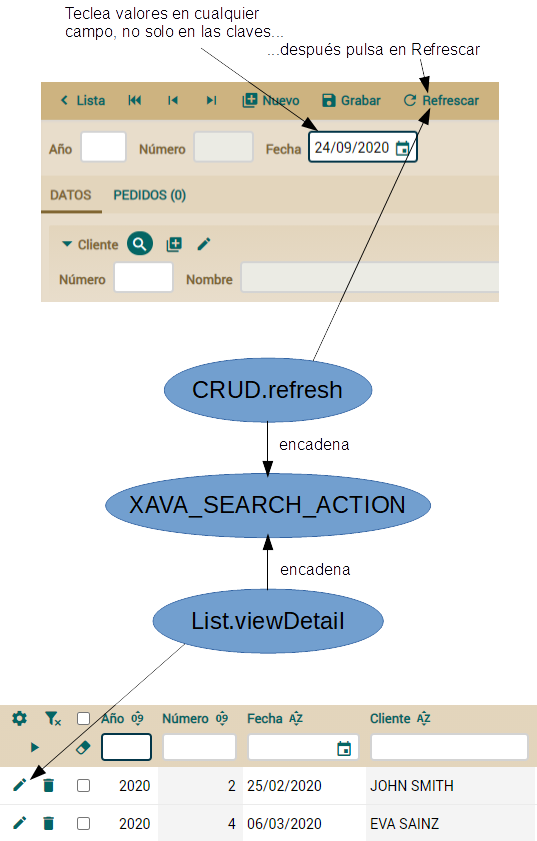\
  La primera cosa que puedes observar en la figura anterior es que buscar en modo detalle es más flexible de lo que parece. El usuario puede introducir cualquier valor en cualquier campo, o combinación de campos, y pulsar en el botón de refrescar. Entonces el primer objeto cuyos valores coinciden es cargado en la vista.\
  Puedes pensar: Bueno, puedo refinar la acción *CRUD.refresh* de la misma forma que he refinado *CRUD.delete*. Por supuesto, puedes hacerlo así. Y funcionaría; cuando el usuario pulsara en la acción del modo detalle tu código se ejecutaría. Aunque, aquí hay un detalle un tanto sutil. La lógica de buscar no se llama sólo desde el modo detalle, sino también desde otros puntos del módulo OpenXava. Por ejemplo, cuando el usuario escoge un detalle, la acción *List.viewDetail* coge la clave de la fila, la pone en la vista de detalle y después ejecuta la acción de buscar.\
  Para hacerlo bien, hemos de poner la lógica para buscar en un módulo, en la misma acción, y todas las acciones que necesiten buscar encadenarán con esta acción. Tal como muestra la anterior figura.\
  Esto queda más claro si ves el código de la acción estándar *CRUD.refresh*, que es *org.openxava.actions.SearchAction* cuyo código se muestra a continuación:
- **public** **class** **SearchAction** **extends** **BaseAction**
- `    `**implements** **IChainAction** { *// Encadena con otra acción*
 
- `    `**public** **void** **execute**() **throws** Exception { *// No hace nada*
- `    `}
 
- `    `**public** String **getNextAction**() **throws** Exception { *// De IChainAction*
- `        `**return** getEnvironment() *// Para acceder a las variables de entorno*
-             .getValue("XAVA\_SEARCH\_ACTION");
- `    `}
- }
- Como ves, la acción estándar para buscar en modo detalle no hace nada, simplemente redirige a otra acción. Esta otra acción se define en una variable de entorno llamada *XAVA\_SEARCH\_ACTION*, que lee usando *getEnvironment()*. Por la tanto, si quieres refinar la lógica de búsqueda de OpenXava la mejor manera es definiendo tu acción como valor para *XAVA\_SEARCH\_ACTION*. Hagámoslo pues de esta manera.\
  Para dar valor a la variable de entorno edita el archivo *controladores.xml* en la carpeta *src/main/resources/xava* de tu proyecto y añade al principio la línea *<var-entorno />* como ves a continuación:
- ...
- <controladores>
- `    `*<!-- Para definir un valor global para una variable de entorno -->*
- `    `<var-entorno
- `        `nombre="XAVA\_SEARCH\_ACTION"
- `        `valor="Facturacion.buscarExcluyendoEliminados" />
 
- `    `<controlador nombre="Facturacion">
- ...
- De esta forma el valor para la variable de entorno *XAVA\_SEARCH\_ACTION* en cualquier módulo será “Facturacion.buscarExcluyendoEliminados”, por lo tanto la lógica de búsqueda para todos los módulos estará en esta acción.\
  El siguiente paso lógico es definir esta acción en el controlador "Facturacion" del mismo *controladores.xml*:
- <controlador nombre="Facturacion">
-     ...
- `    `<accion nombre="buscarExcluyendoEliminados"
- `        `oculta="true"
- `        `clase="com.tuempresa.facturacion.acciones.BuscarExcluyendoEliminados" />
- `        `*<!-- oculta="true" : Así la acción no se mostrará en la barra de botones -->*
- </controlador>
- Y ahora es el momento para escribir la clase de implementación. En este caso solo queremos refinar la lógica de búsqueda, es decir, la búsqueda se ha de hacer de la forma convencional, con la excepción de las entidades con una propiedad *eliminado* cuyo valor sea *true*. Para hacer este refinamiento vamos a usar herencia. El siguiente código muestra la acción:
- **package** com.tuempresa.facturacion.acciones;
 
- **import** java.util.\*;
- **import** javax.ejb.\*;
- **import** org.openxava.actions.\*;
 
- **public** **class** **BuscarExcluyendoEliminados**
- `    `**extends** **SearchByViewKeyAction** { *// La acción estándar de OpenXava para buscar*
 
- `    `**private** **boolean** **esEliminable**() { *// Pregunta si la entidad tiene una propiedad 'eliminado'*
- `        `**return** getView().getMetaModel()
-             .containsMetaProperty("eliminado");
- `    `}
 
- `    `**protected** Map **getValuesFromView**() *// Coge los valores visualizados desde la vista*
- `        `**throws** Exception *// Estos valores se usan como clave al buscar*
- `    `{
- `        `**if** (!esEliminable()) { *// Si no es 'eliminable' usamos la lógica estándar*
- `            `**return** **super**.getValuesFromView();
- `        `}
- `        `Map<String, Object> valores = **super**.getValuesFromView();
- `        `valores.put("eliminado", **false**) ; *// Llenamos la propiedad 'eliminado' con false*
- `        `**return** valores;
- `    `}
 
- `    `**protected** Map **getMemberNames**() *// Los miembros a leer de la entidad*
- `        `**throws** Exception
- `    `{
- `        `**if** (!esEliminable()) { *// Si no es 'eliminable' ejecutamos la lógica estándar*
- `            `**return** **super**.getMemberNames();
- `        `}
- `        `Map<String, Object> miembros = **super**.getMemberNames();
- `        `miembros.put("eliminado", **null**); *// Queremos obtener la propiedad 'eliminado'*
- `        `**return** miembros; *// aunque no esté en la vista*
- `    `}
 
- `    `**protected** **void** **setValuesToView**(Map valores) *// Asigna los valores desde*
- `        `**throws** Exception *// la entidad a la vista*
- `    `{
- `        `**if** (esEliminable() && *// Si tiene una propiedad 'eliminado' y*
- `            `(Boolean) valores.get("eliminado")) { *// vale true*
- `            `**throw** **new** ObjectNotFoundException(); *// lanzamos la misma excepción que*
- `                `*// OpenXava lanza cuando el objeto no se encuentra*
- `        `}
- `        `**else** {
- `            `**super**.setValuesToView(valores); *// En caso contrario usamos la lógica estándar*
- `        `}
- `    `}
- }
- La lógica estándar para buscar está en la clase *SearchByViewKeyAction*. Básicamente, la lógica de esta clase consiste en coger los valores de la vista, si la propiedad *id* está presente buscará por id, en caso contrario coge todos los valores en la vista para usar en la condición de búsqueda, devolviendo el primer objeto que coincida con la condición. Queremos usar este mismo algoritmo cambiando solo algunos detalles sobre la propiedad *eliminado*. Por tanto, en vez de sobrescribir el método *execute()*, que contiene la lógica de búsqueda, sobrescribimos tres métodos protegidos, que son llamados desde *execute()* y contienen algunos puntos susceptibles de ser refinados.\
  Después de estos cambios prueba tu aplicación, y verás como cuando tratas de buscar una factura o un pedido, si están borrados no se muestran. Incluso si escoges una factura o pedido borrado desde el modo lista se producirá un error y no verás los datos en modo detalle.\
  Has visto como al definir una variable de entorno *XAVA\_SEARCH\_ACTION* en *controladores.xml* estableces la lógica de búsqueda de una manera global, es decir, para todos los módulos a la vez. Si lo que quieres es definir una acción de búsqueda para un módulo en particular, simplemente define la variable de entorno en la definición del módulo en *aplicacion.xml*, tal como mostramos a continuación:
- <modulo nombre="Producto">
- `    `*<!--Para dar un valor local a la variable de entorno para este módulo -->*
- `    `<var-entorno
- `        `nombre="XAVA\_SEARCH\_ACTION"
- `        `valor="Producto.buscarPorNumero"/>
- `    `<modelo nombre="Producto"/>
- `    `<controlador nombre="Producto"/>
- `    `<controlador nombre="Facturacion"/>
- </modulo>
- De esta forma para el módulo *Producto* la variable de entorno *XAVA\_SEARCH\_ACTION* valdrá *“Producto.buscarPorNumero”*. Es decir, las variables de entorno son locales a los módulos. Aunque definas un valor por defecto en *controladores.xml*, siempre tienes la opción de sobrescribirlo para un módulo concreto. La variables de entorno son una forma práctica de configurar tu aplicación declarativamente.\
  No queremos una forma especial de búsqueda para *Producto*, por tanto no añadas esta definición de módulo a tu *aplicacion.xml*. Este código solo era para ilustrar el uso de *<var-entorno />* en los módulos.
- ## Modo lista
- Ya casi tenemos el trabajo hecho. Cuando el usuario borra una entidad con una propiedad *eliminado* la entidad se marca como borrada en vez de ser borrada físicamente de la base de datos. Y si el usuario trata de buscar una entidad “marcada como borrada” no puede verla en modo detalle. Aunque, el usuario todavía puede ver las entidades “marcadas como borradas” en modo lista, y lo que es peor si borra las entidades desde modo lista, éstas son efectivamente borradas de la base de datos. Atemos estos cabos sueltos.
- ### Filtrar datos tabulares
- Solo las entidades con su propiedad *eliminado* igual a *false* tienen que ser mostradas en modo lista. Esto es muy fácil de conseguir usando la anotación *@Tab*. Esta anotación te permite definir la forma en que los datos tabulares (los datos mostrados en modo lista) son visualizados y te permite además definir una condición. Por tanto, añadir esta anotación a las entidades que tengan una propiedad *eliminado* es suficiente para conseguir nuestro objetivo, tal como se muestra a continuación:
- **@Tab**(baseCondition = "${eliminado} = false")
- **public** **class** **Factura** **extends** **DocumentoComercial** { ... }
 
- **@Tab**(baseCondition = "${eliminado} = false")
- **public** **class** **Pedido** **extends** **DocumentoComercial** { ... }
- Y de esta forma tan sencilla el modo lista no mostrará las entidades “marcadas como borradas”.
- ### Acciones de lista
- El único detalle que nos queda es el borrar las entidades desde modo lista, éstas han de marcarse como borradas si procede. Vamos a refinar las acciones estándares *CRUD.deleteSelected* y *CRUD.deleteRow* de la misma manera que hemos hecho con *CRUD.delete*.\
  Primero, sobrescribimos la acciones *deleteSelected* y *deleteRow* para nuestra aplicación. Añade la siguiente definición de acción a tu controlador *Facturacion* definido en *controladores.xml*:
- <controlador nombre="Facturacion">
- `    `<hereda-de controlador="Typical"/>
 
- `    `*<!-- ... -->*
 
- `    `<accion nombre="deleteSelected" modo="list" confirmar="true"
- `        `procesar-elementos-seleccionados="true"
- `        `icono="delete"			 
- `        `clase="com.tuempresa.facturacion.acciones.EliminarSeleccionadoParaFacturacion"
- `        `atajo-de-teclado="Control D"/>				
	
- `    `<accion nombre="deleteRow" modo="NONE" confirmar="true"
- `        `clase="com.tuempresa.facturacion.acciones.EliminarSeleccionadoParaFacturacion"
- `        `icono="delete"
- `        `en-cada-fila="true"/>
 
- </controlador>
- La acciones estándar para borrar entidades desde modo lista son *deleteSelected* (para borrar las filas seleccionadas) y *deleteRow* (la acción que aparece en cada fila). Estas acciones están definidas en el controlador *CRUD*. *Typical* extiende de *CRUD* y *Facturacion* extiende *Typical*; así que el controlador *Facturacion* incluye por defecto estas acciones. Dado que hemos definido unas acciones con los mismos nombres, nuestras acciones sobrescriben las estándares. Es decir, de ahora en adelante la lógica para borrar las filas seleccionadas en modo lista está en la clase *EliminarSeleccionadoParaFacturacion*. Fíjate como la lógica para ambas acciones están en una única clase Java. El código es el siguiente:
- **package** com.tuempresa.facturacion.acciones;
 
- **import** org.openxava.actions.\*;
- **import** org.openxava.model.meta.\*;
 
- **public** **class** **EliminarSeleccionadoParaFacturacion**
- `    `**extends** **TabBaseAction** // **Para** **trabajar** **con** **datos** **tabulares** (**lista**) **por** **medio** **de** **getTab**()
- `    `**implements** **IChainActionWithArgv** { *// Encadena con otra acción, indicada con getNextAction()*
 
- `    `**private** String nextAction = **null**; *// Para almacenar la siguiente acción a ejecutar*
 
- `    `**public** **void** **execute**() **throws** Exception {
- `        `**if** (!getMetaModel().containsMetaProperty("eliminado")) {
- `            `nextAction="CRUD.deleteSelected"; *// 'CRUD.deleteSelected' se ejecutará*
- `                `*// cuando esta acción finalice*
- `            `**return**;
- `        `}
- `        `marcarEntidadesSeleccionadasComoEliminadas(); *// La lógica para marcar las*
- `            `*// filas seleccionadas como objetos borrados*
- `    `}
 
- `    `**private** MetaModel **getMetaModel**() {
- `        `**return** MetaModel.get(getTab().getModelName());
- `    `}
 
- `    `**public** String **getNextAction**() *// Obligatorio por causa de IChainAction*
- `        `**throws** Exception
- `    `{
- `        `**return** nextAction; *// Si es nulo no se encadena con ninguna acción*
- `    `}
 
- `    `**public** String **getNextActionArgv**() **throws** Exception {
- `        `**return** "row=" + getRow(); *// Argumento a enviar a la la acción encadenada*
- `    `}
 
- `    `**private** **void** **marcarEntidadesSeleccionadasComoEliminadas**() **throws** Exception {
- `        `*// ...*
- `    `}
- }
- Puedes ver como esta acción es bastante parecida a *EliminarParaFacturacion*. Si las entidades no tienen la propiedad *eliminado* encadena con la acción estándar, en caso contrario ejecuta su propia lógica para borrar las entidades. Aunque en este caso usamos *IChainActionWithArgv* en lugar del más sencillo *executeAction()* porque necesitamos enviar un argumento a la acción encadenada. Generalmente las acciones para modo lista extienden de *TabBaseAction*, así puedes usar *getTab()* para obtener el objeto *Tab* asociados a la lista. Un *Tab* (de *org.openxava.tab*) te permite manipular los datos tabulares. Por ejemplo en el método *getMetaModel()* preguntamos al *Tab* el nombre del modelo para obtener el *MetaModel* correspondiente.\
  Si la entidad tiene una propiedad *eliminado* entonces se ejecuta nuestra propia lógica de borrado. Esta lógica está en el método *marcarEntidadesSeleccionadasComoEliminadas()* que puedes ver a continuación:
- **private** **void** **marcarEntidadesSeleccionadasComoEliminadas**() **throws** Exception {
- `    `Map<String, Object> valores = **new** HashMap<>(); *// Valores a asignar a cada entidad para marcarla*
- `    `valores.put("eliminado", **true**); *// Pone 'eliminado' a true*
- `    `Map<String, Object>[] clavesSeleccionadas = getSelectedKeys(); *// Obtenemos las filas seleccionadas*
- `    `**if** (clavesSeleccionadas != **null**) {
- `        `**for** (**int** i = 0; i < clavesSeleccionadas.length; i++) { *// Iteramos sobre las filas seleccionadas*
- `            `Map<String, Object> clave = clavesSeleccionadas[i]; *// Obteniendo la clave de cada entidad*
- `            `**try** {
- `                `MapFacade.setValues( *// Modificamos cada entidad*
- `                    `getTab().getModelName(),
- `                    `clave,
- `                    `valores);
- `            `}
- `            `**catch** (javax.validation.ValidationException ex) { *// Si se produce una ValidationException..*
- `                `addError("no\_delete\_row", i, clave);
- `                `addError("remove\_error", getTab().getModelName(), ex.getMessage()); *// ...mostramos el mensaje*
- `            `}
- `            `**catch** (Exception ex) { *// Si se lanza cualquier otra excepción, se añade*
- `                `addError("no\_delete\_row", i, clave); *// un mensaje genérico*
- `            `}
- `        `}
- `    `}
- `    `getTab().deselectAll(); *// Después de borrar deseleccionamos la filas*
- `    `resetDescriptionsCache(); *// Y reiniciamos el caché de los combos para este usuario*
- }
- Como ves la lógica es un simple bucle sobre las claves de las filas seleccionadas, y en cada iteración ponemos a *true* la propiedad *eliminado* usando el método *MapFacade.setValues()*. Atrapamos las excepciones dentro de la iteración del bucle, así si hay algún problema borrando la entidad, esto no afecta al borrado de las demás entidades. Hemos hecho un pequeño refinamiento para el caso de *ValidationException*, añadiendo el mensaje de validación (*ex.getMessage()*) a los errores a mostrar al usuario.\
  Al final deseleccionamos todas las filas mediante *getTab().deselectAll()*, porque estamos borrando filas, por tanto si no eliminamos la selección, esta se habría recorrido después de la ejecución de la acción.\
  Hemos llamado a *resetDescriptionsCache()* para actualizar las entidades borradas en todos los combos de la actual sesión de usuario. Los combos, es decir las referencias marcadas con *@DescriptionsList*, usan el *@Tab* de la entidad referenciada para filtrar los datos. Es decir, si tuvieras un combo de facturas o pedidos con la condición *“deleted = false”* en el *@Tab*, en este caso el contenido del combo cambiaría.\
  Ahora ya tienes refinada del todo la forma en que tu aplicación borra las entidades. Aunque aún nos quedan cosas interesantes por hacer.
- ## Reutilizar el código de las acciones
- Ahora tu aplicación marca como borradas las facturas y pedidos en vez de borrarlos. La ventaja de este enfoque es que el usuario puede restaurar en cualquier momento una factura o pedido borrado por error. Para que esta característica sea útil de verdad has de proporcionar al usuario una herramienta para restaurar las entidades borradas. Vamos a crear un módulo papelera para *Factura* y otro para *Pedido* para traer los documentos borrados de vuelta a la vida.
- ### Propiedades para crear acciones reutilizables
- La papelera que queremos es como la que puedes ver en la siguiente figura. Es una lista de facturas o pedidos donde el usuario pueda seleccionar varias y pulsar en el botón *Restaurar*, o simplemente pulsar en el vínculo *Restaurar* en la fila del documento que quiera restaurar:\
  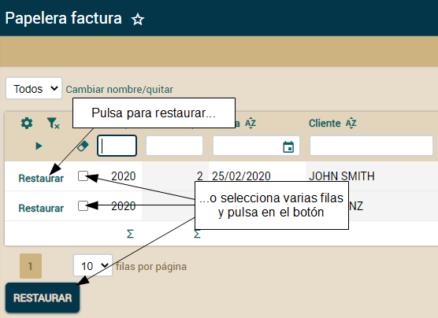\
  La lógica de esta acción de restaurar es simplemente poner la propiedad *eliminado* de las entidades seleccionadas a *false*. Es decir, es exactamente la misma lógica que usamos para borrar, pero poniendo *false* en vez de *true*. Dado que nuestra conciencia no nos permite copiar y pegar, vamos a reutilizar nuestro código actual. La forma de reutilizar es añadiendo una propiedad *restaurar* a la acción *EliminarSeleccionadoParaFacturacion*, para poder restaurar las entidades borradas.\
  El siguiente código muestra lo necesario para añadir una propiedad *restaurar* a la acción:
- **public** **class** **EliminarSeleccionadoParaFacturacion** ... {
- `    `*//...*
- `    `**@Getter** **@Setter**
- `    `**boolean** restaurar; *// Una nueva propiedad*
  
- `    `**private** **void** **marcarEntidadesSeleccionadasComoEliminadas**() **throws** Exception {
- `        `Map<String, Object> valores = **new** HashMap<String, Object>();
- `        `*// valores.put("eliminado", true); // Pone 'eliminado' a true // En lugar de un true fijo, usamos*
- `        `valores.put("eliminado", !isRestaurar()); *// el valor de la propiedad 'restaurar';*
- `        `*// ...*
- }
- Como puedes ver solo hemos añadido una propiedad *restaurar* y el uso de su complemento como nuevo valor para la propiedad *eliminado* en la entidad. Es decir, si *restaurar* es *false*, el caso por defecto, un *true* se grabará en *eliminado*, así tu acción de borrar borrará. Pero si *restaurar* es *true* la acción guardará *false* en la propiedad *eliminado* de la entidad, y por tanto la factura, pedido o cualquier otra entidad estará de nuevo disponible en la aplicación.\
  Para usar esta acción como una acción para restaurar has de definirla en *controladores.xml*, tal como muestra el siguiente código:
- <controlador nombre="Papelera">
- `    `<accion nombre="restaurar" modo="list"
- `        `clase="com.tuempresa.facturacion.acciones.EliminarSeleccionadoParaFacturacion">
- `        `<poner propiedad="restaurar" valor="true"/> <!-- Pone la propiedad restaurar a **true** -->
- `            `<!-- antes de llamar al método **execute**() de la acción -->
- `    `</accion>
- </controlador>
- A partir de ahora puedes referenciar a la acción *Papelera.restaurar* cuando necesites una acción para restaurar. Estás reutilizando el mismo código para borrar y restaurar, gracias al elemento *<poner />* de *<accion />* que te permite configurar las propiedades de la acción.\
  Usemos esta nueva acción de restaurar en los nuevos módulos papelera.
- ### Módulos personalizados
- Como ya sabes, OpenXava genera un módulo por defecto para cada entidad de tu aplicación. Aunque, siempre tienes la opción de definir los módulos a mano, bien para refinar el comportamiento del módulo para cierta entidad, o bien para definir una funcionalidad completamente nueva sobre esa entidad. En este caso vamos a crear dos nuevos módulos, *PapeleraFactura* y *PapeleraPedido*, para restaurar los documentos borrados. Usaremos el controlador *Papelera* en ellos. El siguiente código muestra la definición de módulos en el archivo *aplicacion.xml*:
- <aplicacion nombre="facturacion">
 
- `    `<modulo-defecto>
- `        `<controlador nombre="Facturacion"/>
- `    `</modulo-defecto>
 
- `    `<modulo nombre="PapeleraFactura">
- `        `<var-entorno nombre="XAVA\_LIST\_ACTION"
- `            `valor="Papelera.restaurar"/> *<!-- La acción a mostrar en cada fila -->*
- `        `<modelo nombre="Factura"/>
- `        `<tab nombre="Eliminado"/> *<!-- Para mostrar solo las entidades borradas -->*
- `        `<controlador nombre="Papelera"/> *<!-- Con solo una acción: restaurar -->*
- `    `</modulo>
 
- `    `<modulo nombre="PapeleraPedido">
- `        `<var-entorno nombre="XAVA\_LIST\_ACTION" valor="Papelera.restaurar"/>
- `        `<modelo nombre="Pedido"/>
- `        `<tab nombre="Eliminado"/>
- `        `<controlador nombre="Papelera"/>
- `    `</modulo>
 
- </aplicacion>
- Estos módulos van contra *Factura* y *Pedido*, pero definen una acción especial como acción de fila usando la variable de entorno *XAVA\_LIST\_ACTION*. La siguiente figura muestra *PapeleraFactura*:\
  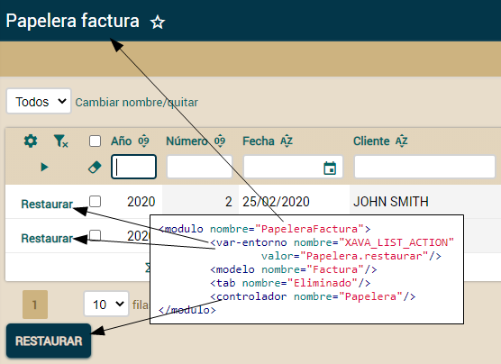
- ### Varias definiciones de datos tabulares por entidad
- Otro detalle importante es que solo las entidades borradas se muestran en la lista. Esto es posible porque definimos un *@Tab* específico indicando su nombre para el módulo. El siguiente código detalla como escoger el *@Tab* para un módulo:
- <modulo nombre="...">
-     ...
- `    `<tab nombre="Eliminado"/> *<!-- "Eliminado" es un @Tab definido en la entidad -->*
-     ...
- </modulo>
- Por supuesto, has de tener un *@Tab* llamado “Eliminado” en tus entidades *Pedido* y *Factura*. Tal como se muestra a continuación:
- **@Tab**(baseCondition = "${eliminado} = false") *// Tab sin nombre, es el de por defecto*
- **@Tab**(name="Eliminado", baseCondition = "${eliminado} = true") *// Tab con nombre*
- **public** **class** **Factura** **extends** **DocumentoComercial** { ... }
 
- **@Tab**(baseCondition = "${eliminado} = false")
- **@Tab**(name="Eliminado", baseCondition = "${eliminado} = true")
- **public** **class** **Pedido** **extends** **DocumentoComercial** { ... }
- Usamos el *@Tab* sin nombre como lista por defecto para *Factura* y *Pedido*, pero tenemos un *@Tab* llamado *"Eliminado"* que puedes usar para generar una lista con solo las filas borradas. En este caso lo usamos para los módulos papelera. Ahora puedes probar tus nuevos módulos, si no los ves en el menú prueba cerrar sesión y volver a identificarte.
- ### Obsesión por reutilizar
- ¡Bien hecho! El código de *EliminarSeleccionadoParaFacturacion* puede borrar y restaurar entidades, y hemos añadido la capacidad de restaurar con solo un poco más de código, sin copiar y pegar.\
  Y ahora un enjambre de perniciosos pensamientos bullen en tu cabeza. Seguramente estés pensando “Esta acción no es únicamente para borrar, sino también para borrar y restaurar”, y entonces, “Espera un momento, lo que es en realidad es una acción para actualizar la propiedad *eliminado* de la entidad actual”, y tu siguiente pensamiento será “Con tan solo un poco más podemos actualizar cualquier propiedad de la entidad”.\
  Sí, estás en lo cierto. Con facilidad podemos crear una acción más genérica, una *ActualizarPropiedad* por ejemplo, y usarla para declarar tus acciones *deleteSelected* y *restaurar*, tal como se muestra a continuación:
- <accion nombre="deleteSelected" modo="list" confirmar="true"
- `    `class="com.tuempresa.facturacion.acciones.ActualizarPropiedad"
- `    `atajo-de-teclado="Control D">
- `    `<poner propiedad="propiedad" valor="eliminado" />
- `    `<poner propiedad="valor" valor="true" />
- </accion>
 
- <accion nombre="restaurar" modo="list"
- `    `class="com.tuempresa.facturacion.acciones.ActualizarPropiedad">
- `    `<poner propiedad="propiedad" valor="eliminado" />
- `    `<poner propiedad="valor" valor="false" />
- </accion>
- Aunque parezca una buena idea, no vamos a crear esta flexible *ActualizarPropiedad*. Porque cuanto más flexible sea tu código, más sofisticado será. Y no queremos código sofisticado. Queremos código sencillo, y aunque el código sencillo es algo imposible de conseguir, hemos de esforzarnos por que nuestro código sea lo más sencillo posible. El consejo es: crea código reutilizable solo cuando éste simplifique tu aplicación en el presente.
- [**Lección 25: Comportamiento y lógica de negocio**](C:\Users\Soporte\Documents\openxava\openxava-doc\web\docs\business-logic-behavior_es.html)
- OpenXava no es simplemente un marco de trabajo para hacer mantenimientos (altas, bajas, modificaciones y consultas), más bien está concebido para desarrollar aplicaciones de gestión plenamente funcionales. Hasta ahora hemos aprendido como crear y refinar la aplicación para manejar los datos. Ahora vamos a posibilitar al usuario la ejecución de lógica de negocio específica.\
  En esta lección vamos a ver como escribir lógica de negocio en el modelo y llamar a esta lógica desde acciones personalizadas. Así podrás transformar tu aplicación de gestión de datos en una herramienta útil para el trabajo cotidiano de tu usuario.
- ## Lógica de negocio desde el modo detalle
- Empezaremos con el caso más simple: un botón en modo detalle para ejecutar cierta lógica. En este caso para crear la factura desde un pedido:\
  \
  Aquí se muestra como esta nueva acción coge el pedido actual y crea una factura a partir de él. Simplemente copia todos los datos del pedido a la nueva factura, incluyendo las líneas de detalle. Se muestra un mensaje y la pestaña FACTURA del pedido visualizará la factura recién creada. Veamos como codificar este comportamiento.
- ### Crear una acción para ejecutar lógica personalizada
- Como ya sabes el primer paso para tener una acción personalizada en tu módulo es definir un controlador con esa acción. Por tanto, editemos *controladores.xml* y añadamos un nuevo controlador. El siguiente código muestra el controlador *Pedido*:
- <controlador nombre="Pedido">
- `	`<hereda-de controlador="Facturacion"/> *<!-- Para tener las acciones estándar -->*

- `	`<accion nombre="crearFactura" modo="detail"
- `		`clase="com.tuempresa.facturacion.acciones.CrearFacturaDesdePedido"/>
- `	`*<!-- modo="detail" : Sólo en modo detalle -->*

- </controlador>
- Dado que hemos seguido la convención de dar al controlador el mismo nombre que a la entidad y el módulo, ya tenemos automáticamente esta nueva acción disponible para *Pedido*. El controlador *Pedido* desciende del controlador *Facturacion*. Recuerda que creamos un controlador *Facturacion* en la lección anterior. Es un refinamiento del controlador *Typical*.\
  Ahora hemos de escribir el código Java para la acción. Puedes verlo aquí:
- **package** com.tuempresa.facturacion.acciones; *// En el paquete 'acciones'*

- **import** org.openxava.actions.\*;
- **import** org.openxava.jpa.\*;
- **import** com.tuempresa.facturacion.modelo.\*;

- **public** **class** **CrearFacturaDesdePedido**
- `    `**extends** **ViewBaseAction** { *// Para usar getView()*

- `    `**public** **void** **execute**() **throws** Exception {
- `        `Pedido pedido = XPersistence.getManager().find( *// Usamos JPA para obtener la*
- `            `Pedido.class, *// entidad Pedido visualizada en la vista*
- `            `getView().getValue("oid"));
- `        `pedido.crearFactura(); *// El trabajo de verdad lo delegamos en la entidad*
- `        `getView().refresh(); *// Para ver la factura creada en la pestaña FACTURA*
- `        `addMessage("factura\_creada\_desde\_pedido", *// Mensaje de confirmación*
- `            `pedido.getFactura());
- `    `}
- }
- Realmente simple. Buscamos la entidad *Pedido*, llamamos al método *crearFactura()*, refrescamos la vista y mostramos un mensaje. Fíjate como la acción es un mero intermediario entre la vista (la interfaz de usuario) y el modelo (la lógica de negocio).\
  Recuerda añadir el texto del mensaje en el archivo *facturacion-messages\_es.properties* de la carpeta *src/main/resources/i18n*:
- factura\_creada\_desde\_pedido=Factura {0} creada a partir del pedido actual
- Sin embargo, el mensaje tal cual está no se muestra de forma agradable, porque enviamos como argumento un objeto *Factura*. Necesitamos un *toString()* para *Factura* y *Pedido* que sea útil para el usuario. Sobrescribiremos *toString()* de *DocumentoComercial* (el padre de *Factura* y *Pedido*) para conseguirlo. Puedes ver este método *toString()*:
- **abstract** **public** **class** **DocumentoComercial** **extends** **Eliminable** { {

-     ...

- `    `**public** String **toString**() {
- `        `**return** anyo + "/" + numero;
- `    `}
- }
- El año y el número son perfectos para identificar una factura o pedido desde el punto de vista del usuario.\
  Esto es todo para la acción. Veamos la pieza restante, el método *crearFactura()* de la entidad *Pedido*.
- ### Escribiendo la lógica de negocio real en la entidad
- La lógica de negocio para crear una nueva *Factura* está en la entidad *Pedido*, no en la acción. Esto es la forma natural de hacerlo. El principio esencial de la Orientación a Objetos es que los objetos no son solo datos, sino datos y lógica. El código más bello es aquel cuyos objetos contienen la lógica para manejar sus propios datos. Si tus entidades son meros contenedores de datos (simples envoltorios de las tablas de la base de datos) y tus acciones tienen toda la lógica para manipularlos, en ese caso tu código es una perversión del objetivo original de la Orientación a Objetos.\
  Aparte de las razones espirituales, poner la lógica para crear una *Factura* dentro de *Pedido* es un enfoque pragmático, porque de esta forma podemos usar esta lógica desde otras acciones, proceso masivos, servicios web, etc.\
  Veamos el código del método *crearFactura()* de la clase *Pedido*:
- **public** **class** **Pedido** **extends** **DocumentoComercial** {

-     ...
	
- `    `**public** **void** **crearFactura**() **throws** Exception { *// throws Exception para tener*
- `                                              `*// un código más simple, de momento*
- `        `Factura factura = **new** Factura(); *// Instancia una factura*
- `        `BeanUtils.copyProperties(factura, **this**); *// y copia el estado del pedido actual*
- `        `factura.setOid(**null**); *// Para que JPA sepa que esta entidad todavía no existe*
- `        `factura.setFecha(LocalDate.now()); *// La fecha para la nueva factura es hoy*
- `        `factura.setDetalles(**new** ArrayList<>(getDetalles())); *// Clona la colección detalles*
- `        `XPersistence.getManager().persist(factura);
- `        `**this**.factura = factura; *// Siempre después de persist()*
- `    `}
- }
- La lógica consiste en crear un nuevo objeto *Factura*, copiar los datos desde el *Pedido* actual a él y asignar la entidad resultante a la referencia *factura* del *Pedido* actual.\
  Hay tres sutiles detalles aquí. Primero, has de escribir *factura.setOid(null)*, si no la nueva *Factura* tendría la misma identidad que el *Pedido* original, además a JPA no le gusta persistir los objetos con el id autogenerado rellenado de antemano. Segundo, has de asignar la nueva *Factura* al actual Pedido (*this.factura = factura*) después de llamar a *persist(factura)*, si no obtendrás un error de JPA (algo así como "object references an unsaved transient instance". Tercero, hemos de envolver la colección *detalles* con un *new ArrayList()*, para que sea una colección nueva aunque con los mismos elementos, porque JPA no quiere la misma colección asignada a dos entidades.
- ### Escribe menos código usando Apache Commons BeanUtils
- Observa como hemos usado *BeanUtils.copyProperties()* para copiar todas las propiedades del actual *Pedido* a la nueva *Factura*. Este método copia todas las propiedades con el mismo nombre de un objeto a otro, incluso si los objetos son de clases diferentes. Esta utilidad pertenece al proyecto de apache Commons BeanUtils. El jar para esta utilidad, *commons-beanutils.jar*, ya está incluido en tu proyecto.\
  El siguiente código muestra como usando BeanUtils escribes menos:
- BeanUtils.copyProperties(factura, **this**);
- *// Es lo mismo que*
- factura.setOid(getOid());
- factura.setAnyo(getAnyo());
- factura.setNumero(getNumero());
- factura.setFecha(getFecha());
- factura.setEliminado(isEliminado());
- factura.setCliente(getCliente());
- factura.setPorcentajeIVA(getPorcentajeIVA());
- factura.setIva(getIva());
- factura.setImporteTotal(getImporteTotal());
- factura.setObservaciones(getObservaciones());
- factura.setDetalles(getDetalles());
- Sin embargo, la principal ventaja de usar BeanUtils no es ahorrar tiempo de tecleo, sino que obtienes un código más resistente a los cambios. Porque, si añades, quitas o renombras alguna propiedad de *DocumentoComercial* (el padre de *Factura* y *Pedido*), si estás copiando las propiedades a mano tienes que cambiar el código, mientras que si estás usando *BeanUtils.copyProperties()* el código funcionará siempre bien, sin tener que cambiarlo.
- ### Excepciones de aplicación
- Recuerda la frase: "La excepción que confirma la regla". Las reglas, la vida y el software están llenos de excepciones. Y nuestro método *crearFactura()* no es una excepción. Hemos escrito código que funciona en los casos más comunes. Pero, ¿qué ocurre si el pedido no está listo para ser facturado o si hay algún problema para acceder a la base de datos? Obviamente, en este caso necesitamos tomar caminos diferentes.\
  Es decir, el simple *throws Exception* que hemos escrito para el método *crearFactura()* no es suficiente para un comportamiento refinado. Deberiamos crear nuestra propia excepción, hagámoslo:
- **package** com.tuempresa.facturacion.modelo; *// En el paquete 'modelo'*

- **import** org.openxava.util.\*;

- **public** **class** **CrearFacturaException** **extends** **Exception** { *// No RuntimeException*

- `    `**public** **CrearFacturaException**(String mensaje) {
- `        `*// El XavaResources es para traducir el mensaje desde el id en i18n*
- `        `**super**(XavaResources.getString(mensaje));
- `    `}
	
- }
- Ahora podemos usar nuestra *CrearFacturaException* en lugar de *Exception* en el método *crearFactura()* de *Pedido*:
- **public** **void** **crearFactura**()
- `    `**throws** CrearFacturaException *// Una excepción de aplicación (1)*
- {
- `    `**if** (**this**.factura != **null**) { *// Si ya tiene una factura no podemos crearla*
- `        `**throw** **new** CrearFacturaException( 
- `            `"pedido\_ya\_tiene\_factura"); *// Admite un id de 18n como argumento*
- `    `}
- `    `**if** (!isEntregado()) { *// Si el pedido no está entregado no podemos crear la factura*
- `        `**throw** **new** CrearFacturaException("pedido\_no\_entregado");
- `    `}
- `    `**try** {
- `        `Factura factura = **new** Factura(); 
- `        `BeanUtils.copyProperties(factura, **this**); 
- `        `factura.setOid(**null**); 
- `        `factura.setFecha(LocalDate.now()); 
- `        `factura.setDetalles(**new** ArrayList<>(getDetalles())); 
- `        `XPersistence.getManager().persist(factura);
- `        `**this**.factura = factura; 
- `    `}
- `    `**catch** (Exception ex) { *// Cualquier excepción inesperada (2)*
- `        `**throw** **new** SystemException( *// Se lanza una excepción runtime (3)*
- `            `"imposible\_crear\_factura", ex);
- `    `}
- }
- Ahora declaramos explícitamente las excepciones de aplicación que este método lanza (1). Una excepción de aplicación es una excepción chequeada que indica un comportamiento especial pero esperado del método. Una excepción de aplicación está relacionada con la lógica de negocio del método. Puedes crear una excepción de aplicación para cada posible caso. Por ejemplo, podrías crear una *PedidoYaTieneFacturaException* y una *PedidoNoEntregadoException*. Esto te permitiría tratar cada caso de forma diferente desde el código que usa el método. Aunque, esto no es necesario en nuestro caso, por tanto nosotros simplemente usamos nuestra *CrearFacturaException*, una excepción de aplicación genérica para este método.\
  También hemos de enfrentarnos a problemas inesperados (2). Los problemas inesperados incluyen errores del sistema (acceso a base de datos, la red o problemas de hardware) o errores de programación (*NullPointerException, IndexOutOfBoundsException,* etc). Cuando nos encontramos con cualquier problema inesperado lanzamos una *RuntimeException* (3). En este caso hemos lanzado una *SystemException*, una *RuntimeException* incluida en OpenXava por comodidad, pero puedes lanzar la *RuntimeException* que quieras.\
  No necesitas modificar el código de la acción. Si tu acción no atrapa las excepciones, OpenXava lo hace automáticamente. Muestra los mensajes de las excepciones de aplicación al usuario; y para las excepciones runtime, muestra un mensaje de error genérico y aborta la transacción.\
  Para rematar, añadimos el mensaje para la excepción en los archivos *i18n*. Edita el archivo *facturacion-messages\_es.properties* de la carpeta *src/main/resources/i18n* añadiendo las siguientes entradas:
- pedido\_ya\_tiene\_factura=El pedido ya tiene una factura
- pedido\_no\_entregado=El pedido todavía no está entregado
- imposible\_crear\_factura=Imposible crear factura
- Hay cierto debate en la comunidad de desarrolladores sobre la manera correcta de usar las excepciones en Java. El enfoque usado en esta sección es la forma clásica de trabajar con excepciones en el mundo Java empresarial.
- ### Validar desde la acción
- Usualmente el mejor lugar para las validaciones es el modelo, es decir, las entidades. Sin embargo, a veces es necesario poner lógica de validación en las acciones. Por ejemplo, si quieres preguntar por el estado actual de la interfaz gráfica has de hacer la validación en la acción.\
  En nuestro caso si el usuario pulsa en CREAR FACTURA cuando está creando un nuevo pedido que todavía no ha grabado, fallará. Falla porque es imposible crear una factura desde un pedido inexistente. El usuario ha de grabar el pedido primero.\
  Modificamos el método *execute()* de *CrearFacturaDesdePedido* para validar que la factura visualizada actualmente esté grabada:
- **public** **void** **execute**() **throws** Exception {
- `    `*// Añade la siguiente condición*
- `    `**if** (getView().getValue("oid") == **null**) { 
- `        `*// Si el oid es nulo el pedido actual no se ha grabado todavía (1)*
- `        `addError("imposible\_crear\_factura\_pedido\_no\_existe");
- `        `**return**;
- `    `}
    
-     ...
    
- }
- La validación consiste en verificar que el *oid* es nulo (1), en cuyo caso el usuario está introduciendo un pedido nuevo, pero todavía no lo ha grabado. En este caso se muestra un mensaje y se aborta la creación de la factura.\
  Aquí también tenemos un mensaje para añadir al archivo i18n. Edita el archivo *facturacion-messages\_es.properties* de la carpeta *src/main/resources/i18n* añadiendo la siguiente entrada:
- imposible\_crear\_factura\_pedido\_no\_existe=Imposible crea factura: El pedido no existe todavía
- Las validaciones le dicen al usuario que ha hecho algo mal. Esto es necesario, por supuesto, pero es mejor aún crear una aplicación que ayude al usuario a evitar hacer las cosas mal. Veamos una forma de hacerlo en la siguiente sección.
- ### Evento OnChange para ocultar/mostrar una acción por código
- Nuestro actual código es suficientemente robusto como para prevenir que equivocaciones del usuario estropeen los datos. Vamos a ir un paso más allá, impidiendo que el usuario se equivoque. Ocultaremos la acción para crear una nueva factura cuando el pedido no esté listo para ello.\
  OpenXava permite ocultar y mostrar acciones automáticamente. También permite ejecutar una acción cuando cierta propiedad sea cambiada por el usuario en la interfaz de usuario. Con estos dos ingredientes podemos mostrar el botón sólo cuando la acción esté lista para ser usada.\
  Recuerda que una factura puede ser generada desde un pedido si el pedido ha sido entregado y no tiene factura todavía. Por tanto, tenemos que vigilar los cambios en la referencia *factura* y la propiedad *entregado* de la entidad *Pedido*. Lo primero será crear la acción que oculta o muestra la acción para crear una factura desde un pedido, *MostrarOcultarCrearFactura*, con este código:
- **package** com.tuempresa.facturacion.acciones; *// En el paquete 'acciones'*

- **import** org.openxava.actions.\*; *// Necesario para usar OnChangePropertyAction,*

- **public** **class** **MostrarOcultarCrearFactura**
- `    `**extends** **OnChangePropertyBaseAction** { *// Necesario para las acciones @OnChange (1)*

- `    `**public** **void** **execute**() **throws** Exception {
- `        `**if** (estaPedidoCreado() && estaEntregado() && !tieneFactura()) { *// (2)*
- `            `addActions("Pedido.crearFactura");
- `        `}
- `        `**else** {
- `            `removeActions("Pedido.crearFactura");
- `        `}
- `    `}
	
- `    `**private** **boolean** **estaPedidoCreado**() {
- `        `**return** getView().getValue("oid") != **null**; *// Leemos el valor de la vista*
- `    `}
	
- `    `**private** **boolean** **estaEntregado**() {
- `        `Boolean entregado = (Boolean)
- `            `getView().getValue("entregado"); *// Leemos el valor de la vista*
- `        `**return** entregado == **null**?**false**:entregado;
- `    `}

- `    `**private** **boolean** **tieneFactura**() {
- `        `**return** getView().getValue("factura.oid") != **null**; *// Leemos el valor de la vista*
- `    `} 	
- }
- Después anotamos *factura* y *entregado* en *Pedido* con *@OnChange* para que cuando el usuario cambie el valor de *entregado* o *factura* en la pantalla, la acción *MostrarOcultarCrearFactura* se ejecute:
- **public** **class** **Pedido** **extends** **DocumentoComercial** {

-     ...
- `    `**@OnChange**(MostrarOcultarCrearFactura.class) *// Añade esto*
- `    `Factura factura;

-     ...
- `    `**@OnChange**(MostrarOcultarCrearFactura.class) *// Añade esto*
- `    `**boolean** entregado;

-     ...
- }
- *MostrarOcultarCrearFactura* es una acción convencional con un método *execute()*, aunque extiende de *OnChangePropertyBaseAction* (1). Todas las acciones anotadas con *@OnChange* tienen que implementar *IOnChangePropertyAction*, aunque es más fácil extender de *OnChangePropertyBaseAction* la cual lo implementa. Desde esta acción puedes usar *getNewValue()* y *getChangedProperty()*, aunque en este caso concreto no los necesitamos.\
  El método *execute()* pregunta si el pedido visualizado está grabado, entregado y todavía no tiene una factura (2), en cuyo caso muestra la acción con *addActions("Pedido.crearFactura")*, en caso contrario oculta la acción con *removeActions("Pedido.crearFactura")*. Así, ocultamos o mostramos la acción *Pedido.crearFactura*, mostrándola solo cuando proceda. Los métodos *add/removeActions()* permiten especificar varias acciones a mostrar u ocultar separadas por comas.\
  Ahora cuando marcas o desmarcas la casilla *entregado* o escoges una factura, el botón para la acción se muestra u oculta. También, cuando el usuario pulsa en *Nuevo* para crear un nuevo pedido el botón para crear la factura se oculta. Sin embargo, al editar un pedido ya existente, el botón estará siempre presente, aunque el pedido no cumpla los requisitos. Esto es porque cuando un objeto se busca y visualiza las acciones *@OnChange* no se ejecutan por defecto. Podemos cambiar esto con una pequeña modificación en *BuscarExcluyendoEliminados*:
- **public** **class** **BuscarExcluyendoEliminados**
- `    `// **extends** **SearchByViewKeyAction** {
- `    `extends SearchExecutingOnChangeAction { *// Usa ésta como clase base*
- La acción de búsqueda por defecto, es decir, *SearchByViewKeyAction* no ejecuta las acciones *@OnChange* por defecto, por tanto cambiamos nuestra acción de buscar para que extienda de *SearchExecutingOnChangeAction*. *SearchExecutingOnChangeAction* se comporta exactamente igual que *SearchByViewKeyAction* pero ejecutando los eventos *OnChange*. De esta forma cuando el usuario escoge un pedido la acción *MostrarOcultarCrearFactura* se ejecuta.\
  Nos queda un pequeño detalle para que todo esto sea perfecto: cuando el usuario pulsa en CREAR FACTURA después de que la factura se haya creado el botón se tiene que ocultar. El usuario no puede crear la factura otra vez. Podemos implementar esta funcionalidad con un ligero refinamiento de *CrearFacturaDesdePedido*, así:
- **public** **void** **execute**() **throws** Exception {

-     ...

- `    `*// Todo ha ido bien, por tanto ocultamos la acción*
- `    `removeActions("Pedido.crearFactura"); 
- }
- Como puedes ver simplemente añadimos *removeActions("Pedido.crearFactura")* al final del método *execute()*.\
  Mostrar y ocultar acciones no es un sustituto para la validación en el modelo. Las validaciones siguen siendo necesarias porque las entidades pueden ser usadas desde cualquier otra parte de la aplicación, no solo de los módulos de mantenimiento. Sin embargo, el truco de ocultar y mostrar acciones mejora la experiencia del usuario.
- ## Lógica de negocio desde el modo lista
- En la lección anterior aprendiste como crear acciones de lista. Las acciones de lista son una herramienta utilísima para dar al usuario la posibilidad de aplicar lógica a varios objetos a la vez. En nuestro caso, podemos añadir una acción en el modo lista para crear una nueva factura automáticamente a partir de varios pedidos seleccionados en la lista, de esta manera:\
  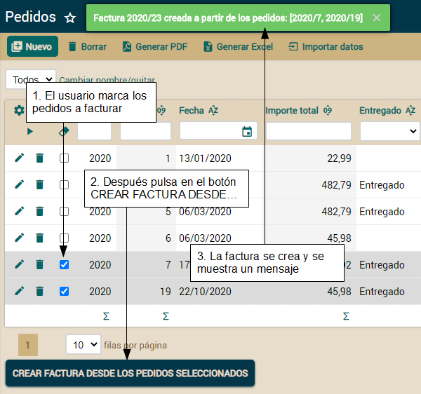\
  Aquí se muestra como esta acción de lista coge los pedidos seleccionados y crea una factura a partir de ellos. Simplemente copia los datos del pedido en la nueva factura, añadiendo las línea de detalle de todos los pedidos en una única factura. También se muestra un mensaje. Veamos como codificar este comportamiento.
- ### Acción de lista con lógica propia
- Como ya sabes, el primer paso para tener una acción propia en tu módulo es añadirla a un controlador. Por tanto, editemos *controladores.xml* añadiendo una nueva acción al controlador *Pedido*:
- <controlador nombre="Pedido">

-     ...
    
- `    `*<!-- La nueva acción -->*
- `    `<accion nombre="crearFacturaDesdePedidosSeleccionados"
- `        `modo="list"
- `        `clase="com.tuempresa.facturacion.acciones.CrearFacturaDesdePedidosSeleccionados"/>
- `	`*<!-- modo="list": Sólo se muestra en modo lista -->*

- </controlador>
- Solo con esto ya tienes una nueva acción disponible para *Pedido* en modo lista.\
  Ahora hemos de escribir el código Java para la acción:
- **package** com.tuempresa.facturacion.acciones;

- **import** java.util.\*;
- **import** javax.ejb.\*;
- **import** org.openxava.actions.\*;
- **import** org.openxava.model.\*;
- **import** com.tuempresa.facturacion.modelo.\*;

- **public** **class** **CrearFacturaDesdePedidosSeleccionados**
- `    `**extends** **TabBaseAction** { *// Tipico de acciones de lista. Permite usar getTab() (1)*

- `    `**public** **void** **execute**() **throws** Exception {
- `        `Collection<Pedido> pedidos = getPedidosSeleccionados(); *// (2)*
- `        `Factura factura = Factura.crearDesdePedidos(pedidos); *// (3)*
- `        `addMessage("factura\_creada\_desde\_pedidos", factura, pedidos); *// (4)*
- `    `}

- `    `**private** Collection<Pedido> **getPedidosSeleccionados**() *// (5)*
- `        `**throws** FinderException
- `    `{
- `        `Collection<Pedido> pedidos = **new** ArrayList<>();
- `        `**for** (Map key: getTab().getSelectedKeys()) { *// (6)*
- `            `Pedido pedido = (Pedido) MapFacade.findEntity("Pedido", key); *// (7)*
- `            `pedidos.add(pedido);
- `        `}
- `        `**return** pedidos;
- `    `}
- }
- Realmente sencillo. Obtenemos la lista de los pedidos marcados en la lista (2), llamamos al método estático *crearDesdePedidos()* (3) de *Factura* y mostramos un mensaje (4). En este caso también ponemos la lógica real en la clase del modelo, no en la acción. Dado que la lógica aplica a varios pedidos y crea una nueva factura, el lugar natural para ponerlo es en un método estático de la clase *Factura*.\
  El método *getPedidosSeleccionados()* (5) devuelve una colección con las entidades *Pedido* marcadas por el usuario en la lista. Para hacerlo, el método usa *getTab()* (6), disponible en *TabBaseAction* (1), que devuelve un objeto *org.openxava.tab.Tab*. El objeto *Tab* te permite manejar los datos tabulares de la lista. En este caso usamos *getSelectedKeys()* (6) que devuelve una colección con las claves de las filas seleccionadas. Dado que esas claves están en formato *Map* usamos *MapFacade.findEntity()* (7) para convertirlas en entidades *Pedido*.\
  Acuérdate de añadir el texto del mensaje al fichero *facturacion-messages\_es.properties* en la carpeta *src/main/resources/i18n*:
- factura\_creada\_desde\_pedidos=Factura {0} creada a partir de los pedidos: {1}
- Eso es todo para la acción. Veamos la pieza que falta, el método *crearDesdePedidos()* de la entidad *Factura*.
- ### Lógica de negocio en el modelo sobre varias entidades
- La lógica de negocio para crear una nueva *Factura* a partir de varias entidades *Pedido* está en la capa del modelo, es decir, en las entidades, no en la acción. No podemos poner el método en la clase *Pedido*, porque el proceso se hace a partir de varios pedidos, no de uno. No podemos usar un método de instancia en *Factura* porque todavía no existe el objeto *Factura*, de hecho lo que queremos es crearlo. Por lo tanto, vamos a crear un método de factoría estático en la clase *Factura* para crear una nueva *Factura* a partir de varios pedidos. Puedes ver este método aquí:
- **public** **class** **Factura** **extends** **DocumentoComercial** {

-     ...
	
- `    `**public** **static** Factura **crearDesdePedidos**(Collection<Pedido> pedidos)
- `        `**throws** CrearFacturaException
- `    `{
- `        `Factura factura = **null**;
- `        `**for** (Pedido pedido: pedidos) {
- `            `**if** (factura == **null**) { *// El primero pedido*
- `                `pedido.crearFactura(); *// Reutilizamos la lógica para crear una*
- `                                       `*// factura desde un pedido*
- `                `factura = pedido.getFactura(); *// y usamos la factura creada*
- `            `}
- `            `**else** { *// Para el resto de los pedidos la factura ya está creada*
- `                `pedido.setFactura(factura); *// Asigna la factura*
- `                `pedido.copiarDetallesAFactura(); *// Un método de Pedido para copiar las lineas*
- `            `} 
- `        `} 
- `        `**if** (factura == **null**) { *// Si no hay pedidos*
- `            `**throw** **new** CrearFacturaException("pedidos\_no\_especificados");
- `        `}
- `        `**return** factura;
- `    `}
- }
- Usamos el primer *Pedido* para crear una nueva *Factura* usando el método ya existente *crearFactura()* de *Pedido*. Entonces llamamos a *copiarDetallesAFactura()* de *Pedido* para copiar las líneas de los pedidos restantes a la nueva *Factura* acumulando en ella el *iva* e *importeTotal* de los pedidos. Además, asignamos la nueva *Factura* como la factura de los pedidos de la colección.\
  Si *factura* es nulo al final del proceso, es porque la colección *pedidos* está vacía. En este caso lanzamos una *CrearFacturaException*, ya que la acción no atrapa las excepciones, OpenXava muestra el mensaje de la excepción al usuario. Esto está bien. Si el usuario no marca los pedido y pulsa en el botón para crear la factura, le aparecerá ese mensaje de error.
- Todavía nos queda añadir el método *copiarDetallesAFactura()* a *Pedido*:
- **public** **class** **Pedido** **extends** **DocumentoComercial** {

-     ...
	
- `    `**public** **void** **copiarDetallesAFactura**() { 
- `        `factura.getDetalles().addAll(getDetalles()); *// Copia las líneas*
- `        `factura.setIva(factura.getIva().add(getIva())); *// Acumula el IVA*
- `        `factura.setImporteTotal( *// y el importe total*
- `		    `factura.getImporteTotal().add(getImporteTotal()));
- `    `}
- }
- Como puedes ver, copia los detalles del pedido actual a la factura y acumula el *iva* y el *importeTotal*.
- Acuérdate de añadir los textos para los mensajes en el archivo *facturacion-messages\_es.properties* de la carpeta *src/main/resources/i18n*:
- pedidos\_no\_especificados=Pedidos no especificados
- Este no es el único error con el que el usuario puede encontrarse. Todas las validaciones que hemos escrito para *Factura* y *Pedido* hasta ahora se aplican automáticamente, por lo tanto el usuario ha de escoger pedidos ya entregados y sin factura. La validación del modelo impide que el usuario cree una factura desde pedidos no apropiados.
- ## Mostrar un diálogo
- Después de crear una factura a partir de varios pedidos, sería práctico para el usuario ver y posiblemente editar la nueva factura. Una forma de conseguir esto es sacando un diálogo que permite ver y editar la recién creada factura. De esta forma:\
  \
  Veamos como implementar este comportamiento.
- ### Usar showDialog()
- El primer paso es modificar *CrearFacturaDesdePedidosSeleccionados* para mostrar un diálogo después de crear la factura, con sólo añadir unas poca línea al final de *execute()* es suficiente:
- **public** **void** **execute**() **throws** Exception {
- `    `Collection<Pedido> pedidos = getPedidosSeleccionados(); 
- `    `Factura factura = Factura.crearDesdePedidos(pedidos); 
- `    `addMessage("factura\_creada\_desde\_pedidos", factura, pedidos);

- `    `*// Añade las siguientes líneas para mostrar el diálogo*
- `    `showDialog(); *// (1)*
- `    `*// A partir de ahora getView() es el diálogo*
- `    `getView().setModel(factura); *// Visualiza la factura en el diálogo (2)*
- `    `getView().setKeyEditable(**false**); *// Para indicar que el objeto ya existe (3)*
- `    `setControllers("EdicionFactura"); *// Las acciones del diálogo (4)*
- }
- Llamamos a *showDialog()* (1), lo que saca un diálogo y a partir de ese momento cuando usamos *getView()* referencia a la vista del diálogo no a la vista principal del módulo. Después de *showDialog()* el diálogo está en blanco, hasta que asignamos nuestra factura a la vista con *getView().setModel(factura)* (2), ahora la factura se visualiza en el diálogo. La siguiente línea, *getView().setKeyEditable(false)* (3), es para indicar que la factura ya está grabada y así más adelante la acción de grabar correspondiente sepa como comportarse. Finalmente, usamos *setControllers("EdicionFactura")* para definir el controlador con las acciones a presentar en el diálogo, es decir los botones de abajo del diálogo. Fíjate como *setControllers()* es una alternativa a *addActions()*.\
  Obviamente, esto no funcionará hasta que tengamos el controlador *EdicionFactura* definido. Haremos esto en la siguiente sección.
- ### Definir las acciones del diálogo
- El diálogo permite al usuario cambiar la factura y grabar los cambios o simplemente cerrar la factura después de examinarla. Estas acciones se definen en el controlador *EdicionFactura* en *controladores.xml*:
- <controlador nombre="EdicionFactura">

- `    `<accion nombre="grabar"
- `        `clase="com.tuempresa.facturacion.acciones.GrabarFactura"
- `        `atajo-de-teclado="Control S"/>
		
- `    `<accion nombre="cerrar"
- `        `clase="org.openxava.actions.CancelAction"/>
		
- </controlador>
- Las dos acciones de este controlador representan los dos botones, GRABAR y CERRAR que viste en la imagen anterior.
- ### Cerrar el diálogo
- *GrabarFactura* contiene sólo una extensión menor de la acción estándar *SaveAction* de OpenXava:
- **package** com.tuempresa.facturacion.acciones;

- **import** org.openxava.actions.\*;

- **public** **class** **GrabarFactura**
- `    `**extends** **SaveAction** { *// Acción estándar de OpenXava para* 
- `                         `*// grabar el contenido de la vista*	             
- `    `**public** **void** **execute**() **throws** Exception {
- `        `**super**.execute(); *// La lógica estándar de grabación (1)*
- `        `closeDialog(); *// (2)*
- `    `}
- }
- La acción extiende *SaveAction* sobrescribiendo el método *execute()* para simplemente llamar a la lógica estándar, con *super.execute()* (1), y después cerrar el diálogo con *closeDialog()* (2). De esta forma, cuando el usuario pulsa en GRABAR, los datos de la factura se graban y el diálogo se cierra volviendo a la lista de pedidos, listo para continuar creando facturas a partir de pedidos.\
  Para el botón CERRAR usamos *CancelAction*, una acción incluida en OpenXava que simplemente cierra el diálogo.
- ### Vista plana en lugar de diálogo
- A veces en lugar de sacar un diálogo encima:\
  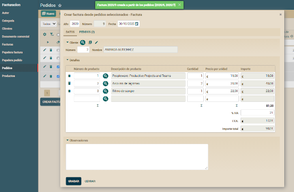\
  Podriamos preferir reemplazar la vista actual por la nueva, así:\
  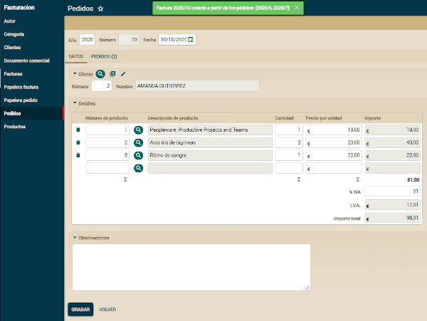\
  Esto puede ser útil cuando la cantidad de información a mostrar es muy grande y en un diálogo queda mal. Usar una vista plana en vez de un diálogo es tan fácil como cambiar esta línea de tu *CrearFacturaDesdePedidosSeleccionados*:
- showDialog();
- Por esta otra:
- showNewView();
- No hace falta nada más. Bueno, quizás cambiar el nombre de la acción "cerrar" por "volver" en el controlador *EdicionFactura* en *controllers.xml*.\
\
  El trabajo está terminado. Puedes probar el módulo *Pedido*: escoge varios pedidos y pulsa en el botón CREAR FACTURA DESDE PEDIDOS SELECCIONADOS. Entonces verás la factura creada en un diálogo.
- [**Lección 26: Referencias y colecciones**](C:\Users\Soporte\Documents\openxava\openxava-doc\web\docs\references-collections_es.html)
- En lecciones anteriores aprendiste como añadir tus propias acciones. Sin embargo, esto no es suficiente para personalizar del todo el comportamiento de tu aplicación, porque la interfaz de usuario generada, en concreto la interfaz de usuario para referencias y colecciones, tiene un comportamiento estándar que a veces no es el más conveniente.\
  Por fortuna, OpenXava proporciona muchas formas de personalizar el comportamiento de las referencias y colecciones. En esta lección aprenderás como hacer algunas de estas personalizaciones, y como esto añade valor a tu aplicación.
- ## Refinar el comportamiento de las referencias
- Posiblemente te hayas dado cuenta de que el módulo *Pedido* tiene un pequeño defecto: el usuario puede añadir cualquier factura que quiera al pedido actual, aunque el cliente de la factura sea diferente. Esto no es admisible. Arreglémoslo.
- ### Las validaciones están bien, pero no son suficientes
- El usuario sólo puede asociar un pedido a una factura si ambos, factura y pedido, pertenecen al mismo cliente. Esto es lógica de negocio específica de tu aplicación, por tanto el comportamiento estándar de OpenXava no lo resuelve.\
  La siguiente imagen muestra cómo se produce un error de validación cuando el cliente de la factura es incorrecto:
- 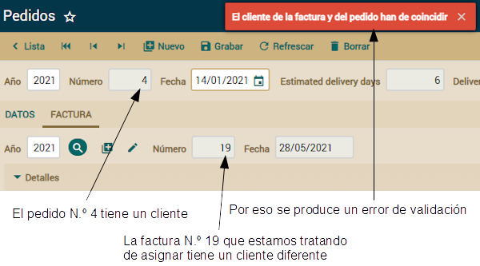
- Ya que esto es lógica de negocio la vamos a poner en la capa del modelo, es decir, en las entidades. Lo haremos añadiendo una validación. Así obtendrás el efecto de la figura de arriba.\
  Ya sabes como añadir esta validación a tu entidad *Pedido*. Se trata de añadir un método anotado con *@AssertTrue*:
- **public** **class** **Pedido** {

-     ...

- `    `*// Este método ha de devolver true para que este pedido sea válido*
- `    `**@AssertTrue**(message="cliente\_pedido\_factura\_coincidir") 
- `    `**private** **boolean** **isClienteFacturaCoincide**() {
- `    	`**return** factura == **null** || *// factura es opcional*
- `    		`factura.getCliente().getNumero() == getCliente().getNumero();
- `    `}

- }
- También has de añadir el mensaje a *src/main/resources/i18n/facturacion-messages\_es.properties*:
- cliente\_pedido\_factura\_coincidir=El cliente de la factura y del pedido han de coincidir
- Aquí comprobamos que el cliente de la factura es el mismo que el del pedido. Esto es suficiente para preservar la integridad de los datos, pero la validación sola es una opción bastante pobre desde el punto de vista del usuario.
- ### Refinar la acción para buscar una referencia con una lista
- Aunque la validación impide que el usuario pueda asignar una factura incorrecta a un pedido, lo tiene difícil a la hora de escoger una factura correcta. Porque cuando pulsa para buscar una factura, todas las facturas existentes se muestran. Vamos a mejorar esto para mostrar solo las facturas del cliente del pedido visualizado, de esta manera:\
  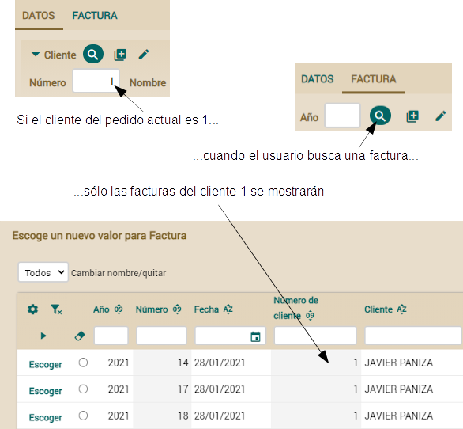\
  Para definir nuestra propia acción de búsqueda para la referencia a factura usaremos la anotación *@SearchAction*. Aquí tienes la modificación necesaria en la clase *Pedido*:
- **public** **class** **Pedido** **extends** **DocumentoComercial** {
 
- `    `**@ManyToOne**
- `    `**@ReferenceView**("SinClienteNiPedidos") 
- `    `**@OnChange**(MostrarOcultarCrearFactura.class) 
- `    `**@SearchAction**("Pedido.buscarFactura") *// Define nuestra acción para buscar facturas*
- `    `Factura factura; 
    
-     ...
	
- }
- De esta forma tan simple definimos la acción a ejecutar cuando el usuario pulsa en el botón de la linterna para buscar una factura. El argumento usado para *@SearchAction*, *Pedido.buscarFactura*, es el nombre calificado de la acción, es decir la acción *buscarFactura* del controlador *Pedido* definido en el archivo *controladores.xml*.\
  Ahora tenemos que editar *controladores.xml* y añadir la definición de nuestra nueva acción:
- <controlador nombre="Pedido">

-     ...
	
- `    `<accion nombre="buscarFactura"
- `        `clase="com.tuempresa.facturacion.acciones.BuscarFacturaDesdePedido"
- `        `oculta="true" icono="magnify"/>
- `        `*<!--*
- `        `*oculta="true" : Para que no se muestre en la barra de botones del módulo*
- `        `*icono="magnify" : La misma imagen que la de la acción estándar*
- `        `*-->*
	
- </controlador>
- Nuestra acción hereda de *ReferenceSearchAction* como se muestra en el siguiente código:
- **package** com.tuempresa.facturacion.acciones; *// En el paquete 'acciones'*

- **import** org.openxava.actions.\*; *// Para usar ReferenceSearchAction*

- **public** **class** **BuscarFacturaDesdePedido**
- `    `**extends** **ReferenceSearchAction** { *// Lógica estándar para buscar una referencia*

- `    `**public** **void** **execute**() **throws** Exception {
- `        `**int** numeroCliente =
- `            `getView().getValueInt("cliente.numero"); *// Lee de la vista el número*
- `                                                  `*// de cliente del pedido actual*
- `        `**super**.execute(); *// Ejecuta la lógica estándar, la cual muestra un diálogo*
- `        `**if** (numeroCliente > 0) { *// Si hay cliente los usamos para filtrar*
- `            `getTab().setBaseCondition("${cliente.numero} = " + numeroCliente);
- `        `}
- `    `}
- }
- Observa como usamos *getTab().setBaseCondition()* para establecer una condición en la lista para escoger la referencia. Es decir, desde una *ReferenceSearchAction* puedes usar *getTab()* para manipular la forma en que se comporta la lista.\
  Si no hay cliente no añadimos ninguna condición por tanto se mostrarían todas las facturas, esto ocurre cuando el usuario escoge la factura antes que el cliente.
- ### Buscar la referencia tecleando en los campos
- La lista para escoger una referencia ya funciona bien. Sin embargo, queremos dar al usuario la opción de escoger una factura sin usar la lista, simplemente tecleando el año y el número. Muy útil si el usuario conoce de antemano que factura quiere.\
  OpenXava provee esa funcionalidad por defecto. Si los campos *@Id* son visualizados en la referencia serán usados para buscar, en caso contrario OpenXava usa el primer campo visualizado para buscar. Aunque en nuestro caso esto no es tan conveniente, porque el primer campo visualizado es el año, y buscar una factura sólo por el año no es muy preciso. La siguiente imagen muestra el comportamiento por defecto junto con una alternativa más conveniente:\
  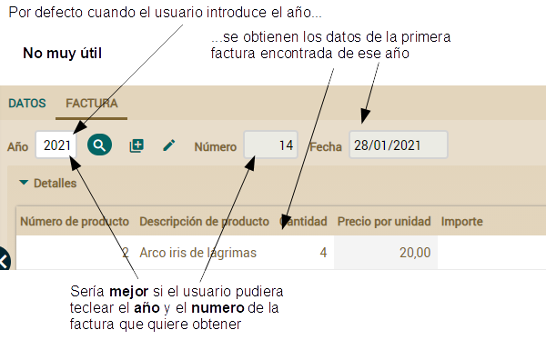\
  Afortunadamente es fácil indicar que campos queremos usar para buscar desde la perspectiva del usuario. Esto se hace por medio de la anotación *@SearchKey*. Edita la clase *DocumentoComercial* (recuerda, el padre de *Pedido* y *Factura*) y añade esta anotación a las propiedades *anyo* y *numero*:
- **abstract** **public** **class** **DocumentoComercial** **extends** **Eliminable** {

- `    `**@SearchKey** *// Añade esta anotación aquí*
- `    `**@Column**(length=4)
- `    `**@DefaultValueCalculator**(CurrentYearCalculator.class) 
- `    `**int** anyo;
 
- `    `**@SearchKey** *// Añade esta anotación aquí*
- `    `**@Column**(length=6)
- `    `**@ReadOnly**
- `    `**int** numero;
	
-     ...
	
- }
- De esta forma cuando el usuario busque un pedido o una factura desde una referencia tiene que teclear el año y el número, y la entidad correspondiente será recuperada de la base de datos y rellenará la interfaz de usuario. Ahora es fácil para el usuario escoger una factura desde un pedido sin usar la lista de búsqueda, simplemente tecleando el año y el número.
- ### Refinar la acción para buscar cuando se teclea la clave
- Ahora que obtener una factura tecleando el año y el número funciona queremos refinarlo para ayudar al usuario a hacer su trabajo de forma más eficiente. Por ejemplo, sería útil que si el usuario todavía no ha escogido al cliente para el pedido y escoge una factura, el cliente de esa factura sea asignado automáticamente al pedido actual. La siguiente imagen visualiza el comportamiento deseado:\
  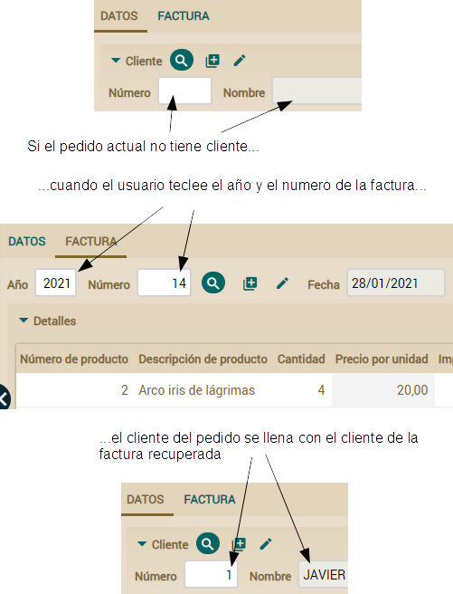\
  Por otra parte, si el usuario ya ha seleccionado un cliente para el pedido, si no coincide con el de la factura, ésta será rechazada y se visualizará un mensaje de error, tal como se muestra aquí:
- 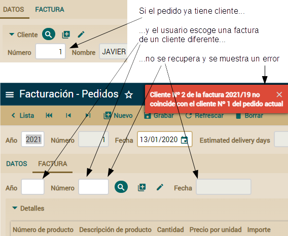
- Para definir este comportamiento especial hemos de añadir una anotación en la referencia *factura* de *Pedido*. *@OnChangeSearch* permite definir nuestra propia acción para hacer la búsqueda de la referencia cuando su clave cambia en la interfaz de usuario. Puedes ver la referencia modificada:
- **public** **class** **Pedido** **extends** **DocumentoComercial** {
 
- `    `**@ManyToOne**
- `    `**@ReferenceView**("SinClienteNiPedidos") 
- `    `**@OnChange**(MostrarOcultarCrearFactura.class) 
- `    `**@OnChangeSearch**(BuscarAlCambiarFactura.class) *// Añade esta anotación*
- `    `**@SearchAction**("Pedido.buscarFactura") 
- `    `Factura factura; 
    
-     ...
	
- }
- A partir de ahora cuando un usuario teclee un nuevo año y número para la factura, *BuscarAlCambiarFactura* se ejecutará. En esta acción se han de leer los datos de la factura de la base de datos y actualizar la interfaz de usuario. A continuación el código de la acción:
- **package** com.tuempresa.facturacion.acciones; *// En el paquete 'acciones'*

- **import** java.util.\*;
- **import** org.openxava.actions.\*; *// Para usar OnChangeSearchAction*
- **import** org.openxava.model.\*;
- **import** org.openxava.view.\*;
- **import** com.tuempresa.facturacion.modelo.\*;

- **public** **class** **BuscarAlCambiarFactura**  
- `    `**extends** **OnChangeSearchAction** { *// Lógica estándar para buscar una referencia cuando*
- `                                   `*// los valores clave cambian en la interfaz de usuario (1)*
- `    `**public** **void** **execute**() **throws** Exception {
- `        `**super**.execute(); *// Ejecuta la lógica estándar (2)*
- `        `Map clave = getView() *// getView() aquí es la de la referencia, no la principal(3)*
-             .getKeyValuesWithValue();
- `        `**if** (clave.isEmpty()) **return**;  *// Si la clave está vacía no se ejecuta más lógica*
- `        `Factura factura = (Factura) *// Buscamos la factura usando la clave tecleada (4)*
- `            `MapFacade.findEntity(getView().getModelName(), clave);
- `        `View vistaCliente = getView().getRoot().getSubview("cliente"); *// (5)*
- `        `**int** numeroCliente = vistaCliente.getValueInt("numero");
- `        `**if** (numeroCliente == 0) { *// Si no hay cliente lo llenamos (6)*
- `            `vistaCliente.setValue("numero", factura.getCliente().getNumero());
- `            `vistaCliente.refresh();
- `        `} 
- `        `**else** { *// Si ya hay un cliente verificamos que coincida con el cliente de la factura (7)*
- `            `**if** (numeroCliente != factura.getCliente().getNumero()) {
- `                `addError("cliente\_factura\_no\_coincide", 
- `                    `factura.getCliente().getNumero(), factura, numeroCliente);
- `                `getView().clear();
- `            `}
- `        `}
- `    `}
- }	
- Dado que la acción desciende de *OnChangeSearchAction* (1) y usamos *super.execute()* (2) se comporta de la forma estándar, es decir, cuando el usuario teclea el año y el número los datos de la factura se recuperan y rellenan la interfaz de usuario. Después, usamos *getView()* (3) para obtener la clave de la factura visualizada y así encontrar su correspondiente entidad usando *MapFacade* (4). Desde dentro de una *OnChangeSearchAction* *getView()* devuelve la subvista de la referencia, y no la vista global. Por lo tanto, en este caso *getView()* es la vista de la referencia a factura. Esto permite crear acciones *@OnChangeSearch* más reutilizables. Has de escribir *getView().getRoot().getSubview("cliente")* (5) para acceder a la vista del cliente. \
  Para implementar el comportamiento visualizado en la imagen anterior, la acción pregunta si no hay cliente (*numeroCliente == 0*) (6). Si éste es el caso rellena los datos del cliente desde el cliente de la factura. En caso contrario implementa la lógica de la imagen de arriba verificando que el cliente del pedido actual coincide con el cliente de la factura recuperada.\
  Nos queda un pequeño detalle, el texto del mensaje. Añade la siguiente entrada al archivo *facturacion-messages\_es.properties* de la carpeta *src/main/resources/i18n*:
- cliente\_factura\_no\_coincide=Cliente Nº {0} de la factura {1} no coincide con el cliente Nº {2} del pedido actual
- Una cosa interesante de *@OnChangeSearch* es que también se ejecuta si la factura se escoge desde la lista, porque en este caso el año y el número también cambian. Por ende, este es un lugar centralizado donde refinar la lógica para recuperar la referencia y rellenar la vista.
- ## Refinar el comportamiento de las colecciones
- Podemos refinar las colecciones de la misma forma que hemos hecho con las referencias. Esto es muy útil, porque nos permite mejorar el comportamiento actual del módulo *Factura*. El usuario sólo puede añadir un pedido a una factura si la factura y el pedido pertenecen al mismo cliente. Además, el pedido tiene que estar entregado y no tener todavía factura.
- ### Refinar la lista para añadir elementos a la colección
- Actualmente cuando el usuario trata de añadir pedidos a la factura todos los pedidos están disponibles. Vamos a mejorar esto para mostrar solo los pedidos del cliente de la factura, entregados y todavía sin factura, tal como se muestra:\
  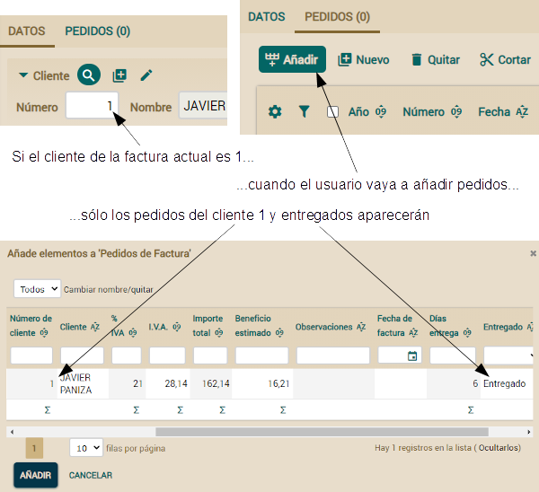\
  Usaremos la anotación *@AddAction* para definir nuestra propia acción que muestre la lista para añadir pedidos. El siguiente código muestra la modificación necesaria en la clase *Factura*:
- **public** **class** **Factura** **extends** **DocumentoComercial** {
 
- `    `**@OneToMany**(mappedBy="factura")
- `    `**@CollectionView**("SinClienteNiFactura") 
- `    `**@AddAction**("Factura.anyadirPedidos") *// Define nuestra propia acción para añadir pedidos*
- `    `Collection<Pedido> pedidos;
	
-     ...
	
- }
- De esta forma tan sencilla definimos la acción a ejecutar cuando el usuario pulsa en el botón para añadir pedidos. El argumento usado para *@AddAction*, *Factura.anyadirPedidos*, es el nombre calificado de la acción, es decir la acción *añadirPedidos* del controlador *Factura* tal como se ha definido en el archivo *controladores.xml*.\
  Ahora hemos de editar *controladores.xml* para añadir el controlador *Factura* (todavía no existe) con nuestra acción:
- <controlador nombre="Factura">
- `    `<hereda-de controlador="Facturacion"/>

- `    `<accion nombre="anyadirPedidos"
- `        `clase="com.tuempresa.facturacion.acciones.IrAnyadirPedidosAFactura"
- `        `oculta="true" icono="table-row-plus-after"/>
- `        `*<!--*
- `        `*oculta="true" : No se mostrará en la barra de botones del módulo*
- `        `*icono="table-row-plus-after" : La misma imagen que la acción estándar*
- `        `*-->*

- </controlador>
- Este es el código de la acción:
- **package** com.tuempresa.facturacion.acciones; *// En el paquete 'acciones'*

- **import** org.openxava.actions.\*; *// Para usar GoAddElementsToCollectionAction*

- **public** **class** **IrAnyadirPedidosAFactura**
- `    `**extends** **GoAddElementsToCollectionAction** { *// Lógica estándar para ir a la lista que*
- `                                              `*// permite añadir elementos a la colección*
- `    `**public** **void** **execute**() **throws** Exception {
- `        `**super**.execute(); *// Ejecuta la lógica estándar, la cual muestra un diálogo*
- `        `**int** numeroCliente =
- `            `getPreviousView() *// getPreviousView() es la vista principal (estamos en un diálogo)*
-                 .getValueInt("cliente.numero"); *// Lee el número de cliente de la*
- `                                                `*// factura actual de la vista*
- `        `getTab().setBaseCondition( *// La condición de la lista de pedidos a añadir*
- `            `"${cliente.numero} = " + numeroCliente +
- `            `" and ${entregado} = true and ${factura} is null"
- `        `);
- `    `}
- }
- Fíjate como usamos *getTab().setBaseCondition()* para establecer la condición de la lista para escoger la entidades a añadir. Es decir, desde una *GoAddElementsToCollectionAction* puedes usar *getTab()* para manipular la forma en que la lista se comporta.
- ### Refinar la acción que añade elementos a la colección
- Una mejora interesante para la colección de pedidos sería que cuando el usuario añada pedidos a la factura actual, las líneas de detalle de estos pedidos se copien automáticamente a la factura.\
  No podemos usar *@AddAction* para esto, porque es la acción que muestra la lista de elementos a añadir a la colección. Pero no es la acción que añade los elementos. En esta sección aprenderemos como definir la acción que realmente añade los elementos:\
  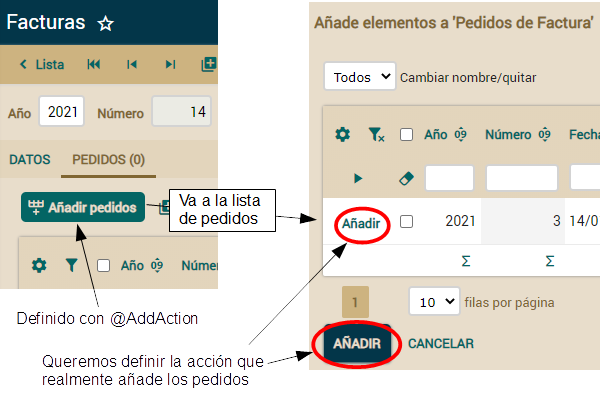\
  Por desgracia, no hay una anotación para definir directamente esta acción de añadir. Sin embargo, no es una tarea demasiado difícil, solo hemos de refinar la acción *@AddAction* instruyéndola para mostrar nuestro propio controlador y en este controlador podemos poner las acciones que queramos. Dado que ya hemos definido nuestra *@AddAction* en la sección anterior solo hemos de añadir un nuevo método a la ya existente *IrAnyadirPedidosAFactura*. Añade el siguiente método *getNextController()* a tu acción:
- **public** **class** **IrAnyadirPedidosAFactura** ... {

-     ...

- `    `**public** String **getNextController**() { *// Añadimos este método*
- `        `**return** "AnyadirPedidosAFactura"; *// El controlador con las acciones disponibles*
- `    `}                                    *// en la lista de pedidos a añadir*
- }
- Por defecto las acciones en la lista de entidades a añadir (los botones AÑADIR y CANCELAR) son del controlador estándar de OpenXava *AddToCollection*. Sobrescribir *getNextController()* en nuestra acción nos permite definir nuestro propio controlador en su lugar. Añade en *controladores.xml* la siguiente definición para nuestro controlador propio para añadir elementos:
- <controlador nombre="AnyadirPedidosAFactura">
- `    `<hereda-de controlador="AddToCollection" /> *<!-- Extiende del controlador estándar -->*
	
- `    `*<!-- Sobrescribe la acción para añadir -->*
- `    `<accion nombre="add"
- `        `clase="com.tuempresa.facturacion.acciones.AnyadirPedidosAFactura" />
		
- </controlador>
- De esta forma la acción para añadir pedidos a la factura será *AnyadirPedidosAFactura*. Recuerda que el objetivo de nuestra acción es añadir los pedidos a la factura de la manera convencional, pero también copiar las líneas de estos pedidos a la factura. Este es el código de la acción:
- **package** com.tuempresa.facturacion.acciones; *// En el paquete 'acciones'*

- **import** java.rmi.\*;
- **import** java.util.\*;
- **import** javax.ejb.\*;
- **import** org.openxava.actions.\*; *// Para usar AddElementsToCollectionAction*
- **import** org.openxava.model.\*;
- **import** org.openxava.util.\*;
- **import** org.openxava.validators.\*;
- **import** com.tuempresa.facturacion.modelo.\*;

- **public** **class** **AnyadirPedidosAFactura**
- `    `**extends** **AddElementsToCollectionAction** { *// Lógica estándar para añadir*
- `                                            `*// elementos a la colección*
- `    `**public** **void** **execute**() **throws** Exception {
- `        `**super**.execute(); *// Usamos la lógica estándar "tal cual"*
- `        `getView().refresh(); *// Para visualizar datos frescos, incluyendo los importes*
- `    `}                        *// recalculados, que dependen de las líneas de detalle*

- `    `**protected** **void** **associateEntity**(Map clave) *// El método llamado para asociar*
- `        `**throws** ValidationException, *// cada entidad a la principal, en este caso para*
- `            `XavaException, ObjectNotFoundException,*// asociar cada pedido a la factura*
- `            `FinderException, RemoteException
- `    `{
- `        `**super**.associateEntity(clave); *// Ejecuta la lógica estándar (1)*
- `        `Pedido pedido = (Pedido) MapFacade.findEntity("Pedido", clave); *// (2)*
- `        `pedido.copiarDetallesAFactura(); *// Delega el trabajo principal en la entidad (3)*
- `    `}
- }
- Sobrescribimos el método *execute()* sólo para refrescar la vista después del proceso. Realmente, lo que nosotros queremos es refinar la lógica de asociar un pedido a la factura. La forma de hacer esto es sobrescribiendo el método *associateEntity()*. La lógica aquí es simple, después de ejecutar la lógica estándar (1) buscamos la entidad *Pedido* correspondiente y entonces llamamos al método *copiarDetallesAFactura()* de ese *Pedido*. Por suerte ya teníamos un método para copiar detalles desde una entidad *Pedido* a la *Factura* especificada, simplemente llamamos a este método.
- Ahora solo has de crear una factura nueva, escoger un cliente y añadir pedidos. Es incluso más fácil de usar que el modo lista del módulo *Pedido* ya que el módulo *Factura* solo se muestran los pedidos adecuados al cliente.

  Esta lección te ha mostrado como refinar el comportamiento estándar de las referencias y colecciones para que tu aplicación se adapte a las necesidades del usuario. Aquí sólo has visto algunos ejemplos ilustrativos. OpenXava ofrece muchas más posibilidades para refinar el comportamiento de las colecciones y referencias, con anotaciones como *@ReferenceView, @ReadOnly, @NoFrame, @NoCreate, @NoModify, @NoSearch, @AsEmbedded, @SearchAction, @DescriptionsList, @LabelFormat, @Action, @OnChange, @OnChangeSearch, @Editor, @CollectionView, @EditOnly, @ListProperties, @RowStyle, @EditAction, @ViewAction, @NewAction, @SaveAction, @HideDetailAction, @RemoveAction, @RemoveSelectedAction, @ListAction, @DetailAction* o *@OnSelectElementAction*. Mira las secciones [Personalización de referencia](C:\Users\Soporte\Documents\openxava\openxava-doc\web\docs\view_es.html#Vista-Personalizacion+de+referencia) y [Personalización de colección](C:\Users\Soporte\Documents\openxava\openxava-doc\web\docs\view_es.html#Vista-Personalizacion+de+coleccion) de la guía de referencia.\
  Y por si esto fuera poco, siempre tienes la opción [definir tu propio editor](C:\Users\Soporte\Documents\openxava\openxava-doc\web\docs\customizing_es.html) para referencias o colecciones. Los editores te permiten crear una interfaz de usuario personalizada para visualizar y editar la referencia o colección.\
  Esta flexibilidad te permite usar la generación automática de la interfaz gráfica para prácticamente cualquier caso posible en las aplicaciones de gestión de la vida real.

